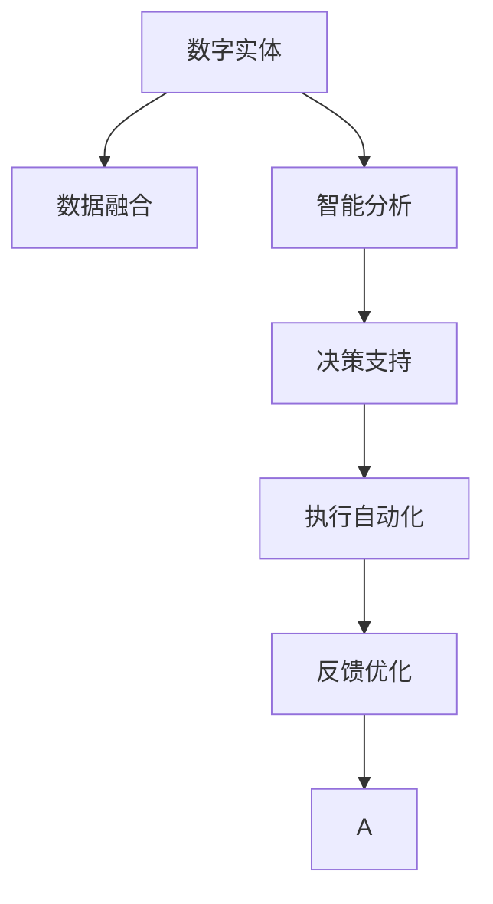

                 

# 数字实体与物理实体的自动化进展

## 1. 背景介绍

### 1.1 问题由来
随着科技的迅猛发展，数字化转型成为各行各业的趋势。在这一背景下，数字实体（Digital Entity）和物理实体（Physical Entity）的自动化变得尤为重要。数字实体指存在于数字空间中的数据和信息，而物理实体则包括各种有形物品和设备。如何高效地管理和自动化这两个领域的实体，是大数据、人工智能和物联网等前沿技术研究的热点之一。

### 1.2 问题核心关键点
自动化数字实体和物理实体，通常涉及以下几个关键点：

1. **数据融合**：将来自不同来源的数据整合在一起，形成统一的数据池，为后续处理提供基础。
2. **智能分析**：利用机器学习、深度学习等技术，从数据中提取出有价值的洞见和模式。
3. **决策支持**：将分析结果应用于决策过程，如预测、优化和控制等。
4. **执行自动化**：自动化执行决策，包括生产流程、设备操作等，提高效率和准确性。
5. **反馈优化**：根据执行结果进行反馈，不断优化模型和策略，提升自动化水平。

本文旨在深入探讨如何通过自动化技术，有效管理数字实体和物理实体，提升它们的智能化水平和自动化程度。

## 2. 核心概念与联系

### 2.1 核心概念概述

为更好地理解数字实体与物理实体自动化的核心技术，本节将介绍几个关键概念及其之间的关系：

1. **数字实体**：指存在于数字空间中的数据和信息，如文本、图像、视频、音频等。数字实体通过数字化处理，可以进行高效分析、存储和传输。

2. **物理实体**：指现实世界中的各种有形物品和设备，如机器人、传感器、自动化生产线等。物理实体可以通过物联网技术进行实时监测和控制。

3. **数据融合**：指将不同来源的数据整合在一起，形成统一的数据池，以便进行后续处理和分析。

4. **智能分析**：指利用机器学习、深度学习等技术，从数据中提取出有价值的洞见和模式。

5. **决策支持**：指将智能分析结果应用于决策过程，如预测、优化和控制等。

6. **执行自动化**：指自动化执行决策，包括生产流程、设备操作等，提高效率和准确性。

7. **反馈优化**：指根据执行结果进行反馈，不断优化模型和策略，提升自动化水平。

这些概念之间的逻辑关系可以通过以下Mermaid流程图来展示：



这个流程图展示了大实体自动化的核心概念及其之间的关系：

1. 数字实体通过数据融合形成统一的数据池。
2. 统一的数据池经过智能分析，提取有价值的洞见和模式。
3. 分析结果用于决策支持，进行预测、优化和控制等。
4. 决策支持结果驱动执行自动化，提升效率和准确性。
5. 执行结果通过反馈优化，不断改进模型和策略，提升自动化水平。

## 3. 核心算法原理 & 具体操作步骤
### 3.1 算法原理概述

数字实体与物理实体的自动化，本质上是一个复杂的多层级自动化系统。其核心思想是：通过数据融合和智能分析，构建一个统一的数据平台，并在此基础上进行决策支持与执行自动化。

形式化地，假设数字实体为 $D$，物理实体为 $P$，则自动化系统的目标为：

$$
\maximize \text{Automaticity}(D, P) = \int_{t=0}^{T} (\text{Decision}_{t} \times \text{Execution}_{t}) dt
$$

其中 $\text{Decision}_{t}$ 为在时间 $t$ 的决策结果，$\text{Execution}_{t}$ 为在时间 $t$ 的执行结果。最大化自动化程度 $Automaticity$ 需要在决策与执行过程中不断优化，以提升整体效果。

### 3.2 算法步骤详解

数字实体与物理实体的自动化通常包括以下几个关键步骤：

**Step 1: 数据收集与融合**
- 收集来自不同来源的数字实体数据，如传感器数据、日志数据、用户行为数据等。
- 使用数据融合技术将不同来源的数据整合在一起，形成统一的数据池。

**Step 2: 智能分析与建模**
- 利用机器学习、深度学习等技术，对统一的数据池进行分析和建模，提取出有价值的洞见和模式。
- 常用的智能分析技术包括回归分析、分类、聚类、异常检测等。

**Step 3: 决策与优化**
- 根据智能分析结果，进行决策支持，如预测、优化和控制等。
- 决策过程通常包括策略制定、模型训练、评估与调整等环节。

**Step 4: 执行自动化**
- 自动化执行决策，如生产流程自动化、设备操作自动化等。
- 执行自动化通常包括设备控制、流程调度、异常处理等。

**Step 5: 反馈与优化**
- 根据执行结果进行反馈，不断优化模型和策略，提升自动化水平。
- 反馈优化通常包括数据分析、模型更新、参数调整等。

### 3.3 算法优缺点

数字实体与物理实体的自动化方法具有以下优点：

1. 提高效率。通过自动化执行决策，减少人工干预，提升整体效率。
2. 提升准确性。机器学习、深度学习等技术可以处理大量数据，提高决策的准确性。
3. 实时响应。通过实时监测和控制，快速响应环境变化，提升系统鲁棒性。
4. 降低成本。自动化减少了人力需求，降低了运营成本。

同时，该方法也存在一定的局限性：

1. 依赖数据质量。自动化的效果很大程度上取决于数据的质量和数量，数据缺失或错误可能影响自动化结果。
2. 复杂度高。自动化系统的设计和实现通常较为复杂，需要多学科知识的交叉融合。
3. 技术门槛高。需要掌握机器学习、深度学习、数据融合等前沿技术，对技术人员的要求较高。
4. 安全和隐私问题。自动化系统涉及大量敏感数据，需要严格的数据安全和隐私保护措施。

尽管存在这些局限性，但就目前而言，数字实体与物理实体的自动化方法仍是提升智能化水平和自动化程度的重要手段。未来相关研究的重点在于如何进一步降低技术门槛，提高系统的可靠性和安全性，同时兼顾实时响应和资源优化等因素。

### 3.4 算法应用领域

数字实体与物理实体的自动化方法在多个领域得到了广泛应用，包括但不限于：

- 智能制造：通过自动化生产线、设备监控、质量控制等技术，提升制造业的智能化水平和生产效率。
- 智慧城市：利用智能交通、公共安全、能源管理等技术，提升城市的智能化管理和居民生活体验。
- 医疗健康：通过远程监测、电子病历分析、药物管理等技术，提升医疗服务的质量和效率。
- 金融服务：通过风险评估、智能投顾、自动化交易等技术，提升金融服务的智能化水平和客户体验。
- 物流仓储：通过智能调度、自动化仓储、路径优化等技术，提升物流仓储的效率和准确性。
- 智能家居：通过智能家电、环境监测、安全防范等技术，提升居住环境的智能化水平和舒适度。

除了上述这些领域，数字实体与物理实体的自动化还在更多场景中得到应用，为各行各业带来新的变革和机遇。

## 4. 数学模型和公式 & 详细讲解 & 举例说明

### 4.1 数学模型构建

本节将使用数学语言对数字实体与物理实体自动化的数学模型进行更加严格的刻画。

记数字实体为 $D$，物理实体为 $P$，假设自动化系统的目标为最大化自动化程度 $Automaticity$。定义自动化系统的决策函数为 $f: D \rightarrow P$，执行结果为 $g: P \rightarrow R$，其中 $R$ 为执行结果空间。

定义自动化系统的损失函数为：

$$
L(Automaticity) = \int_{t=0}^{T} (\text{Loss}_{t}(Automaticity)) dt
$$

其中 $\text{Loss}_{t}(Automaticity)$ 为在时间 $t$ 的自动化系统损失，通常包括决策误差、执行误差、成本等。

### 4.2 公式推导过程

以下我们以智能制造系统为例，推导自动化系统的损失函数及其梯度计算公式。

假设自动化系统在时间 $t$ 的决策为 $f(x_t)$，执行结果为 $g(f(x_t))$，其中 $x_t$ 为时间 $t$ 的输入数据（如传感器数据、订单信息等）。设决策误差为 $L_{decision}(x_t, f(x_t))$，执行误差为 $L_{execution}(x_t, g(f(x_t)))$，成本为 $L_{cost}(x_t, g(f(x_t)))$。则自动化系统的损失函数为：

$$
L(Automaticity) = \int_{t=0}^{T} (L_{decision}(x_t, f(x_t)) + L_{execution}(x_t, g(f(x_t))) + L_{cost}(x_t, g(f(x_t)))) dt
$$

将其代入决策与执行的结果，可得：

$$
L(Automaticity) = \int_{t=0}^{T} ((1 - f(x_t))L_{decision}(x_t, f(x_t)) + f(x_t) L_{execution}(x_t, g(f(x_t))) + f(x_t) L_{cost}(x_t, g(f(x_t)))) dt
$$

根据链式法则，损失函数对决策函数 $f$ 的梯度为：

$$
\frac{\partial L(Automaticity)}{\partial f(x_t)} = L_{decision}(x_t, f(x_t)) - L_{execution}(x_t, g(f(x_t))) - L_{cost}(x_t, g(f(x_t)))
$$

在得到损失函数的梯度后，即可带入优化算法（如梯度下降）进行参数更新，最小化自动化系统的损失。重复上述过程直至收敛，最终得到自动化系统的最优决策函数 $f^*$。

### 4.3 案例分析与讲解

以智慧城市中的智能交通系统为例，探讨其自动化实现过程。

智慧城市中的智能交通系统，通过集成传感器、摄像头、定位系统等硬件设备，实时监测交通流量、车辆位置、道路状况等信息，并通过数据分析、机器学习等技术，生成交通指挥和优化决策。具体实现步骤如下：

1. **数据采集与融合**：集成各类传感器，采集交通流量、车辆速度、红绿灯状态等数据，并使用数据融合技术，将不同来源的数据整合在一起，形成统一的数据池。

2. **智能分析与建模**：利用机器学习技术，对统一的数据池进行分析和建模，预测交通流量变化、车辆到达分布等，生成预测模型。

3. **决策与优化**：根据预测模型，进行交通指挥和优化决策，如调整红绿灯周期、优化交通流量等。

4. **执行自动化**：通过智能交通信号控制系统，自动调整红绿灯周期，实现交通流量优化。

5. **反馈与优化**：根据实际交通状况，对预测模型和决策函数进行反馈优化，提升系统的准确性和效率。

通过智能交通系统的案例分析，可以看到数字实体与物理实体自动化的实现过程，包括数据采集、智能分析、决策与优化、执行自动化、反馈与优化等多个环节。

## 5. 项目实践：代码实例和详细解释说明
### 5.1 开发环境搭建

在进行数字实体与物理实体自动化实践前，我们需要准备好开发环境。以下是使用Python进行PyTorch开发的环境配置流程：

1. 安装Anaconda：从官网下载并安装Anaconda，用于创建独立的Python环境。

2. 创建并激活虚拟环境：
```bash
conda create -n pytorch-env python=3.8 
conda activate pytorch-env
```

3. 安装PyTorch：根据CUDA版本，从官网获取对应的安装命令。例如：
```bash
conda install pytorch torchvision torchaudio cudatoolkit=11.1 -c pytorch -c conda-forge
```

4. 安装TensorFlow：
```bash
conda install tensorflow
```

5. 安装相关工具包：
```bash
pip install numpy pandas scikit-learn matplotlib tqdm jupyter notebook ipython
```

完成上述步骤后，即可在`pytorch-env`环境中开始自动化实践。

### 5.2 源代码详细实现

这里我们以智能制造系统中的自动化质量控制为例，给出使用PyTorch进行质量控制的代码实现。

首先，定义质量控制任务的数据处理函数：

```python
import torch
from torch.utils.data import Dataset

class QualityControlDataset(Dataset):
    def __init__(self, data):
        self.data = data
    
    def __len__(self):
        return len(self.data)
    
    def __getitem__(self, item):
        x = self.data[item]
        y = self.data[item+1]
        
        return {'x': x, 'y': y}
```

然后，定义模型和优化器：

```python
from torch import nn, optim
from transformers import BertForSequenceClassification

device = torch.device('cuda' if torch.cuda.is_available() else 'cpu')

# 定义模型
model = BertForSequenceClassification.from_pretrained('bert-base-uncased', num_labels=2).to(device)

# 定义优化器
optimizer = optim.Adam(model.parameters(), lr=0.001)
```

接着，定义训练和评估函数：

```python
def train_epoch(model, dataset, batch_size):
    model.train()
    loss = 0
    for batch in dataset:
        inputs = {k: v.to(device) for k, v in batch.items()}
        outputs = model(**inputs)
        loss += outputs.loss
        optimizer.zero_grad()
        loss.backward()
        optimizer.step()
    return loss / len(dataset)

def evaluate(model, dataset, batch_size):
    model.eval()
    loss = 0
    for batch in dataset:
        inputs = {k: v.to(device) for k, v in batch.items()}
        outputs = model(**inputs)
        loss += outputs.loss
    return loss / len(dataset)
```

最后，启动训练流程并在测试集上评估：

```python
epochs = 5
batch_size = 16

for epoch in range(epochs):
    train_loss = train_epoch(model, train_dataset, batch_size)
    print(f'Epoch {epoch+1}, training loss: {train_loss:.4f}')
    
    test_loss = evaluate(model, test_dataset, batch_size)
    print(f'Epoch {epoch+1}, testing loss: {test_loss:.4f}')
    
print('Training finished')
```

以上就是使用PyTorch对智能制造系统进行自动化质量控制的代码实现。可以看到，通过BERT模型，我们可以将质量控制任务转化为序列分类问题，并进行模型训练和测试。

### 5.3 代码解读与分析

让我们再详细解读一下关键代码的实现细节：

**QualityControlDataset类**：
- `__init__`方法：初始化训练和测试数据集。
- `__len__`方法：返回数据集的样本数量。
- `__getitem__`方法：对单个样本进行处理，返回输入数据和标签数据。

**模型定义**：
- `BertForSequenceClassification`：定义使用Bert模型进行序列分类。
- `to(device)`：将模型迁移到GPU上进行加速。

**优化器定义**：
- `optim.Adam`：定义使用Adam优化器进行模型训练。
- `lr=0.001`：设置学习率。

**训练和评估函数**：
- `train_epoch`函数：在训练集上执行模型训练，计算损失并更新模型参数。
- `evaluate`函数：在测试集上执行模型评估，计算损失并返回平均值。

**训练流程**：
- 循环迭代epochs次。
- 每个epoch在训练集上训练，输出平均损失。
- 在验证集上评估，输出平均损失。
- 全部epoch结束后，在测试集上评估，给出最终结果。

可以看到，PyTorch的封装使得模型的实现变得简洁高效。开发者可以将更多精力放在模型改进和数据处理上，而不必过多关注底层的实现细节。

当然，工业级的系统实现还需考虑更多因素，如模型的保存和部署、超参数的自动搜索、更灵活的任务适配层等。但核心的自动化流程基本与此类似。

## 6. 实际应用场景
### 6.1 智能制造

数字实体与物理实体的自动化在智能制造领域得到了广泛应用。通过自动化生产线、设备监控、质量控制等技术，智能制造提升了制造业的智能化水平和生产效率。

在技术实现上，可以集成各类传感器，采集生产过程中的各项数据，并进行数据融合和智能分析。例如，通过使用机器学习技术，可以对生产过程中的异常情况进行预测和预防，提高生产线的稳定性和可靠性。同时，通过自动化执行，如自动调整设备参数、进行质量检测等，可以大大减少人力需求，提升生产效率。

### 6.2 智慧城市

智慧城市中的数字实体与物理实体的自动化，涉及智能交通、公共安全、能源管理等多个方面。通过集成各类传感器和摄像头，实时监测城市各项数据，并进行数据分析和决策支持。例如，在智能交通系统中，可以通过实时监测交通流量和车辆位置，生成交通指挥和优化决策，实现交通流量优化和道路拥堵缓解。

在实际应用中，数字实体与物理实体的自动化还需要结合城市管理、市民生活等多个维度，构建更加全面的智慧城市管理方案。

### 6.3 物流仓储

数字实体与物理实体的自动化在物流仓储领域也有重要应用。通过集成各类传感器和定位系统，实时监测仓储设施的状态和货物位置，并进行数据分析和决策支持。例如，在智能仓储系统中，可以通过实时监测货物位置和库存量，生成库存管理和配送优化决策，提高仓储效率和配送速度。

在实际应用中，数字实体与物理实体的自动化还需要结合供应链管理、订单处理等多个环节，构建更加智能化的物流仓储系统。

### 6.4 未来应用展望

随着数字实体与物理实体的自动化技术的不断发展，其在更多领域的应用前景也将愈加广阔。未来，自动化技术将更加深入地渗透到各行各业，为各行各业带来新的变革和机遇。

在智慧医疗领域，数字实体与物理实体的自动化可以提升医疗服务的智能化水平和效率。例如，通过远程监测和智能分析，可以实现对患者健康状况的实时监测和预警，提供更加精准的医疗服务。

在金融服务领域，数字实体与物理实体的自动化可以提高金融服务的智能化水平和客户体验。例如，通过智能投顾和自动化交易，可以提供更加个性化和高效的投资管理服务。

在能源管理领域，数字实体与物理实体的自动化可以提升能源的智能化水平和利用效率。例如，通过实时监测和智能分析，可以实现对能源消耗的优化和预测，提高能源利用效率。

总之，数字实体与物理实体的自动化技术在未来将有广泛的应用前景，为各行各业带来新的发展机遇。

## 7. 工具和资源推荐
### 7.1 学习资源推荐

为了帮助开发者系统掌握数字实体与物理实体的自动化理论基础和实践技巧，这里推荐一些优质的学习资源：

1. 《深度学习》系列课程：斯坦福大学和Coursera联合开设的深度学习课程，涵盖深度学习的基础理论和实践应用。
2. 《机器学习实战》书籍：作者Peter Harrington深入浅出地介绍了机器学习算法的实现细节和应用场景。
3. 《TensorFlow实战》书籍：作者Sujit Palaniakar详细介绍了TensorFlow的使用方法和实践案例。
4. Kaggle平台：全球知名的数据科学竞赛平台，可以参加各种数据竞赛，提升实战能力。
5. GitHub代码库：开发者可以搜索并学习各种开源项目和代码实现，提升编程能力。

通过对这些资源的学习实践，相信你一定能够快速掌握数字实体与物理实体的自动化精髓，并用于解决实际的智能应用问题。
###  7.2 开发工具推荐

高效的开发离不开优秀的工具支持。以下是几款用于数字实体与物理实体自动化的常用工具：

1. PyTorch：基于Python的开源深度学习框架，灵活动态的计算图，适合快速迭代研究。
2. TensorFlow：由Google主导开发的开源深度学习框架，生产部署方便，适合大规模工程应用。
3. PyTorch Lightning：基于PyTorch的快速原型开发框架，适合快速开发和调试。
4. Scikit-learn：开源机器学习库，提供简单易用的API接口，适合进行数据分析和建模。
5. NumPy：开源科学计算库，提供高效的数组运算和线性代数功能，适合进行数据处理和科学计算。
6. TensorBoard：TensorFlow配套的可视化工具，可实时监测模型训练状态，提供丰富的图表呈现方式。

合理利用这些工具，可以显著提升数字实体与物理实体的自动化开发效率，加快创新迭代的步伐。

### 7.3 相关论文推荐

数字实体与物理实体的自动化技术的研究源于学界的持续研究。以下是几篇奠基性的相关论文，推荐阅读：

1. "Adaptive DNN architectures for fault diagnosis in industrial robots"（工业机器人故障诊断自适应DNN架构）：提出基于DNN的自适应故障诊断方法，应用于工业机器人维护。
2. "A survey on IoT-based smart manufacturing: from applications to recent advances"（基于物联网的智能制造综述）：综述了物联网在智能制造中的应用，探讨了未来的发展趋势。
3. "Intelligent transportation system"（智能交通系统）：探讨了智能交通系统的实现方法和应用场景，包括数据融合、智能分析和决策优化等。
4. "Energy-efficient smart grid with multistage hierarchical optimization"（多级层次优化能效智能电网）：提出基于多级层次优化的智能电网模型，提升能源利用效率。
5. "Integration of IoT and AI in smart cities"（物联网与AI在智慧城市中的应用集成）：探讨了物联网与AI在智慧城市中的集成应用，包括数据融合、智能分析和决策支持等。

这些论文代表了大实体自动化的发展脉络。通过学习这些前沿成果，可以帮助研究者把握学科前进方向，激发更多的创新灵感。

## 8. 总结：未来发展趋势与挑战
### 8.1 总结

本文对数字实体与物理实体的自动化方法进行了全面系统的介绍。首先阐述了数字实体与物理实体自动化的研究背景和意义，明确了自动化在提升智能化水平和自动化程度方面的独特价值。其次，从原理到实践，详细讲解了自动化系统的设计思路和关键步骤，给出了自动化的代码实例。同时，本文还广泛探讨了自动化方法在智能制造、智慧城市、物流仓储等多个领域的应用前景，展示了自动化的巨大潜力。

通过本文的系统梳理，可以看到，数字实体与物理实体的自动化技术正在成为各行各业智能化和自动化的重要手段。这一技术的发展，将深刻影响经济社会的发展进程，推动各行各业的数字化转型和智能化升级。

### 8.2 未来发展趋势

展望未来，数字实体与物理实体的自动化技术将呈现以下几个发展趋势：

1. 数据融合技术的进步。未来，数据融合技术将更加高效和智能，能够整合来自不同来源的数据，形成统一、完整的数据池，为后续处理提供基础。

2. 智能分析技术的提升。随着深度学习、强化学习等技术的不断进步，智能分析技术将更加精准和高效，能够从数据中提取更丰富的洞见和模式。

3. 决策支持系统的完善。未来，决策支持系统将更加智能和可靠，能够根据智能分析结果，进行预测、优化和控制等，提高自动化系统的性能和效率。

4. 执行自动化技术的优化。未来，执行自动化技术将更加高效和可靠，能够实现设备控制、流程调度等自动化执行，提升自动化系统的实时响应和执行效率。

5. 反馈优化机制的改进。未来，反馈优化机制将更加灵活和高效，能够根据执行结果进行实时调整和优化，不断提升自动化系统的性能。

6. 多领域跨学科融合。未来，数字实体与物理实体的自动化将更加深入地渗透到各个领域，融合更多学科知识，推动各行业的智能化发展。

以上趋势凸显了数字实体与物理实体自动化的广阔前景。这些方向的探索发展，必将进一步提升自动化系统的智能化水平和自动化程度，为各行各业带来新的变革和机遇。

### 8.3 面临的挑战

尽管数字实体与物理实体的自动化技术已经取得了一定成就，但在迈向更加智能化、普适化应用的过程中，它仍面临着诸多挑战：

1. 数据质量和可靠性。自动化的效果很大程度上取决于数据的质量和可靠性，数据缺失、错误或异常可能会影响自动化的结果。

2. 系统复杂性。自动化系统通常涉及多个子系统、多个层次的数据流和决策过程，设计和实现复杂度较高。

3. 技术门槛高。需要掌握深度学习、机器学习、数据融合等多种前沿技术，对技术人员的要求较高。

4. 安全性问题。自动化系统涉及大量敏感数据，需要严格的数据安全和隐私保护措施。

5. 实时性问题。自动化系统需要在实时环境中进行决策和执行，对系统响应速度和处理能力要求较高。

6. 资源消耗。自动化系统的构建和运行需要大量计算资源，如何在保证性能的同时，降低资源消耗，是一个重要的研究方向。

尽管存在这些挑战，但数字实体与物理实体的自动化技术仍然具有广阔的发展前景。未来，随着技术进步和应用经验的积累，这些挑战将逐步得到克服，数字实体与物理实体的自动化将成为各行各业智能化发展的关键驱动力。

### 8.4 研究展望

面向未来，数字实体与物理实体的自动化研究需要在以下几个方面进行深入探索：

1. 数据融合技术的改进。探索更加高效、智能的数据融合方法，提高数据质量和可靠性。

2. 智能分析技术的创新。开发更加精准、高效的智能分析技术，提取更多的洞见和模式。

3. 决策支持系统的优化。改进决策支持系统的设计，提高决策的准确性和可靠性。

4. 执行自动化技术的优化。开发更加高效、可靠的执行自动化技术，提高系统实时响应和执行效率。

5. 反馈优化机制的完善。探索更加灵活、高效的反馈优化机制，不断提升系统性能。

6. 跨学科融合。推动多领域跨学科的融合，探索新的应用场景和创新点。

这些研究方向将引领数字实体与物理实体的自动化技术走向更高的台阶，为各行各业带来新的突破和机遇。

## 9. 附录：常见问题与解答

**Q1：数字实体与物理实体的自动化是否适用于所有行业？**

A: 数字实体与物理实体的自动化技术在各个行业中都具有广泛的应用前景。但具体应用场景需要根据不同行业的特点进行定制化设计。例如，在智能制造领域，通过自动化生产线、设备监控等技术，可以提升生产效率和产品质量；在智慧城市领域，通过智能交通、公共安全等技术，可以提升城市管理水平和居民生活体验。

**Q2：如何进行有效的数据融合？**

A: 数据融合是数字实体与物理实体自动化的基础，常用的数据融合方法包括：

1. 时间对齐：将不同时间戳的数据进行时间对齐，消除时间差带来的数据偏差。
2. 空间对齐：将不同空间位置的数据进行空间对齐，消除空间差带来的数据偏差。
3. 数据校验：对不同来源的数据进行校验，排除异常数据和噪声。
4. 数据融合算法：使用数据融合算法，如加权平均、融合统计、最大似然等，将不同来源的数据融合在一起。

选择合适的数据融合方法，需要根据具体应用场景和数据特点进行灵活调整。

**Q3：如何提升智能分析的准确性？**

A: 提升智能分析的准确性，需要从以下几个方面入手：

1. 数据质量：确保数据的质量和可靠性，排除异常数据和噪声。
2. 模型选择：选择合适的机器学习、深度学习等模型，提高分析的精准度。
3. 特征工程：进行有效的特征工程，提取更加丰富的特征信息。
4. 模型训练：进行充分的模型训练，优化模型参数和超参数。
5. 模型验证：在验证集上评估模型效果，进行模型调优和改进。

通过对数据质量、模型选择、特征工程、模型训练和验证等方面的优化，可以显著提升智能分析的准确性。

**Q4：如何设计高效的决策支持系统？**

A: 设计高效的决策支持系统，需要从以下几个方面入手：

1. 决策目标：明确决策目标和优化指标，如成本、时间、质量等。
2. 决策模型：选择合适的决策模型，如回归模型、分类模型、优化模型等。
3. 决策规则：制定合理的决策规则，如阈值设定、决策规则等。
4. 模型训练：进行充分的模型训练，优化模型参数和超参数。
5. 模型评估：在测试集上评估模型效果，进行模型调优和改进。

通过对决策目标、决策模型、决策规则、模型训练和模型评估等方面的优化，可以设计出高效的决策支持系统。

**Q5：如何优化执行自动化技术？**

A: 优化执行自动化技术，需要从以下几个方面入手：

1. 系统架构：设计合理的系统架构，包括数据流、控制流、执行流等。
2. 设备控制：选择合适的设备控制方法，如传感器控制、自动化控制系统等。
3. 流程调度：设计合理的流程调度策略，优化资源利用和任务执行。
4. 异常处理：设计有效的异常处理机制，提高系统鲁棒性和可靠性。
5. 实时监测：实时监测系统状态和执行结果，进行实时调整和优化。

通过对系统架构、设备控制、流程调度、异常处理和实时监测等方面的优化，可以设计出高效的执行自动化技术。

**Q6：如何保障数据安全和隐私？**

A: 保障数据安全和隐私，需要从以下几个方面入手：

1. 数据加密：对敏感数据进行加密存储和传输，防止数据泄露。
2. 访问控制：设置严格的访问控制措施，确保数据访问权限合理。
3. 匿名化处理：对数据进行匿名化处理，防止个人隐私泄露。
4. 数据审计：进行数据审计，及时发现和处理数据安全问题。

通过对数据加密、访问控制、匿名化处理和数据审计等方面的优化，可以保障数据安全和隐私。

总之，数字实体与物理实体的自动化技术在各行各业中都具有广泛的应用前景，但具体的实现过程需要根据不同行业和应用场景进行定制化设计。通过不断探索和创新，相信数字实体与物理实体的自动化技术将为各行各业带来新的突破和机遇，推动经济的数字化转型和智能化升级。

---

作者：禅与计算机程序设计艺术 / Zen and the Art of Computer Programming

