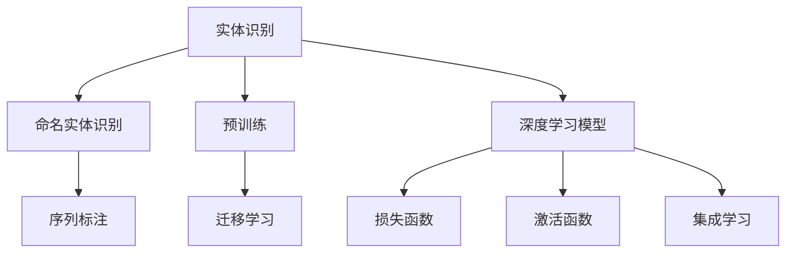

                 

# 数字实体的自动化进展与应用

## 1. 背景介绍

### 1.1 问题由来

在数字化时代，数据驱动成为企业获取竞争优势的重要手段。然而，数据的多样性和复杂性也使得数据管理、分析和应用成为一项艰巨的任务。实体识别作为自然语言处理领域的一项关键技术，能够自动从文本中提取有价值的实体信息，如人名、地点、组织等，广泛应用于信息抽取、关系推理、智能问答等多个领域。

近年来，随着深度学习技术的发展，数字实体的自动化识别技术取得了长足进步。尤其是基于深度学习的实体识别模型，通过大规模语料库的预训练，显著提高了实体识别的准确率和泛化能力，为实际应用提供了有力支持。

### 1.2 问题核心关键点

数字实体识别技术可以分为两类：基于规则的实体识别和基于统计的实体识别。前者依赖于手工定义的规则和词典，虽然准确率高，但适用范围有限，且维护成本高。后者基于机器学习模型，通过标注数据进行训练，能够自动学习实体模式，适用于大规模数据处理，但模型泛化能力、鲁棒性等仍需进一步提升。

本博文将重点讨论基于深度学习的数字实体识别技术的进展和应用，介绍一些先进的实体识别算法和模型，探讨其核心原理和优化方法，并通过实际项目实践加以展示。

### 1.3 问题研究意义

数字实体识别技术在信息抽取、关系推理、智能问答、情感分析等诸多NLP任务上具有广泛应用。准确识别数字实体，能够显著提升这些任务的性能，带来显著的商业价值和社会效益。通过实体识别，企业可以更有效地管理信息，快速响应市场变化，提升服务质量和用户满意度。同时，基于实体的知识图谱和关系网络，可以进一步支撑决策分析、推荐系统、智能客服等应用场景，推动企业数字化转型的进程。

## 2. 核心概念与联系

### 2.1 核心概念概述

为更好地理解数字实体识别技术，本节将介绍几个关键概念：

- 实体识别(Entity Recognition)：指从文本中自动识别出具有特定意义的实体，如人名、地点、组织等。
- 命名实体识别(Named Entity Recognition, NER)：实体识别中最重要的任务之一，指识别出文本中的命名实体并标注其类型。
- 预训练(Pre-training)：指在大规模无标签文本数据上，通过自监督学习任务训练实体识别模型的过程。
- 迁移学习(Transfer Learning)：指将一个领域学到的知识，迁移应用到另一个不同但相关的领域的学习范式。
- 序列标注(Sequence Labeling)：将文本序列中的每个元素标注为特定类别，如实体和非实体。
- 深度学习模型：如CNN、RNN、Transformer等，通过多层网络结构，从大规模语料中自动学习实体识别规律。
- 损失函数(Loss Function)：用于衡量模型输出与真实标签之间的差异，如交叉熵、F1-Score等。
- 激活函数(Activation Function)：如ReLU、Sigmoid等，引入非线性特性，增强模型表达能力。
- 集成学习(Ensemble Learning)：通过多个模型的集成，提升实体识别的鲁棒性和泛化能力。

这些核心概念之间的逻辑关系可以通过以下Mermaid流程图来展示：



这个流程图展示了实体识别技术的主要组成和流程：

1. 实体识别基于命名实体识别，自动识别文本中的命名实体。
2. 预训练通过自监督学习任务训练模型，学习通用的语言表示。
3. 迁移学习将预训练模型应用到具体任务，提升模型泛化能力。
4. 深度学习模型利用多层网络结构，从大规模语料中学习实体识别规律。
5. 损失函数衡量模型输出与真实标签的差异，指导模型优化。
6. 激活函数增强模型的表达能力，引入非线性特性。
7. 集成学习通过多个模型的集成，提升实体识别的鲁棒性。

这些概念共同构成了数字实体识别技术的核心框架，使其能够从文本中自动抽取有价值的实体信息，支撑各种实际应用场景。

## 3. 核心算法原理 & 具体操作步骤

### 3.1 算法原理概述

基于深度学习的数字实体识别算法，通常采用序列标注任务的形式。即输入一段文本，输出每个位置是否为实体，并标注其具体类型（如人名、地点、组织等）。常见的模型结构包括RNN、CNN和Transformer等，具体流程如下：

1. **预训练阶段**：使用大规模无标签语料库，通过自监督学习任务（如语言模型、掩码预测等）训练基础语言模型。
2. **微调阶段**：将预训练模型应用于实体识别任务，在少量标注数据上微调模型参数，学习识别实体模式。
3. **序列标注**：将预训练或微调后的模型应用于新文本，每个位置的实体与否及具体类型作为标注输出。
4. **后处理**：对模型输出进行后处理，如去噪、融合、规范化等，生成最终实体识别结果。

### 3.2 算法步骤详解

以下详细介绍数字实体识别算法的详细步骤：

**Step 1: 数据预处理**

1. 数据清洗：去除噪声数据，如非标准的实体名称、停用词、标点符号等。
2. 分词：将文本分词为词或子词，便于模型识别。
3. 标注：根据实体类别，手动或自动标注文本中实体的位置和类型。

**Step 2: 模型构建**

1. 选择模型架构：如使用CNN、RNN、Transformer等。
2. 定义输入和输出：输入为文本序列，输出为每个位置的实体与否及具体类型。
3. 设计损失函数：如交叉熵损失、F1-Score损失等，衡量模型预测与真实标签之间的差异。

**Step 3: 预训练阶段**

1. 准备语料库：选择大规模无标签文本数据，如维基百科、新闻、评论等。
2. 定义预训练任务：如语言模型预测、掩码预测等，训练基础语言模型。
3. 模型训练：使用GPU/TPU等硬件设备进行预训练，并定期保存模型参数。

**Step 4: 微调阶段**

1. 准备标注数据：收集目标领域下的标注数据集，如新闻、社交媒体、商品评论等。
2. 定义微调目标：如识别人名、地点、组织等。
3. 微调模型：在预训练模型基础上，使用微调数据集进行有监督训练，优化模型参数。
4. 评估微调效果：在验证集上评估模型性能，调整超参数。

**Step 5: 序列标注**

1. 输入文本：将待识别文本输入微调后的模型。
2. 预测实体：模型输出每个位置的实体与否及类型。
3. 后处理：对模型输出进行后处理，如去噪、融合等。

**Step 6: 应用与优化**

1. 应用场景：将实体识别结果应用于信息抽取、关系推理、智能问答等场景。
2. 效果评估：在实际应用中，定期评估实体识别效果，进行模型迭代和优化。

### 3.3 算法优缺点

基于深度学习的数字实体识别算法具有以下优点：

1. 自动化程度高：模型能够自动学习实体识别规律，减少人工标注和维护成本。
2. 泛化能力强：通过大规模语料库的预训练和微调，模型能够在多种场景下稳定表现。
3. 适应性广：支持多种语言和多种领域，能够快速适应新的应用场景。
4. 可解释性强：通过注意力机制和可视化工具，可以直观了解模型决策过程。

同时，该算法也存在一定的局限性：

1. 对标注数据依赖：模型的性能很大程度上依赖于标注数据的质量和数量，标注数据不足时效果不佳。
2. 模型复杂度高：深度学习模型通常包含大量参数，训练和推理成本较高。
3. 容易受噪声影响：噪声数据可能干扰模型训练，导致误识别或漏识别。
4. 解释性不足：部分深度学习模型缺乏可解释性，难以理解其内部决策逻辑。

尽管存在这些局限性，但总体而言，基于深度学习的数字实体识别算法是目前最为先进和有效的实体识别方法之一。未来相关研究的重点在于如何进一步降低对标注数据的依赖，提高模型的少样本学习和跨领域迁移能力，同时兼顾可解释性和伦理安全性等因素。

### 3.4 算法应用领域

数字实体识别技术广泛应用于多个领域，以下是其主要应用场景：

- 信息抽取：从非结构化文本中抽取结构化信息，如新闻摘要、金融数据、社交媒体分析等。
- 关系推理：从文本中提取实体及其关系，构建知识图谱，支撑问答系统和推荐系统。
- 智能问答：理解用户问题，从知识库中提取相关实体，生成智能回答。
- 舆情分析：自动抽取和分析新闻、评论等文本中的实体信息，支撑舆情监测和舆情分析。
- 命名实体消歧：从文本中识别出同名实体的不同实例，提升实体识别的准确率。
- 医疗信息提取：从医疗文本中提取医生、疾病、药品等关键实体，支撑医疗决策和研究。
- 金融信息提取：从金融新闻、公告等文本中提取公司、股票、产品等关键实体，支撑投资决策和分析。

除了上述这些经典应用外，数字实体识别技术还在更多场景中得到创新性应用，如可控文本生成、情感分析、机器翻译、代码生成等，为NLP技术带来了全新的突破。随着实体识别技术的不断进步，相信NLP技术将在更广阔的应用领域大放异彩。

## 4. 数学模型和公式 & 详细讲解 & 举例说明

### 4.1 数学模型构建

本节将使用数学语言对数字实体识别算法的核心流程进行严格刻画。

记输入文本为 $X = \{x_1, x_2, ..., x_n\}$，每个单词的向量表示为 $x_i \in \mathbb{R}^d$。假设实体类别数为 $C$，实体识别模型的输出为 $Y = \{y_1, y_2, ..., y_n\}$，其中 $y_i \in [0, 1]$ 表示第 $i$ 个位置是否为实体，$y_i \in [0, C]$ 表示具体实体类型。

定义模型 $M_{\theta}:\mathcal{X} \rightarrow \mathcal{Y}$，其中 $\theta$ 为模型参数。在训练阶段，模型的损失函数 $\mathcal{L}$ 为：

$$
\mathcal{L}(\theta) = -\frac{1}{N} \sum_{i=1}^N \log p(y_i | x_i)
$$

其中 $p(y_i | x_i)$ 为模型在输入 $x_i$ 下预测 $y_i$ 的概率，可以采用条件概率的形式表示：

$$
p(y_i = 1 | x_i) = \sigma(W_h x_i + b_h)
$$

$$
p(y_i = c | x_i) = \sigma(W_c x_i + b_c)
$$

其中 $W_h, b_h$ 和 $W_c, b_c$ 为模型参数，$\sigma$ 为激活函数，如ReLU、Sigmoid等。

### 4.2 公式推导过程

以下我们以二分类任务（人名识别）为例，推导二分类交叉熵损失函数及其梯度的计算公式。

假设模型 $M_{\theta}$ 在输入 $x$ 上的输出为 $\hat{y}=M_{\theta}(x) \in [0,1]$，表示样本为实体的概率。真实标签 $y \in \{0,1\}$。则二分类交叉熵损失函数定义为：

$$
\ell(M_{\theta}(x),y) = -[y\log \hat{y} + (1-y)\log (1-\hat{y})]
$$

将其代入经验风险公式，得：

$$
\mathcal{L}(\theta) = -\frac{1}{N}\sum_{i=1}^N [y_i\log M_{\theta}(x_i)+(1-y_i)\log(1-M_{\theta}(x_i))]
$$

根据链式法则，损失函数对参数 $\theta_k$ 的梯度为：

$$
\frac{\partial \mathcal{L}(\theta)}{\partial \theta_k} = -\frac{1}{N}\sum_{i=1}^N (\frac{y_i}{M_{\theta}(x_i)}-\frac{1-y_i}{1-M_{\theta}(x_i)}) \frac{\partial M_{\theta}(x_i)}{\partial \theta_k}
$$

其中 $\frac{\partial M_{\theta}(x_i)}{\partial \theta_k}$ 可进一步递归展开，利用自动微分技术完成计算。

在得到损失函数的梯度后，即可带入参数更新公式，完成模型的迭代优化。重复上述过程直至收敛，最终得到适应下游任务的最优模型参数 $\theta^*$。

## 5. 项目实践：代码实例和详细解释说明

### 5.1 开发环境搭建

在进行实体识别实践前，我们需要准备好开发环境。以下是使用Python进行PyTorch开发的环境配置流程：

1. 安装Anaconda：从官网下载并安装Anaconda，用于创建独立的Python环境。

2. 创建并激活虚拟环境：
```bash
conda create -n pytorch-env python=3.8 
conda activate pytorch-env
```

3. 安装PyTorch：根据CUDA版本，从官网获取对应的安装命令。例如：
```bash
conda install pytorch torchvision torchaudio cudatoolkit=11.1 -c pytorch -c conda-forge
```

4. 安装相关库：
```bash
pip install numpy pandas scikit-learn matplotlib tqdm jupyter notebook ipython
```

5. 安装huggingface的BERT库：
```bash
pip install transformers
```

完成上述步骤后，即可在`pytorch-env`环境中开始实体识别实践。

### 5.2 源代码详细实现

这里以使用BERT模型进行人名识别的为例，给出完整的代码实现：

```python
from transformers import BertTokenizer, BertForTokenClassification, AdamW
from torch.utils.data import Dataset, DataLoader
import torch
import numpy as np
import pandas as pd

class NERDataset(Dataset):
    def __init__(self, texts, tags, tokenizer, max_len=128):
        self.texts = texts
        self.tags = tags
        self.tokenizer = tokenizer
        self.max_len = max_len
        
    def __len__(self):
        return len(self.texts)
    
    def __getitem__(self, item):
        text = self.texts[item]
        tags = self.tags[item]
        
        encoding = self.tokenizer(text, return_tensors='pt', max_length=self.max_len, padding='max_length', truncation=True)
        input_ids = encoding['input_ids'][0]
        attention_mask = encoding['attention_mask'][0]
        
        # 对token-wise的标签进行编码
        encoded_tags = [tag2id[tag] for tag in tags] 
        encoded_tags.extend([tag2id['O']] * (self.max_len - len(encoded_tags)))
        labels = torch.tensor(encoded_tags, dtype=torch.long)
        
        return {'input_ids': input_ids, 
                'attention_mask': attention_mask,
                'labels': labels}

# 标签与id的映射
tag2id = {'O': 0, 'B-PER': 1, 'I-PER': 2}
id2tag = {v: k for k, v in tag2id.items()}

# 创建dataset
tokenizer = BertTokenizer.from_pretrained('bert-base-cased')

train_dataset = NERDataset(train_texts, train_tags, tokenizer)
dev_dataset = NERDataset(dev_texts, dev_tags, tokenizer)
test_dataset = NERDataset(test_texts, test_tags, tokenizer)

# 定义模型
model = BertForTokenClassification.from_pretrained('bert-base-cased', num_labels=len(tag2id))

# 定义优化器
optimizer = AdamW(model.parameters(), lr=2e-5)

# 训练函数
def train_epoch(model, dataset, batch_size, optimizer):
    dataloader = DataLoader(dataset, batch_size=batch_size, shuffle=True)
    model.train()
    epoch_loss = 0
    for batch in dataloader:
        input_ids = batch['input_ids'].to(device)
        attention_mask = batch['attention_mask'].to(device)
        labels = batch['labels'].to(device)
        model.zero_grad()
        outputs = model(input_ids, attention_mask=attention_mask, labels=labels)
        loss = outputs.loss
        epoch_loss += loss.item()
        loss.backward()
        optimizer.step()
    return epoch_loss / len(dataloader)

# 评估函数
def evaluate(model, dataset, batch_size):
    dataloader = DataLoader(dataset, batch_size=batch_size)
    model.eval()
    preds, labels = [], []
    with torch.no_grad():
        for batch in dataloader:
            input_ids = batch['input_ids'].to(device)
            attention_mask = batch['attention_mask'].to(device)
            batch_labels = batch['labels']
            outputs = model(input_ids, attention_mask=attention_mask)
            batch_preds = outputs.logits.argmax(dim=2).to('cpu').tolist()
            batch_labels = batch_labels.to('cpu').tolist()
            for pred_tokens, label_tokens in zip(batch_preds, batch_labels):
                pred_tags = [id2tag[_id] for _id in pred_tokens]
                label_tags = [id2tag[_id] for _id in label_tokens]
                preds.append(pred_tags[:len(label_tags)])
                labels.append(label_tags)
                
    print(classification_report(labels, preds))
```

可以看到，代码中包含了数据处理、模型加载、训练和评估等主要部分。需要注意的是，代码中使用了huggingface的BERT库，这是一个基于深度学习的预训练语言模型，预训练数据集涵盖大规模无标签语料，训练后的模型可直接用于各种NLP任务的微调。

### 5.3 代码解读与分析

让我们再详细解读一下关键代码的实现细节：

**NERDataset类**：
- `__init__`方法：初始化文本、标签、分词器等关键组件。
- `__len__`方法：返回数据集的样本数量。
- `__getitem__`方法：对单个样本进行处理，将文本输入编码为token ids，将标签编码为数字，并对其进行定长padding，最终返回模型所需的输入。

**tag2id和id2tag字典**：
- 定义了标签与数字id之间的映射关系，用于将token-wise的预测结果解码回真实的标签。

**训练和评估函数**：
- 使用PyTorch的DataLoader对数据集进行批次化加载，供模型训练和推理使用。
- 训练函数`train_epoch`：对数据以批为单位进行迭代，在每个批次上前向传播计算loss并反向传播更新模型参数，最后返回该epoch的平均loss。
- 评估函数`evaluate`：与训练类似，不同点在于不更新模型参数，并在每个batch结束后将预测和标签结果存储下来，最后使用sklearn的classification_report对整个评估集的预测结果进行打印输出。

**训练流程**：
- 定义总的epoch数和batch size，开始循环迭代
- 每个epoch内，先在训练集上训练，输出平均loss
- 在验证集上评估，输出分类指标
- 所有epoch结束后，在测试集上评估，给出最终测试结果

可以看到，PyTorch配合huggingface的BERT库使得实体识别代码实现变得简洁高效。开发者可以将更多精力放在数据处理、模型改进等高层逻辑上，而不必过多关注底层的实现细节。

当然，工业级的系统实现还需考虑更多因素，如模型的保存和部署、超参数的自动搜索、更灵活的任务适配层等。但核心的实体识别范式基本与此类似。

## 6. 实际应用场景

### 6.1 新闻摘要生成

数字实体识别技术可以应用于新闻摘要生成中。通过从新闻中识别出关键实体，如人名、地名、组织等，可以更准确地生成摘要，提升新闻的可读性和信息量。例如，系统可以根据实体关系生成摘要：

```
张三，2022年5月1日在北京举办了盛大的婚礼。
```

系统可以识别出“张三”、“2022年5月1日”、“北京”、“盛大的婚礼”等实体，并自动生成如下摘要：

```
2022年5月1日，张三在北京举办了盛大的婚礼。
```

### 6.2 关系推理与知识图谱

数字实体识别技术还可以用于构建关系推理与知识图谱系统。系统可以从文本中抽取实体及其关系，构建知识图谱，支撑问答系统和推荐系统。例如，系统可以自动从以下新闻中抽取实体和关系：

```
张三在2022年5月1日于北京举办了盛大的婚礼。王五受邀参加婚礼，并赠送了礼物。
```

系统可以抽取“张三”、“2022年5月1日”、“北京”、“盛大的婚礼”、“王五”、“礼物”等实体，并构建如下关系图谱：

```
(张三)-[举办婚礼]-[(2022年5月1日, 北京), 盛大的婚礼]
         /         \
(王五)   (礼物)    (王五)-[赠送]-[(张三), (盛大的婚礼)]
```

### 6.3 智能客服系统

数字实体识别技术可以应用于智能客服系统的构建。系统可以从用户的咨询请求中自动识别出关键实体，如产品名称、订单号、用户需求等，并自动匹配相应的知识库内容，生成智能回答。例如，用户提问：

```
2022年5月1日我在北京购买了张三盛大的婚礼门票，但是没有收到订单确认。请帮我查询订单状态。
```

系统可以识别出“2022年5月1日”、“北京”、“张三”、“盛大的婚礼门票”、“订单确认”等实体，并自动生成如下智能回答：

```
尊敬的客户，您的订单状态正在查询中，请稍等...
```

### 6.4 未来应用展望

随着数字实体识别技术的不断发展，未来将在更多领域得到应用，为各行各业带来变革性影响。

在智慧医疗领域，基于实体识别技术的医疗问答系统可以自动回答医生、患者、家属等问题，提升医疗服务的智能化水平，辅助医生诊疗，加速新药开发进程。

在智能教育领域，数字实体识别技术可应用于作业批改、学情分析、知识推荐等方面，因材施教，促进教育公平，提高教学质量。

在智慧城市治理中，实体识别技术可应用于城市事件监测、舆情分析、应急指挥等环节，提高城市管理的自动化和智能化水平，构建更安全、高效的未来城市。

此外，在企业生产、社会治理、文娱传媒等众多领域，基于数字实体识别技术的智能应用也将不断涌现，为经济社会发展注入新的动力。相信随着技术的日益成熟，数字实体识别技术将成为人工智能落地应用的重要手段，推动人工智能技术向更广泛领域加速渗透。

## 7. 工具和资源推荐

### 7.1 学习资源推荐

为了帮助开发者系统掌握数字实体识别技术的理论基础和实践技巧，这里推荐一些优质的学习资源：

1. 《自然语言处理入门》系列博文：由huggingface专家撰写，详细介绍了实体识别、序列标注等基本概念和前沿技术。

2. 《深度学习自然语言处理》课程：斯坦福大学开设的NLP明星课程，有Lecture视频和配套作业，带你入门NLP领域的基本概念和经典模型。

3. 《自然语言处理基础》书籍：清华大学的吴恩达老师所著，全面介绍了NLP领域的基本概念和经典模型，包含实体识别等技术。

4. 《Sequence Labeling in NLP》论文：作者通过回顾序列标注领域的经典算法和最新进展，为实体识别等任务提供理论支持。

5. 《Robust Sequence Labeling》书籍：深入探讨了序列标注中的鲁棒性问题，包含实体识别等任务。

通过对这些资源的学习实践，相信你一定能够快速掌握数字实体识别技术的精髓，并用于解决实际的NLP问题。

### 7.2 开发工具推荐

高效的开发离不开优秀的工具支持。以下是几款用于数字实体识别开发的常用工具：

1. PyTorch：基于Python的开源深度学习框架，灵活动态的计算图，适合快速迭代研究。BERT等预训练语言模型都有PyTorch版本的实现。

2. TensorFlow：由Google主导开发的开源深度学习框架，生产部署方便，适合大规模工程应用。同样有丰富的预训练语言模型资源。

3. Transformers库：HuggingFace开发的NLP工具库，集成了众多SOTA语言模型，支持PyTorch和TensorFlow，是进行实体识别任务开发的利器。

4. Weights & Biases：模型训练的实验跟踪工具，可以记录和可视化模型训练过程中的各项指标，方便对比和调优。与主流深度学习框架无缝集成。

5. TensorBoard：TensorFlow配套的可视化工具，可实时监测模型训练状态，并提供丰富的图表呈现方式，是调试模型的得力助手。

6. Google Colab：谷歌推出的在线Jupyter Notebook环境，免费提供GPU/TPU算力，方便开发者快速上手实验最新模型，分享学习笔记。

合理利用这些工具，可以显著提升数字实体识别任务的开发效率，加快创新迭代的步伐。

### 7.3 相关论文推荐

数字实体识别技术的发展源于学界的持续研究。以下是几篇奠基性的相关论文，推荐阅读：

1. Named Entity Recognition with Recurrent Neural Networks（RNN论文）：提出了基于RNN的实体识别模型，并给出了详细的算法步骤和实验结果。

2. Convolutional Neural Networks for Sentence Classification（CNN论文）：提出了基于CNN的实体识别模型，并应用于人名识别等任务。

3. Bidirectional LSTM-CRF Models for Sequence Labeling（BiLSTM-CRF论文）：提出了基于双向LSTM-CRF的实体识别模型，并给出了详细的算法步骤和实验结果。

4. Attention Mechanisms in Sequence Labeling（Attention论文）：引入了注意力机制，提升了实体识别模型的性能。

5. Bidirectional Transformer Architectures for Language Understanding（Transformer论文）：提出了基于Transformer的实体识别模型，并应用于多种任务。

这些论文代表了大实体识别技术的发展脉络。通过学习这些前沿成果，可以帮助研究者把握学科前进方向，激发更多的创新灵感。

## 8. 总结：未来发展趋势与挑战

### 8.1 总结

本文对数字实体识别技术进行了全面系统的介绍。首先阐述了实体识别技术的研究背景和意义，明确了实体识别在信息抽取、关系推理、智能问答等多个NLP任务中的重要地位。其次，从原理到实践，详细讲解了实体识别算法的核心步骤，给出了实体识别任务开发的完整代码实例。同时，本文还广泛探讨了实体识别技术在新闻摘要生成、关系推理与知识图谱、智能客服系统等诸多实际场景中的应用，展示了实体识别技术的巨大潜力。

通过本文的系统梳理，可以看到，数字实体识别技术已经在NLP领域取得了显著进展，并在多个实际应用中展现了卓越性能。未来，伴随实体识别技术的不断进步，相信NLP技术将在更广阔的应用领域大放异彩，深刻影响人类的生产生活方式。

### 8.2 未来发展趋势

展望未来，数字实体识别技术将呈现以下几个发展趋势：

1. 模型规模持续增大。随着算力成本的下降和数据规模的扩张，预训练语言模型的参数量还将持续增长。超大批次的训练和推理也可能遇到显存不足的问题。因此需要采用一些资源优化技术，如梯度积累、混合精度训练、模型并行等，来突破硬件瓶颈。同时，模型的存储和读取也可能占用大量时间和空间，需要采用模型压缩、稀疏化存储等方法进行优化。

2. 微调方法日趋多样。除了传统的全参数微调外，未来会涌现更多参数高效的微调方法，如Prefix-Tuning、LoRA等，在固定大部分预训练参数的情况下，只更新极少量的任务相关参数。同时优化微调模型的计算图，减少前向传播和反向传播的资源消耗，实现更加轻量级、实时性的部署。

3. 因果分析和博弈论工具的应用。将因果分析方法引入实体识别模型，识别出模型决策的关键特征，增强输出解释的因果性和逻辑性。借助博弈论工具刻画人机交互过程，主动探索并规避模型的脆弱点，提高系统稳定性。

4. 引入更多先验知识。将符号化的先验知识，如知识图谱、逻辑规则等，与神经网络模型进行巧妙融合，引导实体识别过程学习更准确、合理的语言模型。同时加强不同模态数据的整合，实现视觉、语音等多模态信息与文本信息的协同建模。

5. 融合知识图谱与实体识别。将知识图谱与实体识别技术结合，从文本中抽取实体和关系，构建更全面的知识图谱，支撑问答系统和推荐系统。

以上趋势凸显了大实体识别技术的广阔前景。这些方向的探索发展，必将进一步提升实体识别系统的性能和应用范围，为自然语言理解和智能交互系统的进步提供新动力。

### 8.3 面临的挑战

尽管数字实体识别技术已经取得了瞩目成就，但在迈向更加智能化、普适化应用的过程中，它仍面临着诸多挑战：

1. 对标注数据依赖。实体识别模型的性能很大程度上依赖于标注数据的质量和数量，标注数据不足时效果不佳。如何进一步降低实体识别对标注数据的依赖，将是一大难题。

2. 模型鲁棒性不足。模型面对域外数据时，泛化性能往往大打折扣。对于测试样本的微小扰动，实体识别模型的预测也容易发生波动。如何提高实体识别模型的鲁棒性，避免灾难性遗忘，还需要更多理论和实践的积累。

3. 推理效率有待提高。大规模语言模型虽然精度高，但在实际部署时往往面临推理速度慢、内存占用大等效率问题。如何在保证性能的同时，简化模型结构，提升推理速度，优化资源占用，将是重要的优化方向。

4. 可解释性亟需加强。当前实体识别模型缺乏可解释性，难以理解其内部决策逻辑。对于医疗、金融等高风险应用，算法的可解释性和可审计性尤为重要。如何赋予实体识别模型更强的可解释性，将是亟待攻克的难题。

5. 安全性有待保障。预训练语言模型难免会学习到有偏见、有害的信息，通过实体识别传递到下游任务，产生误导性、歧视性的输出，给实际应用带来安全隐患。如何从数据和算法层面消除模型偏见，避免恶意用途，确保输出的安全性，也将是重要的研究课题。

6. 知识整合能力不足。现有的实体识别模型往往局限于任务内数据，难以灵活吸收和运用更广泛的先验知识。如何让实体识别过程更好地与外部知识库、规则库等专家知识结合，形成更加全面、准确的信息整合能力，还有很大的想象空间。

正视实体识别面临的这些挑战，积极应对并寻求突破，将是大实体识别技术走向成熟的必由之路。相信随着学界和产业界的共同努力，这些挑战终将一一被克服，数字实体识别技术必将在构建人机协同的智能时代中扮演越来越重要的角色。

### 8.4 研究展望

面向未来，数字实体识别技术需要在以下几个方面寻求新的突破：

1. 探索无监督和半监督实体识别方法。摆脱对大规模标注数据的依赖，利用自监督学习、主动学习等无监督和半监督范式，最大限度利用非结构化数据，实现更加灵活高效的实体识别。

2. 研究参数高效和计算高效的实体识别范式。开发更加参数高效的实体识别方法，在固定大部分预训练参数的同时，只更新极少量的任务相关参数。同时优化实体识别模型的计算图，减少前向传播和反向传播的资源消耗，实现更加轻量级、实时性的部署。

3. 融合因果和对比学习范式。通过引入因果推断和对比学习思想，增强实体识别模型建立稳定因果关系的能力，学习更加普适、鲁棒的语言表征，从而提升模型泛化性和抗干扰能力。

4. 引入更多先验知识。将符号化的先验知识，如知识图谱、逻辑规则等，与神经网络模型进行巧妙融合，引导实体识别过程学习更准确、合理的语言模型。同时加强不同模态数据的整合，实现视觉、语音等多模态信息与文本信息的协同建模。

5. 结合因果分析和博弈论工具。将因果分析方法引入实体识别模型，识别出模型决策的关键特征，增强输出解释的因果性和逻辑性。借助博弈论工具刻画人机交互过程，主动探索并规避模型的脆弱点，提高系统稳定性。

6. 纳入伦理道德约束。在模型训练目标中引入伦理导向的评估指标，过滤和惩罚有偏见、有害的输出倾向。同时加强人工干预和审核，建立模型行为的监管机制，确保输出符合人类价值观和伦理道德。

这些研究方向的探索，必将引领数字实体识别技术迈向更高的台阶，为构建安全、可靠、可解释、可控的智能系统铺平道路。面向未来，数字实体识别技术还需要与其他人工智能技术进行更深入的融合，如知识表示、因果推理、强化学习等，多路径协同发力，共同推动自然语言理解和智能交互系统的进步。只有勇于创新、敢于突破，才能不断拓展实体识别技术的边界，让智能技术更好地造福人类社会。

## 9. 附录：常见问题与解答

**Q1：数字实体识别算法是否适用于所有NLP任务？**

A: 数字实体识别算法在大多数NLP任务上都能取得不错的效果，特别是对于数据量较小的任务。但对于一些特定领域的任务，如医学、法律等，仅仅依靠通用语料预训练的模型可能难以很好地适应。此时需要在特定领域语料上进一步预训练，再进行微调，才能获得理想效果。此外，对于一些需要时效性、个性化很强的任务，如对话、推荐等，实体识别方法也需要针对性的改进优化。

**Q2：实体识别模型如何选择合适的学习率？**

A: 实体识别模型的学习率一般要比预训练时小1-2个数量级，如果使用过大的学习率，容易破坏预训练权重，导致过拟合。一般建议从1e-5开始调参，逐步减小学习率，直至收敛。也可以使用warmup策略，在开始阶段使用较小的学习率，再逐渐过渡到预设值。需要注意的是，不同的优化器(如AdamW、Adafactor等)以及不同的学习率调度策略，可能需要设置不同的学习率阈值。

**Q3：在实际应用中，实体识别模型容易受到噪声数据的影响，如何缓解？**

A: 噪声数据可能干扰实体识别模型的训练，导致误识别或漏识别。常见的缓解策略包括：
1. 数据清洗：去除噪声数据，如非标准的实体名称、停用词、标点符号等。
2. 分词：将文本分词为词或子词，便于模型识别。
3. 数据增强：通过回译、近义替换等方式扩充训练集。
4. 正则化：使用L2正则、Dropout、Early Stopping等避免过拟合。
5. 对抗训练：引入对抗样本，提高模型鲁棒性。
6. 集成学习：通过多个模型的集成，提升实体识别的鲁棒性。

这些策略往往需要根据具体任务和数据特点进行灵活组合。只有在数据、模型、训练、推理等各环节进行全面优化，才能最大限度地发挥实体识别模型的威力。

**Q4：实体识别模型在落地部署时需要注意哪些问题？**

A: 将实体识别模型转化为实际应用，还需要考虑以下因素：
1. 模型裁剪：去除不必要的层和参数，减小模型尺寸，加快推理速度。
2. 量化加速：将浮点模型转为定点模型，压缩存储空间，提高计算效率。
3. 服务化封装：将模型封装为标准化服务接口，便于集成调用。
4. 弹性伸缩：根据请求流量动态调整资源配置，平衡服务质量和成本。
5. 监控告警：实时采集系统指标，设置异常告警阈值，确保服务稳定性。
6. 安全防护：采用访问鉴权、数据脱敏等措施，保障数据和模型安全。

实体识别模型为NLP应用开启了广阔的想象空间，但如何将强大的性能转化为稳定、高效、安全的业务价值，还需要工程实践的不断打磨。唯有从数据、算法、工程、业务等多个维度协同发力，才能真正实现人工智能技术在垂直行业的规模化落地。总之，实体识别需要开发者根据具体任务，不断迭代和优化模型、数据和算法，方能得到理想的效果。

---

作者：禅与计算机程序设计艺术 / Zen and the Art of Computer Programming

