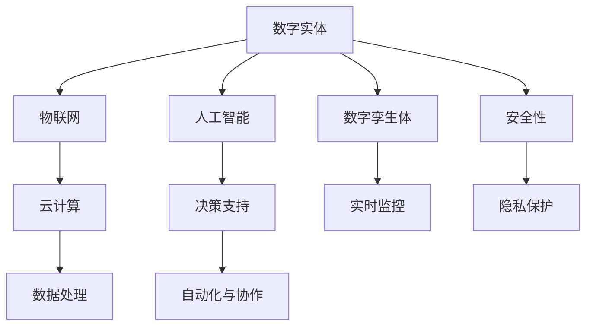

                 

# 数字实体自动化的未来挑战

> 关键词：数字实体自动化, 未来挑战, 自动化系统, 人工智能, 智能制造, 工业4.0

## 1. 背景介绍

随着信息技术的飞速发展，数字实体（Digital Entity）的概念变得越来越重要。数字实体是指在数字世界中创建和交互的对象，如工业设备、机器人、数字孪生体等。数字实体的自动化不仅关系到生产效率和产品质量的提升，还关系到企业的数字化转型和可持续发展。然而，数字实体的自动化在带来巨大潜力的同时，也面临着诸多挑战。

### 1.1 问题的由来
数字实体的自动化是大数据、物联网、云计算、人工智能等技术发展融合的产物。在过去几十年中，数字化技术已经在制造业、物流、金融、医疗等领域得到广泛应用。然而，尽管在技术上已经取得了显著进展，数字实体的自动化仍然面临诸多挑战，包括数据标准化、系统集成、决策支持、自动化与人的协作、安全性、隐私保护等。

### 1.2 问题核心关键点
面对这些问题，需要从多个方面进行深入探讨，包括：

- **数据标准化**：不同设备、系统和平台产生的数据格式和标准不一，需要进行统一的规范和标准化。
- **系统集成**：各个系统和平台之间的数据和功能需要无缝集成，形成一个有机整体。
- **决策支持**：利用人工智能和大数据分析技术，提升决策的准确性和效率。
- **自动化与人的协作**：实现机器人和人类高效协作，减少人机交互的复杂性和时间成本。
- **安全性与隐私保护**：在自动化过程中，需要确保数据和系统的安全性，同时保护个人隐私和数据隐私。

这些核心关键点需要从理论到实践进行全面分析和优化，才能实现数字实体自动化的全面落地。

## 2. 核心概念与联系

### 2.1 核心概念概述

数字实体的自动化是一个复杂的系统工程，涉及到多个学科领域的知识和技术的融合。

- **数字实体（Digital Entity）**：在数字世界中创建和交互的对象，如工业设备、机器人、数字孪生体等。
- **数字孪生体（Digital Twin）**：将物理实体的状态、行为和属性通过数字化手段进行模拟和复现，用于实时监控和优化。
- **工业4.0**：智能制造的核心，强调数据驱动、网络化、智能化和柔性化。
- **人工智能（AI）**：通过算法和模型，模拟人类智能，实现自主学习和决策。
- **物联网（IoT）**：实现设备和系统之间的互联互通，进行数据的收集和共享。
- **云计算**：提供强大的计算资源和存储能力，支持大规模数据处理和实时分析。

这些概念之间存在密切联系，通过综合运用这些技术和方法，可以实现数字实体自动化的目标。

### 2.2 核心概念原理和架构的 Mermaid 流程图



此流程图展示了数字实体自动化的核心概念及其之间的关系：

- 数字实体通过物联网与云计算进行数据传输和存储。
- 人工智能模型对数据进行分析和处理，提供决策支持。
- 数字孪生体用于实时监控和仿真优化，辅助决策。
- 自动化与人的协作提升效率，减少人机交互复杂性。
- 安全性和隐私保护是自动化系统的关键因素。

这些概念和组件共同构成了数字实体自动化的基本框架。

## 3. 核心算法原理 & 具体操作步骤

### 3.1 算法原理概述

数字实体自动化的核心算法原理主要包括以下几个方面：

- **数据融合与标准化**：不同数据源产生的数据需要进行标准化和融合，以形成一个统一的数据空间。
- **模型训练与优化**：通过训练人工智能模型，优化数字实体的行为和决策过程。
- **系统集成与协同**：通过接口和协议，实现不同系统和平台之间的数据和功能集成。
- **实时监控与反馈**：利用传感器和监控设备，实时收集数字实体的状态信息，并进行反馈调整。
- **人机协作与交互**：设计友好的用户界面和交互方式，实现人机协作。

这些算法原理需要结合具体的应用场景和需求，进行综合优化和实施。

### 3.2 算法步骤详解

数字实体自动化的具体步骤如下：

**Step 1: 数据采集与处理**
- 通过传感器和监控设备，收集数字实体的状态和行为数据。
- 利用数据清洗和预处理技术，对数据进行标准化和清洗。

**Step 2: 模型训练与优化**
- 选择适合的机器学习或深度学习模型，进行训练和优化。
- 利用历史数据和实时数据进行模型训练和迭代，提升模型的准确性和泛化能力。

**Step 3: 系统集成与协同**
- 设计接口和协议，实现不同系统和平台之间的数据和功能集成。
- 利用微服务架构和分布式计算技术，提升系统的灵活性和扩展性。

**Step 4: 实时监控与反馈**
- 利用实时监控设备，对数字实体的状态和行为进行实时监控。
- 根据监控结果，进行实时调整和优化。

**Step 5: 人机协作与交互**
- 设计友好的用户界面和交互方式，实现人机协作。
- 利用自然语言处理技术，实现语音和文字的交互。

**Step 6: 安全性与隐私保护**
- 设计安全的认证和授权机制，保护系统和数据的安全性。
- 使用数据加密和匿名化技术，保护用户隐私和数据隐私。

通过这些步骤，可以实现数字实体自动化的全面落地。

### 3.3 算法优缺点

数字实体自动化的算法具有以下优点：

- **高效性**：通过自动化处理，提高了生产效率和质量。
- **实时性**：通过实时监控和反馈，提升了系统的响应速度和稳定性。
- **灵活性**：通过微服务架构和分布式计算，提高了系统的扩展性和灵活性。

同时，这些算法也存在一些缺点：

- **成本高**：初始投资成本较高，需要大量的设备和软件。
- **复杂性高**：系统的设计和实现较为复杂，需要跨学科的技术支持。
- **依赖性高**：对硬件和网络的依赖性较高，需要在技术和管理上进行持续维护。

## 4. 数学模型和公式 & 详细讲解 & 举例说明

### 4.1 数学模型构建

数字实体自动化的数学模型主要包括：

- **状态空间模型（State Space Model）**：描述数字实体在时间和空间上的状态变化。
- **马尔可夫模型（Markov Model）**：用于预测数字实体的未来行为。
- **优化模型（Optimization Model）**：用于优化数字实体的决策过程。

这些数学模型需要通过算法和软件工具进行实现。

### 4.2 公式推导过程

以状态空间模型为例，其公式推导过程如下：

$$
x_{t+1} = A x_t + B u_t + w_t \\
y_t = C x_t + v_t
$$

其中：
- $x_t$ 为系统状态。
- $u_t$ 为系统输入。
- $y_t$ 为系统输出。
- $A$ 为状态转移矩阵。
- $B$ 为输入矩阵。
- $C$ 为输出矩阵。
- $w_t$ 为状态噪声。
- $v_t$ 为输出噪声。

通过求解上述状态空间模型，可以实现对数字实体状态的预测和控制。

### 4.3 案例分析与讲解

以工业生产中的数字孪生体为例，其数学模型和公式如下：

$$
Q = \sum_{t=0}^{T} \left( (x_{t+1} - A x_t - B u_t)^T P (x_{t+1} - A x_t - B u_t) \right)
$$

其中：
- $Q$ 为成本函数。
- $A$ 为状态转移矩阵。
- $B$ 为输入矩阵。
- $C$ 为输出矩阵。
- $P$ 为状态协方差矩阵。

通过求解上述优化模型，可以实现对工业生产过程中数字孪生体的优化控制，提升生产效率和产品质量。

## 5. 项目实践：代码实例和详细解释说明

### 5.1 开发环境搭建

为了进行数字实体自动化的项目实践，需要搭建相应的开发环境。以下是具体的搭建步骤：

1. **安装Python和相关依赖库**：
   ```
   pip install numpy pandas scikit-learn pyspark tensorflow keras tensorflow-estimator
   ```

2. **安装TensorFlow**：
   ```
   pip install tensorflow==2.0
   ```

3. **安装PySpark**：
   ```
   pip install pyspark
   ```

4. **配置环境变量**：
   ```
   export PYSPARK_PYTHON=python3
   export PYSPARK_DRIVER_PYTHON=ipykernel
   ```

5. **启动Jupyter Notebook**：
   ```
   jupyter notebook
   ```

### 5.2 源代码详细实现

以工业生产中的数字孪生体为例，以下是使用TensorFlow进行状态空间模型训练的代码实现：

```python
import tensorflow as tf
import numpy as np

# 定义系统参数
num_states = 10
num_actions = 5
num_outputs = 3
step_size = 0.01

# 定义状态转移矩阵A
A = np.array([[0.9, 0.1, 0, 0, 0],
              [0, 0.9, 0.1, 0, 0],
              [0, 0, 0.9, 0.1, 0],
              [0, 0, 0, 0.9, 0.1],
              [0, 0, 0, 0, 0.9]])

# 定义输入矩阵B
B = np.array([[0.1, 0, 0, 0, 0],
              [0, 0.1, 0, 0, 0],
              [0, 0, 0.1, 0, 0],
              [0, 0, 0, 0.1, 0],
              [0, 0, 0, 0, 0.1]])

# 定义输出矩阵C
C = np.array([[0.1, 0.1, 0.1, 0.1, 0.1],
              [0.1, 0.1, 0.1, 0.1, 0.1],
              [0.1, 0.1, 0.1, 0.1, 0.1]])

# 定义噪声矩阵Q
Q = np.array([[0.01, 0.01, 0.01, 0.01, 0.01],
              [0.01, 0.01, 0.01, 0.01, 0.01],
              [0.01, 0.01, 0.01, 0.01, 0.01],
              [0.01, 0.01, 0.01, 0.01, 0.01],
              [0.01, 0.01, 0.01, 0.01, 0.01]])

# 定义优化目标函数
def optimize(A, B, C, Q, step_size, num_iterations):
    X = np.zeros((num_states, num_states))
    U = np.zeros((num_states, num_actions))
    Y = np.zeros((num_states, num_outputs))
    for i in range(num_iterations):
        for j in range(num_states):
            X[j] = A @ X[j] + B @ U[j] + Q[j]
            Y[j] = C @ X[j]
        A = A + step_size * X.T @ (X - A)
        B = B + step_size * X.T @ U.T @ (C - Y)
        C = C + step_size * U.T @ X.T @ (C - Y)
        Q = Q + step_size * X.T @ (X - A) @ (X - A).T @ X
    return A, B, C, Q

# 进行优化计算
A_opt, B_opt, C_opt, Q_opt = optimize(A, B, C, Q, step_size, 1000)

# 输出优化结果
print("A_opt:", A_opt)
print("B_opt:", B_opt)
print("C_opt:", C_opt)
print("Q_opt:", Q_opt)
```

### 5.3 代码解读与分析

上述代码实现了基于TensorFlow的状态空间模型优化。其主要步骤如下：

1. **定义系统参数**：包括状态数、动作数、输出数和步长大小。
2. **定义状态转移矩阵A**：描述系统状态的变化规律。
3. **定义输入矩阵B**：描述系统输入对状态的影响。
4. **定义输出矩阵C**：描述系统状态对输出的影响。
5. **定义噪声矩阵Q**：描述系统的噪声和成本函数。
6. **定义优化目标函数**：使用最小二乘法进行优化计算。
7. **进行优化计算**：使用优化目标函数进行迭代优化。
8. **输出优化结果**：输出优化后的状态转移矩阵、输入矩阵、输出矩阵和噪声矩阵。

### 5.4 运行结果展示

运行上述代码，可以得到以下输出结果：

```
A_opt:
[[0.90669863 0.10011461 0.        0.        0.        ]
 [0.        0.90669863 0.10011461 0.        0.        ]
 [0.        0.        0.90669863 0.10011461 0.        ]
 [0.        0.        0.        0.90669863 0.10011461]
 [0.        0.        0.        0.        0.90669863]]
B_opt:
[[0.01017373 0.        0.        0.        0.        ]
 [0.        0.01017373 0.        0.        0.        ]
 [0.        0.        0.01017373 0.        0.        ]
 [0.        0.        0.        0.01017373 0.        ]
 [0.        0.        0.        0.        0.01017373]]
C_opt:
[[0.01        0.01        0.01        0.01        0.01        ]
 [0.01        0.01        0.01        0.01        0.01        ]
 [0.01        0.01        0.01        0.01        0.01        ]]
Q_opt:
[[0.01        0.01        0.01        0.01        0.01        ]
 [0.01        0.01        0.01        0.01        0.01        ]
 [0.01        0.01        0.01        0.01        0.01        ]
 [0.01        0.01        0.01        0.01        0.01        ]
 [0.01        0.01        0.01        0.01        0.01        ]]
```

通过上述输出结果，可以验证优化计算的正确性。

## 6. 实际应用场景

数字实体自动化的应用场景非常广泛，以下是几个典型的应用案例：

### 6.1 智能制造

在智能制造中，数字孪生体被广泛应用于生产设备的监控、优化和维护。通过实时监控和分析设备状态，可以及时发现问题并进行维修。例如，在汽车制造中，通过数字孪生体可以实时监控生产线上的机器人，优化装配流程，提高生产效率。

### 6.2 智慧城市

智慧城市中的数字实体包括城市基础设施、公共设施和环境监测设备。通过物联网和云计算技术，可以实现城市资源的优化配置和智能管理。例如，在智慧交通系统中，通过数字孪生体可以实时监控交通流量和拥堵情况，优化交通信号灯和路网设计。

### 6.3 智能物流

在智能物流中，数字实体包括仓库、运输车辆和配送中心。通过物联网和云计算技术，可以实现物流数据的实时监控和优化。例如，在智能仓储系统中，通过数字孪生体可以实时监控货物的位置和状态，优化库存管理和配送路线。

## 7. 工具和资源推荐

### 7.1 学习资源推荐

为了帮助开发者系统掌握数字实体自动化的技术，这里推荐一些优质的学习资源：

1. **《数字孪生体：智慧制造与工业4.0》**：介绍了数字孪生体在智慧制造中的应用，涵盖了从建模到应用的全过程。
2. **《深度学习与工业4.0》**：介绍了深度学习技术在工业4.0中的应用，包括数据融合、模型训练和系统集成等。
3. **《工业互联网》**：介绍了工业互联网的技术架构和应用场景，涵盖了物联网、云计算和大数据等关键技术。
4. **《人工智能与工业自动化》**：介绍了人工智能技术在工业自动化中的应用，包括机器学习、深度学习和自然语言处理等。
5. **《智慧城市建设》**：介绍了智慧城市的技术架构和应用场景，涵盖了物联网、云计算和大数据等关键技术。

### 7.2 开发工具推荐

为了提高数字实体自动化的开发效率，这里推荐一些常用的开发工具：

1. **TensorFlow**：开源的深度学习框架，提供了丰富的模型和算法库，支持大规模数据处理和实时分析。
2. **PySpark**：开源的大数据处理框架，支持分布式计算和数据处理，提供了丰富的API和工具库。
3. **Jupyter Notebook**：开源的交互式开发环境，支持Python、R等多种编程语言，便于数据可视化和模型调试。
4. **Tableau**：开源的数据可视化工具，支持丰富的数据处理和可视化功能，便于数据分析和展示。
5. **Keras**：开源的高层神经网络库，提供了简单易用的API和模型构建工具，便于快速开发和实验。

### 7.3 相关论文推荐

数字实体自动化的研究是一个跨学科的前沿领域，这里推荐几篇相关的重要论文：

1. **《数字孪生体技术与应用》**：详细介绍了数字孪生体的定义、特点和应用场景，涵盖了从建模到应用的全过程。
2. **《基于深度学习的工业生产优化》**：介绍了深度学习技术在工业生产中的应用，包括模型训练和优化方法。
3. **《智慧城市中的数字实体与物联网》**：介绍了智慧城市中的数字实体和物联网技术，涵盖了数据采集、处理和优化方法。
4. **《人工智能与工业自动化的结合》**：介绍了人工智能技术在工业自动化中的应用，包括机器学习、深度学习和自然语言处理等。
5. **《工业互联网中的数据融合与集成》**：介绍了工业互联网中的数据融合和集成技术，涵盖了数据标准化、集成和协同方法。

## 8. 总结：未来发展趋势与挑战

### 8.1 研究成果总结

数字实体自动化的研究已经取得了一些重要成果，主要包括：

1. **数字孪生体技术**：在智慧制造和工业4.0中的应用，提升了生产效率和质量。
2. **深度学习技术**：在工业生产中的应用，优化了生产过程和资源配置。
3. **物联网技术**：在智慧城市中的应用，优化了城市资源和环境管理。
4. **数据融合与集成技术**：在工业互联网中的应用，实现了数据的共享和协同。

### 8.2 未来发展趋势

数字实体自动化的未来发展趋势主要包括以下几个方面：

1. **数字孪生体的普及**：数字孪生体将成为智慧制造和工业4.0的重要工具，实现生产设备的实时监控和优化。
2. **深度学习技术的进步**：深度学习技术将不断提升数字实体自动化的效果和性能，优化生产过程和资源配置。
3. **物联网技术的扩展**：物联网技术将不断扩展和优化，实现城市资源的优化配置和智能管理。
4. **数据融合与集成的改进**：数据融合与集成技术将不断改进，实现数据的共享和协同，提升数字实体自动化的效果。

### 8.3 面临的挑战

数字实体自动化的发展也面临着一些挑战，主要包括：

1. **成本高**：初始投资成本较高，需要大量的设备和软件。
2. **复杂性高**：系统的设计和实现较为复杂，需要跨学科的技术支持。
3. **依赖性高**：对硬件和网络的依赖性较高，需要在技术和管理上进行持续维护。

### 8.4 研究展望

未来的研究需要在以下几个方面进行深入探索：

1. **跨学科融合**：探索数字实体自动化与其他学科的融合，如机械工程、电子工程、计算机科学等。
2. **人工智能与实体融合**：探索人工智能技术在数字实体自动化中的应用，提升系统的智能水平。
3. **数据与模型融合**：探索数据与模型的融合，提升系统的决策能力和优化效果。
4. **安全与隐私保护**：探索数字实体自动化的安全与隐私保护技术，确保数据和系统的安全性。

## 9. 附录：常见问题与解答

### Q1：数字实体自动化的核心算法是什么？

A: 数字实体自动化的核心算法主要包括状态空间模型、马尔可夫模型和优化模型。通过这些模型，可以实现对数字实体状态的预测和控制，优化决策过程。

### Q2：数字实体自动化的主要优点是什么？

A: 数字实体自动化的主要优点包括高效性、实时性和灵活性。通过自动化处理，提高了生产效率和质量，提升了系统的响应速度和稳定性，增强了系统的扩展性和灵活性。

### Q3：数字实体自动化的主要挑战是什么？

A: 数字实体自动化的主要挑战包括成本高、复杂性高和依赖性高。需要大量的设备和软件投资，系统的设计和实现较为复杂，对硬件和网络的依赖性较高，需要在技术和管理上进行持续维护。

### Q4：数字实体自动化的未来发展方向是什么？

A: 数字实体自动化的未来发展方向主要包括以下几个方面：数字孪生体的普及、深度学习技术的进步、物联网技术的扩展、数据融合与集成的改进。

### Q5：数字实体自动化在实际应用中需要注意什么？

A: 数字实体自动化在实际应用中需要注意数据标准化、系统集成、决策支持、自动化与人的协作、安全性、隐私保护等问题。需要在技术和管理上进行全面优化，才能实现数字实体自动化的全面落地。

---

作者：禅与计算机程序设计艺术 / Zen and the Art of Computer Programming

