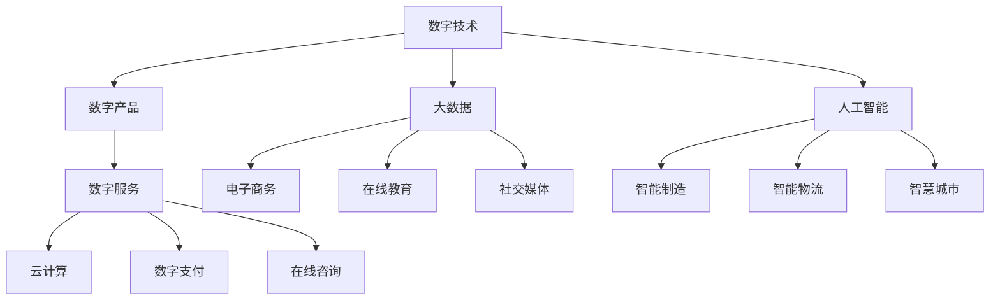

                 

# 数字经济：社会发展的助推器

## 1. 背景介绍

### 1.1 问题由来
随着科技的飞速发展，数字经济已经成为全球经济的重要组成部分。尤其是在新冠疫情的催化下，各国加速了数字化转型的步伐，数字经济在促进就业、提升效率、增强创新等方面的作用越发显著。数字经济不仅推动了传统产业的升级，也催生了许多新兴业态，如电子商务、互联网金融、人工智能、大数据等，这些新经济形态在很大程度上重塑了社会的发展格局。

在数字经济中，数字技术的应用已经成为推动经济增长的关键力量。根据《2020年世界数字经济报告》，全球数字经济规模已达29.3万亿美元，占GDP总量的15.2%。数字技术在各个领域的渗透和应用，正在以惊人的速度改变着社会的运作方式和人们的生活习惯。

### 1.2 问题核心关键点
数字经济的核心在于利用数字技术，尤其是信息与通信技术（ICT），实现信息与物质的融合，从而提升生产效率、降低交易成本、优化资源配置、增强消费者体验，并推动新业态和新模式的发展。数字经济对社会发展的推动作用主要体现在以下几个方面：

1. **提升生产力**：数字技术在制造、物流、零售等行业的应用，提高了生产效率，缩短了生产周期，降低了运营成本。
2. **优化资源配置**：通过大数据分析和人工智能技术，可以更精确地预测市场需求，优化供应链管理，减少资源浪费。
3. **增强创新能力**：数字经济促进了新技术的快速迭代和应用，推动了新业态、新模式和新产品的发展。
4. **改善民生**：数字技术在教育、医疗、交通等公共服务领域的应用，提升了服务质量和效率，改善了人们的生活质量。
5. **促进就业**：数字经济催生了许多新兴职业，如数据科学家、人工智能工程师、数字营销等，为更多人提供了就业机会。

## 2. 核心概念与联系

### 2.1 核心概念概述

数字经济涉及多个核心概念，包括数字技术、数字产品、数字服务等。这些概念之间存在着紧密的联系，共同构成了数字经济的生态体系。

- **数字技术**：包括信息与通信技术（ICT）、人工智能、大数据、物联网等，是数字经济的基础。
- **数字产品**：如电子商务平台、社交媒体、在线教育等，是数字经济的载体和应用形式。
- **数字服务**：如云计算、数字支付、在线咨询等，是数字经济的盈利模式和运营方式。

这些概念通过相互交织，形成了数字经济的完整生态。数字技术的不断进步，推动了数字产品和服务的发展，进而增强了数字经济的活力和竞争力。

### 2.2 核心概念原理和架构的 Mermaid 流程图



这个流程图展示了数字技术的不同分支如何通过数字产品和服务相互关联，共同促进数字经济的发展。

## 3. 核心算法原理 & 具体操作步骤

### 3.1 算法原理概述

数字经济的算法原理主要集中在以下几个方面：

- **机器学习与深度学习**：利用算法模型对大量数据进行训练，提高对复杂问题的预测和决策能力。
- **数据挖掘与大数据分析**：从大量数据中提取有用信息，优化资源配置和运营决策。
- **自然语言处理（NLP）**：处理和分析文本数据，提升人机交互的智能化水平。
- **推荐算法**：通过分析用户行为数据，为用户推荐个性化的产品和服务。
- **区块链技术**：利用分布式账本技术，保障数据的安全和透明性，提升交易的信任度。

这些算法原理构成了数字经济的基础技术框架，推动了各行业的数字化转型和智能化升级。

### 3.2 算法步骤详解

以下是数字经济中典型算法的基本步骤：

**Step 1: 数据收集与预处理**
- 从不同渠道收集数据，包括用户行为数据、交易数据、文本数据等。
- 对数据进行清洗、去重、归一化等预处理操作，确保数据的质量和一致性。

**Step 2: 特征提取与模型训练**
- 通过特征工程提取有用的特征，构建输入向量。
- 选择合适的算法模型，进行训练，优化模型参数。
- 使用验证集评估模型性能，选择最优模型。

**Step 3: 模型评估与部署**
- 在测试集上评估模型性能，进行模型调优。
- 将模型部署到生产环境，进行实时应用。
- 持续监控模型效果，进行周期性优化。

### 3.3 算法优缺点

数字经济的算法具有以下优点：

- **高效性**：算法可以处理大规模数据，自动化程度高，提升效率。
- **精确性**：通过模型训练，可以提升预测和决策的准确性。
- **可扩展性**：算法模型可以应用于不同的业务场景，具有广泛的应用前景。

同时，这些算法也存在以下缺点：

- **数据依赖性高**：算法的性能高度依赖于数据的质量和数量，数据的获取和处理成本较高。
- **模型复杂度大**：复杂算法模型的训练和部署需要大量的计算资源和时间。
- **可解释性差**：一些复杂的深度学习模型缺乏可解释性，难以理解和调试。
- **伦理与安全风险**：算法模型可能会学习到偏见或有害信息，存在伦理与安全风险。

### 3.4 算法应用领域

数字经济的算法广泛应用在各个领域，如：

- **金融科技**：利用机器学习和数据分析，提升风险控制、信用评估、欺诈检测等能力。
- **电子商务**：通过推荐算法和自然语言处理，提升用户体验和商品推荐效果。
- **智能制造**：利用工业互联网和物联网技术，实现设备互联和智能生产。
- **智慧城市**：通过大数据分析和人工智能，优化城市交通、环境监测、公共服务。
- **健康医疗**：利用数据分析和人工智能，提升疾病预测、诊断和治疗能力。

## 4. 数学模型和公式 & 详细讲解 & 举例说明

### 4.1 数学模型构建

数字经济的数学模型构建主要包括以下几个方面：

- **线性回归模型**：用于分析数据趋势和预测，如金融市场趋势预测。
- **决策树与随机森林**：用于分类和预测，如客户信用评估。
- **支持向量机（SVM）**：用于分类和回归分析，如商品推荐系统。
- **深度学习模型**：如卷积神经网络（CNN）、循环神经网络（RNN）、长短期记忆网络（LSTM）等，用于图像识别、文本分类、语音识别等。
- **强化学习**：用于动态决策和优化，如自动驾驶、游戏智能。

### 4.2 公式推导过程

以线性回归模型为例，推导其基本公式。

假设我们有一个样本集 $\{(x_i,y_i)\}_{i=1}^n$，其中 $x_i$ 是特征向量，$y_i$ 是目标变量。线性回归模型的目标是最小化预测值与实际值之间的均方误差，即：

$$
\min_{\theta} \frac{1}{2n} \sum_{i=1}^n (y_i - \theta \cdot x_i)^2
$$

其中 $\theta$ 为模型参数，包括截距和特征系数。将上述公式展开，得到：

$$
\min_{\theta} \frac{1}{2n} \sum_{i=1}^n (y_i - \theta_0 - \theta_1x_{i1} - \dots - \theta_kx_{ik})^2
$$

通过求解上述优化问题，可以得到模型参数 $\theta$，进而对新的输入进行预测。

### 4.3 案例分析与讲解

以电商平台的推荐系统为例，说明推荐算法在数字经济中的应用。

推荐系统通常基于用户的历史行为数据和物品特征数据，构建用户-物品关联矩阵。通过协同过滤、内容过滤、混合过滤等方法，预测用户对物品的评分，并根据评分排序推荐物品。例如，使用协同过滤算法，可以基于用户之间的相似度，推荐其他用户喜欢的物品。

## 5. 项目实践：代码实例和详细解释说明

### 5.1 开发环境搭建

在进行数字经济项目实践前，需要准备好开发环境。以下是使用Python进行PyTorch开发的环境配置流程：

1. 安装Anaconda：从官网下载并安装Anaconda，用于创建独立的Python环境。

2. 创建并激活虚拟环境：
```bash
conda create -n pytorch-env python=3.8 
conda activate pytorch-env
```

3. 安装PyTorch：根据CUDA版本，从官网获取对应的安装命令。例如：
```bash
conda install pytorch torchvision torchaudio cudatoolkit=11.1 -c pytorch -c conda-forge
```

4. 安装TensorFlow：
```bash
pip install tensorflow
```

5. 安装TensorBoard：
```bash
pip install tensorboard
```

6. 安装Keras：
```bash
pip install keras
```

完成上述步骤后，即可在`pytorch-env`环境中开始数字经济项目的开发。

### 5.2 源代码详细实现

以下是使用PyTorch实现线性回归模型的代码示例：

```python
import torch
import torch.nn as nn
import torch.optim as optim

class LinearRegression(nn.Module):
    def __init__(self, input_size, output_size):
        super(LinearRegression, self).__init__()
        self.linear = nn.Linear(input_size, output_size)

    def forward(self, x):
        return self.linear(x)

# 定义损失函数和优化器
criterion = nn.MSELoss()
optimizer = optim.SGD(model.parameters(), lr=0.01)

# 训练模型
for epoch in range(num_epochs):
    optimizer.zero_grad()
    outputs = model(inputs)
    loss = criterion(outputs, targets)
    loss.backward()
    optimizer.step()

# 评估模型
with torch.no_grad():
    predicted = model(test_inputs)
    print(torch.nn.functional.mse_loss(predicted, test_targets))
```

在这个示例中，我们定义了一个线性回归模型，使用均方误差损失函数进行训练，并使用随机梯度下降算法进行优化。

### 5.3 代码解读与分析

**LinearRegression类**：
- `__init__`方法：初始化模型，包括定义线性层。
- `forward`方法：前向传播，计算模型输出。

**训练模型**：
- 在每个epoch中，先清零梯度，进行前向传播，计算损失函数。
- 反向传播，计算梯度。
- 使用优化器更新模型参数。

**评估模型**：
- 在测试集上不更新参数，计算模型输出和真实值之间的均方误差。

通过这个示例，可以看出PyTorch的易用性和灵活性，快速实现线性回归模型的训练和评估。

## 6. 实际应用场景

### 6.1 智能制造

数字经济在智能制造中的应用非常广泛。通过物联网技术，实现设备互联和数据采集，利用大数据分析和机器学习技术，优化生产流程和资源配置。

例如，智能制造系统可以通过传感器实时监控设备状态，预测设备故障，提前进行维护。同时，基于大数据分析，优化供应链管理，提高生产效率。此外，通过机器学习模型，可以实现智能排产、质量检测等，提升制造过程的智能化水平。

### 6.2 智慧城市

数字经济在智慧城市中的应用主要体现在智能交通、环境监测、公共服务等方面。通过大数据分析和人工智能技术，提升城市管理和服务水平。

例如，智慧交通系统可以通过摄像头和传感器实时监控交通状况，优化信号灯控制，减少交通拥堵。智慧能源系统可以通过智能电表和数据分析，优化电力供应和消费，提升能源利用效率。智慧医疗系统可以通过远程监测和数据分析，提升疾病预测和诊断能力。

### 6.3 电子商务

数字经济在电子商务中的应用非常广泛。通过大数据分析和推荐算法，提升用户体验和商品推荐效果。

例如，电商平台可以根据用户的历史行为数据和偏好，推荐个性化的商品，提高用户满意度和购买率。通过自然语言处理技术，实现智能客服，提升客户体验。同时，利用区块链技术，保障交易安全，提高用户信任度。

### 6.4 未来应用展望

随着数字技术的不断进步，数字经济的应用前景将更加广阔。未来，数字经济将在更多领域发挥重要作用，如智能农业、数字旅游、数字艺术等，为社会带来更多的创新和发展机会。

**智能农业**：通过物联网技术和大数据分析，提升农业生产效率和资源利用率。例如，智能灌溉系统可以根据土壤湿度和气象数据，自动调节灌溉量，提高作物产量和质量。

**数字旅游**：通过虚拟现实和增强现实技术，提升旅游体验和信息服务水平。例如，虚拟旅游平台可以通过3D建模和实时数据，让用户沉浸式体验不同的旅游场景。

**数字艺术**：通过人工智能技术，创作和优化艺术作品。例如，利用生成对抗网络（GAN）技术，生成逼真的艺术图像，提升艺术创作水平。

## 7. 工具和资源推荐

### 7.1 学习资源推荐

为了帮助开发者系统掌握数字经济的技术基础和实践技巧，这里推荐一些优质的学习资源：

1. 《深度学习》系列书籍：由Ian Goodfellow等著，全面介绍了深度学习的基本概念和算法，适合初学者和进阶者。

2. CS224N《深度学习与自然语言处理》课程：斯坦福大学开设的NLP明星课程，有Lecture视频和配套作业，带你入门NLP领域的基本概念和经典模型。

3. 《Python深度学习》书籍：由Francois Chollet著，深入浅出地介绍了深度学习在Python中的应用，适合动手实践。

4. Kaggle平台：数据科学竞赛平台，提供大量公开数据集和竞赛题目，适合学习数据挖掘和机器学习技术。

5. Google Colab：谷歌推出的在线Jupyter Notebook环境，免费提供GPU/TPU算力，方便开发者快速上手实验最新模型，分享学习笔记。

通过对这些资源的学习实践，相信你一定能够快速掌握数字经济的核心技术，并用于解决实际的数字经济问题。

### 7.2 开发工具推荐

高效的开发离不开优秀的工具支持。以下是几款用于数字经济开发的常用工具：

1. PyTorch：基于Python的开源深度学习框架，灵活动态的计算图，适合快速迭代研究。大部分数字经济项目都有PyTorch版本的实现。

2. TensorFlow：由Google主导开发的开源深度学习框架，生产部署方便，适合大规模工程应用。同样有丰富的数字经济项目资源。

3. Transformers库：HuggingFace开发的NLP工具库，集成了众多SOTA语言模型，支持PyTorch和TensorFlow，是进行数字经济项目开发的利器。

4. Weights & Biases：模型训练的实验跟踪工具，可以记录和可视化模型训练过程中的各项指标，方便对比和调优。与主流深度学习框架无缝集成。

5. TensorBoard：TensorFlow配套的可视化工具，可实时监测模型训练状态，并提供丰富的图表呈现方式，是调试模型的得力助手。

6. Jupyter Notebook：轻量级编程环境，支持多种编程语言和数据格式，适合快速开发和演示。

合理利用这些工具，可以显著提升数字经济项目的开发效率，加快创新迭代的步伐。

### 7.3 相关论文推荐

数字经济的算法和应用广泛涉及多个领域，以下是几篇奠基性的相关论文，推荐阅读：

1. Andrew Ng, Yoshua Bengio, and Geoffrey Hinton. "Deep learning" – Nature 2015.
2. Fei-Fei Li, Justin Johnson, and Sergei Jurie. "CS231n: Convolutional Neural Networks for Visual Recognition" – Stanford University 2018.
3. Yann LeCun, Yoshua Bengio, and Geoffrey Hinton. "Deep Learning" – Nature 2015.
4. Ian Goodfellow, Yoshua Bengio, and Aaron Courville. "Deep Learning" – MIT Press 2016.
5. Jürgen Schmidhuber. "Deep Learning in Neural Networks: An Overview" – Neural Networks 1992.
6. Peter Norvig and Steven Russell. "Artificial Intelligence: A Modern Approach" – Pearson 2018.

这些论文代表了大数据和深度学习技术的发展脉络，通过学习这些前沿成果，可以帮助研究者把握学科前进方向，激发更多的创新灵感。

## 8. 总结：未来发展趋势与挑战

### 8.1 研究成果总结

数字经济作为当前全球经济的重要组成部分，正在以惊人的速度改变着社会的运作方式和人们的生活习惯。数字技术的广泛应用，提升了生产效率，优化了资源配置，增强了创新能力，改善了民生，促进了就业。数字经济的发展，不仅推动了传统产业的升级，也催生了许多新兴业态，如电子商务、互联网金融、人工智能、大数据等，这些新经济形态在很大程度上重塑了社会的发展格局。

### 8.2 未来发展趋势

展望未来，数字经济的发展将呈现以下几个趋势：

1. **智能化升级**：随着AI技术的不断进步，数字经济将进一步智能化，提高决策的准确性和效率。
2. **全场景应用**：数字经济将覆盖更多领域，如智能农业、数字旅游、数字艺术等，为社会带来更多的创新和发展机会。
3. **普惠性增强**：数字技术的普及将降低企业进入门槛，提升中小企业的竞争力，实现普惠性发展。
4. **生态系统完善**：数字经济将形成完整的生态系统，包括基础设施、技术、应用、人才等各个方面。
5. **国际合作加深**：数字经济的发展将促进国际合作，共同应对全球性挑战，推动全球经济的可持续发展。

### 8.3 面临的挑战

尽管数字经济取得了巨大的成就，但在其发展过程中仍面临诸多挑战：

1. **数据隐私和安全**：数字经济依赖于大量的数据，数据隐私和安全问题成为关注的焦点。如何在保护隐私的前提下，实现数据的有效利用，是一个亟待解决的问题。
2. **伦理和社会责任**：数字经济的发展可能带来伦理和社会责任问题，如就业替代、算法偏见等。如何确保数字技术的发展符合伦理标准，保障社会公平，是一个重要的课题。
3. **技术壁垒**：数字经济需要高度的技术创新，对企业的技术能力提出了更高的要求。如何降低技术壁垒，实现技术的普及和应用，是一个需要长期努力的方向。
4. **可持续发展**：数字经济的发展可能带来资源和环境问题，如何实现可持续发展，避免对生态环境的破坏，是一个重要的研究方向。
5. **人才短缺**：数字经济需要大量的技术人才，如何培养和吸引人才，满足行业需求，是一个长期而艰巨的任务。

### 8.4 研究展望

面对数字经济所面临的挑战，未来的研究需要在以下几个方面寻求新的突破：

1. **隐私保护技术**：研发更加有效的数据隐私保护技术，如差分隐私、联邦学习等，确保数据在保护隐私的前提下，实现数据的有效利用。
2. **伦理和社会责任研究**：开展数字经济对就业、公平等社会问题的研究，提出可行的解决方案，确保数字技术的可持续发展。
3. **技术普及与教育**：推动技术的普及和应用，开展数字技术教育，培养更多的技术人才，满足行业需求。
4. **可持续发展研究**：研究数字经济对资源和环境的影响，提出可持续发展的路径，实现技术与环境的和谐共生。
5. **跨领域应用研究**：研究数字技术在各领域的融合应用，推动数字经济的多元化发展，实现普惠性发展。

## 9. 附录：常见问题与解答

**Q1：数字经济是否仅限于IT行业？**

A: 数字经济并不仅限于IT行业，它涉及各行各业，如制造业、农业、教育、医疗等。数字技术的应用，可以提升各行业的生产效率、优化资源配置、增强创新能力，从而实现数字化转型。

**Q2：数字经济的核心是什么？**

A: 数字经济的核心是数字技术，包括信息与通信技术（ICT）、人工智能、大数据、物联网等。这些技术的融合应用，推动了各行业的数字化转型，提升了生产效率和资源配置效率，增强了创新能力。

**Q3：数字经济对就业的影响是什么？**

A: 数字经济的发展带来了就业的替代和新增。一方面，一些传统的低技能工作被自动化和智能化取代，另一方面，新的数字岗位不断涌现，如数据科学家、人工智能工程师等，为更多人提供了就业机会。

**Q4：数字经济的优势有哪些？**

A: 数字经济的优势包括提高生产效率、优化资源配置、增强创新能力、改善民生、促进就业等。数字技术的广泛应用，推动了各行业的升级，提升了整体经济发展的质量和效率。

**Q5：数字经济面临的挑战有哪些？**

A: 数字经济面临的挑战包括数据隐私和安全、伦理和社会责任、技术壁垒、可持续发展、人才短缺等。如何应对这些挑战，实现数字经济的可持续发展，是一个重要的研究方向。

通过以上系统梳理，可以看到，数字经济作为当前全球经济的重要组成部分，正在以惊人的速度改变着社会的运作方式和人们的生活习惯。数字技术的广泛应用，提升了生产效率，优化了资源配置，增强了创新能力，改善了民生，促进了就业。数字经济的发展，不仅推动了传统产业的升级，也催生了许多新兴业态，如电子商务、互联网金融、人工智能、大数据等，这些新经济形态在很大程度上重塑了社会的发展格局。未来，数字经济将在更多领域发挥重要作用，为社会带来更多的创新和发展机会。

