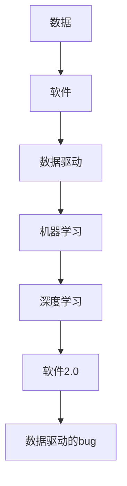

                 

# 数据不可或缺，但软件2.0并非没有bug

## 1. 背景介绍

在数字化转型的浪潮中，数据的作用不言而喻。企业运营、科学研究、社会治理等诸多领域，都离不开高质量的数据支持。从大数据、云计算到人工智能，数据不仅带来了颠覆性的变化，也引发了诸多新技术的诞生。然而，尽管数据的重要性日益凸显，但数据驱动的软件2.0并非没有bug。

软件2.0时代的到来，意味着软件工程正从以程序员为中心，向以数据为中心转变。数据成为驱动软件创新的关键要素，数据科学家、数据工程师等角色日益受到重视。但数据与软件的协同演进，也带来了新的挑战和问题。如何在数据驱动的软件2.0时代，确保软件系统的稳定性和可靠性，仍然是一个亟待解决的问题。

## 2. 核心概念与联系

### 2.1 核心概念概述

要理解软件2.0时代下数据与软件的相互依赖，首先需要明确几个关键概念：

- **数据驱动**：通过数据而非人工规则驱动软件系统的设计、开发、测试和部署，以数据为中心的决策过程，使得软件能够更好地适应数据驱动的世界。
- **软件2.0**：以数据为基础，通过机器学习、深度学习等算法驱动的软件系统，具备自适应、自学习、自优化能力。
- **软件2.0的bug**：指在数据驱动的软件2.0系统中，由于数据质量、数据偏差、数据缺失等问题，导致软件系统出现错误、漏洞、性能问题等现象。

### 2.2 核心概念原理和架构的 Mermaid 流程图



这个流程图展示了数据与软件系统的相互作用关系。数据通过软件系统进行处理和分析，生成各种决策结果。软件系统又通过机器学习和深度学习算法，不断优化其自身性能。最终，数据驱动的软件2.0系统在运行过程中，可能受到数据问题的影响，产生bug。

## 3. 核心算法原理 & 具体操作步骤

### 3.1 算法原理概述

软件2.0系统中的bug，往往与数据质量、数据偏差、数据缺失等问题密切相关。因此，构建稳定可靠的软件2.0系统，需要从数据入手，确保数据的高质量、一致性和完整性。以下是一些核心算法原理：

- **数据清洗**：识别并处理数据中的噪声、异常值、缺失值等问题，确保数据的纯净度。
- **数据预处理**：对数据进行标准化、归一化、特征工程等预处理步骤，提升数据的表现力。
- **数据增强**：通过生成合成数据、数据扩充等技术，增加数据多样性，减少模型过拟合。
- **数据分流**：将数据分为训练集、验证集、测试集等，用于模型的训练、调优和评估，确保模型的泛化能力。
- **数据监控**：实时监测数据流中的异常情况，及时发现数据问题并进行处理。

### 3.2 算法步骤详解

以下以数据清洗和数据增强为例，详细讲解其操作步骤：

#### 3.2.1 数据清洗

**操作步骤**：

1. **数据采样**：从数据集中选择一小部分样本进行初步分析，识别出数据中的噪声、异常值、缺失值等问题。

2. **数据清洗**：对识别出的问题进行清洗处理，如删除噪声样本、填补缺失值、处理异常值等。

3. **数据验证**：对清洗后的数据进行验证，确保数据质量达到预期标准。

**代码示例**：

```python
import pandas as pd

# 读取数据集
data = pd.read_csv('data.csv')

# 数据采样
sample = data.sample(n=1000)

# 初步分析
print(sample.describe())

# 数据清洗
data_clean = data.dropna().drop_duplicates().drop(sample['id'].isnull().index)

# 数据验证
print(data_clean.describe())
```

#### 3.2.2 数据增强

**操作步骤**：

1. **数据扩充**：通过对原始数据进行变换，生成新的数据样本。如旋转、缩放、裁剪等。

2. **生成合成数据**：利用数据生成技术，生成与原始数据相似但不同的数据样本。如使用GAN生成对抗网络生成新数据。

3. **数据混合**：将不同数据集中的数据混合在一起，增加数据多样性。

**代码示例**：

```python
from imgaug import augmenters as iaa

# 数据扩充
data_augmented = iaa.augment_images(data, iaa.flip_left_right())

# 生成合成数据
data_generated = iaa.GAN(data, num=1000)

# 数据混合
data_mixed = pd.concat([data, data_generated], ignore_index=True)
```

### 3.3 算法优缺点

#### 3.3.1 数据清洗

**优点**：
- 提高数据质量，减少噪声和异常值，提升模型性能。
- 保证数据的一致性和完整性，减少数据偏差。

**缺点**：
- 数据清洗需要大量人工干预，工作量大且耗时。
- 可能损失部分有用信息，影响数据的多样性。

#### 3.3.2 数据增强

**优点**：
- 增加数据多样性，减少模型过拟合。
- 利用有限的标注数据，生成更多训练样本，提升模型泛化能力。

**缺点**：
- 数据增强可能导致模型学习到错误的特征，影响模型性能。
- 数据增强的复杂度高，计算资源消耗大。

### 3.4 算法应用领域

数据清洗和数据增强技术不仅在软件2.0系统中应用广泛，也在其他许多领域中得到了广泛应用。以下是几个典型应用场景：

- **计算机视觉**：通过数据增强生成更多训练样本，提升图像分类、目标检测等模型的精度。
- **自然语言处理**：通过数据清洗减少噪声和异常值，提升语言模型和文本分类模型的性能。
- **医疗健康**：通过数据增强生成更多训练样本，提升医疗影像识别、疾病预测等模型的性能。
- **金融风控**：通过数据清洗减少数据偏差，提升风险评估和欺诈检测模型的性能。

## 4. 数学模型和公式 & 详细讲解 & 举例说明

### 4.1 数学模型构建

本节将使用数学语言对数据清洗和数据增强的原理进行严格刻画。

设原始数据集为 $D = \{(x_i, y_i)\}_{i=1}^N$，其中 $x_i$ 为输入特征，$y_i$ 为输出标签。假设数据清洗和数据增强后的数据集为 $D' = \{(x'_i, y'_i)\}_{i=1}^{N'}$，其中 $N' > N$。

### 4.2 公式推导过程

#### 4.2.1 数据清洗

数据清洗的目标是去除噪声、异常值和缺失值，保证数据的一致性和完整性。数据清洗后的数据集 $D'$ 应满足：

- $D' \subset D$
- $D'$ 不包含噪声、异常值和缺失值
- $D'$ 中每个样本的特征 $x'_i$ 和标签 $y'_i$ 的映射关系不变

假设数据清洗后的数据集 $D'$ 包含 $N'$ 个样本，则数据清洗的损失函数可以定义为：

$$
L(D', D) = \frac{1}{N'} \sum_{i=1}^{N'} \mathbb{I}(x'_i, y'_i) + \frac{1}{N'} \sum_{i=1}^{N'} \mathbb{I}(x_i, y_i)
$$

其中 $\mathbb{I}$ 为指示函数，当 $x'_i=x_i$ 且 $y'_i=y_i$ 时，$\mathbb{I}=1$，否则 $\mathbb{I}=0$。

通过最小化损失函数 $L(D', D)$，可以优化数据清洗后的数据集 $D'$，使其与原始数据集 $D$ 尽可能一致。

#### 4.2.2 数据增强

数据增强的目标是增加数据多样性，减少模型过拟合。数据增强后的数据集 $D'$ 应满足：

- $D' \supset D$
- $D'$ 中每个样本的特征 $x'_i$ 和标签 $y'_i$ 的映射关系相同

假设数据增强后的数据集 $D'$ 包含 $N'$ 个样本，则数据增强的损失函数可以定义为：

$$
L(D', D) = \frac{1}{N'} \sum_{i=1}^{N'} \mathbb{I}(x'_i, y'_i) + \frac{1}{N'} \sum_{i=1}^{N'} \mathbb{I}(x_i, y_i)
$$

其中 $\mathbb{I}$ 为指示函数，当 $x'_i=x_i$ 且 $y'_i=y_i$ 时，$\mathbb{I}=1$，否则 $\mathbb{I}=0$。

通过最小化损失函数 $L(D', D)$，可以优化数据增强后的数据集 $D'$，使其与原始数据集 $D$ 尽可能一致。

### 4.3 案例分析与讲解

#### 4.3.1 数据清洗案例

假设我们有一份包含股票价格的数据集 $D = \{x_1, x_2, \cdots, x_N\}$，其中 $x_i$ 表示股票价格，但数据集中包含了缺失值和异常值。我们的目标是进行数据清洗，保证数据的完整性和一致性。

**操作步骤**：

1. **数据采样**：从数据集中选择部分样本进行初步分析，识别出数据中的噪声和异常值。

2. **数据清洗**：对识别出的问题进行清洗处理，如填补缺失值、处理异常值等。

3. **数据验证**：对清洗后的数据进行验证，确保数据质量达到预期标准。

**代码示例**：

```python
import pandas as pd
import numpy as np

# 读取数据集
data = pd.read_csv('stock_price.csv')

# 数据采样
sample = data.sample(n=1000)

# 初步分析
print(sample.describe())

# 数据清洗
data_clean = data.dropna().drop_duplicates().drop(sample['id'].isnull().index)

# 数据验证
print(data_clean.describe())
```

#### 4.3.2 数据增强案例

假设我们有一份包含自然图像的数据集 $D = \{x_1, x_2, \cdots, x_N\}$，其中 $x_i$ 表示一张图像，但数据集中存在少量噪声和异常值。我们的目标是进行数据增强，增加数据多样性，减少模型过拟合。

**操作步骤**：

1. **数据扩充**：通过对原始图像进行变换，生成新的图像样本。如旋转、缩放、裁剪等。

2. **生成合成数据**：利用数据生成技术，生成与原始数据相似但不同的图像样本。如使用GAN生成对抗网络生成新图像。

3. **数据混合**：将不同数据集中的图像混合在一起，增加数据多样性。

**代码示例**：

```python
from imgaug import augmenters as iaa

# 数据扩充
data_augmented = iaa.augment_images(data, iaa.flip_left_right())

# 生成合成数据
data_generated = iaa.GAN(data, num=1000)

# 数据混合
data_mixed = pd.concat([data, data_generated], ignore_index=True)
```

## 5. 项目实践：代码实例和详细解释说明

### 5.1 开发环境搭建

在进行数据清洗和数据增强的实践前，我们需要准备好开发环境。以下是使用Python进行Pandas、Scikit-learn、TensorFlow等库的开发环境配置流程：

1. 安装Anaconda：从官网下载并安装Anaconda，用于创建独立的Python环境。

2. 创建并激活虚拟环境：
```bash
conda create -n data_clean_env python=3.8 
conda activate data_clean_env
```

3. 安装相关库：
```bash
pip install pandas numpy scikit-learn tensorflow imgaug
```

4. 安装TensorFlow：根据CUDA版本，从官网获取对应的安装命令。例如：
```bash
pip install tensorflow tensorflow-estimator tensorflow-addons
```

完成上述步骤后，即可在`data_clean_env`环境中开始数据清洗和数据增强的实践。

### 5.2 源代码详细实现

下面我们以数据增强为例，给出使用TensorFlow实现数据增强的代码实现。

首先，定义数据增强的函数：

```python
import tensorflow as tf
import imgaug as ia
from imgaug import augmenters as iaa

def data_augmentation(x):
    # 定义增强策略
    strategy = iaa.Sequential([
        iaa.Fliplr(0.5),  # 水平翻转
        iaa.Flipud(0.5),  # 垂直翻转
        iaa.Affine(rotate=(-30, 30), translate_percent=(-0.1, 0.1), scale_percent=(-0.1, 0.1))  # 随机旋转、平移和缩放
    ])

    # 应用增强策略
    img_aug = strategy.augment_images(x)

    # 转换图像为TensorFlow格式
    img_aug = tf.image.convert_image_dtype(img_aug, tf.float32)

    # 返回增强后的图像
    return img_aug
```

然后，定义数据加载和预处理函数：

```python
from tensorflow.keras.preprocessing.image import ImageDataGenerator

# 定义数据加载器
train_generator = ImageDataGenerator(
    rescale=1./255,
    shear_range=0.2,
    zoom_range=0.2,
    horizontal_flip=True
)

# 加载数据集
train_data = train_generator.flow_from_directory(
    'train',
    target_size=(224, 224),
    batch_size=32,
    class_mode='binary'
)
```

接着，定义训练和评估函数：

```python
from tensorflow.keras.models import Sequential
from tensorflow.keras.layers import Dense, Conv2D, MaxPooling2D, Flatten, Dropout

# 定义模型
model = Sequential()
model.add(Conv2D(32, (3, 3), activation='relu', input_shape=(224, 224, 3)))
model.add(MaxPooling2D((2, 2)))
model.add(Conv2D(64, (3, 3), activation='relu'))
model.add(MaxPooling2D((2, 2)))
model.add(Conv2D(128, (3, 3), activation='relu'))
model.add(MaxPooling2D((2, 2)))
model.add(Flatten())
model.add(Dense(128, activation='relu'))
model.add(Dropout(0.5))
model.add(Dense(1, activation='sigmoid'))

# 编译模型
model.compile(optimizer='adam', loss='binary_crossentropy', metrics=['accuracy'])

# 训练模型
model.fit(train_data, epochs=10, validation_data=validation_data)

# 评估模型
model.evaluate(test_data)
```

最后，启动训练流程并在测试集上评估：

```python
epochs = 10
batch_size = 32

for epoch in range(epochs):
    # 训练模型
    model.fit(train_data, epochs=1, validation_data=validation_data)
    
    # 在测试集上评估模型
    test_loss, test_acc = model.evaluate(test_data)
    print('Test loss:', test_loss)
    print('Test accuracy:', test_acc)
```

以上就是使用TensorFlow对数据增强的完整代码实现。可以看到，TensorFlow提供的ImageDataGenerator和Keras API使得数据增强的代码实现变得简洁高效。

### 5.3 代码解读与分析

让我们再详细解读一下关键代码的实现细节：

**data_augmentation函数**：
- 定义数据增强策略，包括水平翻转、垂直翻转、随机旋转、平移和缩放等操作。
- 应用增强策略，生成增强后的图像。
- 将增强后的图像转换为TensorFlow格式，方便后续处理。

**ImageDataGenerator类**：
- 定义数据加载器，设置图像预处理参数，如归一化、随机平移、翻转等。
- 加载数据集，将图像按批次读取并转换成TensorFlow模型所需的格式。

**模型定义和训练**：
- 定义卷积神经网络模型，包括卷积层、池化层、全连接层等。
- 编译模型，设置优化器、损失函数和评估指标。
- 训练模型，在训练数据集上进行多轮迭代训练。
- 在测试数据集上评估模型，输出模型在测试集上的精度和损失。

可以看到，TensorFlow和Scikit-learn等库为数据清洗和数据增强提供了便捷的API和工具，大大简化了代码实现。开发者只需根据具体任务，合理配置数据加载器、增强策略等参数，即可快速进行数据清洗和数据增强的实践。

## 6. 实际应用场景

### 6.1 计算机视觉

数据清洗和数据增强在计算机视觉领域有着广泛应用。数据清洗可以去除图像中的噪声和异常值，提高图像质量。数据增强可以增加数据多样性，减少模型过拟合，提升模型泛化能力。

例如，在目标检测任务中，通过数据清洗去除模糊、失真、遮挡等噪声样本，可以提高模型的鲁棒性和准确性。通过数据增强生成更多训练样本，可以提升模型的泛化能力，适应不同尺度和角度的目标。

### 6.2 自然语言处理

数据清洗和数据增强在自然语言处理领域同样重要。数据清洗可以去除文本中的噪声和异常值，提升文本质量。数据增强可以增加数据多样性，减少模型过拟合，提升模型泛化能力。

例如，在文本分类任务中，通过数据清洗去除文本中的无关信息，可以提高模型对文本的识别能力。通过数据增强生成更多训练样本，可以提升模型的泛化能力，适应不同风格的文本。

### 6.3 医疗健康

数据清洗和数据增强在医疗健康领域也有广泛应用。数据清洗可以去除医疗影像中的噪声和异常值，提高影像质量。数据增强可以增加数据多样性，减少模型过拟合，提升模型泛化能力。

例如，在医疗影像分类任务中，通过数据清洗去除模糊、失真、遮挡等噪声样本，可以提高模型的鲁棒性和准确性。通过数据增强生成更多训练样本，可以提升模型的泛化能力，适应不同角度和尺度的影像。

### 6.4 金融风控

数据清洗和数据增强在金融风控领域也有重要应用。数据清洗可以去除金融数据中的噪声和异常值，提高数据质量。数据增强可以增加数据多样性，减少模型过拟合，提升模型泛化能力。

例如，在金融欺诈检测任务中，通过数据清洗去除金融交易中的异常值和噪声，可以提高模型的鲁棒性和准确性。通过数据增强生成更多训练样本，可以提升模型的泛化能力，适应不同特征的金融数据。

## 7. 工具和资源推荐

### 7.1 学习资源推荐

为了帮助开发者系统掌握数据清洗和数据增强的理论基础和实践技巧，这里推荐一些优质的学习资源：

1. 《Python数据科学手册》系列博文：由数据科学家撰写，深入浅出地介绍了数据清洗和数据增强的原理和实践技巧。

2. Coursera《机器学习》课程：由斯坦福大学开设的机器学习课程，涵盖了数据预处理、特征工程等重要内容，适合入门和进阶学习。

3. Kaggle：机器学习竞赛平台，汇集了全球数据科学家和工程师，提供大量数据集和比赛任务，供开发者实践和提升技能。

4. Towards Data Science：数据科学和技术博客，涵盖数据清洗、数据增强、数据可视化等内容，适合快速获取前沿知识和灵感。

通过对这些资源的学习实践，相信你一定能够快速掌握数据清洗和数据增强的精髓，并用于解决实际的数据处理问题。

### 7.2 开发工具推荐

高效的数据清洗和数据增强需要依靠优秀的工具支持。以下是几款用于数据清洗和数据增强开发的常用工具：

1. Pandas：Python数据处理库，提供了丰富的数据清洗和数据处理函数，适用于结构化数据的清洗和增强。

2. Scikit-learn：Python机器学习库，提供了各种数据预处理和特征工程工具，适用于复杂数据集的清洗和增强。

3. TensorFlow：由Google主导开发的深度学习框架，提供了ImageDataGenerator等数据增强工具，适用于图像数据集的清洗和增强。

4. OpenCV：开源计算机视觉库，提供了各种图像处理和增强函数，适用于图像数据的清洗和增强。

5. imgaug：Python图像增强库，提供了各种图像增强策略，适用于图像数据的增强。

合理利用这些工具，可以显著提升数据清洗和数据增强的开发效率，加快创新迭代的步伐。

### 7.3 相关论文推荐

数据清洗和数据增强的研究源于学界的持续研究。以下是几篇奠基性的相关论文，推荐阅读：

1. Image Augmentation and Data Enhancement for Machine Learning：探讨了图像数据增强的各种方法和技术，如旋转、平移、缩放等，适用于计算机视觉领域。

2. Data Cleaning: A Survey: 综述了数据清洗的各种方法和技术，如缺失值处理、异常值检测等，适用于各种数据类型的清洗。

3. Generative Adversarial Networks: 提出GAN生成对抗网络，通过生成合成数据，解决数据不足的问题，适用于各种数据类型的增强。

4. Synthetic Image Generation by Regularizing the Latent Space of Variational Autoencoders：提出基于VAE生成对抗网络的数据增强方法，适用于生成式数据增强。

这些论文代表了大数据清洗和数据增强技术的发展脉络。通过学习这些前沿成果，可以帮助研究者把握学科前进方向，激发更多的创新灵感。

## 8. 总结：未来发展趋势与挑战

### 8.1 研究成果总结

本文对数据清洗和数据增强的原理和实践进行了全面系统的介绍。首先，从数据驱动的软件2.0时代引入数据的重要性和软件系统的bug问题，阐述了数据清洗和数据增强的关键作用。其次，详细讲解了数据清洗和数据增强的核心算法原理和具体操作步骤，给出了代码实现和解读分析。同时，本文还广泛探讨了数据清洗和数据增强在计算机视觉、自然语言处理、医疗健康、金融风控等多个领域的应用前景，展示了数据驱动的强大潜力。此外，本文精选了数据清洗和数据增强的学习资源、开发工具和相关论文，力求为开发者提供全方位的技术指引。

通过本文的系统梳理，可以看到，数据清洗和数据增强在软件2.0时代具有不可替代的作用，成为构建稳定可靠软件系统的重要手段。数据驱动的软件系统不仅需要高质量的数据，更需要科学合理的数据预处理和增强方法。未来，随着数据清洗和数据增强技术的不断进步，相信软件2.0系统将更加高效、鲁棒、可靠，为各行各业带来深远的影响。

### 8.2 未来发展趋势

展望未来，数据清洗和数据增强技术将呈现以下几个发展趋势：

1. 自动化和智能化：未来数据清洗和数据增强将更多依赖自动化工具和算法，减少人工干预，提高效率和质量。同时，智能化的数据清洗和增强算法将进一步提升数据处理的自动化水平。

2. 跨模态融合：数据清洗和数据增强技术将更多应用于跨模态数据的融合，如图像、语音、文本等多模态数据的协同清洗和增强，提升数据处理的全面性。

3. 隐私保护：随着数据隐私保护的日益重视，数据清洗和数据增强技术将更多关注数据隐私保护，采用差分隐私、联邦学习等技术，确保数据处理的安全性和合规性。

4. 实时处理：未来数据清洗和数据增强技术将更多应用于实时数据处理，如实时数据清洗、实时数据增强等，提升数据处理的实时性和时效性。

5. 数据闭环：数据清洗和数据增强技术将更多应用于数据闭环处理，即数据采集、清洗、增强、再利用等全生命周期管理，确保数据的完整性和一致性。

这些趋势展示了数据清洗和数据增强技术的广阔前景，未来必将在更多领域得到应用，为数据驱动的系统提供更加坚实的技术保障。

### 8.3 面临的挑战

尽管数据清洗和数据增强技术已经取得了瞩目成就，但在迈向更加智能化、自动化的过程中，仍面临诸多挑战：

1. 数据质量保证：数据清洗和数据增强依赖高质量的数据源，但现实中的数据往往存在噪声、异常值、缺失值等问题，难以保证数据的质量。如何提升数据质量，确保数据清洗和增强的效果，仍然是一个亟待解决的问题。

2. 模型泛化能力：数据清洗和数据增强技术依赖模型进行数据处理，但模型本身也可能存在泛化能力不足的问题。如何在数据清洗和增强过程中，充分挖掘数据的多样性和内在规律，提升模型的泛化能力，将是重要的研究方向。

3. 计算资源消耗：数据清洗和数据增强技术对计算资源的需求较高，特别是在图像和文本数据量较大的情况下，计算资源的消耗较大。如何优化算法和数据处理流程，减少计算资源消耗，提升数据处理的效率，将是重要的优化方向。

4. 隐私保护和安全风险：数据清洗和数据增强过程中，可能存在隐私泄露和安全风险的问题。如何在数据处理过程中，保护数据隐私和数据安全，避免数据滥用和数据泄露，将是重要的研究课题。

5. 工具和平台集成：数据清洗和数据增强技术需要与各种工具和平台进行集成，但现有的工具和平台往往存在兼容性不足的问题。如何构建统一的数据清洗和增强工具和平台，确保数据处理的连贯性和一致性，将是重要的研究方向。

这些挑战凸显了数据清洗和数据增强技术在迈向智能化、自动化进程中，还需要不断探索和优化。但正是这些挑战，催生了更多创新的思路和技术，推动了数据处理技术的不断进步。

### 8.4 研究展望

面对数据清洗和数据增强所面临的挑战，未来的研究需要在以下几个方面寻求新的突破：

1. 自动化数据清洗和增强：开发更加自动化和智能化的数据清洗和增强算法，减少人工干预，提高效率和质量。同时，引入机器学习和深度学习技术，进一步提升数据处理的智能化水平。

2. 跨模态数据融合：开发跨模态数据清洗和增强技术，提升数据处理的全面性和多样性。利用多模态信息进行协同清洗和增强，提升数据处理的精度和鲁棒性。

3. 数据隐私保护：引入差分隐私、联邦学习等技术，确保数据处理过程中的隐私保护和数据安全。开发隐私友好的数据清洗和增强算法，确保数据处理的合规性和安全性。

4. 实时数据处理：开发实时数据清洗和增强技术，提升数据处理的实时性和时效性。利用流计算和分布式计算技术，构建实时数据处理系统，确保数据处理的连贯性和一致性。

5. 数据闭环管理：开发数据闭环管理技术，从数据采集、清洗、增强、再利用等全生命周期管理数据，确保数据的完整性和一致性。引入数据质量评估和数据治理技术，提升数据处理的质量和效率。

这些研究方向的探索，必将引领数据清洗和数据增强技术迈向更高的台阶，为数据驱动的系统提供更加坚实的技术保障。面向未来，数据清洗和数据增强技术还需要与其他人工智能技术进行更深入的融合，如知识表示、因果推理、强化学习等，多路径协同发力，共同推动人工智能技术的发展和应用。只有勇于创新、敢于突破，才能不断拓展数据处理的边界，让数据驱动的系统更加智能、可靠和高效。

## 9. 附录：常见问题与解答

**Q1：什么是数据清洗和数据增强？**

A: 数据清洗是指通过技术手段去除数据中的噪声、异常值、缺失值等问题，保证数据的完整性和一致性。数据增强则是指通过对原始数据进行变换，生成新的数据样本，增加数据多样性，减少模型过拟合。

**Q2：数据清洗和数据增强的主要方法有哪些？**

A: 数据清洗的主要方法包括：
- 删除噪声和异常值
- 填补缺失值
- 处理重复值

数据增强的主要方法包括：
- 数据扩充：如旋转、缩放、裁剪等
- 生成合成数据：如使用GAN生成对抗网络生成新数据
- 数据混合：将不同数据集中的数据混合在一起

**Q3：数据清洗和数据增强在实际应用中需要注意哪些问题？**

A: 数据清洗和数据增强在实际应用中需要注意：
- 数据清洗需要充分了解数据特征，选择合适的方法进行处理
- 数据增强需要考虑计算资源消耗，选择高效的方法进行增强
- 数据清洗和增强过程中，需要保证数据的隐私和安全
- 数据清洗和增强的效果需要根据具体任务进行评估，避免过拟合

**Q4：数据清洗和数据增强对软件2.0系统的影响有哪些？**

A: 数据清洗和数据增强对软件2.0系统的影响主要体现在：
- 提升数据质量，减少噪声和异常值，提高模型的鲁棒性和准确性
- 增加数据多样性，减少模型过拟合，提升模型的泛化能力
- 提高数据处理的自动化和智能化水平，减少人工干预，提高效率和质量

**Q5：数据清洗和数据增强的未来发展趋势有哪些？**

A: 数据清洗和数据增强的未来发展趋势主要体现在：
- 自动化和智能化：减少人工干预，提高效率和质量
- 跨模态融合：提升数据处理的全面性和多样性
- 隐私保护：确保数据处理的隐私和安全性
- 实时处理：提升数据处理的实时性和时效性
- 数据闭环管理：从数据采集、清洗、增强、再利用等全生命周期管理数据

以上是数据清洗和数据增强的理论和实践的系统总结。通过本文的系统梳理，可以看到，数据清洗和数据增强在软件2.0系统中的重要性和广泛应用。未来，随着数据清洗和数据增强技术的不断进步，相信数据驱动的系统将更加高效、鲁棒、可靠，为各行各业带来深远的影响。

---

作者：禅与计算机程序设计艺术 / Zen and the Art of Computer Programming

