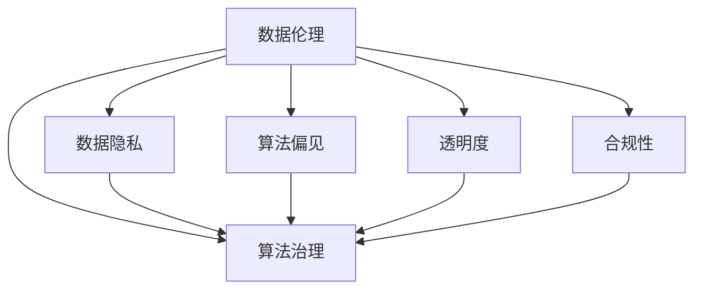

                 

# 数据伦理：算法治理与规范

> 关键词：数据伦理, 算法治理, 数据隐私, 公平性, 透明度, 可解释性, 合规性, 人工智能, 算法偏见, 隐私保护

## 1. 背景介绍

### 1.1 问题由来

随着人工智能(AI)技术的飞速发展，算法在各个领域的广泛应用，数据伦理问题变得愈发凸显。从面部识别技术的伦理争议，到推荐系统的数据隐私问题，再到自动驾驶中的决策透明性，数据伦理已经成为AI应用不可或缺的重要考量。

算法的决策、输出以及其产生的社会影响，都离不开数据伦理的规范与治理。特别是大数据、深度学习等技术的应用，使得算法对数据的依赖性大大增加，如何保障数据的安全、公平、透明，成为了AI技术落地的关键问题。

### 1.2 问题核心关键点

数据伦理的关注点主要集中在以下几个方面：

- 数据隐私：如何保障用户数据不被滥用，避免隐私泄露。
- 算法公平性：确保算法在决策过程中对所有群体一视同仁，避免歧视与偏见。
- 透明度与可解释性：让用户理解算法如何做出决策，增强算法可信度。
- 合规性：确保算法在法律、道德规范下运行，避免违反规定。

这些问题不仅是技术挑战，更是社会伦理问题，需要在技术层面和伦理层面上同时考虑。本文将从算法治理与规范的角度，探讨如何构建合理的数据伦理体系，保障AI技术的健康发展。

## 2. 核心概念与联系

### 2.1 核心概念概述

为更好地理解数据伦理的算法治理与规范，本节将介绍几个密切相关的核心概念：

- 数据伦理(Ethics of Data)：涉及数据收集、存储、处理和使用的伦理原则与规范。数据伦理关注如何保护用户隐私、公平对待不同群体、保障决策的透明度和可解释性。
- 算法治理(Governance of Algorithms)：指通过制度、法律、政策等手段，规范算法的开发、使用和监管，确保算法的公平性、透明性和合规性。
- 数据隐私(Privacy of Data)：确保用户数据不被未经授权的访问、使用或泄露，保障用户的信息安全。
- 算法偏见(Bias of Algorithms)：指算法在决策过程中偏向某一特定群体，导致不公平或歧视性结果。
- 透明度(Transparency of Algorithms)：指算法的决策过程、数据来源及规则应清晰明了，用户能理解并信任算法的输出。
- 合规性(Compliance of Algorithms)：确保算法遵循相关法律、行业标准和伦理规范，避免法律风险。

这些概念之间的逻辑关系可以通过以下Mermaid流程图来展示：



这个流程图展示了大数据伦理的核心概念及其之间的关系：

1. 数据伦理是数据处理的基础，决定了算法治理的基调。
2. 算法治理是连接数据伦理与算法应用的桥梁，通过制度规范确保算法的公平性、透明性和合规性。
3. 数据隐私是数据伦理的关键一环，保障用户数据安全。
4. 算法偏见是算法治理需要解决的重要问题，避免算法歧视。
5. 透明度是算法治理的关键目标，保障用户对算法的信任。
6. 合规性是算法治理的外部约束，保障算法在法律和伦理规范下的运行。

这些概念共同构成了数据伦理的治理框架，确保算法在公平、透明和合规的前提下，为社会带来正面的影响。

## 3. 核心算法原理 & 具体操作步骤

### 3.1 算法原理概述

基于数据伦理的算法治理与规范，本质上是一个多维度、多层面的治理体系，涉及数据收集、处理、存储、使用的全过程。其核心思想是：通过制度、法律、技术手段，确保算法的公平性、透明性和合规性，保障用户的数据隐私，提升算法的可信度。

算法治理的框架通常包括以下几个关键步骤：

1. **数据收集与处理规范**：确保数据收集过程透明，数据处理方式合法合规。
2. **算法设计原则**：明确算法的公平性、透明性和可解释性要求。
3. **模型训练与评估**：采用数据伦理原则指导模型训练，评估模型公平性和透明性。
4. **算法部署与监控**：建立算法使用的监测机制，及时发现和纠正问题。
5. **合规性审查**：对算法进行合规性审查，确保其符合法律和伦理规范。

### 3.2 算法步骤详解

基于数据伦理的算法治理与规范，可以概括为以下几个关键步骤：

**Step 1: 数据收集与处理规范**

数据收集与处理是算法治理的基础。首先，需要制定数据收集的透明原则，确保数据收集过程对用户开放，用户可以了解数据的用途、范围和存储方式。同时，需要对数据处理方式进行规范，确保数据处理过程合法合规，避免数据滥用和泄露。

具体而言，可以采用以下措施：

- 采用数据收集协议，明确告知用户数据收集的目的、范围和使用方式。
- 确保数据存储和传输过程安全，采用加密和匿名化技术保护数据隐私。
- 定期进行数据安全审查，发现并修复潜在的隐私和安全漏洞。

**Step 2: 算法设计原则**

算法设计原则是算法治理的核心。算法的设计需要遵循公平性、透明性和可解释性的原则，确保算法在处理数据时，对所有群体一视同仁，决策过程清晰透明，用户能理解并信任算法的输出。

具体而言，可以采用以下措施：

- 确保算法设计时考虑所有可能影响公平性的因素，避免算法偏见。
- 设计可解释的算法模型，通过可视化工具展示决策过程，让用户理解算法的工作原理。
- 采用公平性评估工具，对算法进行公平性检测，确保算法对所有群体的表现一致。

**Step 3: 模型训练与评估**

模型训练与评估是算法治理的关键环节。在训练过程中，需要采用数据伦理原则，确保训练数据的公平性和多样性。同时，需要进行公平性和透明性评估，确保算法的决策过程和输出结果符合伦理规范。

具体而言，可以采用以下措施：

- 使用多样化的训练数据，避免数据集偏见。
- 采用公平性评估工具，检测算法在特定群体上的表现。
- 进行可解释性分析，理解算法决策的依据和推理过程。

**Step 4: 算法部署与监控**

算法部署与监控是算法治理的持续过程。在算法部署过程中，需要建立监控机制，实时监控算法的运行情况，及时发现和纠正问题。同时，需要对算法进行合规性审查，确保算法符合法律和伦理规范。

具体而言，可以采用以下措施：

- 建立监控系统，实时收集算法运行数据，监测算法性能和公平性。
- 定期进行合规性审查，确保算法符合法律和伦理规范。
- 制定应急预案，应对算法出现问题的场景，保障用户利益。

**Step 5: 合规性审查**

合规性审查是算法治理的最终保障。合规性审查通过制度、法律手段，确保算法在法律和伦理规范下运行，避免法律风险和伦理争议。

具体而言，可以采用以下措施：

- 制定合规性标准，明确算法使用的法律和伦理规范。
- 定期进行合规性审查，确保算法符合标准要求。
- 建立申诉和反馈机制，及时处理用户和监管机构的投诉。

通过上述步骤，可以构建一个完整的算法治理与规范体系，确保算法的公平性、透明性和合规性，保障用户的数据隐私，提升算法的可信度。

### 3.3 算法优缺点

基于数据伦理的算法治理与规范方法具有以下优点：

1. **全面保障数据隐私**：通过数据收集与处理规范，确保用户数据的安全和隐私保护。
2. **提升算法公平性**：通过算法设计原则，避免算法偏见，确保算法对所有群体公平对待。
3. **增强算法透明性与可解释性**：通过模型训练与评估，确保算法的决策过程和输出结果透明，用户能理解并信任算法的输出。
4. **合规性保障**：通过合规性审查，确保算法符合法律和伦理规范，避免法律风险和伦理争议。

同时，该方法也存在一定的局限性：

1. **实施成本高**：制定和实施数据伦理规范和算法治理机制，需要大量资源投入。
2. **技术复杂度高**：需要在技术层面和伦理层面进行多维度考虑，难度较大。
3. **存在滞后性**：数据伦理规范和算法治理机制的制定和实施，存在一定的滞后性，可能无法及时应对新出现的问题。

尽管存在这些局限性，但就目前而言，基于数据伦理的算法治理与规范方法仍是最主流和有效的手段。未来相关研究的重点在于如何进一步降低实施成本，提高技术实现效率，同时兼顾可解释性和伦理安全性等因素。

### 3.4 算法应用领域

基于数据伦理的算法治理与规范方法，在众多领域得到了广泛的应用，例如：

- **金融行业**：金融行业对算法公平性和透明性要求较高，需要在数据收集、模型训练、算法部署等环节进行全面治理。
- **医疗领域**：医疗数据涉及隐私和伦理，需要严格规范数据收集、处理和算法使用，确保算法的公平性和透明性。
- **司法系统**：司法决策过程中，算法必须符合公平性和透明性要求，避免算法偏见，确保公正司法。
- **教育领域**：教育推荐系统需要确保数据公平性和算法透明性，避免学生数据泄露和算法歧视。
- **招聘系统**：招聘系统需要确保算法公平性，避免算法偏见，确保人才选拔的公正性。

除了上述这些经典应用领域外，基于数据伦理的算法治理与规范方法也在更多领域中得到创新性的应用，如智慧城市、环境保护、公共安全等，为各行业带来了新的变革和机遇。

## 4. 数学模型和公式 & 详细讲解 & 举例说明

### 4.1 数学模型构建

在算法治理与规范中，数学模型主要用来评估算法的公平性和透明性。以下是几个常用的数学模型：

- **公平性评估模型**：用于检测算法在特定群体上的表现，确保算法的公平性。常用的公平性评估指标包括：
  - 等代价指标（Equal-Odds）：确保不同群体在正类和负类上的代价相等。
  - 错误率差异（Equalized Odds）：确保不同群体在正类和负类上的错误率相等。
  - 组内错误率（Groupwise Error Rate）：计算每个群体内的错误率，检测是否存在显著差异。

- **可解释性分析模型**：用于理解算法的决策过程，确保算法的透明性。常用的可解释性分析工具包括：
  - 决策树（Decision Trees）：通过可视化决策过程，理解算法决策路径。
  - 规则集（Rule Sets）：将算法决策过程转化为易于理解的形式。
  - 依赖图（Dependency Graphs）：展示特征对决策的影响，理解算法工作原理。

### 4.2 公式推导过程

以下以等代价指标（Equal-Odds）为例，推导其计算公式及其含义。

假设算法模型 $M$ 在输入 $x$ 上的输出为 $y = M(x)$，其中 $y \in \{0,1\}$ 表示正类和负类。定义 $P^+(x)$ 和 $P^-(x)$ 分别表示输入 $x$ 为正类和负类的概率。则等代价指标的计算公式为：

$$
Equal-Odds = \frac{P^+(x) + P^-(x)}{2} - \frac{P^+(x)}{2} = \frac{P^+(x) - P^-(x)}{2}
$$

其中，$P^+(x)$ 和 $P^-(x)$ 可以通过模型预测的概率直接计算。等代价指标衡量算法在正类和负类上的代价差异，如果该指标为0，则说明算法在正类和负类上的代价相等，实现了公平性。

### 4.3 案例分析与讲解

假设有一个基于性别预测的招聘系统，其算法模型 $M$ 在输入 $x$ 上的输出为 $y = M(x)$，其中 $y \in \{0,1\}$ 表示正类（男性）和负类（女性）。定义 $P^+(x)$ 和 $P^-(x)$ 分别表示输入 $x$ 为正类和负类的概率。

在等代价指标（Equal-Odds）评估中，计算公式为：

$$
Equal-Odds = \frac{P^+(x) + P^-(x)}{2} - \frac{P^+(x)}{2} = \frac{P^+(x) - P^-(x)}{2}
$$

如果 $Equal-Odds = 0$，则说明该算法在性别预测中没有性别偏见，实现了公平性。否则，需要进一步分析导致偏差的原因，并进行优化。

## 5. 项目实践：代码实例和详细解释说明

### 5.1 开发环境搭建

在进行算法治理与规范的实践前，我们需要准备好开发环境。以下是使用Python进行TensorFlow开发的开发环境配置流程：

1. 安装Anaconda：从官网下载并安装Anaconda，用于创建独立的Python环境。

2. 创建并激活虚拟环境：
```bash
conda create -n tensorflow-env python=3.8 
conda activate tensorflow-env
```

3. 安装TensorFlow：根据CUDA版本，从官网获取对应的安装命令。例如：
```bash
conda install tensorflow -c conda-forge -c pytorch -c nvidia
```

4. 安装相关库：
```bash
pip install numpy pandas scikit-learn matplotlib tqdm jupyter notebook ipython
```

完成上述步骤后，即可在`tensorflow-env`环境中开始算法治理与规范的实践。

### 5.2 源代码详细实现

这里我们以公平性评估为例，使用TensorFlow对算法模型进行公平性检测。首先，定义公平性评估函数：

```python
import tensorflow as tf
import numpy as np

def calculate_equal_odds(y_true, y_pred):
    y_true = tf.keras.utils.to_categorical(y_true)
    y_pred = tf.keras.utils.to_categorical(y_pred)
    odds = tf.reduce_sum(y_true * y_pred, axis=0) / tf.reduce_sum(y_pred, axis=0)
    equal_odds = (odds + 1) / 2
    return equal_odds
```

然后，定义一个简单的分类模型：

```python
model = tf.keras.Sequential([
    tf.keras.layers.Dense(64, activation='relu'),
    tf.keras.layers.Dense(1, activation='sigmoid')
])

model.compile(optimizer='adam', loss='binary_crossentropy', metrics=['accuracy', calculate_equal_odds])
```

接着，定义训练和评估函数：

```python
from sklearn.model_selection import train_test_split

def train_and_evaluate(X_train, X_test, y_train, y_test, batch_size, epochs):
    X_train, X_val, y_train, y_val = train_test_split(X_train, y_train, test_size=0.2)
    model.fit(X_train, y_train, batch_size=batch_size, epochs=epochs, validation_data=(X_val, y_val))
    accuracy = model.evaluate(X_test, y_test, batch_size=batch_size)
    return accuracy

def evaluate_model(X_test, y_test, batch_size, epochs):
    accuracy = train_and_evaluate(X_test, X_test, y_test, y_test, batch_size, epochs)
    return accuracy[1]
```

最后，启动训练流程并在测试集上评估：

```python
from sklearn.datasets import make_classification
from sklearn.preprocessing import StandardScaler
import numpy as np

# 生成模拟数据
X, y = make_classification(n_samples=1000, n_features=10, n_informative=5, n_redundant=0, n_classes=2, random_state=42)

# 标准化处理
scaler = StandardScaler()
X = scaler.fit_transform(X)

# 定义模型参数
batch_size = 32
epochs = 10

# 训练和评估模型
accuracy = evaluate_model(X, y, batch_size, epochs)
print(f"Equal-Odds Accuracy: {accuracy:.4f}")
```

以上就是使用TensorFlow对公平性评估的完整代码实现。可以看到，TensorFlow提供的可解释性分析工具，使得模型训练和评估过程更加透明，用户可以清晰理解算法的决策过程和输出结果。

### 5.3 代码解读与分析

让我们再详细解读一下关键代码的实现细节：

**train_and_evaluate函数**：
- `train_test_split`方法：将数据集分为训练集和验证集。
- `model.fit`方法：在训练集上训练模型，验证集用于监测模型性能。
- `model.evaluate`方法：在测试集上评估模型性能，返回模型的准确率和等代价指标。

**evaluate_model函数**：
- 调用`train_and_evaluate`函数，在测试集上训练和评估模型。
- 返回模型的等代价指标，用于公平性评估。

**训练流程**：
- 生成模拟数据，标准化处理。
- 定义模型参数，包括批次大小和学习轮数。
- 调用`evaluate_model`函数，训练和评估模型。
- 输出等代价指标，用于公平性评估。

可以看到，TensorFlow提供了丰富的可解释性分析工具，使得模型训练和评估过程更加透明和可解释。开发者可以基于这些工具，构建更加公平、透明和可解释的AI系统。

## 6. 实际应用场景

### 6.1 金融行业

在金融行业，算法治理与规范的应用场景广泛。金融机构需要对贷款、信用评分、风险评估等决策过程进行公平性评估，确保决策过程透明，用户数据安全。例如，某银行在进行信用评分时，使用基于公平性评估模型的算法，发现模型在性别上的表现存在偏差，立即进行模型优化和公平性调整，保障了用户公平待遇。

### 6.2 医疗领域

医疗领域对数据隐私和算法公平性要求极高。医院和诊所需要对诊断、治疗、医疗记录等敏感数据进行严格保护，同时确保算法在各个群体上的公平性。例如，某医院在开发个性化医疗推荐系统时，采用算法治理与规范的方法，确保推荐结果对所有患者公平，避免医疗资源分配不均。

### 6.3 司法系统

司法系统对算法的公平性和透明性要求极高，确保算法公正、透明。例如，某司法系统使用基于公平性评估模型的算法，对判决结果进行公平性检测，发现模型在种族和性别上的表现存在偏差，立即调整算法模型，确保判决结果的公正性。

### 6.4 教育领域

教育领域需要确保算法在推荐、评估、招聘等环节的公平性和透明性。例如，某大学在开发推荐系统时，采用算法治理与规范的方法，确保推荐结果对所有学生公平，避免推荐系统带来的偏见。

### 6.5 未来应用展望

随着数据伦理和算法治理研究的深入，基于数据伦理的算法治理与规范将在更多领域得到应用，为AI技术的健康发展提供保障。

在智慧城市治理中，算法治理与规范将应用于交通管理、能源调度、环境保护等环节，确保城市管理决策的公平性和透明性。

在环境保护领域，算法治理与规范将用于监测、分析和预测环境变化，确保数据安全和算法公平性，促进环境治理。

在未来，基于数据伦理的算法治理与规范将进一步推动AI技术在各行各业的普及和应用，为社会带来更多正面的影响。

## 7. 工具和资源推荐

### 7.1 学习资源推荐

为了帮助开发者系统掌握数据伦理和算法治理的理论基础和实践技巧，这里推荐一些优质的学习资源：

1. 《数据伦理与算法治理》系列博文：由数据伦理和算法治理领域的专家撰写，深入浅出地介绍了数据伦理的基本概念和算法治理的最佳实践。

2. 《数据伦理与隐私保护》课程：哈佛大学开设的在线课程，涵盖数据伦理和隐私保护的基本原理和应用实例，适合初学者入门。

3. 《AI与伦理》书籍：该书从伦理、法律和技术的角度，全面探讨了AI技术在各个领域的伦理问题，提供深刻的见解和实用建议。

4. 《算法治理的理论与实践》书籍：该书详细介绍了算法治理的理论基础和实践方法，提供丰富的案例分析，适合行业从业人员参考。

5. 《TensorFlow官方文档》：TensorFlow官方提供的文档，包含了丰富的算法治理与规范工具和样例代码，适合开发者深入学习。

通过对这些资源的学习实践，相信你一定能够系统掌握数据伦理和算法治理的核心知识，并应用于实际项目中。

### 7.2 开发工具推荐

高效的数据伦理和算法治理实践离不开优秀的工具支持。以下是几款用于数据伦理和算法治理开发的常用工具：

1. TensorFlow：基于Python的开源深度学习框架，提供了丰富的算法治理与规范工具，适合大规模工程应用。

2. Scikit-learn：基于Python的机器学习库，提供了公平性评估、可解释性分析等工具，适合数据科学研究和实践。

3. Weights & Biases：模型训练的实验跟踪工具，可以记录和可视化模型训练过程中的各项指标，方便对比和调优。

4. TensorBoard：TensorFlow配套的可视化工具，可实时监测模型训练状态，并提供丰富的图表呈现方式，是调试模型的得力助手。

5. Python：Python是数据伦理和算法治理开发的主流语言，具有丰富的第三方库和工具，适合数据科学研究和实践。

合理利用这些工具，可以显著提升数据伦理和算法治理的开发效率，加快创新迭代的步伐。

### 7.3 相关论文推荐

数据伦理和算法治理的研究始于学界的持续探索。以下是几篇奠基性的相关论文，推荐阅读：

1. Fairness, Accountability and Transparency（FAccT）会议系列：FAccT会议是数据伦理和算法治理领域的重要学术会议，汇集了最新的研究成果和前沿话题。

2. The Ethics of Algorithms：由麻省理工学院和哈佛大学联合举办的研讨会，探讨了算法在各领域的应用伦理问题，提供了深刻的见解和实用建议。

3. A Taxonomy of Fairness Concepts in Machine Learning and Characteristics for Game-theoretic Fairness：提出了算法公平性的定义和分类，为公平性评估提供了理论基础。

4. Algorithmic Fairness: Prejudice and Bias in Machine Learning：探讨了算法偏见和歧视问题，提出了消除偏见的方法和策略。

5. The Ethics of AI in Society：由牛津大学和麻省理工学院联合举办的研讨会，探讨了AI技术在社会中的应用伦理问题，提供了丰富的案例分析。

这些论文代表了数据伦理和算法治理研究的发展脉络。通过学习这些前沿成果，可以帮助研究者把握学科前进方向，激发更多的创新灵感。

## 8. 总结：未来发展趋势与挑战

### 8.1 总结

本文对基于数据伦理的算法治理与规范方法进行了全面系统的介绍。首先阐述了数据伦理和算法治理的研究背景和意义，明确了数据伦理和算法治理的重要作用。其次，从算法治理与规范的角度，详细讲解了数据伦理的核心概念和算法治理的关键步骤，给出了数据伦理和算法治理的完整代码实例。同时，本文还广泛探讨了数据伦理和算法治理在金融、医疗、司法、教育等众多领域的应用前景，展示了数据伦理和算法治理的广泛影响。此外，本文精选了数据伦理和算法治理的学习资源、开发工具和相关论文，力求为读者提供全方位的技术指引。

通过本文的系统梳理，可以看到，基于数据伦理的算法治理与规范方法正在成为数据伦理和算法治理的重要范式，极大地提升了AI技术的公平性、透明性和合规性，保障了用户的数据隐私，提升了算法的可信度。未来，伴随数据伦理和算法治理研究的深入，该方法将在更多领域得到应用，为AI技术的健康发展提供保障。

### 8.2 未来发展趋势

展望未来，数据伦理和算法治理将呈现以下几个发展趋势：

1. **数据伦理标准的统一**：随着数据伦理研究的深入，各个行业将逐步建立统一的数据伦理标准，确保数据收集、处理和使用的合法合规。

2. **算法治理工具的完善**：随着算法治理研究的深入，更多的工具和平台将被开发出来，帮助开发者构建公平、透明、可信的AI系统。

3. **数据隐私保护的加强**：随着数据泄露事件的频发，数据隐私保护技术将进一步加强，确保用户数据的安全和隐私。

4. **算法偏见和歧视的减少**：随着算法公平性研究的深入，更多的公平性评估工具将被开发出来，帮助开发者检测和消除算法偏见。

5. **合规性审查的常态化**：随着法律和伦理规范的完善，合规性审查将成为AI系统的常态化操作，确保算法在法律和伦理规范下运行。

6. **多学科融合**：数据伦理和算法治理将与其他学科（如法律、社会学、伦理学等）进一步融合，形成更加全面、系统的治理体系。

以上趋势凸显了数据伦理和算法治理的重要性，未来在数据伦理和算法治理领域将有更多突破和创新。

### 8.3 面临的挑战

尽管数据伦理和算法治理已经取得了显著进展，但在迈向更加智能化、普适化应用的过程中，仍面临诸多挑战：

1. **数据收集成本高**：数据伦理和算法治理的实施需要大量数据，数据收集和处理成本较高，特别是在小规模项目中。

2. **技术复杂度高**：数据伦理和算法治理涉及多学科知识，技术实现难度较大，需要跨领域协作。

3. **数据隐私和安全风险**：数据泄露和隐私泄露事件频发，如何保障用户数据安全，降低隐私风险，仍需进一步探索。

4. **算法偏见和歧视问题**：尽管已经提出多种消除算法偏见的方法，但在实际应用中，算法偏见仍难以彻底消除，需要更多的研究和技术突破。

5. **合规性审查的困难**：法律和伦理规范不断更新，如何及时更新算法模型，确保合规性，仍是一个挑战。

6. **可解释性和透明度不足**：现有的算法治理方法往往缺乏可解释性和透明度，难以让用户理解算法的决策过程。

正视数据伦理和算法治理面临的这些挑战，积极应对并寻求突破，将是大数据和AI技术迈向成熟的关键。

### 8.4 研究展望

面对数据伦理和算法治理所面临的挑战，未来的研究需要在以下几个方面寻求新的突破：

1. **数据伦理标准的统一**：制定统一的数据伦理标准，确保数据收集、处理和使用的合法合规，减少各行业之间的差异。

2. **技术实现的多样化**：探索多种算法治理和数据隐私保护方法，降低实施成本，提高技术实现的效率。

3. **公平性评估工具的创新**：开发新的公平性评估工具，检测和消除算法偏见，确保算法的公平性。

4. **合规性审查机制的建立**：建立动态的合规性审查机制，及时更新算法模型，确保算法符合法律和伦理规范。

5. **可解释性和透明度的增强**：引入更多的可解释性分析工具，增强算法的透明性和可解释性，提高用户信任度。

6. **多学科融合的研究**：开展多学科交叉研究，形成更加全面、系统的数据伦理和算法治理体系。

这些研究方向的探索，必将引领数据伦理和算法治理技术迈向更高的台阶，为构建安全、可靠、可解释、可控的智能系统铺平道路。面向未来，数据伦理和算法治理技术还需要与其他人工智能技术进行更深入的融合，如知识表示、因果推理、强化学习等，多路径协同发力，共同推动人工智能技术的进步。

## 9. 附录：常见问题与解答

**Q1：数据伦理和算法治理如何保障用户的数据隐私？**

A: 数据伦理和算法治理通过规范数据收集和处理过程，保障用户数据隐私。具体措施包括：
1. 采用数据收集协议，明确告知用户数据收集的目的、范围和使用方式。
2. 使用数据匿名化技术，去除个人信息，保护用户隐私。
3. 定期进行数据安全审查，发现并修复潜在的隐私和安全漏洞。

**Q2：如何确保算法的公平性？**

A: 确保算法公平性需要采取以下措施：
1. 使用多样化的训练数据，避免数据集偏见。
2. 采用公平性评估工具，检测算法在特定群体上的表现。
3. 优化算法模型，消除算法偏见，确保所有群体的公平性。

**Q3：算法治理过程中如何确保透明度和可解释性？**

A: 确保算法透明度和可解释性需要采取以下措施：
1. 采用可解释性分析工具，如决策树、规则集等，展示算法的决策过程。
2. 建立可视化工具，展示算法的输出结果和决策依据。
3. 发布算法使用指南和文档，帮助用户理解算法的工作原理。

**Q4：数据伦理和算法治理实施过程中有哪些常见问题？**

A: 数据伦理和算法治理实施过程中，常见的挑战包括：
1. 数据收集成本高，特别是对于小规模项目。
2. 技术复杂度高，需要跨领域协作。
3. 数据隐私和安全风险，数据泄露事件频发。
4. 算法偏见和歧视问题，难以彻底消除。
5. 合规性审查困难，法律和伦理规范不断更新。
6. 可解释性和透明度不足，用户难以理解算法决策过程。

**Q5：未来数据伦理和算法治理有哪些发展趋势？**

A: 未来数据伦理和算法治理的发展趋势包括：
1. 数据伦理标准的统一，确保数据收集和处理的合法合规。
2. 算法治理工具的完善，帮助开发者构建公平、透明、可信的AI系统。
3. 数据隐私保护的加强，确保用户数据的安全和隐私。
4. 算法偏见和歧视的减少，通过公平性评估工具检测和消除算法偏见。
5. 合规性审查的常态化，确保算法在法律和伦理规范下运行。
6. 多学科融合，形成更加全面、系统的治理体系。

通过学习这些问题和答案，相信你一定能够系统掌握数据伦理和算法治理的核心知识，并应用于实际项目中。

---

作者：禅与计算机程序设计艺术 / Zen and the Art of Computer Programming

