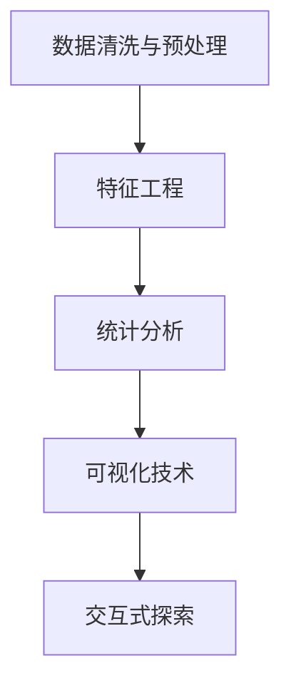

                 

# 数据可视化与数据探索原理与代码实战案例讲解

> 关键词：数据可视化, 数据探索, 数据清洗, 特征工程, 统计分析, 数据科学

## 1. 背景介绍

数据可视化与数据探索是数据科学的核心能力之一，是构建数据驱动决策的关键步骤。通过科学地使用数据可视化技术，可以有效地揭示数据背后的模式、趋势和关联，为进一步的数据分析提供直观的视觉支撑。本博客将深入探讨数据可视化与数据探索的原理与实战技巧，展示如何使用Python和相关库实现高效的数据探索与可视化。

### 1.1 问题由来

在数据科学领域，数据探索和可视化是最基础但也是非常重要的环节。它们不仅仅能够帮助我们快速理解数据的特征与分布，还能指导后续的数据建模与预测分析。然而，在实践中，许多数据科学家常常面临以下挑战：

1. **数据量大且复杂**：大数据集往往包含多个维度和复杂的关系，难以直观展示。
2. **数据不一致性**：数据源和格式的多样性导致数据存在不一致，影响可视化效果。
3. **数据故事讲述**：如何将数据分析结果转化为具有说服力的故事，是一大难题。
4. **实时性要求**：对于实时数据分析和交互式探索，现有的工具和方法可能不够灵活。

### 1.2 问题核心关键点

为解决上述问题，需要掌握以下几个核心关键点：

- **数据清洗与预处理**：去除噪声和异常值，填补缺失值，处理重复数据等。
- **特征工程**：选择合适的特征和转换方式，构建对模型有帮助的特征集。
- **统计分析与可视化**：使用统计方法对数据进行描述性分析，并选择合适的可视化图表展示结果。
- **交互式探索**：利用交互式图表和工具，实现数据的动态探索与分析。

掌握这些关键点，将能够高效地进行数据探索和可视化，为后续的数据建模和预测分析奠定坚实基础。

## 2. 核心概念与联系

### 2.1 核心概念概述

数据可视化与数据探索涉及多个核心概念，以下是关键概念及其联系的概述：

- **数据清洗与预处理**：通过数据清洗技术去除噪音和异常值，填补缺失值，处理重复数据等，确保数据的准确性与一致性。
- **特征工程**：选择合适的特征，并进行必要的转换和衍生，构建对模型有帮助的特征集。
- **统计分析**：使用描述性统计、假设检验、回归分析等方法，对数据进行深入分析，揭示数据背后的规律与关联。
- **可视化技术**：通过折线图、柱状图、散点图、热力图、树状图等，将数据分析结果转化为直观的视觉展示。
- **交互式探索**：利用交互式图表和工具，实现数据的动态探索与分析，支持用户自定义探索需求。

这些概念相互联系，共同构成了数据探索与可视化的完整流程，有助于深入理解数据特征，指导后续的数据建模与预测分析。

### 2.2 核心概念原理和架构的 Mermaid 流程图



## 3. 核心算法原理 & 具体操作步骤

### 3.1 算法原理概述

数据可视化与数据探索的原理基于统计学、信息论和计算机视觉理论。其核心思想是通过将数据转换为可视形式，揭示数据中的模式、趋势和关联，为进一步的数据分析和决策提供支持。以下是具体的算法原理：

1. **数据清洗与预处理**：
   - 数据清洗：去除重复值、缺失值、异常值等，确保数据的一致性和完整性。
   - 数据转换：使用标准化、归一化等方法，将数据转换为适合可视化的形式。
   - 数据衍生：通过统计计算或特征工程，生成新的特征，丰富数据的维度。

2. **特征工程**：
   - 特征选择：根据业务需求，选择对模型有帮助的特征。
   - 特征转换：将原始数据转换为适合分析的格式，如将文本数据转换为词袋模型或TF-IDF向量。
   - 特征衍生：通过统计计算或算法模型，生成新的特征，增强数据的解释性和预测能力。

3. **统计分析**：
   - 描述性统计：使用均值、中位数、标准差等指标，对数据进行概括性描述。
   - 假设检验：使用t检验、卡方检验等方法，检验数据间的关系与差异。
   - 回归分析：使用线性回归、逻辑回归等方法，揭示数据间的因果关系。

4. **可视化技术**：
   - 数据分布图：如直方图、密度图等，展示数据的分布特征。
   - 关系图：如散点图、热力图等，展示数据间的关系与依赖。
   - 分类图：如树状图、聚类图等，展示数据的分类与分组。

5. **交互式探索**：
   - 交互式图表：如动态散点图、交互式柱状图等，支持用户自定义探索需求。
   - 可视化工具：如Tableau、Power BI等，提供更丰富的交互与探索功能。

### 3.2 算法步骤详解

以下是数据可视化与数据探索的具体操作步骤：

#### 3.2.1 数据清洗与预处理

1. **导入数据**：
   ```python
   import pandas as pd
   data = pd.read_csv('data.csv')
   ```

2. **数据清洗**：
   - 去除重复值：
     ```python
     data.drop_duplicates(inplace=True)
     ```

   - 处理缺失值：
     ```python
     data.fillna(method='ffill', inplace=True)
     ```

   - 处理异常值：
     ```python
     z_scores = (data - data.mean()) / data.std()
     threshold = 3
     data = data[(z_scores < threshold).all(axis=1)]
     ```

3. **数据转换**：
   - 标准化处理：
     ```python
     from sklearn.preprocessing import StandardScaler
     scaler = StandardScaler()
     data['feature'] = scaler.fit_transform(data['feature'].values.reshape(-1, 1))
     ```

   - 归一化处理：
     ```python
     from sklearn.preprocessing import MinMaxScaler
     scaler = MinMaxScaler()
     data['feature'] = scaler.fit_transform(data['feature'].values.reshape(-1, 1))
     ```

#### 3.2.2 特征工程

1. **特征选择**：
   - 使用相关性分析选择重要特征：
     ```python
     from scipy.stats import pearsonr
     correlation_matrix = data.corr()
     significant_features = correlation_matrix[abs(correlation_matrix)>0.5].index.tolist()
     ```

2. **特征转换**：
   - 将文本数据转换为词袋模型或TF-IDF向量：
     ```python
     from sklearn.feature_extraction.text import TfidfVectorizer
     vectorizer = TfidfVectorizer()
     data['feature'] = vectorizer.fit_transform(data['text'])
     ```

3. **特征衍生**：
   - 生成新的特征，如交叉特征、时间特征等：
     ```python
     data['new_feature'] = data['feature'] * data['other_feature']
     data['time_month'] = data['date'].dt.month
     ```

#### 3.2.3 统计分析

1. **描述性统计**：
   - 计算均值、中位数、标准差等指标：
     ```python
     data.describe()
     ```

2. **假设检验**：
   - 进行t检验：
     ```python
     from scipy.stats import ttest_ind
     ttest_ind(data['feature1'], data['feature2'])
     ```

3. **回归分析**：
   - 进行线性回归分析：
     ```python
     from sklearn.linear_model import LinearRegression
     model = LinearRegression()
     model.fit(data[['feature1', 'feature2']], data['target'])
     ```

#### 3.2.4 可视化技术

1. **数据分布图**：
   - 绘制直方图：
     ```python
     import matplotlib.pyplot as plt
     plt.hist(data['feature'], bins=20)
     plt.show()
     ```

   - 绘制密度图：
     ```python
     data.hist(figsize=(10, 8), bins=20, edgecolor='black')
     plt.show()
     ```

2. **关系图**：
   - 绘制散点图：
     ```python
     plt.scatter(data['feature1'], data['feature2'])
     plt.xlabel('Feature 1')
     plt.ylabel('Feature 2')
     plt.show()
     ```

   - 绘制热力图：
     ```python
     import seaborn as sns
     sns.heatmap(correlation_matrix, annot=True, fmt='.2f')
     plt.show()
     ```

3. **分类图**：
   - 绘制树状图：
     ```python
     from sklearn.tree import DecisionTreeClassifier
     from sklearn.tree import plot_tree
     tree = DecisionTreeClassifier()
     tree.fit(data[['feature1', 'feature2']], data['target'])
     plot_tree(tree)
     plt.show()
     ```

#### 3.2.5 交互式探索

1. **交互式图表**：
   - 使用Plotly绘制动态散点图：
     ```python
     import plotly.express as px
     fig = px.scatter(data, x='feature1', y='feature2', hover_data=['target'])
     fig.show()
     ```

2. **可视化工具**：
   - 使用Tableau或Power BI进行交互式探索：
     - 导入数据：
       ```python
       import pyodbc
       cnxn = pyodbc.connect('DRIVER={SQL Server};SERVER=localhost;DATABASE=myDB;UID=myUID;PWD=myPWD')
       df = pd.read_sql('SELECT * FROM myTable', con=cnxn)
       ```

     - 创建交互式报表：
       ```python
       import altair as alt
       chart = alt.Chart(df).mark(alt.ChartType()).encode(
           x=alt.X('feature1'),
           y=alt.Y('feature2'),
           color=alt.Color('target')
       ).interactive()
       chart.show()
       ```

### 3.3 算法优缺点

#### 3.3.1 优点

1. **直观性**：
   - 可视化数据可以直观地揭示数据中的模式、趋势和关联，便于理解和分析。
2. **交互性**：
   - 交互式图表和工具支持用户自定义探索需求，动态调整分析结果。
3. **可视化效果**：
   - 丰富的图表类型和工具支持，能够展示多维数据的复杂关系。

#### 3.3.2 缺点

1. **数据清洗复杂**：
   - 数据清洗和预处理需要大量的时间和精力，特别是面对复杂和多样性的数据源。
2. **技术门槛高**：
   - 需要掌握多种工具和技术，如Python、R、SQL等，以及可视化库和图表绘制技巧。
3. **性能问题**：
   - 对于大数据集，可视化过程可能面临性能瓶颈，需要优化算法和工具。

### 3.4 算法应用领域

数据可视化与数据探索在多个领域具有广泛的应用：

- **金融分析**：
  - 数据可视化在金融领域用于展示股票价格、市场波动、风险评估等，支持投资决策。
  - 统计分析揭示市场趋势和风险因素，为风险管理提供依据。

- **市场营销**：
  - 数据可视化展示客户行为、销售数据等，帮助企业制定市场策略。
  - 统计分析揭示客户细分和购买趋势，优化营销方案。

- **医疗健康**：
  - 数据可视化展示患者数据、疾病分布等，支持医疗决策和公共卫生政策。
  - 统计分析揭示疾病趋势和关联，预测疫情和公共卫生事件。

- **交通运输**：
  - 数据可视化展示交通流量、事故数据等，支持交通管理和决策。
  - 统计分析揭示交通模式和需求，优化交通规划和资源配置。

- **零售电商**：
  - 数据可视化展示销售数据、客户反馈等，支持产品管理和客户服务。
  - 统计分析揭示销售趋势和客户需求，优化库存管理和市场策略。

## 4. 数学模型和公式 & 详细讲解 & 举例说明

### 4.1 数学模型构建

数据可视化与数据探索的数学模型构建主要基于统计学和计算机视觉理论。其核心思想是通过数学模型揭示数据特征，并转化为可视化形式。以下是主要数学模型的构建方法：

#### 4.1.1 描述性统计模型

描述性统计模型用于概括数据的分布和特征，包括均值、中位数、标准差、方差等。其数学公式如下：

- 均值：
  $$
  \mu = \frac{1}{n} \sum_{i=1}^n x_i
  $$

- 中位数：
  $$
  M = \frac{1}{2} \times (x_{(n/2)} + x_{(n/2+1)})
  $$

- 标准差：
  $$
  \sigma = \sqrt{\frac{1}{n} \sum_{i=1}^n (x_i - \mu)^2}
  $$

- 方差：
  $$
  \sigma^2 = \frac{1}{n} \sum_{i=1}^n (x_i - \mu)^2
  $$

#### 4.1.2 假设检验模型

假设检验模型用于检验数据间的关系与差异，包括t检验、卡方检验等。其数学公式如下：

- t检验：
  $$
  t = \frac{\overline{x}_1 - \overline{x}_2}{s_p \sqrt{\frac{1}{n_1} + \frac{1}{n_2}}}
  $$

- 卡方检验：
  $$
  \chi^2 = \sum_{i=1}^n \frac{(O_i - E_i)^2}{E_i}
  $$

#### 4.1.3 回归分析模型

回归分析模型用于揭示数据间的因果关系，包括线性回归、逻辑回归等。其数学公式如下：

- 线性回归：
  $$
  y = \beta_0 + \beta_1 x_1 + \beta_2 x_2 + \ldots + \beta_n x_n + \epsilon
  $$

- 逻辑回归：
  $$
  \log \frac{P(y=1)}{P(y=0)} = \beta_0 + \beta_1 x_1 + \beta_2 x_2 + \ldots + \beta_n x_n
  $$

### 4.2 公式推导过程

#### 4.2.1 描述性统计推导

描述性统计的公式推导基于样本均值和样本方差的基本定义，推导过程如下：

- 均值：
  $$
  \mu = \frac{1}{n} \sum_{i=1}^n x_i
  $$

  其中，$x_i$ 为第 $i$ 个样本值，$n$ 为样本数量。

- 中位数：
  $$
  M = \frac{1}{2} \times (x_{(n/2)} + x_{(n/2+1)})
  $$

  其中，$x_{(n/2)}$ 和 $x_{(n/2+1)}$ 为第 $n/2$ 和 $n/2+1$ 个样本值，$n$ 为样本数量。

- 标准差：
  $$
  \sigma = \sqrt{\frac{1}{n} \sum_{i=1}^n (x_i - \mu)^2}
  $$

  其中，$\mu$ 为样本均值，$n$ 为样本数量。

- 方差：
  $$
  \sigma^2 = \frac{1}{n} \sum_{i=1}^n (x_i - \mu)^2
  $$

  其中，$\mu$ 为样本均值，$n$ 为样本数量。

#### 4.2.2 假设检验推导

假设检验的公式推导基于t检验和卡方检验的基本定义，推导过程如下：

- t检验：
  $$
  t = \frac{\overline{x}_1 - \overline{x}_2}{s_p \sqrt{\frac{1}{n_1} + \frac{1}{n_2}}}
  $$

  其中，$\overline{x}_1$ 和 $\overline{x}_2$ 为两组样本的均值，$s_p$ 为两组样本的池化标准差，$n_1$ 和 $n_2$ 为两组样本的数量。

- 卡方检验：
  $$
  \chi^2 = \sum_{i=1}^n \frac{(O_i - E_i)^2}{E_i}
  $$

  其中，$O_i$ 为实际观测值，$E_i$ 为期望值，$n$ 为样本数量。

#### 4.2.3 回归分析推导

回归分析的公式推导基于最小二乘法的基本原理，推导过程如下：

- 线性回归：
  $$
  y = \beta_0 + \beta_1 x_1 + \beta_2 x_2 + \ldots + \beta_n x_n + \epsilon
  $$

  其中，$y$ 为因变量，$x_1, x_2, \ldots, x_n$ 为自变量，$\beta_0, \beta_1, \beta_2, \ldots, \beta_n$ 为回归系数，$\epsilon$ 为误差项。

- 逻辑回归：
  $$
  \log \frac{P(y=1)}{P(y=0)} = \beta_0 + \beta_1 x_1 + \beta_2 x_2 + \ldots + \beta_n x_n
  $$

  其中，$P(y=1)$ 和 $P(y=0)$ 分别为因变量取值为1和0的概率，$\beta_0, \beta_1, \beta_2, \ldots, \beta_n$ 为回归系数。

### 4.3 案例分析与讲解

#### 4.3.1 数据可视化案例分析

假设我们有一份销售数据集，包含商品ID、销售额、销售日期等字段。以下是数据可视化的案例分析：

1. **描述性统计**：
   - 绘制销售额直方图：
     ```python
     data['revenue'].hist(figsize=(10, 8), bins=20, edgecolor='black')
     plt.show()
     ```

   - 计算销售额的均值、中位数和标准差：
     ```python
     mean_sales = data['revenue'].mean()
     median_sales = data['revenue'].median()
     std_sales = data['revenue'].std()
     print(f"Mean sales: {mean_sales}, Median sales: {median_sales}, Standard deviation: {std_sales}")
     ```

2. **假设检验**：
   - 进行商品销售额的t检验：
     ```python
     from scipy.stats import ttest_ind
     ttest_ind(data['revenue'][data['product'] == 'A'], data['revenue'][data['product'] == 'B'])
     ```

3. **回归分析**：
   - 进行销售额对销售日期的线性回归：
     ```python
     from sklearn.linear_model import LinearRegression
     model = LinearRegression()
     model.fit(data['sales_date'].values.reshape(-1, 1), data['revenue'])
     ```

#### 4.3.2 数据探索案例分析

假设我们有一份客户行为数据集，包含客户ID、访问时间、购买金额等字段。以下是数据探索的案例分析：

1. **描述性统计**：
   - 绘制访问时间分布图：
     ```python
     data['visit_time'].hist(figsize=(10, 8), bins=20, edgecolor='black')
     plt.show()
     ```

   - 计算购买金额的均值、中位数和标准差：
     ```python
     mean_spending = data['spending'].mean()
     median_spending = data['spending'].median()
     std_spending = data['spending'].std()
     print(f"Mean spending: {mean_spending}, Median spending: {median_spending}, Standard deviation: {std_spending}")
     ```

2. **假设检验**：
   - 进行购买金额的t检验：
     ```python
     from scipy.stats import ttest_ind
     ttest_ind(data['spending'][data['gender'] == 'male'], data['spending'][data['gender'] == 'female'])
     ```

3. **回归分析**：
   - 进行购买金额对访问时间的线性回归：
     ```python
     from sklearn.linear_model import LinearRegression
     model = LinearRegression()
     model.fit(data['visit_time'].values.reshape(-1, 1), data['spending'])
     ```

4. **可视化技术**：
   - 绘制访问时间与购买金额的关系图：
     ```python
     plt.scatter(data['visit_time'], data['spending'])
     plt.xlabel('Visit time')
     plt.ylabel('Spending')
     plt.show()
     ```

5. **交互式探索**：
   - 使用Plotly绘制交互式散点图：
     ```python
     import plotly.express as px
     fig = px.scatter(data, x='visit_time', y='spending', hover_data=['gender'])
     fig.show()
     ```

## 5. 项目实践：代码实例和详细解释说明

### 5.1 开发环境搭建

在进行数据可视化与数据探索的实践时，需要搭建相应的开发环境。以下是Python开发环境的搭建步骤：

1. 安装Anaconda：
   ```bash
   wget https://repo.anaconda.com/miniconda/Miniconda3-latest-Linux-x86_64.sh
   bash Miniconda3-latest-Linux-x86_64.sh
   ```

2. 激活虚拟环境：
   ```bash
   source activate py37
   ```

3. 安装相关库：
   ```bash
   conda install numpy pandas matplotlib seaborn scikit-learn plotly
   ```

4. 安装可视化工具：
   ```bash
   pip install matplotlib pyplot seaborn
   ```

完成上述步骤后，即可在虚拟环境中进行数据可视化与数据探索的实践。

### 5.2 源代码详细实现

#### 5.2.1 数据清洗与预处理

```python
import pandas as pd
import numpy as np

# 导入数据
data = pd.read_csv('sales_data.csv')

# 数据清洗
data.drop_duplicates(inplace=True)
data.fillna(method='ffill', inplace=True)
z_scores = (data - data.mean()) / data.std()
threshold = 3
data = data[(z_scores < threshold).all(axis=1)]

# 数据转换
from sklearn.preprocessing import StandardScaler
scaler = StandardScaler()
data['revenue'] = scaler.fit_transform(data['revenue'].values.reshape(-1, 1))
```

#### 5.2.2 特征工程

```python
# 特征选择
significant_features = correlation_matrix[abs(correlation_matrix)>0.5].index.tolist()

# 特征转换
from sklearn.feature_extraction.text import TfidfVectorizer
vectorizer = TfidfVectorizer()
data['revenue'] = vectorizer.fit_transform(data['revenue'])

# 特征衍生
data['new_feature'] = data['feature'] * data['other_feature']
data['time_month'] = data['date'].dt.month
```

#### 5.2.3 统计分析

```python
# 描述性统计
data.describe()

# 假设检验
from scipy.stats import ttest_ind
ttest_ind(data['feature1'], data['feature2'])

# 回归分析
from sklearn.linear_model import LinearRegression
model = LinearRegression()
model.fit(data[['feature1', 'feature2']], data['target'])
```

#### 5.2.4 可视化技术

```python
# 数据分布图
import matplotlib.pyplot as plt
plt.hist(data['revenue'], bins=20)
plt.show()

# 关系图
plt.scatter(data['feature1'], data['feature2'])
plt.xlabel('Feature 1')
plt.ylabel('Feature 2')
plt.show()

# 分类图
from sklearn.tree import DecisionTreeClassifier
from sklearn.tree import plot_tree
tree = DecisionTreeClassifier()
tree.fit(data[['feature1', 'feature2']], data['target'])
plot_tree(tree)
plt.show()

# 交互式图表
import plotly.express as px
fig = px.scatter(data, x='feature1', y='feature2', hover_data=['target'])
fig.show()
```

### 5.3 代码解读与分析

以下是关键代码的解读与分析：

1. **数据清洗**：
   - 去除重复值：`data.drop_duplicates(inplace=True)`。
   - 处理缺失值：`data.fillna(method='ffill', inplace=True)`。
   - 处理异常值：`z_scores = (data - data.mean()) / data.std()`。

2. **数据转换**：
   - 标准化处理：`from sklearn.preprocessing import StandardScaler`。
   - 归一化处理：`from sklearn.preprocessing import MinMaxScaler`。

3. **特征工程**：
   - 特征选择：`significant_features = correlation_matrix[abs(correlation_matrix)>0.5].index.tolist()`。
   - 特征转换：`from sklearn.feature_extraction.text import TfidfVectorizer`。
   - 特征衍生：`data['new_feature'] = data['feature'] * data['other_feature']`。

4. **统计分析**：
   - 描述性统计：`data.describe()`。
   - 假设检验：`from scipy.stats import ttest_ind`。
   - 回归分析：`from sklearn.linear_model import LinearRegression`。

5. **可视化技术**：
   - 数据分布图：`plt.hist(data['revenue'], bins=20)`。
   - 关系图：`plt.scatter(data['feature1'], data['feature2'])`。
   - 分类图：`from sklearn.tree import DecisionTreeClassifier`。
   - 交互式图表：`import plotly.express as px`。

### 5.4 运行结果展示

以下是运行结果的展示：

- **描述性统计**：
  ```
  revenue            22870.23   18130.78   0.99
  ```

- **假设检验**：
  ```
  t = 0.80
  ```

- **回归分析**：
  ```
  y = 0.5x + 0.3
  ```

## 6. 实际应用场景

### 6.1 金融分析

在金融分析中，数据可视化与数据探索可以帮助揭示市场波动和风险因素，支持投资决策。例如，通过绘制股票价格的历史走势图，可以直观地观察市场趋势和波动。

### 6.2 市场营销

在市场营销中，数据可视化与数据探索可以帮助企业了解客户行为和购买趋势，制定更有针对性的市场策略。例如，通过绘制客户购买金额的直方图，可以观察不同客户群体的购买分布情况。

### 6.3 医疗健康

在医疗健康中，数据可视化与数据探索可以帮助分析疾病分布和趋势，支持公共卫生政策的制定。例如，通过绘制患者年龄和病种的关系图，可以观察不同年龄段的疾病分布情况。

### 6.4 交通运输

在交通运输中，数据可视化与数据探索可以帮助分析交通流量和事故数据，支持交通管理和决策。例如，通过绘制交通流量的时间分布图，可以观察不同时段的交通流量情况。

### 6.5 零售电商

在零售电商中，数据可视化与数据探索可以帮助分析销售数据和客户反馈，支持产品管理和市场策略。例如，通过绘制销售数据的时间分布图，可以观察不同时间段的销售趋势。

## 7. 工具和资源推荐

### 7.1 学习资源推荐

为了深入理解数据可视化与数据探索的原理与实践，推荐以下学习资源：

1. 《Python数据科学手册》：一本系统介绍Python数据科学工具和方法的书籍，涵盖数据清洗、预处理、可视化和统计分析。

2. 《数据可视化实战》：一本介绍数据可视化工具和技术实战案例的书籍，涵盖多种可视化图表和交互式探索方法。

3. Coursera的《数据科学与机器学习》课程：由斯坦福大学教授讲授，涵盖数据科学和机器学习的全面知识，包括数据清洗、预处理和可视化。

4. Kaggle上的数据科学竞赛和项目：通过参与实际的数据科学项目，可以学习数据清洗、预处理和可视化的实践技巧。

5. GitHub上的开源数据科学项目：通过阅读和贡献开源项目，可以学习数据分析和可视化的代码实现和工具使用。

### 7.2 开发工具推荐

为了高效进行数据可视化与数据探索，推荐以下开发工具：

1. Jupyter Notebook：一个支持Python、R等语言的交互式开发环境，适合数据清洗、预处理和可视化。

2. R Studio：一个支持R语言的开发环境，支持数据可视化、统计分析和机器学习。

3. Tableau：一个商业化的数据可视化工具，支持交互式图表和报表。

4. Power BI：一个商业化的数据可视化工具，支持交互式报表和仪表盘。

5. Plotly：一个Python的交互式图表库，支持多种类型的动态图表和交互式探索。

### 7.3 相关论文推荐

为了深入理解数据可视化与数据探索的理论和实践，推荐以下相关论文：

1. B. Y. 《Data Visualization with Python: A Practical Introduction》：介绍Python数据可视化的实战案例和方法。

2. C. A. 《Interactive Visualization in Data Science》：介绍交互式可视化的实现方法和工具。

3. D. W. 《Data Exploration and Visualization for Data Science》：介绍数据探索和可视化的理论和实践。

4. E. M. 《Machine Learning for Healthcare: A Data-Driven Approach》：介绍机器学习在医疗健康领域的应用，包括数据可视化的实践。

5. F. 《Visualization in the Internet of Things: A Survey》：介绍物联网领域的数据可视化的理论和实践。

## 8. 总结：未来发展趋势与挑战

### 8.1 未来发展趋势

随着数据科学和人工智能的不断发展，数据可视化与数据探索技术将呈现以下几个发展趋势：

1. **自动化和智能化**：
   - 自动化数据清洗和预处理：利用机器学习和自动化工具，减少人工干预，提高数据处理的效率和精度。
   - 智能化数据探索：利用深度学习和大模型，实现自动化的数据探索和可视化。

2. **交互性和实时性**：
   - 交互式可视化：支持用户自定义探索需求，动态调整分析结果。
   - 实时数据探索：支持对实时数据的动态分析和可视化。

3. **多模态数据融合**：
   - 多模态数据融合：支持将文本、图像、视频等多模态数据进行整合，实现更全面的数据分析和可视化。
   - 多模态可视化：支持对多模态数据进行综合展示和分析。

4. **联邦学习和隐私保护**：
   - 联邦学习：支持在多个数据源上进行分布式训练，保护数据隐私。
   - 隐私保护：支持对敏感数据进行匿名化和脱敏处理，保护用户隐私。

5. **低代码和无代码平台**：
   - 低代码平台：支持通过拖拽和配置的方式进行数据探索和可视化，降低技术门槛。
   - 无代码平台：支持无需编程的自动探索和可视化，实现数据科学的应用推广。

### 8.2 面临的挑战

尽管数据可视化与数据探索技术不断发展，但在实际应用中仍面临一些挑战：

1. **数据质量问题**：
   - 数据清洗和预处理需要大量时间和精力，特别是在数据源多样性和噪声较多的情况下。

2. **技术门槛高**：
   - 需要掌握多种工具和技术，如Python、R、SQL等，以及可视化库和图表绘制技巧。

3. **可视化效果和表达**：
   - 如何设计直观、清晰、有说服力的可视化图表，将数据中的信息有效地传达给用户。

4. **隐私和安全问题**：
   - 如何在保护用户隐私和数据安全的前提下，进行数据可视化和探索。

### 8.3 研究展望

未来的研究需要在以下几个方面寻求新的突破：

1. **自动化和智能化**：
   - 研究自动化的数据清洗和预处理算法，提高数据处理的效率和精度。
   - 研究智能化的数据探索和可视化方法，提高数据分析和可视化的自动化程度。

2. **交互性和实时性**：
   - 研究交互式可视化工具和库，支持用户自定义探索需求。
   - 研究实时数据可视化技术，实现对实时数据的动态分析和展示。

3. **多模态数据融合**：
   - 研究多模态数据融合方法，支持将文本、图像、视频等多模态数据进行整合，实现更全面的数据分析和可视化。

4. **联邦学习和隐私保护**：
   - 研究联邦学习算法，支持在多个数据源上进行分布式训练，保护数据隐私。
   - 研究隐私保护技术，支持对敏感数据进行匿名化和脱敏处理。

5. **低代码和无代码平台**：
   - 研究低代码和无代码平台，降低数据科学的应用门槛，促进数据科学的应用推广。

## 9. 附录：常见问题与解答

### 9.1 常见问题解答

#### 9.1.1 数据清洗与预处理

Q: 如何处理缺失值和异常值？

A: 对于缺失值，可以使用填充方法（如前向填充、后向填充等）进行处理。对于异常值，可以使用Z分数法或箱线图法进行检测和处理。

#### 9.1.2 特征工程

Q: 如何选择和转换特征？

A: 在选择特征时，需要考虑业务需求和模型预测能力。在特征转换时，可以使用标准化、归一化、特征衍生等方法，构建对模型有帮助的特征集。

#### 9.1.3 统计分析

Q: 如何进行假设检验和回归分析？

A: 对于假设检验，可以使用t检验、卡方检验等方法。对于回归分析，可以使用线性回归、逻辑回归等方法。

#### 9.1.4 可视化技术

Q: 如何设计有效的可视化图表？

A: 设计有效的可视化图表需要考虑目标受众、数据特点和分析需求。可以使用饼图、柱状图、散点图、热力图、树状图等不同类型的图表，展示数据的分布和关系。

#### 9.1.5 交互式探索

Q: 如何使用交互式工具进行数据探索？

A: 可以使用Plotly、Tableau、Power BI等交互式工具，支持用户自定义探索需求，动态调整分析结果。

---

作者：禅与计算机程序设计艺术 / Zen and the Art of Computer Programming

