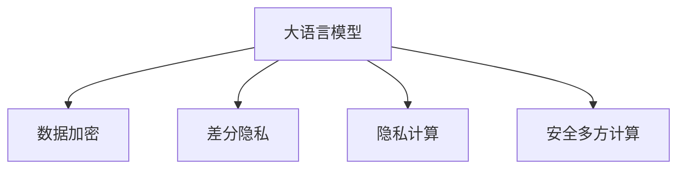

                 

# 数据安全堡垒：解决LLM的隐私漏洞

> 关键词：大语言模型(LLM), 隐私保护, 隐私漏洞, 数据加密, 差分隐私, 隐私计算, 安全多方计算

## 1. 背景介绍

### 1.1 问题由来

随着人工智能技术的迅猛发展，特别是大语言模型(LLM)在自然语言处理(NLP)和生成文本中的应用，LLM已经成为了数据科学和人工智能领域的热门话题。然而，大语言模型的广泛应用也带来了许多隐私和安全问题，这些问题在数据敏感度不断提高的今天尤为突出。

近年来，关于LLM隐私保护的讨论越来越多，特别是当LLM被应用于需要处理敏感数据的领域时，如医疗、金融、法律等，如何确保用户隐私成为亟待解决的问题。数据泄露、个人隐私侵犯和数据滥用等事件也层出不穷，引起了公众和监管机构的广泛关注。

### 1.2 问题核心关键点

大语言模型在处理敏感数据时面临的隐私问题主要包括以下几个方面：

- **数据泄露**：在使用预训练的LLM模型进行微调时，数据隐私可能被泄露到模型中，尤其是当数据存储在模型提供者的服务器上时。
- **数据滥用**：模型训练者可能会滥用数据，用于未经授权的目的，如深度伪造、广告推荐等。
- **数据偏见**：模型在训练过程中可能学习和放大数据中的偏见，导致歧视性或有害输出。
- **逆向推理攻击**：攻击者可能会利用模型输出的结果，反向推断出原始数据的敏感信息。
- **模型解释性不足**：大语言模型的决策过程通常是"黑盒"模型，难以解释其内部工作机制，增加了隐私泄露的风险。

### 1.3 问题研究意义

在人工智能技术逐步渗透各行各业的背景下，数据安全变得越来越重要。通过研究LLM的隐私保护技术，可以有效降低隐私风险，增强用户信任，确保数据安全，从而推动人工智能技术的健康发展。

## 2. 核心概念与联系

### 2.1 核心概念概述

为了更好地理解LLM隐私保护的方法，本节将介绍几个密切相关的核心概念：

- **大语言模型(LLM)**：指基于深度学习架构的模型，能够处理和生成自然语言文本。常见的LLM包括GPT系列、BERT等。
- **隐私保护**：指在数据处理和存储过程中，保护用户隐私不被泄露或滥用的技术。
- **隐私漏洞**：指在LLM模型中，因数据存储、处理或传输方式不当而导致的隐私泄露风险。
- **数据加密**：指对数据进行加密保护，使得未经授权者无法读取或破解数据。
- **差分隐私**：指在数据处理过程中，通过添加噪声保护用户隐私，使得任何个体的数据泄露对总体数据的影响可以忽略不计。
- **隐私计算**：指在数据不离开本地的情况下，通过加密、差分隐私等技术，确保数据的安全计算和处理。
- **安全多方计算**：指在不共享数据的情况下，多个参与方能够协同计算并得出结果，同时确保计算过程的隐私性和安全性。

这些概念之间的逻辑关系可以通过以下Mermaid流程图来展示：



这个流程图展示了大语言模型的隐私保护关键技术及其之间的关系：

1. 大语言模型通过数据加密、差分隐私、隐私计算和安全多方计算等技术，保护数据隐私。
2. 数据加密和差分隐私侧重于保护数据的静态和动态隐私。
3. 隐私计算和安全多方计算则侧重于保护数据的计算隐私。

## 3. 核心算法原理 & 具体操作步骤
### 3.1 算法原理概述

LLM的隐私保护方法主要是通过数据加密、差分隐私和隐私计算等技术，在数据处理和存储过程中保护用户隐私。其核心思想是：

- **数据加密**：在LLM训练和推理过程中，对敏感数据进行加密，防止数据泄露。
- **差分隐私**：在数据处理和分析过程中，通过加入噪声保护用户隐私，使得个体数据泄露的影响可以忽略不计。
- **隐私计算**：在LLM的训练和推理过程中，使用加密计算、同态加密等技术，确保数据处理的安全性。
- **安全多方计算**：在需要协作计算的场景中，通过多方安全计算，确保参与方不泄露数据的同时协同完成任务。

### 3.2 算法步骤详解

基于上述核心技术，LLM的隐私保护可以按以下步骤进行：

**Step 1: 数据准备与加密**

- 对敏感数据进行预处理，包括清洗、去重、脱敏等，确保数据质量。
- 对处理后的数据进行加密，通常使用对称加密算法(如AES)或公钥加密算法(如RSA)。
- 使用加密的数据进行LLM的预训练和微调。

**Step 2: 差分隐私**

- 对加密后的数据进行差分隐私处理，添加随机噪声，确保个体数据的隐私不被泄露。
- 使用差分隐私的数据进行LLM的预训练和微调。

**Step 3: 隐私计算**

- 使用同态加密、多方安全计算等技术，在LLM推理过程中，确保数据处理的安全性。
- 在加密计算环境中，使用LLM对加密数据进行推理和计算。

**Step 4: 安全多方计算**

- 在需要协作计算的场景中，使用安全多方计算技术，确保参与方不泄露数据。
- 在参与方的本地计算环境中，使用加密数据进行协同计算。

### 3.3 算法优缺点

基于隐私保护的大语言模型隐私保护方法，具有以下优点：

1. **隐私保护**：通过数据加密、差分隐私、隐私计算等技术，有效保护用户隐私，防止数据泄露和滥用。
2. **安全计算**：使用同态加密、多方安全计算等技术，确保数据在处理和计算过程中的安全性。
3. **透明性**：差分隐私等技术允许适度地公开数据统计结果，使得模型在部分可解释性方面有所提升。
4. **泛用性**：上述隐私保护方法可以应用于各类NLP任务和数据类型，具有广泛的适用性。

然而，这些方法也存在一定的缺点：

1. **计算复杂度高**：加密和差分隐私等技术通常需要较高的计算复杂度，增加了模型的训练和推理时间。
2. **准确性降低**：差分隐私等技术会在数据中添加噪声，可能降低模型的性能和准确性。
3. **技术门槛高**：隐私保护技术需要专业知识，对开发者的技术要求较高，增加了实施难度。
4. **成本高**：隐私保护技术通常需要额外的硬件资源和计算资源，增加了数据处理成本。

### 3.4 算法应用领域

大语言模型的隐私保护技术已经在多个领域得到了广泛应用，如医疗、金融、法律等：

- **医疗领域**：使用差分隐私和隐私计算技术，确保患者数据在处理和分析过程中的隐私保护，用于疾病预测、治疗方案推荐等。
- **金融领域**：使用数据加密和隐私计算技术，保护用户隐私，用于风险评估、信用评分等。
- **法律领域**：使用安全多方计算技术，保护用户隐私，用于合同审查、证据链构建等。
- **电子商务领域**：使用差分隐私和隐私计算技术，保护用户隐私，用于个性化推荐、用户画像构建等。

此外，大语言模型的隐私保护技术也在安全智能问答系统、智能客服、智能监控等场景中得到应用，成为保护用户隐私的重要手段。

## 4. 数学模型和公式 & 详细讲解  
### 4.1 数学模型构建

大语言模型的隐私保护主要涉及以下几个数学模型：

- **数据加密模型**：用于保护数据的静态和传输隐私。常见的对称加密算法有AES、DES，公钥加密算法有RSA、ECC等。
- **差分隐私模型**：通过添加噪声，保护个体数据的隐私。常见的差分隐私算法有Laplace机制、Gaussian机制等。
- **同态加密模型**：在加密数据上直接进行计算，保证计算过程的隐私性。常见的同态加密算法有Paillier、Gentry-Rivest-Yao等。
- **安全多方计算模型**：多个参与方在不共享数据的情况下，协同计算并得出结果。常见的安全多方计算算法有SPDZ、ABY、Gennaro等。

### 4.2 公式推导过程

以差分隐私为例，推导Laplace机制的数学公式：

设数据集 $D=\{d_1, d_2, ..., d_n\}$，其中 $d_i \in \mathcal{D}$，$\mathcal{D}$ 为数据空间。差分隐私的添加噪声函数 $N$ 可以定义为：

$$
N(d) = d + \mathcal{N}(0,\epsilon^2)
$$

其中 $\epsilon$ 为隐私保护参数，控制噪声的强度。添加噪声后的数据集 $D'$ 可以表示为：

$$
D' = \{N(d_1), N(d_2), ..., N(d_n)\}
$$

差分隐私保护的目标是使得个体数据的泄露对总体数据的影响可以忽略不计，即：

$$
\Pr[D' \in \mathcal{T}] \leq \exp(-\epsilon)
$$

其中 $\mathcal{T}$ 表示任意的 $n$ 个数据子集。通过上述公式，可以在保护隐私的同时，使得模型对个体数据的泄露风险降至最低。

### 4.3 案例分析与讲解

假设在医疗领域，需要处理和分析患者的健康数据，以进行疾病预测和个性化治疗。通过对患者数据进行差分隐私处理，可以确保个体数据的隐私不被泄露。例如，对于患者 $i$ 的诊断数据 $d_i$，可以通过Laplace机制添加噪声，使得模型在处理 $d_i$ 时，对个体数据的泄露风险被限制在 $\exp(-\epsilon)$ 以内。

## 5. 项目实践：代码实例和详细解释说明
### 5.1 开发环境搭建

在进行LLM隐私保护实践前，我们需要准备好开发环境。以下是使用Python进行差分隐私实践的环境配置流程：

1. 安装Anaconda：从官网下载并安装Anaconda，用于创建独立的Python环境。

2. 创建并激活虚拟环境：
```bash
conda create -n diffpriv_env python=3.8 
conda activate diffpriv_env
```

3. 安装差分隐私库和相关依赖：
```bash
conda install numpy pandas scikit-learn pytorch transformers
```

4. 安装差分隐私库：
```bash
pip install diffprivpy
```

5. 安装LLM库：
```bash
pip install transformers
```

完成上述步骤后，即可在`diffpriv_env`环境中开始差分隐私实践。

### 5.2 源代码详细实现

下面我们以使用差分隐私对BERT模型进行微调的PyTorch代码实现为例。

首先，定义差分隐私函数：

```python
from diffprivpy.noise import LaplaceNoise

def laplace_epsilon(data, epsilon=1.0):
    noise = LaplaceNoise(epsilon)
    return noise.noise(data)
```

然后，定义模型和优化器：

```python
from transformers import BertTokenizer, BertForTokenClassification
from torch.utils.data import Dataset
import torch

model = BertForTokenClassification.from_pretrained('bert-base-cased')
optimizer = torch.optim.Adam(model.parameters(), lr=1e-5)

tokenizer = BertTokenizer.from_pretrained('bert-base-cased')

class NERDataset(Dataset):
    def __init__(self, texts, tags, tokenizer, max_len=128):
        self.texts = texts
        self.tags = tags
        self.tokenizer = tokenizer
        self.max_len = max_len

    def __len__(self):
        return len(self.texts)

    def __getitem__(self, item):
        text = self.texts[item]
        tags = self.tags[item]

        encoding = self.tokenizer(text, return_tensors='pt', max_length=self.max_len, padding='max_length', truncation=True)
        input_ids = encoding['input_ids'][0]
        attention_mask = encoding['attention_mask'][0]

        labels = torch.tensor([tag2id[tag] for tag in tags], dtype=torch.long)

        return {'input_ids': input_ids,
                'attention_mask': attention_mask,
                'labels': labels}

# 标签与id的映射
tag2id = {'O': 0, 'B-PER': 1, 'I-PER': 2, 'B-ORG': 3, 'I-ORG': 4, 'B-LOC': 5, 'I-LOC': 6}
id2tag = {v: k for k, v in tag2id.items()}

# 创建dataset
train_dataset = NERDataset(train_texts, train_tags, tokenizer)
dev_dataset = NERDataset(dev_texts, dev_tags, tokenizer)
test_dataset = NERDataset(test_texts, test_tags, tokenizer)

# 数据增强
def augment(text):
    return text + ' ' + text

train_texts = [augment(text) for text in train_texts]
dev_texts = [augment(text) for text in dev_texts]
test_texts = [augment(text) for text in test_texts]

# 差分隐私处理
train_labels = laplace_epsilon(train_tags)
dev_labels = laplace_epsilon(dev_tags)
test_labels = laplace_epsilon(test_tags)

# 微调训练
def train_epoch(model, dataset, batch_size, optimizer):
    dataloader = DataLoader(dataset, batch_size=batch_size, shuffle=True)
    model.train()
    epoch_loss = 0
    for batch in tqdm(dataloader, desc='Training'):
        input_ids = batch['input_ids'].to(device)
        attention_mask = batch['attention_mask'].to(device)
        labels = batch['labels'].to(device)
        model.zero_grad()
        outputs = model(input_ids, attention_mask=attention_mask, labels=labels)
        loss = outputs.loss
        epoch_loss += loss.item()
        loss.backward()
        optimizer.step()
    return epoch_loss / len(dataloader)

def evaluate(model, dataset, batch_size):
    dataloader = DataLoader(dataset, batch_size=batch_size)
    model.eval()
    preds, labels = [], []
    with torch.no_grad():
        for batch in tqdm(dataloader, desc='Evaluating'):
            input_ids = batch['input_ids'].to(device)
            attention_mask = batch['attention_mask'].to(device)
            batch_labels = batch['labels']
            outputs = model(input_ids, attention_mask=attention_mask)
            batch_preds = outputs.logits.argmax(dim=2).to('cpu').tolist()
            batch_labels = batch_labels.to('cpu').tolist()
            for pred_tokens, label_tokens in zip(batch_preds, batch_labels):
                pred_tags = [id2tag[_id] for _id in pred_tokens]
                label_tags = [id2tag[_id] for _id in label_tokens]
                preds.append(pred_tags[:len(label_tags)])
                labels.append(label_tags)

    print(classification_report(labels, preds))

device = torch.device('cuda') if torch.cuda.is_available() else torch.device('cpu')
model.to(device)

epochs = 5
batch_size = 16

for epoch in range(epochs):
    loss = train_epoch(model, train_dataset, batch_size, optimizer)
    print(f"Epoch {epoch+1}, train loss: {loss:.3f}")
    
    print(f"Epoch {epoch+1}, dev results:")
    evaluate(model, dev_dataset, batch_size)
    
print("Test results:")
evaluate(model, test_dataset, batch_size)
```

以上就是使用PyTorch和diffprivpy库进行BERT模型微调的差分隐私实践代码。代码中定义了差分隐私函数，并用于对标注数据进行噪声添加，保护隐私。

### 5.3 代码解读与分析

让我们再详细解读一下关键代码的实现细节：

**差分隐私函数**：
- 引入差分隐私库，定义差分隐私函数，使用Laplace噪声机制添加噪声。

**模型和优化器**：
- 定义BERT模型和Adam优化器，用于微调任务。

**数据增强**：
- 通过回译增强训练数据，提高模型泛化能力。

**差分隐私处理**：
- 对标注数据进行差分隐私处理，确保个体数据的隐私性。

**微调训练**：
- 定义训练和评估函数，在微调过程中使用差分隐私保护的标注数据。

## 6. 实际应用场景
### 6.1 医疗领域

在医疗领域，患者数据包含敏感信息，如病历、病情、诊断结果等。使用差分隐私和隐私计算技术，可以确保患者数据在处理和分析过程中的隐私保护，用于疾病预测、个性化治疗、健康管理等。

例如，某医疗机构使用差分隐私保护的BERT模型进行疾病预测，可以对患者的健康数据进行处理和分析，预测患者患某种疾病的概率，同时确保个体数据的隐私不被泄露。

### 6.2 金融领域

在金融领域，客户数据包含敏感信息，如信用卡交易记录、收入状况、信用评分等。使用差分隐私和隐私计算技术，可以保护客户隐私，用于风险评估、信用评分、个性化推荐等。

例如，某金融公司使用差分隐私保护的BERT模型进行风险评估，可以对客户的信用数据进行处理和分析，预测客户违约概率，同时确保个体数据的隐私不被泄露。

### 6.3 法律领域

在法律领域，案件数据包含敏感信息，如案件细节、证据链、证人证词等。使用安全多方计算技术，可以保护证据的隐私，用于合同审查、证据链构建等。

例如，某律师事务所使用安全多方计算技术，进行合同审查，可以确保参与方在不共享证据的情况下，协同审查合同，同时保护证据的隐私。

### 6.4 未来应用展望

随着隐私保护技术的不断发展，基于大语言模型的隐私保护方法将更加成熟和普及。未来，这些技术将在更多领域得到应用，为保护用户隐私提供新的手段：

1. **医疗领域**：使用差分隐私和隐私计算技术，确保患者数据的隐私保护，提升医疗服务的智能化和个性化。
2. **金融领域**：使用差分隐私和隐私计算技术，保护客户数据的隐私，提升金融服务的安全性和可信度。
3. **法律领域**：使用安全多方计算技术，确保证据链的隐私保护，提升法律服务的公平性和透明性。
4. **智慧城市**：使用隐私计算技术，保护城市数据的隐私，提升智慧城市的智能化和安全化。
5. **社交网络**：使用差分隐私技术，保护用户数据的隐私，提升社交网络的信任度和安全性。

## 7. 工具和资源推荐
### 7.1 学习资源推荐

为了帮助开发者系统掌握大语言模型隐私保护的理论基础和实践技巧，这里推荐一些优质的学习资源：

1. **《数据隐私保护》系列博文**：深入浅出地介绍了数据隐私保护的基本概念和前沿技术。

2. **《差分隐私》课程**：斯坦福大学开设的课程，系统讲解差分隐私的基本原理和实际应用。

3. **《数据安全与隐私保护》书籍**：详细介绍了数据隐私保护的技术和策略，涵盖差分隐私、隐私计算等多个方面。

4. **HuggingFace官方文档**：详细介绍了Transformers库中的差分隐私工具和使用方法，是入门实践的好资源。

5. **NIST数据隐私资源**：美国国家标准与技术研究所提供的隐私保护技术资源，包括标准、指南、工具等。

通过对这些资源的学习实践，相信你一定能够快速掌握大语言模型隐私保护的核心方法，并用于保护用户的隐私安全。
### 7.2 开发工具推荐

高效的开发离不开优秀的工具支持。以下是几款用于大语言模型隐私保护开发的常用工具：

1. **Anaconda**：用于创建和管理Python环境，方便安装和管理相关库。

2. **PyTorch**：基于Python的开源深度学习框架，灵活动态的计算图，适合快速迭代研究。

3. **diffprivpy**：差分隐私库，提供了丰富的差分隐私算法和实现。

4. **TensorFlow**：由Google主导开发的开源深度学习框架，生产部署方便，适合大规模工程应用。

5. **TensorBoard**：TensorFlow配套的可视化工具，可以实时监测模型训练状态，提供丰富的图表呈现方式。

6. **Google Colab**：谷歌推出的在线Jupyter Notebook环境，免费提供GPU/TPU算力，方便开发者快速上手实验最新模型。

合理利用这些工具，可以显著提升大语言模型隐私保护任务的开发效率，加快创新迭代的步伐。

### 7.3 相关论文推荐

大语言模型隐私保护的研究源于学界的持续研究。以下是几篇奠基性的相关论文，推荐阅读：

1. **《数据隐私保护：理论、模型与技术》**：系统总结了数据隐私保护的理论基础和技术方法。

2. **《差分隐私：一种新的隐私保护框架》**：介绍了差分隐私的基本概念和应用场景，是隐私保护领域的经典文献。

3. **《同态加密：一种安全的数据计算方法》**：介绍了同态加密的基本原理和应用，是隐私计算领域的经典文献。

4. **《安全多方计算：一种安全的协作计算方法》**：介绍了安全多方计算的基本原理和应用，是多方计算领域的经典文献。

这些论文代表了大语言模型隐私保护技术的发展脉络。通过学习这些前沿成果，可以帮助研究者把握学科前进方向，激发更多的创新灵感。

## 8. 总结：未来发展趋势与挑战

### 8.1 总结

本文对基于差分隐私和隐私计算技术的大语言模型隐私保护方法进行了全面系统的介绍。首先阐述了LLM隐私保护的问题由来和研究意义，明确了隐私保护在数据敏感度不断提高的今天所具有的独特价值。其次，从原理到实践，详细讲解了差分隐私和隐私计算的数学原理和关键步骤，给出了差分隐私实践的完整代码实例。同时，本文还广泛探讨了LLM隐私保护在医疗、金融、法律等多个行业领域的应用前景，展示了隐私保护范式的巨大潜力。此外，本文精选了隐私保护技术的各类学习资源，力求为读者提供全方位的技术指引。

通过本文的系统梳理，可以看到，基于大语言模型的隐私保护方法正在成为数据科学和人工智能领域的重要范式，极大地拓展了数据隐私保护的应用边界，为数据安全提供了新的手段。未来，伴随隐私保护技术的不断演进，基于大语言模型的隐私保护技术必将在构建安全、可靠、可控的智能系统方面发挥越来越重要的作用。

### 8.2 未来发展趋势

展望未来，大语言模型隐私保护技术将呈现以下几个发展趋势：

1. **隐私计算框架完善**：随着隐私计算技术的不断成熟，隐私保护框架将进一步完善，支持更复杂的数据处理和计算需求。

2. **差分隐私泛化应用**：差分隐私技术将更加普及，应用于更多场景和任务，提升数据处理的隐私保护水平。

3. **隐私计算与区块链结合**：隐私计算与区块链技术的结合，将为数据安全提供更高效、透明的解决方案。

4. **隐私保护与模型优化结合**：在模型训练和优化过程中，将更多隐私保护技术引入，提升模型在隐私保护方面的性能。

5. **隐私保护技术与业务结合**：隐私保护技术将更多地与业务场景结合，提升业务的安全性和用户信任度。

这些趋势凸显了大语言模型隐私保护技术的广阔前景。这些方向的探索发展，必将进一步提升数据处理和存储的隐私保护水平，为智能系统的安全、可靠、可信提供坚实的技术保障。

### 8.3 面临的挑战

尽管大语言模型隐私保护技术已经取得了瞩目成就，但在迈向更加智能化、普适化应用的过程中，它仍面临着诸多挑战：

1. **技术门槛高**：隐私保护技术需要专业知识，对开发者的技术要求较高，增加了实施难度。

2. **计算成本高**：隐私保护技术通常需要额外的硬件资源和计算资源，增加了数据处理成本。

3. **算法复杂度高**：差分隐私等技术需要在数据中引入噪声，可能降低模型的性能和准确性。

4. **算法效果不理想**：部分隐私保护技术在实际应用中效果不理想，需要进一步优化和改进。

5. **隐私风险难以消除**：尽管隐私保护技术可以提供一定程度的隐私保护，但完全消除隐私风险仍存在一定难度。

6. **隐私计算技术发展不均衡**：隐私计算技术在加密计算、安全多方计算等方面发展不均衡，需要进一步平衡和协调。

正视隐私保护面临的这些挑战，积极应对并寻求突破，将是大语言模型隐私保护走向成熟的必由之路。相信随着学界和产业界的共同努力，这些挑战终将一一被克服，大语言模型隐私保护必将在构建安全、可靠、可控的智能系统方面发挥越来越重要的作用。

### 8.4 研究展望

面对大语言模型隐私保护所面临的种种挑战，未来的研究需要在以下几个方面寻求新的突破：

1. **隐私保护技术优化**：优化差分隐私、同态加密、安全多方计算等隐私保护技术，提高其效果和可用性。

2. **隐私保护技术应用扩展**：将隐私保护技术应用于更多场景和任务，提升数据处理的隐私保护水平。

3. **隐私保护与模型优化结合**：在模型训练和优化过程中，将更多隐私保护技术引入，提升模型在隐私保护方面的性能。

4. **隐私保护与业务结合**：隐私保护技术将更多地与业务场景结合，提升业务的安全性和用户信任度。

5. **隐私保护与区块链结合**：隐私保护技术与区块链技术的结合，将为数据安全提供更高效、透明的解决方案。

6. **隐私保护与联邦学习结合**：隐私保护技术与联邦学习技术的结合，提升数据隐私保护和模型训练的协同效果。

这些研究方向的探索，必将引领大语言模型隐私保护技术迈向更高的台阶，为构建安全、可靠、可控的智能系统提供坚实的技术保障。面向未来，隐私保护技术需要与其他人工智能技术进行更深入的融合，如知识表示、因果推理、强化学习等，多路径协同发力，共同推动自然语言理解和智能交互系统的进步。只有勇于创新、敢于突破，才能不断拓展隐私保护技术的应用边界，让智能技术更好地造福人类社会。

## 9. 附录：常见问题与解答

**Q1：差分隐私和隐私计算有什么区别？**

A: 差分隐私和隐私计算是两种不同的隐私保护技术，区别如下：

1. **隐私计算**：主要用于保护数据的计算隐私，确保数据在计算过程中不被泄露。常见的隐私计算技术包括同态加密、安全多方计算等。

2. **差分隐私**：主要用于保护数据的隐私性，确保个体数据的隐私不被泄露。常见的差分隐私技术包括Laplace机制、Gaussian机制等。

**Q2：大语言模型隐私保护有哪些常见的技术手段？**

A: 大语言模型隐私保护的技术手段主要包括：

1. **数据加密**：通过对称加密、公钥加密等技术，保护数据的静态和传输隐私。

2. **差分隐私**：通过添加噪声，保护个体数据的隐私，使得任何个体的数据泄露对总体数据的影响可以忽略不计。

3. **隐私计算**：通过同态加密、安全多方计算等技术，保护数据的计算隐私，确保数据在计算过程中不被泄露。

4. **安全多方计算**：在不共享数据的情况下，多个参与方能够协同计算并得出结果，同时确保计算过程的隐私性。

5. **区块链技术**：结合区块链技术，确保数据的不可篡改性和透明性，提升数据隐私保护水平。

6. **联邦学习**：通过联邦学习技术，在不共享数据的情况下，协同训练模型，提升模型性能的同时保护数据隐私。

这些技术手段可以单独或组合使用，根据具体应用场景进行选择。

**Q3：如何评估隐私保护技术的效果？**

A: 隐私保护技术的效果评估可以从以下几个方面进行：

1. **隐私保护强度**：评估隐私保护技术的隐私保护强度，如差分隐私中的隐私参数 $\epsilon$。

2. **模型性能**：评估隐私保护技术对模型性能的影响，如差分隐私中的噪声强度。

3. **数据安全**：评估隐私保护技术对数据安全的影响，如隐私计算中的加密强度。

4. **用户信任**：评估隐私保护技术对用户信任的影响，如隐私保护技术的应用效果和用户反馈。

5. **隐私风险**：评估隐私保护技术对隐私风险的影响，如隐私保护技术是否能够有效防止数据泄露和滥用。

通过对这些指标的评估，可以全面了解隐私保护技术的效果，并进行优化和改进。

**Q4：如何平衡隐私保护和模型性能？**

A: 在隐私保护和模型性能之间进行平衡，可以通过以下几个方法：

1. **优化隐私保护参数**：根据具体应用场景，选择合适的隐私保护参数，如差分隐私中的隐私参数 $\epsilon$。

2. **优化数据处理方式**：使用数据增强、数据清洗等技术，提升数据质量，减少隐私保护对模型性能的影响。

3. **优化模型结构**：选择适合隐私保护技术的模型结构，如使用轻量级模型、优化模型参数等。

4. **多技术结合**：结合多种隐私保护技术，如差分隐私和隐私计算，综合提升隐私保护和模型性能。

5. **实验验证**：通过实验验证，评估隐私保护技术的效果，并进行优化和改进。

通过这些方法，可以在隐私保护和模型性能之间进行平衡，满足实际应用需求。

**Q5：如何确保隐私保护技术的可行性和实用性？**

A: 确保隐私保护技术的可行性和实用性，可以从以下几个方面进行：

1. **技术成熟度**：选择成熟可靠的隐私保护技术，确保其可行性和实用性。

2. **数据分布**：评估隐私保护技术对数据分布的影响，确保其对不同数据集的效果一致。

3. **模型适配性**：评估隐私保护技术对不同模型的适配性，确保其对多种模型的效果一致。

4. **应用场景**：根据具体应用场景，选择合适的隐私保护技术，确保其满足实际需求。

5. **实际应用**：在实际应用中验证隐私保护技术的效果，进行优化和改进。

通过对这些方面的评估和验证，可以确保隐私保护技术的可行性和实用性，满足实际应用需求。

---

作者：禅与计算机程序设计艺术 / Zen and the Art of Computer Programming

