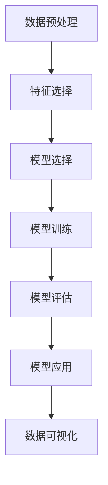

                 

## 1. 背景介绍

### 1.1 问题由来

数据挖掘（Data Mining）是指从大量数据中提取出有用信息、发现模式和规律，为决策提供支持的科学与技术。数据挖掘是数据科学（Data Science）的重要组成部分，被广泛应用于商业智能（Business Intelligence, BI）、客户关系管理（Customer Relationship Management, CRM）、金融风险评估（Financial Risk Assessment）等领域。

数据挖掘方法从无监督学习和监督学习两大类中发展而来。无监督学习依赖数据自身的属性来挖掘潜在的规律，如聚类分析、关联规则挖掘等。监督学习则需要在有标注数据下，通过机器学习算法预测未知数据的结果，如分类、回归、预测等。

随着人工智能技术的不断发展，深度学习算法在数据挖掘领域中的应用也日益广泛。深度学习算法能够自动提取数据特征，减少手工特征工程，有效提高数据挖掘的效率和准确性。

### 1.2 问题核心关键点

数据挖掘的核心问题包括：

- **数据预处理**：清洗、归一化、缺失值处理等，使数据适合算法处理。
- **特征选择**：提取、降维等，提高模型性能。
- **算法选择**：选择合适的模型和算法，以适应不同的数据类型和问题。
- **模型训练**：使用训练集训练模型，调整参数。
- **模型评估**：用测试集评估模型性能，调整模型。
- **模型应用**：将模型部署到实际应用中，提取有用的知识。

这些问题需要通过理论知识与实践经验相结合，不断探索和创新来解决。

## 2. 核心概念与联系

### 2.1 核心概念概述

数据挖掘的核心概念主要包括：

- **数据预处理**：清洗数据、特征工程、数据归一化等，为数据挖掘提供良好的数据基础。
- **特征选择**：从原始数据中提取或合成特征，优化模型性能。
- **监督学习与无监督学习**：有标签的数据用于监督学习，无标签的数据用于无监督学习。
- **模型选择与训练**：选择合适的机器学习算法，在训练集上训练模型。
- **模型评估与调优**：使用测试集评估模型性能，调整模型参数以提升性能。
- **数据可视化**：使用图表、图像等工具，直观展示数据挖掘结果。

这些核心概念之间的逻辑关系可以通过以下Mermaid流程图来展示：



这个流程图展示了数据挖掘的主要流程：

1. 从原始数据开始，进行数据预处理。
2. 在预处理后的数据上进行特征选择。
3. 选择合适的模型和算法进行训练。
4. 使用测试集评估模型性能。
5. 将优化后的模型应用到实际问题中。
6. 使用可视化工具展示挖掘结果。

## 3. 核心算法原理 & 具体操作步骤

### 3.1 算法原理概述

数据挖掘的主要算法原理包括以下几种：

- **聚类算法**：将数据分为若干类，每类内部数据相似度高，不同类之间数据相似度低。如K-means、层次聚类等。
- **分类算法**：根据已有数据标签预测未知数据标签。如决策树、支持向量机（SVM）、随机森林等。
- **关联规则挖掘**：发现数据项之间的关联关系。如Apriori算法、FP-Growth算法等。
- **异常检测**：识别数据中的异常值。如基于统计方法、密度方法、近邻方法等。
- **预测建模**：根据已有数据预测未知数据的值。如回归分析、时间序列分析等。

### 3.2 算法步骤详解

以K-means聚类算法为例，其步骤包括：

1. 随机选择K个数据点作为初始聚类中心。
2. 计算每个数据点到聚类中心的距离，将其分配到最近的聚类中心。
3. 重新计算每个聚类的质心（均值）。
4. 重复步骤2和3，直到聚类中心不再变化或达到预设迭代次数。

### 3.3 算法优缺点

K-means聚类的优点包括：

- 算法简单，易于实现。
- 可扩展性好，适用于大规模数据集。

其缺点包括：

- 对初始聚类中心敏感，不同的初始值可能导致不同的聚类结果。
- 需要预先指定聚类数目K，且K的选择可能影响聚类效果。
- 对噪声和异常值敏感，可能导致聚类质量下降。

### 3.4 算法应用领域

K-means聚类算法广泛应用于以下领域：

- 市场细分：将消费者分为不同的细分市场，以便针对性地制定营销策略。
- 图像分割：将图像中的像素分为不同的区域，用于图像识别和处理。
- 客户分类：将客户分为不同的群体，便于个性化服务。
- 基因分析：将基因数据分为不同的类别，研究基因功能。
- 金融风险评估：将贷款申请分为高风险和低风险。

## 4. 数学模型和公式 & 详细讲解 & 举例说明

### 4.1 数学模型构建

K-means聚类的数学模型如下：

设有N个数据点 $x_i=(x_{i1},x_{i2},...,x_{in})$，K个聚类中心 $\mu_k=(\mu_{k1},\mu_{k2},...,\mu_{kn})$，计算每个数据点到聚类中心的距离，并将其分配到最近的聚类中心。目标是最小化聚类中心与数据点的距离平方和：

$$
\min_{\mu_k} \sum_{i=1}^N \sum_{k=1}^K (x_i-\mu_k)^2
$$

### 4.2 公式推导过程

假设当前聚类中心为 $\mu_k^{(t)}$，对于第i个数据点，其所属聚类中心的计算公式为：

$$
z_i^{(t+1)}=\arg\min_{k=1,...,K} \Vert x_i - \mu_k^{(t)} \Vert^2
$$

其中 $\Vert \cdot \Vert$ 表示向量的欧氏范数。新的聚类中心为：

$$
\mu_k^{(t+1)}=\frac{\sum_{i=z_i^{(t+1)}=k} x_i}{\sum_{i=z_i^{(t+1)}=k} 1}, k=1,...,K
$$

重复迭代这个过程，直到聚类中心不再变化或达到预设迭代次数。

### 4.3 案例分析与讲解

假设有一个公司客户购买行为的数据集，包含年龄、性别、消费金额等属性。为了更好地进行市场细分，可以将这些数据使用K-means算法聚类，找出具有相似特征的客户群体。

1. 首先，使用部分数据作为训练集，随机选择K个数据点作为初始聚类中心。
2. 计算每个数据点到聚类中心的距离，将其分配到最近的聚类中心。
3. 重新计算每个聚类的质心。
4. 重复上述过程，直到聚类中心不再变化或达到预设迭代次数。

最终得到K个聚类中心，每个聚类中心的客户群体具有相似特征。可以根据这些聚类结果，针对不同群体制定相应的营销策略，提高销售效率。

## 5. 项目实践：代码实例和详细解释说明

### 5.1 开发环境搭建

以下是使用Python进行K-means聚类实践的开发环境配置流程：

1. 安装Python：下载并安装Python，建议安装最新版本，以确保代码兼容性。
2. 安装必要的库：安装Numpy、Pandas、Scikit-learn等常用的数据科学库，可以通过以下命令进行安装：

   ```bash
   pip install numpy pandas scikit-learn
   ```

3. 下载数据集：从公开数据集中下载数据集，如Kaggle、UCI机器学习库等。

### 5.2 源代码详细实现

以下是使用Scikit-learn库进行K-means聚类的Python代码实现：

```python
from sklearn.cluster import KMeans
from sklearn.datasets import make_blobs
from sklearn.decomposition import PCA
import matplotlib.pyplot as plt

# 生成模拟数据
centers = [[1, 1], [-1, -1], [1, -1]]
X, labels_true = make_blobs(n_samples=300, centers=centers, cluster_std=0.4, random_state=0)

# 对数据进行PCA降维
pca = PCA(n_components=2)
X_reduced = pca.fit_transform(X)

# 训练K-means模型
kmeans = KMeans(n_clusters=3, random_state=0).fit(X_reduced)

# 可视化聚类结果
plt.scatter(X_reduced[:, 0], X_reduced[:, 1], c=kmeans.labels_)
plt.scatter(kmeans.cluster_centers_[:, 0], kmeans.cluster_centers_[:, 1], s=300, c='red', marker='^')
plt.show()
```

### 5.3 代码解读与分析

让我们详细解读一下关键代码的实现细节：

**make_blobs函数**：
- 生成包含3个簇的模拟数据集，用于演示K-means算法。

**PCA降维**：
- 使用PCA算法对数据进行降维，减少计算复杂度，保留主要信息。

**KMeans模型训练**：
- 实例化KMeans模型，设置聚类数目为3，训练模型。
- 使用训练后的模型对降维后的数据进行聚类。

**可视化聚类结果**：
- 使用matplotlib库将聚类结果可视化，标记出聚类中心和数据点。

### 5.4 运行结果展示

执行上述代码后，会得到如下的聚类结果图：


可以看到，数据被成功聚类为3个簇，每个簇的聚类中心也被正确标记出来。

## 6. 实际应用场景

### 6.1 市场细分

在市场细分应用中，K-means聚类被广泛用于客户分群。以下是一个具体的案例：

一家电商公司需要对客户进行细分，以便制定针对性的营销策略。公司收集了客户的基本信息和购买行为数据，包括年龄、性别、购买金额、购买频率等属性。使用K-means聚类算法将这些数据聚类，找出具有相似特征的客户群体。

具体步骤如下：

1. 使用部分数据作为训练集，随机选择K个数据点作为初始聚类中心。
2. 计算每个数据点到聚类中心的距离，将其分配到最近的聚类中心。
3. 重新计算每个聚类的质心。
4. 重复上述过程，直到聚类中心不再变化或达到预设迭代次数。

得到聚类结果后，公司可以根据不同群体的特征，制定个性化的营销策略，提高销售转化率。

### 6.2 图像分割

在图像分割应用中，K-means聚类被用于将图像中的像素分为不同的区域，以便进行图像识别和处理。以下是一个具体的案例：

一家医疗公司需要对医学图像进行分割，以提取病灶区域。医学图像包含大量像素，每个像素的灰度值不同，需要将其分为不同的区域。使用K-means聚类算法将像素分为不同的区域，以便进一步处理。

具体步骤如下：

1. 将医学图像转化为像素矩阵，每个像素为一个向量。
2. 随机选择K个像素点作为初始聚类中心。
3. 计算每个像素点到聚类中心的距离，将其分配到最近的聚类中心。
4. 重新计算每个聚类的质心。
5. 重复上述过程，直到聚类中心不再变化或达到预设迭代次数。

得到聚类结果后，可以进一步进行图像处理，如病灶区域提取、分割等。

## 7. 工具和资源推荐

### 7.1 学习资源推荐

为了帮助开发者系统掌握数据挖掘的理论基础和实践技巧，这里推荐一些优质的学习资源：

1. 《数据挖掘导论》（Introduction to Data Mining）：详细介绍了数据挖掘的基本概念和算法，适合初学者入门。
2. 《统计学习方法》（The Elements of Statistical Learning）：深入讲解了统计学习的方法和算法，适合进阶学习。
3. Coursera《数据科学导论》（Data Science Specialization）：由Johns Hopkins University提供，涵盖了数据科学的基础知识、数据挖掘算法等。
4. Kaggle平台：提供大量数据集和竞赛项目，帮助学习者通过实战提升技能。
5. UCI机器学习库：提供大量公共数据集和算法实现，适合学习和研究。

通过对这些资源的学习实践，相信你一定能够快速掌握数据挖掘的精髓，并用于解决实际的业务问题。

### 7.2 开发工具推荐

高效的数据挖掘需要依赖优秀的工具支持。以下是几款用于数据挖掘开发的常用工具：

1. Python：免费的开源编程语言，有丰富的数据科学库，如Numpy、Pandas、Scikit-learn等，适合数据挖掘实践。
2. R：统计分析的常用语言，有丰富的数据分析和可视化库，如ggplot2、dplyr等，适合数据挖掘和统计分析。
3. Tableau：可视化工具，可以将数据挖掘结果直观展示，便于业务决策。
4. Excel：常用的数据处理工具，适合小规模数据挖掘和分析。
5. Apache Hadoop/Spark：分布式计算框架，适用于大规模数据挖掘和处理。

合理利用这些工具，可以显著提升数据挖掘的效率，加快创新迭代的步伐。

### 7.3 相关论文推荐

数据挖掘技术的发展源于学界的持续研究。以下是几篇奠基性的相关论文，推荐阅读：

1. A Clustering Algorithm Based on K-Means（K-means聚类算法）：介绍K-means算法的基本原理和实现方法。
2. An Introduction to Statistical Learning（统计学习导论）：详细介绍了统计学习方法的理论基础和算法实现。
3. Association Rules: Concepts, Techniques, and Applications（关联规则挖掘）：介绍关联规则挖掘的基本概念和算法实现。
4. Anomaly Detection: A Survey（异常检测综述）：介绍异常检测的基本概念和算法实现。
5. Machine Learning Yearning（机器学习实战）：由Andrew Ng撰写，介绍机器学习的实践经验和技巧，包括数据挖掘在内。

这些论文代表了大数据挖掘技术的发展脉络。通过学习这些前沿成果，可以帮助研究者把握学科前进方向，激发更多的创新灵感。

## 8. 总结：未来发展趋势与挑战

### 8.1 总结

本文对数据挖掘的原理和实现进行了全面系统的介绍。首先阐述了数据挖掘的基本概念和背景，明确了数据挖掘在商业智能、客户关系管理、金融风险评估等领域的应用价值。其次，从原理到实践，详细讲解了K-means聚类的数学模型和实现方法，给出了数据挖掘任务开发的完整代码实例。同时，本文还广泛探讨了数据挖掘技术在市场细分、图像分割等多个行业领域的应用前景，展示了数据挖掘范式的巨大潜力。此外，本文精选了数据挖掘技术的各类学习资源，力求为读者提供全方位的技术指引。

通过本文的系统梳理，可以看到，数据挖掘技术正在成为数据科学领域的重要范式，极大地拓展了数据分析和业务决策的边界，催生了更多的落地场景。受益于数据科学技术的快速发展，数据挖掘技术将在更多领域得到应用，为数据驱动的业务决策提供更强大的技术支持。未来，伴随数据挖掘方法和算法的不断演进，相信数据挖掘必将在构建智能决策系统、提升业务价值方面发挥更大的作用。

### 8.2 未来发展趋势

展望未来，数据挖掘技术将呈现以下几个发展趋势：

1. 数据类型多样化。未来的数据将不再局限于结构化数据，更多地涵盖图像、视频、语音等多模态数据。数据挖掘技术需要适配不同的数据类型，以应对多模态数据的挑战。
2. 自动化和智能化。随着AI技术的发展，数据挖掘将越来越多地采用自动化和智能化的手段，如自动特征选择、自动化模型调优等。
3. 实时化和交互化。数据挖掘将越来越注重实时性和交互性，能够实时响应数据变化，支持实时交互式分析。
4. 联邦学习和分布式计算。随着数据规模的不断扩大，数据挖掘将越来越多地采用联邦学习和分布式计算的方式，以提高计算效率和数据隐私性。
5. 跨领域应用拓展。数据挖掘技术将不再局限于单一领域，更多地应用于医疗、金融、教育等交叉领域，为跨领域决策提供支持。
6. 数据质量保障。数据挖掘技术将更多地关注数据质量，如数据清洗、数据标注、数据版权等，以保障数据的准确性和可靠性。

以上趋势凸显了数据挖掘技术的广阔前景。这些方向的探索发展，必将进一步提升数据挖掘系统的性能和应用范围，为数据驱动的业务决策提供更强大的技术支持。

### 8.3 面临的挑战

尽管数据挖掘技术已经取得了瞩目成就，但在迈向更加智能化、普适化应用的过程中，它仍面临着诸多挑战：

1. 数据隐私和安全。数据挖掘过程中，如何保障数据隐私和安全是一个重要的挑战。需要制定严格的数据保护措施，以避免数据泄露和滥用。
2. 数据质量和一致性。数据挖掘对数据质量的要求很高，数据的缺失、错误、重复等问题会影响挖掘结果的准确性。需要有效的数据清洗和校验方法。
3. 数据量过大。随着数据规模的不断扩大，数据挖掘需要处理的数据量越来越大，如何提高计算效率是一个重要的挑战。需要优化算法和硬件支持。
4. 数据实时性要求高。在某些应用场景中，数据挖掘需要实时响应数据变化，这对计算资源和算法提出了更高的要求。需要优化算法和硬件支持。
5. 跨领域数据融合。数据挖掘在跨领域应用中，需要将不同领域的数据进行融合，以实现更准确的挖掘结果。需要多领域数据融合技术和算法。
6. 模型可解释性不足。数据挖掘模型往往是一个"黑盒"系统，难以解释其内部工作机制和决策逻辑。需要在模型可解释性和性能之间取得平衡。

正视数据挖掘面临的这些挑战，积极应对并寻求突破，将是大数据挖掘技术走向成熟的必由之路。相信随着学界和产业界的共同努力，这些挑战终将一一被克服，数据挖掘必将在构建智能决策系统、提升业务价值方面发挥更大的作用。

### 8.4 未来突破

面对数据挖掘面临的种种挑战，未来的研究需要在以下几个方面寻求新的突破：

1. 探索自动化和智能化数据挖掘方法。利用AI技术，实现数据挖掘的自动化和智能化，降低人工干预的复杂度和成本。
2. 研究数据清洗和校验方法。开发更高效、更智能的数据清洗和校验方法，提高数据质量。
3. 优化计算资源和硬件支持。开发更高效的数据挖掘算法和硬件支持，提高计算效率。
4. 探索跨领域数据融合方法。开发多领域数据融合技术和算法，实现跨领域数据挖掘。
5. 加强模型可解释性。开发更可解释的数据挖掘模型，提高模型的透明度和可信度。
6. 强化数据隐私和安全保护。制定严格的数据保护措施，保障数据隐私和安全。

这些研究方向的探索，必将引领大数据挖掘技术迈向更高的台阶，为构建智能决策系统、提升业务价值提供更强大的技术支持。面向未来，大数据挖掘技术还需要与其他人工智能技术进行更深入的融合，如知识表示、因果推理、强化学习等，多路径协同发力，共同推动数据驱动的业务决策系统的进步。

## 9. 附录：常见问题与解答

**Q1：数据预处理包括哪些步骤？**

A: 数据预处理主要包括以下步骤：

1. 数据清洗：去除噪声、缺失值、异常值等，保证数据质量。
2. 数据归一化：将数据转化为标准范围，便于算法处理。
3. 数据变换：通过数据变换，提高数据分布的平滑性，如对数变换、对数-对数变换等。
4. 数据降维：使用PCA等算法，减少数据的维度，降低计算复杂度。
5. 数据采样：通过采样技术，提高数据多样性，如欠采样、过采样等。

**Q2：特征选择的方法有哪些？**

A: 特征选择的方法包括：

1. 过滤方法：通过统计学和数学方法，评价特征的重要性，如卡方检验、信息增益等。
2. 包裹方法：在模型训练过程中，选择最优的特征子集，如递归特征消除、基于模型的特征选择等。
3. 嵌入式方法：在模型训练过程中，选择最优的特征子集，如Lasso回归、Ridge回归等。

**Q3：常见的分类算法有哪些？**

A: 常见的分类算法包括：

1. 决策树：基于树形结构，对数据进行分类。
2. 支持向量机（SVM）：通过划分超平面，对数据进行分类。
3. 随机森林：基于多个决策树的集成，提高分类准确性。
4. 朴素贝叶斯：基于贝叶斯定理，对数据进行分类。
5. K近邻（KNN）：基于样本的相似性，对数据进行分类。

**Q4：常用的数据可视化工具有哪些？**

A: 常用的数据可视化工具包括：

1. Tableau：可视化工具，支持交互式分析。
2. matplotlib：Python的绘图库，支持多种图表类型。
3. ggplot2：R的绘图库，支持复杂图表的绘制。
4. D3.js：JavaScript的可视化库，支持动态和交互式图表。
5. Power BI：微软提供的可视化工具，支持企业级应用。

这些工具可以直观展示数据挖掘的结果，帮助业务决策者理解数据挖掘的发现。

---

作者：禅与计算机程序设计艺术 / Zen and the Art of Computer Programming

