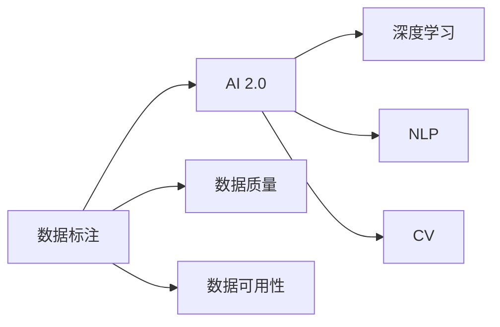

                 

# 数据标注：提高 AI 2.0 数据质量和可用性

> 关键词：数据标注, AI 2.0, 数据质量, 数据可用性, 深度学习, 自然语言处理(NLP), 计算机视觉(CV), 人工智能(AI), 机器学习(ML), 数据集构建, 标注工具, 数据清洗, 数据管理, 标注众包, 标注审核

## 1. 背景介绍

在人工智能(AI)技术的快速发展中，数据标注扮演着至关重要的角色。AI 2.0时代，数据标注不仅影响模型的训练效果，更决定了AI技术能否在实际应用中产生显著价值。高质量、可用性高的数据标注，是确保AI模型在各个领域（如自然语言处理(NLP)、计算机视觉(CV)等）表现优异的前提条件。

### 1.1 数据标注的重要性
数据标注不仅用于监督学习模型训练，也是深度学习模型的重要组成部分。数据标注涉及将原始数据转换为模型能够理解的格式，进而供模型学习。例如，在NLP中，标注数据可能是对一段文本进行分类、命名实体识别或情感分析。在CV中，标注数据可能是对图像中的物体进行定位、分类或语义分割。

高质量的数据标注可以：
- 提升模型的训练效果。准确、均衡的标注数据能够帮助模型更准确地捕捉数据的本质特征。
- 减少对人工监督的依赖。通过高质量的数据标注，模型可以更自主地进行决策，减少对人工作业的依赖。
- 提高AI系统的可信度。标注数据的质量直接影响AI系统的性能和可靠性，高质量的标注数据能够提升AI系统的可信度，使其在关键应用中发挥更大作用。

### 1.2 数据标注的现状与挑战
尽管数据标注在AI领域的应用广泛，但当前数据标注工作面临诸多挑战：
- 数据标注工作量大且繁琐。标注数据需要人工介入，工作量大，且对标注人员要求高，容易出现标注偏差和误差。
- 数据标注质量参差不齐。不同标注人员的标注标准可能不一致，导致数据质量参差不齐。
- 数据标注成本高。高质量标注往往需要专业标注人员的参与，成本较高。
- 数据标注标准不统一。不同应用场景、不同领域的数据标注标准可能不同，导致数据不一致，难以整合。

## 2. 核心概念与联系

### 2.1 核心概念概述

为理解数据标注在AI 2.0中的作用，首先介绍几个核心概念：

- **数据标注（Data Annotation）**：将原始数据转换为模型可理解的形式，通常涉及对数据进行分类、标记等操作。例如，给一段文本标注情感极性、命名实体，或给一张图像标注物体类别、位置。
- **AI 2.0（Artificial Intelligence 2.0）**：AI技术进入2.0时代，从传统的知识驱动、规则驱动向数据驱动转变。AI 2.0强调数据质量和可用性，数据标注是其中的关键环节。
- **数据质量（Data Quality）**：数据标注的质量直接影响AI模型的性能。高质量的数据标注应具有准确性、一致性、代表性、完整性和及时性等属性。
- **数据可用性（Data Usability）**：数据标注的可用性决定了其在AI模型训练和推理过程中的有效性。易用、高效的数据标注有助于模型快速训练和推理。
- **深度学习（Deep Learning）**：通过多层神经网络结构，深度学习模型可以自动提取数据特征，进而进行分类、识别、预测等任务。
- **自然语言处理（NLP）**：涉及对文本数据进行处理和分析，常用于情感分析、文本分类、机器翻译等任务。
- **计算机视觉（CV）**：涉及对图像、视频数据进行处理和分析，常用于图像分类、目标检测、语义分割等任务。

这些概念之间存在紧密的联系，如图1所示。数据标注通过为模型提供必要的信息，帮助模型在NLP和CV等任务中实现高性能的推理。



### 2.2 核心概念联系

数据标注与其他AI核心概念的联系可以通过以下步骤阐述：

1. **数据标注与AI 2.0**：AI 2.0强调数据驱动，数据标注提供必要的信息，帮助模型从原始数据中提取特征，进而实现高效推理。数据标注的质量直接影响AI模型的性能和可信度。
2. **数据标注与数据质量**：高质量的数据标注应具有准确性、一致性、代表性、完整性和及时性等属性。准确的标注数据能确保模型学习到正确的特征，避免过拟合或欠拟合。
3. **数据标注与数据可用性**：易用、高效的数据标注使得模型训练和推理更加快速、准确。数据标注的可用性直接影响AI系统在实际应用中的表现。
4. **数据标注与深度学习**：深度学习模型通过学习数据标注信息，能够自动提取数据特征，实现分类、识别、预测等任务。数据标注为模型提供了必要的标签信息，帮助其理解数据。
5. **数据标注与NLP和CV**：数据标注在NLP和CV中有着广泛应用，如文本分类、情感分析、物体检测等。标注数据帮助模型理解和分析数据，提升任务表现。

## 3. 核心算法原理 & 具体操作步骤

### 3.1 算法原理概述

数据标注的核心算法包括：

- **监督学习算法**：如支持向量机(SVM)、决策树、随机森林等，通过标注数据训练模型，模型可对新数据进行预测。
- **无监督学习算法**：如K-means、PCA等，不需要标注数据，通过数据自聚类或降维等方法发现数据特征。
- **半监督学习算法**：如标签传播算法(LP)，利用少量标注数据和大量未标注数据，训练模型。
- **迁移学习算法**：如微调(MF)，使用预训练模型进行微调，使用少量标注数据进行微调，提升模型性能。

数据标注的原理是通过对原始数据进行标注，生成训练集，模型通过学习训练集中的数据特征，进行推理预测。算法的选择应根据任务特点和数据可用性进行优化。

### 3.2 算法步骤详解

数据标注的主要步骤包括：

1. **数据收集**：收集与任务相关的原始数据。例如，收集一段文本、一张图片等。
2. **数据预处理**：对原始数据进行清洗、格式化等预处理操作，使其适合标注。
3. **标注规则制定**：根据任务需求，制定数据标注规则。例如，对文本进行情感极性标注，应制定情感极性标注的标准。
4. **数据标注**：根据标注规则，对数据进行标注。标注过程通常需要人工介入。
5. **数据审核**：标注完成后，进行数据审核，确保标注数据的质量。例如，通过人工审核或算法验证，发现并纠正标注错误。
6. **数据集构建**：将标注后的数据构建为模型训练集，进行模型训练和评估。

### 3.3 算法优缺点

数据标注的优缺点如下：

**优点**：
- **高精度**：标注数据的质量直接影响模型的训练效果，高质量的数据标注能提升模型性能。
- **灵活性**：数据标注方法可以根据任务需求进行灵活调整，适应不同的应用场景。
- **数据驱动**：数据标注为AI模型提供了必要的信息，有助于提升模型的泛化能力。

**缺点**：
- **成本高**：高质量的数据标注通常需要专业标注人员的参与，成本较高。
- **标注偏差**：标注过程中可能存在主观偏差，导致标注数据不一致。
- **数据标注时间消耗大**：标注数据通常需要大量人工介入，耗费时间。

### 3.4 算法应用领域

数据标注广泛应用于以下领域：

1. **自然语言处理(NLP)**：如情感分析、文本分类、命名实体识别等任务。
2. **计算机视觉(CV)**：如物体检测、图像分类、语义分割等任务。
3. **语音识别**：如语音转文本、语音情感分析等任务。
4. **医学影像分析**：如病灶检测、医学图像分类等任务。
5. **自动驾驶**：如场景识别、交通标志识别等任务。

## 4. 数学模型和公式 & 详细讲解 & 举例说明

### 4.1 数学模型构建

假设数据标注任务为二分类问题，训练集为 $D=\{(x_i,y_i)\}_{i=1}^N$，其中 $x_i$ 为输入数据，$y_i \in \{0,1\}$ 为标签。假设模型为 $f(x;\theta)$，其中 $\theta$ 为模型参数。数据标注的目标是最大化模型在训练集上的准确率，即：

$$
\hat{\theta}=\mathop{\arg\max}_{\theta}\sum_{i=1}^N f(x_i;\theta) \delta(y_i)
$$

其中 $\delta$ 为Kronecker delta函数，$\delta(y_i)=1$ 当 $y_i=1$，否则 $\delta(y_i)=0$。

### 4.2 公式推导过程

以下推导基于二分类问题的最大似然估计方法。

假设标注数据服从二项分布，即 $p(y_i=1|x_i;\theta)=\sigma(f(x_i;\theta))$，其中 $\sigma(z)$ 为sigmoid函数。根据最大似然估计，模型参数 $\theta$ 的估计值为：

$$
\hat{\theta}=\mathop{\arg\min}_{\theta} -\sum_{i=1}^N y_i \log(\sigma(f(x_i;\theta))) + (1-y_i) \log(1-\sigma(f(x_i;\theta)))
$$

将 $\sigma(f(x_i;\theta))$ 展开，并简化，得到：

$$
\hat{\theta}=\mathop{\arg\min}_{\theta} -\sum_{i=1}^N y_i f(x_i;\theta) - (1-y_i) f(x_i;\theta)
$$

进一步简化，得到：

$$
\hat{\theta}=\mathop{\arg\min}_{\theta} -\sum_{i=1}^N f(x_i;\theta)
$$

其中 $f(x_i;\theta)=\sigma(z(x_i;\theta))$，$z(x_i;\theta)=w^T\phi(x_i) + b$，$\phi(x_i)$ 为特征映射函数。

### 4.3 案例分析与讲解

以二分类问题为例，进行详细案例讲解。

假设有一个情感分析任务，训练集为 $D=\{(x_i,y_i)\}_{i=1}^N$，其中 $x_i$ 为一段文本，$y_i \in \{0,1\}$ 为情感极性标签。标注规则为：$y_i=1$ 当文本情感为积极，否则 $y_i=0$。

假设模型为线性判别器，即 $f(x;\theta)=w^Tx+b$，其中 $w$ 为权重向量，$b$ 为偏置项。模型参数估计目标为：

$$
\hat{\theta}=\mathop{\arg\min}_{\theta} -\sum_{i=1}^N y_i f(x_i;\theta) - (1-y_i) f(x_i;\theta)
$$

假设 $\sigma(z)=1/(1+\exp(-z))$ 为sigmoid函数，则模型参数估计目标可进一步简化为：

$$
\hat{\theta}=\mathop{\arg\min}_{\theta} -\sum_{i=1}^N y_i \log(\sigma(f(x_i;\theta))) - (1-y_i) \log(1-\sigma(f(x_i;\theta)))
$$

假设 $f(x;\theta)=\sigma(w^Tx+b)$，则上述目标函数可进一步简化为：

$$
\hat{\theta}=\mathop{\arg\min}_{\theta} -\sum_{i=1}^N y_i w^Tx_i - (1-y_i) w^Tx_i
$$

这是一个线性回归问题，可以使用最小二乘法或梯度下降等方法进行求解。通过迭代优化，模型参数 $\theta$ 逐步逼近最优解。

## 5. 项目实践：代码实例和详细解释说明

### 5.1 开发环境搭建

在Python环境下，使用TensorFlow或PyTorch框架进行数据标注的实践。

### 5.2 源代码详细实现

以下以二分类问题为例，使用TensorFlow进行模型训练和数据标注的代码实现。

```python
import tensorflow as tf
import numpy as np

# 定义模型
class LinearModel(tf.keras.Model):
    def __init__(self, input_dim, output_dim):
        super(LinearModel, self).__init__()
        self.linear = tf.keras.layers.Dense(output_dim, activation='sigmoid')
        
    def call(self, x):
        return self.linear(x)
        
# 定义训练函数
def train_model(model, data, labels, epochs=10, batch_size=32):
    optimizer = tf.keras.optimizers.Adam()
    loss_fn = tf.keras.losses.BinaryCrossentropy()
    
    for epoch in range(epochs):
        for batch_i, (batch_x, batch_y) in enumerate(tf.data.Dataset.from_tensor_slices((data, labels)).shuffle(100).batch(batch_size)):
            with tf.GradientTape() as tape:
                predictions = model(batch_x)
                loss = loss_fn(labels, predictions)
            gradients = tape.gradient(loss, model.trainable_variables)
            optimizer.apply_gradients(zip(gradients, model.trainable_variables))
            
    return model

# 定义数据生成函数
def generate_data(num_samples=1000):
    data = np.random.randn(num_samples, 2)
    labels = (data[:, 0] > 0).astype(np.float32)
    return data, labels

# 生成数据集
data, labels = generate_data()

# 构建模型
model = LinearModel(input_dim=2, output_dim=1)
model.compile(optimizer='adam', loss='binary_crossentropy', metrics=['accuracy'])

# 训练模型
model.fit(data, labels, epochs=10, batch_size=32)
```

### 5.3 代码解读与分析

以上代码实现了使用TensorFlow进行二分类问题训练的基本流程。

**模型定义**：
- `LinearModel` 类定义了一个线性判别器模型，使用 `tf.keras.layers.Dense` 层实现线性变换。
- `call` 方法定义模型的前向传播过程，返回模型的输出。

**训练函数**：
- 定义 `train_model` 函数，使用Adam优化器和二元交叉熵损失函数。
- 在每个epoch中，遍历训练集，计算模型输出与真实标签的差异，反向传播更新模型参数。

**数据生成函数**：
- `generate_data` 函数生成随机二分类数据，用于模型训练。

**模型训练**：
- 构建模型实例，使用 `compile` 方法定义模型优化器、损失函数和评估指标。
- 使用 `fit` 方法训练模型，设置训练轮数和批量大小。

## 6. 实际应用场景

### 6.1 智能客服系统

智能客服系统中，基于数据标注的对话模型能够自动化处理客户咨询，提高服务效率和客户满意度。

假设有一个智能客服系统，需要处理用户提交的咨询问题。可以通过标注大量历史客服对话数据，构建一个基于BERT的对话模型。标注数据包括问题和最佳答复，模型通过学习这些标注数据，能够自动理解用户意图，匹配最合适的答案模板，并生成自然流畅的回复。

### 6.2 金融舆情监测

在金融领域，基于数据标注的情感分析模型可以帮助机构及时监测市场舆情，识别潜在的风险。

假设有一个金融机构，需要监测网络上的金融舆情，以评估市场情绪和潜在风险。可以通过标注大量金融新闻、评论等文本数据，训练一个情感分析模型。标注数据包括文本内容和情感极性，模型能够学习到金融市场情绪的演变趋势，及时发出预警信号。

### 6.3 个性化推荐系统

个性化推荐系统通过数据标注构建用户兴趣模型，提供精准的推荐服务。

假设有一个在线电商平台，需要推荐用户可能感兴趣的商品。可以通过标注用户浏览、点击、购买等行为数据，构建一个基于深度学习模型的推荐系统。标注数据包括物品标题、描述、标签等，模型能够学习用户兴趣特征，生成个性化的推荐列表。

### 6.4 未来应用展望

随着AI 2.0技术的发展，数据标注在未来的应用场景中将更加广泛：

1. **自动驾驶**：通过数据标注构建场景识别模型，提升自动驾驶系统的安全性。
2. **医疗影像分析**：通过数据标注构建病灶检测模型，辅助医生进行疾病诊断。
3. **智能制造**：通过数据标注构建质量检测模型，提高生产线的自动化水平。
4. **社交媒体分析**：通过数据标注构建舆情监测模型，分析用户情绪和热点话题。
5. **智能家居**：通过数据标注构建用户行为识别模型，实现智能家居的个性化服务。

未来，数据标注将更多地与AI技术结合，实现更高效、更智能的数据处理和分析，提升各领域的AI应用效果。

## 7. 工具和资源推荐

### 7.1 学习资源推荐

以下是一些优质的学习资源，帮助开发者掌握数据标注的理论与实践：

1. **《深度学习入门：基于Python的理论与实现》**：清华大学出版社，深入浅出地介绍了深度学习的理论和实践，包括数据标注方法。
2. **《自然语言处理综论》**：李宏毅讲授的NLP课程，涵盖了NLP领域的经典模型和数据标注方法。
3. **《TensorFlow官方文档》**：TensorFlow官方文档，提供了丰富的数据标注样例和实践指导。
4. **《Kaggle竞赛指南》**：Kaggle官方指南，提供了大量数据标注竞赛的实践案例和解决方案。
5. **《数据标注实战》**：李平讲授的数据标注课程，介绍了数据标注的流程和方法。

### 7.2 开发工具推荐

以下是一些常用的数据标注工具，帮助开发者高效完成标注任务：

1. **LabelImg**：基于OpenCV的图像标注工具，支持图像识别、分类等任务。
2. **VGG Image Annotator**：由Google开发的图像标注工具，支持图像、视频等数据的标注。
3. **Prodigy**：数据标注平台，支持多标签分类、文本标注等任务，并提供可视化界面。
4. **DataLabeler**：数据标注工具，支持文本、图像、视频等数据的标注，支持自定义标注界面。
5. **COCO Annotator**：图像标注工具，支持多种标注格式，如PASCAL VOC、YOLO等。

### 7.3 相关论文推荐

以下是一些关于数据标注的重要论文，帮助开发者深入理解数据标注的理论与实践：

1. **Data Annotation with Example-based Learning for Named Entity Recognition**：提出基于示例学习的命名实体识别方法，通过标注数据学习实体识别规则。
2. **A Survey on Image Annotation for Visual Search and Recognition**：综述了图像标注在视觉搜索和识别中的应用，提供了丰富的标注方法和工具。
3. **Data Annotation in NLP: A Survey**：综述了NLP领域的标注方法，包括情感分析、文本分类等任务。
4. **Efficient Annotation of Large-scale Datasets for Machine Learning**：提出高效的数据标注方法，适用于大规模数据集，降低标注成本。
5. **Online Data Annotation for Big Data**：综述了在线数据标注方法，适用于大数据环境下的标注任务。

## 8. 总结：未来发展趋势与挑战

### 8.1 研究成果总结

本文总结了数据标注在AI 2.0中的应用和优化方法，提出以下研究成果：

1. **数据标注的重要性**：数据标注直接影响AI模型的性能和可信度。
2. **数据标注的现状与挑战**：数据标注面临工作量大、成本高、标注偏差等问题。
3. **数据标注的核心算法**：包括监督学习、无监督学习、半监督学习和迁移学习等方法。
4. **数据标注的应用领域**：涉及NLP、CV、语音识别、医学影像分析、自动驾驶等多个领域。

### 8.2 未来发展趋势

未来，数据标注将面临以下发展趋势：

1. **数据标注自动化**：自动化标注技术将逐步普及，降低人工标注成本，提高标注效率。
2. **多模态数据标注**：多模态数据标注技术将应用于图像、语音、文本等多种数据类型，提升数据标注的全面性。
3. **实时数据标注**：实时数据标注技术将应用于在线平台，实现动态数据标注。
4. **跨领域数据标注**：跨领域数据标注技术将应用于不同领域的数据标注，提高数据标注的通用性。
5. **基于AI的数据标注**：AI技术将应用于数据标注，提升标注数据的质量和可用性。

### 8.3 面临的挑战

尽管数据标注技术在AI 2.0中具有重要地位，但仍面临诸多挑战：

1. **标注数据质量**：高质量的标注数据成本较高，难以大规模获取。
2. **标注数据标准化**：不同领域的标注数据标准不一致，难以整合。
3. **标注数据安全**：标注数据涉及敏感信息，数据安全问题亟需解决。
4. **标注数据成本**：高质量的标注数据需要专业标注人员的参与，成本较高。
5. **标注数据可用性**：标注数据的可用性直接影响模型训练和推理的效率。

### 8.4 研究展望

未来，数据标注研究应在以下方向进行探索：

1. **数据标注自动化**：开发自动化标注工具和技术，提高标注效率，降低人工标注成本。
2. **数据标注标准**：制定统一的数据标注标准，确保标注数据的一致性和可用性。
3. **数据标注安全**：采用数据脱敏、加密等措施，确保标注数据的安全性。
4. **数据标注质量**：采用数据增强、正则化等技术，提升标注数据的质量。
5. **数据标注效率**：采用分布式标注技术，提高数据标注的效率。

数据标注技术在AI 2.0中具有重要地位，未来的研究将不断推动数据标注技术的发展，为AI技术在各领域的应用提供强有力的支持。

## 9. 附录：常见问题与解答

### Q1: 什么是数据标注？

A: 数据标注是将原始数据转换为模型可理解的形式，通常涉及对数据进行分类、标记等操作。例如，对一段文本进行情感极性标注，对一张图片进行物体识别。

### Q2: 数据标注的重要性是什么？

A: 数据标注直接影响AI模型的性能和可信度。高质量的数据标注能提升模型学习到的特征，减少过拟合或欠拟合。

### Q3: 数据标注的现状与挑战是什么？

A: 数据标注面临工作量大、成本高、标注偏差等问题。高质量的标注数据需要专业标注人员的参与，标注数据的标准化和安全也亟需解决。

### Q4: 数据标注的核心算法有哪些？

A: 数据标注的核心算法包括监督学习、无监督学习、半监督学习和迁移学习等方法。

### Q5: 数据标注的应用领域是什么？

A: 数据标注广泛应用于NLP、CV、语音识别、医学影像分析、自动驾驶等多个领域。

---

作者：禅与计算机程序设计艺术 / Zen and the Art of Computer Programming

