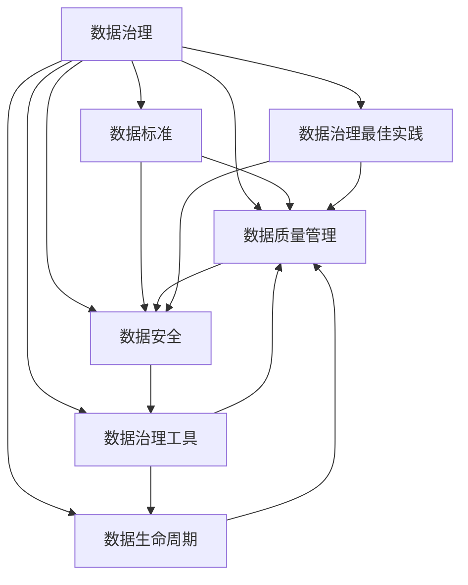

                 

# 数据治理 原理与代码实例讲解

> 关键词：数据治理, 数据质量管理, 数据安全, 数据标准, 数据治理工具, 数据生命周期, 数据治理最佳实践

## 1. 背景介绍

### 1.1 问题由来
在当今数字化时代，数据已成为企业最宝贵的资产之一。然而，企业数据往往分散在不同的系统和部门中，存在着数据质量差、重复存储、隐私泄露等诸多问题，严重影响企业决策和运营效率。数据治理被认为是最有效的解决方案，通过系统化管理，提升数据质量和价值，保障数据安全和隐私，从而为企业创造更大的商业价值。

### 1.2 问题核心关键点
数据治理的核心是围绕数据标准、数据质量、数据安全和数据使用进行一系列的制定、执行和管理。这些核心关键点涉及到数据的全生命周期管理，从数据的生成、存储、使用到销毁，每个环节都需要有明确的规定和流程。

数据治理的实施是一个系统工程，涉及到多个部门和技术的协作。其核心目标是保障数据的一致性、完整性和可用性，同时保证数据的隐私和安全。通过有效的数据治理，企业可以最大化利用数据价值，减少重复工作，提高决策效率，增强市场竞争力。

### 1.3 问题研究意义
数据治理的实现需要跨部门协作，需要融合多种技术和方法，对于提升企业的整体运营效率和决策质量具有重要意义：

1. **提升数据质量**：通过数据清洗、校验和标准化，提升数据准确性和一致性，确保数据的可靠性和可信度。
2. **保障数据安全**：通过数据访问控制、加密和审计等措施，保护数据隐私和安全，避免数据泄露和滥用。
3. **促进数据共享**：通过统一的数据标准和元数据管理，打破数据孤岛，促进数据的跨部门、跨业务线共享。
4. **加速决策制定**：通过数据整合和分析，帮助企业快速获取高质量的数据支持，增强决策的科学性和准确性。
5. **推动技术创新**：数据治理为数据技术的发展提供了基础，促进了大数据、人工智能等技术的落地应用。

## 2. 核心概念与联系

### 2.1 核心概念概述

数据治理涉及多个核心概念，它们之间的关系紧密，形成一个整体的数据治理框架：

- **数据治理**：指通过制定数据标准、数据质量和数据安全等策略，对企业数据进行全面的管理和优化。
- **数据标准**：定义了数据的质量规范、格式要求、编码规则等，确保数据的统一性和可比性。
- **数据质量管理**：通过对数据的清洗、校验和验证，提升数据的一致性和准确性。
- **数据安全**：包括数据加密、访问控制、审计记录等，保护数据的隐私和安全。
- **数据治理工具**：辅助数据治理流程的工具集，如ETL工具、元数据管理平台、数据可视化工具等。
- **数据生命周期**：数据从生成、存储、使用到销毁的全过程管理，每个阶段都有明确的管理策略和流程。
- **数据治理最佳实践**：基于业界经验和成功案例，总结出的有效数据治理策略和方法。

这些概念之间的逻辑关系可以通过以下Mermaid流程图来展示：



这个流程图展示了几大核心概念之间的联系：

1. 数据标准定义了数据管理的规范和要求。
2. 数据质量管理确保数据的准确性和一致性。
3. 数据安全保障数据的隐私和完整性。
4. 数据治理工具提供了具体的数据处理和管理系统。
5. 数据生命周期管理数据从创建到销毁的全过程。
6. 数据治理最佳实践提供了具体的实施策略和操作方法。

这些概念共同构成了数据治理的完整框架，确保数据的有效管理和利用。

## 3. 核心算法原理 & 具体操作步骤
### 3.1 算法原理概述

数据治理的核心算法原理是基于数据标准和数据质量管理策略，通过自动化工具对数据进行清洗、校验和优化，同时保障数据的安全性和隐私性。其核心思想是通过制定数据标准和规则，约束数据的生成和使用，通过自动化工具执行数据质量管理策略，确保数据的一致性和准确性。

数据治理的过程可以分为数据质量管理、数据安全管理和数据生命周期管理三个主要阶段。每个阶段的目标和策略如下：

- **数据质量管理**：通过自动化工具对数据进行清洗和校验，提升数据的一致性和准确性。常见的数据质量管理策略包括去重、修复、转换和合并等。
- **数据安全管理**：通过访问控制、加密和审计等措施，保护数据的隐私和安全。常见的数据安全管理策略包括数据加密、访问控制列表、审计日志等。
- **数据生命周期管理**：通过对数据的生成、存储、使用和销毁进行全过程管理，确保数据的有效性和可用性。常见的数据生命周期管理策略包括数据保留策略、数据归档和销毁等。

### 3.2 算法步骤详解

数据治理的实施通常分为以下几个关键步骤：

**Step 1: 数据质量评估**
- 定义数据质量指标和规则。
- 对现有数据进行质量评估，找出问题和改进点。
- 制定数据质量改进策略，明确改进目标和步骤。

**Step 2: 数据清洗和校验**
- 使用ETL工具对数据进行清洗和转换，修复数据错误和缺失。
- 对数据进行校验和验证，确保数据的一致性和准确性。
- 引入数据治理工具，自动执行数据质量管理策略。

**Step 3: 数据安全控制**
- 实施数据加密策略，保护数据在传输和存储过程中的安全性。
- 设置访问控制列表，限制数据的访问权限。
- 记录数据访问日志，进行安全审计和监控。

**Step 4: 数据生命周期管理**
- 制定数据保留策略，明确数据的使用和保留期限。
- 对数据进行归档和分类管理，确保数据的可追溯性。
- 设置数据销毁流程，定期清理无用数据。

**Step 5: 数据治理工具部署**
- 选择适合的数据治理工具，进行部署和配置。
- 对数据治理工具进行自动化配置和优化，提高治理效率。
- 定期评估和改进数据治理工具的效果，确保其持续有效性。

**Step 6: 数据治理最佳实践**
- 结合业界成功案例，总结和推广数据治理最佳实践。
- 持续优化数据治理策略，提升数据治理效果。
- 推动数据治理文化的建设，形成全员参与的数据治理环境。

### 3.3 算法优缺点

数据治理的算法具有以下优点：

1. **提升数据质量**：通过自动化工具和策略，快速提升数据的一致性和准确性，减少人工干预。
2. **保障数据安全**：通过数据加密和访问控制等措施，保护数据的隐私和安全，防止数据泄露和滥用。
3. **优化数据生命周期管理**：通过制定明确的数据保留策略和销毁流程，确保数据的有效性和可追溯性。
4. **提高治理效率**：数据治理工具的自动化执行，减少了人工操作的复杂性和错误率，提高了数据治理的效率。

同时，该算法也存在以下缺点：

1. **技术复杂性**：数据治理涉及多种技术和策略，实施过程较为复杂，需要跨部门的协作。
2. **数据标准化难度**：不同系统和业务线的数据格式和标准不一致，标准化工作难度较大。
3. **数据安全风险**：数据安全策略需要定期评估和更新，确保其有效性和安全性。
4. **数据治理成本高**：数据治理工具的部署和优化需要较高的技术成本和资源投入。
5. **用户接受度低**：数据治理可能涉及数据的重新处理和标准化，用户接受度可能不高，需要加强沟通和教育。

### 3.4 算法应用领域

数据治理的算法广泛应用于各个行业和领域，包括但不限于：

- **金融**：通过数据治理，保障客户数据的安全和隐私，提升金融服务质量。
- **医疗**：确保医疗数据的准确性和一致性，提高医疗决策的科学性。
- **零售**：优化库存管理和销售预测，提升客户体验和运营效率。
- **制造**：通过数据治理，优化生产流程，提高生产效率和质量。
- **政府**：确保公共数据的质量和安全，提升政府决策和公共服务的透明度和效率。

## 4. 数学模型和公式 & 详细讲解  
### 4.1 数学模型构建

数据治理的数学模型主要涉及数据质量评估、数据清洗和校验以及数据安全管理的策略和算法。以下是几个核心模型的构建：

**数据质量评估模型**：
- 定义数据质量指标，如完整性、一致性、准确性和及时性。
- 使用数学公式计算数据质量得分。
- 公式推导过程：设数据质量指标为 $Q_i$，数据质量得分为 $Q$，权重为 $w_i$，则：
$$
Q = \sum_{i=1}^n Q_i \times w_i
$$
其中 $n$ 为数据质量指标个数，$w_i$ 为各指标的权重。

**数据清洗模型**：
- 对数据进行去重、修复、转换和合并等处理。
- 使用数学公式描述数据清洗步骤。
- 公式推导过程：设原始数据集为 $D$，清洗后的数据集为 $D'$，则：
$$
D' = D - D_{\text{repeats}} - D_{\text{invalid}} - D_{\text{missing}} + D_{\text{merged}}
$$
其中 $D_{\text{repeats}}$、$D_{\text{invalid}}$ 和 $D_{\text{missing}}$ 分别表示重复、无效和缺失数据集，$D_{\text{merged}}$ 表示合并后的数据集。

**数据安全模型**：
- 对数据进行加密和访问控制。
- 使用数学公式描述数据加密过程。
- 公式推导过程：设数据为 $D$，加密后的数据为 $D'$，密钥为 $k$，则：
$$
D' = E_k(D)
$$
其中 $E_k$ 为加密算法，$k$ 为加密密钥。

### 4.2 公式推导过程

以下是几个核心公式的推导过程：

**数据质量评估公式**：
- 定义数据质量指标 $Q_i$ 和权重 $w_i$，则数据质量得分 $Q$ 可以表示为：
$$
Q = \sum_{i=1}^n Q_i \times w_i
$$
其中 $Q_i$ 为第 $i$ 个数据质量指标的值，$w_i$ 为第 $i$ 个指标的权重。

**数据清洗公式**：
- 数据清洗涉及去重、修复、转换和合并等操作，具体公式根据数据清洗规则而定。
- 假设原始数据集为 $D$，去重后的数据集为 $D_{\text{repeats}}$，则：
$$
D_{\text{repeats}} = D - D'
$$
其中 $D'$ 为去重后的数据集。

**数据加密公式**：
- 数据加密使用对称加密或非对称加密算法，这里以对称加密为例。
- 假设原始数据为 $D$，加密后的数据为 $D'$，密钥为 $k$，则：
$$
D' = E_k(D)
$$
其中 $E_k$ 为加密算法，$k$ 为加密密钥。

### 4.3 案例分析与讲解

**案例一：数据质量评估**

假设某企业的客户数据集包含姓名、电话和地址三个字段，定义了完整性、一致性和准确性三个指标，分别赋值为 $Q_1=0.9$、$Q_2=0.8$ 和 $Q_3=0.95$，各指标权重为 $w_1=0.3$、$w_2=0.4$ 和 $w_3=0.3$。计算数据质量得分 $Q$：
$$
Q = Q_1 \times w_1 + Q_2 \times w_2 + Q_3 \times w_3 = 0.9 \times 0.3 + 0.8 \times 0.4 + 0.95 \times 0.3 = 0.886
$$
数据质量得分为 $0.886$，表示该客户数据集的整体质量较高。

**案例二：数据清洗**

假设某企业销售数据集包含订单编号、商品名称和价格三个字段，存在大量重复订单和缺失商品名称的记录。使用ETL工具对数据进行清洗，去重后的数据集为 $D_{\text{repeats}}$，缺失值填充后的数据集为 $D_{\text{missing}}$。假设原始数据集为 $D$，则：
$$
D' = D - D_{\text{repeats}} - D_{\text{missing}}
$$
其中 $D'$ 为清洗后的数据集。

**案例三：数据加密**

假设某企业的客户数据集包含姓名、电话和地址三个字段，需要对数据进行加密保护。使用AES对称加密算法，密钥为 $k$。假设原始数据集为 $D$，则：
$$
D' = E_k(D)
$$
其中 $E_k$ 为AES加密算法，$k$ 为加密密钥。

## 5. 项目实践：代码实例和详细解释说明
### 5.1 开发环境搭建

在进行数据治理项目实践前，我们需要准备好开发环境。以下是使用Python进行PySpark和Apache Airflow开发的环境配置流程：

1. 安装Anaconda：从官网下载并安装Anaconda，用于创建独立的Python环境。

2. 创建并激活虚拟环境：
```bash
conda create -n data-governance python=3.8 
conda activate data-governance
```

3. 安装PySpark和Apache Airflow：
```bash
conda install pyspark=3.3.0 pyarrow=6.0.1
pip install apache-airflow==2.1.2
```

4. 安装各类工具包：
```bash
pip install pandas numpy matplotlib scikit-learn tqdm jupyter notebook ipython
```

完成上述步骤后，即可在`data-governance`环境中开始数据治理实践。

### 5.2 源代码详细实现

这里我们以数据质量管理为例，给出使用PySpark进行数据质量评估的代码实现。

首先，定义数据质量指标：

```python
import pandas as pd

# 定义数据质量指标和权重
data_quality_metrics = {
    'completeness': 0.9,  # 完整性指标
    'consistency': 0.8,   # 一致性指标
    'accuracy': 0.95     # 准确性指标
}
data_quality_weights = {
    'completeness': 0.3,
    'consistency': 0.4,
    'accuracy': 0.3
}
```

然后，读取数据集并进行数据质量评估：

```python
# 读取数据集
data = pd.read_csv('data.csv')

# 计算数据质量得分
data_quality_score = sum(data_quality_metrics[i] * data_quality_weights[i] for i in data_quality_metrics)
print(f"Data quality score: {data_quality_score:.3f}")
```

最后，进行数据清洗和加密处理：

```python
# 数据清洗：去重和缺失值填充
data_cleaned = data.drop_duplicates().ffill().dropna()

# 数据加密：使用AES对称加密算法
from Crypto.Cipher import AES

key = b'ThisIsASecretKey'
cipher = AES.new(key, AES.MODE_EAX)
nonce = cipher.nonce
ciphertext, tag = cipher.encrypt_and_digest(data_cleaned.to_csv(index=False))
```

以上就是使用PySpark进行数据质量管理和数据加密处理的代码实现。可以看到，PySpark提供了强大的数据处理和分析能力，可以轻松实现数据质量评估、数据清洗和加密等功能。

### 5.3 代码解读与分析

让我们再详细解读一下关键代码的实现细节：

**数据质量评估**：
- 使用字典定义了数据质量指标和权重。
- 计算数据质量得分，使用公式 $Q = \sum_{i=1}^n Q_i \times w_i$，将各指标得分与权重相乘，再求和得到整体得分。

**数据清洗**：
- 使用Pandas库的`drop_duplicates()`方法去重，`ffill()`方法进行前向填充，`dropna()`方法删除缺失值。
- 将清洗后的数据导出为CSV格式，准备进行后续的加密处理。

**数据加密**：
- 使用Python的`Crypto`库实现AES对称加密算法。
- 通过`AES.new()`方法生成加密器，使用`cipher.nonce`生成加密用的IV，使用`cipher.encrypt_and_digest()`方法进行加密，最终生成密文和签名。

可以看到，通过使用PySpark和Python库，我们可以高效地进行数据质量评估、数据清洗和加密处理，构建一个高效可靠的数据治理系统。

## 6. 实际应用场景
### 6.1 智能客服系统

数据治理技术在智能客服系统中得到广泛应用，通过数据标准化和质量管理，保障了客户数据的安全和一致性，提高了智能客服系统的准确性和可靠性。

在实际应用中，智能客服系统通过数据治理工具对客户数据进行清洗、校验和标准化，确保数据的一致性和完整性。同时，系统对客户数据进行加密和访问控制，保障客户隐私和数据安全。通过数据治理，智能客服系统能够高效处理大量客户咨询，快速生成和推送答案，提高客户满意度和服务效率。

### 6.2 医疗数据管理

医疗数据是敏感数据，需要严格的数据治理来保障数据的安全和隐私。数据治理技术在医疗数据管理中起到关键作用，通过标准化和质量管理，确保医疗数据的准确性和一致性，提升医疗决策的科学性和可靠性。

在实际应用中，医疗机构通过数据治理工具对医疗数据进行清洗、校验和标准化，确保数据的一致性和完整性。同时，系统对医疗数据进行加密和访问控制，保障患者隐私和数据安全。通过数据治理，医疗系统能够高效处理大量医疗数据，提升医疗决策的科学性和准确性，促进医疗服务的现代化。

### 6.3 金融风险管理

金融数据涉及大量敏感信息，数据治理是金融风险管理的重要保障。通过数据标准化和质量管理，确保金融数据的准确性和一致性，提升风险管理的科学性和可靠性。

在实际应用中，金融系统通过数据治理工具对金融数据进行清洗、校验和标准化，确保数据的一致性和完整性。同时，系统对金融数据进行加密和访问控制，保障客户隐私和数据安全。通过数据治理，金融系统能够高效处理大量金融数据，提升风险管理的科学性和准确性，降低金融风险。

### 6.4 未来应用展望

随着数据治理技术的不断发展和应用，未来数据治理将呈现出以下几个发展趋势：

1. **自动化程度提高**：数据治理将更加自动化和智能化，通过人工智能和大数据技术，提升数据治理的效率和准确性。
2. **数据治理工具集成化**：数据治理工具将更加集成化和协同化，实现数据治理的全生命周期管理。
3. **数据治理文化普及**：数据治理文化将在企业中逐步普及，形成全员参与的数据治理环境。
4. **数据治理策略优化**：数据治理策略将更加科学和高效，结合业务需求和数据特征，提升数据治理的效果。
5. **数据治理标准统一**：数据治理标准将更加统一和规范，确保数据治理的一致性和可比性。

## 7. 工具和资源推荐
### 7.1 学习资源推荐

为了帮助开发者系统掌握数据治理的理论基础和实践技巧，这里推荐一些优质的学习资源：

1. 《数据治理最佳实践》书籍：详细介绍了数据治理的理论基础、实施方法和工具推荐。
2. 《数据治理实战》在线课程：系统讲解数据治理的各个环节，结合实际案例，深入浅出地介绍数据治理的实践技巧。
3. Kaggle数据治理竞赛：通过实际数据治理项目，帮助开发者提升数据治理的实战能力。
4. DataCamp数据治理课程：提供多门数据治理课程，覆盖数据清洗、数据加密、数据安全管理等多个方面。
5. Coursera《数据治理与大数据管理》课程：由知名大学和专家讲授，系统介绍数据治理的理论和实践。

通过对这些资源的学习实践，相信你一定能够快速掌握数据治理的精髓，并用于解决实际的数据治理问题。

### 7.2 开发工具推荐

高效的数据治理开发离不开优秀的工具支持。以下是几款用于数据治理开发的常用工具：

1. PySpark：由Apache基金会开源的大数据处理框架，支持大规模数据处理和分析，适合数据治理中的数据清洗和统计分析。
2. Apache Airflow：开源的工作流调度平台，支持多种数据治理工具的集成和调度，适合数据治理中的自动化执行和监控。
3. Data Quality：开源的数据质量管理工具，支持数据清洗、数据校验和数据标准化，适合数据治理中的数据质量管理。
4. SymPy：Python的符号计算库，适合数据治理中的数学模型和公式推导。
5. Crypto库：Python的加密库，支持多种加密算法和数据加密处理，适合数据治理中的数据加密保护。

合理利用这些工具，可以显著提升数据治理任务的开发效率，加快创新迭代的步伐。

### 7.3 相关论文推荐

数据治理技术的发展源于学界的持续研究。以下是几篇奠基性的相关论文，推荐阅读：

1. "Data Governance: Concepts, Components, Practices, and Challenges"：系统介绍了数据治理的概念、组件和实施方法。
2. "A Survey on Data Quality Assessment Models"：综述了数据质量评估模型的研究现状和未来方向。
3. "A Comparative Study of Data Encryption Algorithms"：比较了多种数据加密算法的性能和安全性，提供了数据加密的实践指南。
4. "Data Governance Frameworks: An Overview"：综述了数据治理框架的研究现状和未来趋势。
5. "Principles and Practices of Data Governance"：详细介绍了数据治理的原则和实践方法。

这些论文代表了大数据治理领域的研究成果，通过学习这些前沿成果，可以帮助研究者把握学科前进方向，激发更多的创新灵感。

## 8. 总结：未来发展趋势与挑战
### 8.1 总结

本文对数据治理的理论基础和实践技巧进行了全面系统的介绍。首先阐述了数据治理的研究背景和意义，明确了数据治理在提升数据质量、保障数据安全和促进数据共享等方面的重要价值。其次，从原理到实践，详细讲解了数据治理的数学模型和算法步骤，给出了数据治理项目开发的完整代码实例。同时，本文还广泛探讨了数据治理在智能客服、医疗数据管理、金融风险管理等多个行业领域的应用前景，展示了数据治理范式的巨大潜力。最后，本文精选了数据治理的各类学习资源，力求为读者提供全方位的技术指引。

通过本文的系统梳理，可以看到，数据治理技术的实施需要跨部门协作和多技术融合，对于提升企业的整体运营效率和决策质量具有重要意义。数据治理技术的发展将深刻影响企业的数字化转型进程，推动数据驱动决策的普及和应用。

### 8.2 未来发展趋势

展望未来，数据治理技术将呈现以下几个发展趋势：

1. **自动化程度提高**：通过引入人工智能和大数据技术，数据治理将更加自动化和智能化，提升数据治理的效率和准确性。
2. **数据治理工具集成化**：数据治理工具将更加集成化和协同化，实现数据治理的全生命周期管理。
3. **数据治理文化普及**：数据治理文化将在企业中逐步普及，形成全员参与的数据治理环境。
4. **数据治理策略优化**：数据治理策略将更加科学和高效，结合业务需求和数据特征，提升数据治理的效果。
5. **数据治理标准统一**：数据治理标准将更加统一和规范，确保数据治理的一致性和可比性。

以上趋势凸显了数据治理技术的广阔前景。这些方向的探索发展，必将进一步提升数据治理的效果，推动企业数据资源的深度开发和应用。

### 8.3 面临的挑战

尽管数据治理技术已经取得了显著成果，但在实施过程中仍面临诸多挑战：

1. **技术复杂性**：数据治理涉及多种技术和策略，实施过程较为复杂，需要跨部门的协作。
2. **数据标准化难度**：不同系统和业务线的数据格式和标准不一致，标准化工作难度较大。
3. **数据安全风险**：数据安全策略需要定期评估和更新，确保其有效性和安全性。
4. **数据治理成本高**：数据治理工具的部署和优化需要较高的技术成本和资源投入。
5. **用户接受度低**：数据治理可能涉及数据的重新处理和标准化，用户接受度可能不高，需要加强沟通和教育。

这些挑战需要在实施过程中不断解决，才能确保数据治理的效果和可持续性。

### 8.4 研究展望

未来的数据治理研究需要在以下几个方面寻求新的突破：

1. **引入人工智能和大数据技术**：利用AI和大数据技术，提升数据治理的自动化和智能化水平，提高数据治理的效率和效果。
2. **融合多种数据治理工具**：通过集成多种数据治理工具，实现数据治理的全生命周期管理，提升数据治理的协同性和整体性。
3. **推动数据治理文化建设**：建立全员参与的数据治理文化，形成数据治理的共识和机制。
4. **优化数据治理策略**：结合业务需求和数据特征，优化数据治理策略，提升数据治理的效果和可持续性。
5. **统一数据治理标准**：制定统一的数据治理标准和规范，确保数据治理的一致性和可比性。

这些研究方向的探索，必将引领数据治理技术迈向更高的台阶，为构建安全、可靠、高效的数据治理体系奠定基础。

## 9. 附录：常见问题与解答

**Q1：数据治理的实施需要哪些关键步骤？**

A: 数据治理的实施通常包括以下几个关键步骤：
1. 定义数据质量指标和权重。
2. 对现有数据进行质量评估，找出问题和改进点。
3. 制定数据质量改进策略，明确改进目标和步骤。
4. 使用ETL工具对数据进行清洗和转换。
5. 对数据进行校验和验证，确保数据的一致性和准确性。
6. 实施数据加密策略，保护数据在传输和存储过程中的安全性。
7. 设置访问控制列表，限制数据的访问权限。
8. 记录数据访问日志，进行安全审计和监控。
9. 制定数据保留策略，明确数据的使用和保留期限。
10. 对数据进行归档和分类管理，确保数据的可追溯性。
11. 设置数据销毁流程，定期清理无用数据。

这些步骤共同构成了数据治理的全过程，每个环节都需要有明确的规定和流程。

**Q2：如何选择适合的数据治理工具？**

A: 选择适合的数据治理工具需要考虑多个因素：
1. 工具的功能和性能：选择具备数据清洗、数据校验、数据加密、数据审计等功能，同时性能稳定可靠的工具。
2. 技术的成熟度和社区支持：选择技术成熟、社区活跃的工具，便于维护和扩展。
3. 工具的易用性和集成性：选择易于使用的工具，便于与现有系统集成和协同工作。
4. 成本和预算：根据实际需求和预算，选择性价比高的工具。

常见的数据治理工具包括PySpark、Apache Airflow、Data Quality等，需要根据具体场景进行选择和配置。

**Q3：如何进行数据治理的自动化？**

A: 数据治理的自动化可以通过引入AI和大数据技术实现。具体方法包括：
1. 使用机器学习算法进行数据清洗和校验，自动识别和修复数据错误。
2. 使用大数据技术进行数据挖掘和分析，发现数据中的异常和规律。
3. 使用自动化工具和流程进行数据清洗和标准化，减少人工操作。
4. 使用智能算法进行数据预测和推荐，提升数据治理的智能化水平。

通过自动化技术，可以大大提高数据治理的效率和准确性，减少人工操作的复杂性和错误率。

**Q4：如何保障数据治理的安全性？**

A: 数据治理的安全性保障主要通过以下措施实现：
1. 数据加密：使用对称加密或非对称加密算法，保护数据在传输和存储过程中的安全性。
2. 访问控制：设置访问控制列表，限制数据的访问权限，确保只有授权用户才能访问敏感数据。
3. 审计记录：记录数据访问日志，进行安全审计和监控，及时发现和应对安全威胁。
4. 安全策略：定期评估和更新数据安全策略，确保其有效性和安全性。

通过这些措施，可以最大限度地保障数据治理的安全性和隐私性。

**Q5：数据治理的效果如何评估？**

A: 数据治理的效果评估通常包括以下几个方面：
1. 数据质量评估：通过定义数据质量指标和权重，计算数据质量得分，评估数据的一致性和准确性。
2. 数据清洗和校验：对数据进行去重、修复、转换和合并等处理，评估数据清洗的效果。
3. 数据安全审计：记录数据访问日志，进行安全审计和监控，评估数据安全策略的效果。
4. 数据生命周期管理：通过制定数据保留策略和销毁流程，评估数据生命周期管理的效果。

通过对这些指标的评估，可以全面了解数据治理的效果和问题，持续优化数据治理策略和实施方法。

---

作者：禅与计算机程序设计艺术 / Zen and the Art of Computer Programming

