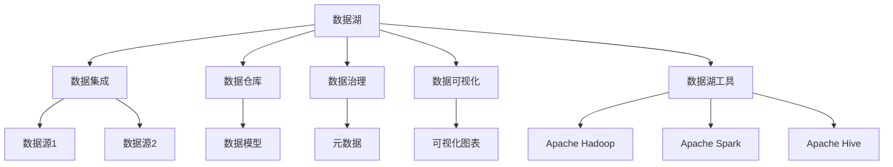

                 

# 数据湖 原理与代码实例讲解

> 关键词：数据湖, 数据存储, 大数据, 数据湖架构, 数据治理, 数据湖工具, 数据湖实践

## 1. 背景介绍

### 1.1 问题由来
数据湖（Data Lake）是大数据时代的一种重要数据管理方式，被广泛应用于数据驱动的决策支持、科学研究、商业智能等领域。数据湖通过集中的存储方式，将来自各个源的数据整合在一起，保留数据的原始形式，并通过数据湖工具进行分析、挖掘、可视化和机器学习等操作，从而支持更丰富的应用场景。

数据湖的兴起源于数据管理的需要。在传统的数据仓库（Data Warehouse）中，数据需要按照固定的数据模型进行存储和处理，这对灵活性、复杂性和实时性都有较高要求。而数据湖则通过底层统一存储、上层灵活处理的方式，解决了这些问题，使得数据驱动的应用更加高效和灵活。

### 1.2 问题核心关键点
1. **数据集成**：将来自不同源、不同格式的数据整合到统一的数据湖中。
2. **数据存储**：采用高效、可靠的数据存储方式，满足大规模数据存储的需求。
3. **数据治理**：通过元数据管理、数据质量监控、数据生命周期管理等手段，确保数据的一致性和完整性。
4. **数据分析**：提供强大的数据分析和处理工具，支持机器学习、数据挖掘等高级应用。
5. **数据可视化**：通过可视化工具，将数据转换为易于理解和分析的图表和报表。

数据湖的核心目标是通过提供一种集中、统一、灵活的数据管理方式，支持各类数据驱动的业务应用，从而提升决策效率和业务价值。

### 1.3 问题研究意义
数据湖技术的深入研究和应用，对于推动数据驱动的业务转型、提升决策效率、优化数据资源利用具有重要意义：

1. **提升决策效率**：数据湖提供统一的数据管理和分析平台，使决策者能够快速获取全面、准确的数据信息，进行高效决策。
2. **优化数据资源利用**：通过数据湖的集中存储和处理，可以避免数据冗余，提高数据资源的利用率。
3. **支持复杂分析**：数据湖支持复杂的数据分析和处理，如机器学习、数据挖掘等，为数据驱动的创新应用提供支持。
4. **促进跨部门协作**：数据湖的统一数据管理和共享，促进了不同部门之间的数据协作和共享，加速了业务流程的优化。
5. **应对数据增长挑战**：数据湖通过分布式存储和处理，能够应对大规模数据的存储和分析需求，支持业务规模的快速扩展。

数据湖技术的应用，将显著提升企业的数据管理和分析能力，为数据驱动的业务创新和转型提供坚实基础。

## 2. 核心概念与联系

### 2.1 核心概念概述

为更好地理解数据湖的核心概念，本节将介绍几个密切相关的核心概念：

- **数据湖**：一种集中、统一、灵活的数据管理方式，通过底层统一存储、上层灵活处理的方式，支持各类数据驱动的业务应用。
- **数据仓库**：一种集中、结构化的数据管理方式，按照固定的数据模型进行存储和处理，支持复杂的数据查询和分析。
- **数据集成**：将来自不同源、不同格式的数据整合到统一的数据仓库或数据湖中，是数据管理和分析的前提。
- **数据治理**：通过元数据管理、数据质量监控、数据生命周期管理等手段，确保数据的一致性和完整性。
- **数据可视化**：通过可视化工具，将数据转换为易于理解和分析的图表和报表，提升数据洞察能力。
- **数据湖工具**：如Apache Hadoop、Apache Spark、Apache Hive等，提供数据存储、处理、分析等功能。

这些核心概念之间的逻辑关系可以通过以下Mermaid流程图来展示：



这个流程图展示了大数据湖的核心概念及其之间的关系：

1. 数据湖通过底层统一存储、上层灵活处理的方式，支持各类数据驱动的业务应用。
2. 数据集成将来自不同源、不同格式的数据整合到统一的数据仓库或数据湖中。
3. 数据仓库按照固定的数据模型进行存储和处理，支持复杂的数据查询和分析。
4. 数据治理通过元数据管理、数据质量监控、数据生命周期管理等手段，确保数据的一致性和完整性。
5. 数据可视化通过可视化工具，将数据转换为易于理解和分析的图表和报表，提升数据洞察能力。
6. 数据湖工具提供数据存储、处理、分析等功能，支持数据湖的构建和运营。

## 3. 核心算法原理 & 具体操作步骤
### 3.1 算法原理概述

数据湖的核心思想是通过集中、统一、灵活的数据存储和处理方式，支持数据驱动的各类业务应用。其算法原理主要包括以下几个方面：

- **数据集成算法**：通过ETL（Extract, Transform, Load）流程，将数据从不同源提取出来，经过转换后加载到统一的数据湖中。
- **数据存储算法**：采用分布式文件系统（如HDFS）和数据库（如Hive、Spark SQL），实现高效、可靠的数据存储。
- **数据治理算法**：通过元数据管理、数据质量监控、数据生命周期管理等手段，确保数据的一致性和完整性。
- **数据分析算法**：支持复杂的数据分析和处理，如机器学习、数据挖掘等，利用数据湖工具提供丰富的算法库。
- **数据可视化算法**：通过数据可视化工具，将数据转换为易于理解和分析的图表和报表，提升数据洞察能力。

### 3.2 算法步骤详解

数据湖的构建过程主要包括以下几个关键步骤：

**Step 1: 数据源采集**
- 确定数据源，包括内部数据库、外部API、物联网设备等。
- 使用ETL工具（如Apache NiFi、Talend等）从各个数据源中采集数据。

**Step 2: 数据清洗与转换**
- 对采集到的数据进行清洗和预处理，如去除重复数据、处理缺失值、数据转换等。
- 使用ETL工具或编程语言（如Python、Java等）进行数据转换，确保数据符合预期的格式和类型。

**Step 3: 数据存储与管理**
- 使用分布式文件系统（如HDFS）或数据库（如Hive、Spark SQL）对清洗后的数据进行存储。
- 对数据进行元数据管理，确保数据的来源、类型、质量等信息能够被追溯和监控。
- 使用数据治理工具（如Apache Atlas、DataHub等）对数据进行生命周期管理，确保数据的一致性和完整性。

**Step 4: 数据分析与处理**
- 使用数据湖工具（如Apache Spark、Apache Flink等）对存储在数据湖中的数据进行分析和处理。
- 利用丰富的算法库（如TensorFlow、Scikit-learn等）进行机器学习、数据挖掘等操作。
- 对分析结果进行可视化，通过数据可视化工具（如Tableau、Power BI等）生成图表和报表。

**Step 5: 应用集成与部署**
- 将分析结果集成到业务应用中，支持决策支持、业务智能等应用。
- 使用DevOps工具（如Jenkins、Ansible等）对数据湖进行部署和管理。

以上是构建数据湖的一般流程。在实际应用中，还需要根据具体业务需求，对各个环节进行优化设计，如改进ETL流程、优化数据存储方式、选择合适的数据治理工具等，以进一步提升数据湖的性能和可靠性。

### 3.3 算法优缺点

数据湖技术的优点包括：

1. **灵活性**：支持各种数据源、数据格式和数据模型，灵活应对数据管理需求。
2. **可扩展性**：通过分布式存储和处理，能够应对大规模数据的存储和分析需求，支持业务规模的快速扩展。
3. **数据一致性**：通过元数据管理和数据质量监控，确保数据的一致性和完整性。
4. **数据洞察力**：通过数据可视化和高级分析工具，提升数据的洞察能力和决策支持。

数据湖技术也存在一定的局限性：

1. **数据质量**：数据湖中存储的数据未经过严格的质量控制，数据质量可能存在不确定性。
2. **存储成本**：大规模数据的存储和处理需要较大的计算和存储资源，成本较高。
3. **复杂性**：数据湖的构建和维护需要较高的技术水平和管理能力，复杂度较高。
4. **数据安全**：数据湖中存储的数据涉及敏感信息，数据安全管理和隐私保护成为重要挑战。

尽管存在这些局限性，但就目前而言，数据湖技术仍然是大数据时代的重要数据管理方式。未来相关研究的重点在于如何进一步提高数据湖的自动化水平、降低存储和计算成本、增强数据治理能力，以更好地支持数据驱动的业务应用。

### 3.4 算法应用领域

数据湖技术已经在多个领域得到了广泛应用，包括但不限于：

1. **金融行业**：通过数据湖技术，金融机构可以整合各种内部和外部数据，进行风险评估、客户分析、信用评分等操作。
2. **医疗行业**：数据湖可以整合患者电子病历、医疗影像、基因组数据等多种类型的数据，支持临床决策支持、个性化医疗、疾病预测等应用。
3. **零售行业**：通过数据湖技术，零售企业可以整合客户数据、供应链数据、销售数据等多种数据，进行需求预测、库存管理、客户营销等操作。
4. **制造业**：数据湖可以整合生产数据、设备数据、供应链数据等多种数据，支持生产优化、质量控制、设备维护等应用。
5. **政府部门**：数据湖可以整合政府数据、公共数据、社会数据等多种数据，支持公共管理、城市治理、公共服务等多方面的应用。
6. **能源行业**：数据湖可以整合能源数据、环境数据、设备数据等多种数据，支持能源优化、环境监测、设备维护等应用。

除了上述这些典型应用外，数据湖技术还可以应用于科学研究、社交媒体分析、公共安全监测等领域，为各类数据驱动的应用提供支持。

## 4. 数学模型和公式 & 详细讲解  
### 4.1 数学模型构建

在数据湖的构建过程中，数学模型主要涉及数据的采集、清洗、存储和分析等多个环节。以下是数学模型的构建过程：

**数据采集模型**：
- 假设数据源数量为 $N$，数据采集周期为 $T$，则数据采集频率 $f = \frac{1}{T}$。
- 数据采集模型为 $A(t) = \sum_{i=1}^{N} I_i(t)$，其中 $I_i(t)$ 表示第 $i$ 个数据源在时间 $t$ 的数据采集量。

**数据清洗模型**：
- 数据清洗模型为 $C(t) = \min_{i} A_i(t)$，其中 $A_i(t)$ 表示第 $i$ 个数据源在时间 $t$ 的数据采集量。
- 数据清洗模型旨在确保数据的质量和一致性，去除重复数据和异常数据。

**数据存储模型**：
- 数据存储模型为 $S(t) = \sum_{i=1}^{N} A_i(t)$，其中 $A_i(t)$ 表示第 $i$ 个数据源在时间 $t$ 的数据采集量。
- 数据存储模型描述了数据在数据湖中的存储量，需要考虑存储成本和存储效率。

**数据分析模型**：
- 数据分析模型为 $D(t) = \sum_{i=1}^{N} \mathbb{P}(\text{Analyze}_i(t))$，其中 $\mathbb{P}(\text{Analyze}_i(t))$ 表示第 $i$ 个数据源在时间 $t$ 的数据分析概率。
- 数据分析模型描述了数据湖中数据的分析和处理方式，需要考虑分析的复杂度和分析效率。

**数据可视化模型**：
- 数据可视化模型为 $V(t) = \mathbb{P}(\text{Visualization}(t))$，其中 $\mathbb{P}(\text{Visualization}(t))$ 表示在时间 $t$ 进行数据可视化的概率。
- 数据可视化模型描述了数据湖中数据的可视化方式，需要考虑可视化工具的易用性和可视化效果。

### 4.2 公式推导过程

以下是数据湖构建过程中涉及的数学模型和公式推导：

**数据采集频率公式**：
$$
f = \frac{1}{T}
$$

**数据清洗模型公式**：
$$
C(t) = \min_{i} A_i(t)
$$

**数据存储模型公式**：
$$
S(t) = \sum_{i=1}^{N} A_i(t)
$$

**数据分析模型公式**：
$$
D(t) = \sum_{i=1}^{N} \mathbb{P}(\text{Analyze}_i(t))
$$

**数据可视化模型公式**：
$$
V(t) = \mathbb{P}(\text{Visualization}(t))
$$

### 4.3 案例分析与讲解

以某电商平台的数据湖构建为例，分析数据湖在实际操作中的应用：

**数据源采集**：
- 电商平台的数据源包括用户行为数据、交易数据、供应链数据等。
- 使用ETL工具（如Apache NiFi）从各个数据源中采集数据，生成数据流 $A(t)$。

**数据清洗与转换**：
- 对采集到的数据进行清洗和预处理，去除重复数据和异常数据。
- 使用ETL工具（如Talend）进行数据转换，确保数据符合预期的格式和类型。

**数据存储与管理**：
- 使用分布式文件系统（如HDFS）对清洗后的数据进行存储。
- 使用数据治理工具（如Apache Atlas）对数据进行生命周期管理，确保数据的一致性和完整性。

**数据分析与处理**：
- 使用数据湖工具（如Apache Spark）对存储在数据湖中的数据进行分析和处理。
- 利用机器学习算法（如随机森林、梯度提升树等）进行需求预测、库存管理等操作。

**数据可视化**：
- 使用数据可视化工具（如Tableau）将分析结果转换为图表和报表。
- 通过数据可视化提升数据的洞察能力，支持决策支持、业务智能等应用。

通过以上案例，可以看到数据湖在实际操作中的应用流程，以及涉及的各种数学模型和公式。

## 5. 项目实践：代码实例和详细解释说明
### 5.1 开发环境搭建

在进行数据湖项目实践前，我们需要准备好开发环境。以下是使用Python进行PySpark开发的Python环境配置流程：

1. 安装Anaconda：从官网下载并安装Anaconda，用于创建独立的Python环境。

2. 创建并激活虚拟环境：
```bash
conda create -n spark-env python=3.8 
conda activate spark-env
```

3. 安装Apache Spark：
```bash
conda install pyspark
```

4. 安装相关的Python包：
```bash
pip install pandas numpy matplotlib scikit-learn tqdm jupyter notebook ipython
```

完成上述步骤后，即可在`spark-env`环境中开始数据湖项目实践。

### 5.2 源代码详细实现

我们以一个简单的数据湖项目为例，展示如何使用PySpark进行数据湖的构建和分析。

首先，导入必要的Python包和PySpark：

```python
from pyspark.sql import SparkSession
from pyspark.sql.functions import col, when, min, max
from pyspark.sql.types import IntegerType, StructType, StructField, StringType
from pyspark.sql.window import Window

spark = SparkSession.builder.appName("Data Lake Project").getOrCreate()
```

然后，定义数据源和数据模型：

```python
# 定义数据源
data_source = spark.read.format("csv").option("header", "true").load("path/to/data.csv")

# 定义数据模型
schema = StructType([
    StructField("id", IntegerType(), True),
    StructField("name", StringType(), True),
    StructField("age", IntegerType(), True),
    StructField("gender", StringType(), True)
])

data_model = data_source.select(*schema)

# 输出数据模型
data_model.show()
```

接着，进行数据清洗和转换：

```python
# 去除重复数据
data_clean = data_model.dropDuplicates()

# 处理缺失值
data_clean = data_clean.na.fill(0)

# 数据转换
data_transformed = data_clean.select(col("id"), col("name"), col("age"), col("gender"))

# 输出转换后的数据
data_transformed.show()
```

然后，进行数据存储和元数据管理：

```python
# 将转换后的数据保存到HDFS
data_transformed.write.format("parquet").save("hdfs://path/to/data.parquet")

# 注册元数据
spark.createDataFrame(data_transformed, schema).write.mode("overwrite").parquet("hdfs://path/to/metadata.parquet")
```

最后，进行数据分析和可视化：

```python
# 数据聚合
data_aggregate = data_transformed.groupBy("gender").count()

# 数据可视化
data_aggregate.show()

# 绘制柱状图
from pyspark.sql.functions import col
from pyspark.sql.window import Window
from pyspark.sql.functions import count, sum

# 分组统计
data_grouped = data_transformed.groupBy("gender").count()

# 设置窗口
window = Window.partitionBy("gender").orderBy(col("count").desc())

# 绘制柱状图
data_grouped.withColumn("count", count("id")).show()
```

以上就是使用PySpark进行数据湖项目的完整代码实现。可以看到，通过PySpark提供的丰富的API和函数，可以轻松进行数据清洗、存储、分析和可视化等操作。

### 5.3 代码解读与分析

让我们再详细解读一下关键代码的实现细节：

**数据源定义**：
- 使用Spark的`read`函数定义数据源，通过CSV格式加载数据。
- 通过`option`函数设置数据的头部信息，确保数据按照预期的格式加载。

**数据模型定义**：
- 使用`StructType`函数定义数据模型的结构，指定每个字段的名称和类型。
- 使用`StructField`函数定义每个字段，确保数据模型符合预期的格式。

**数据清洗与转换**：
- 使用`dropDuplicates`函数去除数据中的重复记录。
- 使用`na.fill`函数处理缺失值，将其替换为默认值。
- 使用`select`函数进行数据转换，确保数据符合预期的格式和类型。

**数据存储与元数据管理**：
- 使用`write`函数将转换后的数据保存到HDFS，确保数据的高效存储和访问。
- 使用`createDataFrame`函数注册元数据，确保数据的来源、类型、质量等信息能够被追溯和监控。

**数据分析与可视化**：
- 使用`groupBy`函数进行数据聚合，统计每个字段的数量。
- 使用`show`函数展示聚合结果，输出到控制台。
- 使用`createDataFrame`函数将聚合结果转换为DataFrame，并进行可视化处理。
- 使用`show`函数展示可视化结果，输出到控制台。

可以看到，通过PySpark提供的丰富的API和函数，可以轻松进行数据湖项目的开发和实践。开发者可以将更多精力放在数据处理、模型改进等高层逻辑上，而不必过多关注底层的实现细节。

当然，工业级的系统实现还需考虑更多因素，如模型的保存和部署、超参数的自动搜索、更灵活的数据治理方式等。但核心的数据湖构建流程基本与此类似。

## 6. 实际应用场景
### 6.1 智能推荐系统

数据湖在智能推荐系统中具有广泛的应用。通过整合用户的浏览记录、点击行为、评分数据等多种数据源，数据湖可以为推荐算法提供丰富的输入，提升推荐系统的精准度和多样性。

在技术实现上，可以收集用户的历史行为数据，使用ETL工具进行清洗和转换，将其存储到数据湖中。然后，利用机器学习算法（如协同过滤、深度学习等）在数据湖中对数据进行分析和处理，生成推荐结果。最后，将推荐结果通过API接口提供给应用系统，支持实时推荐。

### 6.2 供应链管理

数据湖在供应链管理中的应用也极为广泛。通过整合企业内部的订单数据、库存数据、物流数据等多种数据源，数据湖可以为供应链优化提供强有力的支持。

在实际操作中，企业可以从ERP、CRM、WMS等系统中采集数据，使用ETL工具进行清洗和转换，将其存储到数据湖中。然后，利用数据分析工具（如Apache Spark）对数据进行优化分析，生成供应链优化策略。最后，将优化结果反馈到供应链管理系统中，支持实时决策和优化。

### 6.3 金融风控

数据湖在金融风控中的应用同样不可或缺。通过整合用户的个人信息、交易记录、信用记录等多种数据源，数据湖可以为风控模型提供丰富的输入，提升风险评估的准确性和全面性。

在技术实现上，金融公司可以从多个数据源中采集数据，使用ETL工具进行清洗和转换，将其存储到数据湖中。然后，利用机器学习算法（如逻辑回归、随机森林等）在数据湖中对数据进行分析和处理，生成风控模型。最后，将风控模型应用于业务系统中，支持实时风险评估和决策。

### 6.4 未来应用展望

随着数据湖技术的不断演进，其应用前景将更加广阔：

1. **大数据分析**：数据湖将支持更大规模的数据分析和处理，为科学研究、商业智能等领域提供强有力的支持。
2. **实时数据处理**：数据湖将支持实时数据流处理，为实时决策和优化提供支持。
3. **自动化数据分析**：数据湖将支持自动化的数据分析和处理，降低数据管理成本，提高效率。
4. **数据共享与协作**：数据湖将支持跨部门、跨企业的数据共享与协作，促进数据驱动的业务创新。
5. **数据治理与安全**：数据湖将支持完善的数据治理和安全管理，确保数据的质量和安全。
6. **人工智能与机器学习**：数据湖将支持基于人工智能和机器学习的高级应用，提升决策支持和业务智能水平。

## 7. 工具和资源推荐
### 7.1 学习资源推荐

为了帮助开发者系统掌握数据湖的原理和实践，这里推荐一些优质的学习资源：

1. 《Hadoop and Spark: The Definitive Guide》书籍：详细介绍了Hadoop和Spark的基本原理和应用实践，是数据湖开发的必备参考书。
2. CS229《Machine Learning》课程：斯坦福大学开设的机器学习课程，涵盖各种机器学习算法及其应用。
3. 《Data Science with Spark》书籍：提供了使用Spark进行数据分析和处理的实用技巧，适合初学者和实践者。
4. Hadoop和Spark官方文档：详细介绍了Hadoop和Spark的各种功能和API，是实际开发的重要参考资料。
5. Kaggle数据湖挑战：通过参与Kaggle数据湖挑战，了解实际数据湖项目的构建和分析方法。

通过对这些资源的学习实践，相信你一定能够快速掌握数据湖的精髓，并用于解决实际的数据驱动业务问题。
###  7.2 开发工具推荐

高效的开发离不开优秀的工具支持。以下是几款用于数据湖开发常用的工具：

1. PySpark：Python编程接口，使用Spark的基本API进行数据处理和分析。
2. Apache Spark：强大的分布式计算框架，支持大规模数据处理和分析。
3. Hive：基于Hadoop的数据仓库解决方案，提供数据查询和分析功能。
4. Hadoop：Apache开源的分布式计算框架，支持大规模数据存储和处理。
5. Apache Kafka：高性能的消息队列，支持实时数据流处理和传输。
6. Apache Flink：流处理框架，支持实时数据流处理和分析。

合理利用这些工具，可以显著提升数据湖项目的开发效率，加快创新迭代的步伐。

### 7.3 相关论文推荐

数据湖技术的研究始于学界的持续研究。以下是几篇奠基性的相关论文，推荐阅读：

1. "MapReduce: Simplified Data Processing on Large Clusters"：Google发表的MapReduce论文，是分布式计算框架的开山之作。
2. "Pig Latin: A Platform for Distributed Data Stream Processing"：Yahoo发表的Pig Latin论文，是数据流处理框架的先驱。
3. "A Decade of Big Data: A Survey"：斯坦福大学发表的Big Data综述论文，总结了大数据领域的最新进展。
4. "Scalable Algorithms for Big Data"：斯坦福大学发表的Scalable Algorithms论文，介绍了各种大规模数据处理的算法。
5. "Big Data Analytics in Practice: A Data Lake Approach"：IBM发表的Big Data Analytics论文，介绍了数据湖的概念和应用。

这些论文代表了大数据湖技术的发展脉络。通过学习这些前沿成果，可以帮助研究者把握学科前进方向，激发更多的创新灵感。

## 8. 总结：未来发展趋势与挑战
### 8.1 总结

本文对数据湖的原理和实践进行了全面系统的介绍。首先阐述了数据湖的概念和核心思想，明确了数据湖在数据管理和分析中的应用价值。其次，从原理到实践，详细讲解了数据湖的构建流程和实现方法，给出了数据湖项目开发的完整代码实例。同时，本文还广泛探讨了数据湖在智能推荐、供应链管理、金融风控等众多领域的应用前景，展示了数据湖技术的巨大潜力。此外，本文精选了数据湖学习的各类资源，力求为读者提供全方位的技术指引。

通过本文的系统梳理，可以看到，数据湖技术正在成为大数据时代的重要数据管理方式，极大地提升数据驱动应用的性能和灵活性。未来，伴随数据湖技术的不断演进，其应用范围将更加广泛，为各类数据驱动业务提供强有力的支持。

### 8.2 未来发展趋势

展望未来，数据湖技术将呈现以下几个发展趋势：

1. **自动化与智能化**：数据湖将支持自动化数据分析和处理，降低数据管理成本，提高效率。
2. **实时数据处理**：数据湖将支持实时数据流处理，为实时决策和优化提供支持。
3. **跨平台集成**：数据湖将支持跨平台、跨企业的数据共享与协作，促进数据驱动的业务创新。
4. **数据治理与安全**：数据湖将支持完善的数据治理和安全管理，确保数据的质量和安全。
5. **多模态数据融合**：数据湖将支持多模态数据的融合，实现视觉、语音、文本等多种数据类型的协同建模。
6. **大数据分析与人工智能**：数据湖将支持基于大数据分析和人工智能的高级应用，提升决策支持和业务智能水平。

以上趋势凸显了数据湖技术的应用前景。这些方向的探索发展，将进一步提升数据湖的自动化水平、降低存储和计算成本、增强数据治理能力，以更好地支持数据驱动的业务应用。

### 8.3 面临的挑战

尽管数据湖技术已经取得了显著成果，但在迈向更加智能化、普适化应用的过程中，它仍面临着诸多挑战：

1. **数据质量与一致性**：数据湖中存储的数据未经过严格的质量控制，数据质量可能存在不确定性。
2. **存储成本与计算资源**：大规模数据的存储和处理需要较大的计算和存储资源，成本较高。
3. **数据安全与隐私**：数据湖中存储的数据涉及敏感信息，数据安全管理和隐私保护成为重要挑战。
4. **复杂性与技术门槛**：数据湖的构建和维护需要较高的技术水平和管理能力，复杂度较高。
5. **数据迁移与兼容性**：数据湖中的数据来自多个异构系统，数据迁移和兼容性问题需要重点关注。
6. **数据湖生态系统的成熟度**：数据湖工具和技术的成熟度需要进一步提升，以支持更加复杂和多样的数据湖应用。

尽管存在这些挑战，但数据湖技术的发展前景仍然光明。未来，需要在数据质量、存储成本、数据安全等方面进行持续优化，同时推动数据湖工具和技术的进步，以更好地支持数据湖的构建和运营。

### 8.4 研究展望

未来，数据湖技术的研究方向将集中在以下几个方面：

1. **自动化与智能化**：开发更加自动化和智能化的数据分析和处理工具，降低数据管理成本，提高效率。
2. **实时数据处理**：研究实时数据流处理算法，支持实时决策和优化。
3. **跨平台集成**：推动跨平台、跨企业的数据共享与协作，促进数据驱动的业务创新。
4. **数据治理与安全**：完善数据治理和安全管理，确保数据的质量和安全。
5. **多模态数据融合**：探索多模态数据的融合方法，实现视觉、语音、文本等多种数据类型的协同建模。
6. **大数据分析与人工智能**：推动大数据分析和人工智能的深入研究，提升决策支持和业务智能水平。

通过持续的创新和优化，数据湖技术必将在未来发挥更大的作用，成为数据驱动业务的重要支撑。

## 9. 附录：常见问题与解答

**Q1：数据湖与数据仓库的区别是什么？**

A: 数据湖与数据仓库的区别主要体现在数据存储和管理方式上：

1. **数据存储方式**：数据湖支持非结构化和半结构化数据存储，而数据仓库则支持结构化数据存储。
2. **数据管理方式**：数据湖强调数据的灵活性，支持数据的自由存取和处理，而数据仓库则强调数据的规范性和一致性。
3. **数据治理**：数据湖的数据治理方式更加灵活，支持数据的元数据管理和数据质量监控，而数据仓库则有更严格的规范和流程。
4. **数据分析**：数据湖支持复杂的数据分析和处理，如机器学习、数据挖掘等，而数据仓库则更多关注数据的查询和分析。

**Q2：数据湖的构建和运营过程中需要注意哪些问题？**

A: 数据湖的构建和运营过程中需要注意以下问题：

1. **数据质量**：确保数据的准确性、完整性和一致性，避免数据冗余和错误。
2. **数据安全**：加强数据的安全管理和隐私保护，避免数据泄露和滥用。
3. **存储成本**：优化数据存储方式，降低存储成本，提高存储效率。
4. **数据治理**：完善数据治理流程，确保数据的可追溯性和可管理性。
5. **数据迁移**：确保数据湖中的数据来自多个异构系统，能够无缝迁移和集成。
6. **数据湖生态系统的成熟度**：选择成熟的数据湖工具和技术，确保系统的稳定性和可扩展性。

**Q3：数据湖在实时数据处理中的应用有哪些？**

A: 数据湖在实时数据处理中的应用包括以下几个方面：

1. **实时数据流处理**：使用数据流处理框架（如Apache Kafka、Apache Flink等）对实时数据进行流式处理和分析。
2. **实时数据可视化**：使用数据可视化工具（如Grafana、Tableau等）对实时数据进行可视化，提升数据洞察能力。
3. **实时决策支持**：使用机器学习算法（如随机森林、梯度提升树等）对实时数据进行分析和处理，支持实时决策和优化。

**Q4：如何评估数据湖的性能？**

A: 数据湖的性能评估主要包括以下几个方面：

1. **存储性能**：评估数据湖的存储效率和成本，确保数据的快速读写和高效存储。
2. **处理性能**：评估数据湖的数据处理速度和吞吐量，确保数据的实时分析和处理。
3. **数据质量**：评估数据的准确性、完整性和一致性，确保数据的质量和可靠性。
4. **数据治理**：评估数据湖的数据治理能力，确保数据的可追溯性和可管理性。
5. **数据安全性**：评估数据湖的安全性和隐私保护能力，确保数据的安全和隐私。

**Q5：数据湖中的数据如何管理和治理？**

A: 数据湖中的数据管理和治理主要包括以下几个方面：

1. **数据分类与分级**：根据数据的重要性和敏感性，对数据进行分类和分级管理。
2. **数据质量管理**：通过数据清洗、数据校验、数据监控等手段，确保数据的质量和一致性。
3. **数据访问控制**：通过访问控制机制，限制数据访问权限，确保数据的安全性和隐私保护。
4. **元数据管理**：通过元数据管理工具（如Apache Atlas、DataHub等），记录数据的来源、类型、质量等信息。
5. **数据生命周期管理**：通过数据生命周期管理工具，确保数据的有序存储和高效利用。

**Q6：如何利用数据湖进行数据驱动的业务创新？**

A: 利用数据湖进行数据驱动的业务创新主要包括以下几个方面：

1. **数据整合**：整合来自不同数据源的数据，形成统一的数据视图。
2. **数据挖掘与分析**：利用机器学习、数据挖掘等技术，从数据中发现模式和洞察，支持业务决策。
3. **数据可视化**：通过可视化工具，将数据转换为易于理解和分析的图表和报表，提升数据洞察能力。
4. **数据治理**：通过数据治理工具，确保数据的质量和安全，提升数据的可追溯性和可管理性。
5. **数据应用**：将数据湖中的数据应用于业务系统，支持实时决策和优化，提升业务效率和效果。

通过以上案例和问题解答，可以看到数据湖在实际应用中的广泛应用及其面临的挑战。未来，数据湖技术将继续发展，为数据驱动的业务创新提供更加强有力的支持。

---

作者：禅与计算机程序设计艺术 / Zen and the Art of Computer Programming

