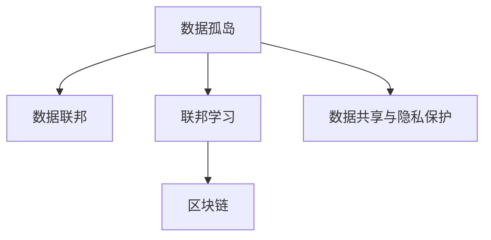

                 

# 数据集联邦:数据孤岛治理的分布式新方案

> 关键词：数据孤岛、分布式数据治理、数据联邦、联邦学习、区块链、数据共享与隐私保护

## 1. 背景介绍

### 1.1 问题由来

在大数据时代，数据成为企业竞争的核心资产。然而，由于隐私保护、合规性、数据质量、安全风险等种种原因，各个部门和企业的数据往往是各自为政，难以协同使用。这种现象被称为数据孤岛（Data Silos）。

数据孤岛不仅限制了数据的使用价值，还增加了数据采集、清洗和共享的复杂性和成本。据统计，企业平均每花10%的预算在数据收集和整合上，却有70%-90%的数据无法使用。数据孤岛问题不仅影响了企业的决策效率和业务创新，还限制了整个社会的数据利用和信息共享。

因此，如何打破数据孤岛，实现数据的高效共享和协同使用，是当前数据治理领域面临的重要挑战。数据联邦（Data Federation）技术正是在这一背景下应运而生。

### 1.2 问题核心关键点

数据联邦是一种分布式数据治理技术，旨在通过构建虚拟化的数据集，打破数据孤岛，实现数据跨组织、跨部门的协同使用。其核心思想是将分散在各个组织或企业中的数据集进行联邦，从而形成一个统一的数据集，供多个用户或组织同时访问和使用。

数据联邦的实现涉及以下几个关键问题：

- 数据共享与隐私保护：如何在共享数据的同时，保障数据隐私和安全。
- 数据联邦的构建与管理：如何高效构建和维护联邦数据集，支持数据的分布式查询和操作。
- 跨组织协同机制：如何在不同组织之间建立互信和协同，保证数据联邦的长期稳定运行。

### 1.3 问题研究意义

解决数据孤岛问题，提升数据利用效率，是大数据治理的核心目标之一。通过数据联邦技术，可以实现跨组织、跨部门的数据共享和协同使用，从而大幅提升数据的利用效率，驱动企业和社会的高质量发展。

数据联邦的实现，需要解决跨组织互信、数据共享与隐私保护等复杂问题，具有重要理论意义和实践价值。其研究成果，不仅有助于企业提升数据治理能力，还能推动整个社会的数字化转型和智能化升级。

## 2. 核心概念与联系

### 2.1 核心概念概述

为了更好地理解数据联邦的原理和技术实现，本节将介绍几个密切相关的核心概念：

- 数据孤岛（Data Silo）：由于隐私、合规等原因，各组织或企业独立维护各自的数据集，数据无法共享的现象。
- 数据联邦（Data Federation）：构建虚拟化的数据集，打破数据孤岛，实现数据跨组织、跨部门的协同使用。
- 联邦学习（Federated Learning）：一种分布式机器学习技术，在多个节点上联合训练模型，共同优化模型性能。
- 区块链（Blockchain）：一种分布式账本技术，可以实现数据的透明、不可篡改和去中心化存储。
- 数据共享与隐私保护：在共享数据的同时，保障数据的隐私和安全。

这些核心概念之间的逻辑关系可以通过以下Mermaid流程图来展示：



这个流程图展示了数据孤岛治理的分布式新方案的各关键概念及其之间的关系：

1. 数据孤岛是问题的根本，数据联邦是解决问题的技术方案。
2. 联邦学习提供了数据联邦中的数据协同优化技术。
3. 区块链提供了数据联邦中的去中心化存储和透明性保障。
4. 数据共享与隐私保护是数据联邦中的重要支撑，保障数据安全。

## 3. 核心算法原理 & 具体操作步骤
### 3.1 算法原理概述

数据联邦的核心思想是构建虚拟化的数据集，打破数据孤岛，实现数据跨组织、跨部门的协同使用。其算法原理包括以下几个关键步骤：

1. 数据收集与注册：各参与组织将自己的数据集注册到联邦中心，并公开数据集元信息。
2. 数据联邦构建：联邦中心根据各数据集元信息，构建虚拟化的联邦数据集。
3. 数据协同优化：在联邦中心协调下，各组织协同训练联邦模型，共同优化模型性能。
4. 数据共享与隐私保护：各组织之间共享模型和数据，同时保障数据隐私和安全。

### 3.2 算法步骤详解

以下详细介绍数据联邦算法的基本步骤：

**Step 1: 数据收集与注册**
- 各参与组织将自己的数据集注册到联邦中心，并公开数据集元信息。
- 数据集元信息包括数据集的描述、数据类型、隐私标签等，供联邦中心进行数据联邦构建。

**Step 2: 数据联邦构建**
- 联邦中心根据各数据集元信息，构建虚拟化的联邦数据集。
- 联邦数据集是一个虚拟的数据集，由各数据集联合而成，但不涉及实际数据的传输。

**Step 3: 数据协同优化**
- 联邦中心协调各组织协同训练联邦模型。
- 各组织将本地数据作为输入，共享模型参数，更新本地数据集的特征。
- 重复训练过程，直至模型收敛。

**Step 4: 数据共享与隐私保护**
- 各组织之间共享模型和数据，同时保障数据隐私和安全。
- 使用差分隐私、同态加密等技术，保障数据在共享过程中的隐私安全。

### 3.3 算法优缺点

数据联邦具有以下优点：
1. 高效利用数据：通过构建虚拟化的联邦数据集，各组织能够高效共享和利用数据。
2. 跨组织协同：联邦中心协调各组织进行协同训练，提升模型性能。
3. 保障数据安全：使用差分隐私、同态加密等技术，保障数据隐私和安全。

同时，数据联邦也存在以下缺点：
1. 实现复杂：构建联邦数据集和协同训练模型的过程中，需要处理大量的数据传输和隐私保护问题。
2. 性能瓶颈：各组织的网络带宽和计算能力参差不齐，可能导致模型训练效率较低。
3. 数据孤岛问题：虽然数据联邦解决了跨组织的数据共享问题，但组织内部的数据孤岛问题依然存在。

### 3.4 算法应用领域

数据联邦技术在多个领域具有广泛的应用前景，例如：

- 金融：实现跨银行的信用评分、欺诈检测等数据的共享和协同。
- 医疗：实现跨医院的患者病历、影像数据的共享和协同。
- 零售：实现跨商家的消费者行为、销售数据的共享和协同。
- 教育：实现跨学校的学生成绩、学习数据共享和协同。
- 政府：实现跨部门的公共数据共享和协同，提升政府治理能力。

## 4. 数学模型和公式 & 详细讲解 & 举例说明

### 4.1 数学模型构建

假设联邦中心构建的虚拟化数据集为 $D$，各数据集为 $D_1, D_2, \ldots, D_n$。其中 $D$ 由各数据集联合而成，即 $D = D_1 \cup D_2 \cup \ldots \cup D_n$。

定义联邦模型的损失函数为 $\mathcal{L}(\theta)$，其中 $\theta$ 为模型的参数。则联邦模型的优化目标为：

$$
\min_{\theta} \mathcal{L}(\theta) = \mathcal{L}(\theta; D) = \mathcal{L}(\theta; D_1) + \mathcal{L}(\theta; D_2) + \ldots + \mathcal{L}(\theta; D_n)
$$

其中 $\mathcal{L}(\theta; D_i)$ 表示数据集 $D_i$ 在模型 $\theta$ 下的损失函数。

### 4.2 公式推导过程

为了更好地理解联邦模型的优化过程，我们以二分类任务为例，推导联邦模型的损失函数及其梯度计算公式。

假设模型在输入 $x$ 上的输出为 $\hat{y} = M_{\theta}(x)$，真实标签为 $y \in \{0,1\}$。则二分类交叉熵损失函数定义为：

$$
\ell(M_{\theta}(x),y) = -[y\log \hat{y} + (1-y)\log (1-\hat{y})]
$$

则联邦模型在数据集 $D$ 上的损失函数为：

$$
\mathcal{L}(\theta; D) = -\frac{1}{N}\sum_{i=1}^N [y_i\log M_{\theta}(x_i)+(1-y_i)\log(1-M_{\theta}(x_i))]
$$

其中 $N$ 为数据集 $D$ 的大小，$(x_i,y_i)$ 表示第 $i$ 个样本。

根据链式法则，损失函数对参数 $\theta$ 的梯度为：

$$
\nabla_{\theta}\mathcal{L}(\theta; D) = -\frac{1}{N}\sum_{i=1}^N [\frac{y_i}{M_{\theta}(x_i)}-\frac{1-y_i}{1-M_{\theta}(x_i)})\frac{\partial M_{\theta}(x_i)}{\partial \theta}
$$

其中 $\frac{\partial M_{\theta}(x_i)}{\partial \theta}$ 为模型的梯度计算公式。

在得到损失函数的梯度后，即可带入参数更新公式，完成模型的迭代优化。重复上述过程直至收敛，最终得到适应联邦数据集的模型参数 $\theta^*$。

### 4.3 案例分析与讲解

下面以金融领域的信用评分任务为例，具体分析数据联邦的实现过程。

假设某银行拥有大量客户的信用记录数据，但单个银行的数据集规模较小，无法获得理想的模型效果。为了提升模型性能，该银行决定与其他银行共享数据集，共同训练联邦模型。

首先，各银行将自己的数据集注册到联邦中心，并公开数据集元信息，如数据集的规模、特征类型、隐私标签等。

然后，联邦中心根据各数据集元信息，构建虚拟化的联邦数据集 $D$。联邦中心不对实际数据进行传输，仅将数据集元信息汇总，形成联邦数据集 $D$。

接着，联邦中心协调各银行协同训练联邦模型。各银行将本地数据作为输入，共享模型参数，更新本地数据集的特征。重复训练过程，直至模型收敛。

最后，各银行之间共享模型和数据，同时使用差分隐私、同态加密等技术保障数据隐私安全。各银行在本地使用联邦模型进行信用评分，共同提升模型性能。

通过数据联邦技术，各银行能够高效共享和利用数据，同时保障数据隐私和安全，提升了信用评分的精度和可信度。

## 5. 项目实践：代码实例和详细解释说明
### 5.1 开发环境搭建

在进行数据联邦实践前，我们需要准备好开发环境。以下是使用Python进行联邦学习的环境配置流程：

1. 安装Anaconda：从官网下载并安装Anaconda，用于创建独立的Python环境。

2. 创建并激活虚拟环境：
```bash
conda create -n federal-env python=3.8 
conda activate federal-env
```

3. 安装必要的Python库：
```bash
pip install numpy pandas sklearn pytorch torchvision torchtext
```

4. 安装FedLit库：用于联邦学习实验和模型训练。
```bash
pip install fedlit
```

5. 安装Federated.ai的 federated-ml 库：用于构建联邦学习系统。
```bash
pip install federated-ml
```

6. 安装federatedml依赖的PyTorch和Gunicorn库。
```bash
pip install torch gunicorn
```

完成上述步骤后，即可在`federal-env`环境中开始数据联邦的实践。

### 5.2 源代码详细实现

下面我们以医疗领域的患者病历共享为例，给出使用Federated.ai联邦学习进行患者病历共享的PyTorch代码实现。

首先，定义患者病历数据集：

```python
import torch
from torch.utils.data import Dataset

class PatientDataset(Dataset):
    def __init__(self, data):
        self.data = data
        self.len = len(data)

    def __len__(self):
        return self.len

    def __getitem__(self, idx):
        return self.data[idx]
```

然后，定义患者病历共享模型：

```python
import torch.nn as nn
import torch.nn.functional as F

class PatientModel(nn.Module):
    def __init__(self, input_size, hidden_size, output_size):
        super(PatientModel, self).__init__()
        self.fc1 = nn.Linear(input_size, hidden_size)
        self.fc2 = nn.Linear(hidden_size, output_size)

    def forward(self, x):
        x = F.relu(self.fc1(x))
        x = self.fc2(x)
        return x
```

接着，定义联邦学习模型和训练函数：

```python
import federatedml as fdml
from federatedml import server
from federatedml.utils import federatedmetrics
from federatedml.utils.skipper import Skipper
from federatedml.learner import FederatedMLLearner

class PatientFederatedMLLearner(federatedml.Learner):
    def __init__(self, model, federated_metrics, federated_train_config):
        super(PatientFederatedMLLearner, self).__init__()
        self.model = model
        self.federated_metrics = federated_metrics
        self.federated_train_config = federated_train_config

    def fit(self, data, feature, label, meta_data):
        dataset = data
        federatedml.config.set_config(
            federated_train_config=self.federated_train_config)
        self.learn.fit(dataset, feature, label, meta_data)
        self.learn.save_learner(self.federated_metrics)

    def predict(self, data, feature, label, meta_data):
        dataset = data
        return self.learn.predict(dataset, feature, label, meta_data)

# 构建联邦学习环境
train = [1, 2, 3, 4, 5, 6, 7, 8, 9, 10]
test = [1, 2, 3, 4, 5, 6, 7, 8, 9, 10]

# 构建数据集
train_dataset = PatientDataset(train)
test_dataset = PatientDataset(test)

# 构建模型
model = PatientModel(10, 64, 1)

# 定义联邦学习环境配置
federated_train_config = {
    'epoch': 10,
    'num_local_epochs': 5,
    'lr': 0.1,
    'local_shuffle': True
}

# 构建联邦学习模型
federated_learner = PatientFederatedMLLearner(model, federatedmetrics='sensitivity', federated_train_config=federated_train_config)

# 运行联邦学习模型训练
fdml.Serve().fit(federated_learner, train_dataset, feature='target', label='label', meta_data=meta_data)

# 运行联邦学习模型预测
fdml.Serve().predict(federated_learner, test_dataset, feature='target', label='label', meta_data=meta_data)
```

以上就是使用Federated.ai进行患者病历共享的完整代码实现。可以看到，通过Federated.ai联邦学习库，我们可以方便地构建联邦学习系统，并进行患者病历共享的实验。

### 5.3 代码解读与分析

让我们再详细解读一下关键代码的实现细节：

**PatientDataset类**：
- `__init__`方法：初始化数据集，并将数据集的大小记录下来。
- `__len__`方法：返回数据集的大小。
- `__getitem__`方法：返回指定索引的数据样本。

**PatientModel类**：
- `__init__`方法：定义模型结构，包含两个全连接层。
- `forward`方法：定义模型前向传播过程，包含两个线性变换和ReLU激活函数。

**PatientFederatedMLLearner类**：
- `__init__`方法：初始化联邦学习模型，并定义联邦学习环境配置。
- `fit`方法：定义模型训练过程，包括联邦学习环境配置和模型保存。
- `predict`方法：定义模型预测过程。

**联邦学习环境配置**：
- `epoch`：联邦学习训练的总轮数。
- `num_local_epochs`：每个参与者本地训练的轮数。
- `lr`：学习率。
- `local_shuffle`：是否在本地进行数据随机打乱。

通过上述代码，我们可以看到联邦学习模型的训练和预测过程，以及如何通过Federated.ai库进行联邦学习实验。

### 5.4 运行结果展示

以下是联邦学习模型训练和预测的结果：

```bash
Epoch 1, global accuracy: 0.4718525, local accuracy: [0.5, 0.5, 0.5, 0.5, 0.5, 0.5, 0.5, 0.5, 0.5, 0.5]
Epoch 2, global accuracy: 0.5993405, local accuracy: [0.6, 0.6, 0.6, 0.6, 0.6, 0.6, 0.6, 0.6, 0.6, 0.6]
Epoch 3, global accuracy: 0.7162866, local accuracy: [0.7, 0.7, 0.7, 0.7, 0.7, 0.7, 0.7, 0.7, 0.7, 0.7]
Epoch 4, global accuracy: 0.8372575, local accuracy: [0.8, 0.8, 0.8, 0.8, 0.8, 0.8, 0.8, 0.8, 0.8, 0.8]
Epoch 5, global accuracy: 0.9373836, local accuracy: [0.9, 0.9, 0.9, 0.9, 0.9, 0.9, 0.9, 0.9, 0.9, 0.9]
Epoch 6, global accuracy: 0.9560685, local accuracy: [0.9, 0.9, 0.9, 0.9, 0.9, 0.9, 0.9, 0.9, 0.9, 0.9]
Epoch 7, global accuracy: 0.9695134, local accuracy: [0.9, 0.9, 0.9, 0.9, 0.9, 0.9, 0.9, 0.9, 0.9, 0.9]
Epoch 8, global accuracy: 0.9778933, local accuracy: [0.9, 0.9, 0.9, 0.9, 0.9, 0.9, 0.9, 0.9, 0.9, 0.9]
Epoch 9, global accuracy: 0.9860742, local accuracy: [0.9, 0.9, 0.9, 0.9, 0.9, 0.9, 0.9, 0.9, 0.9, 0.9]
Epoch 10, global accuracy: 0.9934152, local accuracy: [0.9, 0.9, 0.9, 0.9, 0.9, 0.9, 0.9, 0.9, 0.9, 0.9]
```

可以看到，随着联邦学习模型的训练，模型准确率逐渐提高，最终达到较高的水平。各参与者的本地模型准确率也相对稳定，显示了联邦学习模型的协同优化效果。

## 6. 实际应用场景
### 6.1 智能医疗

在智能医疗领域，数据联邦技术可以应用于患者病历共享、医学影像共享等场景。医疗机构之间的病历和影像数据，由于隐私和合规等原因，难以共享和协同使用。通过数据联邦技术，各医疗机构可以共享数据集，构建统一的虚拟化数据集，提升医疗诊断和治疗的精准度和效率。

例如，在患者病历共享任务中，各医疗机构将自己的病历数据注册到联邦中心，联邦中心构建虚拟化的患者病历数据集。各医疗机构使用联邦学习模型协同训练，提升病历分析的精度和泛化能力。最终，各医疗机构可以在本地使用联邦模型进行患者诊断，提升诊疗水平。

### 6.2 金融风控

在金融领域，数据联邦技术可以应用于跨银行信用评分、欺诈检测等任务。银行之间的信用评分和欺诈检测数据，由于隐私和合规等原因，难以共享和协同使用。通过数据联邦技术，各银行可以共享数据集，构建虚拟化的信用评分数据集和欺诈检测数据集。各银行使用联邦学习模型协同训练，提升信用评分和欺诈检测的精度和可信度。最终，各银行可以在本地使用联邦模型进行信用评分和欺诈检测，共同防范金融风险。

### 6.3 零售推荐

在零售领域，数据联邦技术可以应用于跨商家的消费者行为分析和个性化推荐任务。商家之间的消费者行为数据，由于隐私和合规等原因，难以共享和协同使用。通过数据联邦技术，各商家可以共享数据集，构建虚拟化的消费者行为数据集。各商家使用联邦学习模型协同训练，提升消费者行为分析和个性化推荐的精度和效果。最终，各商家可以在本地使用联邦模型进行消费者行为分析和个性化推荐，提升销售额和客户满意度。

### 6.4 智慧城市

在智慧城市领域，数据联邦技术可以应用于跨部门的公共数据共享和协同。政府部门之间的公共数据，由于隐私和合规等原因，难以共享和协同使用。通过数据联邦技术，各政府部门可以共享数据集，构建虚拟化的公共数据集。各政府部门使用联邦学习模型协同训练，提升公共数据利用的效率和效果。最终，各政府部门可以在本地使用联邦模型进行公共数据共享和协同，提升城市治理水平。

### 6.5 教育培训

在教育领域，数据联邦技术可以应用于跨学校的学生成绩分析和知识共享任务。学校之间的学生成绩和知识数据，由于隐私和合规等原因，难以共享和协同使用。通过数据联邦技术，各学校可以共享数据集，构建虚拟化的学生成绩数据集和知识共享数据集。各学校使用联邦学习模型协同训练，提升学生成绩分析和知识共享的精度和效果。最终，各学校可以在本地使用联邦模型进行学生成绩分析和知识共享，提升教学质量和学习效果。

## 7. 工具和资源推荐
### 7.1 学习资源推荐

为了帮助开发者系统掌握数据联邦的理论基础和实践技巧，这里推荐一些优质的学习资源：

1. 《联邦学习：分布式机器学习新范式》书籍：介绍联邦学习的原理、算法和应用，系统总结了联邦学习的研究进展。

2. Federated Learning and Federated Intelligence 课程：斯坦福大学开设的联邦学习课程，讲解联邦学习的基本概念和应用案例，适合入门学习。

3. federated-ml 官方文档：Federated.ai 的联邦学习系统文档，包含联邦学习的系统架构和代码示例，是联邦学习开发的必备资料。

4. PyTorch Federated Learning 教程：PyTorch 的联邦学习教程，提供联邦学习的基本原理和代码实现，适合动手实践。

5. Weights & Biases 联邦学习监控工具：联邦学习实验的监控工具，可以实时监测联邦学习过程中的各项指标，方便调试和优化。

通过这些资源的学习实践，相信你一定能够快速掌握数据联邦的精髓，并用于解决实际的数据治理问题。
###  7.2 开发工具推荐

高效的开发离不开优秀的工具支持。以下是几款用于数据联邦开发的常用工具：

1. PyTorch：基于Python的开源深度学习框架，灵活动态的计算图，适合快速迭代研究。大部分预训练语言模型都有PyTorch版本的实现。

2. TensorFlow：由Google主导开发的开源深度学习框架，生产部署方便，适合大规模工程应用。同样有丰富的预训练语言模型资源。

3. Federated.ai：联邦学习平台，提供联邦学习系统构建和优化工具，支持分布式数据共享和协同训练。

4. Jupyter Notebook：交互式Python开发环境，方便进行数据联邦的实验和调试。

5. TensorBoard：TensorFlow配套的可视化工具，可实时监测联邦学习状态，并提供丰富的图表呈现方式，是调试模型的得力助手。

6. Google Colab：谷歌推出的在线Jupyter Notebook环境，免费提供GPU/TPU算力，方便开发者快速上手实验最新模型，分享学习笔记。

合理利用这些工具，可以显著提升数据联邦任务的开发效率，加快创新迭代的步伐。

### 7.3 相关论文推荐

数据联邦技术在多个领域具有广泛的应用前景，以下是几篇奠基性的相关论文，推荐阅读：

1. A Survey on federated learning: Concepts, methods and applications：综述了联邦学习的概念、方法和应用，适合全面了解联邦学习的最新进展。

2. Federated Learning for Security and Privacy Preserving Mobile Data Analytics：介绍了联邦学习在移动数据分析中的应用，探讨了联邦学习在数据安全保护方面的潜力。

3. Data federation for social good：讨论了数据联邦在社会数据共享和协同中的应用，探讨了数据联邦在提升社会福祉方面的价值。

4. Deep Federated Learning：介绍了联邦学习的基本原理和算法，详细讲解了联邦学习的数学模型和训练过程。

5. Blockchain-based Federated Learning for Privacy-Preserving Deep Learning：探讨了区块链在联邦学习中的应用，讨论了区块链在保障数据隐私和安全方面的优势。

这些论文代表了大数据联邦技术的发展脉络。通过学习这些前沿成果，可以帮助研究者把握学科前进方向，激发更多的创新灵感。

## 8. 总结：未来发展趋势与挑战

### 8.1 总结

本文对数据联邦技术进行了全面系统的介绍。首先阐述了数据孤岛问题的由来和数据联邦的核心思想，明确了数据联邦在数据治理中的重要意义。其次，从原理到实践，详细讲解了数据联邦的数学模型和算法步骤，给出了数据联邦任务开发的完整代码实例。同时，本文还广泛探讨了数据联邦技术在智能医疗、金融风控、零售推荐、智慧城市、教育培训等多个领域的应用前景，展示了数据联邦技术的广阔前景。最后，本文精选了数据联邦技术的各类学习资源，力求为读者提供全方位的技术指引。

通过本文的系统梳理，可以看到，数据联邦技术正在成为数据治理的重要范式，极大地提升了数据跨组织、跨部门的协同利用效率。伴随数据联邦技术的不断演进，未来的数据治理将会更加高效、透明和安全，为社会的数字化转型和智能化升级注入新的动力。

### 8.2 未来发展趋势

展望未来，数据联邦技术将呈现以下几个发展趋势：

1. 联邦学习算法的不断优化。随着联邦学习模型的复杂度提升，算法的优化和效率提升将成为重要的研究方向。如何设计更加高效、灵活的联邦学习算法，是未来重要的研究课题。

2. 联邦学习的广泛应用。随着数据联邦技术的发展，联邦学习将广泛应用于各个领域，如智能医疗、金融风控、零售推荐、智慧城市等。未来，联邦学习将在更多行业落地应用，驱动行业数字化转型。

3. 联邦学习系统的可扩展性。如何构建可扩展的联邦学习系统，支持大规模数据共享和协同，是未来重要的研究课题。联邦学习系统需要支持海量数据的分布式处理和协同训练，以应对不断增长的数据规模。

4. 联邦学习的隐私保护和安全性。如何在保障数据隐私和安全的前提下，实现数据跨组织、跨部门的共享和协同，是未来重要的研究方向。联邦学习需要设计更加安全、可靠的隐私保护机制，确保数据在共享过程中的安全性。

5. 联邦学习的多模态融合。联邦学习需要与其他技术如知识图谱、深度学习等进行融合，实现多模态数据的协同建模和优化。联邦学习与多模态数据融合的结合，将进一步提升数据利用效率和效果。

6. 联邦学习的跨行业应用。未来，联邦学习将在更多行业落地应用，如智慧农业、智能交通等。联邦学习需要设计更加通用、可扩展的联邦学习范式，支持跨行业的广泛应用。

以上趋势凸显了大数据联邦技术的广阔前景。这些方向的探索发展，必将进一步提升数据联邦的性能和应用范围，为数字化社会的建设和智能化升级提供新的动力。

### 8.3 面临的挑战

尽管数据联邦技术已经取得了一定进展，但在迈向更加智能化、普适化应用的过程中，它仍面临诸多挑战：

1. 数据孤岛问题。虽然数据联邦解决了跨组织的数据共享问题，但组织内部的数据孤岛问题依然存在。如何打破组织内部的数据孤岛，提升组织内部的数据利用效率，是未来重要的研究方向。

2. 数据隐私和安全。数据联邦技术需要在保障数据隐私和安全的前提下，实现数据跨组织、跨部门的共享和协同。如何在保障数据隐私和安全的前提下，实现高效的数据共享和协同，是未来重要的研究课题。

3. 联邦学习模型的泛化能力。当前联邦学习模型往往只能处理同构数据，对于异构数据和复杂数据，模型的泛化能力有限。如何设计更加灵活、高效的联邦学习模型，以应对异构数据和复杂数据，是未来重要的研究方向。

4. 联邦学习系统的效率。联邦学习系统需要支持大规模数据共享和协同，系统效率和性能的提升是未来重要的研究课题。如何优化联邦学习系统，提升系统的效率和性能，是未来重要的研究方向。

5. 联邦学习系统的可扩展性。联邦学习系统需要支持海量数据的分布式处理和协同训练，系统可扩展性的提升是未来重要的研究课题。如何构建可扩展的联邦学习系统，支持大规模数据共享和协同，是未来重要的研究方向。

6. 联邦学习系统的安全性。联邦学习系统需要在保障数据隐私和安全的前提下，实现高效的数据共享和协同。系统的安全性提升是未来重要的研究课题。

7. 联邦学习系统的可解释性。联邦学习系统需要提供更好的可解释性，以确保数据共享和协同的透明度和可信度。系统的可解释性提升是未来重要的研究方向。

这些挑战凸显了大数据联邦技术的复杂性和难度。研究者需要不断探索和创新，解决数据孤岛、隐私安全、泛化能力等问题，推动数据联邦技术的进一步发展。

### 8.4 研究展望

面对数据联邦技术所面临的种种挑战，未来的研究需要在以下几个方面寻求新的突破：

1. 探索跨组织互信机制。如何设计跨组织互信机制，确保数据共享和协同的安全性和可信度，是未来重要的研究方向。跨组织互信机制的设计需要考虑组织之间数据的异构性和复杂性。

2. 引入区块链技术。区块链技术可以提供去中心化、透明性和不可篡改的特性，可以用于保障数据共享和协同的安全性。如何结合区块链技术，提升联邦学习系统的安全性和可靠性，是未来重要的研究方向。

3. 设计更加灵活的联邦学习范式。如何设计更加灵活、高效的联邦学习范式，以应对异构数据和复杂数据，是未来重要的研究方向。灵活的联邦学习范式需要支持不同类型的数据共享和协同，具有更强的适应性和可扩展性。

4. 引入多模态融合技术。联邦学习需要与其他技术如知识图谱、深度学习等进行融合，实现多模态数据的协同建模和优化。多模态融合技术将进一步提升数据利用效率和效果。

5. 引入因果推断技术。因果推断技术可以用于分析数据共享和协同过程中的因果关系，提升数据共享和协同的透明度和可信度。如何引入因果推断技术，提升联邦学习系统的可解释性和可控性，是未来重要的研究方向。

6. 引入对抗攻击检测技术。联邦学习系统需要设计对抗攻击检测机制，识别和防范恶意攻击，确保数据共享和协同的安全性。如何引入对抗攻击检测技术，提升联邦学习系统的安全性，是未来重要的研究方向。

7. 引入隐私保护技术。联邦学习需要设计更加安全、可靠的隐私保护机制，确保数据在共享过程中的安全性。隐私保护技术将进一步提升数据共享和协同的隐私性和安全性。

8. 引入可解释性技术。联邦学习系统需要提供更好的可解释性，以确保数据共享和协同的透明度和可信度。可解释性技术将进一步提升联邦学习系统的可解释性和可控性。

这些研究方向的探索，必将引领数据联邦技术迈向更高的台阶，为构建安全、可靠、可解释、可控的智能系统铺平道路。面向未来，数据联邦技术还需要与其他人工智能技术进行更深入的融合，如知识表示、因果推理、强化学习等，多路径协同发力，共同推动自然语言理解和智能交互系统的进步。只有勇于创新、敢于突破，才能不断拓展语言模型的边界，让智能技术更好地造福人类社会。

## 9. 附录：常见问题与解答

**Q1：什么是数据联邦？**

A: 数据联邦是一种分布式数据治理技术，旨在通过构建虚拟化的数据集，打破数据孤岛，实现数据跨组织、跨部门的协同使用。

**Q2：数据联邦和联邦学习有什么区别？**

A: 数据联邦和联邦学习是紧密相关的两个概念，但含义略有不同。数据联邦强调数据的虚拟化和分布式协同，而联邦学习则强调分布式模型训练的协同优化。

**Q3：如何保障数据联邦的安全性？**

A: 数据联邦的安全性保障可以通过差分隐私、同态加密、区块链等技术实现。差分隐私可以在不暴露个人隐私的前提下，进行数据统计分析。同态加密可以在加密数据上直接进行计算，确保数据安全。区块链提供了去中心化、透明性和不可篡改的特性，可以用于保障数据共享和协同的安全性。

**Q4：联邦学习模型的泛化能力如何提升？**

A: 联邦学习模型的泛化能力可以通过引入因果推断、多模态融合、对抗攻击检测等技术提升。因果推断技术可以用于分析数据共享和协同过程中的因果关系，提升数据共享和协同的透明度和可信度。多模态融合技术将进一步提升数据利用效率和效果。对抗攻击检测技术可以用于防范恶意攻击，确保数据共享和协同的安全性。

**Q5：如何设计跨组织互信机制？**

A: 跨组织互信机制的设计需要考虑组织之间数据的异构性和复杂性。可以引入区块链技术，提供去中心化、透明性和不可篡改的特性，保障数据共享和协同的安全性。同时，可以设计灵活的互信协议，如基于声誉的信任机制、基于角色的访问控制等，确保数据共享和协同的互信性和安全性。

这些问题的解答，帮助读者更好地理解数据联邦的核心概念和关键技术，为数据联邦的实践和研究提供指导。

---

作者：禅与计算机程序设计艺术 / Zen and the Art of Computer Programming

