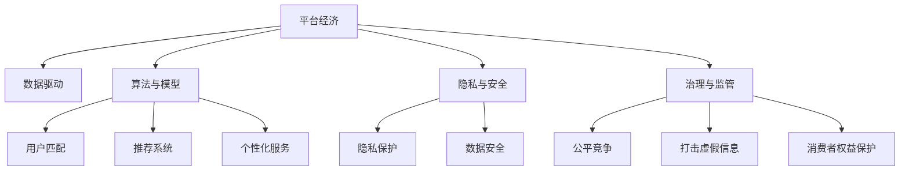

                 

# 数据驱动平台经济发展路径：如何探索发展路径？

## 1. 背景介绍

在数字化转型浪潮的驱动下，平台经济模式成为驱动经济增长的新引擎。平台型企业通过汇集海量用户和数据，利用算法和模型进行精准匹配和推荐，极大提升了资源配置效率和用户体验。然而，平台经济也面临数据隐私、安全、治理等诸多挑战，亟需探索可持续发展的路径。本文将从平台经济的数据驱动机制入手，深入剖析其运作原理，提出基于数据驱动的平台经济可持续发展路径。

## 2. 核心概念与联系

### 2.1 核心概念概述

为更好地理解数据驱动平台经济，本节将介绍几个关键概念：

- **平台经济**：指通过互联网技术，连接买家和卖家、需求和供给，实现高效匹配与协作的经济模式。平台型企业如电子商务、社交媒体、在线教育等，通过聚集用户和商家，提供多样化服务，实现了商业模式的创新和颠覆。

- **数据驱动**：指以数据为基础，通过分析挖掘数据，获取洞察和知识，优化决策和运营，驱动业务增长和创新。数据驱动是平台经济的核心特征，也是其区别于传统经济的重要标志。

- **算法与模型**：算法和模型是数据驱动平台经济的重要工具。通过训练算法和优化模型，平台企业能够实现高效的用户匹配、精准的推荐和个性化的服务，从而提升平台粘性和用户满意度。

- **隐私与安全**：数据隐私和安全是平台经济面临的重要挑战。如何平衡用户隐私保护与数据利用，如何应对数据泄露和滥用风险，是平台经济可持续发展不可或缺的一环。

- **治理与监管**：平台经济的快速发展带来了复杂的治理问题。平台如何实现公平竞争、打击虚假信息、保护消费者权益，如何与政府监管机构合作，都是平台经济治理的重要议题。

这些概念之间相互联系、相互影响，共同构成了数据驱动平台经济的全貌。

### 2.2 核心概念原理和架构的 Mermaid 流程图



这个流程图展示了数据驱动平台经济的基本架构：

1. **平台经济**：作为整个架构的起点，连接了买家和卖家、需求和供给。
2. **数据驱动**：通过收集、分析和应用数据，驱动平台经济的高效运转。
3. **算法与模型**：利用算法和模型进行用户匹配、推荐和个性化服务。
4. **隐私与安全**：在数据驱动过程中，隐私保护和数据安全是不可忽视的问题。
5. **治理与监管**：平台经济的健康发展离不开公平竞争、信息真实性保护和消费者权益保护等治理措施。

## 3. 核心算法原理 & 具体操作步骤

### 3.1 算法原理概述

数据驱动平台经济的运作主要依赖于以下核心算法与模型：

- **协同过滤**：通过分析用户行为数据，推荐相似用户的商品或服务，实现个性化推荐。
- **内容推荐**：根据用户的历史行为和偏好，推荐相关的文章、视频、商品等。
- **机器学习与深度学习**：利用历史数据训练机器学习模型，实现精准预测和优化决策。
- **自然语言处理**：利用自然语言处理技术，分析用户评论、反馈，提升用户满意度和平台质量。

### 3.2 算法步骤详解

数据驱动平台经济的核心算法步骤包括：

1. **数据收集与处理**：收集用户行为数据、商品信息、交易数据等，进行数据清洗和预处理。
2. **特征工程**：提取有意义的特征，如用户ID、商品类别、浏览历史等。
3. **模型训练**：利用历史数据训练协同过滤、内容推荐等算法模型。
4. **预测与优化**：通过模型预测用户需求，优化匹配策略，提升推荐精度和用户体验。
5. **效果评估与反馈**：评估模型效果，根据用户反馈和业务目标，迭代优化模型和算法。

### 3.3 算法优缺点

数据驱动平台经济的核心算法具有以下优点：

- **个性化推荐**：能够提供精准、个性化的服务，提升用户粘性和满意度。
- **高效匹配**：通过算法匹配，实现高效资源配置，优化用户体验。
- **数据分析**：通过对数据的深度分析，获取商业洞察，驱动业务创新和增长。

同时，这些算法也存在一些缺点：

- **数据隐私**：在数据驱动过程中，用户隐私可能受到威胁。
- **算法偏差**：算法模型可能存在偏见，导致不公平、歧视性的结果。
- **模型复杂度**：复杂算法模型可能需要较大的计算资源和存储空间，成本较高。
- **动态变化**：用户需求和市场环境不断变化，模型需要频繁更新，维护成本较高。

### 3.4 算法应用领域

数据驱动平台经济的应用领域非常广泛，包括但不限于以下几个方面：

- **电子商务**：通过用户行为数据，推荐商品，优化购物体验。
- **社交媒体**：分析用户兴趣和行为，推送个性化内容，增强平台粘性。
- **在线教育**：推荐课程和学习资源，个性化学习路径，提升学习效果。
- **金融服务**：利用用户交易数据，风险评估和推荐，提升金融服务质量。
- **医疗健康**：分析患者病历数据，推荐治疗方案，提升诊疗效果。
- **智能交通**：通过用户出行数据，优化路线和调度，提升出行效率。

## 4. 数学模型和公式 & 详细讲解 & 举例说明

### 4.1 数学模型构建

数据驱动平台经济的核心模型通常包括协同过滤模型、内容推荐模型和深度学习模型。以下是几个典型模型的构建：

- **协同过滤模型**：
  $$
  p_{ui} = \frac{\sum_{j=1}^N a_{u,i} \times a_{j,i} \times r_{uj}}{\sqrt{\sum_{j=1}^N a_{u,i}^2 \times a_{j,i}^2}}
  $$
  其中，$p_{ui}$为模型预测用户$u$对物品$i$的评分，$a_{u,i}$和$a_{j,i}$为用户和物品的隐向量表示，$r_{uj}$为真实评分。

- **内容推荐模型**：
  $$
  \text{Recommender} = \max_{c} \text{Relevance}(c) - \lambda \times \text{Sparsity}(c)
  $$
  其中，$\text{Relevance}(c)$为用户对内容的满意度，$\lambda$为正则化系数，$\text{Sparsity}(c)$为内容的稀疏度。

- **深度学习模型**：
  $$
  y = \sigma(\mathbf{W}x + b)
  $$
  其中，$y$为模型预测输出，$\mathbf{W}$为权重矩阵，$b$为偏置项，$\sigma$为激活函数。

### 4.2 公式推导过程

- **协同过滤模型**：
  该模型通过用户-物品交互矩阵进行隐向量的协同计算，得出用户对物品的评分预测值。协同过滤算法的主要步骤包括：
  1. 矩阵分解：将用户-物品交互矩阵分解为用户隐向量矩阵和物品隐向量矩阵。
  2. 计算预测评分：通过用户和物品的隐向量计算预测评分。
  3. 更新隐向量：通过最小化预测评分与真实评分之间的误差，更新隐向量参数。

- **内容推荐模型**：
  该模型通过用户对内容的交互，预测用户对未来内容的满意度。推荐系统的主要步骤包括：
  1. 用户特征提取：通过用户历史行为、兴趣等信息，提取用户特征向量。
  2. 内容特征提取：通过内容属性、标签等信息，提取内容特征向量。
  3. 用户与内容相似度计算：计算用户特征向量与内容特征向量的相似度。
  4. 推荐排序：根据相似度对内容进行排序，推荐用户感兴趣的内容。

- **深度学习模型**：
  该模型通过多层神经网络对输入数据进行特征提取和分类。深度学习模型的主要步骤包括：
  1. 数据预处理：对输入数据进行归一化、标准化等预处理。
  2. 多层网络构建：构建包含多个隐藏层的神经网络，通过反向传播算法更新权重。
  3. 模型训练与优化：通过梯度下降等优化算法，最小化预测误差。
  4. 模型评估与预测：在测试集上评估模型效果，进行预测。

### 4.3 案例分析与讲解

**案例一：电商平台的协同过滤推荐**

电商平台上，用户对商品的评分和点击行为数据，可以作为协同过滤的输入数据。通过构建用户-商品交互矩阵，进行矩阵分解和隐向量计算，可以预测用户对未购买商品的评分和购买概率，从而实现个性化推荐。协同过滤推荐在电商平台中广泛应用于商品推荐、新商品推广等场景。

**案例二：在线教育的深度学习推荐**

在线教育平台通常会有大量课程和视频数据，可以通过深度学习模型进行用户行为预测和课程推荐。用户的历史观看记录、成绩、反馈等信息，可以输入到深度学习模型中，输出用户对未来课程的兴趣度，从而实现个性化推荐。深度学习推荐在在线教育平台中广泛应用于课程推荐、学习路径规划等场景。

## 5. 项目实践：代码实例和详细解释说明

### 5.1 开发环境搭建

在进行数据驱动平台经济项目实践前，我们需要准备好开发环境。以下是使用Python进行PyTorch开发的环境配置流程：

1. 安装Anaconda：从官网下载并安装Anaconda，用于创建独立的Python环境。

2. 创建并激活虚拟环境：
```bash
conda create -n pytorch-env python=3.8 
conda activate pytorch-env
```

3. 安装PyTorch：根据CUDA版本，从官网获取对应的安装命令。例如：
```bash
conda install pytorch torchvision torchaudio cudatoolkit=11.1 -c pytorch -c conda-forge
```

4. 安装Transformers库：
```bash
pip install transformers
```

5. 安装各类工具包：
```bash
pip install numpy pandas scikit-learn matplotlib tqdm jupyter notebook ipython
```

完成上述步骤后，即可在`pytorch-env`环境中开始项目实践。

### 5.2 源代码详细实现

这里我们以电商平台的数据驱动推荐系统为例，给出使用Transformers库进行协同过滤推荐系统的PyTorch代码实现。

首先，定义协同过滤推荐系统的数据处理函数：

```python
from transformers import BertTokenizer
from torch.utils.data import Dataset
import torch

class RecommendationDataset(Dataset):
    def __init__(self, user_item_ratings, user_features, item_features):
        self.user_item_ratings = user_item_ratings
        self.user_features = user_features
        self.item_features = item_features
        self.max_len = 128
        
    def __len__(self):
        return len(self.user_item_ratings)
    
    def __getitem__(self, item):
        user_item_rating = self.user_item_ratings[item]
        user_feature = self.user_features[item]
        item_feature = self.item_features[item]
        
        encoding = self.tokenizer(user_feature, return_tensors='pt', max_length=self.max_len, padding='max_length', truncation=True)
        input_ids = encoding['input_ids'][0]
        attention_mask = encoding['attention_mask'][0]
        
        # 对token-wise的评分进行编码
        encoded_ratings = [rating2id[rating] for rating in user_item_rating] 
        encoded_ratings.extend([rating2id['0']] * (self.max_len - len(encoded_ratings)))
        labels = torch.tensor(encoded_ratings, dtype=torch.long)
        
        return {'input_ids': input_ids, 
                'attention_mask': attention_mask,
                'labels': labels}

# 评分与id的映射
rating2id = {'1': 1, '2': 2, '3': 3, '4': 4, '5': 5}
id2rating = {v: k for k, v in rating2id.items()}

# 创建dataset
tokenizer = BertTokenizer.from_pretrained('bert-base-cased')

train_dataset = RecommendationDataset(train_user_item_ratings, train_user_features, train_item_features)
dev_dataset = RecommendationDataset(dev_user_item_ratings, dev_user_features, dev_item_features)
test_dataset = RecommendationDataset(test_user_item_ratings, test_user_features, test_item_features)
```

然后，定义模型和优化器：

```python
from transformers import BertForTokenClassification, AdamW

model = BertForTokenClassification.from_pretrained('bert-base-cased', num_labels=len(rating2id))

optimizer = AdamW(model.parameters(), lr=2e-5)
```

接着，定义训练和评估函数：

```python
from torch.utils.data import DataLoader
from tqdm import tqdm
from sklearn.metrics import classification_report

device = torch.device('cuda') if torch.cuda.is_available() else torch.device('cpu')
model.to(device)

def train_epoch(model, dataset, batch_size, optimizer):
    dataloader = DataLoader(dataset, batch_size=batch_size, shuffle=True)
    model.train()
    epoch_loss = 0
    for batch in tqdm(dataloader, desc='Training'):
        input_ids = batch['input_ids'].to(device)
        attention_mask = batch['attention_mask'].to(device)
        labels = batch['labels'].to(device)
        model.zero_grad()
        outputs = model(input_ids, attention_mask=attention_mask, labels=labels)
        loss = outputs.loss
        epoch_loss += loss.item()
        loss.backward()
        optimizer.step()
    return epoch_loss / len(dataloader)

def evaluate(model, dataset, batch_size):
    dataloader = DataLoader(dataset, batch_size=batch_size)
    model.eval()
    preds, labels = [], []
    with torch.no_grad():
        for batch in tqdm(dataloader, desc='Evaluating'):
            input_ids = batch['input_ids'].to(device)
            attention_mask = batch['attention_mask'].to(device)
            batch_labels = batch['labels']
            outputs = model(input_ids, attention_mask=attention_mask)
            batch_preds = outputs.logits.argmax(dim=2).to('cpu').tolist()
            batch_labels = batch_labels.to('cpu').tolist()
            for pred_tokens, label_tokens in zip(batch_preds, batch_labels):
                pred_ratings = [id2rating[_id] for _id in pred_tokens]
                label_ratings = [id2rating[_id] for _id in label_tokens]
                preds.append(pred_ratings[:len(label_ratings)])
                labels.append(label_ratings)
                
    print(classification_report(labels, preds))
```

最后，启动训练流程并在测试集上评估：

```python
epochs = 5
batch_size = 16

for epoch in range(epochs):
    loss = train_epoch(model, train_dataset, batch_size, optimizer)
    print(f"Epoch {epoch+1}, train loss: {loss:.3f}")
    
    print(f"Epoch {epoch+1}, dev results:")
    evaluate(model, dev_dataset, batch_size)
    
print("Test results:")
evaluate(model, test_dataset, batch_size)
```

以上就是使用PyTorch对电商平台数据驱动推荐系统进行协同过滤推荐实践的完整代码实现。可以看到，得益于Transformers库的强大封装，我们可以用相对简洁的代码完成推荐系统的开发。

### 5.3 代码解读与分析

让我们再详细解读一下关键代码的实现细节：

**RecommendationDataset类**：
- `__init__`方法：初始化用户-物品评分数据、用户特征数据、物品特征数据等关键组件。
- `__len__`方法：返回数据集的样本数量。
- `__getitem__`方法：对单个样本进行处理，将用户特征输入编码为token ids，将评分编码为数字，并对其进行定长padding，最终返回模型所需的输入。

**rating2id和id2rating字典**：
- 定义了评分与数字id之间的映射关系，用于将token-wise的评分解码回真实的评分。

**训练和评估函数**：
- 使用PyTorch的DataLoader对数据集进行批次化加载，供模型训练和推理使用。
- 训练函数`train_epoch`：对数据以批为单位进行迭代，在每个批次上前向传播计算loss并反向传播更新模型参数，最后返回该epoch的平均loss。
- 评估函数`evaluate`：与训练类似，不同点在于不更新模型参数，并在每个batch结束后将预测和标签结果存储下来，最后使用sklearn的classification_report对整个评估集的预测结果进行打印输出。

**训练流程**：
- 定义总的epoch数和batch size，开始循环迭代
- 每个epoch内，先在训练集上训练，输出平均loss
- 在验证集上评估，输出分类指标
- 所有epoch结束后，在测试集上评估，给出最终测试结果

可以看到，PyTorch配合Transformers库使得协同过滤推荐系统的代码实现变得简洁高效。开发者可以将更多精力放在数据处理、模型改进等高层逻辑上，而不必过多关注底层的实现细节。

当然，工业级的系统实现还需考虑更多因素，如模型的保存和部署、超参数的自动搜索、更灵活的任务适配层等。但核心的协同过滤推荐范式基本与此类似。

## 6. 实际应用场景

### 6.1 智能客服系统

智能客服系统是数据驱动平台经济的重要应用场景之一。通过用户与客服的交互数据，智能客服系统可以提供个性化的服务，提升客户满意度。

在技术实现上，可以收集企业内部的历史客服对话记录，将问题和最佳答复构建成监督数据，在此基础上对预训练语言模型进行微调。微调后的语言模型能够自动理解用户意图，匹配最合适的答复。对于客户提出的新问题，还可以接入检索系统实时搜索相关内容，动态组织生成回答。如此构建的智能客服系统，能大幅提升客户咨询体验和问题解决效率。

### 6.2 金融舆情监测

金融机构需要实时监测市场舆论动向，以便及时应对负面信息传播，规避金融风险。传统的人工监测方式成本高、效率低，难以应对网络时代海量信息爆发的挑战。数据驱动的金融舆情监测技术，能够通过实时抓取的网络文本数据，自动监测不同主题下的情感变化趋势，一旦发现负面信息激增等异常情况，系统便会自动预警，帮助金融机构快速应对潜在风险。

### 6.3 个性化推荐系统

当前的推荐系统往往只依赖用户的历史行为数据进行物品推荐，无法深入理解用户的真实兴趣偏好。数据驱动的个性化推荐系统，可以更好地挖掘用户行为背后的语义信息，从而提供更精准、多样的推荐内容。

在实践中，可以收集用户浏览、点击、评论、分享等行为数据，提取和用户交互的物品标题、描述、标签等文本内容。将文本内容作为模型输入，用户的后续行为（如是否点击、购买等）作为监督信号，在此基础上微调预训练语言模型。微调后的模型能够从文本内容中准确把握用户的兴趣点。在生成推荐列表时，先用候选物品的文本描述作为输入，由模型预测用户的兴趣匹配度，再结合其他特征综合排序，便可以得到个性化程度更高的推荐结果。

### 6.4 未来应用展望

随着数据驱动平台经济的不断发展，基于数据的平台应用将覆盖更多领域，带来更广泛的商业价值。

在智慧医疗领域，数据驱动的平台应用可以实时监测患者健康数据，及时预警病情变化，提供个性化的诊疗方案，提升医疗服务的质量和效率。

在智能制造领域，数据驱动的平台应用可以实现生产线的实时监控和优化，通过分析生产数据，优化生产流程，提升生产效率和产品质量。

在智慧城市治理中，数据驱动的平台应用可以实时监测城市环境数据，优化交通管理，提升公共服务水平，构建更安全、高效的未来城市。

此外，在智慧教育、智能交通、智慧农业等众多领域，数据驱动的平台应用也将不断涌现，为各行各业带来新的发展机遇。相信随着数据量的不断积累和技术水平的持续提升，数据驱动平台经济将在更广阔的应用领域发挥越来越重要的作用。

## 7. 工具和资源推荐

### 7.1 学习资源推荐

为了帮助开发者系统掌握数据驱动平台经济的核心技术和实践方法，这里推荐一些优质的学习资源：

1. **《深度学习与大数据技术》**：系统介绍深度学习和大数据技术的原理与实践，适合初学者全面了解数据驱动平台经济的基础知识。
2. **《自然语言处理综论》**：详细讲解自然语言处理技术，涵盖机器翻译、情感分析、文本分类等多个领域，是学习数据驱动平台经济的重要参考资料。
3. **CS229《机器学习》**：斯坦福大学开设的机器学习课程，深入讲解机器学习算法的原理与应用，适合进阶学习。
4. **Kaggle平台**：Kaggle是一个数据科学竞赛平台，提供海量数据集和经典竞赛任务，是数据驱动平台经济实践的最佳场所。
5. **TensorFlow官方文档**：TensorFlow是Google开源的深度学习框架，提供了丰富的API和文档，适合开发者深入学习数据驱动平台经济的实现技术。

通过对这些资源的学习实践，相信你一定能够快速掌握数据驱动平台经济的核心技术和方法，并将其应用于实际项目中。

### 7.2 开发工具推荐

高效的开发离不开优秀的工具支持。以下是几款用于数据驱动平台经济开发的常用工具：

1. **Jupyter Notebook**：Jupyter Notebook是一个交互式的开发环境，支持Python等多种编程语言，适合快速迭代研究。
2. **PyTorch**：基于Python的开源深度学习框架，灵活的计算图，适合快速迭代研究。
3. **TensorFlow**：由Google主导开发的开源深度学习框架，生产部署方便，适合大规模工程应用。
4. **H2O.ai**：提供分布式机器学习平台，适合处理大规模数据，支持多种机器学习算法和模型。
5. **Amazon SageMaker**：AWS提供的云端机器学习平台，支持自动化模型训练和部署，适合工业级应用。

合理利用这些工具，可以显著提升数据驱动平台经济的开发效率，加速创新迭代的步伐。

### 7.3 相关论文推荐

数据驱动平台经济的发展离不开学界的持续研究。以下是几篇奠基性的相关论文，推荐阅读：

1. **《机器学习实战》**：提供了数据驱动平台经济项目实践的完整指南，涵盖数据收集、处理、建模、评估等各个环节。
2. **《深度学习》**：深度学习领域的经典教材，详细讲解了深度学习算法的原理与实现方法，适合深入学习。
3. **《智能客服：人工智能在客户服务中的应用》**：探讨了智能客服系统的技术实现与未来发展趋势，是数据驱动平台经济的重要参考。
4. **《大数据时代》**：大数据领域的经典之作，阐述了大数据技术的应用场景与未来前景，适合全面了解数据驱动平台经济的基础知识。

这些论文代表了大数据驱动平台经济的研究方向，通过学习这些前沿成果，可以帮助研究者把握学科前进方向，激发更多的创新灵感。

## 8. 总结：未来发展趋势与挑战

### 8.1 总结

本文对数据驱动平台经济的发展路径进行了全面系统的介绍。首先从平台经济的数据驱动机制入手，深入剖析其运作原理，提出基于数据驱动的平台经济可持续发展路径。其次，通过核心算法与模型的详细讲解，展示了数据驱动平台经济的实践方法。最后，通过实际应用场景的展示，展示了数据驱动平台经济在多个领域的应用前景。

通过本文的系统梳理，可以看到，数据驱动平台经济正迅速成为驱动经济增长的新引擎，平台企业通过高效匹配与协作，提升了资源配置效率和用户体验。数据驱动平台经济的发展，将带来更广泛的商业价值，促进各行各业的数字化转型升级。

### 8.2 未来发展趋势

展望未来，数据驱动平台经济将呈现以下几个发展趋势：

1. **数据量持续增长**：随着物联网、5G等技术的普及，数据采集和传输能力将大幅提升，数据量将持续增长。大数据的广泛应用，将进一步推动平台经济的创新和增长。

2. **算法模型优化**：通过深度学习、强化学习等技术，不断优化算法模型，提升推荐精度和个性化程度，实现更高效、更精准的资源匹配。

3. **智能决策系统**：通过数据分析和机器学习，构建智能决策系统，实现自动化的业务优化和流程管理，提升平台运营效率。

4. **多模态数据融合**：将文本、图像、视频等多模态数据融合，构建多模态推荐系统，提升用户满意度和平台粘性。

5. **隐私与安全保护**：随着数据驱动平台经济的快速发展，用户隐私和数据安全问题将愈发重要。如何平衡数据利用与隐私保护，是平台经济可持续发展的重要课题。

6. **公平与透明**：在数据驱动平台经济中，算法模型的公平性、透明性成为重要议题。如何建立公平、透明的算法模型，减少偏见和歧视，提升用户信任度，是平台企业的重要责任。

以上趋势凸显了数据驱动平台经济的广阔前景。这些方向的探索发展，必将进一步提升平台经济的性能和应用范围，为人类生产生活方式带来深刻影响。

### 8.3 面临的挑战

尽管数据驱动平台经济已经取得了显著成就，但在迈向更加智能化、普适化应用的过程中，它仍面临诸多挑战：

1. **数据隐私保护**：在数据驱动平台经济中，用户隐私可能受到威胁，如何平衡数据利用与隐私保护，是平台经济可持续发展的重要课题。
2. **算法模型偏见**：算法模型可能存在偏见，导致不公平、歧视性的结果，如何建立公平、透明的算法模型，减少偏见和歧视，提升用户信任度，是平台企业的重要责任。
3. **模型复杂度**：复杂算法模型可能需要较大的计算资源和存储空间，成本较高，如何简化模型结构，提高计算效率，是平台经济可持续发展的重要课题。
4. **动态变化**：用户需求和市场环境不断变化，模型需要频繁更新，维护成本较高，如何构建灵活、可持续的模型更新机制，是平台经济可持续发展的重要课题。
5. **数据治理**：数据治理问题复杂，如何建立数据治理标准，保护用户数据权益，是平台经济可持续发展的重要课题。

正视数据驱动平台经济面临的这些挑战，积极应对并寻求突破，将是大数据驱动平台经济走向成熟的必由之路。相信随着学界和产业界的共同努力，这些挑战终将一一被克服，数据驱动平台经济必将在构建人机协同的智能时代中扮演越来越重要的角色。

### 8.4 研究展望

面向未来，数据驱动平台经济的研究需要在以下几个方面寻求新的突破：

1. **数据隐私保护**：开发更加高效、安全的数据隐私保护技术，如差分隐私、联邦学习等，在保护用户隐私的同时，实现数据的有效利用。
2. **公平与透明算法**：研究公平、透明的算法模型，减少偏见和歧视，提升用户信任度。
3. **模型简化**：开发更加简洁、高效的模型结构，如压缩算法、模型压缩等，降低计算资源和存储成本。
4. **动态更新**：研究动态、灵活的模型更新机制，实现模型的持续优化和改进。
5. **数据治理**：建立数据治理标准，保护用户数据权益，确保数据驱动平台经济的健康发展。

这些研究方向的研究进展，将有助于数据驱动平台经济的可持续发展，推动人工智能技术在垂直行业的规模化落地。只有勇于创新、敢于突破，才能不断拓展数据驱动平台经济的边界，让数据驱动的智能技术更好地造福人类社会。

## 9. 附录：常见问题与解答

**Q1：数据驱动平台经济的核心是什么？**

A: 数据驱动平台经济的核心在于数据的采集、分析和应用，通过数据获取洞察和知识，优化决策和运营，驱动业务增长和创新。平台企业通过高效匹配与协作，提升了资源配置效率和用户体验。

**Q2：数据驱动平台经济有哪些关键算法和模型？**

A: 数据驱动平台经济的关键算法和模型包括协同过滤、内容推荐、深度学习等。协同过滤算法通过用户-物品交互矩阵，预测用户对物品的评分；内容推荐算法通过用户特征和内容特征，预测用户对内容的满意度；深度学习模型通过多层神经网络，实现个性化推荐和决策优化。

**Q3：数据驱动平台经济面临哪些挑战？**

A: 数据驱动平台经济面临的主要挑战包括数据隐私保护、算法模型偏见、模型复杂度、动态变化、数据治理等。如何平衡数据利用与隐私保护，减少算法偏见，降低计算资源和存储成本，构建灵活、可持续的模型更新机制，是平台经济可持续发展的重要课题。

**Q4：如何构建数据驱动平台经济？**

A: 构建数据驱动平台经济需要从数据采集、数据存储、数据分析、模型训练等多个环节进行全面优化。具体步骤包括：
1. 数据采集：通过传感器、用户行为数据等手段，收集海量数据。
2. 数据存储：利用云存储、分布式数据库等技术，高效存储和管理数据。
3. 数据分析：通过机器学习、深度学习等技术，从数据中提取有价值的信息和知识。
4. 模型训练：利用历史数据训练算法模型，实现个性化推荐和决策优化。
5. 数据治理：建立数据治理标准，保护用户数据权益，确保数据驱动平台经济的健康发展。

**Q5：数据驱动平台经济的应用场景有哪些？**

A: 数据驱动平台经济的应用场景非常广泛，包括但不限于以下几个方面：
1. 电商推荐系统：通过用户行为数据，推荐商品，优化购物体验。
2. 智能客服系统：通过用户与客服的交互数据，提供个性化的服务，提升客户满意度。
3. 金融舆情监测：实时监测市场舆论动向，及时预警风险。
4. 在线教育：通过用户行为数据，推荐课程和学习资源，个性化学习路径。
5. 智慧医疗：实时监测患者健康数据，提供个性化的诊疗方案。
6. 智慧城市：实时监测城市环境数据，优化交通管理，提升公共服务水平。

**Q6：数据驱动平台经济的未来展望是什么？**

A: 数据驱动平台经济的未来展望在于其与人工智能、物联网、5G等技术的深度融合，带来更广泛的商业价值。未来，平台经济将在智慧医疗、智能制造、智慧城市等领域大放异彩，推动各行各业的数字化转型升级。

通过本文的系统梳理，可以看到，数据驱动平台经济正迅速成为驱动经济增长的新引擎，平台企业通过高效匹配与协作，提升了资源配置效率和用户体验。数据驱动平台经济的发展，将带来更广泛的商业价值，促进各行各业的数字化转型升级。相信随着数据量的不断积累和技术水平的持续提升，数据驱动平台经济将在更广阔的应用领域发挥越来越重要的作用。

---

作者：禅与计算机程序设计艺术 / Zen and the Art of Computer Programming

