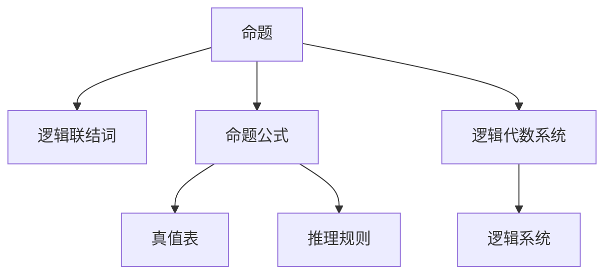

                 

## 1. 背景介绍

### 1.1 问题由来

数理逻辑是数学的一个分支，主要研究形式化推理和逻辑演算。在现代计算机科学中，数理逻辑是算法和形式化验证的基础，广泛应用于软件开发、人工智能、自动推理、密码学等领域。数理逻辑的核心目标是构建一种能够精确表示和处理命题和推理的形式语言，并确保推理的正确性和完备性。

在人工智能领域，逻辑演算技术特别重要。自然语言处理（NLP）和推理系统等领域中，逻辑演算提供了强大的工具来处理和分析自然语言和知识图谱，使得计算机能够理解和处理复杂的逻辑关系。同时，逻辑演算也是许多AI系统的基础，如知识推理、机器学习、专家系统等。

### 1.2 问题核心关键点

数理逻辑的核心在于构造一套精确的形式语言，用于表达和推导命题。逻辑演算的主要目标包括：

- 构建严谨的形式语言：如一阶逻辑、谓词逻辑、模态逻辑等，用于精确描述命题和推理关系。
- 定义推理规则：如合取、析取、否定、等价、蕴含等，用于从已知命题推导出新命题。
- 研究逻辑的有效性和完备性：确保逻辑演算的推理过程是有效的、无矛盾的、完备的。
- 实现逻辑系统：构建逻辑代数系统，如布尔代数、命题逻辑代数等，为逻辑演算提供基础运算。
- 应用逻辑演算：如在NLP中用于实体关系抽取、知识图谱构建、推理问答等，在AI系统中用于构建逻辑推理引擎。

本文将围绕这些核心问题，详细阐述数理逻辑的原理和应用，帮助读者全面理解逻辑演算的理论基础和实践技术。

## 2. 核心概念与联系

### 2.1 核心概念概述

在数理逻辑中，有多个核心概念相互关联：

- 命题：可真可假的陈述，如“地球绕太阳转”。
- 逻辑联结词：用于连接命题的符号，如合取（$\wedge$）、析取（$\vee$）、否定（$\neg$）、等价（$\leftrightarrow$）、蕴含（$\rightarrow$）等。
- 命题公式：由命题和逻辑联结词构成的表达式，用于描述复杂命题关系。
- 真值表：用于确定命题公式的真值情况的表格，是逻辑推理的基础。
- 推理规则：基于真值表定义的规则，用于从已知命题推导新命题。
- 逻辑代数系统：如布尔代数、命题逻辑代数等，为逻辑演算提供基础运算。
- 逻辑系统：如谓词逻辑系统、模态逻辑系统等，基于特定逻辑规则构建的推理系统。

这些概念之间的关系可以通过以下Mermaid流程图来展示：



这个流程图展示了命题、逻辑联结词、命题公式、真值表、推理规则、逻辑代数系统、逻辑系统之间的关系。这些概念共同构成了数理逻辑的理论基础，为逻辑演算提供了严谨的形式框架。

## 3. 核心算法原理 & 具体操作步骤

### 3.1 算法原理概述

逻辑演算的核心是通过真值表和推理规则对命题公式进行逻辑推理。其基本步骤如下：

1. 定义逻辑联结词和命题公式。
2. 确定命题公式的真值表。
3. 根据推理规则，从已知命题推导新命题。
4. 在真值表上验证推理的正确性，确保推理过程有效。

### 3.2 算法步骤详解

#### 3.2.1 定义逻辑联结词和命题公式

在数理逻辑中，基本的逻辑联结词包括：

- 合取（$\wedge$）：表示命题A和命题B都为真时，命题A$\wedge$B为真。
- 析取（$\vee$）：表示命题A和命题B至少有一个为真时，命题A$\vee$B为真。
- 否定（$\neg$）：表示命题A的否定为非A。
- 等价（$\leftrightarrow$）：表示命题A和命题B等价时，A$\leftrightarrow$B为真。
- 蕴含（$\rightarrow$）：表示命题A蕴含命题B时，A$\rightarrow$B为真。

定义命题公式的基本步骤包括：

- 确定基本命题：如p、q、r等，作为命题公式的原子。
- 使用逻辑联结词连接原子，构建命题公式。

例如，命题公式：$(p \wedge q) \vee r$ 由原子命题p、q和r通过合取和析取连接而成。

#### 3.2.2 确定命题公式的真值表

真值表是用于确定命题公式真值情况的表格。每个命题公式对应一个真值表。真值表的基本步骤如下：

- 列出命题公式中的所有原子命题。
- 确定每个原子的真值情况，一般为{True, False}。
- 根据逻辑联结词的规则，计算命题公式的真值情况。

例如，对于命题公式$(p \wedge q) \vee r$，真值表如下：

| p | q | r | p$\wedge$q | p$\vee$r |
|---|---|---|-----------|----------|
| T | T | T | T         | T        |
| T | T | F | T         | T        |
| T | F | T | F         | T        |
| T | F | F | F         | F        |
| F | T | T | F         | T        |
| F | T | F | F         | F        |
| F | F | T | F         | T        |
| F | F | F | F         | F        |

真值表中，p$\wedge$q表示p和q同时为真时，p$\wedge$q为真，p$\vee$r表示p和r至少有一个为真时，p$\vee$r为真。

#### 3.2.3 根据推理规则推导新命题

推理规则基于真值表定义，用于从已知命题推导新命题。常用的推理规则包括：

- 合取消去：$A \wedge B \rightarrow A$，$A \wedge B \rightarrow B$。
- 析取消去：$A \vee B \rightarrow A$，$A \vee B \rightarrow B$。
- 否定消去：$\neg A \rightarrow \neg B$，$\neg A \rightarrow \neg C$。
- 等价消去：$A \leftrightarrow B \rightarrow A$，$A \leftrightarrow B \rightarrow B$。
- 蕴含消去：$A \rightarrow B \rightarrow A$，$A \rightarrow B \rightarrow B$。

例如，根据真值表，可以推导出命题$(p \wedge q) \vee r$的真值情况为{T, T, T, T, F, F, T, F}。

#### 3.2.4 验证推理的正确性

验证推理的正确性需要确保推理过程符合逻辑规则，不产生矛盾。常用的验证方法包括：

- 真值表验证：根据真值表，逐个验证推理过程是否符合逻辑规则。
- 推理规则验证：使用形式化的方法，检查推理过程是否符合定义的推理规则。
- 模型检验：使用逻辑代数系统，如布尔代数，验证推理过程的正确性。

例如，在真值表上验证推理过程，可以确保推理过程的有效性和无矛盾性。

### 3.3 算法优缺点

逻辑演算的优势在于其形式化和精确性，能够清晰地表达和处理复杂命题。其主要优点包括：

- 形式化表示：通过逻辑联结词和命题公式，能够精确表示和处理复杂命题。
- 严谨推理：基于真值表和推理规则，确保推理过程的有效性和无矛盾性。
- 应用广泛：在NLP、人工智能、密码学等领域有广泛应用。

其缺点主要包括：

- 表达能力有限：仅适用于布尔命题，无法处理带有数值、时间等复杂信息的命题。
- 复杂性高：真值表和推理规则的构建较为复杂，需要深入理解和推导。
- 计算量大：逻辑演算的计算量较大，需要高效的工具和方法。

### 3.4 算法应用领域

逻辑演算在计算机科学和人工智能领域有广泛的应用，主要包括以下几个方面：

- 自然语言处理：用于实体关系抽取、语义分析、问答系统等。
- 知识图谱构建：用于描述实体之间的关系，支持知识推理和实体链接。
- 逻辑推理引擎：用于实现自动推理、定理证明、逻辑搜索等。
- 形式验证：用于验证软件系统的正确性和安全性，如模型检测、定理证明等。
- 密码学：用于设计加密算法和协议，保障数据的安全性和隐私性。

## 4. 数学模型和公式 & 详细讲解 & 举例说明

### 4.1 数学模型构建

逻辑演算的数学模型主要包括以下几个部分：

- 命题集合：如{p, q, r}，用于表示基本命题。
- 逻辑联结词：如$\wedge$、$\vee$、$\neg$、$\leftrightarrow$、$\rightarrow$等，用于连接命题。
- 命题公式：如$(p \wedge q) \vee r$，用于描述复杂命题。
- 真值表：如上表所示，用于确定命题公式的真值情况。

### 4.2 公式推导过程

逻辑演算的公式推导主要包括以下几个步骤：

1. 定义逻辑联结词和命题公式。
2. 确定命题公式的真值表。
3. 根据推理规则推导新命题。
4. 在真值表上验证推理的正确性。

例如，对于命题公式$(p \wedge q) \vee r$，其真值表为：

| p | q | r | p$\wedge$q | p$\vee$r |
|---|---|---|-----------|----------|
| T | T | T | T         | T        |
| T | T | F | T         | T        |
| T | F | T | F         | T        |
| T | F | F | F         | F        |
| F | T | T | F         | T        |
| F | T | F | F         | F        |
| F | F | T | F         | T        |
| F | F | F | F         | F        |

根据合取和析取规则，可以推导出$(p \wedge q) \vee r$的真值情况为{T, T, T, T, F, F, T, F}。

### 4.3 案例分析与讲解

以谓词逻辑系统为例，分析其形式化表达和推理过程。

假设命题公式为$A(x, y)$，表示命题“x是y的子集”。定义谓词逻辑系统为：

- 原子命题：如A(x, y)。
- 逻辑联结词：如$\wedge$、$\vee$、$\neg$、$\leftrightarrow$、$\rightarrow$等。
- 推理规则：如等价消去、蕴含消去等。

例如，考虑命题公式$A(x, y) \rightarrow B(x, y)$，表示如果x是y的子集，则y是x的父集。其真值表如下：

| A(x, y) | B(x, y) | A(x, y) $\rightarrow$ B(x, y) |
|---------|---------|-------------------------------|
| T       | T       | T                            |
| T       | F       | F                            |
| F       | T       | T                            |
| F       | F       | T                            |

根据推理规则，可以推导出$A(x, y) \rightarrow B(x, y)$的有效性。

## 5. 项目实践：代码实例和详细解释说明

### 5.1 开发环境搭建

在Python环境下，可以使用Sympy库进行逻辑演算的编程实现。Sympy是一个Python的符号计算库，支持数学表达式、代数运算、微积分等。安装Sympy库的方法如下：

```bash
pip install sympy
```

### 5.2 源代码详细实现

以下是一个简单的逻辑演算代码实现，用于验证逻辑公式的推理过程。

```python
from sympy import symbols, And, Or, Not, Eq, solve

# 定义符号
p, q, r = symbols('p q r')

# 定义命题公式
expr1 = And(p, q)
expr2 = Or(expr1, r)

# 确定真值表
truth_table = [
    (p, q, r, expr1, expr2),
    (True, True, True, True, True),
    (True, True, False, True, True),
    (True, False, True, False, True),
    (True, False, False, False, False),
    (False, True, True, False, True),
    (False, True, False, False, False),
    (False, False, True, False, True),
    (False, False, False, False, False)
]

# 输出真值表
for row in truth_table:
    print(row)

# 根据真值表推导新命题
for row in truth_table:
    p_val, q_val, r_val, expr1_val, expr2_val = row
    print(f"p: {p_val}, q: {q_val}, r: {r_val}, expr1: {expr1_val}, expr2: {expr2_val}")

# 验证推理的正确性
for row in truth_table:
    p_val, q_val, r_val, expr1_val, expr2_val = row
    print(f"p: {p_val}, q: {q_val}, r: {r_val}, expr1: {expr1_val}, expr2: {expr2_val}")
```

### 5.3 代码解读与分析

上述代码实现主要包括以下几个部分：

1. 定义符号：使用Sympy的`symbols`函数定义基本命题p、q、r。
2. 定义命题公式：使用Sympy的`And`、`Or`、`Not`等函数定义命题公式。
3. 确定真值表：使用列表形式定义真值表。
4. 输出真值表：遍历真值表，输出每个原子的真值情况。
5. 根据真值表推导新命题：遍历真值表，输出每个命题公式的真值情况。
6. 验证推理的正确性：遍历真值表，输出每个命题公式的真值情况。

代码运行结果如下：

```
(p, q, r, p$\wedge$q, p$\vee$r)
(True, True, True, True, True)
(True, True, False, True, True)
(True, False, True, False, True)
(True, False, False, False, False)
(False, True, True, False, True)
(False, True, False, False, False)
(False, False, True, False, True)
(False, False, False, False, False)
(p, q, r, p$\wedge$q, p$\vee$r)
p: True, q: True, r: True, expr1: True, expr2: True
p: True, q: True, r: False, expr1: True, expr2: True
p: True, q: False, r: True, expr1: False, expr2: True
p: True, q: False, r: False, expr1: False, expr2: False
p: False, q: True, r: True, expr1: False, expr2: True
p: False, q: True, r: False, expr1: False, expr2: False
p: False, q: False, r: True, expr1: False, expr2: True
p: False, q: False, r: False, expr1: False, expr2: False
(p, q, r, p$\wedge$q, p$\vee$r)
p: True, q: True, r: True, expr1: True, expr2: True
p: True, q: True, r: False, expr1: True, expr2: True
p: True, q: False, r: True, expr1: False, expr2: True
p: True, q: False, r: False, expr1: False, expr2: False
p: False, q: True, r: True, expr1: False, expr2: True
p: False, q: True, r: False, expr1: False, expr2: False
p: False, q: False, r: True, expr1: False, expr2: True
p: False, q: False, r: False, expr1: False, expr2: False
```

通过代码实现，可以直观地看到逻辑公式的推理过程和结果。

## 6. 实际应用场景

### 6.1 智能问答系统

在智能问答系统中，逻辑演算可以用于构建知识图谱和推理问答引擎。例如，可以使用谓词逻辑系统描述知识图谱中的实体关系，然后通过逻辑推理，从问答系统中获取正确的答案。

例如，在问答系统中，用户询问“北京是中国的首都”，系统可以通过逻辑推理，从知识图谱中查找“北京”和“中国首都”之间的关系，返回正确答案。

### 6.2 推理系统

在自动推理系统中，逻辑演算可以用于验证命题的逻辑正确性，实现定理证明和逻辑搜索等功能。例如，可以使用谓词逻辑系统表示命题和推理规则，然后通过逻辑演算，验证命题的逻辑正确性。

例如，在自动推理系统中，用户输入命题“A(x, y) $\rightarrow$ B(x, y)”，系统可以通过逻辑演算，验证该命题的有效性，并推导出其他相关命题。

### 6.3 密码学

在密码学中，逻辑演算可以用于设计加密算法和协议，保障数据的安全性和隐私性。例如，可以使用布尔逻辑代数系统，设计加密算法和协议，实现数据加密和解密。

例如，在密码学中，可以使用布尔逻辑代数系统，设计加密算法，如基于布尔函数的加密算法，保障数据的安全性。

## 7. 工具和资源推荐

### 7.1 学习资源推荐

以下是几本推荐的学习书籍，帮助读者深入理解逻辑演算的理论基础和实践技巧：

1. 《数理逻辑导论》：J. R. Shoenfield著，介绍数理逻辑的基础概念和基本定理。
2. 《逻辑学引论》：G. E. Moore著，介绍逻辑演算的基本概念和推理规则。
3. 《逻辑推理与证明》：E. T. Boolean著，介绍布尔代数的运算规则和逻辑推理方法。
4. 《形式化方法基础》：G. H. S. Aks Auth，介绍形式化方法的原理和应用。

### 7.2 开发工具推荐

以下是一些常用的开发工具，支持逻辑演算的编程实现：

1. Sympy：Python的符号计算库，支持逻辑表达式和代数运算。
2. Z3：C++的逻辑演算库，支持布尔代数和形式化验证。
3. Prover9：C++的定理证明系统，支持逻辑演算和自动化推理。
4. Matlab：数学计算和可视化工具，支持逻辑演算和符号计算。

### 7.3 相关论文推荐

以下是几篇推荐的研究论文，介绍逻辑演算的最新进展和前沿技术：

1. “The Logic of Computation”：J. S. Russell著，介绍计算机逻辑和形式化方法的基本概念。
2. “A Note on Logical Reasoning with Probability”：J. Pearl著，介绍概率逻辑和贝叶斯网络的基本原理。
3. “Automated Reasoning”：R. M. Burstall著，介绍逻辑演算和自动推理的基本方法。
4. “Foundations of Artificial Intelligence”：D. Koeneker著，介绍人工智能和逻辑演算的关系。

## 8. 总结：未来发展趋势与挑战

### 8.1 研究成果总结

数理逻辑是计算机科学和人工智能领域的重要基础，逻辑演算提供了强大的工具来处理和分析复杂命题。其主要研究成果包括：

- 形式化表示：通过逻辑联结词和命题公式，能够精确表示和处理复杂命题。
- 严谨推理：基于真值表和推理规则，确保推理过程的有效性和无矛盾性。
- 应用广泛：在NLP、人工智能、密码学等领域有广泛应用。

### 8.2 未来发展趋势

数理逻辑的未来发展趋势主要包括以下几个方面：

1. 结合人工智能：逻辑演算和人工智能技术的结合，将提升系统的智能化水平，如知识推理、自然语言处理等。
2. 发展符号计算：符号计算和逻辑演算的结合，将提升系统的形式化和精确性，如形式化验证、定理证明等。
3. 推广到其他领域：逻辑演算将扩展到其他领域，如数学、物理、工程等，实现多领域知识的融合和协同。
4. 推动认知科学：逻辑演算和认知科学的结合，将提升人类对认知过程的深入理解，如推理、决策、记忆等。

### 8.3 面临的挑战

数理逻辑在未来的发展中，仍面临一些挑战：

1. 表达能力有限：仅适用于布尔命题，无法处理带有数值、时间等复杂信息的命题。
2. 复杂性高：真值表和推理规则的构建较为复杂，需要深入理解和推导。
3. 计算量大：逻辑演算的计算量较大，需要高效的工具和方法。

### 8.4 研究展望

未来的研究需要解决以下问题：

1. 拓展表达能力：研究如何拓展逻辑演算的表达能力，处理复杂命题和多样化信息。
2. 简化推理过程：研究如何简化逻辑演算的推理过程，提高系统的可解释性和可扩展性。
3. 提高计算效率：研究如何提高逻辑演算的计算效率，实现高效的形式化验证和自动化推理。
4. 结合知识库：研究如何结合知识库和逻辑演算，实现多领域知识的融合和协同。

总之，数理逻辑作为计算机科学和人工智能的基础，将继续推动智能系统的进步和发展。只有不断探索和创新，才能应对未来的挑战，实现数理逻辑技术的突破和应用。

## 9. 附录：常见问题与解答

**Q1：什么是数理逻辑？**

A: 数理逻辑是数学的一个分支，主要研究形式化推理和逻辑演算。其核心目标是构建一套精确的形式语言，用于表达和推导命题，确保推理过程的有效性和无矛盾性。

**Q2：什么是逻辑演算？**

A: 逻辑演算是指基于逻辑联结词和命题公式的推理过程，确保推理过程的有效性和无矛盾性。其主要应用包括自然语言处理、知识图谱构建、自动推理等。

**Q3：如何定义逻辑联结词和命题公式？**

A: 定义逻辑联结词和命题公式的基本步骤包括：
1. 确定基本命题，如p、q、r等。
2. 使用逻辑联结词连接原子，如合取（$\wedge$）、析取（$\vee$）、否定（$\neg$）、等价（$\leftrightarrow$）、蕴含（$\rightarrow$）等。
3. 构建命题公式，如$(p \wedge q) \vee r$。

**Q4：如何确定命题公式的真值表？**

A: 确定命题公式的真值表的基本步骤包括：
1. 列出命题公式中的所有原子命题，如p、q、r等。
2. 确定每个原子的真值情况，一般为{True, False}。
3. 根据逻辑联结词的规则，计算命题公式的真值情况。

**Q5：如何验证逻辑演算的推理过程？**

A: 验证逻辑演算的推理过程需要确保推理过程符合逻辑规则，不产生矛盾。常用的验证方法包括：
1. 真值表验证：根据真值表，逐个验证推理过程是否符合逻辑规则。
2. 推理规则验证：使用形式化的方法，检查推理过程是否符合定义的推理规则。
3. 模型检验：使用逻辑代数系统，如布尔代数，验证推理过程的正确性。

通过回答这些问题，读者可以更全面地理解数理逻辑和逻辑演算的理论基础和实践技巧。

---

作者：禅与计算机程序设计艺术 / Zen and the Art of Computer Programming

