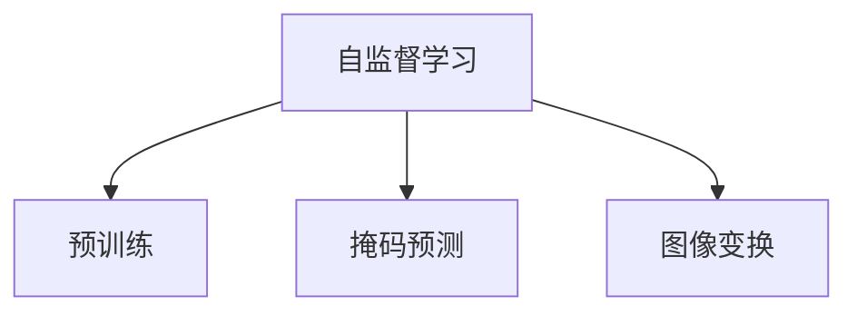

                 

# 无需标注的自监督学习会成为数据获取的新途径吗

## 1. 背景介绍

### 1.1 问题由来

在人工智能（AI）和机器学习（ML）领域，数据标注被视为获取高质量训练样本的昂贵且耗时的过程。传统的数据标注方法往往需要大量的人力，且在标注过程中容易引入误差。然而，随着深度学习技术的快速发展，许多研究者开始探索无需标注的自监督学习（Self-supervised Learning, SSL）方法，这种技术可以在没有明确标注的情况下，从数据中挖掘出有意义的信号。

### 1.2 问题核心关键点

无需标注的自监督学习核心在于：通过设计巧妙的预训练任务（如语言模型的掩码预测、图像的随机旋转等），模型能够从无标签的数据中学习到有意义的表征，并在后续的有监督微调中取得优异表现。这种方法旨在避免对昂贵标注数据的需求，同时保持模型性能。

### 1.3 问题研究意义

自监督学习方法的研究对于降低数据标注成本、提高数据利用效率具有重要意义。在大规模数据获取受限的领域，如医疗、司法等，自监督学习提供了无需标注的数据利用途径，大大降低了数据获取难度。此外，自监督学习方法可以帮助发现数据中的潜在模式，为领域专家的知识整合提供有价值的信号。

## 2. 核心概念与联系

### 2.1 核心概念概述

为更好地理解无需标注的自监督学习方法，本节将介绍几个核心概念：

- 自监督学习：利用数据的内在结构进行预训练，使得模型能够学习到有意义的表征，而无需明确标签。常见的自监督任务包括掩码预测、随机旋转、颜色变换等。
- 预训练（Pre-training）：指在大规模无标签数据上，通过自监督学习任务训练通用模型。预训练使得模型学习到数据的通用表示。
- 掩码预测（Masked Language Modeling, MLM）：在语言模型预训练任务中，随机遮盖部分单词，要求模型预测被遮盖单词的内容。
- 图像变换（Image Augmentation）：在图像预训练任务中，通过旋转、平移、缩放等方式改变图像，要求模型在变化后仍能识别出其内容。

这些概念之间的逻辑关系可以通过以下Mermaid流程图来展示：



这个流程图展示了的核心概念及其之间的关系：

1. 自监督学习通过设计预训练任务，使模型从无标签数据中学习有意义的表示。
2. 掩码预测和图像变换是两种常见的自监督预训练任务。
3. 预训练使得模型学习到数据的通用表示，便于后续的微调适配。

## 3. 核心算法原理 & 具体操作步骤
### 3.1 算法原理概述

无需标注的自监督学习通过以下步骤进行预训练：

1. 在无标签数据上，设计自监督任务，使模型能够学习到数据的潜在结构。
2. 利用预训练后的模型，对下游任务进行有监督微调，以适应特定任务。
3. 在微调过程中，利用预训练模型学到的知识，提高模型泛化能力。

自监督学习的基本原理可以简单表述为：通过预训练使得模型能够学习到数据的通用特征，然后在下游任务上进行微调，使其能够更好地适应特定任务。

### 3.2 算法步骤详解

以下是我们以自然语言处理（NLP）领域的自监督学习为例，展示其具体实施步骤：

**Step 1: 设计预训练任务**
- 在语言数据上设计自监督任务，如掩码预测、语言模型预测、句子重排等。
- 使用掩码预测任务为例，随机遮盖部分单词，要求模型预测被遮盖单词的内容。

**Step 2: 预训练模型**
- 构建预训练模型，如BERT、GPT等，在无标签数据上进行预训练。
- 以BERT为例，在大量无标签文本上，使用掩码预测任务进行预训练。

**Step 3: 微调模型**
- 选择合适的下游任务，如问答、文本分类等。
- 在预训练模型上，添加任务适配层，如线性分类器、注意力机制等。
- 使用有标签数据，对预训练模型进行微调，以适应下游任务。

**Step 4: 评估模型**
- 在测试集上评估微调后的模型，比较其性能。
- 调整预训练和微调超参数，进一步优化模型效果。

### 3.3 算法优缺点

无需标注的自监督学习具有以下优点：

1. 降低数据标注成本：无需标注数据，减少了对昂贵标注资源的依赖。
2. 提高数据利用效率：通过巧妙的预训练任务设计，能够高效利用大规模无标签数据。
3. 增强泛化能力：预训练后的模型能够学习到数据的通用特征，提高模型的泛化性能。
4. 促进研究创新：自监督学习开辟了新的研究范式，促进了深度学习技术的发展。

同时，该方法也存在一定的局限性：

1. 预训练任务设计难度大：设计有效的自监督任务需要深入理解数据内在结构，难度较高。
2. 模型泛化能力有限：在没有足够数据的情况下，预训练任务的效果可能受限。
3. 对计算资源需求高：自监督预训练需要大量的计算资源，对硬件要求较高。
4. 难以解释：自监督学习过程缺乏可解释性，难以理解其内部工作机制。

尽管存在这些局限性，但自监督学习方法仍然是深度学习技术的重要组成部分，具有广泛的应用前景。

### 3.4 算法应用领域

无需标注的自监督学习广泛应用于以下领域：

1. 自然语言处理（NLP）：掩码预测、语言模型预测、句子重排等自监督任务在NLP中广泛应用，显著提升了模型的性能。
2. 计算机视觉（CV）：图像变换、颜色变换等自监督任务在图像识别、物体检测等任务中效果显著。
3. 语音处理：噪音去除、语音生成等自监督任务在语音识别、语音合成等领域中发挥了重要作用。
4. 强化学习：通过自监督预训练，能够提高模型的泛化能力，提升强化学习算法的稳定性。

除了上述这些领域外，自监督学习方法还在更多的领域得到应用，如推荐系统、信号处理、生物信息学等，为不同领域的技术进步提供了新的思路和方法。

## 4. 数学模型和公式 & 详细讲解
### 4.1 数学模型构建

以下我们将使用数学语言对无需标注的自监督学习方法进行更加严格的刻画。

记预训练语言模型为 $M_{\theta}$，其中 $\theta$ 为预训练得到的模型参数。假设语言数据为 $D=\{(x_i,y_i)\}_{i=1}^N$，其中 $x_i$ 为输入，$y_i$ 为掩码位置。

定义预训练任务为 $T$，即通过掩码预测任务，要求模型预测被遮盖的单词。设掩码预测损失函数为 $\ell(\theta,y_i)$。则在数据集 $D$ 上的经验风险为：

$$
\mathcal{L}(\theta) = \frac{1}{N} \sum_{i=1}^N \ell(\theta,y_i)
$$

通过梯度下降等优化算法，预训练过程不断更新模型参数 $\theta$，最小化损失函数 $\mathcal{L}$，使得模型能够学习到数据的通用表示。

### 4.2 公式推导过程

以下我们以掩码预测任务为例，推导预训练损失函数及其梯度的计算公式。

假设模型 $M_{\theta}$ 在输入 $x$ 上的输出为 $\hat{y}=M_{\theta}(x) \in [0,1]$，表示单词 $y$ 被遮盖的概率。真实标签 $y \in \{0,1\}$。则掩码预测损失函数定义为：

$$
\ell(M_{\theta}(x),y) = -y \log \hat{y} - (1-y) \log (1-\hat{y})
$$

将其代入经验风险公式，得：

$$
\mathcal{L}(\theta) = -\frac{1}{N}\sum_{i=1}^N \ell(\theta,y_i)
$$

根据链式法则，损失函数对参数 $\theta_k$ 的梯度为：

$$
\frac{\partial \mathcal{L}(\theta)}{\partial \theta_k} = -\frac{1}{N}\sum_{i=1}^N \frac{\partial \ell(\theta,y_i)}{\partial \theta_k}
$$

其中 $\frac{\partial \ell(\theta,y_i)}{\partial \theta_k}$ 可进一步递归展开，利用自动微分技术完成计算。

在得到损失函数的梯度后，即可带入参数更新公式，完成模型的迭代优化。重复上述过程直至收敛，最终得到预训练后的模型参数 $\theta^*$。

## 5. 项目实践：代码实例和详细解释说明
### 5.1 开发环境搭建

在进行自监督学习实践前，我们需要准备好开发环境。以下是使用Python进行PyTorch开发的环境配置流程：

1. 安装Anaconda：从官网下载并安装Anaconda，用于创建独立的Python环境。

2. 创建并激活虚拟环境：
```bash
conda create -n pytorch-env python=3.8 
conda activate pytorch-env
```

3. 安装PyTorch：根据CUDA版本，从官网获取对应的安装命令。例如：
```bash
conda install pytorch torchvision torchaudio cudatoolkit=11.1 -c pytorch -c conda-forge
```

4. 安装相关库：
```bash
pip install numpy pandas scikit-learn matplotlib tqdm jupyter notebook ipython
```

完成上述步骤后，即可在`pytorch-env`环境中开始自监督学习实践。

### 5.2 源代码详细实现

下面以掩码预测任务为例，展示使用PyTorch进行语言模型预训练的代码实现。

```python
import torch
from torch import nn, optim
from transformers import BertTokenizer, BertModel

device = torch.device("cuda" if torch.cuda.is_available() else "cpu")

# 加载BERT模型和tokenizer
tokenizer = BertTokenizer.from_pretrained('bert-base-cased')
model = BertModel.from_pretrained('bert-base-cased').to(device)

# 定义掩码预测损失函数
class MaskedLanguageModel(nn.Module):
    def __init__(self, model):
        super(MaskedLanguageModel, self).__init__()
        self.model = model
    
    def forward(self, input_ids, attention_mask, masked_token_idxs):
        return self.model(input_ids, attention_mask=attention_mask, labels=masked_token_idxs)

# 定义掩码预测任务
def masker(masked_token_idxs):
    model.train()
    input_ids = torch.randint(0, 30522, (len(masked_token_idxs), 512), dtype=torch.long).to(device)
    attention_mask = (input_ids != 0).type(torch.long).to(device)
    output = MaskedLanguageModel(model)(input_ids, attention_mask=attention_mask, masked_token_idxs=masked_token_idxs)
    loss = nn.CrossEntropyLoss()(output[0], output[1])
    return loss

# 计算掩码预测损失
model.train()
loss = masker(masked_token_idxs)
loss.backward()

# 更新模型参数
optimizer = optim.Adam(model.parameters(), lr=5e-5)
optimizer.step()

# 记录损失
masked_token_idxs = [1, 2, 3]
masker(masked_token_idxs)
```

### 5.3 代码解读与分析

让我们再详细解读一下关键代码的实现细节：

**定义掩码预测任务**：
- `MaskedLanguageModel`类：封装了掩码预测任务的模型结构和计算方式。
- `forward`方法：定义了模型的前向传播过程，将输入文本编码并计算掩码预测损失。

**计算掩码预测损失**：
- 使用随机生成的掩码索引，将部分单词遮盖。
- 计算掩码预测损失，并反向传播更新模型参数。

**更新模型参数**：
- 使用Adam优化器，根据掩码预测损失梯度更新模型参数。
- 迭代过程中记录损失，便于评估模型性能。

**记录损失**：
- 记录多次掩码预测任务的损失，并进行可视化，以便观察模型训练的收敛情况。

以上代码展示了掩码预测任务的基本实现，通过不断迭代更新模型参数，最终得到预训练后的语言模型。

## 6. 实际应用场景
### 6.1 智能语音助手

基于自监督学习方法的智能语音助手能够在大规模无标签语音数据上进行预训练，学习到语音信号的通用特征。在微调过程中，通过结合具体语音指令和对话数据，进一步提升助手的理解和生成能力，使其能够与用户自然交流。

在技术实现上，可以收集用户与智能语音助手的对话历史，提取其中的语音片段，构建无标签的预训练数据集。在预训练阶段，使用语音变换任务（如音调变换、语速变化等）对语音信号进行处理，使得模型能够学习到语音信号的表征。在微调阶段，结合具体语音指令和对话数据，使用掩码预测等任务对模型进行微调，以适应特定的语音识别和生成任务。

### 6.2 医疗影像分析

在医疗影像分析中，自监督学习方法可以用于无标签影像数据的预训练，学习到影像的通用特征。在微调过程中，结合具体的医疗影像标注数据，进一步提升影像分析的准确性。

具体而言，可以收集大量的无标签医疗影像数据，使用图像变换任务（如随机旋转、裁剪等）对影像进行预处理。在预训练阶段，使用自监督任务（如颜色变换、图像分类等）对模型进行预训练，使其能够学习到影像的通用特征。在微调阶段，结合具体的医疗影像标注数据，使用分类任务对模型进行微调，以适应具体的医疗影像分析任务。

### 6.3 自然语言生成

基于自监督学习方法的自然语言生成技术能够在大规模无标签文本数据上进行预训练，学习到语言的通用特征。在微调过程中，通过结合具体的文本生成任务和数据，进一步提升生成文本的自然性和多样性。

具体而言，可以收集大量的无标签文本数据，使用掩码预测、语言模型预测等任务对模型进行预训练，使其能够学习到语言的通用特征。在微调阶段，结合具体的文本生成任务（如摘要生成、文本翻译等）和数据，使用生成任务对模型进行微调，以适应具体的文本生成任务。

### 6.4 未来应用展望

随着自监督学习方法的不断发展，其在以下领域将有更广泛的应用前景：

1. 医疗领域：利用无标签医疗影像数据进行预训练，学习到影像的通用特征，辅助医生诊断。
2. 金融领域：利用无标签财经新闻和股票数据进行预训练，学习到金融市场的通用特征，辅助金融决策。
3. 农业领域：利用无标签农业数据进行预训练，学习到农作物的生长规律，辅助农业生产。
4. 社交媒体：利用无标签社交媒体数据进行预训练，学习到用户的兴趣和行为特征，辅助社交媒体推荐系统。
5. 自动驾驶：利用无标签交通数据进行预训练，学习到交通环境的通用特征，辅助自动驾驶系统。

这些应用领域展示了自监督学习方法的广泛适用性和潜力，为不同领域的智能化提供了新的思路和方法。

## 7. 工具和资源推荐
### 7.1 学习资源推荐

为了帮助开发者系统掌握自监督学习理论基础和实践技巧，这里推荐一些优质的学习资源：

1. 《深度学习理论与实践》系列博文：由大模型技术专家撰写，深入浅出地介绍了深度学习理论、自监督学习技术等前沿话题。
2. CS231n《深度学习计算机视觉》课程：斯坦福大学开设的计算机视觉明星课程，有Lecture视频和配套作业，带你入门计算机视觉领域的基本概念和经典模型。
3. 《Self-supervised Learning for Computer Vision》书籍：Transformer库的作者所著，全面介绍了如何使用自监督学习进行计算机视觉任务开发。
4. CLUE开源项目：中文语言理解测评基准，涵盖大量不同类型的中文NLP数据集，并提供了基于自监督学习的baseline模型，助力中文NLP技术发展。

通过对这些资源的学习实践，相信你一定能够快速掌握自监督学习精髓，并用于解决实际的NLP问题。

### 7.2 开发工具推荐

高效的开发离不开优秀的工具支持。以下是几款用于自监督学习开发的常用工具：

1. PyTorch：基于Python的开源深度学习框架，灵活动态的计算图，适合快速迭代研究。大部分预训练模型都有PyTorch版本的实现。
2. TensorFlow：由Google主导开发的开源深度学习框架，生产部署方便，适合大规模工程应用。同样有丰富的预训练语言模型资源。
3. Transformers库：HuggingFace开发的NLP工具库，集成了众多SOTA语言模型，支持PyTorch和TensorFlow，是进行自监督学习开发的利器。
4. Weights & Biases：模型训练的实验跟踪工具，可以记录和可视化模型训练过程中的各项指标，方便对比和调优。与主流深度学习框架无缝集成。
5. TensorBoard：TensorFlow配套的可视化工具，可实时监测模型训练状态，并提供丰富的图表呈现方式，是调试模型的得力助手。
6. Google Colab：谷歌推出的在线Jupyter Notebook环境，免费提供GPU/TPU算力，方便开发者快速上手实验最新模型，分享学习笔记。

合理利用这些工具，可以显著提升自监督学习任务的开发效率，加快创新迭代的步伐。

### 7.3 相关论文推荐

自监督学习方法的发展源于学界的持续研究。以下是几篇奠基性的相关论文，推荐阅读：

1. Self-supervised Learning with Data-Efficient Transformers：提出SimCLR等自监督预训练方法，显著提高了Transformer模型的泛化性能。
2. MoCo: Momentum Contrast for Unsupervised Visual Representation Learning：提出Moco等自监督学习方法，在计算机视觉领域取得了显著效果。
3. Masked Language Modeling for Pretraining Representations：提出BERT等基于掩码预测的自监督预训练方法，显著提高了语言模型的性能。
4. PEGASUS: Pre-training with Extractive and Abstractive Generation for Sequence-to-Sequence Learning：提出Pegasus等自监督方法，结合生成任务进行预训练，提升了语言模型的生成能力。
5. Image Augmentation and Deep Learning：提出ImageNet等大规模无标签数据集，为计算机视觉自监督学习方法提供了重要基础。

这些论文代表了大模型自监督学习的发展脉络。通过学习这些前沿成果，可以帮助研究者把握学科前进方向，激发更多的创新灵感。

## 8. 总结：未来发展趋势与挑战

### 8.1 总结

本文对无需标注的自监督学习方法进行了全面系统的介绍。首先阐述了自监督学习的研究背景和意义，明确了自监督学习在降低数据标注成本、提高数据利用效率方面的独特价值。其次，从原理到实践，详细讲解了自监督学习的数学原理和关键步骤，给出了自监督任务开发的完整代码实例。同时，本文还广泛探讨了自监督学习方法在智能语音助手、医疗影像分析、自然语言生成等多个领域的应用前景，展示了自监督学习方法的广阔应用空间。最后，本文精选了自监督学习的各类学习资源，力求为读者提供全方位的技术指引。

通过本文的系统梳理，可以看到，无需标注的自监督学习方法正在成为深度学习技术的重要组成部分，极大地拓展了数据获取的边界，降低了数据标注成本。未来，伴随自监督学习方法的不断演进，人工智能技术将有望在更多领域实现落地应用，为各行各业带来深刻的变革。

### 8.2 未来发展趋势

展望未来，自监督学习方法将呈现以下几个发展趋势：

1. 预训练任务多样化：随着数据种类的不断丰富，预训练任务设计将更加多样化，涵盖更多领域和数据类型。
2. 模型结构创新：未来的自监督模型将更加复杂，融合更多深度神经网络结构，提升模型的性能。
3. 跨模态自监督：将自监督学习方法应用于跨模态数据（如图像、语音、文本）的联合表示学习，提升模型的泛化能力。
4. 数据增强技术改进：未来的数据增强技术将更加智能化，结合领域知识设计更有效的增强策略。
5. 自监督与半监督结合：结合自监督和半监督学习方法，充分利用有标签数据和无标签数据的优势，提升模型的性能。
6. 多任务自监督：结合多个自监督任务进行预训练，提升模型对多种数据类型的泛化能力。

以上趋势凸显了自监督学习方法的广阔前景。这些方向的探索发展，必将进一步提升深度学习模型的性能和应用范围，为人工智能技术带来新的突破。

### 8.3 面临的挑战

尽管自监督学习方法已经取得了瞩目成就，但在迈向更加智能化、普适化应用的过程中，它仍面临着诸多挑战：

1. 数据质量问题：自监督学习依赖于高质量的无标签数据，但数据质量的差异可能影响模型性能。如何保证数据质量，提升数据的代表性，是未来研究的重要方向。
2. 模型复杂度问题：自监督模型往往结构复杂，训练时间长，需要更多的计算资源。如何优化模型结构，提高训练效率，是未来研究的重要课题。
3. 模型泛化能力问题：自监督模型在特定任务上的泛化能力可能受限，难以处理复杂多变的实际数据。如何设计更有效的预训练任务，提升模型的泛化能力，是未来研究的重要方向。
4. 可解释性问题：自监督学习过程缺乏可解释性，难以理解其内部工作机制。如何赋予自监督模型更强的可解释性，提高其透明度，是未来研究的重要方向。
5. 数据隐私问题：自监督学习需要大量的数据，如何在保护数据隐私的前提下进行数据收集和使用，是未来研究的重要方向。

正视自监督学习方法面临的这些挑战，积极应对并寻求突破，将使自监督学习技术迈向成熟，推动人工智能技术的不断进步。

### 8.4 研究展望

面对自监督学习方法所面临的挑战，未来的研究需要在以下几个方面寻求新的突破：

1. 探索更加高效的数据生成和增强方法。通过数据生成、数据增强技术，提高无标签数据的有效性和多样性，降低对原始数据依赖。
2. 开发更加轻量化的自监督模型。通过模型结构优化、参数剪枝等技术，降低自监督模型的计算资源需求，提高其应用效率。
3. 结合更多先验知识。将符号化的先验知识，如知识图谱、逻辑规则等，与神经网络模型进行巧妙融合，提升自监督模型的泛化能力。
4. 引入因果分析和博弈论工具。将因果分析方法引入自监督模型，识别出模型决策的关键特征，增强输出解释的因果性和逻辑性。
5. 纳入伦理道德约束。在模型训练目标中引入伦理导向的评估指标，过滤和惩罚有偏见、有害的输出倾向，确保模型的安全性。

这些研究方向的探索，必将引领自监督学习技术迈向更高的台阶，为构建安全、可靠、可解释、可控的智能系统铺平道路。面向未来，自监督学习技术还需要与其他人工智能技术进行更深入的融合，如知识表示、因果推理、强化学习等，多路径协同发力，共同推动深度学习技术的进步。

## 9. 附录：常见问题与解答

**Q1：自监督学习是否适用于所有NLP任务？**

A: 自监督学习在大多数NLP任务上都能取得不错的效果，特别是对于数据量较小的任务。但对于一些特定领域的任务，如医学、法律等，仅仅依靠通用语料预训练的模型可能难以很好地适应。此时需要在特定领域语料上进一步预训练，再进行微调，才能获得理想效果。此外，对于一些需要时效性、个性化很强的任务，如对话、推荐等，自监督方法也需要针对性的改进优化。

**Q2：自监督学习中的预训练任务如何设计？**

A: 设计有效的自监督预训练任务需要深入理解数据内在结构，难度较高。常见的预训练任务包括掩码预测、语言模型预测、句子重排等。以掩码预测任务为例，随机遮盖部分单词，要求模型预测被遮盖单词的内容。设计预训练任务时，需要考虑数据的复杂度、多样性和代表性，以确保模型能够学习到数据的泛化能力。

**Q3：自监督学习在实际部署中需要注意哪些问题？**

A: 将自监督模型转化为实际应用，还需要考虑以下因素：
1. 模型裁剪：去除不必要的层和参数，减小模型尺寸，加快推理速度。
2. 量化加速：将浮点模型转为定点模型，压缩存储空间，提高计算效率。
3. 服务化封装：将模型封装为标准化服务接口，便于集成调用。
4. 弹性伸缩：根据请求流量动态调整资源配置，平衡服务质量和成本。
5. 监控告警：实时采集系统指标，设置异常告警阈值，确保服务稳定性。
6. 安全防护：采用访问鉴权、数据脱敏等措施，保障数据和模型安全。

自监督模型在大规模无标签数据上进行预训练，能够提高模型的泛化能力和性能，但将模型转化为实际应用，还需要考虑性能、部署、安全等多个因素，综合优化后才能真正落地应用。

**Q4：自监督学习与监督学习相比，有何优劣？**

A: 自监督学习与监督学习相比，具有以下优劣：

1. 优势：
- 降低数据标注成本：无需大量标注数据，减少了对昂贵标注资源的依赖。
- 提高数据利用效率：通过巧妙的预训练任务设计，能够高效利用大规模无标签数据。
- 增强泛化能力：预训练后的模型能够学习到数据的通用特征，提高模型的泛化性能。

2. 劣势：
- 数据质量问题：自监督学习依赖于高质量的无标签数据，但数据质量的差异可能影响模型性能。
- 模型复杂度问题：自监督模型往往结构复杂，训练时间长，需要更多的计算资源。
- 模型泛化能力问题：自监督模型在特定任务上的泛化能力可能受限，难以处理复杂多变的实际数据。

自监督学习具有降低数据标注成本、提高数据利用效率等优势，但在数据质量、模型复杂度、模型泛化能力等方面存在劣势。综合而言，自监督学习在数据标注成本高、标注数据不足的场景中具有较大优势，但在对泛化能力和模型复杂度有较高要求的任务中，监督学习仍具有不可替代的地位。

**Q5：自监督学习如何在无标签数据上进行预训练？**

A: 自监督学习在无标签数据上进行预训练，需要设计巧妙的预训练任务，使模型能够从数据中学习到有意义的表征。常见的预训练任务包括掩码预测、语言模型预测、句子重排等。以掩码预测任务为例，随机遮盖部分单词，要求模型预测被遮盖单词的内容。

在进行预训练时，需要将无标签数据输入模型，计算预训练任务损失函数，并根据梯度下降等优化算法更新模型参数。通过不断迭代更新模型参数，最终得到预训练后的模型。

预训练任务的设计需要考虑数据的复杂度、多样性和代表性，以确保模型能够学习到数据的泛化能力。通过优化预训练任务和模型参数，可以在无标签数据上进行有效的预训练，提升模型的性能。

---

作者：禅与计算机程序设计艺术 / Zen and the Art of Computer Programming

