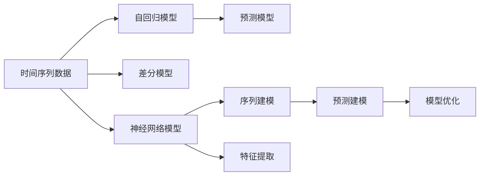

                 

## 1. 背景介绍

时间序列分析（Time Series Analysis）在现代统计分析和机器学习中扮演着重要角色，主要用于研究时间域上的数据趋势、季节性变化、周期性模式以及异常值等问题。时间序列分析广泛应用于经济预测、金融分析、健康监测、气象预测等领域。随着数据科学的发展，时间序列分析的技术也在不断进步，特别是随着深度学习的应用，时间序列分析的表现能力得到了显著提升。

### 1.1 问题由来
时间序列数据具有明显的自相关性和趋势性，传统的统计分析方法如ARIMA（AutoRegressive Integrated Moving Average）模型在处理复杂的时间序列数据时存在一定的局限性，例如对非线性时间序列的处理能力较弱，无法处理多模态数据等。深度学习提供了一种全新的视角，通过构建时间序列的神经网络模型，可以更加深入地挖掘数据中的复杂结构。

### 1.2 问题核心关键点
时间序列分析的核心问题是如何构建能够捕捉时间序列特征的神经网络模型。主要包括以下几个方面：
- 序列建模：如何构建有效的序列模型，捕捉时间序列的动态变化。
- 特征提取：如何从原始数据中提取有意义的特征，辅助模型学习。
- 预测建模：如何将模型应用于时间序列的预测任务，提高预测的准确性。
- 模型优化：如何优化模型结构，提高训练和预测效率。

### 1.3 问题研究意义
时间序列分析在现代数据科学中具有重要的地位，其研究意义在于：
- 精准预测：提高时间序列预测的准确性，帮助决策者做出更好的决策。
- 异常检测：及时发现异常数据，避免潜在风险。
- 趋势分析：分析时间序列的趋势和周期性，帮助理解数据背后的规律。
- 应用广泛：时间序列分析在各行各业中均有应用，能够推动技术的发展和进步。

## 2. 核心概念与联系

### 2.1 核心概念概述

时间序列分析涉及多个核心概念，包括时间序列数据、自回归模型、差分模型、神经网络等。下面简要介绍这些概念的含义和相互联系：

- **时间序列数据**：按时间顺序排列的数据集合，通常用于描述随时间变化的趋势、季节性变化和周期性模式。
- **自回归模型**：利用历史数据预测未来数据，通过时间滞后项来捕捉数据之间的关联性。
- **差分模型**：通过差分操作消除时间序列数据的趋势和季节性，使其变得更加平稳。
- **神经网络模型**：通过多层神经网络对时间序列数据进行建模，可以捕捉复杂的时间序列特征。

这些概念之间的联系可以通过以下Mermaid流程图来展示：



该流程图展示了时间序列分析的核心概念及其之间的逻辑关系：

1. 时间序列数据是分析和建模的基础。
2. 自回归模型和差分模型是传统的时间序列建模方法，用于捕捉数据中的趋势和季节性。
3. 神经网络模型是新兴的时间序列分析方法，可以捕捉复杂的时间序列特征。
4. 序列建模和特征提取是神经网络模型的重要步骤，用于捕捉数据中的动态变化和特征。
5. 预测建模和模型优化是神经网络模型的关键步骤，用于提高预测的准确性和模型的性能。

## 3. 核心算法原理 & 具体操作步骤

### 3.1 算法原理概述

时间序列分析的核心算法原理可以概括为：利用历史数据预测未来数据，通过模型捕捉时间序列中的动态变化和趋势，从而实现时间序列的预测和异常检测。时间序列分析的主要任务包括：

- 预测未来数据：利用模型预测时间序列中的下一个时间点或一段时间段的数据。
- 异常检测：检测时间序列中的异常数据，避免潜在的风险。
- 趋势分析：分析时间序列的趋势和周期性，帮助理解数据背后的规律。

### 3.2 算法步骤详解

基于深度学习的时间序列分析通常包含以下几个步骤：

**Step 1: 数据准备**
- 收集时间序列数据，并将其标准化处理。
- 将时间序列数据转化为张量形式，以便于神经网络模型的输入。

**Step 2: 构建神经网络模型**
- 选择合适的神经网络模型，如RNN、LSTM、GRU等。
- 定义模型的结构，包括输入层、隐藏层和输出层。
- 确定模型的超参数，如学习率、批次大小、训练轮数等。

**Step 3: 模型训练**
- 利用训练数据对模型进行训练，最小化预测误差。
- 通过交叉验证等技术，评估模型的性能。
- 调整模型超参数，优化模型性能。

**Step 4: 模型评估**
- 利用测试数据对模型进行评估，评估指标包括MAE、RMSE等。
- 分析模型的预测结果，识别模型的优缺点。

**Step 5: 模型应用**
- 将训练好的模型应用于实际的时间序列数据，进行预测和异常检测。
- 实时监控模型输出，及时发现异常数据。

### 3.3 算法优缺点

基于深度学习的时间序列分析方法具有以下优点：
- 高精度预测：深度学习模型能够捕捉复杂的时间序列特征，提高预测的准确性。
- 自适应性强：深度学习模型可以自动适应数据的变化，适用于各种类型的时间序列数据。
- 可扩展性好：深度学习模型可以通过增加隐藏层或调整超参数来提高性能。

同时，该方法也存在一些局限性：
- 数据依赖性强：深度学习模型对训练数据的质量和数量要求较高，数据缺失或不完整会影响模型的表现。
- 模型复杂度高：深度学习模型结构复杂，训练和预测效率较低。
- 解释性较差：深度学习模型的内部机制不透明，难以解释模型的决策过程。

尽管存在这些局限性，但深度学习在时间序列分析中已显示出强大的应用潜力，特别是在处理复杂时间序列数据方面。未来相关研究的重点在于如何降低深度学习模型对数据依赖性，提高模型的训练和预测效率，同时增强模型的可解释性。

### 3.4 算法应用领域

基于深度学习的时间序列分析方法在多个领域得到了广泛应用，例如：

- 金融分析：利用时间序列模型预测股票价格、利率等金融数据，辅助金融决策。
- 气象预测：利用时间序列模型预测天气变化，帮助气象预报。
- 健康监测：利用时间序列模型监测病人病情变化，提供实时医疗建议。
- 工业制造：利用时间序列模型预测设备故障，提高设备维护效率。
- 能源管理：利用时间序列模型预测能源需求，优化能源分配。

除了上述这些经典应用外，时间序列分析还在更多领域得到创新性应用，如智能交通、环境监测、自然灾害预测等，为各行业的智能化转型提供了新的技术路径。

## 4. 数学模型和公式 & 详细讲解 & 举例说明

### 4.1 数学模型构建

时间序列分析的数学模型通常基于以下假设：

- 时间序列数据是平稳的，即均值和方差随时间变化不大。
- 时间序列数据是自相关的，即当前数据与历史数据存在关联性。
- 时间序列数据具有趋势和季节性，即数据随时间呈现一定的规律性。

基于这些假设，时间序列分析的数学模型可以表示为：

$$
y_t = \phi(y_{t-1}, y_{t-2}, ..., y_{t-k}) + \epsilon_t
$$

其中，$y_t$ 为时间序列数据，$\phi$ 为预测函数，$k$ 为时间滞后项，$\epsilon_t$ 为随机误差项。

### 4.2 公式推导过程

在实际应用中，时间序列分析的数学模型可以进一步简化为自回归模型（AR）和差分模型（IARIMA）。

#### 自回归模型（AR）

自回归模型是一种简单的时间序列建模方法，可以表示为：

$$
y_t = \alpha + \sum_{i=1}^{p} \beta_i y_{t-i} + \epsilon_t
$$

其中，$\alpha$ 为截距项，$\beta_i$ 为回归系数，$p$ 为滞后项数。

#### 差分模型（IARIMA）

差分模型是一种将时间序列数据进行差分操作，使其变得更加平稳的建模方法，可以表示为：

$$
I(y_t) = \theta + \sum_{i=1}^{q} \delta_i I(y_{t-i}) + \epsilon_t
$$

其中，$I(y_t)$ 为差分操作，$\theta$ 为截距项，$\delta_i$ 为回归系数，$q$ 为滞后项数。

### 4.3 案例分析与讲解

以股市价格预测为例，利用时间序列分析进行预测的流程如下：

**Step 1: 数据准备**
- 收集历史股票价格数据，并将其标准化处理。
- 将历史数据转化为张量形式，以便于神经网络模型的输入。

**Step 2: 构建神经网络模型**
- 选择合适的神经网络模型，如LSTM。
- 定义模型的结构，包括输入层、隐藏层和输出层。
- 确定模型的超参数，如学习率、批次大小、训练轮数等。

**Step 3: 模型训练**
- 利用历史数据对模型进行训练，最小化预测误差。
- 通过交叉验证等技术，评估模型的性能。
- 调整模型超参数，优化模型性能。

**Step 4: 模型评估**
- 利用测试数据对模型进行评估，评估指标包括MAE、RMSE等。
- 分析模型的预测结果，识别模型的优缺点。

**Step 5: 模型应用**
- 将训练好的模型应用于实时的股票价格数据，进行预测。
- 实时监控模型输出，及时发现异常数据。

## 5. 项目实践：代码实例和详细解释说明

### 5.1 开发环境搭建

在进行时间序列分析的实践前，我们需要准备好开发环境。以下是使用Python进行TensorFlow开发的环境配置流程：

1. 安装Anaconda：从官网下载并安装Anaconda，用于创建独立的Python环境。

2. 创建并激活虚拟环境：
```bash
conda create -n tf-env python=3.8 
conda activate tf-env
```

3. 安装TensorFlow：从官网获取对应的安装命令。例如：
```bash
pip install tensorflow
```

4. 安装相关库：
```bash
pip install pandas numpy scikit-learn
```

完成上述步骤后，即可在`tf-env`环境中开始时间序列分析的实践。

### 5.2 源代码详细实现

下面以股票价格预测为例，给出使用TensorFlow进行LSTM模型的PyTorch代码实现。

```python
import tensorflow as tf
from tensorflow.keras.models import Sequential
from tensorflow.keras.layers import Dense, LSTM, Dropout

# 定义模型结构
model = Sequential()
model.add(LSTM(units=50, return_sequences=True, input_shape=(X_train.shape[1], 1)))
model.add(Dropout(0.2))
model.add(LSTM(units=50))
model.add(Dropout(0.2))
model.add(Dense(units=1))

# 定义损失函数和优化器
model.compile(optimizer='adam', loss='mse')

# 训练模型
model.fit(X_train, y_train, epochs=50, batch_size=32, validation_data=(X_test, y_test))
```

### 5.3 代码解读与分析

让我们再详细解读一下关键代码的实现细节：

**定义模型结构**：
- 使用LSTM层建立时间序列模型，通过return_sequences=True保留每一时刻的输出，用于捕捉时间序列中的动态变化。
- 添加Dropout层，防止过拟合。
- 定义输出层为Dense层，输出预测值。

**定义损失函数和优化器**：
- 使用均方误差（MSE）作为损失函数，用于衡量预测值与真实值之间的差异。
- 使用Adam优化器，自适应地调整学习率，加速模型的训练。

**训练模型**：
- 使用fit方法对模型进行训练，指定训练轮数和批次大小。
- 在每个epoch后，利用validation_data评估模型性能。

**模型应用**：
- 利用训练好的模型对新数据进行预测，例如：
```python
y_pred = model.predict(X_new)
```

可以看到，使用TensorFlow进行时间序列分析的代码实现相对简单，开发者可以将更多精力放在模型设计和超参数优化上，而不必过多关注底层的实现细节。

## 6. 实际应用场景

### 6.1 智能交通管理

时间序列分析可以应用于智能交通管理中，通过实时监测交通数据，预测交通流量和拥堵情况，优化交通信号控制，提高道路通行效率。例如，利用时间序列模型预测交通流量变化，及时调整信号灯的绿灯时长，减少交通拥堵。

### 6.2 工业设备维护

时间序列分析可以应用于工业设备维护中，通过实时监测设备运行数据，预测设备故障，提前进行维护。例如，利用时间序列模型预测设备的温度、振动等关键指标的变化趋势，及时发现异常情况，避免设备故障。

### 6.3 能源管理

时间序列分析可以应用于能源管理中，通过实时监测能源消耗数据，预测能源需求，优化能源分配。例如，利用时间序列模型预测用电负荷的变化趋势，合理分配电网资源，提高能源利用效率。

### 6.4 未来应用展望

随着时间序列分析技术的不断发展，其在多个领域的应用前景将更加广阔。未来，时间序列分析技术可能的发展方向包括：

1. 多模态融合：将时间序列数据与其他模态数据（如图像、文本）进行融合，提高模型的泛化能力和应用范围。
2. 实时预测：提高时间序列模型的实时预测能力，满足实时决策的需求。
3. 异常检测：利用时间序列分析技术进行异常检测，提高数据质量。
4. 模型压缩：优化时间序列模型的结构，提高模型的训练和预测效率。
5. 自动化模型选择：根据数据特征和任务需求，自动选择最优的模型结构，减少人工干预。

## 7. 工具和资源推荐

### 7.1 学习资源推荐

为了帮助开发者系统掌握时间序列分析的理论基础和实践技巧，这里推荐一些优质的学习资源：

1. 《时间序列分析与预测》：经典教材，全面介绍了时间序列分析的基本原理和常见方法。

2. 《Python时间序列分析》：实用指南，使用Python实现时间序列分析的案例和算法。

3. Coursera《时间序列分析》课程：由斯坦福大学开设的NLP课程，系统讲解时间序列分析的基本概念和应用。

4. Kaggle时间序列分析竞赛：参与实际项目，提高时间序列分析的实践能力。

通过对这些资源的学习实践，相信你一定能够快速掌握时间序列分析的精髓，并用于解决实际的时间序列问题。

### 7.2 开发工具推荐

高效的时间序列分析开发离不开优秀的工具支持。以下是几款用于时间序列分析开发的常用工具：

1. TensorFlow：基于Python的开源深度学习框架，支持时间序列模型的构建和训练。

2. PyTorch：基于Python的开源深度学习框架，支持时间序列模型的构建和训练。

3. Jupyter Notebook：交互式开发环境，方便进行代码实验和模型调试。

4. Weights & Biases：模型训练的实验跟踪工具，可以记录和可视化模型训练过程中的各项指标，方便对比和调优。

5. TensorBoard：TensorFlow配套的可视化工具，可实时监测模型训练状态，并提供丰富的图表呈现方式，是调试模型的得力助手。

合理利用这些工具，可以显著提升时间序列分析的开发效率，加快创新迭代的步伐。

### 7.3 相关论文推荐

时间序列分析技术的发展源于学界的持续研究。以下是几篇奠基性的相关论文，推荐阅读：

1. Box and Jenkins：介绍ARIMA模型的经典论文，是时间序列分析的基础。

2. LSTM for Time Series Forecasting：利用LSTM模型进行时间序列预测的经典论文，展示了LSTM模型的强大预测能力。

3. GRU for Time Series Prediction：利用GRU模型进行时间序列预测的经典论文，展示了GRU模型的预测效果。

4. Time Series Analysis by Stanford：斯坦福大学开设的NLP课程，系统讲解时间序列分析的基本概念和应用。

这些论文代表了大语言模型微调技术的发展脉络。通过学习这些前沿成果，可以帮助研究者把握学科前进方向，激发更多的创新灵感。

## 8. 总结：未来发展趋势与挑战

### 8.1 总结

本文对时间序列分析的基本原理和代码实例进行了全面系统的介绍。首先阐述了时间序列分析的研究背景和意义，明确了时间序列分析在现代数据科学中的重要地位。其次，从原理到实践，详细讲解了时间序列分析的数学模型和关键步骤，给出了时间序列分析任务开发的完整代码实例。同时，本文还探讨了时间序列分析在多个领域的应用前景，展示了时间序列分析技术的广阔应用范围。

通过本文的系统梳理，可以看到，时间序列分析在现代数据科学中具有重要的地位，其研究意义在于提高时间序列预测的准确性、实现时间序列数据的异常检测和趋势分析。未来，时间序列分析技术将不断拓展其应用领域，推动各行各业的智能化转型。

### 8.2 未来发展趋势

展望未来，时间序列分析技术将呈现以下几个发展趋势：

1. 数据量不断增长：随着物联网技术的发展，时间序列数据的规模将不断扩大，时间序列分析的算力需求也将随之增加。

2. 实时预测成为焦点：未来的时间序列分析将更加注重实时预测能力，满足实时决策的需求。

3. 多模态融合：时间序列数据与其他模态数据（如图像、文本）进行融合，提高模型的泛化能力和应用范围。

4. 异常检测：利用时间序列分析技术进行异常检测，提高数据质量。

5. 模型压缩：优化时间序列模型的结构，提高模型的训练和预测效率。

6. 自动化模型选择：根据数据特征和任务需求，自动选择最优的模型结构，减少人工干预。

这些趋势将推动时间序列分析技术不断进步，为其在更多领域的应用提供新的技术支持。

### 8.3 面临的挑战

尽管时间序列分析技术已经取得了显著成就，但在其发展过程中仍面临诸多挑战：

1. 数据质量问题：时间序列分析对数据质量要求较高，数据缺失、异常值等问题会影响模型的性能。

2. 模型复杂度：时间序列模型结构复杂，训练和预测效率较低。

3. 模型解释性：时间序列模型结构复杂，内部机制不透明，难以解释模型的决策过程。

4. 实时性问题：时间序列分析需要实时处理数据，如何提高模型的实时预测能力是一个重要挑战。

5. 多模态融合：将时间序列数据与其他模态数据进行融合，提高模型的泛化能力。

这些挑战需要在未来的研究中得到解决，才能推动时间序列分析技术的发展和应用。

### 8.4 研究展望

未来，时间序列分析技术需要在以下几个方面寻求新的突破：

1. 数据预处理：研究高效的数据预处理方法，解决数据质量问题。

2. 模型结构优化：优化时间序列模型的结构，提高模型的训练和预测效率。

3. 解释性增强：提高时间序列模型的解释性，增强模型的可解释性。

4. 实时预测：提高时间序列模型的实时预测能力，满足实时决策的需求。

5. 多模态融合：将时间序列数据与其他模态数据进行融合，提高模型的泛化能力和应用范围。

这些研究方向将推动时间序列分析技术的进一步发展，使其在更多领域得到应用，为人类社会的智能化转型提供新的技术支持。

## 9. 附录：常见问题与解答

**Q1: 时间序列分析的常用方法有哪些？**

A: 时间序列分析的常用方法包括自回归模型（AR）、差分模型（IARIMA）、LSTM模型、GRU模型等。其中，AR和IARIMA是传统的统计方法，LSTM和GRU是深度学习方法。

**Q2: 时间序列分析的优缺点是什么？**

A: 时间序列分析的优点包括：

- 高精度预测：深度学习模型能够捕捉复杂的时间序列特征，提高预测的准确性。
- 自适应性强：深度学习模型可以自动适应数据的变化，适用于各种类型的时间序列数据。

时间序列分析的缺点包括：

- 数据依赖性强：深度学习模型对训练数据的质量和数量要求较高，数据缺失或不完整会影响模型的表现。
- 模型复杂度高：深度学习模型结构复杂，训练和预测效率较低。
- 模型解释性较差：深度学习模型的内部机制不透明，难以解释模型的决策过程。

**Q3: 时间序列分析的实际应用场景有哪些？**

A: 时间序列分析在多个领域得到了广泛应用，包括金融分析、气象预测、健康监测、工业设备维护、能源管理等。

**Q4: 时间序列分析的未来发展方向是什么？**

A: 时间序列分析的未来发展方向包括多模态融合、实时预测、异常检测、模型压缩、自动化模型选择等。

**Q5: 时间序列分析中如何处理数据缺失？**

A: 时间序列分析中处理数据缺失的方法包括插值法、均值插补、数据插补等。这些方法可以用于填补数据缺失，保证数据完整性。

---

作者：禅与计算机程序设计艺术 / Zen and the Art of Computer Programming

