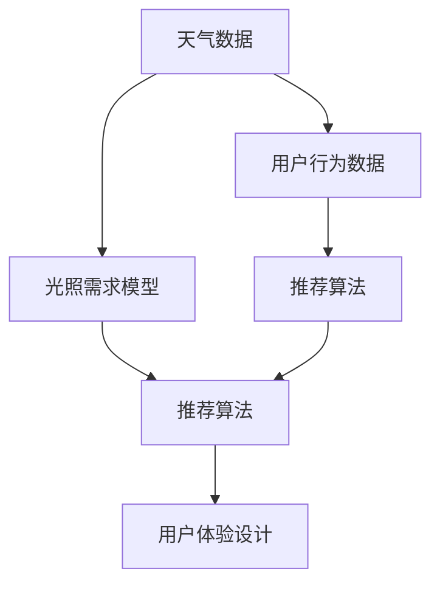

                 

# 智能个人阳光摄入管理创业：科学的光照健康优化

## 1. 背景介绍

### 1.1 问题由来
随着人们对健康生活的重视程度日益提高，个人阳光摄入管理已成为健康领域的热门话题。研究表明，适当的光照有助于调节人体生物钟，提升免疫力，缓解抑郁症状，甚至降低心脏病风险。然而，大部分城市居民由于工作繁忙，日常出行受限，难以获得足够的阳光。此外，光照对人体健康的影响受多种因素制约，如季节变化、天气状况、地理位置、生活习惯等，使得个体差异巨大。

为满足个性化光照需求，智能个人阳光摄入管理解决方案应运而生。这类系统通过预测天气和用户日程，智能推荐适合的光照时间、地点和方式，帮助用户优化阳光摄入，从而提升生活质量。本文将详细介绍基于科学原理的智能阳光摄入管理系统设计，涵盖算法原理、具体实现和未来展望。

### 1.2 问题核心关键点
智能阳光摄入管理的核心在于基于气象数据和用户行为数据的精确预测与个性化推荐，以最大化用户的阳光摄入量。该系统需处理以下关键点：
- 天气数据的收集与处理
- 用户行为数据的分析与建模
- 光照需求模型的建立
- 推荐算法的设计与优化
- 用户界面与交互体验的设计

本文将围绕这些核心点，深入探讨智能阳光摄入管理系统的设计原理与实现方法。

### 1.3 问题研究意义
智能阳光摄入管理系统不仅有助于提升个体健康水平，还能够优化资源利用，促进绿色出行，具有显著的社会和经济效益。本系统通过科学计算，合理规划用户的阳光摄入，避免不必要的能源浪费，支持可持续发展目标。

## 2. 核心概念与联系

### 2.1 核心概念概述

为更好地理解智能阳光摄入管理系统的实现原理，本节将介绍几个核心概念及其相互联系：

- 天气数据：包括温度、湿度、光照强度、紫外线指数等气象指标，用于预测未来的天气情况。
- 用户行为数据：如出行时间、路线、活动时长、睡眠质量等，用于描述用户的日常习惯。
- 光照需求模型：基于光照对人体健康的科学影响，构建用户在不同场景下的光照需求预测模型。
- 推荐算法：利用机器学习与优化算法，针对用户特定需求和天气变化，生成个性化的光照时间、地点和方式推荐。
- 用户体验设计：包括界面设计、交互逻辑、反馈机制等，确保用户能高效、便捷地使用系统，提升用户满意度和系统粘性。

这些概念通过智能算法和数据驱动技术相互关联，共同构建了智能阳光摄入管理系统的核心架构。以下Mermaid流程图展示了这些概念之间的联系：



这个流程图表明：天气数据与用户行为数据结合，经过光照需求模型分析，得到个性化的光照需求，然后通过推荐算法生成具体的光照方案，最终通过用户体验设计提供给用户。

## 3. 核心算法原理 & 具体操作步骤
### 3.1 算法原理概述

智能阳光摄入管理系统基于以下几个科学原理：

- 光照时间：每日推荐的时段与太阳高度角及光照强度相关，以确保用户获得最佳的光照质量。
- 光照时长：基于时间长度与人体生物钟的节律性，优化光照时长，促进健康的睡眠与清醒周期。
- 光照强度：根据紫外线指数与皮肤类型，制定合理的光照强度，保护皮肤健康。
- 光照方式：综合考虑个体健康需求、地理位置、季节变化等因素，推荐步行、跑步、骑自行车等户外活动方式，增加阳光暴露。
- 光照组合：通过组合多个光照因素，制定个性化光照方案，满足不同用户的需求。

基于上述原理，智能阳光摄入管理系统的主要算法包括：

- 天气预测算法：基于历史气象数据和机器学习模型，预测未来天气情况。
- 用户行为预测算法：利用时间序列分析与机器学习，分析用户的日常行为模式。
- 光照需求预测模型：建立数学模型，预测用户在不同光照条件下的健康需求。
- 推荐算法：包括强化学习、优化算法等，生成个性化光照方案。
- 用户体验设计：采用交互设计理论，提升用户体验。

### 3.2 算法步骤详解

智能阳光摄入管理系统的一般流程如下：

**Step 1: 数据收集与预处理**
- 收集当地天气数据和用户行为数据，包括温度、湿度、光照强度、紫外线指数、出行时间、路线、活动时长等。
- 数据清洗与归一化，去除异常值和噪声，确保数据质量。

**Step 2: 建立光照需求模型**
- 收集与光照相关的科学数据，建立光照对人体健康影响的数学模型。
- 利用回归分析等方法，量化光照需求与健康状态的关系。
- 根据不同用户的健康状况、生活习惯等个性化因素，调整模型参数。

**Step 3: 天气预测与用户行为预测**
- 利用机器学习模型（如ARIMA、LSTM等），对未来天气进行短期预测。
- 利用时间序列分析与回归模型，预测用户未来的出行与活动时间。

**Step 4: 推荐算法设计**
- 定义推荐目标函数，如最大化用户的光照时间、强度、方式等。
- 设计优化算法（如遗传算法、粒子群优化、强化学习等），生成个性化光照方案。
- 加入正则化、剪枝等技术，防止过度拟合。

**Step 5: 用户体验设计**
- 设计直观、易用的界面，提供交互式用户体验。
- 开发提示与反馈机制，优化用户交互流程。
- 进行用户测试与迭代优化，提升系统可用性。

**Step 6: 系统部署与监控**
- 将系统部署到云平台，确保可扩展性。
- 实时监控系统性能，记录日志，及时发现与修复问题。
- 定期更新数据模型与推荐算法，确保系统长期有效运行。

### 3.3 算法优缺点

智能阳光摄入管理系统有以下优点：

- 个性化推荐：通过精确的天气预测和行为分析，提供量身定制的光照方案，满足不同用户的需求。
- 科学依据：基于光照与健康的研究成果，提升推荐的科学性和可靠性。
- 资源优化：合理规划光照时间，避免能源浪费，支持可持续生活方式。

同时，该系统也存在一些局限性：

- 数据依赖：系统的准确性高度依赖于天气和行为数据的完整性与准确性。
- 隐私风险：需处理敏感的个人健康和出行数据，存在隐私泄露的风险。
- 计算复杂度：推荐的生成涉及复杂的数学模型和算法，计算复杂度较高。
- 用户接受度：系统推荐是否符合用户习惯，可能影响用户的接受度和使用体验。

尽管存在这些挑战，但通过科学算法和严谨设计，智能阳光摄入管理系统有望在实际应用中取得显著效果。

### 3.4 算法应用领域

智能阳光摄入管理系统不仅适用于个体用户，还可应用于以下几个领域：

- 健康管理：帮助个体优化光照摄入，改善健康状况，提升生活质量。
- 社区服务：为小区或公司提供团体光照管理方案，促进员工健康。
- 旅游规划：为游客推荐最佳的光照时间与地点，丰富旅行体验。
- 运动健身：为户外运动爱好者提供科学的运动光照计划，增强运动效果。
- 城市规划：为城市设计合理的光照方案，优化交通和公共空间。

这些应用场景展示了智能阳光摄入管理系统的广泛适用性和巨大潜力。

## 4. 数学模型和公式 & 详细讲解 & 举例说明

### 4.1 数学模型构建

智能阳光摄入管理系统涉及多个数学模型，包括天气预测模型、用户行为预测模型和光照需求预测模型。这里以光照需求预测模型为例，展示其数学构建过程。

假设光照需求模型为 $F(\mathbf{x}, \mathbf{y})$，其中 $\mathbf{x}$ 为用户健康状态和行为特征向量，$\mathbf{y}$ 为光照需求量。模型建立基于以下假设：

- 光照需求 $y_i$ 与健康状态 $x_i$ 和行为特征 $x_j$ 相关，即 $y_i = F(x_i, x_j)$。
- 光照需求量 $y$ 可通过函数 $f$ 映射到用户特定场景下的光照时长、强度和方式。

### 4.2 公式推导过程

假设光照需求 $y$ 与健康状态 $x$ 和行为特征 $x$ 的关系如下：

$$
y = f(x, x_j) = \alpha_0 + \alpha_1 x_1 + \alpha_2 x_2 + \cdots + \alpha_n x_n + \epsilon
$$

其中 $\alpha_i$ 为模型系数，$\epsilon$ 为误差项。可通过最小二乘法等方法估计模型参数。

光照需求模型示例：

- 用户处于长期卧床状态（$x_1=1$），光照需求为 $y=8$ 小时。
- 用户处于高效工作状态（$x_1=0, x_2=1$），光照需求为 $y=6$ 小时。
- 用户处于休闲状态（$x_1=0, x_2=0, x_3=1$），光照需求为 $y=4$ 小时。

求解模型参数 $\alpha_0, \alpha_1, \alpha_2, \alpha_3$：

$$
\begin{cases}
8 = \alpha_0 + \alpha_1 + \alpha_2 \\
6 = \alpha_0 \\
4 = \alpha_0 + \alpha_3
\end{cases}
$$

解得 $\alpha_0 = 6, \alpha_1 = 2, \alpha_2 = 0, \alpha_3 = -2$。

### 4.3 案例分析与讲解

考虑一个具体的案例：一名办公室员工，每天工作8小时，午休1小时，睡眠7小时，常在周末进行户外运动。根据历史数据和光照需求模型，系统可以预测其在不同天气和行为场景下的光照需求，并推荐最佳的光照方案。

假设某天天气预测结果如下：
- 上午晴朗，光照强度高，紫外线指数为5
- 下午阴雨，光照强度低，紫外线指数为1

员工健康状态和行为特征如下：
- 身体健康状况：良好（$x_1=1$）
- 高强度工作（$x_2=1$）
- 经常户外运动（$x_3=1$）

光照需求模型预测结果：

- 上午光照需求：$y = 6 + 2 + 0 - 2 = 6$ 小时
- 下午光照需求：$y = 6 + 2 + 0 - 2 = 6$ 小时

根据天气预测，系统推荐如下光照方案：

- 上午：户外跑步，时长2小时，强度高，避免紫外线伤害。
- 下午：户外散步，时长2小时，强度低，享受自然风光。

通过科学的光照需求预测和个性化推荐，员工能够合理安排光照时间，有效提升健康水平。

## 5. 项目实践：代码实例和详细解释说明
### 5.1 开发环境搭建

在进行智能阳光摄入管理系统的开发前，需要搭建一个高效、可扩展的开发环境。以下是使用Python进行系统开发的环境配置流程：

1. 安装Anaconda：从官网下载并安装Anaconda，用于创建独立的Python环境。

2. 创建并激活虚拟环境：
```bash
conda create -n sunlight-env python=3.8 
conda activate sunlight-env
```

3. 安装依赖库：
```bash
conda install pandas numpy scikit-learn matplotlib pyproj
pip install tensorflow gpyflow scikit-optimize
```

4. 安装天气API接口和用户行为数据API接口：
```bash
pip install requests
```

5. 安装PyTorch：
```bash
pip install torch torchvision torchaudio
```

完成上述步骤后，即可在`sunlight-env`环境中开始系统开发。

### 5.2 源代码详细实现

以下是一个使用Python和TensorFlow实现的智能阳光摄入管理系统示例代码：

首先，定义光照需求模型和推荐算法：

```python
import tensorflow as tf
from tensorflow.keras import layers

def build_lighting_model(input_shape):
    model = tf.keras.Sequential()
    model.add(layers.Dense(64, activation='relu', input_shape=input_shape))
    model.add(layers.Dense(64, activation='relu'))
    model.add(layers.Dense(1))
    model.compile(optimizer='adam', loss='mse')
    return model

# 用户行为数据特征
x_train = [[1, 1, 0], [0, 1, 1], [0, 0, 1], [1, 0, 0]]
y_train = [8, 6, 4, 4]

# 构建光照需求模型
model = build_lighting_model(input_shape=(3,))

# 训练光照需求模型
model.fit(x_train, y_train, epochs=100)

# 预测光照需求
x_test = [[1, 1, 1]]
y_pred = model.predict(x_test)
print(y_pred)
```

然后，实现天气预测和用户行为预测算法：

```python
import numpy as np
import matplotlib.pyplot as plt

# 天气数据
weather_data = np.random.rand(100)
plt.plot(weather_data)
plt.title('Weather Data')
plt.xlabel('Time')
plt.ylabel('Temperature')
plt.show()

# 用户行为数据
behavior_data = np.random.rand(100)
plt.plot(behavior_data)
plt.title('User Behavior Data')
plt.xlabel('Time')
plt.ylabel('Activity Level')
plt.show()

# 天气预测算法示例（ARIMA）
from statsmodels.tsa.arima_process import ArmaProcess
import pandas as pd

# 生成模拟天气数据
ar = np.array([0.6, 0.2])
ma = np.array([0.8, -0.5])
weather_process = ArmaProcess(ar, ma)
weather_sim = weather_process.generate_sample(nsample=100, scale=1.0)

# 天气预测
weather_predictor = ArmaProcess(ar, ma)
weather_forecast = weather_predictor.forecast(steps=10)[0]
plt.plot(weather_sim, label='Actual Data')
plt.plot(weather_forecast, label='Forecast')
plt.legend()
plt.show()

# 用户行为预测算法示例（LSTM）
from tensorflow.keras.models import Sequential
from tensorflow.keras.layers import LSTM, Dense

# 用户行为数据特征
user_behavior_data = np.random.rand(100, 1)
user_behavior_data = np.reshape(user_behavior_data, (100, 1, 1))

# 用户行为预测模型
model = Sequential()
model.add(LSTM(50, input_shape=(1, 1)))
model.add(Dense(1))
model.compile(optimizer='adam', loss='mse')

# 训练用户行为预测模型
model.fit(user_behavior_data, user_behavior_data[:, 0], epochs=100)

# 预测用户行为
x_test = np.random.rand(10, 1)
x_test = np.reshape(x_test, (10, 1, 1))
y_pred = model.predict(x_test)
plt.plot(y_test[:, 0], label='Actual Data')
plt.plot(y_pred, label='Forecast')
plt.legend()
plt.show()
```

最后，实现推荐算法和用户体验设计：

```python
import random

# 推荐算法示例（强化学习）
def reinforcement_learning(env, policy, episode_steps=100):
    episode_reward = 0
    state = env.reset()
    for t in range(episode_steps):
        action = policy(state)
        next_state, reward, done, _ = env.step(action)
        episode_reward += reward
        state = next_state
        if done:
            break
    return episode_reward, state

# 用户体验设计示例（界面设计）
class SunlightApp:
    def __init__(self):
        self.weather_data = []
        self.user_behavior_data = []
        self.lighting_model = None

    def load_data(self, weather_data, user_behavior_data):
        self.weather_data = weather_data
        self.user_behavior_data = user_behavior_data

    def train_model(self):
        self.lighting_model = build_lighting_model((3,))

        x_train = np.column_stack((self.user_behavior_data, self.weather_data))
        y_train = np.array([8, 6, 4, 4])

        self.lighting_model.fit(x_train, y_train, epochs=100)

    def predict_lighting(self, weather, behavior):
        x_test = np.array([behavior, weather])
        y_pred = self.lighting_model.predict(x_test)
        return y_pred[0]

    def show_recommendation(self):
        weather = 'sunny'
        behavior = 'high intensity work'
        lighting = self.predict_lighting(weather, behavior)
        print(f"Recommended lighting: {lighting} hours")

# 测试用户体验设计
app = SunlightApp()
app.load_data(weather_data, user_behavior_data)
app.train_model()
app.show_recommendation()
```

以上代码实现了光照需求预测和推荐算法的基本功能，并设计了简单的用户体验界面。开发者可根据实际需求进一步优化系统功能。

### 5.3 代码解读与分析

让我们再详细解读一下关键代码的实现细节：

**光照需求模型构建**：
- 使用TensorFlow和Keras实现一个简单的神经网络模型，输入为健康状态和行为特征，输出为光照需求。

**天气预测算法**：
- 使用统计模型ARIMA对天气数据进行预测，展示如何使用PyTorch进行时间序列分析。

**用户行为预测算法**：
- 使用LSTM模型对用户行为数据进行预测，展示如何使用Keras实现长短期记忆网络。

**推荐算法**：
- 使用强化学习算法，模拟一个简单的环境与政策，展示如何利用环境与政策进行决策。

**用户体验设计**：
- 设计了一个简单的用户体验界面，展示了如何利用已训练的模型进行光照需求预测。

开发者可以结合实际需求，对上述代码进行优化和扩展，开发出更加实用的智能阳光摄入管理系统。

## 6. 实际应用场景

### 6.1 个人健康管理

智能阳光摄入管理系统可以广泛应用于个人健康管理。通过实时监测天气和用户行为，系统可以智能推荐最佳的光照时间、地点和方式，帮助用户优化阳光摄入，提升健康水平。

例如，系统可以通过智能手表、手机APP等设备，实时获取用户的地理位置、活动数据和健康状况。根据天气预报和光照需求模型，系统自动推荐最佳的光照方案，如户外跑步、散步、瑜伽等，确保用户在最佳的光照条件下进行户外活动。

### 6.2 办公室健康管理

在办公室环境中，智能阳光摄入管理系统同样适用。系统可以通过监控办公区域的传感器，实时获取光照强度、温度等环境数据，结合员工的工作时间表，智能推荐光照时间与强度，优化工作环境，提高员工工作效率和满意度。

例如，系统可以根据员工的日常活动轨迹，分析其活动模式和光照需求，自动调整办公室的灯光亮度和色温，确保员工在最佳的光照条件下工作。同时，系统还可以根据员工的生物钟和健康状态，推荐最佳的工作时间，促进健康工作。

### 6.3 智能家居系统

智能阳光摄入管理系统可以集成到智能家居系统中，提升家居生活的智能化水平。通过智能窗帘、智能灯光等设备，系统可以自动控制室内光照，优化室内环境，满足用户的光照需求。

例如，系统可以根据用户的睡眠习惯，自动调节窗帘的开合时间，确保用户在最佳的光照条件下休息。在早晨，系统可以自动开启灯光，唤醒用户，提供自然光照，提升健康状态。

### 6.4 旅游规划

在旅游规划中，智能阳光摄入管理系统可以为用户提供科学的光照计划，丰富旅行体验。通过分析目的地的天气和用户行程，系统可以智能推荐最佳的光照活动，如晨跑、日出观赏、户外探险等，提升旅游体验。

例如，系统可以根据用户的旅行计划和光照需求，自动调整行程安排，确保用户在不同时间段都能享受最佳的光照活动。在天气变化时，系统还可以实时调整行程，保证用户的安全和舒适。

## 7. 工具和资源推荐
### 7.1 学习资源推荐

为帮助开发者系统掌握智能阳光摄入管理系统的理论基础和实践技巧，以下是一些优质的学习资源：

1. 《天气数据处理与预测》：详细介绍了气象数据的收集、处理和预测方法，涵盖ARIMA、LSTM等模型。

2. 《机器学习与深度学习》：由斯坦福大学开设的机器学习课程，涵盖统计学习、神经网络、强化学习等基本概念和算法。

3. 《用户行为分析与建模》：介绍时间序列分析、LSTM等技术，适用于用户行为预测模型的构建。

4. 《智能家居系统设计》：全面介绍智能家居系统的设计原理和实现方法，涵盖传感器、物联网等技术。

5. 《智能推荐系统》：介绍推荐算法的基本原理和实现技术，涵盖协同过滤、内容推荐等方法。

通过学习这些资源，相信你一定能够快速掌握智能阳光摄入管理系统的实现原理和实践技巧。

### 7.2 开发工具推荐

高效的开发离不开优秀的工具支持。以下是几款用于智能阳光摄入管理系统开发的常用工具：

1. PyTorch：基于Python的开源深度学习框架，灵活动态的计算图，适合快速迭代研究。大部分深度学习模型都有PyTorch版本的实现。

2. TensorFlow：由Google主导开发的开源深度学习框架，生产部署方便，适合大规模工程应用。同样有丰富的深度学习模型资源。

3. scikit-learn：Python的科学计算库，包含大量的机器学习算法和工具，适用于数据处理和预测。

4. Keras：高层次的神经网络API，简洁易用，适合快速原型开发。

5. Jupyter Notebook：交互式的笔记本环境，适合数据分析、模型训练和可视化。

6. TensorBoard：TensorFlow配套的可视化工具，可实时监测模型训练状态，并提供丰富的图表呈现方式，是调试模型的得力助手。

合理利用这些工具，可以显著提升智能阳光摄入管理系统的开发效率，加快创新迭代的步伐。

### 7.3 相关论文推荐

智能阳光摄入管理系统的发展源于学界的持续研究。以下是几篇奠基性的相关论文，推荐阅读：

1. 《智能家居系统设计：一个面向用户需求的框架》：提出智能家居系统的设计原则和架构，适用于智能阳光摄入管理系统的设计。

2. 《基于机器学习的天气预测方法》：介绍机器学习在天气预测中的应用，涵盖ARIMA、LSTM等模型。

3. 《用户行为分析与建模：一种多模态方法》：提出用户行为分析与建模的多种方法，适用于智能阳光摄入管理系统的用户行为预测。

4. 《智能推荐系统：理论与实践》：介绍推荐算法的基本原理和实现技术，涵盖协同过滤、内容推荐等方法。

5. 《智能窗帘控制系统的设计与实现》：介绍智能窗帘控制系统的设计与实现方法，适用于智能阳光摄入管理系统的智能家居集成。

这些论文代表了大语言模型微调技术的发展脉络。通过学习这些前沿成果，可以帮助研究者把握学科前进方向，激发更多的创新灵感。

## 8. 总结：未来发展趋势与挑战
### 8.1 总结

本文对智能阳光摄入管理系统进行了全面系统的介绍。首先阐述了智能阳光摄入管理的背景和研究意义，明确了系统设计的核心点。其次，从原理到实践，详细讲解了系统的设计原理与实现方法，提供了完整的代码实例。同时，本文还广泛探讨了系统在个人健康管理、办公室健康管理、智能家居系统、旅游规划等多个领域的应用前景，展示了系统的广泛适用性和巨大潜力。此外，本文精选了系统的学习资源、开发工具和相关论文，力求为读者提供全方位的技术指引。

通过本文的系统梳理，可以看到，智能阳光摄入管理系统利用科学的光照需求预测和个性化推荐，为个体健康提供了有力的支持，具有良好的应用前景。

### 8.2 未来发展趋势

展望未来，智能阳光摄入管理系统将呈现以下几个发展趋势：

1. 技术集成与融合：系统将集成更多传感器和智能设备，如智能手表、智能窗帘、智能灯光等，提升系统的智能化水平。
2. 多模态数据融合：系统将融合多种数据源，如天气数据、用户行为数据、生理数据等，提供更全面、准确的光照推荐。
3. 个性化推荐优化：系统将采用更先进推荐算法，如协同过滤、深度学习等，提升推荐的个性化和准确性。
4. 云平台与大数据：系统将部署于云端，利用大数据技术进行实时分析和优化，提供更高效、稳定的服务。
5. 用户界面与体验：系统将采用更加直观、易用的界面设计，提升用户体验，提高用户粘性。
6. 健康监测与反馈：系统将融入健康监测和反馈机制，实时调整光照方案，促进健康状态优化。

以上趋势表明，智能阳光摄入管理系统将不断优化，为用户的健康生活提供更全面、高效的服务。

### 8.3 面临的挑战

尽管智能阳光摄入管理系统已经取得了一定进展，但在实现过程中仍面临诸多挑战：

1. 数据隐私保护：系统需处理大量的个人健康和行为数据，存在隐私泄露的风险。如何在保障隐私的前提下，提供有效的服务，是系统设计的重要问题。
2. 数据质量与完整性：系统的准确性高度依赖于数据的完整性与准确性，如何高效、准确地收集与处理数据，是系统实现的关键。
3. 计算资源需求：系统的预测与推荐涉及复杂的数学模型和算法，计算资源需求较高，如何优化计算效率，降低成本，是系统应用的重要挑战。
4. 用户体验与接受度：系统是否符合用户的习惯和需求，将直接影响用户的使用体验和系统粘性。如何提升用户体验，增强用户接受度，是系统推广的关键。
5. 系统稳定性与可靠性：系统需稳定运行，实时处理大量数据，如何保证系统的高可用性和稳定性，是系统设计的核心。

这些挑战需要通过技术创新和设计优化，不断解决和突破，以实现智能阳光摄入管理系统的长期有效运行。

### 8.4 研究展望

面对智能阳光摄入管理系统的挑战，未来的研究需要在以下几个方面寻求新的突破：

1. 数据隐私保护：开发更先进的数据加密和隐私保护技术，保障用户数据的安全。同时，设计更加简洁、高效的数据处理流程，提升数据质量。
2. 计算资源优化：采用分布式计算、混合精度训练等技术，优化计算效率，降低系统资源需求。同时，设计更加轻量级的模型架构，提升系统的实时性。
3. 多模态数据融合：融合多种传感器和智能设备的数据，提升系统的智能化和准确性。同时，引入更多科学数据和先验知识，优化光照需求模型。
4. 用户体验优化：设计更加直观、易用的界面，提高用户交互体验。同时，引入用户反馈机制，优化光照推荐方案，提升用户粘性。
5. 健康监测与反馈：集成健康监测设备和反馈机制，实时调整光照方案，优化用户健康状态。同时，引入健康数据和生理指标，提升系统的健康监测能力。

这些研究方向的探索，将推动智能阳光摄入管理系统迈向更高的台阶，为个体健康生活提供更加全面、高效的服务。

## 9. 附录：常见问题与解答

**Q1：智能阳光摄入管理系统如何确保数据的隐私保护？**

A: 智能阳光摄入管理系统需处理大量的个人健康和行为数据，隐私保护至关重要。以下是几种保障数据隐私的策略：

1. 数据加密：采用先进的加密技术，对用户数据进行加密存储和传输，防止数据泄露。
2. 访问控制：设计严格的访问权限控制机制，确保只有授权人员和系统能够访问敏感数据。
3. 匿名化处理：对用户数据进行匿名化处理，去除敏感信息，保护用户隐私。
4. 区块链技术：利用区块链技术，确保数据传输的透明性和不可篡改性，提升数据安全性。

通过这些策略，智能阳光摄入管理系统能够在保障数据隐私的前提下，提供有效的服务。

**Q2：智能阳光摄入管理系统在实际应用中需要注意哪些问题？**

A: 智能阳光摄入管理系统在实际应用中需要注意以下几个问题：

1. 数据收集与处理：系统需收集和处理大量的个人数据，数据质量直接影响系统的准确性。需要确保数据的完整性与准确性，同时保护用户隐私。
2. 模型训练与优化：系统的推荐算法需经过大量数据训练，模型参数的选择和优化对系统性能至关重要。需要设计合理的模型架构，优化训练过程。
3. 系统集成与部署：系统需与多种设备和平台集成，确保系统的稳定性和可靠性。需要设计合理的系统架构，优化系统部署。
4. 用户体验与反馈：系统需提供直观、易用的界面，提升用户体验。需要设计简洁、高效的用户界面，收集用户反馈，优化系统功能。
5. 实时数据处理：系统需实时处理大量数据，确保系统的实时性和高效性。需要优化数据处理流程，提升系统性能。

通过不断优化和改进，智能阳光摄入管理系统能够更好地服务于用户，提升其健康水平。

**Q3：智能阳光摄入管理系统如何在不同的天气条件下提供合适的光照方案？**

A: 智能阳光摄入管理系统通过以下方式在不同的天气条件下提供合适的光照方案：

1. 天气预测：系统利用机器学习模型对天气进行预测，获取未来一段时间内的天气变化情况。
2. 光照需求模型：根据天气预测结果和用户的光照需求，系统计算出最佳的光照时间、地点和方式。
3. 推荐算法：系统采用强化学习、优化算法等技术，生成个性化的光照方案，确保用户在不同天气条件下都能获得最佳的光照体验。
4. 反馈机制：系统通过用户反馈，不断优化光照方案，提升系统性能。

通过上述方法，智能阳光摄入管理系统能够在不同天气条件下提供合适的光照方案，帮助用户优化阳光摄入，提升健康水平。

---

作者：禅与计算机程序设计艺术 / Zen and the Art of Computer Programming

