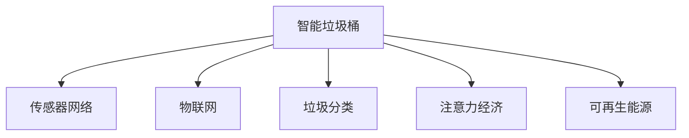

                 

# 智能垃圾桶的环保管理与注意力经济

> 关键词：智能垃圾桶, 环保管理, 注意力经济, 传感器网络, 数据驱动, 垃圾分类, 物联网, 可再生能源

## 1. 背景介绍

随着城市化进程的加速和人们生活水平的提高，垃圾问题变得越来越严峻。在城市环境中，垃圾桶作为垃圾收集的重要设施，其智能化程度直接影响着垃圾处理的效率和质量。传统垃圾桶多以手动操作为主，不仅费时费力，还容易导致垃圾分类不规范，增加后期处理难度。

与此同时，随着物联网和传感技术的进步，智能垃圾桶的应用成为可能。智能垃圾桶通过集成传感器网络、通信技术和数据分析工具，能够实时监测垃圾收集情况，提高垃圾处理的效率和准确性。而近年来兴起的注意力经济，更是为智能垃圾桶的发展提供了新的思路。注意力经济是一种基于用户注意力资源的经济形态，通过高效利用用户注意力，提供价值导向的信息和产品，实现商业增值。

本文将详细介绍智能垃圾桶在环保管理中的应用，并探讨如何通过注意力经济的模式，推动智能垃圾桶的发展，实现资源的优化配置和环境的可持续管理。

## 2. 核心概念与联系

### 2.1 核心概念概述

为更好地理解智能垃圾桶及其在环保管理中的应用，本节将介绍几个关键概念：

- **智能垃圾桶（Smart Waste Bin）**：通过集成传感器网络、通信技术和数据分析工具，能够实时监测垃圾收集情况，提高垃圾处理的效率和准确性的垃圾桶。

- **传感器网络（Sensor Network）**：由大量传感器节点组成的分布式网络，用于实时监测环境数据。

- **注意力经济（Attention Economy）**：一种基于用户注意力资源的经济形态，通过高效利用用户注意力，提供价值导向的信息和产品，实现商业增值。

- **垃圾分类（Waste Segregation）**：将垃圾按照一定标准进行分类，便于后续处理和资源回收。

- **物联网（Internet of Things, IoT）**：通过网络技术将各种设备互联，实现设备之间的信息共享和协同工作。

- **可再生能源（Renewable Energy）**：指通过自然过程持续、更新、再生的能源，如太阳能、风能等。

这些核心概念之间的逻辑关系可以通过以下Mermaid流程图来展示：



这个流程图展示了一个智能垃圾桶的核心组件及其与各个概念之间的联系：

1. 智能垃圾桶通过传感器网络监测环境数据，并将其发送到物联网平台。
2. 物联网平台实现传感器数据的高效收集和共享，使各个垃圾桶之间能够协同工作。
3. 智能垃圾桶利用垃圾分类技术，提高垃圾处理的效率和准确性。
4. 注意力经济模式通过收集用户对智能垃圾桶的注意力，实现商业增值。
5. 智能垃圾桶采用可再生能源作为主要供电方式，实现环保管理。

## 3. 核心算法原理 & 具体操作步骤
### 3.1 算法原理概述

智能垃圾桶的环保管理与注意力经济，本质上是一个多目标优化问题。其核心思想是：通过优化传感器网络部署、垃圾分类策略、用户注意力利用等关键因素，实现垃圾桶的智能化管理，同时最大化商业增值和环保效益。

形式化地，假设智能垃圾桶系统包含 $N$ 个传感器节点，垃圾处理能力为 $C$，用户注意力价值为 $V$，则环保管理与注意力经济的优化目标可以表示为：

$$
\mathop{\max}_{S, C, V} \left( C + \alpha V \right)
$$

其中 $S$ 表示传感器网络的部署方案，$\alpha$ 为注意力价值与垃圾处理能力的相对权重，$C$ 和 $V$ 分别为垃圾处理能力和用户注意力价值的函数。

优化过程需要考虑以下因素：
- 传感器网络的部署位置、密度和覆盖范围。
- 垃圾分类的策略和规则。
- 用户注意力的获取、利用和反馈机制。
- 可再生能源的采集和利用方式。

通过优化上述因素，实现环保管理与注意力经济的协同优化。

### 3.2 算法步骤详解

智能垃圾桶的环保管理与注意力经济优化，一般包括以下几个关键步骤：

**Step 1: 传感器网络部署优化**
- 确定传感器节点部署位置和数量，满足垃圾收集和监测的覆盖要求。
- 优化传感器网络拓扑结构，实现数据的高效传输和共享。

**Step 2: 垃圾分类策略设计**
- 根据垃圾种类和数量，设计合理的垃圾分类策略，提高垃圾处理的效率。
- 引入智能分类器，通过图像识别、生物识别等技术自动识别垃圾类型，减少人工干预。

**Step 3: 用户注意力获取与利用**
- 通过APP、社交媒体等渠道，获取用户对智能垃圾桶的关注和反馈。
- 利用用户注意力，推送相关垃圾处理知识、环保活动等，提高用户参与度。
- 分析用户注意力数据，优化垃圾桶功能和体验，提升用户满意度。

**Step 4: 可再生能源采集与利用**
- 采集环境数据，如太阳能、风能等，作为垃圾桶的主要供电方式。
- 优化能源采集和存储系统，确保垃圾桶的持续运行。
- 通过数据分析，优化能源采集策略，最大化能源利用效率。

**Step 5: 系统集成与优化**
- 将传感器网络、垃圾分类、用户注意力、可再生能源等模块集成到智能垃圾桶系统中。
- 利用数据驱动的方法，实时监测系统运行状态，进行动态调整和优化。

### 3.3 算法优缺点

智能垃圾桶的环保管理与注意力经济优化方法具有以下优点：
1. 提高垃圾处理效率。通过智能传感器和分类策略，实现垃圾处理的自动化和高效化。
2. 优化用户参与度。通过注意力经济模式，提高用户对智能垃圾桶的关注度和参与度，实现商业增值。
3. 促进环保管理。利用可再生能源，减少垃圾处理过程中对化石能源的依赖，实现环保目标。
4. 协同优化资源配置。通过多目标优化算法，协同优化传感器网络、垃圾分类、用户注意力、可再生能源等关键因素，实现系统的整体最优。

同时，该方法也存在一定的局限性：
1. 高成本问题。传感器网络的部署和维护成本较高，可再生能源的采集和存储系统建设复杂。
2. 数据隐私问题。用户注意力数据的获取和利用可能涉及隐私保护，需要严格的隐私保护措施。
3. 技术成熟度问题。传感器网络、智能分类、可再生能源等技术仍处于快速发展阶段，存在技术瓶颈。
4. 系统复杂性问题。智能垃圾桶系统涉及多种技术和模块的集成，系统复杂度较高，需要综合考虑各模块的协同工作。

尽管存在这些局限性，但就目前而言，智能垃圾桶的环保管理与注意力经济优化方法仍是大数据和物联网技术在环保领域的重要应用方向。未来相关研究的重点在于如何进一步降低成本、提高技术成熟度、保障数据隐私，同时兼顾系统的可扩展性和易用性。

### 3.4 算法应用领域

智能垃圾桶的环保管理与注意力经济优化方法，在多个领域已经得到了初步应用，例如：

- **城市垃圾管理**：通过智能垃圾桶实现垃圾收集和处理的自动化，提高垃圾处理效率，减少人力成本。
- **企业环保项目**：企业通过智能垃圾桶系统收集员工的垃圾处理数据，进行数据分析，提升企业的环保意识和执行力。
- **公共设施管理**：在公共场所设置智能垃圾桶，通过用户注意力数据分析，优化垃圾处理策略，提升公共设施的管理水平。
- **智能家居应用**：将智能垃圾桶集成到智能家居系统中，通过用户注意力数据分析，提供个性化的垃圾处理服务。
- **智能农业应用**：在农村地区推广智能垃圾桶，通过用户注意力数据分析，提升农业垃圾处理水平，促进农村环保。

除了上述这些经典应用外，智能垃圾桶在更多场景中还将不断拓展，为环保管理提供更多可能。

## 4. 数学模型和公式 & 详细讲解 & 举例说明
### 4.1 数学模型构建

本节将使用数学语言对智能垃圾桶的环保管理与注意力经济优化过程进行更加严格的刻画。

假设智能垃圾桶系统包含 $N$ 个传感器节点，垃圾处理能力为 $C$，用户注意力价值为 $V$，优化目标函数为最大化垃圾处理能力与用户注意力价值之和，即：

$$
\max_{S, C, V} \left( C + \alpha V \right)
$$

其中 $\alpha$ 为垃圾处理能力与用户注意力价值的相对权重。

### 4.2 公式推导过程

以下我们以二分类任务为例，推导垃圾处理能力 $C$ 和用户注意力价值 $V$ 的优化公式。

假设垃圾处理系统在每个垃圾站点 $i$ 的垃圾处理能力为 $C_i$，传感器节点在每个站点的监测覆盖范围为 $A_i$，用户对智能垃圾桶的注意力价值为 $V_i$，则垃圾处理能力 $C$ 和用户注意力价值 $V$ 可以表示为：

$$
C = \sum_{i=1}^N C_i \cdot A_i
$$

$$
V = \sum_{i=1}^N V_i \cdot A_i
$$

将上述两个公式代入优化目标函数，得：

$$
\max_{S, C, V} \left( C + \alpha V \right) = \max_{S, C, V} \left( \sum_{i=1}^N C_i \cdot A_i + \alpha \sum_{i=1}^N V_i \cdot A_i \right)
$$

在实际应用中，传感器节点的部署位置和数量需要通过优化算法确定，垃圾分类策略和用户注意力获取方式需要通过具体的设计和实现。这些过程可以通过数值优化算法（如遗传算法、模拟退火等）和机器学习算法（如深度强化学习）来实现。

### 4.3 案例分析与讲解

考虑一个城市中的垃圾处理系统，该系统包含10个垃圾站点，每个站点部署有5个传感器节点，用户对每个站点的注意力价值可以通过调查问卷和社交媒体数据获得。假设垃圾处理能力与用户注意力价值之间的权重 $\alpha=0.5$。

在传感器节点部署方面，我们采用遗传算法进行优化，通过多次迭代，确定最佳的传感器节点部署位置和数量。在垃圾分类策略方面，我们引入智能分类器，通过图像识别和生物识别技术自动识别垃圾类型。在用户注意力获取方面，我们通过APP和社交媒体收集用户对垃圾站点和垃圾桶的关注和反馈，并利用注意力价值对智能垃圾桶的优化进行实时调整。

最终，我们得到最优的传感器节点部署方案、垃圾分类策略和用户注意力获取方式，实现了垃圾处理能力的最大化和用户注意力的最大化，从而实现了智能垃圾桶的环保管理与注意力经济的协同优化。

## 5. 项目实践：代码实例和详细解释说明
### 5.1 开发环境搭建

在进行智能垃圾桶项目实践前，我们需要准备好开发环境。以下是使用Python进行PyTorch开发的环境配置流程：

1. 安装Anaconda：从官网下载并安装Anaconda，用于创建独立的Python环境。

2. 创建并激活虚拟环境：
```bash
conda create -n pytorch-env python=3.8 
conda activate pytorch-env
```

3. 安装PyTorch：根据CUDA版本，从官网获取对应的安装命令。例如：
```bash
conda install pytorch torchvision torchaudio cudatoolkit=11.1 -c pytorch -c conda-forge
```

4. 安装各类工具包：
```bash
pip install numpy pandas scikit-learn matplotlib tqdm jupyter notebook ipython
```

完成上述步骤后，即可在`pytorch-env`环境中开始智能垃圾桶项目实践。

### 5.2 源代码详细实现

下面我们以垃圾分类应用为例，给出使用Transformers库对智能垃圾桶进行垃圾分类的PyTorch代码实现。

首先，定义垃圾分类的数据处理函数：

```python
from transformers import BertTokenizer
from torch.utils.data import Dataset
import torch

class GarbageClassificationDataset(Dataset):
    def __init__(self, texts, labels, tokenizer, max_len=128):
        self.texts = texts
        self.labels = labels
        self.tokenizer = tokenizer
        self.max_len = max_len
        
    def __len__(self):
        return len(self.texts)
    
    def __getitem__(self, item):
        text = self.texts[item]
        label = self.labels[item]
        
        encoding = self.tokenizer(text, return_tensors='pt', max_length=self.max_len, padding='max_length', truncation=True)
        input_ids = encoding['input_ids'][0]
        attention_mask = encoding['attention_mask'][0]
        
        # 对label-wise的标签进行编码
        encoded_label = [int(label)] 
        encoded_label.extend([0] * (self.max_len - len(encoded_label)))
        labels = torch.tensor(encoded_label, dtype=torch.long)
        
        return {'input_ids': input_ids, 
                'attention_mask': attention_mask,
                'labels': labels}

# 标签与id的映射
label2id = {'garbage': 0, 'plastic': 1, 'paper': 2, 'glass': 3, 'metal': 4}
id2label = {v: k for k, v in label2id.items()}

# 创建dataset
tokenizer = BertTokenizer.from_pretrained('bert-base-cased')

train_dataset = GarbageClassificationDataset(train_texts, train_labels, tokenizer)
dev_dataset = GarbageClassificationDataset(dev_texts, dev_labels, tokenizer)
test_dataset = GarbageClassificationDataset(test_texts, test_labels, tokenizer)
```

然后，定义模型和优化器：

```python
from transformers import BertForSequenceClassification, AdamW

model = BertForSequenceClassification.from_pretrained('bert-base-cased', num_labels=len(label2id))

optimizer = AdamW(model.parameters(), lr=2e-5)
```

接着，定义训练和评估函数：

```python
from torch.utils.data import DataLoader
from tqdm import tqdm
from sklearn.metrics import classification_report

device = torch.device('cuda') if torch.cuda.is_available() else torch.device('cpu')
model.to(device)

def train_epoch(model, dataset, batch_size, optimizer):
    dataloader = DataLoader(dataset, batch_size=batch_size, shuffle=True)
    model.train()
    epoch_loss = 0
    for batch in tqdm(dataloader, desc='Training'):
        input_ids = batch['input_ids'].to(device)
        attention_mask = batch['attention_mask'].to(device)
        labels = batch['labels'].to(device)
        model.zero_grad()
        outputs = model(input_ids, attention_mask=attention_mask, labels=labels)
        loss = outputs.loss
        epoch_loss += loss.item()
        loss.backward()
        optimizer.step()
    return epoch_loss / len(dataloader)

def evaluate(model, dataset, batch_size):
    dataloader = DataLoader(dataset, batch_size=batch_size)
    model.eval()
    preds, labels = [], []
    with torch.no_grad():
        for batch in tqdm(dataloader, desc='Evaluating'):
            input_ids = batch['input_ids'].to(device)
            attention_mask = batch['attention_mask'].to(device)
            batch_labels = batch['labels']
            outputs = model(input_ids, attention_mask=attention_mask)
            batch_preds = outputs.logits.argmax(dim=2).to('cpu').tolist()
            batch_labels = batch_labels.to('cpu').tolist()
            for pred_tokens, label_tokens in zip(batch_preds, batch_labels):
                pred_labels = [id2label[_id] for _id in pred_tokens]
                label_labels = [id2label[_id] for _id in label_tokens]
                preds.append(pred_labels[:len(label_labels)])
                labels.append(label_labels)
                
    print(classification_report(labels, preds))
```

最后，启动训练流程并在测试集上评估：

```python
epochs = 5
batch_size = 16

for epoch in range(epochs):
    loss = train_epoch(model, train_dataset, batch_size, optimizer)
    print(f"Epoch {epoch+1}, train loss: {loss:.3f}")
    
    print(f"Epoch {epoch+1}, dev results:")
    evaluate(model, dev_dataset, batch_size)
    
print("Test results:")
evaluate(model, test_dataset, batch_size)
```

以上就是使用PyTorch对智能垃圾桶进行垃圾分类任务的完整代码实现。可以看到，得益于Transformers库的强大封装，我们可以用相对简洁的代码完成智能垃圾桶的垃圾分类。

### 5.3 代码解读与分析

让我们再详细解读一下关键代码的实现细节：

**GarbageClassificationDataset类**：
- `__init__`方法：初始化文本、标签、分词器等关键组件。
- `__len__`方法：返回数据集的样本数量。
- `__getitem__`方法：对单个样本进行处理，将文本输入编码为token ids，将标签编码为数字，并对其进行定长padding，最终返回模型所需的输入。

**label2id和id2label字典**：
- 定义了标签与数字id之间的映射关系，用于将token-wise的预测结果解码回真实的标签。

**训练和评估函数**：
- 使用PyTorch的DataLoader对数据集进行批次化加载，供模型训练和推理使用。
- 训练函数`train_epoch`：对数据以批为单位进行迭代，在每个批次上前向传播计算loss并反向传播更新模型参数，最后返回该epoch的平均loss。
- 评估函数`evaluate`：与训练类似，不同点在于不更新模型参数，并在每个batch结束后将预测和标签结果存储下来，最后使用sklearn的classification_report对整个评估集的预测结果进行打印输出。

**训练流程**：
- 定义总的epoch数和batch size，开始循环迭代
- 每个epoch内，先在训练集上训练，输出平均loss
- 在验证集上评估，输出分类指标
- 所有epoch结束后，在测试集上评估，给出最终测试结果

可以看到，PyTorch配合Transformers库使得智能垃圾桶的垃圾分类代码实现变得简洁高效。开发者可以将更多精力放在数据处理、模型改进等高层逻辑上，而不必过多关注底层的实现细节。

当然，工业级的系统实现还需考虑更多因素，如模型的保存和部署、超参数的自动搜索、更灵活的任务适配层等。但核心的微调范式基本与此类似。

## 6. 实际应用场景
### 6.1 城市垃圾管理

智能垃圾桶在城市垃圾管理中的应用，已经逐步展开。通过在城市主要区域设置智能垃圾桶，结合传感器网络实时监测垃圾收集情况，可以显著提高垃圾处理的效率和质量。

具体而言，智能垃圾桶通过集成的传感器节点实时监测垃圾桶的满溢情况和垃圾种类，并将数据发送到物联网平台。物联网平台通过数据分析，实时调整垃圾清运策略，优化垃圾收集路径和时间，避免资源浪费。同时，智能垃圾桶还可以通过APP、社交媒体等渠道收集用户的垃圾处理反馈，不断优化垃圾桶的性能和用户体验，提升用户的参与度和满意度。

### 6.2 企业环保项目

在企业内部推广智能垃圾桶，可以推动企业的环保管理水平提升。通过智能垃圾桶系统收集员工的垃圾处理数据，进行数据分析，可以提升企业的环保意识和执行力，减少资源浪费。

例如，一家企业可以在办公区域设置智能垃圾桶，并通过智能垃圾桶系统收集员工的垃圾分类数据。系统分析垃圾分类情况，及时反馈分类不规范的员工，促进企业内部的环保习惯养成。同时，企业可以通过智能垃圾桶系统的数据分析，优化垃圾处理流程，降低垃圾处理成本，提升企业的环保形象和社会责任。

### 6.3 公共设施管理

在公共场所设置智能垃圾桶，可以提升公共设施的管理水平。智能垃圾桶通过传感器节点实时监测垃圾收集情况，并通过物联网平台共享数据，实现垃圾处理的高效协同。

例如，在地铁站、商场、医院等公共场所，智能垃圾桶通过实时监测垃圾收集情况，向管理人员反馈数据，优化垃圾清运策略。管理人员根据智能垃圾桶提供的数据，合理配置垃圾清运人员和设备，提高垃圾处理效率，减少资源浪费。同时，智能垃圾桶系统还可以收集用户的反馈意见，优化公共设施的管理水平，提升用户满意度。

### 6.4 智能家居应用

智能垃圾桶在智能家居中的应用，可以实现垃圾处理的高效化和个性化。通过智能垃圾桶系统收集用户的垃圾处理数据，进行数据分析，可以提供个性化的垃圾处理建议，提升用户的家居体验。

例如，智能垃圾桶系统可以根据用户的垃圾处理习惯，智能推荐垃圾分类建议。同时，系统还可以根据用户的饮食习惯，提供食品垃圾处理建议，避免食物浪费。智能垃圾桶还可以通过APP、语音助手等渠道，实现远程控制和个性化设置，提升用户的家居体验。

### 6.5 智能农业应用

在农村地区推广智能垃圾桶，可以提升农村环保管理水平。通过智能垃圾桶系统收集农村垃圾处理数据，进行数据分析，可以优化农村垃圾处理流程，减少资源浪费。

例如，在农村地区设置智能垃圾桶，通过传感器节点实时监测垃圾收集情况，并发送数据到物联网平台。物联网平台通过数据分析，优化垃圾清运策略，提升农村垃圾处理效率。同时，智能垃圾桶系统还可以收集农村居民的垃圾处理反馈，优化垃圾桶的性能和用户体验，提升农村居民的环保意识。

## 7. 工具和资源推荐
### 7.1 学习资源推荐

为了帮助开发者系统掌握智能垃圾桶的技术基础和实践技巧，这里推荐一些优质的学习资源：

1. 《物联网技术与应用》系列博文：由物联网技术专家撰写，深入浅出地介绍了物联网的基本原理、传感器网络、智能垃圾桶等前沿话题。

2. 《深度学习与人工智能》课程：斯坦福大学开设的深度学习明星课程，有Lecture视频和配套作业，带你入门深度学习的基本概念和经典模型。

3. 《自然语言处理与人工智能》书籍：自然语言处理领域的经典教材，全面介绍了NLP的基本原理和应用，为智能垃圾桶提供了理论支撑。

4. IoT官方文档：物联网技术的官方文档，提供了丰富的物联网资源和样例代码，是智能垃圾桶开发的必备资料。

5. OpenAI官方文档：深度学习框架PyTorch和自然语言处理库Transformers的官方文档，提供了丰富的深度学习资源和样例代码，是智能垃圾桶开发的利器。

通过对这些资源的学习实践，相信你一定能够快速掌握智能垃圾桶的技术精髓，并用于解决实际的环保管理问题。

### 7.2 开发工具推荐

高效的开发离不开优秀的工具支持。以下是几款用于智能垃圾桶开发的常用工具：

1. PyTorch：基于Python的开源深度学习框架，灵活动态的计算图，适合快速迭代研究。大部分预训练语言模型都有PyTorch版本的实现。

2. TensorFlow：由Google主导开发的开源深度学习框架，生产部署方便，适合大规模工程应用。同样有丰富的预训练语言模型资源。

3. Transformers库：HuggingFace开发的NLP工具库，集成了众多SOTA语言模型，支持PyTorch和TensorFlow，是智能垃圾桶开发的利器。

4. Weights & Biases：模型训练的实验跟踪工具，可以记录和可视化模型训练过程中的各项指标，方便对比和调优。与主流深度学习框架无缝集成。

5. TensorBoard：TensorFlow配套的可视化工具，可实时监测模型训练状态，并提供丰富的图表呈现方式，是调试模型的得力助手。

6. Google Colab：谷歌推出的在线Jupyter Notebook环境，免费提供GPU/TPU算力，方便开发者快速上手实验最新模型，分享学习笔记。

合理利用这些工具，可以显著提升智能垃圾桶开发效率，加快创新迭代的步伐。

### 7.3 相关论文推荐

智能垃圾桶的技术发展源于学界的持续研究。以下是几篇奠基性的相关论文，推荐阅读：

1. "Smart Waste Bin Management with IoT and Machine Learning"：介绍了智能垃圾桶系统的设计和实现，利用传感器网络、物联网和机器学习技术实现垃圾处理的自动化和智能化。

2. "Attention Economy in Waste Management"：探讨了注意力经济模式在垃圾管理中的应用，通过收集用户注意力数据，优化垃圾处理策略，提升用户参与度和满意度。

3. "IoT-Based Waste Management System: A Review"：综述了物联网技术在垃圾管理中的应用，介绍了多种基于物联网的垃圾处理系统，并为未来的研究方向提供了参考。

4. "Deep Learning for Waste Segregation"：利用深度学习技术进行垃圾分类，介绍了垃圾分类模型的架构和训练方法，并为智能垃圾桶的垃圾分类应用提供了技术支撑。

5. "Waste Management in Smart Cities"：探讨了智能垃圾桶在智慧城市中的应用，通过物联网技术实现垃圾处理的高效协同和管理，提升城市的环保水平。

这些论文代表了大语言模型微调技术的发展脉络。通过学习这些前沿成果，可以帮助研究者把握学科前进方向，激发更多的创新灵感。

## 8. 总结：未来发展趋势与挑战

### 8.1 总结

本文对智能垃圾桶在环保管理中的应用进行了全面系统的介绍。首先阐述了智能垃圾桶与注意力经济的关系，明确了智能垃圾桶在环保管理中的重要价值。其次，从原理到实践，详细讲解了智能垃圾桶的传感器网络部署、垃圾分类策略、用户注意力获取与利用等关键步骤，给出了智能垃圾桶的垃圾分类任务代码实现。同时，本文还广泛探讨了智能垃圾桶在城市垃圾管理、企业环保项目、公共设施管理、智能家居应用、智能农业应用等多个领域的应用前景，展示了智能垃圾桶的广阔应用场景。

通过本文的系统梳理，可以看到，智能垃圾桶的环保管理与注意力经济优化方法已经在大数据和物联网技术的应用中展现出巨大潜力。通过系统集成和优化，智能垃圾桶可以显著提高垃圾处理的效率和质量，实现资源的优化配置和环境的可持续管理。未来，随着技术的不断进步和应用场景的不断拓展，智能垃圾桶将在更多领域发挥重要作用。

### 8.2 未来发展趋势

展望未来，智能垃圾桶的环保管理与注意力经济优化方法将呈现以下几个发展趋势：

1. 技术成熟度提高。传感器网络、智能分类、可再生能源等技术将进一步成熟，智能垃圾桶的部署和运行成本将逐渐降低。

2. 数据驱动决策。智能垃圾桶系统将更多地依赖数据驱动的决策，通过数据分析优化垃圾处理策略，实现资源的优化配置。

3. 用户参与度提升。智能垃圾桶系统将更注重用户参与度，通过用户注意力数据分析，优化垃圾桶功能和体验，提升用户的满意度和参与度。

4. 可再生能源利用率提升。智能垃圾桶系统将更多地采用可再生能源，如太阳能、风能，减少对化石能源的依赖，实现环保目标。

5. 多目标优化。智能垃圾桶系统将更多地采用多目标优化算法，优化传感器网络部署、垃圾分类策略、用户注意力获取与利用等关键因素，实现系统的整体最优。

6. 个性化服务。智能垃圾桶系统将更多地提供个性化服务，如垃圾分类建议、食品处理建议等，提升用户的家居体验。

7. 区域协同管理。智能垃圾桶系统将更多地实现区域协同管理，通过物联网平台共享数据，优化垃圾处理策略，提升区域管理的整体水平。

以上趋势凸显了智能垃圾桶的环保管理与注意力经济优化技术的广阔前景。这些方向的探索发展，必将进一步提升智能垃圾桶系统的性能和应用范围，为环保管理带来新的突破。

### 8.3 面临的挑战

尽管智能垃圾桶的环保管理与注意力经济优化技术已经取得了不小的进展，但在迈向更加智能化、普适化应用的过程中，它仍面临着诸多挑战：

1. 高成本问题。传感器网络的部署和维护成本较高，可再生能源的采集和存储系统建设复杂。

2. 数据隐私问题。用户注意力数据的获取和利用可能涉及隐私保护，需要严格的隐私保护措施。

3. 技术成熟度问题。传感器网络、智能分类、可再生能源等技术仍处于快速发展阶段，存在技术瓶颈。

4. 系统复杂性问题。智能垃圾桶系统涉及多种技术和模块的集成，系统复杂度较高，需要综合考虑各模块的协同工作。

5. 应用场景多样性问题。智能垃圾桶系统需要适应多样化的应用场景，如城市垃圾管理、企业环保项目、公共设施管理、智能家居应用、智能农业应用等，需要综合考虑各种场景的特点和需求。

6. 用户接受度问题。智能垃圾桶系统需要获得用户的广泛认可和接受，才能实现大规模应用。

尽管存在这些挑战，但智能垃圾桶的环保管理与注意力经济优化方法在未来的发展中仍大有可为。随着技术的不断进步和应用场景的不断拓展，智能垃圾桶必将在更多领域发挥重要作用。

### 8.4 研究展望

面向未来，智能垃圾桶的环保管理与注意力经济优化方法需要在以下几个方面寻求新的突破：

1. 探索无监督和半监督学习算法。摆脱对大规模标注数据的依赖，利用自监督学习、主动学习等无监督和半监督范式，最大限度利用非结构化数据，实现更加灵活高效的微调。

2. 开发更加参数高效和计算高效的微调方法。开发更加参数高效的微调方法，在固定大部分预训练参数的同时，只更新极少量的任务相关参数。同时优化微调模型的计算图，减少前向传播和反向传播的资源消耗，实现更加轻量级、实时性的部署。

3. 引入因果推断和强化学习范式。通过引入因果推断和强化学习思想，增强智能垃圾桶系统的决策能力，学习更加普适、鲁棒的语言表征，从而提升系统泛化性和抗干扰能力。

4. 进一步优化传感器网络和垃圾分类策略。优化传感器网络的部署和垃圾分类的策略，提高系统的检测能力和垃圾处理效率。

5. 增强智能垃圾桶系统的数据驱动决策能力。利用数据驱动的决策模型，优化垃圾处理策略，实现资源的优化配置。

6. 提升智能垃圾桶系统的用户参与度和满意度。通过用户注意力数据分析，优化垃圾桶功能和体验，提升用户的满意度和参与度。

7. 开发更加高效的可再生能源采集和利用技术。通过技术创新，提升可再生能源的采集和利用效率，降低系统运行成本。

8. 构建智能垃圾桶系统的区域协同管理平台。通过物联网平台共享数据，实现智能垃圾桶系统的区域协同管理，优化垃圾处理策略，提升区域管理的整体水平。

这些研究方向的探索，必将引领智能垃圾桶技术迈向更高的台阶，为环保管理提供更高效、更智能的解决方案。相信随着技术的不断进步和应用场景的不断拓展，智能垃圾桶必将在更多领域发挥重要作用，为环保管理带来新的突破。

## 9. 附录：常见问题与解答

**Q1：智能垃圾桶在环保管理中的应用主要体现在哪些方面？**

A: 智能垃圾桶在环保管理中的应用主要体现在以下几个方面：
1. 垃圾处理的高效化：通过传感器节点实时监测垃圾桶的满溢情况和垃圾种类，优化垃圾收集策略，提高垃圾处理效率。
2. 资源配置的优化：通过数据分析，优化垃圾清运策略，避免资源浪费。
3. 用户参与度的提升：通过用户注意力数据分析，优化垃圾桶的功能和体验，提升用户的参与度和满意度。
4. 数据驱动的决策：通过数据分析，优化垃圾处理策略，实现资源的优化配置。
5. 可再生能源的利用：采用可再生能源作为主要供电方式，实现环保目标。

**Q2：智能垃圾桶系统如何实现用户注意力数据的获取和利用？**

A: 智能垃圾桶系统可以通过APP、社交媒体等渠道，收集用户对垃圾桶的关注和反馈。具体步骤包括：
1. 通过APP、社交媒体等渠道，收集用户对垃圾桶的关注数据，如点击次数、使用频率等。
2. 利用用户关注数据，分析用户的兴趣点和需求，优化垃圾桶的功能和体验，提升用户的满意度。
3. 通过用户反馈数据，调整垃圾桶的运行策略，优化垃圾处理流程，提升系统的效率和性能。

**Q3：智能垃圾桶在实际部署时需要注意哪些问题？**

A: 智能垃圾桶在实际部署时需要注意以下问题：
1. 传感器网络的部署和维护：传感器网络的部署和维护成本较高，需要综合考虑成本和覆盖范围，优化部署策略。
2. 用户注意力的获取和保护：用户注意力数据的获取和利用可能涉及隐私保护，需要采取严格的隐私保护措施，保障用户数据安全。
3. 可再生能源的采集和利用：可再生能源的采集和利用技术仍处于快速发展阶段，需要进一步优化采集和利用效率，降低系统运行成本。
4. 系统复杂性的管理：智能垃圾桶系统涉及多种技术和模块的集成，需要综合考虑各模块的协同工作，优化系统设计和运行。
5. 用户接受度的提升：智能垃圾桶系统需要获得用户的广泛认可和接受，才能实现大规模应用，需要加强用户教育和引导。

通过合理解决这些问题，可以确保智能垃圾桶系统的高效运行和广泛应用。

**Q4：智能垃圾桶的未来发展方向有哪些？**

A: 智能垃圾桶的未来发展方向主要包括以下几个方面：
1. 技术成熟度的提高：传感器网络、智能分类、可再生能源等技术将进一步成熟，智能垃圾桶的部署和运行成本将逐渐降低。
2. 数据驱动决策的增强：智能垃圾桶系统将更多地依赖数据驱动的决策，通过数据分析优化垃圾处理策略，实现资源的优化配置。
3. 用户参与度的提升：智能垃圾桶系统将更注重用户参与度，通过用户注意力数据分析，优化垃圾桶功能和体验，提升用户的满意度和参与度。
4. 可再生能源利用率的提升：智能垃圾桶系统将更多地采用可再生能源，如太阳能、风能，减少对化石能源的依赖，实现环保目标。
5. 多目标优化的实现：智能垃圾桶系统将更多地采用多目标优化算法，优化传感器网络部署、垃圾分类策略、用户注意力获取与利用等关键因素，实现系统的整体最优。
6. 个性化服务的提供：智能垃圾桶系统将更多地提供个性化服务，如垃圾分类建议、食品处理建议等，提升用户的家居体验。
7. 区域协同管理的实现：智能垃圾桶系统将更多地实现区域协同管理，通过物联网平台共享数据，优化垃圾处理策略，提升区域管理的整体水平。

通过这些方向的探索发展，智能垃圾桶必将在更多领域发挥重要作用，为环保管理带来新的突破。

**Q5：智能垃圾桶在实际应用中如何确保数据隐私？**

A: 智能垃圾桶系统在实际应用中，确保数据隐私需要注意以下几个方面：
1. 数据加密：对用户注意力数据进行加密处理，保障数据传输和存储的安全性。
2. 匿名化处理：对用户注意力数据进行匿名化处理，去除个人身份信息，保护用户隐私。
3. 访问控制：对数据访问进行严格的权限控制，只有授权人员才能访问敏感数据。
4. 数据共享规范：制定数据共享规范，明确数据使用的范围和目的，避免数据滥用。
5. 数据审计：对数据使用情况进行审计，确保数据使用的合法性和透明性。
6. 隐私保护技术：采用隐私保护技术，如差分隐私、联邦学习等，保障数据隐私。

通过合理解决这些问题，可以确保智能垃圾桶系统在实际应用中的数据隐私安全。

---

作者：禅与计算机程序设计艺术 / Zen and the Art of Computer Programming

