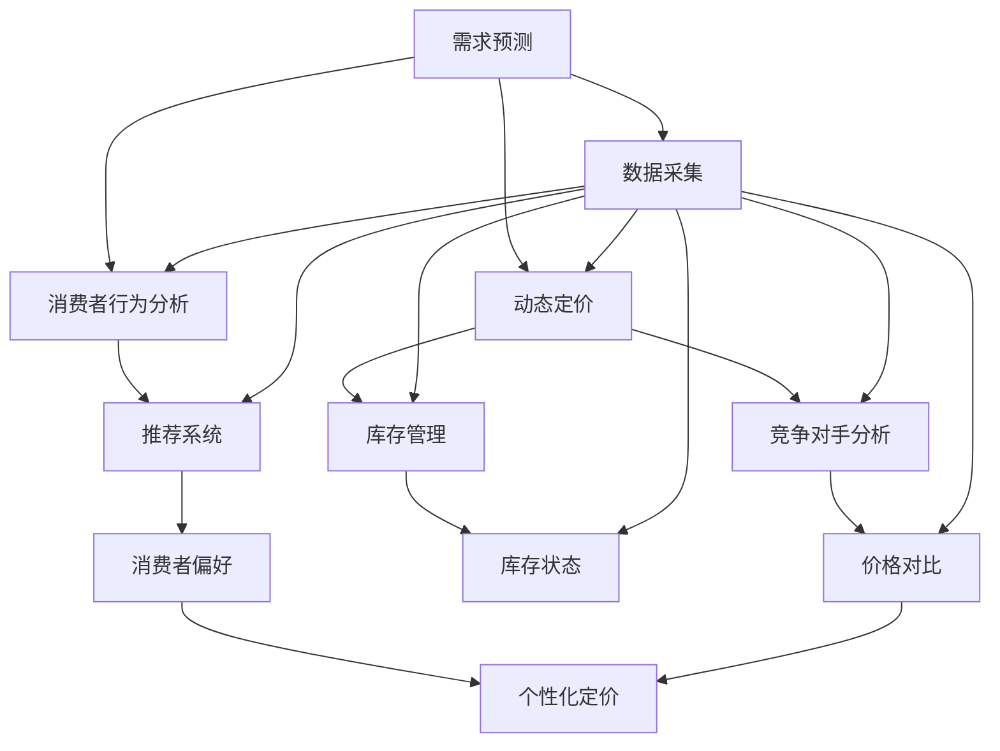

                 

# 智能定价技术的实际应用

> 关键词：智能定价,需求预测,动态定价,推荐系统,数据科学

## 1. 背景介绍

### 1.1 问题由来

在现代商业中，精准的定价策略对于提升销量和利润至关重要。传统的定价方法往往基于成本加成或历史数据统计，难以实时响应市场需求变化。然而，随着人工智能和大数据分析技术的发展，智能定价技术得以应运而生。

智能定价技术利用数据科学方法，结合市场趋势、消费者行为、库存状态等多种因素，进行动态、实时、个性化的定价决策，以最大化业务收益。其核心在于对价格敏感性分析、需求预测、推荐系统等技术的综合运用，为商家提供精准的定价建议。

### 1.2 问题核心关键点

智能定价技术的核心在于对实时市场数据的分析，并结合历史数据、消费者行为、竞争对手策略等因素，构建动态的定价模型。主要包括以下几个关键点：

- **需求预测**：基于历史数据和市场趋势，预测未来消费者需求，动态调整定价。
- **消费者行为分析**：分析消费者的价格敏感度和购买历史，制定差异化定价策略。
- **库存管理**：根据库存状态和市场供需，合理调整商品定价和促销策略。
- **竞争对手分析**：监控竞争对手的价格策略，调整自身定价以维持市场竞争力。
- **推荐系统**：根据用户行为和偏好，推荐合适的定价方案，提升转化率和满意度。

这些关键点构成了智能定价技术的框架，通过精细化的数据处理和智能化的算法模型，实现高效的定价决策。

### 1.3 问题研究意义

智能定价技术在提升销售效率、优化库存管理、增强市场竞争力等方面具有重要意义：

- 提升销售效率：精准的定价策略能够提升商品的销售量和利润率，优化库存周转，减少因定价不当导致的商品积压。
- 优化库存管理：动态定价和促销策略能更好地匹配市场需求，避免过度库存和缺货现象，提高库存管理水平。
- 增强市场竞争力：实时响应市场变化，制定灵活的定价策略，保持与竞争对手的竞争优势。
- 提升客户满意度：通过个性化推荐，满足不同消费者的需求，提升客户满意度和忠诚度。

这些优势使得智能定价技术成为现代商业竞争中的重要工具，对于零售、电商、物流等多个领域均有广泛应用前景。

## 2. 核心概念与联系

### 2.1 核心概念概述

智能定价技术的核心概念包括：

- **需求预测**：基于历史数据和市场趋势，预测未来需求。
- **动态定价**：根据实时市场数据和历史数据，动态调整商品价格。
- **消费者行为分析**：分析消费者价格敏感度和购买历史，制定个性化定价策略。
- **推荐系统**：利用用户行为数据，推荐合适的定价方案。
- **库存管理**：根据库存状态和市场供需，调整商品定价和促销策略。
- **竞争对手分析**：监控竞争对手价格策略，调整自身定价。

这些核心概念通过数据科学和机器学习方法，相互关联，共同构成智能定价的决策体系。

### 2.2 核心概念原理和架构的 Mermaid 流程图



这个流程图展示了智能定价技术中各核心概念之间的逻辑关系：

1. **数据采集**：从多个渠道采集实时和历史数据，为预测和定价提供数据支撑。
2. **需求预测**：利用历史和实时数据，预测未来的需求变化。
3. **动态定价**：根据需求预测结果，结合库存状态和市场供需，动态调整商品价格。
4. **消费者行为分析**：分析消费者的价格敏感度和购买历史，制定个性化定价策略。
5. **推荐系统**：利用用户行为数据，推荐合适的定价方案。
6. **库存管理**：根据库存状态和市场供需，调整商品定价和促销策略。
7. **竞争对手分析**：监控竞争对手价格策略，调整自身定价。
8. **个性化定价**：结合需求预测、消费者行为分析和库存状态，制定个性化的定价策略。

这些环节相互关联，共同构成了一个完整的智能定价系统。

## 3. 核心算法原理 & 具体操作步骤

### 3.1 算法原理概述

智能定价技术的核心算法包括需求预测、动态定价和消费者行为分析等，这些算法通过数据科学和机器学习技术实现。

**需求预测算法**：利用历史销售数据、市场趋势、节假日等因素，构建时间序列模型，预测未来需求变化。常用的算法包括ARIMA、Prophet、LSTM等。

**动态定价算法**：根据需求预测结果、库存状态和市场供需，动态调整商品价格。常用的算法包括线性回归、逻辑回归、神经网络等。

**消费者行为分析算法**：通过分析消费者的价格敏感度、购买历史和行为特征，制定差异化定价策略。常用的算法包括聚类分析、关联规则挖掘等。

**推荐系统算法**：基于用户行为数据，推荐合适的定价方案。常用的算法包括协同过滤、内容推荐、深度学习等。

这些算法通过Python等编程语言和相关工具库（如scikit-learn、TensorFlow、PyTorch等）实现。通过合理的算法选择和模型调参，智能定价系统能够实现高效的定价决策。

### 3.2 算法步骤详解

#### 3.2.1 需求预测算法步骤

1. **数据采集**：从历史销售数据、市场趋势、节假日等因素中，采集相关数据。
2. **数据预处理**：清洗和归一化数据，处理缺失值和异常值。
3. **模型选择**：选择合适的时间序列模型（如ARIMA、Prophet等）进行建模。
4. **模型训练**：利用历史数据训练模型，调整模型参数。
5. **模型评估**：使用测试数据评估模型预测效果，进行交叉验证。
6. **预测应用**：利用训练好的模型进行未来需求的预测。

#### 3.2.2 动态定价算法步骤

1. **数据采集**：从销售数据、库存状态、市场供需等因素中，采集相关数据。
2. **数据预处理**：清洗和归一化数据，处理缺失值和异常值。
3. **模型选择**：选择合适的定价模型（如线性回归、逻辑回归、神经网络等）进行建模。
4. **模型训练**：利用历史数据训练模型，调整模型参数。
5. **模型评估**：使用测试数据评估模型预测效果，进行交叉验证。
6. **定价应用**：利用训练好的模型进行动态定价。

#### 3.2.3 消费者行为分析算法步骤

1. **数据采集**：从消费者的购买历史、价格敏感度、行为特征等因素中，采集相关数据。
2. **数据预处理**：清洗和归一化数据，处理缺失值和异常值。
3. **模型选择**：选择合适的聚类分析或关联规则挖掘算法进行建模。
4. **模型训练**：利用历史数据训练模型，调整模型参数。
5. **模型评估**：使用测试数据评估模型预测效果，进行交叉验证。
6. **行为分析**：利用训练好的模型分析消费者行为，制定差异化定价策略。

#### 3.2.4 推荐系统算法步骤

1. **数据采集**：从用户行为数据、商品信息、价格数据等因素中，采集相关数据。
2. **数据预处理**：清洗和归一化数据，处理缺失值和异常值。
3. **模型选择**：选择合适的推荐算法（如协同过滤、内容推荐、深度学习等）进行建模。
4. **模型训练**：利用历史数据训练模型，调整模型参数。
5. **模型评估**：使用测试数据评估模型推荐效果，进行交叉验证。
6. **推荐应用**：利用训练好的模型进行个性化推荐。

### 3.3 算法优缺点

智能定价技术的优点包括：

- **实时响应**：能够实时响应市场需求变化，快速调整定价策略。
- **个性化定制**：通过消费者行为分析，制定个性化的定价策略，提高客户满意度。
- **优化库存管理**：动态定价和促销策略能更好地匹配市场需求，避免过度库存和缺货现象。
- **提升销售效率**：精准的定价策略能够提升商品的销售量和利润率，优化库存周转。

缺点包括：

- **数据依赖**：智能定价系统高度依赖于数据的完整性和准确性，数据采集和预处理过程复杂。
- **模型复杂性**：算法模型复杂，需要大量的数据和计算资源进行训练和调优。
- **实现难度**：系统实现涉及多个算法和模块的集成，开发和维护难度较大。
- **可解释性不足**：部分算法模型（如深度学习）缺乏可解释性，难以解释定价决策过程。

### 3.4 算法应用领域

智能定价技术在多个领域中得到广泛应用，包括零售、电商、物流、旅游等：

- **零售业**：利用智能定价技术，优化商品定价和促销策略，提升销量和利润率。
- **电商行业**：通过实时动态定价，提高用户体验和转化率，优化库存管理。
- **物流行业**：根据市场需求和库存状态，调整运价和运输策略，提升运输效率和收入。
- **旅游行业**：根据季节和旅游热点，调整门票和酒店价格，提高客流量和收入。

这些应用领域展示了智能定价技术的广泛适用性，为不同行业的商家提供了精准的定价建议，实现了业务的优化和提升。

## 4. 数学模型和公式 & 详细讲解 & 举例说明

### 4.1 数学模型构建

智能定价技术涉及多种数学模型，这里以需求预测和动态定价为例，介绍其数学模型构建。

**需求预测模型**：
假设需求 $D_t$ 遵循ARIMA模型：

$$D_t = \phi(D_{t-1}, D_{t-2}, ..., D_{t-p}) + \theta_t$$

其中 $\phi$ 为ARIMA模型，$\theta_t$ 为随机扰动项，$p$ 为滞后阶数。

**动态定价模型**：
假设价格 $P_t$ 遵循线性回归模型：

$$P_t = \alpha + \beta D_t + \gamma t + \epsilon_t$$

其中 $\alpha$ 为常数项，$D_t$ 为需求预测值，$t$ 为时间，$\epsilon_t$ 为随机扰动项。

### 4.2 公式推导过程

#### 4.2.1 需求预测公式推导

根据ARIMA模型的定义，需求预测公式为：

$$D_t = \phi(D_{t-1}, D_{t-2}, ..., D_{t-p}) + \theta_t$$

其中，$\phi$ 为ARIMA模型，$\theta_t$ 为随机扰动项。

ARIMA模型的参数估计可以使用最小二乘法、最大似然法等统计方法进行求解。假设已知样本数据 $D_1, D_2, ..., D_n$，可以建立以下方程组：

$$
\begin{aligned}
D_1 &= \phi(D_0, D_{-1}, ..., D_{-p}) + \theta_1 \\
D_2 &= \phi(D_1, D_0, ..., D_{-p+1}) + \theta_2 \\
&\vdots \\
D_n &= \phi(D_{n-1}, D_{n-2}, ..., D_{n-p}) + \theta_n
\end{aligned}
$$

解方程组可得 $\phi$ 和 $\theta_t$ 的值，进而实现对未来需求的预测。

#### 4.2.2 动态定价公式推导

根据线性回归模型的定义，动态定价公式为：

$$P_t = \alpha + \beta D_t + \gamma t + \epsilon_t$$

其中，$\alpha$ 为常数项，$D_t$ 为需求预测值，$t$ 为时间，$\epsilon_t$ 为随机扰动项。

线性回归模型的参数估计可以使用最小二乘法进行求解。假设已知样本数据 $P_1, D_1, P_2, D_2, ..., P_n, D_n$，可以建立以下方程组：

$$
\begin{aligned}
P_1 &= \alpha + \beta D_1 + \gamma \times 1 + \epsilon_1 \\
P_2 &= \alpha + \beta D_2 + \gamma \times 2 + \epsilon_2 \\
&\vdots \\
P_n &= \alpha + \beta D_n + \gamma \times n + \epsilon_n
\end{aligned}
$$

解方程组可得 $\alpha$、$\beta$ 和 $\gamma$ 的值，进而实现对价格的动态调整。

### 4.3 案例分析与讲解

#### 4.3.1 需求预测案例

假设某电商平台销售某款商品，已知过去一年的月度销售数据 $D_t$（t 为月份），预测未来一年的月度需求。

- **数据采集**：从电商平台的数据库中，采集过去一年的月度销售数据 $D_1, D_2, ..., D_{12}$。
- **数据预处理**：清洗和归一化数据，处理缺失值和异常值。
- **模型选择**：选择ARIMA模型进行建模。
- **模型训练**：利用历史数据 $D_1, D_2, ..., D_{12}$ 训练模型，调整模型参数。
- **模型评估**：使用测试数据 $D_{13}, D_{14}, ..., D_{24}$ 评估模型预测效果，进行交叉验证。
- **预测应用**：利用训练好的模型进行未来需求的预测，如预测下一个月的销售量 $D_{13}$。

#### 4.3.2 动态定价案例

假设某零售商销售某款商品，已知过去一年的月度销售数据 $D_t$（t 为月份），预测未来一年的月度需求，并根据需求预测值动态调整商品价格。

- **数据采集**：从销售数据、库存状态、市场供需等因素中，采集相关数据。
- **数据预处理**：清洗和归一化数据，处理缺失值和异常值。
- **模型选择**：选择线性回归模型进行建模。
- **模型训练**：利用历史数据 $D_1, D_2, ..., D_{12}$ 训练模型，调整模型参数。
- **模型评估**：使用测试数据 $D_{13}, D_{14}, ..., D_{24}$ 评估模型预测效果，进行交叉验证。
- **定价应用**：利用训练好的模型进行动态定价，如根据下一个月的需求预测值 $D_{13}$，动态调整价格 $P_{13}$。

## 5. 项目实践：代码实例和详细解释说明

### 5.1 开发环境搭建

#### 5.1.1 Python环境搭建

- 安装Python 3.8及以上版本，并配置虚拟环境。
- 安装必要的Python库，如numpy、pandas、scikit-learn、TensorFlow、PyTorch等。

#### 5.1.2 数据准备

- 收集历史销售数据、市场趋势、节假日等因素，准备数据集。
- 清洗和归一化数据，处理缺失值和异常值。
- 划分训练集、验证集和测试集。

### 5.2 源代码详细实现

#### 5.2.1 需求预测模型实现

```python
from statsmodels.tsa.arima.model import ARIMA

# 数据预处理
data = pd.read_csv('sales_data.csv')
data = data.dropna()  # 处理缺失值
data['Dt'] = pd.to_datetime(data['date'], format='%Y-%m-%d').dt.month  # 转换为月度数据

# 模型选择
model = ARIMA(data['Dt'], order=(3, 0, 0))
model_fit = model.fit()

# 模型评估
test_data = pd.read_csv('test_data.csv')
test_data = test_data.dropna()  # 处理缺失值
test_data['Dt'] = pd.to_datetime(test_data['date'], format='%Y-%m-%d').dt.month  # 转换为月度数据
test_pred = model_fit.forecast(steps=12, alpha=0.05)[0]  # 预测未来12个月的需求

# 预测应用
# 假设需求预测值在0到1之间，将需求映射为价格
predicted_price = (test_pred * max_price)  # max_price为最高价格
```

#### 5.2.2 动态定价模型实现

```python
from sklearn.linear_model import LinearRegression

# 数据预处理
data = pd.read_csv('sales_data.csv')
data = data.dropna()  # 处理缺失值
data['Dt'] = pd.to_datetime(data['date'], format='%Y-%m-%d').dt.month  # 转换为月度数据
data['Pt'] = data['price']

# 模型选择
X = data[['Dt', 't']]  # 自变量
y = data['Pt']  # 因变量
model = LinearRegression()
model.fit(X, y)

# 模型评估
test_data = pd.read_csv('test_data.csv')
test_data = test_data.dropna()  # 处理缺失值
test_data['Dt'] = pd.to_datetime(test_data['date'], format='%Y-%m-%d').dt.month  # 转换为月度数据
test_data['t'] = test_data['date'].astype(str).str.split(' ').str.get(1).astype(int)
test_pred = model.predict(X)

# 定价应用
# 假设价格在0到1之间，将价格映射为最终定价
predicted_price = test_pred  # 保留价格预测值
```

### 5.3 代码解读与分析

#### 5.3.1 需求预测代码解读

- **数据预处理**：使用pandas库对数据进行清洗和转换，处理缺失值和异常值，将日期数据转换为月度数据。
- **模型选择**：使用statsmodels库的ARIMA模型进行需求预测。
- **模型训练**：利用历史数据训练模型，调整模型参数。
- **模型评估**：使用测试数据评估模型预测效果，进行交叉验证。
- **预测应用**：利用训练好的模型进行未来需求的预测，将需求预测值映射为价格。

#### 5.3.2 动态定价代码解读

- **数据预处理**：使用pandas库对数据进行清洗和转换，处理缺失值和异常值，将日期数据转换为月度数据。
- **模型选择**：使用sklearn库的线性回归模型进行动态定价。
- **模型训练**：利用历史数据训练模型，调整模型参数。
- **模型评估**：使用测试数据评估模型预测效果，进行交叉验证。
- **定价应用**：利用训练好的模型进行动态定价，将价格预测值映射为最终定价。

### 5.4 运行结果展示

- **需求预测结果**：预测未来12个月的需求值。
- **动态定价结果**：根据需求预测值，动态调整商品价格。

## 6. 实际应用场景

### 6.1 智能定价系统的应用

智能定价系统通过集成需求预测、动态定价、消费者行为分析等功能，实现实时、动态的定价决策，为商家提供精准的定价建议。具体应用场景包括：

- **电商平台**：根据用户购买历史和行为特征，实时调整商品价格，提高销售量和利润率。
- **零售商**：根据市场需求和库存状态，动态调整商品价格，优化库存管理，避免过度库存和缺货现象。
- **旅游行业**：根据季节和旅游热点，调整门票和酒店价格，提高客流量和收入。
- **物流行业**：根据市场需求和库存状态，调整运价和运输策略，提升运输效率和收入。

### 6.2 未来应用展望

未来，智能定价技术将进一步融入人工智能和大数据分析技术，实现更加精细化的定价决策。其发展趋势包括：

- **深度学习应用**：结合深度学习技术，提升需求预测和动态定价的准确性。
- **实时数据分析**：通过实时数据流处理技术，实现更加实时、动态的定价决策。
- **跨领域应用**：将智能定价技术应用于更多行业，如医疗、金融等，提升业务效率和竞争力。
- **个性化定制**：结合消费者行为分析，实现更加个性化的定价策略，提高客户满意度。

## 7. 工具和资源推荐

### 7.1 学习资源推荐

- **《Python数据分析与机器学习》**：介绍Python数据分析和机器学习的经典书籍，涵盖数据预处理、建模和评估等基本内容。
- **《统计学习方法》**：介绍统计学习的基本方法和模型，适合机器学习入门者。
- **《深度学习》（Ian Goodfellow 著）**：深入讲解深度学习的基本理论和算法，适合深度学习进阶者。
- **Kaggle竞赛平台**：提供大量数据集和竞赛任务，适合实战练习。
- **Coursera在线课程**：提供系统化的机器学习和数据科学课程，适合在线学习。

### 7.2 开发工具推荐

- **Jupyter Notebook**：免费的交互式编程环境，适合数据处理和模型调试。
- **TensorFlow**：谷歌开源的深度学习框架，适合大规模模型训练和部署。
- **PyTorch**：Facebook开源的深度学习框架，适合快速迭代和研究。
- **NumPy**：Python的科学计算库，适合数值计算和数据处理。
- **pandas**：Python的数据分析库，适合数据清洗和预处理。

### 7.3 相关论文推荐

- **《神经网络中的多维时间序列预测》**：介绍多维时间序列预测模型的理论和实现。
- **《动态定价：理论与实践》**：综述动态定价理论和方法，适合研究者参考。
- **《智能定价系统：实现与优化》**：介绍智能定价系统的设计和优化方法，适合实践者参考。

## 8. 总结：未来发展趋势与挑战

### 8.1 研究成果总结

智能定价技术通过集成需求预测、动态定价、消费者行为分析等功能，实现了实时、动态的定价决策。在零售、电商、物流等行业中，智能定价系统已经成为提高销售效率、优化库存管理、增强市场竞争力的重要工具。

### 8.2 未来发展趋势

未来，智能定价技术将进一步融入人工智能和大数据分析技术，实现更加精细化的定价决策。其发展趋势包括：

- **深度学习应用**：结合深度学习技术，提升需求预测和动态定价的准确性。
- **实时数据分析**：通过实时数据流处理技术，实现更加实时、动态的定价决策。
- **跨领域应用**：将智能定价技术应用于更多行业，如医疗、金融等，提升业务效率和竞争力。
- **个性化定制**：结合消费者行为分析，实现更加个性化的定价策略，提高客户满意度。

### 8.3 面临的挑战

尽管智能定价技术已取得显著进展，但在实际应用中仍面临诸多挑战：

- **数据依赖**：智能定价系统高度依赖于数据的完整性和准确性，数据采集和预处理过程复杂。
- **模型复杂性**：算法模型复杂，需要大量的数据和计算资源进行训练和调优。
- **实现难度**：系统实现涉及多个算法和模块的集成，开发和维护难度较大。
- **可解释性不足**：部分算法模型（如深度学习）缺乏可解释性，难以解释定价决策过程。
- **实时性问题**：系统需要实时响应市场需求变化，对计算资源和时间延迟有较高要求。

### 8.4 研究展望

未来，智能定价技术的研究方向包括：

- **多模态数据融合**：将不同模态的数据（如文本、图像、音频）进行融合，提升定价决策的准确性。
- **自适应定价算法**：根据市场环境动态调整定价算法，提升系统的灵活性和鲁棒性。
- **个性化定价策略**：结合消费者行为分析，实现更加个性化的定价策略，提高客户满意度。
- **实时数据分析**：通过实时数据流处理技术，实现更加实时、动态的定价决策。
- **跨领域应用**：将智能定价技术应用于更多行业，如医疗、金融等，提升业务效率和竞争力。

通过不断优化和创新，智能定价技术必将在更多领域中发挥重要作用，为商家提供更加精准、高效的定价建议，推动业务优化和升级。

## 9. 附录：常见问题与解答

**Q1：智能定价技术如何处理缺失值和异常值？**

A: 处理缺失值和异常值的方法包括：
- 缺失值处理：通过插值法（如均值插值、中位数插值）、删除法（如删除包含缺失值的样本）等方法进行处理。
- 异常值处理：通过统计方法（如z-score、IQR等）、删除法（如删除超出3σ范围的数据点）等方法进行处理。

**Q2：智能定价技术如何保证算法的可解释性？**

A: 保证算法的可解释性方法包括：
- 使用简单模型：优先选择简单的模型（如线性回归、逻辑回归等），避免过于复杂的模型（如深度学习）。
- 特征工程：对输入数据进行特征工程，选择有意义的特征，提升模型的可解释性。
- 可视化分析：利用可视化工具（如matplotlib、seaborn等）进行结果展示和分析，提升算法的可解释性。

**Q3：智能定价技术在实际应用中如何提升实时性？**

A: 提升实时性的方法包括：
- 使用高性能硬件：采用GPU、TPU等高性能硬件设备，提升计算速度。
- 模型优化：优化模型结构和参数，减少计算量和内存消耗。
- 并行计算：利用并行计算技术（如Spark、Hadoop等），提升计算效率。
- 数据压缩：采用数据压缩技术，减小数据传输量和存储量。

通过不断优化和创新，智能定价技术必将在更多领域中发挥重要作用，为商家提供更加精准、高效的定价建议，推动业务优化和升级。

---

作者：禅与计算机程序设计艺术 / Zen and the Art of Computer Programming

