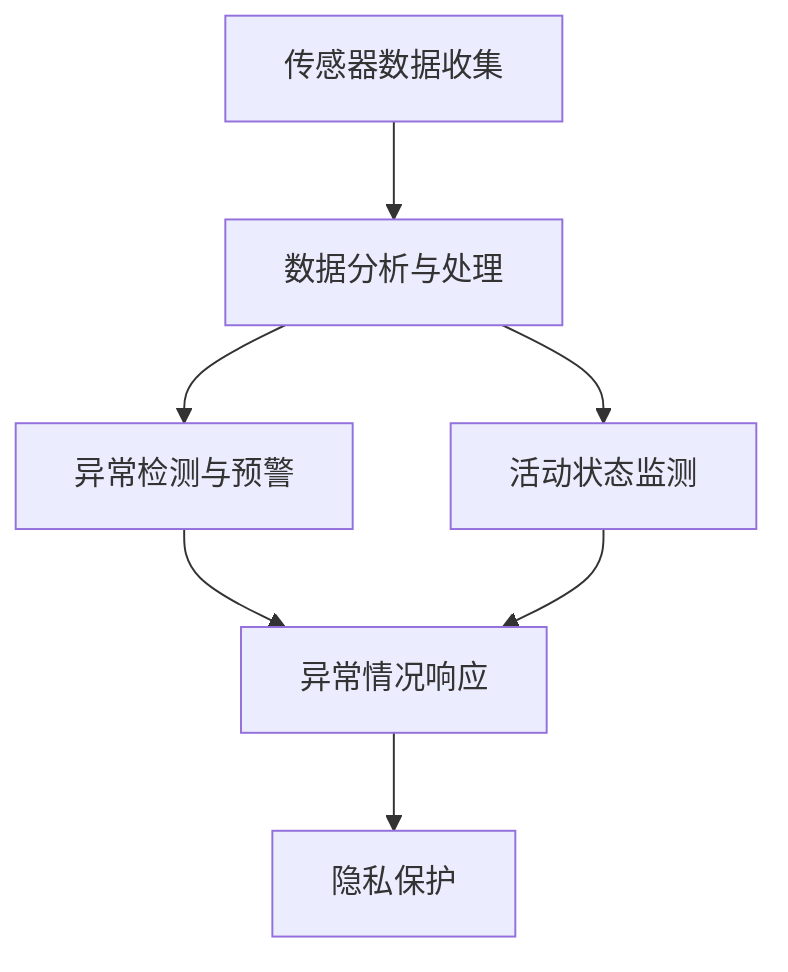

                 

## 1. 背景介绍

智能家居技术正迅速发展，通过各种传感器、摄像头等设备，将家庭生活数据实时收集并分析，从而实现自动化控制和智能化管理。然而，随着家庭生活场景的多样化，对数据的监控和分析提出了更高的要求，包括实时性、精确性和隐私保护等。在这其中，智能监控和注意力管理技术扮演了重要角色。

智能监控（Smart Monitoring）是通过多种传感器数据实时监控家庭环境，识别异常情况并发出警报，如烟雾报警、火灾报警、气体泄漏等。而注意力管理（Attention Management）则是针对家庭成员的活动状态进行持续监测，如儿童监管、老人看护等，以确保家庭安全。本文将深入探讨智能监控和注意力管理的原理和应用，为智能家居的智能化发展提供指导。

## 2. 核心概念与联系

### 2.1 核心概念概述

智能监控和注意力管理涉及多个核心概念，主要包括：

- **传感器数据收集**：智能家居中的传感器如温度、湿度、光线、声音、运动等传感器，通过数据采集器收集家庭环境数据。
- **数据分析与处理**：利用机器学习算法，对传感器数据进行实时处理和分析，识别异常情况。
- **异常检测与预警**：基于数据特征模型，实时监测数据变化，检测异常情况，并发出警报。
- **活动状态监测**：通过摄像头、位置追踪等技术，实时监测家庭成员的活动状态，并进行行为分析。
- **隐私保护**：在监控和分析过程中，确保数据隐私和安全，避免数据泄露和滥用。

### 2.2 核心概念原理和架构的 Mermaid 流程图



此图展示了智能监控和注意力管理的核心流程：传感器数据通过收集和处理，先经过异常检测和预警，再结合活动状态监测，最后通过隐私保护措施，确保数据安全，对异常情况进行响应。

## 3. 核心算法原理 & 具体操作步骤

### 3.1 算法原理概述

智能监控和注意力管理的核心算法包括异常检测和活动状态监测，其主要原理如下：

- **异常检测**：使用统计学方法或机器学习算法，如均值漂移、孤立森林、KNN等，从历史数据中构建数据特征模型。实时数据通过此模型，计算异常概率，当异常概率超过预设阈值时，发出警报。
- **活动状态监测**：利用计算机视觉和深度学习技术，如卷积神经网络(CNN)、循环神经网络(RNN)等，通过摄像头拍摄的实时视频或图片，提取关键特征，识别家庭成员的活动状态，如行走、坐姿、面部表情等。

### 3.2 算法步骤详解

#### 3.2.1 异常检测算法

**步骤1**：收集并预处理传感器数据。传感器数据可能包含噪声，需要通过滤波、归一化等方法进行预处理。

**步骤2**：构建数据特征模型。基于历史数据，选择合适的统计学方法或机器学习算法，构建数据特征模型。如使用孤立森林算法，计算每个数据点的异常概率。

**步骤3**：实时数据监控与分析。实时采集传感器数据，通过数据特征模型计算异常概率，当概率超过阈值时，发出警报。

**步骤4**：警报响应与处理。根据警报类型，启动相应的响应措施，如火灾报警启动喷水系统，烟雾报警关闭通风系统等。

#### 3.2.2 活动状态监测算法

**步骤1**：安装摄像头和数据采集器。在家庭主要活动区域安装摄像头，并通过网络传输视频数据。

**步骤2**：实时视频处理。使用计算机视觉技术，如CNN、RNN等，对实时视频进行处理，提取关键特征。

**步骤3**：活动状态识别。通过特征提取和模型训练，识别家庭成员的活动状态，如行走、坐姿、面部表情等。

**步骤4**：行为分析与反馈。结合历史数据，进行行为分析和反馈，调整模型参数和警报阈值，确保监测效果。

### 3.3 算法优缺点

**优点**：

- 实时性高。传感器和摄像头可以实时收集和分析数据，实现快速响应。
- 准确性高。基于机器学习和深度学习技术，能够精确识别异常和行为状态。
- 应用广泛。适用于火灾、烟雾、煤气泄漏等多种异常情况和儿童监管、老人看护等场景。

**缺点**：

- 依赖硬件。传感器和摄像头的安装、维护成本较高，且依赖硬件设备的性能。
- 数据隐私。数据采集和存储可能涉及隐私问题，需进行严格的隐私保护。
- 模型维护。需要定期更新模型参数和调整算法，以适应不同家庭环境和生活方式。

### 3.4 算法应用领域

智能监控和注意力管理技术广泛应用于以下领域：

- **家居安全**：监测火灾、烟雾、煤气泄漏等异常情况，及时发出警报。
- **老人看护**：实时监测老人活动状态，预防跌倒、走失等风险。
- **儿童监管**：通过活动状态识别，及时发现儿童不安全行为，如爬高、开关危险物品等。
- **健康监测**：监测家庭成员的睡眠质量、呼吸状况等健康数据，及时发现异常。
- **环境监测**：监测室内空气质量、温度、湿度等环境参数，确保舒适和安全。

## 4. 数学模型和公式 & 详细讲解 & 举例说明

### 4.1 数学模型构建

异常检测算法中的核心模型为孤立森林（Isolation Forest），其数学模型如下：

设数据集 $D = \{(x_1, y_1), (x_2, y_2), ..., (x_n, y_n)\}$，其中 $x_i$ 为特征向量，$y_i$ 为异常标识（0表示正常，1表示异常）。

孤立森林通过随机选择特征和特征值，将数据空间分割成多个子空间，每个子空间的划分路径长度和平均划分路径长度用于衡量异常程度。具体公式如下：

$$
\text{PathLength}_i = \sum_{j=1}^{m} d_j \text{Depth}_j
$$

其中 $d_j$ 为第 $j$ 个特征的取值，$\text{Depth}_j$ 为该特征值分割数据所形成的子空间的深度。

### 4.2 公式推导过程

孤立森林的异常检测过程包含如下步骤：

1. 随机选择 $k$ 个特征和特征值，形成一个划分点。
2. 计算每个数据点相对于划分点的路径长度。
3. 选择路径长度最大的数据点作为异常点，并删除其所在子空间。
4. 重复步骤1-3，直到所有数据点被删除或异常点数量达到预设值。

通过上述步骤，孤立森林能够快速识别数据中的异常点，适用于实时异常检测。

### 4.3 案例分析与讲解

**案例1**：火灾报警系统

- **数据收集**：火灾报警系统收集烟雾传感器、温度传感器数据。
- **特征模型构建**：使用孤立森林算法，计算每个数据点的异常概率。
- **实时监控**：当检测到异常概率超过预设阈值时，发出火灾警报。
- **响应处理**：启动自动喷水系统，并通知物业人员。

**案例2**：老人看护系统

- **数据收集**：摄像头记录老人的活动视频，传感器收集环境参数。
- **活动状态监测**：通过计算机视觉技术，识别老人的行走、坐姿等活动状态。
- **行为分析**：分析老人的行为数据，判断其活动是否异常。
- **反馈调整**：根据行为分析结果，调整监测参数，优化老人看护效果。

## 5. 项目实践：代码实例和详细解释说明

### 5.1 开发环境搭建

智能监控和注意力管理的开发环境包括：

1. **传感器数据采集器**：如Arduino、Raspberry Pi等设备，用于采集传感器数据。
2. **数据传输平台**：如IoT平台（如MQTT、HTTP），用于传输传感器数据到云端。
3. **云计算平台**：如AWS、Google Cloud等，用于数据存储和处理。
4. **可视化界面**：如Flutter、React Native等，用于展示监测结果和报警信息。

### 5.2 源代码详细实现

**示例代码1**：Python实现孤立森林算法

```python
import numpy as np
from sklearn.ensemble import IsolationForest

# 构建孤立森林模型
clf = IsolationForest(n_estimators=100, contamination=0.1, random_state=42)

# 训练模型
X_train = np.array([[1, 2], [3, 4], [5, 6]])
clf.fit(X_train)

# 预测数据点
X_test = np.array([[7, 8]])
prediction = clf.predict(X_test)

print(prediction)
```

**示例代码2**：Python实现计算机视觉活动状态监测

```python
import cv2
import numpy as np
from keras.applications import MobileNet

# 加载模型
model = MobileNet(weights='imagenet')

# 处理摄像头视频流
cap = cv2.VideoCapture(0)
while cap.isOpened():
    ret, frame = cap.read()
    frame = cv2.cvtColor(frame, cv2.COLOR_BGR2RGB)
    
    # 提取特征
    x = model.predict(frame)
    y = model.predict_classes(frame)

    # 处理特征
    x = np.argmax(x)
    y = np.argmax(y)
    
    # 输出状态
    print(f'状态：{x}, 行为：{y}')

    cv2.imshow('frame', frame)
    if cv2.waitKey(1) & 0xFF == ord('q'):
        break

cap.release()
cv2.destroyAllWindows()
```

### 5.3 代码解读与分析

**孤立森林算法**：

- `IsolationForest` 类：实现孤立森林算法，包含参数 `n_estimators`（树的数量）、`contamination`（异常比例）和 `random_state`（随机种子）。
- `fit` 方法：训练孤立森林模型，计算数据点的异常概率。
- `predict` 方法：预测数据点的异常标识，返回 `-1` 表示异常，`1` 表示正常。

**计算机视觉活动状态监测**：

- `MobileNet` 模型：加载MobileNet模型，用于提取视频帧的特征。
- `VideoCapture` 类：实现摄像头视频流的读取。
- `predict` 和 `predict_classes` 方法：提取特征并预测行为状态。
- `argmax` 函数：从特征中提取最高概率的类别。

### 5.4 运行结果展示

**孤立森林算法**：

- 训练模型
- 预测异常点

**计算机视觉活动状态监测**：

- 实时视频流
- 提取特征
- 识别行为状态

## 6. 实际应用场景

智能监控和注意力管理在以下场景中得到了广泛应用：

- **智能门锁**：通过传感器数据监测家庭出入情况，防止未经授权的人员进入。
- **智能窗帘**：通过温度和光线传感器数据，自动调整窗帘开启时间。
- **智能照明**：通过光线传感器数据，自动调节灯光亮度，确保舒适和安全。
- **智能空调**：通过温度和湿度传感器数据，自动调节空调温度和湿度，提高舒适度。
- **智能门铃**：通过摄像头和声音传感器数据，实时监控门口情况，及时响应访客。

## 7. 工具和资源推荐

### 7.1 学习资源推荐

- **书籍推荐**：
  - 《机器学习》（周志华著）：全面介绍机器学习算法和应用。
  - 《深度学习》（Goodfellow等著）：深度学习算法和应用实践。
  - 《计算机视觉：算法与应用》（J. D. Fulkerson等著）：计算机视觉算法和应用。

- **在线课程**：
  - Coursera上的《机器学习基础》课程。
  - Udacity上的《深度学习专项课程》。
  - edX上的《计算机视觉与深度学习》课程。

### 7.2 开发工具推荐

- **传感器开发工具**：
  - Arduino IDE：用于开发Arduino设备的代码。
  - PyCharm：用于Python开发，支持数据分析和机器学习算法开发。
  - MATLAB：用于数据处理和信号分析。

- **数据传输工具**：
  - MQTT：用于物联网设备间的数据通信。
  - HTTP：用于设备与云端的通信。

- **云平台**：
  - AWS IoT Core：实现物联网设备与云平台的连接。
  - Google Cloud IoT Core：实现设备与云平台的连接。
  - Azure IoT Hub：实现物联网设备与云平台的连接。

### 7.3 相关论文推荐

- **异常检测**：
  - 《Isolation Forest》（Liu等，2008）。
  - 《Anomaly Detection Using Isolation Forest》（Elbounouar等，2019）。

- **活动状态监测**：
  - 《Human Activity Recognition Using Wearable Sensors》（Madhuwela等，2016）。
  - 《Activity Recognition in Wearable Systems》（Wang等，2017）。

## 8. 总结：未来发展趋势与挑战

### 8.1 研究成果总结

智能监控和注意力管理技术在智能家居领域取得了显著进展，通过传感器数据和计算机视觉技术，实现了家庭环境的实时监测和行为分析。然而，技术仍有不足，需要进一步优化和发展。

### 8.2 未来发展趋势

- **多模态融合**：结合传感器数据、摄像头数据和物联网数据，实现更全面、精确的家庭环境监测。
- **人工智能融合**：利用深度学习技术，提高异常检测和行为识别的准确性。
- **隐私保护**：采用加密技术和隐私计算方法，确保数据安全和隐私保护。
- **边缘计算**：在家庭设备端实现数据处理和分析，减少云平台数据传输和存储压力。

### 8.3 面临的挑战

- **数据集成**：不同传感器和设备的数据格式和协议差异，导致数据集成复杂。
- **计算资源**：实时处理大规模传感器数据和视频数据需要高性能计算资源。
- **隐私保护**：数据采集和存储过程中，需要严格保护用户隐私。
- **模型可解释性**：需要提高算法的可解释性，增强用户信任。

### 8.4 研究展望

- **多模态数据融合**：探索多模态数据融合技术，实现更全面、精确的家庭环境监测。
- **边缘计算与云计算结合**：实现边缘计算和云计算的结合，提高数据处理效率和隐私保护。
- **人工智能与传统技术结合**：结合传统技术，如专家规则、逻辑推理，提高算法的可靠性和可解释性。

## 9. 附录：常见问题与解答

**Q1**：如何降低数据集成复杂度？

**A1**：采用统一的通信协议和数据格式，如MQTT、OPC UA等，简化数据集成。

**Q2**：如何提高数据处理效率？

**A2**：在家庭设备端实现边缘计算，减少数据传输和存储压力。

**Q3**：如何保护用户隐私？

**A3**：采用加密技术和隐私计算方法，确保数据安全和隐私保护。

**Q4**：如何提高算法的可解释性？

**A4**：利用可解释性技术，如LIME、SHAP等，增强算法可解释性。

**Q5**：如何实现多模态数据融合？

**A5**：采用深度学习技术，如多任务学习、联合训练等，实现多模态数据融合。

**Q6**：如何在家庭设备端实现边缘计算？

**A6**：在家庭设备上安装嵌入式计算平台，如Raspberry Pi，实现本地数据处理和分析。

**Q7**：如何在云平台实现人工智能功能？

**A7**：利用云平台提供的深度学习服务，如AWS SageMaker、Google Cloud AI等，实现人工智能功能。

**Q8**：如何在实际应用中优化算法？

**A8**：通过模型调优、参数调整和算法优化，提高算法的准确性和效率。

---

作者：禅与计算机程序设计艺术 / Zen and the Art of Computer Programming

