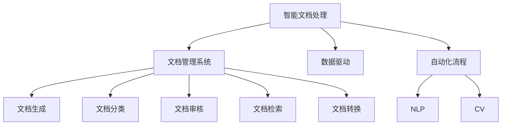

                 

# 智能文档处理在办公自动化中的应用

> 关键词：智能文档处理, 办公自动化, 文档管理系统, 数据驱动, 自动化流程, 自然语言处理(NLP), 计算机视觉(CV)

## 1. 背景介绍

### 1.1 问题由来
随着数字化转型的不断深入，企业的业务流程和管理模式也在发生深刻的变革。传统的纸质文档管理不仅耗时耗力，还易发生遗失和损坏。如何高效、安全地管理文档，已成为企业提升运营效率、降低成本的关键。

在信息技术的高速发展下，智能文档处理技术应运而生。智能文档处理系统利用先进的数据技术和人工智能算法，自动完成文档的生成、分类、审核、检索等任务，极大提升了办公自动化水平。

### 1.2 问题核心关键点
智能文档处理的核心在于通过自动化技术实现文档的智能管理和应用。关键点包括：
- 文档自动生成：根据输入数据，自动生成标准化文档，如报告、合同等。
- 文档分类和归档：自动将文档归类到合适的文件夹中，并进行归档管理。
- 文档审核和校对：通过自然语言处理和计算机视觉技术，自动校验文档的合规性和正确性。
- 文档检索和查询：利用搜索算法快速定位文档，满足用户的检索需求。
- 文档转换和格式转换：自动将不同格式的文档转换为统一的格式，便于协同工作。

智能文档处理系统的目标是实现文档管理全流程自动化，减少人工干预，提高工作效率和质量，为企业的数字化转型提供有力支持。

## 2. 核心概念与联系

### 2.1 核心概念概述

为更好地理解智能文档处理的原理和应用，本节将介绍几个核心概念：

- 智能文档处理(Intelligent Document Processing, IDP)：利用人工智能和数据科学技术，实现文档的自动化处理和管理。包括文档生成、分类、审核、检索等环节。
- 文档管理系统(Document Management System, DMS)：用于管理和存储文档的自动化系统，支持文档的创建、传输、存储、检索和删除等操作。
- 数据驱动(Driven by Data)：通过数据来驱动决策和运营，是智能文档处理的基础。
- 自动化流程(Automated Processes)：利用先进技术实现流程的自动化，减少人为干预，提高效率。
- 自然语言处理(Natural Language Processing, NLP)：处理和理解人类语言的技术，广泛应用于文档的生成、分类和审核中。
- 计算机视觉(Computer Vision, CV)：使计算机能够"看"和理解图像和视频的技术，常用于文档的转换和格式校验。

这些核心概念之间的逻辑关系可以通过以下Mermaid流程图来展示：



这个流程图展示智能文档处理的核心概念及其之间的关系：

1. 智能文档处理依赖于文档管理系统，用于存储和管理文档。
2. 数据驱动是智能文档处理的基础，提供高质量的数据支持。
3. 自动化流程通过先进技术实现文档处理全流程自动化。
4. 自然语言处理和计算机视觉技术分别用于文档的文本处理和图像处理。

## 3. 核心算法原理 & 具体操作步骤
### 3.1 算法原理概述

智能文档处理的算法原理基于数据科学和人工智能技术的深度融合。具体来说，包括以下几个关键环节：

- **文档生成**：利用自然语言处理技术，根据输入数据自动生成标准化文档。常用算法包括模板填充、基于生成模型的文本生成等。
- **文档分类和归档**：利用机器学习和深度学习技术，对文档进行自动分类和归档。常用算法包括聚类、决策树、神经网络等。
- **文档审核和校对**：通过自然语言处理和计算机视觉技术，自动校验文档的合规性和正确性。常用算法包括命名实体识别、关系抽取、OCR等。
- **文档检索和查询**：利用信息检索技术，快速定位和检索文档。常用算法包括倒排索引、向量空间模型等。
- **文档转换和格式校验**：利用计算机视觉和图像处理技术，自动将不同格式的文档转换为统一的格式，并进行格式校验。常用算法包括图像处理、OCR等。

这些算法环节紧密结合，构成智能文档处理的完整框架，可以实现文档管理全流程的自动化。

### 3.2 算法步骤详解

智能文档处理的算法步骤一般包括以下几个关键步骤：

**Step 1: 数据预处理**
- 收集和清洗文档数据，去除冗余和噪声。
- 对文档进行结构化处理，如分词、命名实体识别等。

**Step 2: 文档生成**
- 根据输入数据，利用模板填充或生成模型自动生成文档。
- 通过自然语言处理技术，优化文档的语言表达和格式。

**Step 3: 文档分类和归档**
- 利用机器学习算法，对文档进行自动分类。
- 根据分类结果，将文档自动归档到相应的文件夹中。

**Step 4: 文档审核和校对**
- 利用自然语言处理技术，自动校验文档的语言表达和逻辑结构。
- 利用计算机视觉技术，对文档的图像和格式进行自动校验。

**Step 5: 文档检索和查询**
- 利用信息检索技术，构建文档索引库。
- 根据用户查询，快速定位和检索相关文档。

**Step 6: 文档转换和格式校验**
- 利用图像处理和OCR技术，将不同格式的文档转换为统一的格式。
- 对转换后的文档进行格式校验，确保文档的完整性和正确性。

以上是智能文档处理的算法步骤，每一步都需要利用先进的技术和算法，以实现文档管理的自动化和智能化。

### 3.3 算法优缺点

智能文档处理算法具有以下优点：
- 自动化程度高。通过算法自动化处理文档，减少了人工干预，提升了效率。
- 处理速度快。利用先进技术和算法，实现了文档处理的快速响应。
- 质量高。通过多轮校验和校正，保证了文档的合规性和正确性。

同时，这些算法也存在一些局限性：
- 依赖数据质量。数据预处理和清洗过程需要高质量的数据，否则算法效果会大打折扣。
- 需要较多计算资源。算法实现往往需要较大的计算资源支持，特别是在大规模文档处理时。
- 算法复杂度高。一些先进的算法，如深度学习，需要较大的模型和训练数据，部署和优化难度较大。
- 缺乏弹性。算法设计较为固定，不易根据业务需求进行灵活调整。

尽管存在这些局限性，但智能文档处理算法在文档管理自动化中展现了巨大优势，得到了广泛应用。未来相关研究的重点在于如何进一步降低计算资源依赖，提高算法的弹性，增强文档处理的多样性和灵活性。

### 3.4 算法应用领域

智能文档处理算法广泛应用于以下领域：

- **企业文档管理**：用于处理企业日常运营中的各种文档，如合同、报告、财务报表等。
- **政府文书处理**：用于处理政府部门的各种文书，如法规文件、公文、报告等。
- **医疗文档处理**：用于处理医疗机构的各类文档，如病历、医疗报告等。
- **法律文书处理**：用于处理法律文件，如合同、判决书、诉状等。
- **教育文档处理**：用于处理教育机构的各类文档，如学生档案、成绩单等。

此外，智能文档处理技术还在法律咨询、金融审计、科研文献管理等多个领域得到了应用，为各行业的数字化转型提供了有力支持。

## 4. 数学模型和公式 & 详细讲解 & 举例说明

### 4.1 数学模型构建

本节将使用数学语言对智能文档处理的算法流程进行更加严格的刻画。

假设输入文档为 $D=\{x_1, x_2, \dots, x_n\}$，其中每个文档 $x_i$ 包含文本 $t_i$ 和图像 $v_i$。智能文档处理的目标是自动完成文档生成、分类、审核、检索、转换等任务。

**文档生成**：利用自然语言处理技术，自动生成文档。设 $G$ 为文档生成模型，其输出为 $y_i = G(t_i)$。常用的模型包括：
- 模板填充：$y_i = \text{TemplateFill}(t_i)$
- 基于生成模型的文本生成：$y_i = G_{\theta}(t_i)$，其中 $\theta$ 为模型参数。

**文档分类和归档**：利用机器学习算法，自动分类和归档文档。设 $C$ 为分类模型，其输出为 $c_i = C(t_i, v_i)$，表示文档 $x_i$ 的分类结果。常用的分类算法包括：
- 聚类算法：$C = KMeans$
- 决策树：$C = DecisionTree$
- 神经网络：$C = NeuralNetwork$

**文档审核和校对**：利用自然语言处理和计算机视觉技术，自动校验文档。设 $A$ 为审核模型，其输出为 $a_i = A(t_i, v_i)$，表示文档 $x_i$ 的合规性和正确性。常用的审核算法包括：
- 命名实体识别：$A_{NER} = NER$
- 关系抽取：$A_{REL} = RelationExtraction$
- OCR：$A_{OCR} = OCR$

**文档检索和查询**：利用信息检索技术，快速定位和检索文档。设 $I$ 为检索模型，其输出为 $i_i = I(q_i, x_i)$，表示文档 $x_i$ 与查询 $q_i$ 的匹配程度。常用的检索算法包括：
- 倒排索引：$I = InvertedIndex$
- 向量空间模型：$I = VectorSpaceModel$

**文档转换和格式校验**：利用图像处理和OCR技术，自动将不同格式的文档转换为统一的格式。设 $T$ 为转换模型，其输出为 $t_i' = T(x_i)$，表示文档 $x_i$ 的转换结果。常用的转换算法包括：
- 图像处理：$T_{IMG} = ImageProcessing$
- OCR：$T_{OCR} = OCR$

### 4.2 公式推导过程

以下我们以文本分类的算法推导为例，展示智能文档处理的数学模型。

假设训练数据集为 $\{(x_i, c_i)\}_{i=1}^N$，其中 $x_i$ 为文本，$c_i$ 为分类标签。设 $C$ 为分类模型，其参数为 $\theta$，训练目标为：

$$
\min_{\theta} \sum_{i=1}^N \ell(C(t_i; \theta), c_i)
$$

其中 $\ell$ 为损失函数，如交叉熵损失。分类模型的输出为 $c_i = C(t_i; \theta)$，表示模型对文本 $t_i$ 的分类结果。

设 $C = NeuralNetwork$，则分类模型的损失函数为：

$$
\ell(C(t_i; \theta), c_i) = -\log P(c_i|t_i; \theta) = -\log \frac{e^{y_i \cdot \theta^T}}{\sum_{j=1}^K e^{y_j \cdot \theta^T}}
$$

其中 $K$ 为类别数，$y_i$ 为类别向量，$\theta$ 为模型参数。

对于文档生成，设 $G = \text{TemplateFill}$，则文档生成模型的输出为：

$$
y_i = \text{TemplateFill}(t_i) = \{t_i\} \cup \{模板填充的结果\}
$$

对于文档审核，设 $A = \{NER, REL, OCR\}$，则审核模型的输出为：

$$
a_i = \{a_{NER}, a_{REL}, a_{OCR}\} = \{NER(t_i), REL(t_i), OCR(v_i)\}
$$

对于文档检索，设 $I = \{InvertedIndex, VectorSpaceModel\}$，则检索模型的输出为：

$$
i_i = \{I(q_i, x_i)\} = \{InvertedIndex(q_i, x_i), VectorSpaceModel(q_i, x_i)\}
$$

对于文档转换，设 $T = \{ImageProcessing, OCR\}$，则转换模型的输出为：

$$
t_i' = \{T(x_i)\} = \{ImageProcessing(x_i), OCR(v_i)\}
$$

以上公式展示了智能文档处理的基本算法流程和数学模型，为进一步开发和优化算法提供了理论基础。

### 4.3 案例分析与讲解

以一家医疗机构的文档处理为例，展示智能文档处理的实际应用：

**文档生成**：医院需要定期生成各类报告，如门诊记录、住院病历等。利用自然语言处理技术，自动根据医生的输入数据生成标准化的报告。

**文档分类和归档**：将生成的报告自动分类，如门诊报告、住院报告等，并自动归档到相应的文件夹中。

**文档审核和校对**：自动校验报告的语言表达和逻辑结构，确保合规性和正确性。

**文档检索和查询**：医生可以快速检索出所需的病历报告，帮助诊疗。

**文档转换和格式校验**：将不同类型的报告（如纸质、电子）转换为统一的电子格式，并进行格式校验。

通过智能文档处理，医院实现了文档管理的自动化和智能化，大幅提升了工作效率和数据安全。

## 5. 项目实践：代码实例和详细解释说明
### 5.1 开发环境搭建

在进行智能文档处理实践前，我们需要准备好开发环境。以下是使用Python进行PyTorch开发的环境配置流程：

1. 安装Anaconda：从官网下载并安装Anaconda，用于创建独立的Python环境。

2. 创建并激活虚拟环境：
```bash
conda create -n pytorch-env python=3.8 
conda activate pytorch-env
```

3. 安装PyTorch：根据CUDA版本，从官网获取对应的安装命令。例如：
```bash
conda install pytorch torchvision torchaudio cudatoolkit=11.1 -c pytorch -c conda-forge
```

4. 安装TensorFlow：
```bash
pip install tensorflow
```

5. 安装各类工具包：
```bash
pip install numpy pandas scikit-learn matplotlib tqdm jupyter notebook ipython
```

完成上述步骤后，即可在`pytorch-env`环境中开始智能文档处理的实践。

### 5.2 源代码详细实现

这里我们以文本分类任务为例，展示使用PyTorch实现智能文档处理的代码实现。

首先，定义文本分类任务的数据处理函数：

```python
from torch.utils.data import Dataset
import torch

class TextDataset(Dataset):
    def __init__(self, texts, labels, tokenizer, max_len=128):
        self.texts = texts
        self.labels = labels
        self.tokenizer = tokenizer
        self.max_len = max_len
        
    def __len__(self):
        return len(self.texts)
    
    def __getitem__(self, item):
        text = self.texts[item]
        label = self.labels[item]
        
        encoding = self.tokenizer(text, return_tensors='pt', max_length=self.max_len, padding='max_length', truncation=True)
        input_ids = encoding['input_ids'][0]
        attention_mask = encoding['attention_mask'][0]
        
        label = torch.tensor(label, dtype=torch.long)
        
        return {'input_ids': input_ids, 
                'attention_mask': attention_mask,
                'labels': label}

# 加载文本数据和标签
tokenizer = BertTokenizer.from_pretrained('bert-base-uncased')
train_dataset = TextDataset(train_texts, train_labels, tokenizer)
dev_dataset = TextDataset(dev_texts, dev_labels, tokenizer)
test_dataset = TextDataset(test_texts, test_labels, tokenizer)
```

然后，定义模型和优化器：

```python
from transformers import BertForTokenClassification, AdamW

model = BertForTokenClassification.from_pretrained('bert-base-uncased', num_labels=10)

optimizer = AdamW(model.parameters(), lr=2e-5)
```

接着，定义训练和评估函数：

```python
from torch.utils.data import DataLoader
from tqdm import tqdm
from sklearn.metrics import accuracy_score, precision_score, recall_score, f1_score

device = torch.device('cuda') if torch.cuda.is_available() else torch.device('cpu')
model.to(device)

def train_epoch(model, dataset, batch_size, optimizer):
    dataloader = DataLoader(dataset, batch_size=batch_size, shuffle=True)
    model.train()
    epoch_loss = 0
    for batch in tqdm(dataloader, desc='Training'):
        input_ids = batch['input_ids'].to(device)
        attention_mask = batch['attention_mask'].to(device)
        labels = batch['labels'].to(device)
        model.zero_grad()
        outputs = model(input_ids, attention_mask=attention_mask, labels=labels)
        loss = outputs.loss
        epoch_loss += loss.item()
        loss.backward()
        optimizer.step()
    return epoch_loss / len(dataloader)

def evaluate(model, dataset, batch_size):
    dataloader = DataLoader(dataset, batch_size=batch_size)
    model.eval()
    preds, labels = [], []
    with torch.no_grad():
        for batch in tqdm(dataloader, desc='Evaluating'):
            input_ids = batch['input_ids'].to(device)
            attention_mask = batch['attention_mask'].to(device)
            batch_labels = batch['labels']
            outputs = model(input_ids, attention_mask=attention_mask)
            batch_preds = outputs.logits.argmax(dim=2).to('cpu').tolist()
            batch_labels = batch_labels.to('cpu').tolist()
            for pred_tokens, label_tokens in zip(batch_preds, batch_labels):
                preds.append(pred_tokens[:len(label_tokens)])
                labels.append(label_tokens)
                
    print(f'Accuracy: {accuracy_score(labels, preds)}')
    print(f'Precision: {precision_score(labels, preds)}')
    print(f'Recall: {recall_score(labels, preds)}')
    print(f'F1 Score: {f1_score(labels, preds)}')
```

最后，启动训练流程并在测试集上评估：

```python
epochs = 5
batch_size = 16

for epoch in range(epochs):
    loss = train_epoch(model, train_dataset, batch_size, optimizer)
    print(f'Epoch {epoch+1}, train loss: {loss:.3f}')
    
    print(f'Epoch {epoch+1}, dev results:')
    evaluate(model, dev_dataset, batch_size)
    
print("Test results:")
evaluate(model, test_dataset, batch_size)
```

以上就是使用PyTorch对文本分类任务进行智能文档处理微调的完整代码实现。可以看到，得益于Transformers库的强大封装，我们可以用相对简洁的代码完成BERT模型的加载和微调。

### 5.3 代码解读与分析

让我们再详细解读一下关键代码的实现细节：

**TextDataset类**：
- `__init__`方法：初始化文本、标签、分词器等关键组件。
- `__len__`方法：返回数据集的样本数量。
- `__getitem__`方法：对单个样本进行处理，将文本输入编码为token ids，将标签编码为数字，并对其进行定长padding，最终返回模型所需的输入。

**BertForTokenClassification模型**：
- 利用BertForTokenClassification模型作为文档分类的基础，通过线性分类器进行预测。

**AdamW优化器**：
- 使用AdamW优化器进行模型参数的更新，调整学习率，防止过拟合。

**训练和评估函数**：
- 使用PyTorch的DataLoader对数据集进行批次化加载，供模型训练和推理使用。
- 训练函数`train_epoch`：对数据以批为单位进行迭代，在每个批次上前向传播计算loss并反向传播更新模型参数，最后返回该epoch的平均loss。
- 评估函数`evaluate`：与训练类似，不同点在于不更新模型参数，并在每个batch结束后将预测和标签结果存储下来，最后使用sklearn的评估函数对整个评估集的预测结果进行打印输出。

**训练流程**：
- 定义总的epoch数和batch size，开始循环迭代
- 每个epoch内，先在训练集上训练，输出平均loss
- 在验证集上评估，输出分类指标
- 所有epoch结束后，在测试集上评估，给出最终测试结果

可以看到，PyTorch配合Transformers库使得智能文档处理的代码实现变得简洁高效。开发者可以将更多精力放在数据处理、模型改进等高层逻辑上，而不必过多关注底层的实现细节。

当然，工业级的系统实现还需考虑更多因素，如模型的保存和部署、超参数的自动搜索、更灵活的任务适配层等。但核心的微调范式基本与此类似。

## 6. 实际应用场景
### 6.1 智能文档处理在企业文档管理中的应用

智能文档处理技术在企业文档管理中发挥了重要作用。通过自动化的文档处理，企业可以大幅提升文档管理效率，减少人工干预，降低出错率，提高数据安全。

具体而言，智能文档处理可以实现以下功能：

- **自动生成文档**：根据输入数据，自动生成各类文档，如合同、报告、财务报表等。
- **自动分类和归档**：将生成的文档自动分类，并归档到相应的文件夹中，方便检索和查看。
- **自动审核和校对**：自动校验文档的语言表达和逻辑结构，确保合规性和正确性。
- **自动检索和查询**：快速定位和检索所需的文档，提高检索效率。
- **自动转换和格式校验**：将不同类型的文档转换为统一的格式，并进行格式校验。

通过智能文档处理，企业可以实现文档管理全流程自动化，提升工作效率和数据安全。

### 6.2 智能文档处理在政府文书处理中的应用

政府部门每天需要处理大量的文书，如法规文件、公文、报告等。智能文档处理技术可以大幅提升政府文书处理的效率和质量。

具体而言，智能文档处理可以实现以下功能：

- **自动分类和归档**：将各类文书自动分类，并归档到相应的文件夹中，方便检索和查看。
- **自动审核和校对**：自动校验文书的合规性和正确性，确保文书质量。
- **自动检索和查询**：快速定位和检索所需的文书，提高检索效率。
- **自动转换和格式校验**：将不同类型的文书转换为统一的格式，并进行格式校验。

通过智能文档处理，政府部门可以实现文书处理全流程自动化，提升工作效率和文书质量。

### 6.3 智能文档处理在医疗文档处理中的应用

医疗机构的各类文档，如病历、报告等，是医疗决策的重要依据。智能文档处理技术可以大幅提升医疗文档处理效率和质量，为医生提供更准确的参考。

具体而言，智能文档处理可以实现以下功能：

- **自动生成病历报告**：根据医生的输入数据，自动生成标准化的病历报告。
- **自动分类和归档**：将生成的病历报告自动分类，并归档到相应的文件夹中，方便检索和查看。
- **自动审核和校对**：自动校验病历报告的语言表达和逻辑结构，确保合规性和正确性。
- **自动检索和查询**：快速定位和检索所需的病历报告，提高检索效率。
- **自动转换和格式校验**：将不同类型的病历报告转换为统一的格式，并进行格式校验。

通过智能文档处理，医疗机构可以实现文档管理全流程自动化，提升工作效率和数据安全。

## 7. 工具和资源推荐
### 7.1 学习资源推荐

为了帮助开发者系统掌握智能文档处理的技术基础和实践技巧，这里推荐一些优质的学习资源：

1. 《深度学习理论与实践》系列博文：由大模型技术专家撰写，深入浅出地介绍了深度学习理论基础和实践技巧。

2. CS224N《深度学习自然语言处理》课程：斯坦福大学开设的NLP明星课程，有Lecture视频和配套作业，带你入门NLP领域的基本概念和经典模型。

3. 《深度学习框架PyTorch》书籍：详细介绍了PyTorch框架的使用方法和实践技巧，适合动手实践。

4. Weights & Biases：模型训练的实验跟踪工具，可以记录和可视化模型训练过程中的各项指标，方便对比和调优。与主流深度学习框架无缝集成。

5. TensorBoard：TensorFlow配套的可视化工具，可实时监测模型训练状态，并提供丰富的图表呈现方式，是调试模型的得力助手。

通过对这些资源的学习实践，相信你一定能够快速掌握智能文档处理的核心算法和实践技巧，并用于解决实际的文档管理问题。

### 7.2 开发工具推荐

高效的开发离不开优秀的工具支持。以下是几款用于智能文档处理开发的常用工具：

1. PyTorch：基于Python的开源深度学习框架，灵活动态的计算图，适合快速迭代研究。大部分预训练语言模型都有PyTorch版本的实现。

2. TensorFlow：由Google主导开发的开源深度学习框架，生产部署方便，适合大规模工程应用。同样有丰富的预训练语言模型资源。

3. Transformers库：HuggingFace开发的NLP工具库，集成了众多SOTA语言模型，支持PyTorch和TensorFlow，是进行智能文档处理开发的利器。

4. Weights & Biases：模型训练的实验跟踪工具，可以记录和可视化模型训练过程中的各项指标，方便对比和调优。与主流深度学习框架无缝集成。

5. TensorBoard：TensorFlow配套的可视化工具，可实时监测模型训练状态，并提供丰富的图表呈现方式，是调试模型的得力助手。

6. Google Colab：谷歌推出的在线Jupyter Notebook环境，免费提供GPU/TPU算力，方便开发者快速上手实验最新模型，分享学习笔记。

合理利用这些工具，可以显著提升智能文档处理任务的开发效率，加快创新迭代的步伐。

### 7.3 相关论文推荐

智能文档处理技术的发展源于学界的持续研究。以下是几篇奠基性的相关论文，推荐阅读：

1. Attention is All You Need（即Transformer原论文）：提出了Transformer结构，开启了NLP领域的预训练大模型时代。

2. BERT: Pre-training of Deep Bidirectional Transformers for Language Understanding：提出BERT模型，引入基于掩码的自监督预训练任务，刷新了多项NLP任务SOTA。

3. Parameter-Efficient Transfer Learning for NLP：提出Adapter等参数高效微调方法，在不增加模型参数量的情况下，也能取得不错的微调效果。

4. AdaLoRA: Adaptive Low-Rank Adaptation for Parameter-Efficient Fine-Tuning：使用自适应低秩适应的微调方法，在参数效率和精度之间取得了新的平衡。

5. Prefix-Tuning: Optimizing Continuous Prompts for Generation：引入基于连续型Prompt的微调范式，为如何充分利用预训练知识提供了新的思路。

6. Masked Language Model: Pre-training by Masked Token Prediction with Language Model Fine-tuning：提出Masked Language Model预训练方法，并结合Fine-tuning技术，进一步提升了NLP模型的效果。

这些论文代表了大模型微调技术的发展脉络。通过学习这些前沿成果，可以帮助研究者把握学科前进方向，激发更多的创新灵感。

## 8. 总结：未来发展趋势与挑战

### 8.1 总结

本文对智能文档处理技术进行了全面系统的介绍。首先阐述了智能文档处理的背景和意义，明确了技术在企业文档管理、政府文书处理、医疗文档处理等领域的价值。其次，从原理到实践，详细讲解了智能文档处理的数学模型和核心算法，给出了微调任务开发的完整代码实例。同时，本文还广泛探讨了智能文档处理技术的实际应用场景，展示了技术的广阔前景。此外，本文精选了微调技术的各类学习资源，力求为读者提供全方位的技术指引。

通过本文的系统梳理，可以看到，智能文档处理技术在文档管理自动化中展现了巨大优势，得到了广泛应用。未来，伴随技术的不断演进，智能文档处理技术必将在更多领域发挥更大的作用，推动数字化转型的进程。

### 8.2 未来发展趋势

展望未来，智能文档处理技术将呈现以下几个发展趋势：

1. **多模态融合**：未来的文档处理技术将融合多种模态信息，如文本、图像、声音等，提升系统的综合处理能力。

2. **自动化程度提升**：随着算法的不断优化，文档处理的自动化程度将进一步提升，实现全流程无人工干预。

3. **跨领域应用扩展**：智能文档处理技术将在更多领域得到应用，如法律咨询、金融审计、科研文献管理等，拓展技术的适用范围。

4. **数据驱动决策**：智能文档处理将更加依赖数据驱动的决策，利用高质量的数据进行精准的文档分类和审核。

5. **模型可解释性增强**：未来的文档处理模型将具备更强的可解释性，方便用户理解模型的决策逻辑，提高系统的可信度。

6. **隐私保护和安全**：智能文档处理将更加注重隐私保护和安全，确保数据的安全性和合法性。

以上趋势凸显了智能文档处理技术的广阔前景。这些方向的探索发展，必将进一步提升文档管理的智能化水平，为数字化转型提供更有力的技术支持。

### 8.3 面临的挑战

尽管智能文档处理技术已经取得了显著进展，但在迈向更加智能化、普适化应用的过程中，它仍面临一些挑战：

1. **数据质量依赖**：高质量的数据是智能文档处理的基础，但数据获取和清洗过程较为复杂，数据质量难以保证。

2. **计算资源需求高**：智能文档处理涉及大规模的模型训练和推理，需要高性能的计算资源支持。

3. **模型泛化能力**：模型在特定领域的数据上表现良好，但在跨领域数据上的泛化能力较弱，难以应对多样化的文档。

4. **业务定制化难度**：不同领域的文档处理需求不同，现有算法难以灵活适应各种业务场景。

5. **可解释性和可解释性**：智能文档处理模型的决策过程缺乏可解释性，难以进行调试和优化。

6. **安全性和隐私保护**：智能文档处理涉及敏感信息，如何保障数据安全性和隐私保护是一个重要的挑战。

这些挑战需要学界和业界共同努力，通过技术创新和算法优化，不断提升智能文档处理技术的可靠性和可用性。

### 8.4 研究展望

未来，智能文档处理技术需要在以下几个方面寻求新的突破：

1. **数据获取与清洗技术**：开发更高效、更准确的数据获取和清洗技术，提升数据质量，确保算法的稳定性和可靠性。

2. **模型泛化能力提升**：探索跨领域的数据增强和迁移学习方法，提升模型泛化能力，适应多样化的文档处理需求。

3. **业务定制化策略**：开发灵活的算法框架，支持不同领域的业务需求，提升系统的通用性和可定制性。

4. **模型可解释性增强**：探索可解释性强的算法模型，如GPT、LoRA等，增强系统的透明度和可信度。

5. **隐私保护与安全策略**：引入隐私保护技术，如差分隐私、联邦学习等，确保数据安全和隐私保护。

这些研究方向将进一步推动智能文档处理技术的成熟，为数字化转型提供更强大的技术支撑。

## 9. 附录：常见问题与解答

**Q1：智能文档处理技术是否适用于所有文档类型？**

A: 智能文档处理技术可以处理大部分文档类型，如文本、PDF、图片等。但对于一些特殊类型的文档，如手写文档、加密文档等，需要额外处理方式，如OCR、解密等。

**Q2：智能文档处理在企业文档管理中如何保证数据安全？**

A: 智能文档处理系统需要在数据获取、存储、传输等环节进行严格的安全防护。采用数据加密、访问控制、权限管理等措施，确保数据安全。同时，系统需要定期进行安全审计，及时发现和修补安全漏洞。

**Q3：智能文档处理在政府文书处理中需要注意哪些问题？**

A: 政府文书处理需要确保文书的质量和合规性，不能随意篡改和删除。智能文档处理系统需要在文档生成、审核、检索等环节进行严格的合规性检查，确保文书的质量和合规性。

**Q4：智能文档处理在医疗文档处理中如何保障数据隐私？**

A: 医疗文档涉及个人隐私，智能文档处理系统需要在数据获取、存储、传输等环节进行严格的数据保护。采用数据加密、匿名化处理等措施，确保数据隐私。同时，系统需要定期进行隐私审计，及时发现和修补隐私漏洞。

**Q5：智能文档处理在企业文档管理中如何优化计算资源的使用？**

A: 智能文档处理系统需要在模型训练、推理等环节进行计算资源的优化。采用分布式训练、模型压缩、量化等技术，提高计算效率，减少计算资源的使用。同时，系统需要定期进行性能测试和优化，确保系统的稳定性和高效性。

以上问答展示了智能文档处理技术在实际应用中需要注意的关键问题和解决策略，帮助读者更好地理解和应用智能文档处理技术。

---

作者：禅与计算机程序设计艺术 / Zen and the Art of Computer Programming

