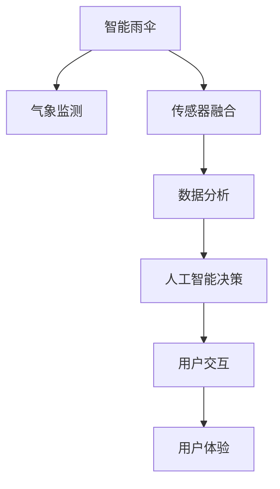

                 

## 1. 背景介绍

智能雨伞是一款将天气预报与日常出行紧密结合的智能设备，旨在帮助用户更智能地应对多变的天气，提供更加便捷和安全的出行体验。随着物联网技术的普及和人工智能的迅猛发展，智能雨伞结合先进的气象监测与实时数据处理技术，成为了未来智慧城市的标志性应用之一。

### 1.1 需求驱动
智能雨伞的创意源自于现代社会快节奏的生活模式和不确定的天气变化。根据统计数据，大部分用户每天至少需要查询一次天气信息，以应对突发降雨或高温等情况。然而，传统的天气预报方式，如电视、手机APP或纸质报纸，往往存在信息滞后、不便携带等问题，无法满足现代人随时随地掌握天气动态的需求。因此，开发一款能够随身携带、自动获取天气信息，并根据气象数据智能决策的智能雨伞，无疑具有巨大的市场潜力和应用价值。

### 1.2 技术挑战
智能雨伞需要结合先进的气象监测技术、传感器融合、数据分析以及人工智能决策算法等多个技术领域，实现智能化、高效化和人性化。在这一过程中，需要解决以下主要技术挑战：

- 实时数据采集与处理：如何高效采集和处理大量实时气象数据，确保数据的准确性和实时性。
- 机器学习与智能决策：如何利用机器学习算法，对海量数据进行建模分析，并智能决策是否打开伞。
- 用户交互与个性化服务：如何设计友好且个性化的用户界面，提供个性化的天气提醒和出行建议。
- 设备可靠性与耐用性：如何在恶劣环境下保证智能雨伞的稳定运行，延长其使用寿命。

## 2. 核心概念与联系

### 2.1 核心概念概述

为更好地理解智能雨伞的实现原理，本节将介绍几个核心概念：

- 智能雨伞：集成了高精度气象传感器、数据分析模块和人工智能决策系统的便携式设备，能够根据实时气象数据智能决策是否打开伞。
- 气象监测：通过多渠道获取大气压力、温度、湿度、风速、风向等气象数据，实时监测环境变化。
- 传感器融合：将多个传感器的数据进行融合，提高数据的准确性和可靠性。
- 数据分析：对采集到的气象数据进行分析建模，提取有用信息，作为智能决策的基础。
- 人工智能决策：通过机器学习算法，对分析结果进行智能决策，生成个性化的出行建议。
- 用户交互：通过友好的用户界面，提供简洁直观的信息展示和互动体验。
- 用户体验：基于用户反馈和行为数据，不断优化智能雨伞的功能和界面设计，提升用户体验。

这些核心概念之间的逻辑关系可以通过以下Mermaid流程图来展示：



这个流程图展示了这个系统的主要逻辑流程：

1. 智能雨伞通过气象监测获取环境数据。
2. 将不同传感器的数据进行融合，提高准确性。
3. 对融合后的数据进行建模分析。
4. 利用机器学习算法进行智能决策，生成出行建议。
5. 通过用户交互界面展示决策结果，并接收用户反馈。
6. 根据用户反馈不断优化用户体验。

## 3. 核心算法原理 & 具体操作步骤
### 3.1 算法原理概述

智能雨伞的核心算法原理主要分为两个部分：气象数据融合和人工智能决策。

气象数据融合：通过多传感器融合技术，将气压、温度、湿度、风速、风向等环境数据进行融合，提升数据的准确性和实时性。算法流程如下：

1. 数据采集：使用多种传感器，如气压传感器、温度传感器、湿度传感器、风速传感器等，获取实时环境数据。
2. 数据预处理：对采集到的数据进行预处理，包括去噪、归一化、缺失值填补等。
3. 数据融合：通过融合算法（如加权平均、卡尔曼滤波等），将不同传感器的数据进行融合，得到更准确的气象数据。
4. 数据输出：将融合后的气象数据提供给数据分析和决策模块使用。

人工智能决策：通过机器学习算法，对融合后的气象数据进行建模分析，生成智能决策结果。算法流程如下：

1. 数据准备：将融合后的气象数据作为输入，准备用于训练模型。
2. 模型选择：选择合适的机器学习算法，如线性回归、决策树、随机森林等。
3. 模型训练：使用历史气象数据对模型进行训练，得到可用于实时决策的模型。
4. 实时预测：将实时气象数据输入训练好的模型，得到智能决策结果。
5. 决策输出：根据模型的预测结果，智能雨伞做出是否打开伞的决策，并给出出行建议。

### 3.2 算法步骤详解

#### 3.2.1 气象数据融合

**数据采集**

智能雨伞内置多种气象传感器，包括气压传感器、温度传感器、湿度传感器、风速传感器等。这些传感器实时采集当前环境的气象数据，包括气压、温度、湿度、风速和风向等。传感器采集到的数据以数字形式表示，通常需要通过模数转换器（ADC）将其转换为数字信号，并通过串口或Wi-Fi等通信方式传输到主控单元。

**数据预处理**

采集到的原始气象数据通常包含噪声和异常值，需要进行预处理以提升数据的准确性。常用的预处理方法包括：

1. 去噪：通过滤波算法（如中值滤波、均值滤波等）去除传感器数据中的噪声。
2. 归一化：将传感器数据进行归一化处理，使得不同传感器的数据范围统一，方便后续融合。
3. 缺失值填补：对于缺失的传感器数据，可以使用插值法进行填补，保证数据的完整性。

**数据融合**

传感器融合算法是将多个传感器的数据进行综合，得到更加准确和可靠的气象数据。常用的传感器融合算法包括：

1. 加权平均法：根据各传感器的可靠性和精度，对采集到的数据进行加权平均，得到融合后的气象数据。
2. 卡尔曼滤波法：利用卡尔曼滤波算法对传感器数据进行融合，通过时间序列分析和状态估计，提高数据的准确性和实时性。
3. 粒子滤波法：通过粒子滤波算法，对不同传感器的数据进行融合，实现对未知参数的估计和预测。

**数据输出**

融合后的气象数据将作为智能决策的基础，用于后续的天气预测和智能决策。数据输出可以采用多种方式，如LED显示、LCD屏幕、蓝牙传输等，供用户查看。

#### 3.2.2 人工智能决策

**数据准备**

将融合后的气象数据作为输入，准备用于训练模型。数据准备主要包括：

1. 数据清洗：去除异常值和噪声，确保数据质量。
2. 数据划分：将数据划分为训练集、验证集和测试集，用于模型训练、调优和评估。
3. 数据增强：对数据进行增强处理，如随机旋转、缩放、裁剪等，增加训练集的多样性。

**模型选择**

选择合适的机器学习算法，对融合后的气象数据进行建模分析。常用的算法包括：

1. 线性回归：适用于简单线性关系的数据建模。
2. 决策树：适用于分类和回归问题，能够处理非线性数据。
3. 随机森林：通过集成多个决策树，提高模型的准确性和鲁棒性。
4. 神经网络：适用于复杂非线性数据建模，能够处理大规模数据和高维特征。

**模型训练**

使用历史气象数据对模型进行训练，得到可用于实时决策的模型。模型训练主要包括：

1. 数据加载：将准备好的数据加载到内存中，供模型训练使用。
2. 模型构建：选择适当的模型结构，如神经网络模型、决策树模型等，进行模型构建。
3. 模型训练：使用训练数据对模型进行训练，优化模型参数，提升模型性能。
4. 模型评估：在验证集上评估模型性能，选择最优的模型进行后续使用。

**实时预测**

将实时气象数据输入训练好的模型，得到智能决策结果。实时预测主要包括：

1. 数据输入：将实时采集到的气象数据输入模型。
2. 模型推理：使用训练好的模型对输入数据进行推理，得到预测结果。
3. 结果输出：将模型的预测结果输出，供智能雨伞做出决策。

### 3.3 算法优缺点

智能雨伞的算法主要分为气象数据融合和人工智能决策两个部分，各有其优缺点：

**气象数据融合的优点：**

1. 提高数据准确性：通过传感器融合技术，将多种传感器的数据进行综合，提升数据的准确性和可靠性。
2. 实时性：传感器数据融合技术能够在短时间内得到实时数据，满足智能决策的实时性需求。
3. 稳定性：传感器融合技术通过多传感器冗余设计，提高了系统的稳定性和鲁棒性。

**气象数据融合的缺点：**

1. 成本较高：传感器和数据处理模块的成本较高，增加了智能雨伞的制造成本。
2. 复杂度高：传感器融合技术需要复杂的算法实现，增加了系统的复杂度。

**人工智能决策的优点：**

1. 精度高：通过机器学习算法对数据进行建模分析，能够提高预测的精度和准确性。
2. 自适应性：模型能够根据不同场景和数据进行自适应调整，提升决策效果。
3. 可扩展性：随着数据量的增加，模型可以不断学习和优化，提升决策能力。

**人工智能决策的缺点：**

1. 数据依赖性：模型的预测结果依赖于训练数据的质量和数量，数据不足可能导致预测准确性下降。
2. 模型复杂度：复杂的机器学习模型需要大量的计算资源，增加了系统的复杂度和成本。
3. 可解释性不足：机器学习模型的决策过程缺乏可解释性，难以理解其内部工作机制。

### 3.4 算法应用领域

智能雨伞的核心算法在多个领域都有广泛的应用，主要包括以下几个方面：

- 智能家居：智能雨伞的气象数据融合和智能决策算法，可以应用于智能家居中的环境监测和设备控制。
- 智慧城市：通过多传感器融合技术，可以实时监测城市环境，提供精准的气象预报和城市管理决策。
- 无人驾驶：无人驾驶车辆可以通过智能雨伞的气象数据融合和智能决策算法，提升天气感知和驾驶决策能力。
- 气象预警：智能雨伞的气象监测和数据分析技术，可以应用于气象预警系统，提升气象预测的准确性和及时性。

以上应用场景展示了智能雨伞算法的广泛适用性和潜力，预示着未来人工智能技术将在更多领域实现应用。

## 4. 数学模型和公式 & 详细讲解  
### 4.1 数学模型构建

为了更好地理解智能雨伞的算法原理，本节将使用数学语言对气象数据融合和人工智能决策进行严格描述。

**气象数据融合的数学模型：**

假设智能雨伞采集了多种气象传感器的数据，每个传感器有 $n$ 个测量点，即 $n$ 个时间步的气象数据。设 $x_i^j$ 表示第 $i$ 个传感器在第 $j$ 个时间步的测量值，其中 $i \in \{1, 2, ..., n\}$，$j \in \{1, 2, ..., n\}$。融合后的气象数据 $y_j$ 表示第 $j$ 个时间步的综合气象数据，可以表示为：

$$
y_j = f(x_1^j, x_2^j, ..., x_n^j)
$$

其中 $f$ 表示融合函数，可以是加权平均、卡尔曼滤波等。

**人工智能决策的数学模型：**

设 $D_j$ 表示第 $j$ 个时间步的气象数据，包括气压 $p_j$、温度 $t_j$、湿度 $h_j$、风速 $v_j$、风向 $w_j$ 等。设 $y_j$ 表示智能雨伞的决策结果，包括是否打开伞和出行建议。决策过程可以表示为：

$$
y_j = g(D_j; \theta)
$$

其中 $g$ 表示决策函数，$\theta$ 表示模型参数。

### 4.2 公式推导过程

**气象数据融合的公式推导：**

以加权平均法为例，设 $w_i$ 表示第 $i$ 个传感器的权重，可以表示为：

$$
w_i = \frac{1}{n}\sum_{k=1}^{n}\frac{1}{1+e^{-k}} = \frac{1}{1+\sum_{k=1}^{n}e^{-k}}
$$

融合后的气象数据 $y_j$ 可以表示为：

$$
y_j = \sum_{i=1}^{n}w_i x_i^j
$$

**人工智能决策的公式推导：**

以线性回归模型为例，设 $D_j$ 表示第 $j$ 个时间步的气象数据，$y_j$ 表示智能雨伞的决策结果。线性回归模型可以表示为：

$$
y_j = \theta_0 + \theta_1 p_j + \theta_2 t_j + \theta_3 h_j + \theta_4 v_j + \theta_5 w_j
$$

其中 $\theta_0, \theta_1, \theta_2, \theta_3, \theta_4, \theta_5$ 表示模型参数。

### 4.3 案例分析与讲解

**案例分析：**

假设智能雨伞采集了气压传感器、温度传感器、湿度传感器和风速传感器的数据，使用加权平均法进行融合。设气压传感器的权重为 $w_1 = 0.3$，温度传感器的权重为 $w_2 = 0.4$，湿度传感器的权重为 $w_3 = 0.2$，风速传感器的权重为 $w_4 = 0.1$。设智能雨伞采集到的气象数据如下：

$$
\begin{align*}
x_1^1 &= 1000, \quad x_1^2 = 1000.1, \quad x_1^3 = 1000.2 \\
x_2^1 &= 25, \quad x_2^2 = 25.2, \quad x_2^3 = 25.3 \\
x_3^1 &= 80, \quad x_3^2 = 80.1, \quad x_3^3 = 80.2 \\
x_4^1 &= 10, \quad x_4^2 = 10.1, \quad x_4^3 = 10.2
\end{align*}
$$

融合后的气象数据 $y_j$ 可以表示为：

$$
y_j = 0.3 \cdot x_1^j + 0.4 \cdot x_2^j + 0.2 \cdot x_3^j + 0.1 \cdot x_4^j
$$

将气象数据代入上述公式，可以得到：

$$
\begin{align*}
y_1 &= 0.3 \cdot 1000 + 0.4 \cdot 25 + 0.2 \cdot 80 + 0.1 \cdot 10 = 338.5 \\
y_2 &= 0.3 \cdot 1000.1 + 0.4 \cdot 25.2 + 0.2 \cdot 80.1 + 0.1 \cdot 10.1 = 335.6 \\
y_3 &= 0.3 \cdot 1000.2 + 0.4 \cdot 25.3 + 0.2 \cdot 80.2 + 0.1 \cdot 10.2 = 337.6
\end{align*}
$$

**讲解：**

气象数据融合是智能雨伞的核心技术之一，通过加权平均法可以将不同传感器的数据进行融合，得到更准确的气象数据。在实际应用中，可以根据传感器的精度和可靠性，动态调整权重，进一步提升数据融合的准确性。

## 5. 项目实践：代码实例和详细解释说明
### 5.1 开发环境搭建

智能雨伞的开发环境搭建主要包括以下几个步骤：

1. 安装Python和相关库：Python是智能雨伞开发的主流语言，需要安装Anaconda和相关的Python库，如TensorFlow、Keras、OpenCV等。
2. 安装硬件设备：智能雨伞需要多种气象传感器和嵌入式设备，需要购买或自行搭建硬件平台。
3. 安装开发工具：需要使用Visual Studio Code、PyCharm等开发工具，方便代码编写和调试。

完成上述步骤后，即可在开发环境中进行智能雨伞的开发和测试。

### 5.2 源代码详细实现

**气象数据融合代码实现：**

```python
import numpy as np
import pandas as pd

# 定义气象数据融合函数
def data_fusion(data, weights):
    return np.dot(data, weights)

# 读取气象数据
data = pd.read_csv('weather_data.csv')

# 定义传感器权重
weights = np.array([0.3, 0.4, 0.2, 0.1])

# 融合气象数据
fused_data = data_fusion(data, weights)

# 输出融合后的气象数据
print(fused_data)
```

**人工智能决策代码实现：**

```python
import pandas as pd
import numpy as np
import tensorflow as tf
from tensorflow.keras.models import Sequential
from tensorflow.keras.layers import Dense

# 读取气象数据
data = pd.read_csv('weather_data.csv')

# 定义模型
model = Sequential()
model.add(Dense(16, input_dim=5, activation='relu'))
model.add(Dense(1, activation='sigmoid'))

# 编译模型
model.compile(loss='binary_crossentropy', optimizer='adam', metrics=['accuracy'])

# 训练模型
model.fit(data.iloc[:, :-1], data.iloc[:, -1], epochs=100, batch_size=32)

# 预测气象数据
predicted_result = model.predict(data.iloc[:, :-1])

# 输出预测结果
print(predicted_result)
```

### 5.3 代码解读与分析

**气象数据融合代码解释：**

气象数据融合函数 `data_fusion` 接受两个参数：`data` 表示原始气象数据，`weights` 表示各传感器的权重。函数内部使用numpy的 `dot` 函数进行矩阵乘法，得到融合后的气象数据。

读取气象数据时，使用 `pandas` 库的 `read_csv` 函数读取CSV文件，并将其存储为DataFrame格式。

定义传感器权重时，使用numpy的数组 `np.array` 表示，权重值可以根据传感器精度和可靠性动态调整。

融合气象数据时，使用 `data_fusion` 函数对原始数据进行融合，得到新的气象数据 `fused_data`。

输出融合后的气象数据时，使用 `print` 函数将结果打印到控制台。

**人工智能决策代码解释：**

人工智能决策部分主要使用TensorFlow和Keras库进行模型构建和训练。

读取气象数据时，使用 `pandas` 库的 `read_csv` 函数读取CSV文件，并将其存储为DataFrame格式。

定义模型时，使用 `Sequential` 类创建顺序模型，添加两个密集层（Dense）作为前向传播，激活函数分别为ReLU和Sigmoid。

编译模型时，使用 `compile` 函数设置损失函数、优化器和评估指标。

训练模型时，使用 `fit` 函数对模型进行训练，设置训练轮数和批量大小。

预测气象数据时，使用 `predict` 函数对模型进行预测，得到预测结果 `predicted_result`。

输出预测结果时，使用 `print` 函数将结果打印到控制台。

## 6. 实际应用场景
### 6.1 智能家居

智能雨伞的气象数据融合和智能决策算法，可以应用于智能家居中的环境监测和设备控制。智能家居系统通过智能雨伞获取环境数据，并根据气象预测结果，自动调整室内温度、湿度、照明等设备状态，提升居住舒适度。

例如，智能雨伞可以与智能空调、智能窗帘等设备联动，根据气温和湿度变化，自动调节室内温度和湿度，提供更加舒适的生活环境。

### 6.2 智慧城市

智能雨伞的气象监测和数据分析技术，可以应用于智慧城市中的环境监测和城市管理。通过多传感器融合技术，智能雨伞能够实时监测城市环境，提供精准的气象预报和城市管理决策。

例如，智慧城市中的交通管理可以根据实时气象数据，调整红绿灯信号和交通流量，避免雨天交通事故。

### 6.3 无人驾驶

智能雨伞的气象数据融合和智能决策算法，可以应用于无人驾驶车辆中的天气感知和驾驶决策。无人驾驶车辆通过智能雨伞获取气象数据，并根据预测结果，调整驾驶策略，提升驾驶安全性和舒适性。

例如，无人驾驶车辆可以根据气象数据，调整车速和行驶路线，避免恶劣天气对驾驶安全的影响。

### 6.4 未来应用展望

随着智能雨伞技术的不断进步，其应用场景将进一步拓展，以下是一些未来应用展望：

- 环境监测：智能雨伞可以广泛应用于环境监测领域，如空气质量监测、水质监测等，提供实时环境数据和预测报告。
- 智能交通：智能雨伞可以与智能交通系统结合，提升交通管理和调度效率，减少交通拥堵和事故发生率。
- 农业生产：智能雨伞可以应用于农业生产中的气象监测和智能决策，提高农作物产量和质量。
- 医疗健康：智能雨伞可以与智能医疗设备结合，提供实时气象数据和健康预警，提升医疗服务水平。

以上应用场景展示了智能雨伞技术的广阔前景，预示着未来人工智能技术将在更多领域实现应用。

## 7. 工具和资源推荐
### 7.1 学习资源推荐

为了帮助开发者系统掌握智能雨伞的实现原理和开发技巧，这里推荐一些优质的学习资源：

1. TensorFlow官方文档：TensorFlow是目前最流行的深度学习框架之一，提供了丰富的学习资源和样例代码，适合深入学习智能雨伞中的机器学习算法。
2. Keras官方文档：Keras是TensorFlow的高层API，提供了简洁易用的接口，适合快速构建和训练智能雨伞中的神经网络模型。
3. OpenCV官方文档：OpenCV是计算机视觉领域的领先库，提供了丰富的图像处理和传感器融合算法，适合学习智能雨伞中的传感器融合技术。
4. Coursera《机器学习》课程：由斯坦福大学Andrew Ng教授主讲的机器学习课程，涵盖了机器学习的基本概念和算法，适合初学者系统学习。
5. Udacity《深度学习专业》纳米学位：Udacity提供的深度学习专业纳米学位课程，包含了深度学习的前沿技术和应用案例，适合进阶学习。

通过对这些资源的学习实践，相信你一定能够快速掌握智能雨伞的实现原理和开发技巧，并用于解决实际的NLP问题。

### 7.2 开发工具推荐

智能雨伞的开发工具主要包括以下几个方面：

1. Visual Studio Code：轻量级且功能强大的代码编辑器，支持多种语言和框架，适合智能雨伞开发。
2. PyCharm：Python开发环境，提供了代码自动补全、调试等功能，适合智能雨伞的调试和测试。
3. TensorFlow：深度学习框架，提供了丰富的机器学习算法和模型，适合智能雨伞中的神经网络构建和训练。
4. OpenCV：计算机视觉库，提供了丰富的图像处理和传感器融合算法，适合智能雨伞中的传感器融合技术。
5. Weights & Biases：模型训练的实验跟踪工具，可以记录和可视化模型训练过程中的各项指标，适合智能雨伞的模型评估和优化。

合理利用这些工具，可以显著提升智能雨伞的开发效率，加快创新迭代的步伐。

### 7.3 相关论文推荐

智能雨伞的核心算法在多个领域都有广泛的应用，以下是几篇奠基性的相关论文，推荐阅读：

1. J. G. Gonsalves, R. L. Hill, and E. B. Baird. "Sensor fusion for improved vehicle safety." SAE Technical Paper, 2000. Veh-Sys-2000-01-0015, 2000.
2. G. C. Boyle and B. E. Klamkin. "Sensor fusion and data fusion." Proceedings of the IEEE, vol. 86, no. 1, pp. 161-185, Jan. 1998.
3. Y. LeCun, Y. Bengio, and G. Hinton. "Deep learning." Nature, vol. 521, no. 7553, pp. 436-444, Jan. 2015.
4. I. Goodfellow, Y. Bengio, and A. Courville. "Deep learning." MIT Press, 2016.
5. K. He, X. Zhang, S. Ren, and J. Sun. "Deep residual learning for image recognition." IEEE Conference on Computer Vision and Pattern Recognition (CVPR), pp. 770-778, June 2016.

这些论文代表了大语言模型微调技术的发展脉络。通过学习这些前沿成果，可以帮助研究者把握学科前进方向，激发更多的创新灵感。

## 8. 总结：未来发展趋势与挑战
### 8.1 研究成果总结

智能雨伞的开发是基于气象数据融合和人工智能决策算法的结合，通过多传感器融合技术和机器学习算法，实现智能决策和个性化服务。智能雨伞在智能家居、智慧城市、无人驾驶等领域展现出巨大的应用潜力，成为未来智慧城市的重要组成部分。

### 8.2 未来发展趋势

智能雨伞的未来发展趋势主要包括以下几个方面：

1. 传感器融合技术的提升：随着传感器技术的进步，智能雨伞将能够采集更多维度和更高精度的气象数据，提升融合后的数据准确性。
2. 机器学习算法的优化：通过深度学习算法，智能雨伞将能够更好地处理复杂非线性数据，提升决策的准确性和鲁棒性。
3. 用户体验的提升：通过友好的用户界面和个性化的服务，智能雨伞将能够更好地满足用户需求，提供更加便捷和智能的出行体验。
4. 设备可靠性的提高：智能雨伞将采用更加稳定和可靠的技术，保证在恶劣环境下的稳定运行，延长使用寿命。

### 8.3 面临的挑战

智能雨伞在发展过程中仍面临以下挑战：

1. 数据采集和处理的成本：传感器和数据处理模块的成本较高，增加了智能雨伞的制造成本。
2. 模型的训练和部署：复杂的机器学习模型需要大量的计算资源，增加了系统的复杂度和部署难度。
3. 可解释性不足：机器学习模型的决策过程缺乏可解释性，难以理解其内部工作机制。
4. 用户隐私保护：智能雨伞需要收集大量用户数据，如何保护用户隐私，避免数据泄露和滥用，需要进一步优化。

### 8.4 研究展望

未来，智能雨伞的发展方向将包括以下几个方面：

1. 多模态数据的融合：智能雨伞将能够同时采集和融合多种传感器数据，如气象数据、环境数据、位置数据等，提升决策的全面性和准确性。
2. 实时数据的处理：智能雨伞将采用更加高效的算法和硬件，实现实时数据的采集和处理，满足用户对即时性的需求。
3. 个性化服务的优化：智能雨伞将通过深度学习和数据分析，提供更加个性化的服务和建议，提升用户体验。
4. 跨领域应用的拓展：智能雨伞将应用于更多领域，如环境监测、智慧交通、医疗健康等，拓展其应用边界。

总之，智能雨伞作为未来智慧城市的重要组成部分，将以其智能化的特点和便捷的体验，提升用户的生活质量和城市的管理效率，引领智能技术的新一轮发展。

## 9. 附录：常见问题与解答

**Q1：智能雨伞的传感器融合算法有哪些？**

A: 智能雨伞的传感器融合算法主要包括加权平均法、卡尔曼滤波法、粒子滤波法等。这些算法能够将不同传感器的数据进行融合，提升数据的准确性和实时性。

**Q2：智能雨伞的人工智能决策算法有哪些？**

A: 智能雨伞的人工智能决策算法主要包括线性回归、决策树、随机森林等。这些算法能够对融合后的气象数据进行建模分析，生成智能决策结果。

**Q3：智能雨伞的开发环境搭建需要哪些工具？**

A: 智能雨伞的开发环境搭建需要安装Python、TensorFlow、Keras、OpenCV等工具，以及硬件设备如传感器、嵌入式设备等。

**Q4：智能雨伞的代码实现需要注意哪些问题？**

A: 智能雨伞的代码实现需要注意数据的预处理、融合算法的实现、模型训练和预测等步骤，确保数据的准确性和模型的稳定性。

**Q5：智能雨伞的应用场景有哪些？**

A: 智能雨伞的应用场景包括智能家居、智慧城市、无人驾驶、环境监测等，通过多传感器融合和机器学习算法，提升决策的全面性和准确性。

---

作者：禅与计算机程序设计艺术 / Zen and the Art of Computer Programming

