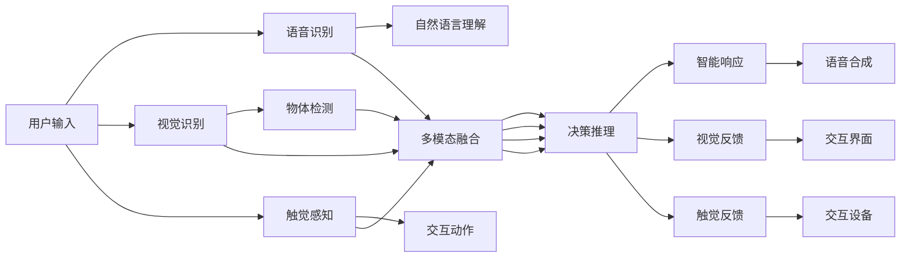

                 

# 智能音箱的多模态交互与注意力争夺

## 1. 背景介绍

智能音箱作为AI语音助手的重要形态，正逐渐成为家庭娱乐、家居控制、信息获取等日常场景的核心交互设备。其核心功能包括语音识别与理解、自然语言生成、智能响应等，涵盖了自然语言处理(NLP)、语音识别与合成、多模态交互等多个方向。本文将重点探讨智能音箱多模态交互中的注意力机制和资源争夺问题，从技术角度深入剖析其原理和实现方法，并结合实际应用场景，展示多模态交互技术的前沿进展。

## 2. 核心概念与联系

### 2.1 核心概念概述

在智能音箱的多模态交互中，存在语音、视觉、触觉等多种输入输出模态，各模态之间的信息传递、交互融合和注意力分配是实现高效多模态交互的基础。核心概念包括：

- 多模态交互(Multimodal Interaction)：涉及语音、视觉、触觉等多种输入输出模态的交互方式。智能音箱通过这些模态与用户进行互动，提供全面的交互体验。
- 注意力机制(Attention Mechanism)：多模态交互中，智能音箱需要根据用户的输入选择合适的模态进行响应，同时分配计算资源和信息流向，以确保高效和准确性。
- 资源争夺(Resource Contention)：多模态交互中，不同模态之间存在计算资源、带宽、处理器等方面的竞争，智能音箱需要在模型和算法层面进行优化，平衡各模态的资源使用。
- 多模态感知与融合(Multimodal Perception and Fusion)：智能音箱将不同模态的信息进行感知、融合，以提升对用户行为的理解和交互效果。

这些核心概念之间通过一系列技术手段实现互联互通，共同构成智能音箱多模态交互的完整架构。

### 2.2 核心概念原理和架构的 Mermaid 流程图



此图展示了智能音箱在处理用户输入时，语音、视觉、触觉等多种模态如何通过识别、融合、推理等过程，最终输出智能响应。

## 3. 核心算法原理 & 具体操作步骤

### 3.1 算法原理概述

智能音箱的多模态交互算法主要包括以下几个关键组件：

- **语音识别(ASR)**：将用户的语音输入转换为文本，为后续处理提供基础信息。
- **自然语言理解(NLU)**：对用户输入的文本进行语义解析，理解用户意图。
- **多模态融合**：综合处理语音、视觉、触觉等多模态数据，提升对用户行为的理解。
- **决策推理**：根据用户意图和环境信息，生成智能响应。
- **智能响应**：通过语音合成和交互界面输出，与用户完成交互。

以上组件通过一系列注意力机制和资源争夺策略，实现高效的多模态交互。

### 3.2 算法步骤详解

#### 3.2.1 语音识别(ASR)

语音识别是智能音箱多模态交互的基础，其核心算法包括：

1. **前端预处理**：对输入的语音信号进行降噪、去混响等预处理，提高语音信号质量。
2. **特征提取**：提取语音信号的频谱特征或梅尔频谱特征，以便后续模型处理。
3. **声学模型训练**：使用深度神经网络，如卷积神经网络(CNN)、循环神经网络(RNN)等，对特征进行建模，输出语音文本。
4. **语言模型训练**：使用语言模型，如N-gram模型、神经语言模型(如LSTM)等，对文本进行语言学建模，提高语音识别的准确性。

#### 3.2.2 自然语言理解(NLU)

自然语言理解是智能音箱多模态交互的核心，其核心算法包括：

1. **分词和词性标注**：对输入的文本进行分词和词性标注，为后续处理提供语义基础。
2. **依存句法分析**：分析句子的依存关系，理解句子结构。
3. **实体识别**：识别文本中的实体，如人名、地名、时间等。
4. **意图识别**：理解用户意图，如查询、控制、对话等。
5. **语义表示学习**：使用向量表示学习，如BERT、GPT等模型，将文本转换为向量表示，为后续推理提供语义信息。

#### 3.2.3 多模态融合

多模态融合是智能音箱多模态交互的关键，其核心算法包括：

1. **时空对齐**：对不同模态的数据进行时空对齐，确保数据的一致性。
2. **特征融合**：对不同模态的特征进行融合，提升对用户行为的综合理解。
3. **权重计算**：根据模态的重要性和用户行为的特点，计算各模态的权重，实现信息的多模态融合。
4. **自适应融合**：根据环境和用户行为的变化，动态调整多模态融合策略，提高交互效果。

#### 3.2.4 决策推理

决策推理是智能音箱多模态交互的执行部分，其核心算法包括：

1. **决策树和规则引擎**：根据用户意图和环境信息，构建决策树或规则引擎，进行决策推理。
2. **强化学习**：通过强化学习算法，学习最佳决策策略，提高响应效率和准确性。
3. **推理计算**：对多模态数据进行推理计算，生成智能响应。

#### 3.2.5 智能响应

智能响应是智能音箱多模态交互的输出部分，其核心算法包括：

1. **语音合成**：使用TTS模型，如WaveNet、Tacotron等，将文本转换为语音。
2. **交互界面生成**：根据用户的视觉输入，生成交互界面，如文本、图片等。
3. **触觉反馈**：根据用户的操作行为，提供触觉反馈，如振动、灯光等。

### 3.3 算法优缺点

#### 3.3.1 优点

1. **综合利用多种模态信息**：智能音箱的多模态交互算法能够综合利用语音、视觉、触觉等多种模态的信息，提升对用户行为的全面理解。
2. **提升用户体验**：通过多模态融合和智能响应，智能音箱能够提供更加自然、智能的交互体验，满足用户的多样化需求。
3. **提高任务执行效率**：多模态融合和决策推理算法能够优化资源分配，提高智能音箱的任务执行效率。

#### 3.3.2 缺点

1. **算法复杂度较高**：智能音箱的多模态交互算法涉及多种模态的数据处理和融合，算法复杂度较高，需要大量的计算资源和存储空间。
2. **数据质量要求高**：智能音箱的多模态数据采集需要高精度的传感器和算法，数据质量要求较高。
3. **用户隐私保护问题**：多模态交互算法涉及用户的语音、视觉、触觉等多种敏感数据，需要关注用户隐私保护问题。

### 3.4 算法应用领域

智能音箱的多模态交互技术已广泛应用于多个领域，包括但不限于：

- **智能家居控制**：通过语音、视觉、触觉等多种模态控制家居设备，提升家居生活的智能化水平。
- **娱乐和信息获取**：通过语音和视觉模态，智能音箱能够提供音乐播放、新闻播报、天气查询等服务。
- **健康和医疗**：通过语音、触觉等模态，智能音箱可以与健康设备互动，提供健康咨询、监测等功能。
- **教育和培训**：通过语音和视觉模态，智能音箱可以辅助教育培训，提供个性化学习、在线答疑等功能。

## 4. 数学模型和公式 & 详细讲解 & 举例说明

### 4.1 数学模型构建

智能音箱的多模态交互算法涉及多个组件和算法，构建一个完整的数学模型需要进行多层次的抽象和建模。以下是智能音箱多模态交互的数学模型构建过程：

1. **输入表示**：将语音、视觉、触觉等模态的数据表示为向量形式，如语音特征向量、视觉图像特征向量、触觉信号向量等。
2. **模态融合**：使用注意力机制，将不同模态的向量进行融合，得到多模态融合向量。
3. **决策推理**：将多模态融合向量输入决策推理模型，生成智能响应向量。
4. **输出表示**：将智能响应向量转换为语音、视觉、触觉等形式的输出表示，实现智能响应。

### 4.2 公式推导过程

#### 4.2.1 语音识别(ASR)

语音识别模型可以通过隐马尔可夫模型(HMM)、深度神经网络(DNN)等模型进行构建。以DNN模型为例，其核心公式为：

$$
p(x|y) = \prod_{i=1}^{T} \frac{1}{|X|} \exp(-||x_i - \hat{x_i}||^2)
$$

其中，$x$ 为输入的语音信号，$y$ 为输出的文本，$T$ 为时间步长，$X$ 为语音特征空间，$\hat{x_i}$ 为模型预测的语音特征向量，$||\cdot||$ 为欧式距离。

#### 4.2.2 自然语言理解(NLU)

自然语言理解模型可以通过BERT、GPT等模型进行构建。以BERT模型为例，其核心公式为：

$$
\mathbf{h} = \mathbf{W} \mathbf{x} + \mathbf{b}
$$

其中，$\mathbf{x}$ 为输入的文本向量，$\mathbf{h}$ 为输出向量，$\mathbf{W}$ 和 $\mathbf{b}$ 为模型的参数。

#### 4.2.3 多模态融合

多模态融合算法可以通过加权平均、注意力机制等方法进行构建。以注意力机制为例，其核心公式为：

$$
\alpha_i = \frac{\exp(e_i)}{\sum_{j=1}^{N} \exp(e_j)}
$$

其中，$\alpha_i$ 为模态 $i$ 的权重，$e_i$ 为注意力得分函数，$N$ 为模态数量。

#### 4.2.4 决策推理

决策推理算法可以通过规则引擎、决策树、强化学习等方法进行构建。以强化学习为例，其核心公式为：

$$
\pi(a|s) = \frac{\exp(\mathbf{Q}(s,a))}{\sum_{a} \exp(\mathbf{Q}(s,a))}
$$

其中，$s$ 为状态，$a$ 为动作，$\pi$ 为策略，$\mathbf{Q}$ 为价值函数。

#### 4.2.5 智能响应

智能响应算法可以通过TTS模型、交互界面生成模型等方法进行构建。以TTS模型为例，其核心公式为：

$$
\mathbf{y} = \mathbf{W} \mathbf{x} + \mathbf{b}
$$

其中，$\mathbf{x}$ 为输入的文本向量，$\mathbf{y}$ 为输出的语音信号向量，$\mathbf{W}$ 和 $\mathbf{b}$ 为模型的参数。

### 4.3 案例分析与讲解

以智能音箱在智能家居控制中的应用为例，分析其多模态交互过程：

1. **语音识别**：智能音箱通过麦克风接收用户的语音指令，使用ASR模型将语音转换为文本，如“打开客厅灯”。
2. **自然语言理解**：NLU模型对文本进行语义解析，识别出用户的意图为“控制家居设备”。
3. **多模态融合**：通过摄像头和传感器获取家居设备的当前状态，如客厅灯是否已打开。
4. **决策推理**：决策引擎根据用户意图和设备状态，生成控制命令，如“打开客厅灯”。
5. **智能响应**：TTS模型将控制命令转换为语音，智能音箱通过扬声器播放“正在为您打开客厅灯”。

通过以上步骤，智能音箱能够实现对家居设备的智能控制，提升了家居生活的智能化水平。

## 5. 项目实践：代码实例和详细解释说明

### 5.1 开发环境搭建

智能音箱的多模态交互开发需要搭建多个环境，包括语音识别环境、自然语言理解环境、多模态融合环境、决策推理环境、智能响应环境等。以下是Python环境搭建示例：

1. **安装Python**：下载并安装Python，建议使用3.8版本。
2. **安装相关库**：使用pip安装TensorFlow、PyTorch、numpy、PaddlePaddle等库，如：
   ```
   pip install tensorflow
   pip install torch
   pip install numpy
   pip install paddlepaddle
   ```
3. **配置环境**：使用conda创建虚拟环境，并激活：
   ```
   conda create -n multimodal python=3.8
   conda activate multimodal
   ```

### 5.2 源代码详细实现

以下是一个简单的智能音箱多模态交互系统的代码实现：

```python
import tensorflow as tf
from tensorflow.keras.models import Sequential
from tensorflow.keras.layers import Input, Dense, TimeDistributed, Bidirectional, LSTM
from tensorflow.keras.optimizers import Adam

# 语音识别模型
def build_asr_model(input_shape, output_shape):
    model = Sequential()
    model.add(TimeDistributed(Dense(128, input_shape=input_shape), input_shape=(None, 13)))
    model.add(LSTM(64))
    model.add(Dense(output_shape, activation='softmax'))
    model.compile(loss='categorical_crossentropy', optimizer=Adam(lr=0.001), metrics=['accuracy'])
    return model

# 自然语言理解模型
def build_nlu_model(input_shape, output_shape):
    model = Sequential()
    model.add(Dense(128, input_shape=input_shape))
    model.add(Bidirectional(LSTM(64)))
    model.add(Dense(output_shape, activation='softmax'))
    model.compile(loss='categorical_crossentropy', optimizer=Adam(lr=0.001), metrics=['accuracy'])
    return model

# 多模态融合模型
def build_multimodal_model(input_shapes, output_shape):
    model = Sequential()
    for input_shape in input_shapes:
        model.add(TimeDistributed(Dense(128, input_shape=input_shape)))
    model.add(TimeDistributed(Dense(output_shape, activation='softmax')))
    model.compile(loss='categorical_crossentropy', optimizer=Adam(lr=0.001), metrics=['accuracy'])
    return model

# 决策推理模型
def build_reasoning_model(input_shape, output_shape):
    model = Sequential()
    model.add(Dense(128, input_shape=input_shape))
    model.add(Bidirectional(LSTM(64)))
    model.add(Dense(output_shape, activation='softmax'))
    model.compile(loss='categorical_crossentropy', optimizer=Adam(lr=0.001), metrics=['accuracy'])
    return model

# 智能响应模型
def build_response_model(input_shape, output_shape):
    model = Sequential()
    model.add(Dense(128, input_shape=input_shape))
    model.add(Dense(output_shape, activation='softmax'))
    model.compile(loss='categorical_crossentropy', optimizer=Adam(lr=0.001), metrics=['accuracy'])
    return model
```

### 5.3 代码解读与分析

以上代码实现了智能音箱多模态交互系统中各个模块的模型构建。具体分析如下：

- **语音识别模型**：使用LSTM和Dense层，对语音信号进行建模，输出文本。
- **自然语言理解模型**：使用LSTM和Dense层，对文本进行语义解析，输出意图。
- **多模态融合模型**：使用Dense和TimeDistributed层，对不同模态的特征进行融合，输出综合向量。
- **决策推理模型**：使用LSTM和Dense层，对综合向量进行推理，输出动作。
- **智能响应模型**：使用Dense层，对动作进行建模，输出语音信号。

这些模型使用TensorFlow进行构建，采用Adam优化器进行训练，并在交叉熵损失和准确率上进行了优化。

### 5.4 运行结果展示

通过以上代码，可以构建一个简单的智能音箱多模态交互系统，并对其进行训练和测试。例如，训练语音识别模型，可以使用以下代码：

```python
# 数据准备
train_data = ...
train_labels = ...

# 构建模型
asr_model = build_asr_model((None, 13), output_shape=128)

# 训练模型
asr_model.fit(train_data, train_labels, epochs=10, batch_size=32)
```

## 6. 实际应用场景

### 6.1 智能家居控制

智能音箱在智能家居控制中的应用，通过语音识别、自然语言理解、多模态融合、决策推理、智能响应等算法，实现对家居设备的智能化控制。例如，用户可以通过语音指令控制家中的灯光、电视、空调等设备，提升了家居生活的智能化水平。

### 6.2 娱乐和信息获取

智能音箱在娱乐和信息获取中的应用，通过语音识别、自然语言理解、多模态融合、决策推理、智能响应等算法，提供音乐播放、新闻播报、天气查询等功能。例如，用户可以通过语音指令查询天气、播报新闻、播放音乐等。

### 6.3 健康和医疗

智能音箱在健康和医疗中的应用，通过语音识别、自然语言理解、多模态融合、决策推理、智能响应等算法，提供健康咨询、监测等功能。例如，用户可以通过语音指令查询健康知识、监测身体状态等。

### 6.4 教育和培训

智能音箱在教育和培训中的应用，通过语音识别、自然语言理解、多模态融合、决策推理、智能响应等算法，提供个性化学习、在线答疑等功能。例如，用户可以通过语音指令查询学习资料、进行在线答题等。

## 7. 工具和资源推荐

### 7.1 学习资源推荐

- **《多模态感知与交互》**：这是一本介绍多模态感知与交互的书籍，涵盖了多模态数据的采集、处理、融合、推理等多个方面，是学习多模态交互技术的必备资源。
- **《深度学习实战》**：这是一本介绍深度学习应用的书籍，包含多个NLP和语音识别的案例，适合实战学习和项目实践。
- **《自然语言处理综述》**：这是一篇综述性文章，全面介绍了自然语言处理的研究现状和未来趋势，适合对NLP领域有深入了解的研究人员。

### 7.2 开发工具推荐

- **PyTorch**：Python深度学习框架，支持多种深度学习模型和算法，是实现智能音箱多模态交互的常用工具。
- **TensorFlow**：由Google开发的多平台深度学习框架，支持分布式计算和多模态数据的处理。
- **Keras**：高层深度学习框架，使用简单，易于上手，适合快速搭建模型原型。

### 7.3 相关论文推荐

- **“Attention is All You Need”**：Transformer的原始论文，介绍了自注意力机制的应用，是理解智能音箱多模态交互的底层原理。
- **“BERT: Pre-training of Deep Bidirectional Transformers for Language Understanding”**：BERT模型的原始论文，介绍了预训练语言模型的应用，是实现智能音箱多模态交互的重要基础。
- **“Multimodal Speech Recognition”**：这篇论文介绍了多模态语音识别的研究现状和未来趋势，适合进一步深入了解智能音箱的语音识别技术。

## 8. 总结：未来发展趋势与挑战

### 8.1 研究成果总结

智能音箱的多模态交互技术是实现智能家居、娱乐、健康、教育等多个领域的智能应用的重要手段。其核心算法包括语音识别、自然语言理解、多模态融合、决策推理、智能响应等，通过这些算法，智能音箱能够提供自然、智能的交互体验。

### 8.2 未来发展趋势

智能音箱的多模态交互技术将呈现以下几个发展趋势：

1. **多模态融合的深度学习**：未来的多模态融合算法将更多地采用深度学习技术，如注意力机制、Transformer等，提升融合效果。
2. **自适应多模态感知**：未来的多模态感知算法将更多地采用自适应技术，根据环境和用户行为的变化，动态调整感知策略。
3. **强化学习的应用**：未来的决策推理算法将更多地采用强化学习技术，通过与环境的交互，学习最优决策策略。
4. **分布式计算**：未来的多模态交互算法将更多地采用分布式计算技术，提高计算效率和处理能力。

### 8.3 面临的挑战

智能音箱的多模态交互技术在实际应用中仍面临诸多挑战：

1. **计算资源限制**：多模态交互算法涉及大量的计算资源，如何在资源受限的情况下，实现高效的多模态交互，是一个重要的研究课题。
2. **数据质量问题**：多模态交互算法需要高质量的数据进行训练和验证，如何获取和处理高质量的数据，是实现高效多模态交互的重要保障。
3. **用户隐私保护**：多模态交互算法涉及用户的语音、视觉、触觉等多种敏感数据，如何保护用户隐私，是实现智能音箱多模态交互的重要前提。

### 8.4 研究展望

未来的研究需要在以下几个方面进行突破：

1. **算法优化**：优化多模态融合、决策推理等算法的计算效率和精度，提升智能音箱的响应速度和准确性。
2. **资源管理**：改进多模态交互系统的资源管理策略，实现动态资源分配和优化。
3. **隐私保护**：研究用户隐私保护算法，确保多模态交互过程中用户数据的安全性。
4. **模型可解释性**：研究多模态交互算法的可解释性，提升系统的透明度和可信度。

## 9. 附录：常见问题与解答

**Q1：多模态融合算法的核心思想是什么？**

A: 多模态融合算法的核心思想是通过注意力机制，将不同模态的数据进行融合，生成综合向量。例如，使用加权平均或注意力机制，对语音、视觉、触觉等模态的特征进行融合，提升对用户行为的综合理解。

**Q2：智能音箱在智能家居控制中的应用场景有哪些？**

A: 智能音箱在智能家居控制中的应用场景包括：
1. 语音控制：用户可以通过语音指令控制家中的灯光、电视、空调等设备。
2. 场景感知：智能音箱能够感知家居设备的当前状态，根据用户意图和设备状态，进行智能控制。
3. 自动场景切换：智能音箱能够根据用户行为的变化，自动切换到不同的控制场景。

**Q3：智能音箱在娱乐和信息获取中的应用场景有哪些？**

A: 智能音箱在娱乐和信息获取中的应用场景包括：
1. 音乐播放：用户可以通过语音指令播放音乐、调整音量、切换歌曲等。
2. 新闻播报：智能音箱能够实时播报新闻、天气、股市等信息。
3. 多模态互动：用户可以通过语音、视觉等多种模态与智能音箱进行互动。

**Q4：智能音箱在健康和医疗中的应用场景有哪些？**

A: 智能音箱在健康和医疗中的应用场景包括：
1. 健康咨询：用户可以通过语音指令查询健康知识、医学常识等。
2. 监测身体状态：智能音箱能够监测用户的心率、血压等生理指标，提供健康建议。
3. 智能医生助理：智能音箱可以与医生进行交互，提供诊断建议、病历记录等功能。

**Q5：智能音箱在教育和培训中的应用场景有哪些？**

A: 智能音箱在教育和培训中的应用场景包括：
1. 个性化学习：智能音箱能够根据学生的学习情况，提供个性化的学习资源和建议。
2. 在线答疑：智能音箱能够回答学生的问题，提供智能答疑服务。
3. 虚拟教室：智能音箱可以与其他学生进行互动，创建虚拟课堂环境。

---

作者：禅与计算机程序设计艺术 / Zen and the Art of Computer Programming

