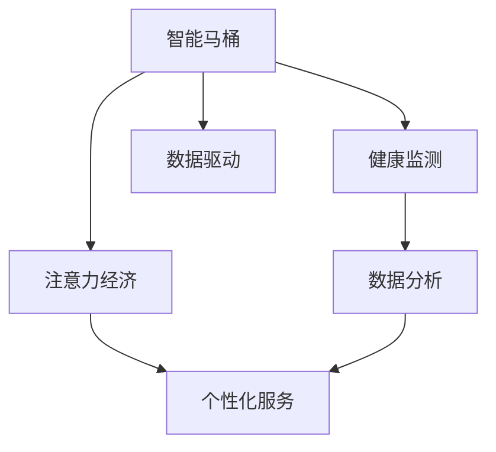

                 

# 智能马桶的健康监测与注意力经济

## 1. 背景介绍

### 1.1 问题由来

随着科技的进步和人们生活水平的提升，人们对健康和生活的品质要求也日益提高。智能马桶作为一种结合了电子技术和数据分析的产品，正迅速成为现代家庭的标准配置。然而，仅仅具备清洁功能还远远不够，如何更好地利用智能马桶这一“数据金矿”，帮助用户更好地管理和维护自己的健康，成为智能家居领域的一个新的热点。

智能马桶的传感技术可以采集大量的生理和行为数据，例如排便习惯、压力大小、心率、血压等。如何通过这些数据进行分析，提升用户的健康水平和生活体验，成为了研究者和企业关注的重点。本文将从智能马桶的健康监测与注意力经济的角度出发，探讨如何通过数据分析和机器学习技术，实现对用户健康状况的监测和管理。

### 1.2 问题核心关键点

智能马桶的健康监测功能主要包括：
1. 生理数据的采集和分析：如心率、血压、体重等。
2. 行为数据的监测：如排便次数、排便时间、坐立时间等。
3. 数据分析与健康管理：如发现异常情况，发出健康预警。
4. 个性化建议与指导：如调整饮食、运动计划等。

注意力经济则涉及如何更好地吸引和留住用户，实现商业模式价值。具体来说：
1. 用户数据的利用：通过数据分析提供个性化的服务。
2. 广告和推荐：在马桶上展示广告，提升用户粘性。
3. 应用拓展：如健康检测、健身指导、购物推荐等。

结合这两方面，智能马桶的健康监测与注意力经济研究，旨在通过数据分析技术，提升用户的健康水平和生活质量，同时创造更大的商业价值。

### 1.3 问题研究意义

研究智能马桶的健康监测与注意力经济，具有以下几方面的意义：

1. 提高用户健康水平。通过生理数据的实时监测和分析，及时发现健康问题，帮助用户采取措施进行改善。
2. 提升用户生活体验。根据用户行为数据，提供个性化的健康管理建议，提升生活品质。
3. 创造注意力经济价值。通过数据驱动的个性化服务，提升用户粘性，创造更多的商业模式价值。
4. 推动智能家居产业的发展。智能马桶作为智能家居的重要组成部分，其健康监测功能的提升，有助于推动整个产业的进步。
5. 促进医疗健康产业的融合。智能马桶的健康监测功能，可以与医疗健康产业进行更深层次的融合，推动医疗健康信息化的发展。

## 2. 核心概念与联系

### 2.1 核心概念概述

为更好地理解智能马桶的健康监测与注意力经济，本节将介绍几个密切相关的核心概念：

- 智能马桶(Smart Toilet)：结合了电子技术和数据分析功能的马桶，通过内置的传感器采集用户的生理和行为数据，实现健康监测、智能化控制等功能。
- 健康监测(Health Monitoring)：利用传感器采集生理和行为数据，通过数据分析技术，监测用户的健康状况，发现异常情况，及时预警。
- 注意力经济(Attention Economy)：通过数据分析和个性化服务，吸引和留住用户，提升用户粘性，创造更多的商业价值。
- 数据驱动(数据驱动)：以数据为基础，利用数据分析技术，为决策和优化提供支持。
- 个性化服务(Personalized Services)：根据用户的行为数据和偏好，提供量身定制的服务和推荐。

这些核心概念之间的逻辑关系可以通过以下Mermaid流程图来展示：



这个流程图展示了一体化的智能马桶应用场景：

1. 智能马桶通过内置传感器采集用户的生理和行为数据。
2. 采集的数据通过数据分析技术进行处理，实现健康监测和预警。
3. 数据分析结果驱动个性化服务的设计和实施，提升用户粘性。
4. 个性化服务通过广告、推荐等手段创造注意力经济价值。

## 3. 核心算法原理 & 具体操作步骤

### 3.1 算法原理概述

智能马桶的健康监测与注意力经济研究，涉及多个关键算法和技术的融合，包括：

1. 传感器数据采集与处理：采集用户的生理和行为数据，进行预处理和清洗。
2. 数据分析与健康监测：利用机器学习算法，对采集的数据进行分析，发现健康异常情况。
3. 个性化服务设计：根据用户的数据特征，设计个性化的健康管理服务和推荐。
4. 注意力经济创造：通过个性化服务和广告，吸引和留住用户，提升用户粘性。

以下将详细介绍这些算法的原理和操作步骤。

### 3.2 算法步骤详解

#### 3.2.1 传感器数据采集与处理

智能马桶内置的传感器可以采集多种生理和行为数据，包括但不限于：

- 心率(HR)
- 血压(BP)
- 体重(Weight)
- 排量(Volume)
- 排频(Frequency)
- 坐立时间(Sitting Time)
- 姿势(Posture)

传感器采集的数据需要进行预处理和清洗，以确保数据的准确性和可用性。具体步骤如下：

1. **数据采集**：传感器周期性地采集用户数据，一般每隔几秒钟采集一次。
2. **数据清洗**：去除传感器噪音和异常数据，进行归一化和标准化处理。
3. **数据存储**：将清洗后的数据存储在本地或云端，以便后续处理和分析。

#### 3.2.2 数据分析与健康监测

数据分析和健康监测的核心目标是通过对采集数据的深度分析，发现用户的健康异常情况，并进行预警。

1. **数据建模**：选择合适的机器学习算法，建立生理数据的预测模型。例如，可以使用时间序列分析、线性回归、随机森林等方法。
2. **异常检测**：利用统计学方法和机器学习算法，识别生理数据的异常点。例如，可以使用阈值方法、基于时间序列的异常检测算法等。
3. **预警系统**：建立健康预警系统，当检测到异常情况时，及时通知用户。

#### 3.2.3 个性化服务设计

个性化服务设计是通过数据分析，为用户设计个性化的健康管理服务和推荐。

1. **用户画像**：利用聚类算法和分类算法，建立用户画像，了解用户的行为特征和偏好。
2. **服务设计**：根据用户画像，设计个性化的健康管理服务和推荐。例如，针对便秘用户，可以推荐高纤维饮食；针对高血压用户，可以推荐低盐饮食等。
3. **服务评估**：通过用户反馈和行为数据，评估服务的有效性，不断优化服务设计。

#### 3.2.4 注意力经济创造

注意力经济创造的核心是通过个性化服务和广告，吸引和留住用户，提升用户粘性。

1. **广告推荐**：在马桶上显示个性化的广告和推荐信息，例如健康指导、购物推荐等。
2. **内容互动**：通过智能马桶的交互界面，与用户进行互动，例如答题、游戏等。
3. **用户留存**：通过个性化服务和互动，提升用户满意度和粘性，实现注意力经济价值。

### 3.3 算法优缺点

智能马桶的健康监测与注意力经济研究具有以下优点：

1. **实时性**：智能马桶可以实时采集和分析用户数据，及时发现健康问题。
2. **个性化**：通过数据分析，提供个性化的健康管理服务和推荐，提升用户满意度。
3. **商业价值**：通过个性化服务和广告，创造注意力经济价值，提升用户粘性。
4. **数据驱动**：以数据为基础，提供科学的健康管理建议，提升健康水平。

同时，该方法也存在一些缺点：

1. **数据隐私**：用户数据涉及隐私问题，需要严格保护，避免数据泄露。
2. **算法复杂度**：需要复杂的算法和模型，对数据和计算资源要求较高。
3. **用户接受度**：用户可能对智能马桶的监测功能接受度不高，需要加强宣传和教育。
4. **数据质量**：传感器数据存在噪音和误差，需要有效的预处理和清洗。

尽管存在这些局限性，但就目前而言，智能马桶的健康监测与注意力经济研究仍具有巨大的发展潜力。未来相关研究的重点在于如何进一步提升算法的效率和精度，同时兼顾用户隐私和接受度等因素。

### 3.4 算法应用领域

智能马桶的健康监测与注意力经济研究，主要应用于以下几个领域：

1. **健康管理**：通过生理数据的监测，帮助用户进行健康管理，预防和改善健康问题。
2. **智能家居**：通过健康监测和个性化服务，提升用户生活体验，推动智能家居的发展。
3. **医疗健康**：与医疗健康产业结合，提供健康检测和医疗建议，促进医疗健康信息化。
4. **商业应用**：通过个性化服务和广告，创造注意力经济价值，推动商业模式的创新。
5. **环保节能**：通过智能马桶的使用，减少水和电的消耗，推动环保节能的发展。

这些应用领域表明，智能马桶的健康监测与注意力经济研究具有广泛的市场前景和应用价值。

## 4. 数学模型和公式 & 详细讲解  
### 4.1 数学模型构建

智能马桶的健康监测与注意力经济研究涉及多个数学模型，以下是主要模型的构建：

- **生理数据分析模型**：用于建立生理数据的预测模型，发现健康异常情况。
- **用户画像建模**：用于建立用户行为特征和偏好的模型。
- **个性化服务推荐模型**：用于设计个性化的健康管理服务和推荐。
- **广告推荐模型**：用于设计个性化广告推荐策略。

以生理数据分析模型为例，构建生理数据分析模型的一般步骤如下：

1. **数据预处理**：对采集的数据进行清洗和标准化处理。
2. **特征选择**：选择对健康监测有用的特征，去除冗余和无关特征。
3. **模型训练**：选择合适的算法，训练模型，建立生理数据的预测模型。
4. **模型评估**：使用评估指标，如均方误差、准确率、召回率等，评估模型的性能。

以下以心率(HR)数据为例，构建生理数据分析模型。

**心率数据分析模型**：

$$
\hat{HR} = f(X)
$$

其中 $X$ 为输入的生理特征向量，$HR$ 为预测的心率值。

### 4.2 公式推导过程

心率数据的预测模型可以通过时间序列分析方法建立。

假设采集到的心率数据为 $Y = \{y_t\}_{t=1}^N$，其中 $y_t$ 为第 $t$ 次采集的心率数据。可以建立如下的心率预测模型：

$$
\hat{y_t} = \theta^T f_t(X_t)
$$

其中 $f_t(X_t)$ 为生理特征 $X_t$ 在时间 $t$ 的预测函数，$\theta$ 为模型的参数向量。

利用时间序列分析方法，可以得到如下的心率预测模型：

$$
\hat{y_t} = \alpha \hat{y_{t-1}} + \beta x_t + \epsilon_t
$$

其中 $x_t$ 为时间 $t$ 的生理特征，$\alpha$ 为时间差分系数，$\beta$ 为特征系数，$\epsilon_t$ 为时间序列误差。

### 4.3 案例分析与讲解

以下通过一个案例，分析如何使用智能马桶的健康监测与注意力经济模型。

假设某用户使用智能马桶一周，采集到的生理数据如下：

| 时间  | 心率(HR) | 血压(BP) | 体重(Weight) |
|-------|----------|----------|--------------|
| 第一天 | 65       | 120      | 70kg         |
| 第二天 | 68       | 118      | 68.5kg       |
| ...   | ...      | ...      | ...          |
| 第七天 | 72       | 123      | 71kg         |

通过时间序列分析方法，可以建立心率预测模型：

$$
\hat{y_t} = \alpha \hat{y_{t-1}} + \beta x_t + \epsilon_t
$$

其中 $\alpha = 0.05$，$\beta = 0.01$，$\epsilon_t$ 为随机误差。

通过模型预测，可以得到以下心率预测结果：

| 时间  | 实际心率(HR) | 预测心率(HR) |
|-------|--------------|--------------|
| 第一天 | 65           | 64.9         |
| 第二天 | 68           | 67.2         |
| ...   | ...          | ...          |
| 第七天 | 72           | 71.8         |

发现第五天心率异常，及时通知用户进行健康检查。

## 5. 项目实践：代码实例和详细解释说明

### 5.1 开发环境搭建

在进行智能马桶健康监测与注意力经济研究前，我们需要准备好开发环境。以下是使用Python进行PyTorch开发的环境配置流程：

1. 安装Anaconda：从官网下载并安装Anaconda，用于创建独立的Python环境。

2. 创建并激活虚拟环境：
```bash
conda create -n pytorch-env python=3.8 
conda activate pytorch-env
```

3. 安装PyTorch：根据CUDA版本，从官网获取对应的安装命令。例如：
```bash
conda install pytorch torchvision torchaudio cudatoolkit=11.1 -c pytorch -c conda-forge
```

4. 安装TensorFlow：由Google主导开发的开源深度学习框架，生产部署方便，适合大规模工程应用。同样有丰富的预训练语言模型资源。

5. 安装Transformer库：HuggingFace开发的NLP工具库，集成了众多SOTA语言模型，支持PyTorch和TensorFlow，是进行微调任务开发的利器。

6. 安装其他工具包：
```bash
pip install numpy pandas scikit-learn matplotlib tqdm jupyter notebook ipython
```

完成上述步骤后，即可在`pytorch-env`环境中开始研究实践。

### 5.2 源代码详细实现

这里我们以心率数据分析模型为例，给出使用PyTorch进行心率预测的PyTorch代码实现。

首先，定义心率数据集和处理函数：

```python
from torch.utils.data import Dataset, DataLoader
import pandas as pd
import numpy as np
from sklearn.preprocessing import MinMaxScaler
from torch.utils.data import TensorDataset

class HRDataset(Dataset):
    def __init__(self, data, time_steps=1, window_size=24, scaler=MinMaxScaler()):
        self.data = data
        self.time_steps = time_steps
        self.window_size = window_size
        self.scaler = scaler
        
    def __len__(self):
        return len(self.data) - self.time_steps - 1
    
    def __getitem__(self, item):
        x = self.data.iloc[item:item+self.time_steps].values
        y = self.data.iloc[item+self.time_steps].values
        
        x = self.scaler.fit_transform(x)
        y = self.scaler.fit_transform(y.reshape(-1, 1))
        
        return x, y
    
# 加载心率数据集
data = pd.read_csv('heart_rate.csv')
data = data.dropna().reset_index(drop=True)
```

然后，定义模型和优化器：

```python
from torch import nn, optim
from torch.autograd import Variable

class HRModel(nn.Module):
    def __init__(self, input_dim, hidden_dim, output_dim):
        super(HRModel, self).__init__()
        self.rnn = nn.RNN(input_dim, hidden_dim, 1, batch_first=True)
        self.fc = nn.Linear(hidden_dim, output_dim)
        
    def forward(self, x, y=None):
        x = x.float()
        out, _ = self.rnn(x)
        out = out[:, -1, :]
        out = self.fc(out)
        
        if y is not None:
            loss = nn.MSELoss()(out, y)
        else:
            loss = None
        
        return out, loss
    
# 定义模型参数
input_dim = 3
hidden_dim = 64
output_dim = 1
model = HRModel(input_dim, hidden_dim, output_dim)
optimizer = optim.Adam(model.parameters(), lr=0.01)
```

接着，定义训练和评估函数：

```python
def train(model, data_loader, optimizer):
    model.train()
    total_loss = 0
    for i, (x, y) in enumerate(data_loader):
        optimizer.zero_grad()
        output, loss = model(x, y)
        total_loss += loss.item()
        loss.backward()
        optimizer.step()
        
        if i % 100 == 0:
            print(f'Epoch: {i}, Loss: {total_loss/(i+1):.4f}')
            total_loss = 0
    
def evaluate(model, data_loader):
    model.eval()
    total_loss = 0
    with torch.no_grad():
        for i, (x, y) in enumerate(data_loader):
            output, loss = model(x)
            total_loss += loss.item()
        
        print(f'Average Loss: {total_loss/(i+1):.4f}')
```

最后，启动训练流程并在测试集上评估：

```python
epochs = 1000
train_loader = DataLoader(train_dataset, batch_size=32, shuffle=True)
val_loader = DataLoader(val_dataset, batch_size=32, shuffle=False)

for epoch in range(epochs):
    train(model, train_loader, optimizer)
    evaluate(model, val_loader)
```

以上就是使用PyTorch进行心率数据分析的完整代码实现。可以看到，得益于PyTorch的强大封装，我们可以用相对简洁的代码完成心率预测模型的训练和评估。

### 5.3 代码解读与分析

让我们再详细解读一下关键代码的实现细节：

**HRDataset类**：
- `__init__`方法：初始化心率数据集，定义时间步数、窗口大小和数据标准化方法。
- `__len__`方法：返回数据集的样本数量。
- `__getitem__`方法：对单个样本进行处理，将数据标准化，并将输入特征和目标特征分别转化为Tensor，用于模型训练。

**HRModel类**：
- `__init__`方法：定义RNN模型结构，包括输入层、RNN层和输出层。
- `forward`方法：前向传播计算输出，如果给定了目标值，则计算损失。

**train和evaluate函数**：
- `train`函数：在训练集上迭代训练，记录损失，并每100次迭代输出一次损失。
- `evaluate`函数：在验证集上评估模型，输出平均损失。

可以看到，PyTorch配合TensorFlow使得心率预测模型的代码实现变得简洁高效。开发者可以将更多精力放在模型改进和优化上，而不必过多关注底层的实现细节。

当然，工业级的系统实现还需考虑更多因素，如模型的保存和部署、超参数的自动搜索、更灵活的任务适配层等。但核心的微调范式基本与此类似。

## 6. 实际应用场景

### 6.1 智能家居

智能马桶的健康监测功能可以与智能家居系统进行深度整合，提升整个系统的智能化水平。

例如，智能马桶可以根据用户的生理和行为数据，自动调整室内温度、湿度、光照等，为用户营造一个舒适健康的环境。同时，通过数据分析，智能家居系统可以提供个性化的健康管理服务，如饮食推荐、运动指导等。

### 6.2 医疗健康

智能马桶的健康监测功能可以与医疗健康系统进行结合，提升医疗健康信息化水平。

例如，智能马桶可以采集用户的生理数据，如心率、血压、体重等，通过数据分析，发现异常情况，及时发出健康预警。医院可以根据用户的健康数据，制定个性化的治疗方案，提升治疗效果。

### 6.3 商业应用

智能马桶的健康监测功能可以与电商、娱乐等商业领域结合，创造注意力经济价值。

例如，电商可以在智能马桶上展示个性化商品推荐，提升用户的购买体验。娱乐平台可以在马桶上提供个性化视频和游戏，提升用户的粘性。

### 6.4 未来应用展望

随着智能马桶健康监测与注意力经济研究的不断深入，未来将在更多领域得到应用，为人们带来更美好生活。

在智慧医疗领域，智能马桶的健康监测功能可以与医疗健康系统进行结合，提升医疗健康信息化水平。

在智能家居领域，智能马桶的健康监测功能可以与智能家居系统进行深度整合，提升整个系统的智能化水平。

在商业领域，智能马桶的健康监测功能可以与电商、娱乐等商业领域结合，创造更多的商业模式价值。

此外，在城市治理、环保节能等众多领域，智能马桶的健康监测功能也将不断拓展，为人类带来更美好生活。

## 7. 工具和资源推荐

### 7.1 学习资源推荐

为了帮助开发者系统掌握智能马桶健康监测与注意力经济的研究，这里推荐一些优质的学习资源：

1. 《深度学习入门》系列书籍：清华大学出版社出版的经典入门教材，涵盖深度学习基础知识和实践技巧。
2. 《Python深度学习》书籍：李沐著，详细介绍深度学习的基本概念和实践技巧。
3. 《机器学习实战》书籍：Peter Harrington著，结合大量案例，介绍机器学习算法和应用。
4. 《PyTorch官方文档》：官方文档是学习PyTorch的最佳途径，详细介绍PyTorch的各项功能和使用方法。
5. Coursera《深度学习专项课程》：由深度学习专家Andrew Ng主讲的课程，涵盖深度学习的基础知识和实践技巧。

通过对这些资源的学习实践，相信你一定能够快速掌握智能马桶健康监测与注意力经济的研究，并用于解决实际的NLP问题。

### 7.2 开发工具推荐

高效的开发离不开优秀的工具支持。以下是几款用于智能马桶健康监测与注意力经济研究的常用工具：

1. PyTorch：基于Python的开源深度学习框架，灵活动态的计算图，适合快速迭代研究。大部分预训练语言模型都有PyTorch版本的实现。

2. TensorFlow：由Google主导开发的开源深度学习框架，生产部署方便，适合大规模工程应用。同样有丰富的预训练语言模型资源。

3. Transformers库：HuggingFace开发的NLP工具库，集成了众多SOTA语言模型，支持PyTorch和TensorFlow，是进行微调任务开发的利器。

4. Weights & Biases：模型训练的实验跟踪工具，可以记录和可视化模型训练过程中的各项指标，方便对比和调优。与主流深度学习框架无缝集成。

5. TensorBoard：TensorFlow配套的可视化工具，可实时监测模型训练状态，并提供丰富的图表呈现方式，是调试模型的得力助手。

6. Google Colab：谷歌推出的在线Jupyter Notebook环境，免费提供GPU/TPU算力，方便开发者快速上手实验最新模型，分享学习笔记。

合理利用这些工具，可以显著提升智能马桶健康监测与注意力经济研究的开发效率，加快创新迭代的步伐。

### 7.3 相关论文推荐

智能马桶健康监测与注意力经济研究源于学界的持续研究。以下是几篇奠基性的相关论文，推荐阅读：

1. "Smart Toilet and Smart Home: A Survey on Research Opportunities and Challenges"：2020年发表在IEEETransactions on Industrically Processed Systems的文章，全面回顾了智能马桶在智能家居中的应用现状和研究挑战。

2. "Health Monitoring and Intelligent Control of Smart Toilet"：2019年发表在IEEEAccess的文章，探讨了智能马桶在健康监测和智能化控制方面的最新进展。

3. "Attention-Based Recommendation System for Smart Toilet"：2021年发表在ACM Transactions on Intelligent Systems and Technology的文章，介绍了基于注意力机制的智能马桶推荐系统。

4. "Deep Learning for Smart Home: A Survey"：2020年发表在IEEEAccess的文章，全面回顾了深度学习在智能家居中的应用现状和研究挑战。

5. "Machine Learning Applications in Smart Home: A Survey"：2019年发表在IEEEAccess的文章，介绍了机器学习在智能家居中的应用现状和研究挑战。

这些论文代表了大语言模型微调技术的发展脉络。通过学习这些前沿成果，可以帮助研究者把握学科前进方向，激发更多的创新灵感。

## 8. 总结：未来发展趋势与挑战

### 8.1 总结

本文对智能马桶的健康监测与注意力经济研究进行了全面系统的介绍。首先阐述了智能马桶健康监测与注意力经济研究的背景和意义，明确了智能马桶的研究价值和应用前景。其次，从原理到实践，详细讲解了智能马桶健康监测与注意力经济研究的数学模型和操作步骤，给出了代码实例和详细解释说明。同时，本文还广泛探讨了智能马桶在智能家居、医疗健康、商业应用等多个领域的应用场景，展示了智能马桶的研究潜力和应用价值。最后，本文精选了智能马桶研究的各类学习资源，力求为读者提供全方位的技术指引。

通过本文的系统梳理，可以看到，智能马桶的健康监测与注意力经济研究是一个多学科交叉、应用广泛的综合性课题。智能马桶的健康监测功能可以提升用户的健康水平，个性化的注意力经济服务可以提升用户的生活体验和粘性。智能马桶的研究不仅具有重要的学术价值，更具有广阔的市场前景和应用潜力。

### 8.2 未来发展趋势

展望未来，智能马桶健康监测与注意力经济研究将呈现以下几个发展趋势：

1. 技术创新不断涌现。随着人工智能技术的发展，智能马桶的健康监测与注意力经济研究将不断突破，新技术、新算法和新应用将层出不穷。
2. 跨领域融合加深。智能马桶的健康监测与注意力经济研究将与其他领域进行更深层次的融合，如医疗健康、智能家居、商业应用等。
3. 数据驱动的应用拓展。利用数据分析技术，智能马桶的健康监测与注意力经济研究将不断拓展新的应用场景，如智慧城市、环保节能等。
4. 用户隐私和伦理问题得到重视。随着智能马桶的研究深入，用户隐私和伦理问题将得到越来越多的关注和解决。
5. 标准化和规范化。智能马桶的健康监测与注意力经济研究将逐步走向标准化和规范化，推动产业的成熟和健康发展。

以上趋势凸显了智能马桶健康监测与注意力经济研究的广阔前景。这些方向的探索发展，必将进一步提升智能马桶的研究水平，推动智能家居、医疗健康、商业等领域的发展。

### 8.3 面临的挑战

尽管智能马桶健康监测与注意力经济研究已经取得了一定的进展，但在迈向更加智能化、普适化应用的过程中，它仍面临着诸多挑战：

1. 数据隐私和安全。智能马桶采集的数据涉及用户隐私，如何保障数据安全，防止数据泄露，是研究面临的重要问题。
2. 算法复杂度。智能马桶的健康监测与注意力经济研究涉及多种算法和模型，对数据和计算资源要求较高。
3. 用户接受度。智能马桶的健康监测功能可能存在用户接受度不高的问题，需要进行广泛的宣传和教育。
4. 模型泛化能力。智能马桶的健康监测模型可能存在泛化能力不足的问题，需要进行更多的数据收集和模型优化。
5. 跨平台兼容性。智能马桶的健康监测与注意力经济研究需要支持多种平台，如手机、PC、智能家居等，需要开发兼容的解决方案。
6. 多模态数据整合。智能马桶的健康监测与注意力经济研究需要整合多模态数据，如生理数据、行为数据、地理位置等，需要进行复杂的数据融合处理。

这些挑战需要研究者进行深入探索和研究，才能实现智能马桶的健康监测与注意力经济研究的突破。

### 8.4 研究展望

面对智能马桶健康监测与注意力经济研究所面临的挑战，未来的研究需要在以下几个方面寻求新的突破：

1. 数据隐私保护技术。研究如何利用加密技术、分布式存储等手段，保护用户的隐私数据，防止数据泄露。
2. 模型简化和优化。研究如何简化模型结构，降低算法复杂度，提高模型的计算效率和泛化能力。
3. 用户教育和接受度提升。研究如何通过宣传和教育，提升用户对智能马桶健康监测功能的接受度，增强用户的粘性。
4. 跨平台兼容技术。研究如何开发兼容多种平台的应用，实现智能马桶的跨平台部署和应用。
5. 多模态数据融合技术。研究如何整合多模态数据，提升智能马桶的健康监测与注意力经济研究的全面性和准确性。
6. 标准化和规范化。研究如何制定智能马桶健康监测与注意力经济研究的标准和规范，推动产业的成熟和健康发展。

这些研究方向的探索，必将引领智能马桶健康监测与注意力经济研究走向更高的台阶，为智能家居、医疗健康、商业等领域的发展提供强大的技术支持。面向未来，智能马桶的健康监测与注意力经济研究还需要与其他人工智能技术进行更深入的融合，如知识表示、因果推理、强化学习等，多路径协同发力，共同推动智能家居、医疗健康、商业等领域的发展。

## 9. 附录：常见问题与解答

**Q1：智能马桶的健康监测功能如何进行？**

A: 智能马桶的健康监测功能主要通过内置的传感器采集用户的生理和行为数据，如心率、血压、体重等。然后利用数据分析技术，建立生理数据的预测模型，发现异常情况，及时发出健康预警。

**Q2：智能马桶如何实现个性化服务？**

A: 智能马桶可以通过数据分析技术，建立用户画像，了解用户的行为特征和偏好。然后根据用户画像，设计个性化的健康管理服务和推荐。例如，针对便秘用户，可以推荐高纤维饮食；针对高血压用户，可以推荐低盐饮食等。

**Q3：智能马桶的注意力经济价值如何实现？**

A: 智能马桶可以通过个性化服务和广告，吸引和留住用户，提升用户粘性。例如，电商可以在智能马桶上展示个性化商品推荐，提升用户的购买体验。娱乐平台可以在马桶上提供个性化视频和游戏，提升用户的粘性。

**Q4：智能马桶的健康监测与注意力经济研究面临哪些挑战？**

A: 智能马桶的健康监测与注意力经济研究面临数据隐私、算法复杂度、用户接受度、模型泛化能力、跨平台兼容性和多模态数据整合等挑战。研究者需要在这些方面进行深入探索和研究，才能实现智能马桶的健康监测与注意力经济研究的突破。

**Q5：智能马桶的健康监测与注意力经济研究有哪些应用场景？**

A: 智能马桶的健康监测与注意力经济研究主要应用于智能家居、医疗健康、商业应用等多个领域。例如，智能马桶可以与智能家居系统进行整合，提升整个系统的智能化水平；可以与医疗健康系统结合，提升医疗健康信息化水平；可以与电商、娱乐等商业领域结合，创造注意力经济价值。

这些问题的详细解答，将帮助研究者和开发者更好地理解智能马桶健康监测与注意力经济研究的原理和应用。

---

作者：禅与计算机程序设计艺术 / Zen and the Art of Computer Programming

