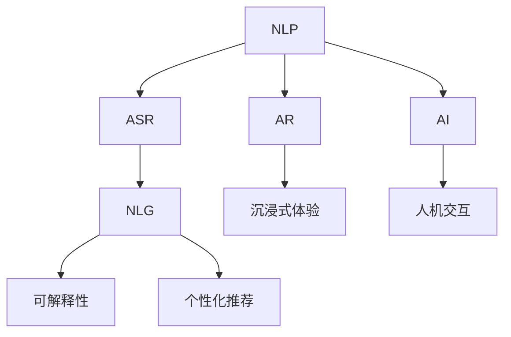

                 

# 未来CUI在数字产品中的应用详细趋势

> 关键词：智能用户界面(CUI), 自然语言处理(NLP), 语音识别(ASR), 自然语言生成(NLG), 可解释性, 个性化推荐, 增强现实(AR), 沉浸式体验, 人工智能(AI), 人机交互

## 1. 背景介绍

### 1.1 问题由来
在数字化浪潮席卷全球的今天，数字产品已逐渐成为人们生活中不可或缺的一部分。然而，尽管技术不断革新，但数字产品的用户体验仍存在诸多不足之处。交互界面不够直观、操作复杂、界面响应慢等问题，依然困扰着许多用户。

随着人工智能技术的不断进步，计算机用户界面（CUI）正在从传统的图形用户界面（GUI）向更智能、更人性化的方向发展。智能用户界面（CUI）以自然语言处理（NLP）、语音识别（ASR）、自然语言生成（NLG）等技术为基础，提供更加自然、直观的交互方式，极大提升了用户体验。

### 1.2 问题核心关键点
CUI的核心在于融合了人工智能技术的自然交互方式，主要包括以下几个方面：

1. **自然语言处理（NLP）**：利用语言模型处理和理解用户输入的自然语言，从而提供更加自然、直观的交互方式。
2. **语音识别（ASR）**：通过语音识别技术，将用户的语音指令转换为文本，实现语音交互。
3. **自然语言生成（NLG）**：将系统的反馈和操作结果转化为自然语言，以直观的方式展示给用户。
4. **可解释性**：通过生成可解释的文本或语音输出，帮助用户理解系统的操作逻辑和结果。
5. **个性化推荐**：根据用户行为和偏好，推荐个性化的内容或功能。
6. **增强现实（AR）**：结合现实环境，提供沉浸式、增强型的交互体验。
7. **沉浸式体验**：通过虚拟现实（VR）和增强现实（AR）技术，提供更加沉浸式的交互方式。
8. **人工智能（AI）**：利用AI技术，实现智能交互和决策。
9. **人机交互**：实现更加自然、流畅的人机对话，提升交互效率和体验。

这些技术共同构成了CUI的核心技术栈，使得数字产品能够更自然、更智能地与用户进行交互。

## 2. 核心概念与联系

### 2.1 核心概念概述

为了更好地理解CUI的发展趋势，本节将介绍几个密切相关的核心概念：

- **自然语言处理（NLP）**：指让计算机能够理解和生成人类语言的技术，包括文本分类、实体识别、情感分析、机器翻译等。
- **语音识别（ASR）**：将人类语音转换为文本的技术，常用的方法包括声学模型和语言模型。
- **自然语言生成（NLG）**：将计算机生成的信息转换为人类可理解的语言，如生成文本、语音等。
- **可解释性**：指系统输出的结果具有可解释性，即用户能够理解系统的操作逻辑和决策过程。
- **个性化推荐**：根据用户的历史行为和偏好，推荐个性化的内容或功能。
- **增强现实（AR）**：在现实世界中叠加虚拟信息的技术，增强用户对环境的感知和互动。
- **沉浸式体验**：通过VR和AR技术，提供更加身临其境的交互体验。
- **人工智能（AI）**：利用机器学习、深度学习等技术，使计算机具备智能化的决策和操作能力。
- **人机交互**：通过语音、自然语言等方式，实现更加自然、流畅的交互。

这些核心概念之间的逻辑关系可以通过以下Mermaid流程图来展示：



这个流程图展示了一组核心概念之间的逻辑联系：

1. **NLP** 是基础，用于理解用户输入的自然语言。
2. **ASR** 将语音转换为文本，实现语音交互。
3. **NLG** 将系统反馈转换为自然语言，提供直观的输出。
4. **可解释性** 帮助用户理解系统决策。
5. **个性化推荐** 提供个性化的内容或功能。
6. **AR** 在现实世界中叠加虚拟信息，增强用户互动。
7. **沉浸式体验** 通过VR和AR提供沉浸式交互。
8. **AI** 提供智能化的决策和操作。
9. **人机交互** 实现更加自然、流畅的交互。

这些概念共同构成了CUI的发展框架，使其能够在各种场景下提供卓越的用户体验。

## 3. 核心算法原理 & 具体操作步骤
### 3.1 算法原理概述

CUI的核心算法原理主要基于NLP、ASR、NLG等技术，具体包括以下几个步骤：

1. **自然语言处理（NLP）**：利用语言模型处理和理解用户输入的自然语言，提取关键信息。
2. **语音识别（ASR）**：将用户的语音指令转换为文本，实现语音交互。
3. **自然语言生成（NLG）**：将系统的反馈和操作结果转换为自然语言，以直观的方式展示给用户。
4. **可解释性**：通过生成可解释的文本或语音输出，帮助用户理解系统的操作逻辑和结果。
5. **个性化推荐**：根据用户行为和偏好，推荐个性化的内容或功能。
6. **增强现实（AR）**：结合现实环境，提供沉浸式、增强型的交互体验。
7. **沉浸式体验**：通过VR和AR技术，提供更加身临其境的交互方式。
8. **人工智能（AI）**：利用AI技术，实现智能交互和决策。
9. **人机交互**：实现更加自然、流畅的交互。

这些步骤通过协同工作，使得CUI能够提供更加智能、直观的用户体验。

### 3.2 算法步骤详解

CUI的具体实现步骤包括以下几个关键点：

**Step 1: 数据收集与预处理**
- 收集用户的行为数据、文本数据和语音数据。
- 对数据进行清洗和预处理，如去除噪音、分词、去重等。

**Step 2: 构建模型**
- 选择或设计合适的NLP、ASR、NLG等模型，如BERT、GPT等。
- 训练模型，并根据需要调整模型参数。

**Step 3: 集成与优化**
- 将模型集成到数字产品中，并根据用户反馈进行优化。
- 添加个性化推荐、可解释性等功能模块。

**Step 4: 测试与部署**
- 在真实环境中测试产品，收集用户反馈。
- 根据测试结果进行优化，部署到生产环境。

### 3.3 算法优缺点

CUI技术具有以下优点：

1. **自然直观**：通过自然语言和语音交互，使得用户操作更加自然和直观。
2. **高效便捷**：减少了繁琐的点击和操作，提升了用户体验。
3. **个性化推荐**：根据用户行为和偏好，提供个性化的内容和功能。
4. **可解释性**：帮助用户理解系统的决策过程，提高用户信任度。
5. **沉浸式体验**：通过AR和VR技术，提供更加沉浸式的交互方式。

同时，CUI技术也存在以下局限性：

1. **数据依赖**：CUI的性能很大程度上依赖于数据的质量和数量，获取高质量数据的成本较高。
2. **模型复杂度**：复杂模型需要较高的计算资源和存储资源，对硬件要求较高。
3. **鲁棒性不足**：面对不同口音、噪声等，模型的鲁棒性有待提升。
4. **隐私安全**：收集和处理用户数据时，需考虑隐私和安全性问题。

### 3.4 算法应用领域

CUI技术已经广泛应用于各种数字产品中，以下是几个典型应用领域：

1. **智能音箱和助手**：如Amazon Alexa、Google Assistant等，通过语音识别和自然语言处理实现与用户的自然对话。
2. **智能家居控制**：如Amazon Echo等，通过语音命令控制家居设备。
3. **车载导航系统**：通过语音交互，提供导航和查询服务。
4. **智能手机助手**：如Siri、Google Assistant等，通过自然语言处理实现与用户的互动。
5. **医疗咨询系统**：如IBM Watson等，通过自然语言处理实现患者与医生的互动。
6. **金融服务**：如虚拟银行助手，通过自然语言处理实现用户与银行的互动。
7. **教育培训**：如智能教育助手，通过自然语言处理实现学生与教师的互动。
8. **虚拟现实（VR）和增强现实（AR）应用**：如Pokémon GO等，通过增强现实技术提供沉浸式游戏体验。

## 4. 数学模型和公式 & 详细讲解  
### 4.1 数学模型构建

CUI技术涉及的数学模型主要基于NLP、ASR和NLG等技术，下面以NLP模型为例，介绍其数学构建过程。

**NLP模型构建**
- **文本表示**：将输入文本转换为向量表示，通常使用word2vec、GloVe等方法。
- **语言模型**：通过最大化文本序列的概率，学习文本的语义表示，如LSTM、GRU等。
- **序列标注模型**：如CRF、BiLSTM-CRF等，用于实体识别、情感分析等任务。
- **生成模型**：如Seq2Seq、Transformer等，用于机器翻译、对话生成等任务。

### 4.2 公式推导过程

以下以Seq2Seq模型为例，推导其数学公式及其训练过程：

**Seq2Seq模型推导**
- **编码器**：将输入文本$x$编码为隐藏状态$h_x$，使用LSTM或GRU等模型。
- **解码器**：将隐藏状态$h_x$解码为输出文本$y$，使用LSTM或GRU等模型。
- **目标函数**：最大化输出序列$y$的概率，即$P(y|x)$。

**训练过程**
- 使用反向传播算法，计算损失函数$L$。
- 使用优化算法（如Adam、SGD等）更新模型参数$\theta$。
- 重复迭代，直至模型收敛。

### 4.3 案例分析与讲解

以智能音箱的语音识别和自然语言处理为例，分析其具体实现过程：

**语音识别（ASR）**
- **声学模型**：使用HMM、CNN、RNN等模型，将语音信号转换为声学特征。
- **语言模型**：使用LSTM、GRU等模型，将声学特征转换为文本序列。
- **训练过程**：通过最大化训练数据的似然函数，训练声学模型和语言模型。

**自然语言处理（NLP）**
- **分词**：使用分词工具（如jieba、NLTK等）将文本进行分词处理。
- **实体识别**：使用CRF、BiLSTM-CRF等模型，识别文本中的实体。
- **情感分析**：使用情感词典或神经网络模型，分析文本的情感倾向。

## 5. 项目实践：代码实例和详细解释说明
### 5.1 开发环境搭建

在进行CUI项目实践前，我们需要准备好开发环境。以下是使用Python进行TensorFlow开发的环境配置流程：

1. 安装Anaconda：从官网下载并安装Anaconda，用于创建独立的Python环境。

2. 创建并激活虚拟环境：
```bash
conda create -n tensorflow-env python=3.8 
conda activate tensorflow-env
```

3. 安装TensorFlow：根据CUDA版本，从官网获取对应的安装命令。例如：
```bash
pip install tensorflow tensorflow-addons
```

4. 安装各类工具包：
```bash
pip install numpy pandas scikit-learn matplotlib tqdm jupyter notebook ipython
```

完成上述步骤后，即可在`tensorflow-env`环境中开始CUI项目实践。

### 5.2 源代码详细实现

下面我们以智能音箱的语音识别和自然语言处理为例，给出使用TensorFlow实现Seq2Seq模型的代码实现。

**声学模型实现**
```python
import tensorflow as tf
from tensorflow.keras.layers import Input, LSTM, Dense

# 定义声学模型
class AcousticModel(tf.keras.Model):
    def __init__(self, input_dim, output_dim):
        super(AcousticModel, self).__init__()
        self.rnn = LSTM(256, return_sequences=True)
        self.dense = Dense(output_dim)

    def call(self, inputs, training=False):
        x = self.rnn(inputs)
        x = self.dense(x)
        return x
```

**语言模型实现**
```python
from tensorflow.keras.layers import Input, LSTM, Dense

# 定义语言模型
class LanguageModel(tf.keras.Model):
    def __init__(self, input_dim, output_dim):
        super(LanguageModel, self).__init__()
        self.rnn = LSTM(256, return_sequences=True)
        self.dense = Dense(output_dim)

    def call(self, inputs, training=False):
        x = self.rnn(inputs)
        x = self.dense(x)
        return x
```

**Seq2Seq模型实现**
```python
from tensorflow.keras.layers import Input, LSTM, Dense, Embedding

# 定义Seq2Seq模型
class Seq2SeqModel(tf.keras.Model):
    def __init__(self, input_dim, output_dim, hidden_dim):
        super(Seq2SeqModel, self).__init__()
        self.encoder = LSTM(hidden_dim)
        self.decoder = LSTM(hidden_dim)
        self.dense = Dense(output_dim)

    def call(self, inputs, training=False):
        encoder_outputs, state_h, state_c = self.encoder(inputs)
        decoder_outputs = self.decoder(encoder_outputs, initial_state=[state_h, state_c])
        output = self.dense(decoder_outputs)
        return output
```

**训练函数**
```python
import tensorflow as tf
from tensorflow.keras.optimizers import Adam

# 定义训练函数
def train_model(model, input_data, target_data, batch_size, epochs):
    model.compile(loss='categorical_crossentropy', optimizer=Adam(lr=0.001), metrics=['accuracy'])
    model.fit(input_data, target_data, batch_size=batch_size, epochs=epochs, validation_split=0.2)
```

**测试函数**
```python
import tensorflow as tf

# 定义测试函数
def test_model(model, input_data, target_data):
    test_loss, test_accuracy = model.evaluate(input_data, target_data)
    print(f'Test Loss: {test_loss}, Test Accuracy: {test_accuracy}')
```

以上代码实现了智能音箱的声学模型、语言模型和Seq2Seq模型，并给出了相应的训练和测试函数。

### 5.3 代码解读与分析

让我们再详细解读一下关键代码的实现细节：

**声学模型和语言模型**
- **定义模型**：使用LSTM和Dense层构建声学模型和语言模型。
- **调用模型**：在`call`函数中，通过`rnn`层进行编码，使用`dense`层进行解码，最终输出文本序列。

**Seq2Seq模型**
- **定义模型**：使用LSTM和Dense层构建编码器和解码器，并定义输出层。
- **调用模型**：在`call`函数中，先使用编码器对输入进行编码，再使用解码器进行解码，最终输出文本序列。

**训练函数**
- **编译模型**：使用`compile`函数定义损失函数、优化器和评估指标。
- **训练模型**：使用`fit`函数对模型进行训练，并设置验证集。

**测试函数**
- **评估模型**：使用`evaluate`函数对模型进行评估，并输出测试损失和精度。

## 6. 实际应用场景
### 6.1 智能音箱和助手

智能音箱和助手是CUI技术的典型应用场景。通过语音识别和自然语言处理，用户可以与设备进行自然对话，获取信息、控制设备、播放音乐等。

**实际应用**
- **语音助手**：如Amazon Alexa、Google Assistant等，通过语音识别和自然语言处理实现与用户的自然对话。
- **智能音箱**：如Amazon Echo等，通过语音命令控制家居设备。

**技术实现**
- **语音识别**：使用声学模型和语言模型进行语音识别。
- **自然语言处理**：使用分词、实体识别、情感分析等技术处理用户输入的文本。
- **智能互动**：根据用户输入，提供个性化的回答和推荐。

**效果**
- **自然直观**：用户通过语音命令与设备互动，无需繁琐的点击和操作。
- **高效便捷**：语音命令和自然语言处理提升了操作效率，减少了用户操作成本。
- **个性化推荐**：根据用户行为和偏好，提供个性化的内容和功能。

### 6.2 智能家居控制

智能家居控制是CUI技术的另一重要应用场景。通过语音识别和自然语言处理，用户可以方便地控制家居设备，提升生活便利性和安全性。

**实际应用**
- **语音控制**：如Amazon Echo等，通过语音命令控制家居设备。
- **智能安防**：如智能门锁、智能摄像头等，通过语音识别和自然语言处理实现自动化操作。

**技术实现**
- **语音识别**：使用声学模型和语言模型进行语音识别。
- **智能互动**：根据用户语音命令，控制家居设备的操作。
- **安防监控**：通过语音识别和自然语言处理，实现对智能门锁、智能摄像头的自动化操作。

**效果**
- **自然直观**：用户通过语音命令与家居设备互动，无需繁琐的点击和操作。
- **高效便捷**：语音命令和自然语言处理提升了操作效率，减少了用户操作成本。
- **安全性高**：智能家居设备通过语音识别和自然语言处理，实现了自动化操作，提升了安全性。

### 6.3 车载导航系统

车载导航系统是CUI技术的典型应用场景。通过语音识别和自然语言处理，用户可以方便地进行导航和查询，提升行车安全性和便捷性。

**实际应用**
- **语音导航**：如车载导航系统，通过语音命令进行导航和查询。
- **智能交互**：如智能驾驶系统，通过语音识别和自然语言处理实现人机互动。

**技术实现**
- **语音识别**：使用声学模型和语言模型进行语音识别。
- **智能导航**：根据用户语音命令，进行导航和查询操作。
- **人机互动**：通过语音识别和自然语言处理，实现与用户的互动。

**效果**
- **自然直观**：用户通过语音命令与车载导航系统互动，无需繁琐的点击和操作。
- **高效便捷**：语音命令和自然语言处理提升了操作效率，减少了用户操作成本。
- **行车安全**：智能导航和智能驾驶系统提升了行车安全性和便捷性。

### 6.4 未来应用展望

随着CUI技术的不断发展，其在各个领域的深入应用将带来更多创新和突破。以下是几个未来应用展望：

**1. 医疗咨询系统**
- **实际应用**：如IBM Watson等，通过自然语言处理实现患者与医生的互动。
- **技术实现**：使用分词、实体识别、情感分析等技术处理患者输入的文本。
- **效果**：提高了医疗咨询的效率和质量，提升了患者满意度。

**2. 金融服务**
- **实际应用**：如虚拟银行助手，通过自然语言处理实现用户与银行的互动。
- **技术实现**：使用分词、实体识别、情感分析等技术处理用户输入的文本。
- **效果**：提升了金融服务的便捷性和用户体验。

**3. 教育培训**
- **实际应用**：如智能教育助手，通过自然语言处理实现学生与教师的互动。
- **技术实现**：使用分词、实体识别、情感分析等技术处理学生输入的文本。
- **效果**：提升了教育培训的效率和质量，提升了学生学习体验。

**4. 虚拟现实（VR）和增强现实（AR）应用**
- **实际应用**：如Pokémon GO等，通过增强现实技术提供沉浸式游戏体验。
- **技术实现**：使用AR和VR技术，提供沉浸式游戏体验。
- **效果**：提升了游戏体验的沉浸感和互动性。

## 7. 工具和资源推荐
### 7.1 学习资源推荐

为了帮助开发者系统掌握CUI技术的理论基础和实践技巧，这里推荐一些优质的学习资源：

1. **《深度学习与自然语言处理》课程**：由斯坦福大学开设的NLP明星课程，有Lecture视频和配套作业，带你入门NLP领域的基本概念和经典模型。
2. **TensorFlow官方文档**：TensorFlow官方提供的文档，包括深度学习模型、数据处理、优化算法等详细信息，是学习CUI技术的重要参考资料。
3. **TensorFlow Addons**：TensorFlow Addons提供了许多NLP相关的库和工具，方便开发者进行快速原型开发和实验。
4. **NLTK**：自然语言处理工具包，提供了分词、词性标注、情感分析等常用功能。
5. **spaCy**：自然语言处理工具包，提供了实体识别、依存句法分析等高级功能。
6. **SpeechRecognition**：Python语音识别库，支持多种语音识别引擎。
7. **TextBlob**：自然语言处理库，提供了文本分类、情感分析等功能。

通过对这些资源的学习实践，相信你一定能够快速掌握CUI技术的精髓，并用于解决实际的NLP问题。

### 7.2 开发工具推荐

高效的开发离不开优秀的工具支持。以下是几款用于CUI开发常用的工具：

1. **TensorFlow**：基于Python的开源深度学习框架，灵活动态的计算图，适合快速迭代研究。
2. **Keras**：高级深度学习框架，提供了简单易用的API，适合快速原型开发。
3. **PyTorch**：基于Python的开源深度学习框架，提供了灵活的动态计算图和丰富的优化算法。
4. **NLTK**：自然语言处理工具包，提供了分词、词性标注、情感分析等常用功能。
5. **spaCy**：自然语言处理工具包，提供了实体识别、依存句法分析等高级功能。
6. **SpeechRecognition**：Python语音识别库，支持多种语音识别引擎。
7. **TextBlob**：自然语言处理库，提供了文本分类、情感分析等功能。

这些工具在CUI开发中均有广泛应用，开发者可以根据具体需求选择合适的工具。

### 7.3 相关论文推荐

CUI技术的发展源于学界的持续研究。以下是几篇奠基性的相关论文，推荐阅读：

1. **Seq2Seq模型**：Bahdanau et al.，《Neural Machine Translation by Jointly Learning to Align and Translate》
2. **Transformer模型**：Vaswani et al.，《Attention is All You Need》
3. **BERT模型**：Devlin et al.，《BERT: Pre-training of Deep Bidirectional Transformers for Language Understanding》
4. **语音识别**：Hinton et al.，《Deep Speech 2: End-to-End Speech Recognition in English and Mandarin》
5. **自然语言处理**：Liu et al.，《Bidirectional LSTM-CRF Models for Named Entity Recognition》
6. **沉浸式体验**：MILA团队，《Virtual Home Assistants: Learned Conversational Agents for Household Management》
7. **个性化推荐**：He et al.，《Beyond the Tail: Tail-aware Recommender Systems》

这些论文代表了大语言模型微调技术的发展脉络。通过学习这些前沿成果，可以帮助研究者把握学科前进方向，激发更多的创新灵感。

## 8. 总结：未来发展趋势与挑战

### 8.1 研究成果总结

CUI技术近年来取得了显著进展，主要体现在以下几个方面：

1. **自然语言处理**：NLP技术在分词、词性标注、命名实体识别、情感分析等方面取得了重要进展。BERT、GPT等模型在多项任务上刷新了最先进的性能指标。
2. **语音识别**：ASR技术在声学模型、语言模型等方面不断改进，提高了语音识别的准确性和鲁棒性。
3. **自然语言生成**：NLG技术在文本生成、对话生成等方面取得了重要进展，实现了更加自然、流畅的文本生成。
4. **个性化推荐**：个性化推荐技术在用户行为分析、推荐算法等方面取得了重要进展，提升了用户体验。
5. **增强现实和虚拟现实**：AR和VR技术在交互界面、沉浸式体验等方面取得了重要进展，提供了更加丰富、互动的体验。

### 8.2 未来发展趋势

CUI技术的未来发展趋势主要体现在以下几个方面：

1. **模型规模持续增大**：随着算力成本的下降和数据规模的扩张，CUI模型将不断增大。超大模型蕴含的丰富知识，有望支撑更加复杂多变的下游任务。
2. **微调方法日趋多样**：除了传统的全参数微调外，未来会涌现更多参数高效的微调方法，如Adapter等，在固定大部分预训练参数的同时，只更新极少量的任务相关参数。
3. **持续学习成为常态**：随着数据分布的不断变化，CUI模型也需要持续学习新知识以保持性能。如何在不遗忘原有知识的同时，高效吸收新样本信息，将成为重要的研究课题。
4. **标注样本需求降低**：受启发于提示学习(Prompt-based Learning)的思路，未来的微调方法将更好地利用CUI模型的语言理解能力，通过更加巧妙的任务描述，在更少的标注样本上也能实现理想的微调效果。
5. **跨领域迁移能力增强**：CUI模型将通过迁移学习，更好地适应不同领域的应用场景。
6. **模型通用性增强**：经过海量数据的预训练和多领域任务的微调，CUI模型将具备更强大的常识推理和跨领域迁移能力，逐步迈向通用人工智能(AGI)的目标。

### 8.3 面临的挑战

CUI技术在发展过程中仍面临诸多挑战：

1. **数据依赖**：CUI的性能很大程度上依赖于数据的质量和数量，获取高质量数据的成本较高。
2. **模型复杂度**：复杂模型需要较高的计算资源和存储资源，对硬件要求较高。
3. **鲁棒性不足**：面对不同口音、噪声等，CUI模型的鲁棒性有待提升。
4. **隐私安全**：收集和处理用户数据时，需考虑隐私和安全性问题。
5. **伦理道德**：CUI模型的输出需要符合人类价值观和伦理道德，避免有害信息传播。

### 8.4 研究展望

面对CUI技术面临的挑战，未来的研究需要在以下几个方面寻求新的突破：

1. **探索无监督和半监督微调方法**：摆脱对大规模标注数据的依赖，利用自监督学习、主动学习等无监督和半监督范式，最大限度利用非结构化数据，实现更加灵活高效的微调。
2. **研究参数高效和计算高效的微调范式**：开发更加参数高效的微调方法，在固定大部分预训练参数的同时，只更新极少量的任务相关参数。同时优化微调模型的计算图，减少前向传播和反向传播的资源消耗，实现更加轻量级、实时性的部署。
3. **融合因果和对比学习范式**：通过引入因果推断和对比学习思想，增强CUI模型建立稳定因果关系的能力，学习更加普适、鲁棒的语言表征，从而提升模型泛化性和抗干扰能力。
4. **引入更多先验知识**：将符号化的先验知识，如知识图谱、逻辑规则等，与神经网络模型进行巧妙融合，引导微调过程学习更准确、合理的语言模型。同时加强不同模态数据的整合，实现视觉、语音等多模态信息与文本信息的协同建模。
5. **结合因果分析和博弈论工具**：将因果分析方法引入CUI模型，识别出模型决策的关键特征，增强输出解释的因果性和逻辑性。借助博弈论工具刻画人机交互过程，主动探索并规避模型的脆弱点，提高系统稳定性。
6. **纳入伦理道德约束**：在模型训练目标中引入伦理导向的评估指标，过滤和惩罚有偏见、有害的输出倾向。同时加强人工干预和审核，建立模型行为的监管机制，确保输出符合人类价值观和伦理道德。

## 9. 附录：常见问题与解答

**Q1：CUI技术在各个领域的应用前景如何？**

A: CUI技术在各个领域的应用前景广阔，主要体现在以下几个方面：

1. **智能音箱和助手**：通过语音识别和自然语言处理实现与用户的自然对话。
2. **智能家居控制**：通过语音识别和自然语言处理控制家居设备。
3. **车载导航系统**：通过语音识别和自然语言处理进行导航和查询。
4. **医疗咨询系统**：通过自然语言处理实现患者与医生的互动。
5. **金融服务**：通过自然语言处理实现用户与银行的互动。
6. **教育培训**：通过自然语言处理实现学生与教师的互动。
7. **虚拟现实（VR）和增强现实（AR）应用**：通过增强现实技术提供沉浸式游戏体验。

**Q2：CUI技术的核心算法原理是什么？**

A: CUI技术的核心算法原理主要基于自然语言处理（NLP）、语音识别（ASR）和自然语言生成（NLG）等技术，具体包括以下几个步骤：

1. **自然语言处理（NLP）**：利用语言模型处理和理解用户输入的自然语言，提取关键信息。
2. **语音识别（ASR）**：将用户的语音指令转换为文本，实现语音交互。
3. **自然语言生成（NLG）**：将系统的反馈和操作结果转换为自然语言，以直观的方式展示给用户。
4. **可解释性**：通过生成可解释的文本或语音输出，帮助用户理解系统的操作逻辑和结果。
5. **个性化推荐**：根据用户行为和偏好，推荐个性化的内容或功能。
6. **增强现实（AR）**：结合现实环境，提供沉浸式、增强型的交互体验。
7. **沉浸式体验**：通过VR和AR技术，提供更加身临其境的交互方式。
8. **人工智能（AI）**：利用AI技术，实现智能交互和决策。
9. **人机交互**：实现更加自然、流畅的交互。

这些步骤通过协同工作，使得CUI能够提供更加智能、直观的用户体验。

**Q3：CUI技术在实现过程中需要注意哪些问题？**

A: CUI技术在实现过程中需要注意以下几个问题：

1. **数据依赖**：CUI的性能很大程度上依赖于数据的质量和数量，获取高质量数据的成本较高。
2. **模型复杂度**：复杂模型需要较高的计算资源和存储资源，对硬件要求较高。
3. **鲁棒性不足**：面对不同口音、噪声等，CUI模型的鲁棒性有待提升。
4. **隐私安全**：收集和处理用户数据时，需考虑隐私和安全性问题。
5. **伦理道德**：CUI模型的输出需要符合人类价值观和伦理道德，避免有害信息传播。

**Q4：CUI技术在实际应用中面临哪些挑战？**

A: CUI技术在实际应用中面临以下几个挑战：

1. **数据依赖**：CUI的性能很大程度上依赖于数据的质量和数量，获取高质量数据的成本较高。
2. **模型复杂度**：复杂模型需要较高的计算资源和存储资源，对硬件要求较高。
3. **鲁棒性不足**：面对不同口音、噪声等，CUI模型的鲁棒性有待提升。
4. **隐私安全**：收集和处理用户数据时，需考虑隐私和安全性问题。
5. **伦理道德**：CUI模型的输出需要符合人类价值观和伦理道德，避免有害信息传播。

**Q5：CUI技术在未来发展中有哪些趋势？**

A: CUI技术在未来发展中的趋势主要体现在以下几个方面：

1. **模型规模持续增大**：随着算力成本的下降和数据规模的扩张，CUI模型将不断增大。超大模型蕴含的丰富知识，有望支撑更加复杂多变的下游任务。
2. **微调方法日趋多样**：除了传统的全参数微调外，未来会涌现更多参数高效的微调方法，如Adapter等，在固定大部分预训练参数的同时，只更新极少量的任务相关参数。
3. **持续学习成为常态**：随着数据分布的不断变化，CUI模型也需要持续学习新知识以保持性能。如何在不遗忘原有知识的同时，高效吸收新样本信息，将成为重要的研究课题。
4. **标注样本需求降低**：受启发于提示学习(Prompt-based Learning)的思路，未来的微调方法将更好地利用CUI模型的语言理解能力，通过更加巧妙的任务描述，在更少的标注样本上也能实现理想的微调效果。
5. **跨领域迁移能力增强**：CUI模型将通过迁移学习，更好地适应不同领域的应用场景。
6. **模型通用性增强**：经过海量数据的预训练和多领域任务的微调，CUI模型将具备更强大的常识推理和跨领域迁移能力，逐步迈向通用人工智能(AGI)的目标。

总之，CUI技术在未来将不断拓展其应用范围，提升其在各个领域的性能和用户体验。

