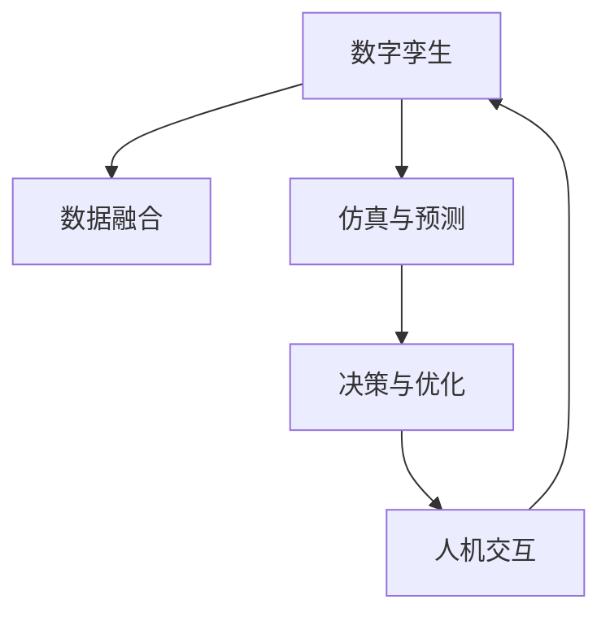

                 

# 未来的智慧城市：2050年的城市数字孪生与城市智能体

## 1. 背景介绍

### 1.1 问题由来

智慧城市建设作为全球城市发展的新趋势，已经在过去几年中取得显著进展。从交通、能源到公共安全，智慧城市在各个领域的应用正在深刻改变城市生活。但当前智慧城市仍存在诸多挑战，如信息孤岛、数据不透明、系统互操作性差等问题。为此，基于数字孪生的城市智能体应运而生，其通过构建物理世界和虚拟世界的双向映射，在数据融合、决策优化等方面展示了巨大潜力。

数字孪生技术最初应用于制造业领域，通过实时监测和模拟生产线，提升生产效率和质量。智慧城市中的数字孪生则是一种将物理世界的各种资源、过程、现象等数据信息，映射到虚拟空间中的技术。在2050年的城市未来展望中，数字孪生城市智能体将成为实现全域感知、全面服务和全局优化的关键，显著提升城市的智能化水平。

### 1.2 问题核心关键点

数字孪生城市智能体涉及的关键技术包括：

1. 传感器网络：用于采集物理世界的各类数据。
2. 数据融合与分析：将传感器数据进行集成和处理，形成可靠的城市全景图。
3. 仿真与预测：在虚拟世界中建立精确的物理模型，模拟各类城市现象，预测未来发展趋势。
4. 决策与优化：基于仿真结果，进行智能决策和优化调整。
5. 人机交互：通过友好的界面和交互机制，向用户提供信息和服务。

这些技术共同构成了一个完整的数字孪生城市智能体系统。通过各个组件的协同工作，该系统能够在城市治理、资源配置、应急响应等环节发挥重要作用。

## 2. 核心概念与联系

### 2.1 核心概念概述

为更好地理解数字孪生城市智能体的构建，本节将介绍几个密切相关的核心概念：

- 数字孪生(Digital Twin)：指物理世界与虚拟世界的双向映射，实时反映物理世界的变化，并在虚拟世界中进行操作和测试，以优化物理世界。
- 城市智能体(Urban Intelligence)：基于数字孪生技术构建的城市运行和管理的智能化系统，具有全面感知、自主决策和自我优化的能力。
- 数据融合(Data Fusion)：将不同来源的数据进行集成和融合，形成可靠的城市全景图。
- 仿真与预测(Simulation and Prediction)：通过虚拟仿真技术，建立精确的物理模型，对未来发展进行预测和模拟。
- 决策与优化(Decision and Optimization)：基于仿真结果和业务规则，进行智能决策和优化调整。
- 人机交互(Human-Computer Interaction, HCI)：提供友好的用户界面和交互机制，实现人机高效沟通。

这些概念之间的逻辑关系可以通过以下Mermaid流程图来展示：



这个流程图展示了数字孪生城市智能体的核心组件及其相互关系：

1. 数字孪生是虚拟世界与物理世界的双向映射。
2. 数据融合将多源数据集成，构建城市全景图。
3. 仿真与预测基于虚拟仿真技术，建立物理模型并模拟各类现象。
4. 决策与优化基于仿真结果和规则，进行智能决策和优化调整。
5. 人机交互提供友好的用户界面，实现人机互动。

## 3. 核心算法原理 & 具体操作步骤

### 3.1 算法原理概述

数字孪生城市智能体的核心算法原理基于模型驱动的软件工程(MDSE)和系统仿真(Simulation)，通过构建虚拟模型来模拟现实世界的运行和变化，进行智能决策和优化调整。

核心算法流程包括以下几个关键步骤：

1. 数据采集：通过各类传感器采集物理世界的各种数据，包括温度、湿度、流量、位置等信息。
2. 数据融合：将采集到的数据进行预处理和融合，形成可靠的城市全景图。
3. 仿真与预测：在虚拟世界中构建精确的物理模型，并基于实时数据进行仿真和预测。
4. 决策与优化：根据仿真结果，结合业务规则和目标，进行智能决策和优化调整。
5. 人机交互：通过友好的界面和交互机制，向用户提供实时信息和互动服务。

### 3.2 算法步骤详解

数字孪生城市智能体的算法步骤可以概括为以下几个关键环节：

**Step 1: 数据采集**

数据采集是数字孪生城市智能体的第一步。在这一环节，需要设计合适的传感器网络，采集物理世界的各种数据。例如，在交通领域，可以利用摄像头、雷达、GPS等传感器，实时监测交通流量、车速、车辆位置等信息。在能源领域，可以部署智能电表、水表、热表等设备，采集能源消耗和分布数据。

**Step 2: 数据融合**

数据融合是指将来自不同传感器和系统的数据进行集成和融合，形成可靠的城市全景图。这一过程通常涉及数据清洗、转换、合并等步骤。例如，在交通领域，需要将摄像头、雷达和GPS数据进行融合，形成一个统一的交通监控系统。

**Step 3: 仿真与预测**

仿真与预测是数字孪生城市智能体的核心环节。在这一环节，需要构建精确的物理模型，并基于实时数据进行仿真和预测。例如，在交通领域，可以建立交通流模型，并根据历史数据和实时流量预测未来的交通状况。

**Step 4: 决策与优化**

决策与优化是指根据仿真结果，结合业务规则和目标，进行智能决策和优化调整。例如，在交通领域，可以根据实时交通流量和路况信息，动态调整交通信号灯，优化交通流。

**Step 5: 人机交互**

人机交互是指通过友好的界面和交互机制，向用户提供实时信息和互动服务。这一过程通常涉及数据可视化、用户界面设计等技术。例如，在交通领域，可以通过智能手机APP、信息屏等方式，向用户提供实时交通信息和导航服务。

### 3.3 算法优缺点

数字孪生城市智能体的算法具有以下优点：

1. 实时性高：通过实时数据采集和仿真，能够快速响应城市中的各种变化，及时进行决策和优化。
2. 预测准确：通过建立精确的物理模型，能够对未来发展进行准确预测和模拟，减少不确定性。
3. 数据驱动：基于数据驱动的决策和优化，使得智能系统具有较高的鲁棒性和可靠性。
4. 交互友好：通过友好的用户界面，用户可以方便地获取信息和参与互动，提升用户体验。

同时，该算法也存在一定的局限性：

1. 数据质量依赖：数据采集和融合的准确性对系统的性能影响较大，一旦数据存在偏差或缺失，可能导致决策失误。
2. 仿真复杂度高：建立精确的物理模型和进行仿真，需要较高的计算能力和时间成本。
3. 人机交互复杂：友好的界面和交互机制设计复杂，需要大量的人机工程学知识。
4. 维护成本高：系统的运行和维护需要持续的资源投入，如数据更新、模型维护等。

尽管存在这些局限性，但数字孪生城市智能体的算法仍是未来城市智能化的重要方向。

### 3.4 算法应用领域

数字孪生城市智能体的算法广泛应用于城市各个领域，例如：

1. 智慧交通：通过实时监测交通流量、路况等数据，优化交通信号灯，缓解交通拥堵。
2. 智慧能源：通过监测能源消耗和分布数据，优化能源配置和调度，降低能耗。
3. 智慧公共安全：通过视频监控、传感器数据等，实现对犯罪、灾害等事件的实时监测和预警。
4. 智慧环境：通过监测空气、水质、噪音等环境指标，实现环境污染的实时监测和治理。
5. 智慧医疗：通过实时监测患者健康数据，优化医疗资源配置和诊疗方案，提升医疗服务质量。
6. 智慧教育：通过实时监测教学数据，优化教学资源配置和教学方法，提升教学效果。

这些领域的应用场景展示了数字孪生城市智能体的广泛潜力。

## 4. 数学模型和公式 & 详细讲解 & 举例说明

### 4.1 数学模型构建

在数字孪生城市智能体中，核心数学模型通常包括以下几个部分：

1. 物理模型：描述实体间相互作用和物理规律的数学模型。
2. 仿真模型：基于物理模型和初始条件，进行动态仿真的数学模型。
3. 优化模型：根据仿真结果和目标，进行优化调整的数学模型。
4. 预测模型：基于历史数据和当前状态，进行未来预测的数学模型。

这些数学模型通常涉及微分方程、概率模型、统计模型等，用于描述和预测城市中的各种现象。

### 4.2 公式推导过程

以下以交通流仿真模型为例，介绍数学模型的构建和推导过程。

假设城市中的车辆遵循线性方程：

$$
v(t) = v_{\text{max}} - k(t-t_0)
$$

其中，$v(t)$ 为车辆的实际速度，$v_{\text{max}}$ 为最高速度，$k$ 为加速度，$t_0$ 为车辆启动时间。

通过数值仿真，可以推导出车辆在某一时间点的速度和位置。例如，假设城市中有500辆车，在时间间隔 $\Delta t$ 内，每个车辆的速度和位置更新如下：

$$
v_i(t+\Delta t) = v_i(t) - k(t+\Delta t - t_0)
$$

$$
x_i(t+\Delta t) = x_i(t) + v_i(t)\Delta t
$$

其中，$i$ 为车辆编号。

通过这样的数学模型，可以实时计算和预测交通流的变化，为智能决策提供可靠的数据支持。

### 4.3 案例分析与讲解

下面以智能电网为例，展示数字孪生城市智能体在实际应用中的案例。

智能电网是智慧城市的核心之一，通过数字孪生技术，可以实时监测电网的运行状态，优化电能的分配和调度，提升电力系统的效率和可靠性。具体步骤如下：

1. 数据采集：通过智能电表、传感器等设备，实时采集电网中的电流、电压、功率等数据。
2. 数据融合：将采集到的数据进行清洗、转换和融合，形成可靠的城市电网全景图。
3. 仿真与预测：基于电网的物理模型和历史数据，进行仿真和预测，识别潜在的故障点。
4. 决策与优化：根据仿真结果，结合业务规则和目标，进行智能决策和优化调整，如调整输电线路、优化电网结构等。
5. 人机交互：通过友好的界面和交互机制，向电网管理人员提供实时信息和互动服务。

通过数字孪生技术，智能电网可以实现全域感知、全局优化，显著提升电网的智能化水平。

## 5. 项目实践：代码实例和详细解释说明

### 5.1 开发环境搭建

在进行数字孪生城市智能体的开发之前，我们需要准备好开发环境。以下是使用Python进行PyTorch开发的环境配置流程：

1. 安装Anaconda：从官网下载并安装Anaconda，用于创建独立的Python环境。

2. 创建并激活虚拟环境：
```bash
conda create -n pytorch-env python=3.8 
conda activate pytorch-env
```

3. 安装PyTorch：根据CUDA版本，从官网获取对应的安装命令。例如：
```bash
conda install pytorch torchvision torchaudio cudatoolkit=11.1 -c pytorch -c conda-forge
```

4. 安装相关库：
```bash
pip install numpy pandas scikit-learn matplotlib torch
```

5. 安装TensorFlow和TensorBoard：
```bash
pip install tensorflow
pip install tensorboard
```

完成上述步骤后，即可在`pytorch-env`环境中开始数字孪生城市智能体的开发。

### 5.2 源代码详细实现

下面我们以交通流仿真为例，展示基于PyTorch实现数字孪生城市智能体的代码实现。

首先，定义车辆模型类：

```python
import torch
import torch.nn as nn

class Vehicle(nn.Module):
    def __init__(self, max_speed, accel_rate):
        super(Vehicle, self).__init__()
        self.max_speed = max_speed
        self.accel_rate = accel_rate
    
    def forward(self, x, t):
        v = self.max_speed - self.accel_rate * (t - x[0])
        x = x + v * (t - x[0])
        return x, v
```

然后，定义交通流仿真模型类：

```python
import numpy as np

class TrafficFlow(nn.Module):
    def __init__(self, num_vehicles, max_speed, accel_rate, dt):
        super(TrafficFlow, self).__init__()
        self.num_vehicles = num_vehicles
        self.max_speed = max_speed
        self.accel_rate = accel_rate
        self.dt = dt
        
        self.vectors = torch.randn(num_vehicles, 2)
        self.positions = torch.zeros(num_vehicles, 2)
    
    def forward(self, t):
        for i in range(num_vehicles):
            x, v = self.vectors[i]
            self.positions[i] = self.positions[i] + v * self.dt
            self.vectors[i] = self.vectors[i] + self.accel_rate * self.dt
        
        return self.positions, self.vectors
```

最后，定义训练和仿真流程：

```python
import torch
import torch.nn as nn
import torch.optim as optim
import matplotlib.pyplot as plt

model = TrafficFlow(num_vehicles=500, max_speed=20, accel_rate=2, dt=0.01)

optimizer = optim.Adam(model.parameters(), lr=0.01)
loss_fn = nn.MSELoss()

epochs = 100
for epoch in range(epochs):
    positions, vectors = model(10)
    loss = loss_fn(positions, torch.randn_like(positions))
    optimizer.zero_grad()
    loss.backward()
    optimizer.step()
    
    if epoch % 10 == 0:
        plt.clf()
        plt.plot(positions[0, 0], positions[0, 1])
        plt.show()

plt.figure()
plt.plot(model.positions[0, 0], model.positions[0, 1])
plt.show()
```

以上代码展示了基于PyTorch实现交通流仿真的基本流程。通过定义车辆模型和交通流仿真模型，并使用Adam优化器进行训练，可以在仿真时间步长内模拟车辆的运动和位置。

### 5.3 代码解读与分析

让我们再详细解读一下关键代码的实现细节：

**Vehicle类**：
- 定义了车辆的基本属性和运动方程，通过继承PyTorch的Module类，可以方便地进行模型定义和训练。

**TrafficFlow类**：
- 定义了交通流的仿真模型，通过继承PyTorch的Module类，可以方便地进行模型定义和训练。
- 在初始化时，生成500个车辆的初始位置和速度向量。

**训练流程**：
- 通过定义Adam优化器和均方误差损失函数，对模型进行训练。
- 在每个epoch内，通过调用模型的forward方法计算当前时间步长的车辆位置和速度，并计算损失函数。
- 使用backward方法进行反向传播，更新模型参数。
- 在每个epoch结束时，绘制车辆位置随时间的变化曲线，可视化训练效果。

通过以上代码，可以看出PyTorch在实现数字孪生城市智能体中的强大优势。开发者可以使用PyTorch灵活定义模型，并利用丰富的优化算法和可视化工具，快速迭代和优化数字孪生模型。

## 6. 实际应用场景

### 6.1 智慧交通

数字孪生城市智能体在智慧交通领域的应用，可以显著提升交通系统的效率和可靠性。通过实时监测交通流量和路况，可以动态调整交通信号灯，缓解交通拥堵，提高道路通行效率。

例如，在交通路口，通过部署摄像头、雷达等设备，实时采集车辆位置、速度、方向等数据，并输入数字孪生模型进行仿真和预测。根据预测结果，智能系统可以动态调整交通信号灯的时序，优化车辆通行效率。

### 6.2 智慧能源

数字孪生城市智能体在智慧能源领域的应用，可以优化能源的配置和调度，降低能耗，提升能源系统的稳定性。

例如，在电网系统中，通过智能电表和传感器，实时监测电网的运行状态，包括电流、电压、功率等数据。将这些数据输入数字孪生模型进行仿真和预测，识别潜在的故障点，进行优化调整，如调整输电线路、优化电网结构等。通过这种方式，可以显著提升电网的智能化水平，减少能源浪费。

### 6.3 智慧公共安全

数字孪生城市智能体在智慧公共安全领域的应用，可以提升公共安全管理的效率和响应速度，减少安全隐患。

例如，在视频监控系统中，通过部署摄像头，实时采集监控视频数据。将这些数据输入数字孪生模型进行仿真和预测，识别异常行为和事件，进行预警和应对。通过这种方式，可以实时监控公共场所的安全状况，及时发现并应对潜在的风险。

### 6.4 未来应用展望

随着数字孪生技术的不断发展和完善，未来数字孪生城市智能体将在更多领域发挥重要作用，为城市智能化注入新的活力。

在智慧医疗领域，通过实时监测患者健康数据，优化医疗资源配置和诊疗方案，提升医疗服务质量。在智慧教育领域，通过实时监测教学数据，优化教学资源配置和教学方法，提升教学效果。在智慧环境领域，通过实时监测空气、水质、噪音等环境指标，实现环境污染的实时监测和治理。

未来，数字孪生城市智能体将与物联网、大数据、人工智能等技术深度融合，构建更全面、更智能的城市管理系统，全面提升城市治理的效率和质量。

## 7. 工具和资源推荐

### 7.1 学习资源推荐

为了帮助开发者系统掌握数字孪生城市智能体的理论基础和实践技巧，这里推荐一些优质的学习资源：

1. 《Python深度学习》（第二版）：由Francois Chollet撰写，详细介绍了使用PyTorch实现深度学习模型的过程，包括数据采集、数据处理、模型训练等。
2. 《Deep Learning for NLP》课程：斯坦福大学开设的深度学习课程，涵盖自然语言处理方面的知识，包括语言模型、序列建模等。
3. 《城市数据科学与分析》（City Data Science & Analytics）书籍：由Urban Data Labs撰写，系统介绍了城市数据科学与分析的理论与实践，包括数据采集、数据融合、仿真与预测等。
4. 《智慧城市：数据驱动的解决方案》（Smart Cities: Data-Driven Solutions）课程：由MIT开设的智慧城市课程，涵盖智慧城市建设的各个方面，包括城市数据管理、智能基础设施等。
5. 《城市系统模拟与优化》（Urban Systems Simulation and Optimization）书籍：由Urban Systems Group撰写，介绍了城市系统模拟与优化的基本理论和实践，包括城市仿真、优化模型等。

通过对这些资源的学习实践，相信你一定能够快速掌握数字孪生城市智能体的精髓，并用于解决实际的智慧城市问题。

### 7.2 开发工具推荐

高效的开发离不开优秀的工具支持。以下是几款用于数字孪生城市智能体开发的常用工具：

1. PyTorch：基于Python的开源深度学习框架，灵活动态的计算图，适合快速迭代研究。大部分数字孪生语言模型都有PyTorch版本的实现。
2. TensorFlow：由Google主导开发的开源深度学习框架，生产部署方便，适合大规模工程应用。同样有丰富的数字孪生语言模型资源。
3. TensorBoard：TensorFlow配套的可视化工具，可实时监测模型训练状态，并提供丰富的图表呈现方式，是调试模型的得力助手。
4. Weights & Biases：模型训练的实验跟踪工具，可以记录和可视化模型训练过程中的各项指标，方便对比和调优。与主流深度学习框架无缝集成。
5. Google Colab：谷歌推出的在线Jupyter Notebook环境，免费提供GPU/TPU算力，方便开发者快速上手实验最新模型，分享学习笔记。

合理利用这些工具，可以显著提升数字孪生城市智能体的开发效率，加快创新迭代的步伐。

### 7.3 相关论文推荐

数字孪生城市智能体的研究源于学界的持续研究。以下是几篇奠基性的相关论文，推荐阅读：

1. "Model-based Reinforcement Learning" 论文：提出了基于模型的强化学习框架，通过建立精确的物理模型进行优化决策。
2. "Traffic Flow Simulation and Optimization" 论文：介绍了基于模型的交通流仿真和优化方法，通过实时数据采集和仿真，优化交通流量。
3. "Smart Grid Simulation and Optimization" 论文：介绍了基于模型的智能电网仿真和优化方法，通过实时数据采集和仿真，优化能源配置。
4. "City Simulation and Optimization" 论文：介绍了基于模型的城市仿真和优化方法，通过实时数据采集和仿真，优化城市运行。
5. "Urban Data Analytics and Visualization" 论文：介绍了基于模型的城市数据处理和可视化方法，通过实时数据采集和仿真，优化城市管理。

这些论文代表了大语言模型微调技术的发展脉络。通过学习这些前沿成果，可以帮助研究者把握学科前进方向，激发更多的创新灵感。

## 8. 总结：未来发展趋势与挑战

### 8.1 总结

本文对数字孪生城市智能体的理论基础和实践技巧进行了全面系统的介绍。首先阐述了数字孪生城市智能体的研究背景和意义，明确了数字孪生技术在智慧城市中的应用潜力。其次，从原理到实践，详细讲解了数字孪生城市智能体的数学模型和关键步骤，给出了数字孪生城市智能体的代码实例。同时，本文还广泛探讨了数字孪生技术在智慧交通、智慧能源、智慧公共安全等多个领域的应用前景，展示了数字孪生技术的广阔应用场景。

通过本文的系统梳理，可以看到，数字孪生城市智能体在构建智慧城市中具有重要的地位，其通过数据驱动的仿真与预测，智能决策与优化，显著提升了城市治理和管理的智能化水平。未来，数字孪生城市智能体将与更多先进技术深度融合，构建更全面、更智能的城市管理系统，全面提升城市治理的效率和质量。

### 8.2 未来发展趋势

展望未来，数字孪生城市智能体将呈现以下几个发展趋势：

1. 模型精度提升：随着计算能力和数据质量的提升，数字孪生模型的精度将逐步提升，能够更准确地反映物理世界的运行和变化。
2. 数据融合与共享：通过开放数据平台，实现多源数据的融合与共享，形成更全面的城市全景图。
3. 实时化与自适应：数字孪生系统将具备更强的实时处理能力和自适应能力，能够快速响应城市中的各种变化。
4. 全域感知与全局优化：通过全域感知，数字孪生系统能够全面掌握城市运行状态，实现全局优化。
5. 人机交互提升：通过友好的界面和交互机制，提升用户的使用体验，增强系统的人机协同能力。

以上趋势展示了数字孪生城市智能体的未来发展方向，这些方向的探索发展，将使数字孪生技术在城市智能化应用中发挥更大的作用。

### 8.3 面临的挑战

尽管数字孪生城市智能体在智慧城市建设中具有显著的优势，但在迈向更加智能化、普适化应用的过程中，仍面临诸多挑战：

1. 数据质量依赖：数字孪生系统的性能很大程度上依赖于数据质量，一旦数据存在偏差或缺失，可能导致决策失误。如何提高数据采集和融合的准确性，是数字孪生技术的一大挑战。
2. 模型复杂度高：建立精确的物理模型和进行仿真，需要较高的计算能力和时间成本。如何简化模型结构，提高仿真效率，是数字孪生技术需要解决的重要问题。
3. 系统互操作性差：各领域和各层级的数字孪生系统需要实现互操作性，才能形成统一的数字孪生平台。如何实现系统间的协同工作，是数字孪生技术的一大难题。
4. 隐私和安全问题：数字孪生系统的广泛应用，涉及大量的敏感数据，如何保护用户隐私和数据安全，是数字孪生技术的重要研究方向。
5. 成本和技术门槛高：数字孪生系统的构建和维护需要较高的成本和技术门槛，如何降低成本，提升技术可及性，是数字孪生技术需要解决的重要问题。

尽管存在这些挑战，但数字孪生技术的发展前景依然广阔。通过持续的技术创新和产业实践，这些挑战终将一一被克服，数字孪生城市智能体必将在构建智慧城市中发挥重要作用。

### 8.4 研究展望

面向未来，数字孪生城市智能体的研究需要在以下几个方面寻求新的突破：

1. 跨领域融合：将数字孪生技术与物联网、大数据、人工智能等技术深度融合，构建更加全面、智能的城市管理系统。
2. 智能决策与优化：通过引入因果分析、强化学习等方法，增强数字孪生系统的智能决策和优化能力。
3. 隐私保护与安全：通过引入隐私保护技术、数据加密等手段，保障数字孪生系统中的数据隐私和安全。
4. 实时化与自适应：通过引入实时处理技术、自适应算法等方法，提高数字孪生系统的实时处理能力和自适应能力。
5. 普适化与可扩展性：通过引入模块化设计、微服务架构等方法，提升数字孪生系统的普适化和可扩展性。

这些研究方向的探索，将引领数字孪生技术向更高的台阶发展，为构建安全、可靠、可解释、可控的智能系统铺平道路。面向未来，数字孪生城市智能体需要与其他人工智能技术进行更深入的融合，共同推动智慧城市的发展。只有勇于创新、敢于突破，才能不断拓展数字孪生技术在智慧城市中的应用边界，实现更加全面、智能的城市管理。

## 9. 附录：常见问题与解答

**Q1：数字孪生城市智能体如何实现全域感知？**

A: 数字孪生城市智能体的全域感知依赖于广泛部署的传感器网络，包括摄像头、雷达、GPS、智能电表等设备。这些传感器采集到的实时数据，通过数据融合技术，形成可靠的城市全景图。通过数字孪生模型，可以实时监测城市中的各种变化，实现全域感知。

**Q2：数字孪生城市智能体如何实现全局优化？**

A: 数字孪生城市智能体的全局优化依赖于优化算法和仿真模型的结合。在仿真模型中，通过建立精确的物理模型，并基于实时数据进行仿真和预测，可以识别潜在的故障点，进行优化调整。在优化算法中，通过智能决策和优化调整，可以提升城市系统的效率和可靠性。通过这种方式，数字孪生城市智能体可以实现全局优化。

**Q3：数字孪生城市智能体面临哪些挑战？**

A: 数字孪生城市智能体在应用过程中面临以下挑战：
1. 数据质量依赖：数据采集和融合的准确性对系统的性能影响较大，一旦数据存在偏差或缺失，可能导致决策失误。
2. 模型复杂度高：建立精确的物理模型和进行仿真，需要较高的计算能力和时间成本。
3. 系统互操作性差：各领域和各层级的数字孪生系统需要实现互操作性，才能形成统一的数字孪生平台。
4. 隐私和安全问题：数字孪生系统的广泛应用，涉及大量的敏感数据，如何保护用户隐私和数据安全，是数字孪生技术的重要研究方向。
5. 成本和技术门槛高：数字孪生系统的构建和维护需要较高的成本和技术门槛，如何降低成本，提升技术可及性，是数字孪生技术需要解决的重要问题。

尽管存在这些挑战，但数字孪生技术的发展前景依然广阔。通过持续的技术创新和产业实践，这些挑战终将一一被克服，数字孪生城市智能体必将在构建智慧城市中发挥重要作用。

---

作者：禅与计算机程序设计艺术 / Zen and the Art of Computer Programming

