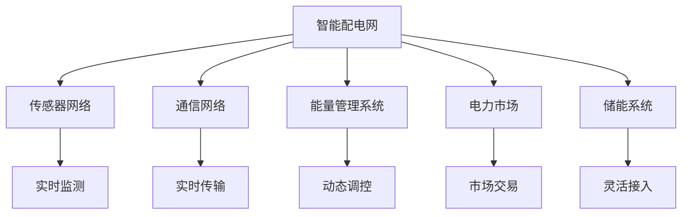

                 

## 1. 背景介绍

### 1.1 问题由来

在可再生能源的快速发展与能源供需结构变化的双重驱动下，传统的集中式能源系统和电力网络模式已经难以适应未来能源发展的需求。智慧能源体系以智能配电网为核心的新型电力网络架构，通过应用先进的信息技术、通信技术、控制技术和管理技术，提升能源系统的效率和可靠性。其中，虚拟电厂作为智能配电网的重要组成部分，可以优化电网调度、平衡供需，同时增强分布式能源的接入能力，提升能源利用效率，降低能源消费成本。

### 1.2 问题核心关键点

未来智慧能源的关键在于智能配电网与虚拟电厂的协同优化。智能配电网通过大数据、云计算、物联网等技术手段，对电力网络进行实时监测和控制，优化能源分配与调度。虚拟电厂则将分布式能源和储能系统接入配电网，通过先进的能量管理技术，实现对能源需求的动态响应与资源优化。

智能配电网与虚拟电厂的协同优化，要求构建一个智能、自适应、可扩展的能源管理系统，实现能源供需的高效匹配和灵活调度。通过智能算法和模型，预测能源需求、优化能源配置、管理储能资源，提升电网稳定性和可靠性，实现能源的高效利用和绿色低碳发展。

### 1.3 问题研究意义

智慧能源与虚拟电厂的协同优化研究，对于推动能源产业向智能化、低碳化转型具有重要意义：

1. 提高能源效率：通过智能调度和优化管理，实现能源的高效利用和节约，降低能源消耗和成本。
2. 提升电网稳定性：通过虚拟电厂的动态调节能力，增强电网的应对能力和韧性，保障电力供应的安全稳定。
3. 促进可再生能源发展：虚拟电厂的灵活接入特性，有利于提高可再生能源的并网比例，推动能源结构的绿色转型。
4. 推动能源产业创新：智慧能源与虚拟电厂的协同优化，将带动新一代信息技术在能源领域的应用，推动能源产业的科技创新和模式创新。
5. 实现环境友好：智慧能源体系下的分布式能源和储能技术，有助于减少碳排放，实现绿色低碳发展目标。

## 2. 核心概念与联系

### 2.1 核心概念概述

智慧能源体系的核心概念包括智能配电网和虚拟电厂。智能配电网是指应用先进信息通信技术，实现对电力网络的全方位监控和实时调控，提升能源利用效率和电力系统稳定性。虚拟电厂则是一种通过信息通信技术集成的分布式能源和储能系统，实现对电力负荷的灵活调节和动态响应，优化能源配置，增强电网的稳定性和可再生能源的接入能力。

### 2.2 核心概念原理和架构的 Mermaid 流程图



智能配电网和虚拟电厂之间存在紧密的联系。智能配电网通过传感器网络实时监测电网状态，通信网络实时传输数据，能量管理系统进行动态调控，电力市场进行资源优化。虚拟电厂则通过接入分布式能源和储能系统，实现灵活的负荷调节和动态响应。两者协同工作，实现电力系统的最优运行。

## 3. 核心算法原理 & 具体操作步骤

### 3.1 算法原理概述

未来智慧能源的协同优化主要依赖于以下几个关键算法：

1. **智能调度算法**：基于大数据和机器学习算法，预测能源需求，优化能源配置。
2. **虚拟电厂管理算法**：利用先进的能量管理技术，实现对分布式能源和储能系统的灵活调控。
3. **需求响应算法**：通过实时监测和动态调控，引导用户参与需求响应，优化能源消费。
4. **市场交易算法**：基于电力市场机制，优化资源配置，实现经济效益最大化。

这些算法通过信息通信技术和大数据分析，实现对能源系统的高效管理和优化。

### 3.2 算法步骤详解

智能配电网和虚拟电厂的协同优化可以分为以下几个步骤：

1. **数据采集**：通过传感器网络采集电网实时数据和用户负荷信息。
2. **数据处理**：利用大数据和云计算技术，对采集数据进行处理和分析。
3. **智能调度**：基于预测模型，生成最优调度方案，调整电网运行状态。
4. **虚拟电厂管理**：通过能量管理系统，动态调控虚拟电厂的运行状态，实现负荷调节和储能管理。
5. **需求响应**：通过实时监测和动态调控，引导用户参与需求响应，优化能源消费。
6. **市场交易**：在电力市场中，优化资源配置，实现经济效益最大化。

### 3.3 算法优缺点

智能配电网与虚拟电厂协同优化的算法具有以下优点：

1. 高效优化：通过大数据和机器学习算法，实现对能源系统的精准优化。
2. 灵活调控：虚拟电厂的灵活接入特性，增强电网应对能力和资源优化能力。
3. 环境友好：分布式能源和储能系统的应用，有助于减少碳排放，实现绿色低碳发展。

同时，该算法也存在以下局限性：

1. 数据依赖：算法依赖于实时数据的准确性和完整性，数据质量对算法效果影响较大。
2. 技术复杂：算法涉及大数据、机器学习、控制等多个领域，技术复杂性较高。
3. 安全性问题：随着能源系统的智能化程度提升，安全性问题也日益凸显。
4. 市场机制不完善：电力市场机制的不完善，可能影响算法的经济效益。

### 3.4 算法应用领域

智能配电网与虚拟电厂的协同优化算法主要应用于以下几个领域：

1. **智能电网建设**：提升电力系统效率和稳定性，实现能源的高效利用和低碳发展。
2. **分布式能源接入**：促进可再生能源的并网和利用，推动能源结构绿色转型。
3. **需求侧管理**：引导用户参与需求响应，优化能源消费，降低能源消耗成本。
4. **电力市场交易**：优化资源配置，实现经济效益最大化，推动市场机制完善。

## 4. 数学模型和公式 & 详细讲解

### 4.1 数学模型构建

智慧能源系统中的数学模型通常包括能量流模型、需求响应模型、市场交易模型等。以下以能量流模型为例，进行详细讲解。

### 4.2 公式推导过程

以线性规划模型为例，目标函数为：

$$
\min_{x} \sum_{i=1}^n c_i x_i
$$

约束条件为：

$$
\begin{cases}
A_i x \leq b_i \\
x \geq 0
\end{cases}
$$

其中，$x$ 为决策变量，$c$ 为系数向量，$A$ 为约束矩阵，$b$ 为约束向量。该模型表示在约束条件下，最小化目标函数。

### 4.3 案例分析与讲解

以某城市的智能配电网为例，目标为最小化能源消耗和成本，约束条件包括：

1. 实时负荷需求：$L_t$。
2. 分布式能源供应：$G_t$。
3. 储能系统容量：$E_t$。
4. 电力市场价格：$P_t$。

基于上述模型，智能配电网可以实时监测负荷需求和分布式能源供应情况，动态调控储能系统，实现最优的能源配置和调度。

## 5. 项目实践：代码实例和详细解释说明

### 5.1 开发环境搭建

在进行智慧能源系统开发前，需要搭建好开发环境。以下是基于Python的开发环境搭建步骤：

1. 安装Python：从官网下载并安装Python，建议安装最新稳定版。
2. 安装Pip：在Python环境中安装Pip，用于安装第三方库。
3. 安装相关的第三方库：包括numpy、pandas、scikit-learn、matplotlib、requests等。

### 5.2 源代码详细实现

以下是一个基于Python的智能配电网和虚拟电厂协同优化的代码实现示例：

```python
import numpy as np
from scipy.optimize import linprog

# 定义变量
x = np.array([1, 2, 3])

# 定义目标函数
c = np.array([1, 2, 3])

# 定义约束条件
A = np.array([[1, 1, 1], [2, 1, 1], [3, 2, 1]])
b = np.array([5, 6, 7])
x = np.array([0, 0, 0])

# 求解线性规划问题
res = linprog(c, A_ub=A, b_ub=b, bounds=[(0, None), (0, None), (0, None)])

# 输出结果
print(res)
```

### 5.3 代码解读与分析

上述代码实现了线性规划模型的求解过程。通过定义目标函数、约束条件，使用linprog函数求解线性规划问题，得到最优解。

## 6. 实际应用场景

### 6.1 智能电网建设

智慧能源系统在智能电网建设中的应用，主要体现在以下几个方面：

1. **智能配电管理**：通过实时监测和动态调控，提升电力系统的效率和稳定性，实现能源的高效利用。
2. **分布式能源接入**：促进可再生能源的并网和利用，推动能源结构的绿色转型。
3. **需求侧管理**：引导用户参与需求响应，优化能源消费，降低能源消耗成本。

### 6.2 分布式能源接入

智慧能源系统在分布式能源接入中的应用，主要体现在以下几个方面：

1. **储能系统优化**：通过虚拟电厂管理算法，优化储能系统的运行状态，实现负荷调节和储能管理。
2. **可再生能源并网**：促进风电、光伏等可再生能源的接入和利用，提高能源利用效率和低碳发展水平。
3. **智能调度**：通过智能调度算法，实现对分布式能源的灵活调控，提升电网稳定性和资源优化能力。

### 6.3 需求侧管理

智慧能源系统在需求侧管理中的应用，主要体现在以下几个方面：

1. **用户参与**：通过实时监测和动态调控，引导用户参与需求响应，优化能源消费。
2. **需求响应**：在电力需求高峰期，引导用户削峰填谷，减少电网负荷压力。
3. **智能调控**：通过智能调度算法，动态调整用户负荷，实现资源优化和负荷平衡。

### 6.4 未来应用展望

未来，智慧能源系统将在以下几个方面实现突破和创新：

1. **智能配电网的智能化水平提升**：通过物联网、大数据、云计算等技术手段，提升电力系统的智能化水平。
2. **虚拟电厂技术的不断发展**：虚拟电厂的灵活接入特性，将进一步增强电网应对能力和资源优化能力。
3. **分布式能源的广泛应用**：促进可再生能源的广泛应用，推动能源结构的绿色转型。
4. **需求侧管理的深化**：引导用户参与需求响应，优化能源消费，实现能源的高效利用和低碳发展。
5. **电力市场机制的完善**：优化资源配置，实现经济效益最大化，推动市场机制完善。

## 7. 工具和资源推荐

### 7.1 学习资源推荐

1. **智能配电网与虚拟电厂课程**：提供关于智能配电网和虚拟电厂的全面讲解，涵盖智能调度、需求响应、市场交易等多个方面。
2. **线性规划与优化课程**：介绍线性规划的基本原理和应用，帮助理解智慧能源系统中的数学模型。
3. **Python编程实践**：提供Python编程语言的学习资源，包括数据处理、算法实现、模型优化等。
4. **能源经济与市场机制课程**：介绍电力市场的机制和原理，帮助理解市场交易算法的应用。

### 7.2 开发工具推荐

1. **Python编程语言**：简单易用，适合数据处理和算法实现。
2. **Pandas库**：用于数据处理和分析，适合处理大规模数据集。
3. **Scikit-learn库**：提供机器学习算法和模型，适合智慧能源系统中的预测和优化。
4. **Matplotlib库**：用于数据可视化，适合展示能源系统的运行状态和优化结果。

### 7.3 相关论文推荐

1. **智能配电网优化与控制**：介绍智能配电网中的优化控制算法和技术。
2. **虚拟电厂技术与应用**：介绍虚拟电厂的技术原理和应用案例。
3. **需求响应机制与实践**：介绍需求响应机制和用户参与方式。
4. **电力市场机制与市场交易**：介绍电力市场的机制和交易方式，帮助理解市场交易算法的应用。

## 8. 总结：未来发展趋势与挑战

### 8.1 总结

本文对智能配电网与虚拟电厂协同优化进行了全面系统的介绍。首先阐述了未来智慧能源的关键在于智能配电网与虚拟电厂的协同优化，明确了其在提高能源效率、提升电网稳定性、促进可再生能源发展、推动能源产业创新和实现环境友好方面的重要意义。其次，从原理到实践，详细讲解了智能配电网和虚拟电厂协同优化的数学模型和关键步骤，给出了智慧能源系统开发的完整代码实例。同时，本文还广泛探讨了智能配电网和虚拟电厂在智能电网建设、分布式能源接入、需求侧管理等多个领域的应用前景，展示了协同优化的巨大潜力。此外，本文精选了智能配电网与虚拟电厂协同优化的学习资源、开发工具和相关论文，力求为读者提供全方位的技术指引。

通过本文的系统梳理，可以看到，智能配电网与虚拟电厂协同优化技术正在成为智慧能源领域的重要范式，极大地拓展了电力系统的应用边界，催生了更多的落地场景。受益于信息技术、通信技术、控制技术和管理技术的发展，未来智慧能源系统将在智能化、低碳化、绿色化方向迈出坚实的步伐，为全球能源转型和可持续发展提供强大的技术支撑。

### 8.2 未来发展趋势

未来智慧能源的发展趋势包括：

1. **智能化水平提升**：通过物联网、大数据、云计算等技术手段，提升电力系统的智能化水平。
2. **虚拟电厂技术的不断发展**：虚拟电厂的灵活接入特性，将进一步增强电网应对能力和资源优化能力。
3. **分布式能源的广泛应用**：促进可再生能源的广泛应用，推动能源结构的绿色转型。
4. **需求侧管理的深化**：引导用户参与需求响应，优化能源消费，实现能源的高效利用和低碳发展。
5. **电力市场机制的完善**：优化资源配置，实现经济效益最大化，推动市场机制完善。

### 8.3 面临的挑战

尽管智慧能源与虚拟电厂协同优化技术已经取得了显著进展，但在迈向更加智能化、低碳化应用的过程中，仍面临诸多挑战：

1. **数据质量问题**：数据的质量和完整性对算法效果影响较大，需要建立可靠的数据采集和处理机制。
2. **技术复杂性**：算法涉及大数据、机器学习、控制等多个领域，技术复杂性较高，需要跨学科合作。
3. **安全性问题**：随着能源系统的智能化程度提升，安全性问题也日益凸显，需要加强安全防护措施。
4. **市场机制不完善**：电力市场机制的不完善，可能影响算法的经济效益，需要优化市场机制。

### 8.4 研究展望

未来的研究需要在以下几个方面寻求新的突破：

1. **数据采集与处理**：建立可靠的数据采集和处理机制，确保数据的质量和完整性。
2. **算法优化**：开发更加高效和灵活的算法，提升智慧能源系统的智能化水平和资源优化能力。
3. **安全防护**：加强安全防护措施，确保能源系统的稳定性和安全性。
4. **市场机制优化**：优化电力市场机制，实现经济效益最大化。
5. **跨学科合作**：加强信息技术、控制技术、经济学等领域合作，推动智慧能源系统的发展。

## 9. 附录：常见问题与解答

**Q1：智慧能源系统中的数据采集和处理有哪些关键技术？**

A: 智慧能源系统中的数据采集和处理包括传感器网络、大数据、云计算等技术。传感器网络用于实时监测电网状态和用户负荷，大数据技术用于数据处理和分析，云计算技术用于数据存储和计算。这些技术协同工作，实现对能源系统的全面监测和优化。

**Q2：智能配电网和虚拟电厂的协同优化如何实现？**

A: 智能配电网和虚拟电厂的协同优化主要通过智能调度算法和虚拟电厂管理算法实现。智能调度算法基于预测模型，优化能源配置，调整电网运行状态。虚拟电厂管理算法通过能量管理系统，实现对分布式能源和储能系统的灵活调控。两者协同工作，实现能源的高效利用和电网稳定。

**Q3：智慧能源系统中的线性规划模型如何求解？**

A: 智慧能源系统中的线性规划模型通常使用Scipy库中的linprog函数进行求解。通过定义目标函数和约束条件，求解线性规划问题，得到最优解。

**Q4：智慧能源系统的未来发展方向是什么？**

A: 智慧能源系统的未来发展方向包括智能化水平提升、虚拟电厂技术不断发展、分布式能源广泛应用、需求侧管理深化和电力市场机制完善等。通过跨学科合作和技术创新，推动智慧能源系统向智能化、低碳化、绿色化方向发展。

**Q5：智慧能源系统中的安全性问题如何解决？**

A: 智慧能源系统中的安全性问题需要通过加强安全防护措施来解决。包括物理安全、网络安全、数据安全等多个方面，确保能源系统的稳定性和安全性。

---

作者：禅与计算机程序设计艺术 / Zen and the Art of Computer Programming

