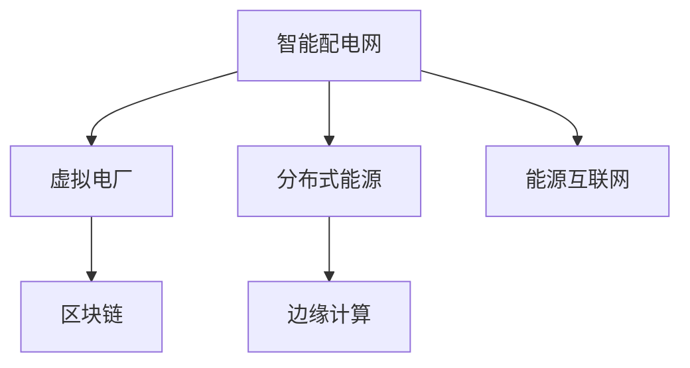

                 

## 1. 背景介绍

### 1.1 问题由来

在过去的几十年里，全球能源结构经历了显著的变化。随着化石燃料的逐渐枯竭和环境污染的日益严重，各国政府和社会各界越来越重视清洁能源的开发和使用。与此同时，智能电网技术的不断进步，为清洁能源的高效利用提供了新的可能。

智能电网，即采用先进通信、信息和控制技术，实现对电力系统的智能化管理和优化。通过智能电网，可以更好地实现电能的生产、输送、分配和消费的协调，提高能源利用效率，降低碳排放，提升电力系统的可靠性与安全性。

虚拟电厂(Virtual Power Plant, VPP)作为智能电网的一个重要组成部分，通过聚合多种分布式能源资源，实现对电网的灵活控制，提升电网的稳定性和灵活性。虚拟电厂可以整合太阳能、风能、储能等分布式能源，形成统一的能源市场，优化电力资源的配置和利用。

然而，随着分布式能源的逐步普及和智能电网的不断扩展，现有电力系统架构和控制策略面临巨大挑战。如何在未来几十年内，构建一个高效、可靠、灵活的智能配电网与虚拟电厂系统，是当前能源领域的重要课题。

### 1.2 问题核心关键点

构建未来的智慧能源系统，需解决以下核心问题：

1. **数据采集与分析**：如何高效采集和处理大量分布式能源的数据，实时监测电力系统的运行状态，为决策提供依据。
2. **优化调度与控制**：如何根据实时数据和预测结果，实现电力的高效分配和控制，优化系统性能。
3. **市场机制与交易**：如何在多个能源主体之间，建立透明、公平的能源交易机制，促进资源的合理分配。
4. **灵活性与可靠性**：如何在能源供应不确定性增加的情况下，提升电网的灵活性和可靠性，保障电力系统的稳定运行。
5. **环境与经济平衡**：如何在清洁能源利用与经济利益之间找到平衡点，实现可持续发展。

这些问题需要综合考虑技术、经济、政策等多方面因素，采取系统化的解决方案。

## 2. 核心概念与联系

### 2.1 核心概念概述

构建未来的智慧能源系统，涉及多个核心概念，包括智能配电网、虚拟电厂、分布式能源、能源互联网、区块链、边缘计算等。这些概念之间的逻辑关系可以通过以下Mermaid流程图来展示：



这个流程图展示了一些关键概念及其之间的关系：

1. **智能配电网**：利用先进通信、信息和控制技术，实现电网的智能化管理和优化。
2. **虚拟电厂**：通过聚合多种分布式能源资源，实现对电网的灵活控制，提升电网的稳定性和灵活性。
3. **分布式能源**：如太阳能、风能、储能等，是虚拟电厂和智能配电网的重要组成部分。
4. **能源互联网**：基于互联网技术，构建统一的能源市场，实现资源的优化配置。
5. **区块链**：用于能源交易的安全、透明和可信，保障市场公平性。
6. **边缘计算**：在网络边缘节点处理数据，降低传输延迟，提升计算效率。

这些概念共同构成了未来智慧能源系统的技术框架，使其能够高效、可靠地运行。

## 3. 核心算法原理 & 具体操作步骤
### 3.1 算法原理概述

构建智能配电网与虚拟电厂系统，涉及多个核心算法和优化策略。以下是其主要算法原理：

1. **数据采集与处理**：通过智能传感器和边缘计算设备，实时采集分布式能源的数据，并利用大数据技术进行清洗和分析，提取有用信息。

2. **电力优化调度**：利用优化算法（如线性规划、混合整数规划等），根据电力系统的实时数据和预测结果，制定最优的电力分配和控制策略。

3. **市场机制与交易**：采用区块链技术，建立透明、公平的能源交易平台，实现能源资源的合理分配。

4. **灵活性与可靠性**：通过引入储能设备、虚拟电厂等技术，提升电网的灵活性和可靠性，保障电力系统的稳定运行。

5. **环境与经济平衡**：采用绿色能源政策和经济激励措施，鼓励清洁能源的使用，促进可持续发展。

### 3.2 算法步骤详解

基于上述算法原理，构建智能配电网与虚拟电厂系统的一般步骤如下：

**Step 1: 数据采集与处理**

1. 部署智能传感器和边缘计算设备，采集分布式能源的数据，包括电压、电流、功率等。
2. 利用大数据技术进行数据清洗和处理，去除噪声和异常值，提取有用的信息。
3. 实时监测电力系统的运行状态，为优化调度和控制提供依据。

**Step 2: 电力优化调度**

1. 根据实时数据和预测结果，制定电力分配和控制策略。
2. 利用优化算法求解最优解，生成调度指令。
3. 通过通信网络将调度指令下发到各个控制单元，实现电力系统的智能化管理。

**Step 3: 市场机制与交易**

1. 建立透明的能源交易平台，采用区块链技术，确保交易过程的安全和透明。
2. 根据市场规则，计算各能源主体的收益和成本，制定交易规则。
3. 根据交易结果，调整电力分配和控制策略，优化资源配置。

**Step 4: 灵活性与可靠性**

1. 引入储能设备、虚拟电厂等技术，提升电网的灵活性和可靠性。
2. 制定应急预案，应对极端天气、设备故障等突发情况，保障电力系统的稳定运行。
3. 定期维护和更新系统设备，保证系统性能的持续优化。

**Step 5: 环境与经济平衡**

1. 采用绿色能源政策和经济激励措施，鼓励清洁能源的使用。
2. 对清洁能源项目给予财政补贴和技术支持，降低成本，提升竞争力。
3. 对高碳排放的能源项目进行限制和淘汰，推动能源结构的转型升级。

### 3.3 算法优缺点

智能配电网与虚拟电厂系统具有以下优点：

1. **高效性**：通过实时数据采集和处理，优化电力分配和控制，提高能源利用效率。
2. **灵活性**：利用分布式能源和储能技术，提升电网的灵活性和可靠性，应对能源供应的不确定性。
3. **透明性**：通过区块链技术，建立透明、公平的能源交易平台，提升市场公平性。
4. **可扩展性**：系统架构具有高度的灵活性和可扩展性，便于应对未来的变化和需求。

然而，该系统也存在以下缺点：

1. **技术复杂性**：系统涉及多种技术和算法，技术实现较为复杂。
2. **初始投资高**：智能传感器、边缘计算设备和储能设备等初始投资较高。
3. **数据隐私和安全**：大规模数据采集和处理过程中，数据隐私和安全问题需要重点关注。
4. **政策与法规**：需要相应的政策与法规支持，推动系统的实施和普及。

### 3.4 算法应用领域

智能配电网与虚拟电厂系统在多个领域得到广泛应用：

1. **智慧城市**：实现能源的高效利用，提升城市管理的智能化水平。
2. **可再生能源**：优化可再生能源的配置和利用，提升清洁能源的利用率。
3. **工业生产**：实现能源的高效管理和优化，降低工业生产的能耗和成本。
4. **商业地产**：优化商业地产的能源配置和利用，提升商业地产的运营效率和客户体验。
5. **家庭生活**：实现家庭能源的高效管理和优化，提升家庭生活质量。

## 4. 数学模型和公式 & 详细讲解  
### 4.1 数学模型构建

构建智能配电网与虚拟电厂系统，涉及多个数学模型。以下是主要模型的构建过程：

1. **电力负荷预测模型**：利用时间序列预测算法（如ARIMA、LSTM等），根据历史数据和实时数据，预测未来的电力负荷。
2. **电力优化调度模型**：利用线性规划或混合整数规划算法，求解最优的电力分配和控制策略。
3. **能源市场交易模型**：利用博弈论模型，制定透明、公平的能源交易规则，实现资源的最优配置。

### 4.2 公式推导过程

以电力负荷预测模型为例，其数学模型为：

$$
\hat{L}_t = \alpha \hat{L}_{t-1} + \beta \hat{L}_{t-2} + \epsilon_t
$$

其中 $\hat{L}_t$ 为第 $t$ 时刻的预测电力负荷，$\alpha$ 和 $\beta$ 为预测模型的参数，$\epsilon_t$ 为误差项。

通过最小化预测误差，求解最优的 $\alpha$ 和 $\beta$，即可构建电力负荷预测模型。

### 4.3 案例分析与讲解

假设某城市有若干个分布式能源站点，包括太阳能、风能、储能等。利用上述模型，我们可以实时监测电网的运行状态，预测未来的电力负荷，制定最优的电力分配和控制策略，优化电力资源的配置和利用。

## 5. 项目实践：代码实例和详细解释说明
### 5.1 开发环境搭建

在进行系统开发前，需要准备好开发环境。以下是使用Python进行PyTorch开发的环境配置流程：

1. 安装Anaconda：从官网下载并安装Anaconda，用于创建独立的Python环境。

2. 创建并激活虚拟环境：
```bash
conda create -n energy-env python=3.8 
conda activate energy-env
```

3. 安装PyTorch：根据CUDA版本，从官网获取对应的安装命令。例如：
```bash
conda install pytorch torchvision torchaudio cudatoolkit=11.1 -c pytorch -c conda-forge
```

4. 安装各类工具包：
```bash
pip install numpy pandas scikit-learn matplotlib tqdm jupyter notebook ipython
```

完成上述步骤后，即可在`energy-env`环境中开始系统开发。

### 5.2 源代码详细实现

下面以电力负荷预测为例，给出使用PyTorch进行系统开发的PyTorch代码实现。

首先，定义电力负荷预测模型：

```python
import torch
import torch.nn as nn
import torch.optim as optim
from torch.autograd import Variable

class LSTM(nn.Module):
    def __init__(self, input_size, hidden_size, output_size):
        super(LSTM, self).__init__()
        self.hidden_size = hidden_size
        self.lstm = nn.LSTM(input_size, hidden_size, 1)
        self.fc = nn.Linear(hidden_size, output_size)
        
    def forward(self, x):
        h0 = Variable(torch.zeros(1, 1, self.hidden_size))
        c0 = Variable(torch.zeros(1, 1, self.hidden_size))
        out, _ = self.lstm(x, (h0, c0))
        out = self.fc(out[:, -1, :])
        return out
```

然后，定义训练函数：

```python
def train(model, data_loader, optimizer, loss_fn):
    model.train()
    total_loss = 0
    for i, (x, y) in enumerate(data_loader):
        x = Variable(x)
        y = Variable(y)
        optimizer.zero_grad()
        output = model(x)
        loss = loss_fn(output, y)
        loss.backward()
        optimizer.step()
        total_loss += loss.data[0]
    return total_loss / len(data_loader)
```

最后，启动训练流程并在测试集上评估：

```python
epochs = 50
batch_size = 32

model = LSTM(input_size=1, hidden_size=64, output_size=1)
optimizer = optim.Adam(model.parameters(), lr=0.001)

train_loader = ...
test_loader = ...

for epoch in range(epochs):
    loss = train(model, train_loader, optimizer, loss_fn)
    print(f"Epoch {epoch+1}, train loss: {loss:.3f}")
    
    test_loss = ...
    print(f"Epoch {epoch+1}, test loss: {test_loss:.3f}")
```

以上就是使用PyTorch对电力负荷预测模型进行训练的完整代码实现。可以看到，通过PyTorch的强大封装，我们可以用相对简洁的代码完成模型训练。

### 5.3 代码解读与分析

让我们再详细解读一下关键代码的实现细节：

**LSTM类**：
- `__init__`方法：初始化LSTM模型的输入大小、隐藏大小、输出大小。
- `forward`方法：前向传播计算模型的输出。

**train函数**：
- 将模型设置为训练模式。
- 在每个批次上计算模型的输出，并使用损失函数计算误差。
- 反向传播更新模型参数。
- 累加计算训练集的总损失，并返回平均损失。

**训练流程**：
- 定义总的epoch数和batch size，开始循环迭代。
- 每个epoch内，先在训练集上训练，输出平均损失。
- 在测试集上评估模型性能。
- 所有epoch结束后，输出最终的测试损失。

可以看到，PyTorch配合深度学习框架使得电力负荷预测的代码实现变得简洁高效。开发者可以将更多精力放在数据处理、模型改进等高层逻辑上，而不必过多关注底层的实现细节。

当然，工业级的系统实现还需考虑更多因素，如模型的保存和部署、超参数的自动搜索、更灵活的任务适配层等。但核心的模型训练范式基本与此类似。

## 6. 实际应用场景
### 6.1 智能电网调度

智能配电网与虚拟电厂系统可以应用于智能电网的优化调度，实现电力的高效分配和控制。传统电网调度依赖人工操作，调度效率低，容易出错。而智能电网通过实时数据采集和分析，可以实现电力的自动化、智能化管理。

在实际应用中，智能配电网系统可以实时监测电网的运行状态，根据预测结果和实际需求，制定最优的电力分配和控制策略。系统还可以根据实时数据，调整调度方案，确保电网的稳定运行。

### 6.2 分布式能源管理

智能配电网与虚拟电厂系统可以整合多种分布式能源资源，实现能源的高效利用。分布式能源包括太阳能、风能、储能等，具有清洁、低碳、灵活的特点。

通过智能配电网系统，可以实现分布式能源的集中管理，优化资源配置，提高能源利用效率。系统可以根据能源需求和供给情况，灵活调整发电和存储策略，确保能源供应的稳定和可靠。

### 6.3 能源交易市场

智能配电网与虚拟电厂系统可以建立透明的能源交易平台，实现能源的公平、高效交易。传统能源交易市场存在信息不对称、交易不透明等问题，容易导致市场失衡和资源浪费。

智能配电网系统可以采用区块链技术，建立透明、公平的能源交易平台，确保交易过程的安全和可信。系统可以根据市场规则，计算各能源主体的收益和成本，制定交易规则，实现资源的合理分配。

### 6.4 环境监测与治理

智能配电网与虚拟电厂系统可以用于环境监测和治理，提升生态环境的保护水平。传统环境监测依赖人工操作，效率低、精度低。而智能配电网系统可以实时监测环境数据，实现环境数据的自动化采集和分析。

在实际应用中，系统可以监测空气质量、水质等环境指标，生成环境报告，提供科学决策依据。系统还可以根据环境监测结果，调整能源分配和控制策略，优化资源配置，促进可持续发展。

## 7. 工具和资源推荐
### 7.1 学习资源推荐

为了帮助开发者系统掌握智能配电网与虚拟电厂系统的理论基础和实践技巧，这里推荐一些优质的学习资源：

1. 《智能电网与虚拟电厂技术》系列博文：由智能电网技术专家撰写，深入浅出地介绍了智能电网与虚拟电厂的核心概念和关键技术。

2. 《电力系统优化与控制》课程：斯坦福大学开设的电力系统课程，系统讲解了电力系统的优化调度、控制策略等内容。

3. 《分布式能源与智能电网》书籍：全面介绍了分布式能源的原理、技术和管理，以及智能电网的构建和应用。

4. 《区块链技术与应用》书籍：详细介绍了区块链技术的原理、应用场景和开发实践，为能源交易提供技术支撑。

5. 《深度学习与智能电网》书籍：结合深度学习技术和智能电网应用，探讨了智能电网的优化调度、控制策略等问题。

通过对这些资源的学习实践，相信你一定能够快速掌握智能配电网与虚拟电厂系统的精髓，并用于解决实际的能源问题。

### 7.2 开发工具推荐

高效的开发离不开优秀的工具支持。以下是几款用于智能配电网与虚拟电厂系统开发的常用工具：

1. PyTorch：基于Python的开源深度学习框架，灵活动态的计算图，适合快速迭代研究。大部分模型都有PyTorch版本的实现。

2. TensorFlow：由Google主导开发的开源深度学习框架，生产部署方便，适合大规模工程应用。同样有丰富的模型资源。

3. Transformers库：HuggingFace开发的NLP工具库，集成了众多SOTA语言模型，支持PyTorch和TensorFlow，是进行模型训练和优化的利器。

4. Weights & Biases：模型训练的实验跟踪工具，可以记录和可视化模型训练过程中的各项指标，方便对比和调优。与主流深度学习框架无缝集成。

5. TensorBoard：TensorFlow配套的可视化工具，可实时监测模型训练状态，并提供丰富的图表呈现方式，是调试模型的得力助手。

6. Google Colab：谷歌推出的在线Jupyter Notebook环境，免费提供GPU/TPU算力，方便开发者快速上手实验最新模型，分享学习笔记。

合理利用这些工具，可以显著提升智能配电网与虚拟电厂系统的开发效率，加快创新迭代的步伐。

### 7.3 相关论文推荐

智能配电网与虚拟电厂系统的发展源于学界的持续研究。以下是几篇奠基性的相关论文，推荐阅读：

1. "Renewable Energy Integration in Smart Grids: A Survey"：综述了智能电网中分布式能源的整合和管理方法，提出了多种优化策略。

2. "Optimal Power Flow Modeling for Smart Grids"：介绍了智能电网中电力优化调度模型，并给出了实际应用案例。

3. "Blockchain-Based Energy Trading in Smart Grids"：探讨了基于区块链技术的能源交易平台，确保交易过程的安全和透明。

4. "Virtual Power Plants in Smart Grids: A Review"：综述了虚拟电厂在智能电网中的应用，提出了多种优化策略。

5. "Energy Internet: A Framework for Smart Grids"：介绍了能源互联网的概念、技术和应用，为智能电网的发展提供了新的思路。

这些论文代表了大电网与虚拟电厂技术的发展脉络。通过学习这些前沿成果，可以帮助研究者把握学科前进方向，激发更多的创新灵感。

## 8. 总结：未来发展趋势与挑战

### 8.1 总结

本文对智能配电网与虚拟电厂系统的构建过程进行了全面系统的介绍。首先阐述了智能配电网与虚拟电厂系统的研究背景和意义，明确了系统在能源优化、灵活性、可靠性、环境与经济平衡等方面的独特价值。其次，从原理到实践，详细讲解了系统的算法原理和关键步骤，给出了系统开发的完整代码实例。同时，本文还广泛探讨了系统的应用场景，展示了系统在智能电网调度、分布式能源管理、能源交易市场、环境监测与治理等方面的广阔应用前景。最后，本文精选了系统的学习资源，力求为读者提供全方位的技术指引。

通过本文的系统梳理，可以看到，智能配电网与虚拟电厂系统正在成为未来智慧能源的重要组成部分，极大地提升了电网的智能化水平，推动了清洁能源的高效利用。未来，伴随智能电网与虚拟电厂技术的持续演进，智能配电网与虚拟电厂系统必将在更多领域得到应用，为能源行业的转型升级提供新的动力。

### 8.2 未来发展趋势

展望未来，智能配电网与虚拟电厂系统将呈现以下几个发展趋势：

1. **智能化水平提升**：随着物联网、边缘计算等技术的发展，智能配电网与虚拟电厂系统将更加智能化，能够实时监测和分析各种数据，优化电力资源配置。

2. **数据驱动决策**：基于大数据和人工智能技术，智能配电网与虚拟电厂系统将更加依赖数据驱动决策，提升决策的科学性和精确性。

3. **绿色能源占比增加**：随着清洁能源技术的进步和政策支持，智能配电网与虚拟电厂系统将更多地利用太阳能、风能等可再生能源，推动能源结构的绿色转型。

4. **多源融合发展**：智能配电网与虚拟电厂系统将更多地融合多种能源资源，实现多源互补和优化配置，提升系统的稳定性和可靠性。

5. **市场机制完善**：随着能源市场的发展，智能配电网与虚拟电厂系统将更加注重市场机制的完善，建立透明、公平的能源交易平台，促进资源的合理配置。

6. **技术标准制定**：智能配电网与虚拟电厂系统的发展需要技术标准的支持，未来将逐步形成统一的技术标准，促进系统的互操作和互联互通。

以上趋势凸显了智能配电网与虚拟电厂系统的广阔前景。这些方向的探索发展，必将进一步提升系统的性能和应用范围，为能源行业的转型升级提供新的动力。

### 8.3 面临的挑战

尽管智能配电网与虚拟电厂系统已经取得了瞩目成就，但在迈向更加智能化、普适化应用的过程中，它仍面临着诸多挑战：

1. **技术复杂性**：系统涉及多种技术和算法，技术实现较为复杂，需要跨学科的知识和技术支持。

2. **数据隐私和安全**：大规模数据采集和处理过程中，数据隐私和安全问题需要重点关注，防止数据泄露和滥用。

3. **政策与法规**：需要相应的政策与法规支持，推动系统的实施和普及，提升系统的可信度和安全性。

4. **资源与成本**：系统的初始投资和运营成本较高，需要多方协作，降低成本，提升系统效益。

5. **市场竞争**：市场竞争激烈，需要创新和优化，提升系统的竞争力，赢得市场份额。

6. **环境与经济平衡**：需要在清洁能源利用与经济利益之间找到平衡点，推动可持续发展，提升系统的经济效益。

正视智能配电网与虚拟电厂系统面临的这些挑战，积极应对并寻求突破，将是大电网与虚拟电厂走向成熟的必由之路。相信随着学界和产业界的共同努力，这些挑战终将一一被克服，智能配电网与虚拟电厂系统必将在构建智慧能源中扮演越来越重要的角色。

### 8.4 研究展望

面对智能配电网与虚拟电厂系统所面临的挑战，未来的研究需要在以下几个方面寻求新的突破：

1. **技术创新与优化**：开发更加智能、高效、可扩展的算法和模型，提升系统的性能和效率。

2. **数据融合与分析**：利用大数据和人工智能技术，实现多源数据的融合与分析，提升系统的决策科学性和精确性。

3. **市场机制优化**：设计透明、公平、高效的能源交易机制，促进资源的合理配置和市场公平性。

4. **政策与法规研究**：研究政策与法规对系统实施的影响，推动政策与法规的制定和完善，提升系统的可信度和安全性。

5. **绿色能源推广**：研究清洁能源在智能配电网与虚拟电厂系统中的应用，推动能源结构的绿色转型和可持续发展。

6. **多源融合技术**：研究多源数据的融合与优化，实现多源互补和协同优化，提升系统的稳定性和可靠性。

这些研究方向的探索，必将引领智能配电网与虚拟电厂系统的技术发展，为构建智慧能源提供新的解决方案，推动能源行业的转型升级。

## 9. 附录：常见问题与解答

**Q1：智能配电网与虚拟电厂系统的初始投资和运营成本是否过高？**

A: 系统的初始投资和运营成本确实较高，但通过多方协作，可以采取多种措施降低成本。例如，采用公共投资和政府补贴，吸引多方参与，降低投资门槛。此外，通过优化系统架构和算法，提升系统的效率和性能，降低运营成本。

**Q2：系统在运行过程中如何保证数据隐私和安全？**

A: 系统在运行过程中，需要采取多种措施保护数据隐私和安全。例如，采用加密传输、数据脱敏、访问控制等技术，防止数据泄露和滥用。同时，定期进行安全评估和漏洞修复，提升系统的安全性。

**Q3：系统在实施过程中如何确保政策与法规的完善？**

A: 系统在实施过程中，需要多方协作，共同推动政策与法规的制定和完善。例如，政府、企业、学术界等各方应加强合作，共同制定标准和规范，推动系统的实施和普及。

**Q4：系统在优化调度过程中如何平衡绿色能源和经济效益？**

A: 系统在优化调度过程中，需要兼顾绿色能源和经济效益。例如，采用绿色能源政策和市场激励机制，鼓励清洁能源的使用，同时优化调度策略，降低系统运行成本，实现经济效益和环保效益的双赢。

**Q5：系统在运行过程中如何实现多源数据的融合与优化？**

A: 系统在运行过程中，需要利用大数据和人工智能技术，实现多源数据的融合与优化。例如，采用数据融合算法和多源数据分析技术，提取有用的信息，提升系统的决策科学性和精确性。

这些问题的解答，为智能配电网与虚拟电厂系统的实际应用提供了重要的指导，有助于系统在实际部署中顺利实施和运行。

---

作者：禅与计算机程序设计艺术 / Zen and the Art of Computer Programming

