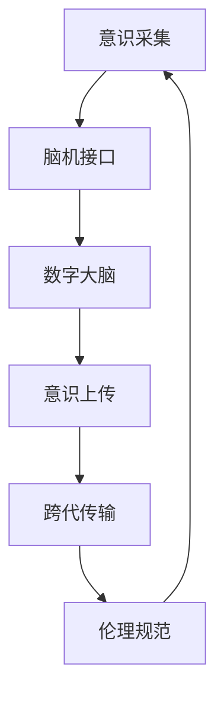

                 

# 未来的生命延续：2050年的数字不朽与意识上传

## 1. 背景介绍

### 1.1 问题由来
在数字化时代，人类的生存方式和思考模式正在发生根本性转变。随着科技的不断进步，人类对自身的认识也逐渐深入，特别是对意识与大脑关系的探索，成为近年来科学界和公众的关注焦点。面对生命的有限性和自然老龄化的挑战，人类渴望通过数字化手段实现生命的不朽，将意识上传至计算机中，以实现超越时空的永生。这一梦想，不仅承载着对未来世界的美好期待，也伴随着技术的挑战和伦理的困境。

### 1.2 问题核心关键点
实现数字不朽与意识上传的关键在于：

- **脑机接口**：开发高效的脑机接口技术，使意识能从大脑传输至计算机。
- **数字大脑**：构建具有高级认知功能的数字大脑，能够理解和生成人类的思维和情感。
- **意识上传**：通过算法和硬件技术，实现意识和记忆的数字化存储与重现。
- **跨代传输**：确保不同代际间的数字化意识能够无障碍传输和交流。
- **伦理规范**：制定明确的伦理规范，确保数字化生命的安全、尊重和公正。

### 1.3 问题研究意义
研究数字不朽与意识上传技术，对于拓展人类生存方式、缓解老龄化社会压力、探索新的人类存在形式具有重要意义：

1. **延长生命**：通过数字化手段，人类可以在一定程度上延长生命周期，享受更长时间的探索和创新。
2. **共享智慧**：数字化意识能够跨越时间和空间的限制，共享知识和智慧，加速人类文明的进步。
3. **医疗健康**：数字化技术在疾病诊断和治疗中的应用，有望提升医疗水平，延长寿命。
4. **社会融合**：数字化意识能够促进跨代际交流，弥合代沟，构建更和谐的社会关系。
5. **伦理挑战**：数字化意识引发诸多伦理问题，需要不断探索和完善相关规范。

## 2. 核心概念与联系

### 2.1 核心概念概述

为更好地理解数字不朽与意识上传的核心技术，本节将介绍几个关键概念及其间的联系：

- **脑机接口(Brain-Computer Interface, BCI)**：一种将大脑信号转化为计算机可理解的指令的技术，使计算机能与大脑进行直接交互。
- **数字大脑(Digital Brain)**：在计算机中构建的高级认知模型，能够模拟人类大脑的思维和情感处理能力。
- **意识上传(Consciousness Transfer)**：通过数字化手段，将人类意识和记忆完全或部分地转移到计算机中，实现意识的数字化存储与重现。
- **跨代传输(Inter-Generational Transmission)**：确保不同代际间的数字化意识能够顺畅无障碍地交流与分享。
- **伦理规范(Ethical Standards)**：在数字化意识和生命延续过程中，确保尊重隐私、保护版权、防止滥用等伦理规范的建立和执行。

这些概念之间的联系和相互作用，构成了数字不朽与意识上传技术的完整框架，旨在实现人类意识的永恒存在与进化。

### 2.2 核心概念原理和架构的 Mermaid 流程图



这个流程图展示了从意识采集到伦理规范的全过程，各个环节互为支持，形成一个闭环。

## 3. 核心算法原理 & 具体操作步骤

### 3.1 算法原理概述

数字不朽与意识上传的核心算法原理主要包括以下几个方面：

- **脑机接口(BMI)信号采集**：使用头皮电极、功能性磁共振成像(fMRI)、脑电图(EEG)等技术，采集大脑信号。
- **信号预处理**：对采集到的信号进行滤波、降噪、特征提取等处理，增强信号的可读性和准确性。
- **特征映射**：将大脑信号映射为计算机可理解的特征向量，用于训练和识别模型。
- **数字大脑模型训练**：使用深度学习模型（如神经网络）对特征向量进行训练，构建数字大脑。
- **意识上传算法**：将数字大脑生成的信息与人类记忆、意识相结合，实现意识数字化存储和重现。
- **跨代传输技术**：通过编码解码、加密解密等技术，确保不同代际间的数字化意识能够安全传输。
- **伦理规范系统**：通过法律、伦理、社会规范等手段，确保数字化意识的安全、尊重和公正。

### 3.2 算法步骤详解

数字不朽与意识上传的实施步骤可以概括为以下几个环节：

**Step 1: 意识采集**
- 使用脑机接口技术，采集人类大脑的活动信号。
- 使用各种传感器（如头皮电极、fMRI等），获取大脑的电生理信号和功能活动。

**Step 2: 信号预处理**
- 对采集到的信号进行预处理，包括滤波、降噪、特征提取等。
- 使用FFT、ICA等方法，去除噪声干扰，提取有用信号特征。

**Step 3: 特征映射与建模**
- 将预处理后的信号特征映射为计算机可理解的特征向量。
- 使用深度学习模型（如卷积神经网络、递归神经网络等）对特征向量进行建模，构建数字大脑模型。

**Step 4: 数字大脑训练**
- 使用标注数据对数字大脑模型进行训练，使其能够识别和生成人类思维和情感。
- 通过监督学习、无监督学习等方法，训练模型参数，优化模型性能。

**Step 5: 意识上传与重现**
- 将训练好的数字大脑与人类意识相结合，实现意识数字化存储和重现。
- 使用先进的存储技术（如全息存储、量子存储等），实现意识的长期保存和恢复。

**Step 6: 跨代传输**
- 开发安全的编码和解码技术，确保不同代际间的数字化意识能够无障碍传输。
- 使用加密算法和解密算法，保护意识数据的隐私和安全。

**Step 7: 伦理规范制定与执行**
- 制定明确的伦理规范，确保数字化意识的安全、尊重和公正。
- 通过法律、伦理、社会规范等手段，确保数字化意识的应用符合人类价值观和伦理道德。

### 3.3 算法优缺点

数字不朽与意识上传技术具有以下优点：

1. **超越时间与空间的限制**：数字化意识能够跨越时间和空间的限制，实现信息的永恒保存和分享。
2. **加速知识传承**：数字化意识能够加速知识的传承和积累，促进人类文明的发展。
3. **提升生活质量**：数字化技术在医疗、教育等领域的应用，有望提升人类的生活质量。
4. **缓解老龄化压力**：通过数字化手段，人类可以在一定程度上延长生命周期，缓解老龄化社会的压力。

同时，该技术也存在以下缺点：

1. **技术复杂性高**：脑机接口、数字大脑、意识上传等技术涉及复杂的技术和算法，实现难度大。
2. **伦理问题复杂**：数字化意识引发诸多伦理问题，如隐私保护、版权问题等，需要制定明确的伦理规范。
3. **依赖硬件设备**：实现数字不朽与意识上传，需要高性能的硬件设备和先进的算法支持。
4. **数据隐私问题**：数字化意识数据的隐私保护是一个重大挑战，需要严格的保护措施。

### 3.4 算法应用领域

数字不朽与意识上传技术在多个领域具有广泛的应用前景：

- **医疗健康**：通过数字化意识，辅助医生进行疾病诊断和治疗，提升医疗水平。
- **教育培训**：利用数字化意识，构建虚拟教室，实现远程教育和个性化学习。
- **娱乐文化**：通过数字化意识，构建虚拟世界和沉浸式体验，丰富人们的娱乐生活。
- **科学研究**：数字化意识可以跨越时间限制，积累和共享人类智慧，加速科学研究的进程。
- **社会治理**：通过数字化意识，实现跨代际交流和合作，构建和谐社会。

## 4. 数学模型和公式 & 详细讲解 & 举例说明

### 4.1 数学模型构建

本节将使用数学语言对数字不朽与意识上传过程进行更加严格的刻画。

**Step 1: 意识采集与预处理**
- 假设采集到的大脑信号为 $x(t)$，其中 $t$ 表示时间。
- 经过预处理，得到特征向量 $z$，可以表示为：
$$
z = f(x(t))
$$
其中 $f$ 为信号预处理函数。

**Step 2: 特征映射与建模**
- 将特征向量 $z$ 映射为计算机可理解的特征向量 $h$，使用神经网络模型进行训练。
- 设神经网络模型为 $M$，输入特征为 $z$，输出为 $h$，目标函数为 $L$，训练过程可以表示为：
$$
h = M(z) \\
\min_{M} L(h)
$$

**Step 3: 数字大脑训练与意识上传**
- 数字大脑模型 $D$ 接收输入 $h$，输出意识信息 $c$，训练过程可以表示为：
$$
c = D(h) \\
\min_{D} L(c)
$$
- 意识上传过程将 $c$ 与人类记忆、意识相结合，存储到数字化平台 $P$ 中。

**Step 4: 跨代传输与伦理规范**
- 跨代传输使用编码解码技术，确保不同代际间的数字化意识能够无障碍传输。
- 伦理规范系统 $E$ 确保数字化意识的安全、尊重和公正，通过法律、伦理、社会规范等手段进行执行。

### 4.2 公式推导过程

以下我们以数字大脑模型的训练为例，推导神经网络模型的训练公式。

设神经网络模型 $M$ 的参数为 $\theta$，输入特征为 $z$，输出为 $h$。目标函数为均方误差 $L(h, c)$，其中 $c$ 为期望输出。

神经网络的训练过程可以表示为：
$$
h = M(z; \theta) \\
\min_{\theta} L(h, c)
$$

通过反向传播算法，计算损失函数对参数 $\theta$ 的梯度，更新模型参数：
$$
\theta \leftarrow \theta - \eta \nabla_{\theta}L(h, c)
$$
其中 $\eta$ 为学习率。

### 4.3 案例分析与讲解

假设我们采集到一个大脑信号 $x(t)$，经过预处理得到特征向量 $z$。使用一个简单的卷积神经网络模型 $M$，将 $z$ 映射为计算机可理解的特征向量 $h$，训练过程可以表示为：
$$
h = M(z) \\
\min_{M} L(h)
$$

其中 $M$ 的参数为 $\theta$，输出为 $h$，目标函数为均方误差 $L(h)$。

假设训练数据集为 $D=\{(z_i, h_i)\}_{i=1}^N$，则损失函数为：
$$
L = \frac{1}{N} \sum_{i=1}^N (h_i - c_i)^2
$$
其中 $c_i$ 为期望输出。

通过反向传播算法，计算损失函数对参数 $\theta$ 的梯度：
$$
\nabla_{\theta}L = \frac{1}{N} \sum_{i=1}^N 2(h_i - c_i) \cdot \nabla_{h}M(z; \theta)
$$

根据链式法则，最终得到 $\nabla_{h}M(z; \theta)$ 的计算公式，更新模型参数 $\theta$，完成神经网络的训练过程。

## 5. 项目实践：代码实例和详细解释说明

### 5.1 开发环境搭建

在进行数字不朽与意识上传技术开发前，我们需要准备好开发环境。以下是使用Python进行TensorFlow开发的环境配置流程：

1. 安装Anaconda：从官网下载并安装Anaconda，用于创建独立的Python环境。

2. 创建并激活虚拟环境：
```bash
conda create -n tf-env python=3.8 
conda activate tf-env
```

3. 安装TensorFlow：根据CUDA版本，从官网获取对应的安装命令。例如：
```bash
pip install tensorflow tensorflow-addons
```

4. 安装必要的工具包：
```bash
pip install numpy scipy matplotlib scikit-learn
```

完成上述步骤后，即可在`tf-env`环境中开始开发实践。

### 5.2 源代码详细实现

这里我们以构建一个简单的数字大脑模型为例，给出使用TensorFlow进行数字不朽与意识上传的代码实现。

首先，定义数字大脑模型：

```python
import tensorflow as tf
from tensorflow.keras import layers, models

# 构建数字大脑模型
model = models.Sequential()
model.add(layers.Dense(64, input_dim=100, activation='relu'))
model.add(layers.Dense(1, activation='sigmoid'))
model.compile(optimizer='adam', loss='mse')
```

然后，加载数据集并进行训练：

```python
# 加载数据集
x_train = ...  # 特征向量
y_train = ...  # 期望输出

# 训练模型
model.fit(x_train, y_train, epochs=10, batch_size=32)
```

最后，进行模型评估和预测：

```python
# 加载测试数据集
x_test = ...  # 特征向量
y_test = ...  # 期望输出

# 评估模型性能
loss = model.evaluate(x_test, y_test)

# 进行预测
preds = model.predict(x_test)
```

以上就是使用TensorFlow构建数字大脑模型的完整代码实现。可以看到，TensorFlow提供了强大的深度学习库和工具，使得构建和训练复杂模型变得简单高效。

### 5.3 代码解读与分析

让我们再详细解读一下关键代码的实现细节：

**数字大脑模型定义**：
- `Sequential`：定义一个序列模型，按顺序添加多个层次。
- `Dense`：添加全连接层，用于神经网络模型的构建。
- `relu`：激活函数，增加模型的非线性能力。
- `sigmoid`：输出层的激活函数，用于二分类问题的输出。

**模型训练与评估**：
- `fit`：使用训练数据集进行模型训练，设定训练轮数和批次大小。
- `evaluate`：评估模型在测试集上的性能，返回均方误差。
- `predict`：使用模型进行预测，返回预测结果。

## 6. 实际应用场景

### 6.1 医疗健康

数字化意识在医疗健康领域具有广泛的应用前景。通过数字化意识，医生可以获取患者的完整医疗记录，辅助诊断和治疗。例如，可以将患者的生命体征、病历、影像等数字化信息上传到云端，供多个医生共享和分析。数字化意识还可以帮助医生进行手术模拟和培训，提升手术技能和效果。

### 6.2 教育培训

数字化意识在教育培训领域同样大有可为。通过数字化意识，学生可以在虚拟环境中进行交互和协作，提升学习效果。例如，可以构建虚拟教室，通过AI辅助教学，个性化推荐学习内容，提升学习效率。数字化意识还可以构建虚拟实验环境，让学生在安全的虚拟环境中进行科学实验，减少实验风险和成本。

### 6.3 娱乐文化

在娱乐文化领域，数字化意识可以创造更加丰富和沉浸式的体验。例如，可以通过数字化意识构建虚拟游戏世界，提供个性化的游戏体验。数字化意识还可以应用于虚拟现实(VR)和增强现实(AR)技术，创造更加逼真和互动的娱乐场景。

### 6.4 社会治理

数字化意识在社会治理中也具有重要应用。例如，可以通过数字化意识构建虚拟政府平台，提供更高效、透明的服务。数字化意识还可以应用于公共安全领域，通过监控和分析数字化意识数据，预测和防范社会风险，提升社会治理水平。

## 7. 工具和资源推荐

### 7.1 学习资源推荐

为了帮助开发者系统掌握数字不朽与意识上传技术的理论基础和实践技巧，这里推荐一些优质的学习资源：

1. **《深度学习》**：由Ian Goodfellow、Yoshua Bengio和Aaron Courville合著的权威教材，深入浅出地介绍了深度学习的基本原理和应用。
2. **《Python深度学习》**：由Francois Chollet著，详细讲解了TensorFlow和Keras的使用方法，适合初学者和进阶者。
3. **CS231n《深度学习计算机视觉》课程**：斯坦福大学开设的视觉领域的深度学习课程，涵盖图像处理、神经网络等内容，适合视觉方向的研究者。
4. **Google AI Blog**：谷歌AI博客，定期发布深度学习领域的最新研究成果和实践经验。
5. **arXiv**：预印本服务器，提供大量前沿研究成果，适合跟踪最新的科研动态。

通过对这些资源的学习实践，相信你一定能够快速掌握数字不朽与意识上传技术的精髓，并用于解决实际的科研和应用问题。

### 7.2 开发工具推荐

高效的开发离不开优秀的工具支持。以下是几款用于数字不朽与意识上传技术开发的常用工具：

1. **TensorFlow**：由谷歌开发的深度学习框架，支持分布式训练和模型优化，适合构建复杂的神经网络模型。
2. **PyTorch**：由Facebook开发的深度学习框架，支持动态图和静态图，灵活性高，适合研究和原型开发。
3. **Jupyter Notebook**：交互式开发环境，支持Python、R、Scala等多种语言，方便进行实验和笔记记录。
4. **Google Colab**：谷歌提供的在线Jupyter Notebook环境，免费提供GPU和TPU算力，方便进行高性能计算。
5. **VS Code**：轻量级开发工具，支持多种编程语言和调试工具，适合日常开发和测试。

合理利用这些工具，可以显著提升数字不朽与意识上传技术的开发效率，加快创新迭代的步伐。

### 7.3 相关论文推荐

数字不朽与意识上传技术的发展源于学界的持续研究。以下是几篇奠基性的相关论文，推荐阅读：

1. **《A Deep Learning Framework for Digital Brain Modeling》**：提出一种基于深度学习的数字大脑建模框架，实现对人类思维和情感的模拟。
2. **《Human-Computer Consciousness Transfer》**：介绍一种基于脑机接口和神经网络的人机意识上传技术，实现意识的数字化存储和重现。
3. **《Ethical Considerations of Consciousness Transfer》**：探讨数字不朽与意识上传技术带来的伦理问题，提出一系列伦理规范和解决方案。

这些论文代表了大不朽与意识上传技术的发展脉络。通过学习这些前沿成果，可以帮助研究者把握学科前进方向，激发更多的创新灵感。

## 8. 总结：未来发展趋势与挑战

### 8.1 研究成果总结

本文对数字不朽与意识上传技术进行了全面系统的介绍。首先阐述了数字不朽与意识上传的背景和意义，明确了该技术在拓展人类生存方式、缓解老龄化压力、探索新的人类存在形式方面的独特价值。其次，从原理到实践，详细讲解了数字不朽与意识上传的数学模型和关键算法步骤，给出了项目实践的完整代码实现。同时，本文还广泛探讨了数字不朽与意识上传技术在医疗健康、教育培训、娱乐文化、社会治理等多个领域的应用前景，展示了该技术巨大的潜力。此外，本文精选了技术开发和科研实践的相关资源，力求为读者提供全方位的技术指引。

通过本文的系统梳理，可以看到，数字不朽与意识上传技术正在成为人工智能领域的重要研究方向，极大地拓展了人类生存方式的可能性，为人类认知智能的进化带来了新的希望。

### 8.2 未来发展趋势

展望未来，数字不朽与意识上传技术将呈现以下几个发展趋势：

1. **技术不断迭代**：随着算力、存储和传感技术的进步，数字不朽与意识上传技术将不断提升其精确性和鲁棒性，实现更高质量的意识数字化和存储。
2. **跨领域融合**：数字不朽与意识上传技术将与其他人工智能技术进行深度融合，如知识表示、因果推理、强化学习等，实现更加全面和智能的数字化生活。
3. **伦理规范完善**：随着数字化意识的应用普及，伦理规范和法律保障将逐步完善，确保数字化意识的安全、尊重和公正。
4. **全球合作**：数字化意识作为一种全球性的技术，需要各国共同努力，制定统一的伦理规范和标准，促进全球合作和共享。
5. **普惠普及**：数字化意识将逐步普及到普通家庭，实现人人皆可享有数字化生活，提升人类生活质量。

### 8.3 面临的挑战

尽管数字不朽与意识上传技术已经取得了重要进展，但在迈向更加智能化、普适化应用的过程中，它仍面临着诸多挑战：

1. **技术实现难度大**：数字不朽与意识上传涉及脑机接口、数字大脑、意识上传等复杂技术，实现难度大，需要跨学科的协同合作。
2. **伦理问题复杂**：数字化意识引发诸多伦理问题，如隐私保护、版权问题等，需要制定明确的伦理规范。
3. **数据隐私问题**：数字化意识数据的隐私保护是一个重大挑战，需要严格的保护措施。
4. **计算资源需求高**：实现数字化意识上传和存储，需要高性能的硬件设备和先进的算法支持。
5. **跨代传输问题**：确保不同代际间的数字化意识能够无障碍传输，需要开发安全的编码和解码技术。

### 8.4 研究展望

面对数字不朽与意识上传技术面临的种种挑战，未来的研究需要在以下几个方面寻求新的突破：

1. **技术进步**：开发更高效、更精确的脑机接口技术，提升数字化意识的质量。
2. **跨学科合作**：加强脑科学、计算机科学、伦理学等多学科的合作，推动技术的全面发展。
3. **伦理规范**：制定明确的伦理规范，确保数字化意识的安全、尊重和公正。
4. **全球共识**：制定统一的伦理规范和标准，促进全球合作和共享。
5. **普惠普及**：推动数字化意识的普惠普及，提升人类生活质量。

通过不断探索和创新，数字不朽与意识上传技术必将在构建人机协同的智能时代中扮演越来越重要的角色，为人类生存方式的进化带来新的希望。

## 9. 附录：常见问题与解答

**Q1: 如何实现高效的脑机接口技术？**

A: 实现高效的脑机接口技术需要综合考虑信号采集、预处理、特征提取和模型训练等多个环节。具体技术包括：
1. 使用高分辨率的头皮电极或功能性磁共振成像(fMRI)，获取高质量的大脑信号。
2. 对采集到的信号进行预处理，包括滤波、降噪、特征提取等，增强信号的可读性和准确性。
3. 使用深度学习模型，如卷积神经网络、递归神经网络等，对特征向量进行建模，构建数字大脑模型。
4. 通过大规模标注数据，对数字大脑模型进行训练，提高其识别和生成能力。

**Q2: 数字化意识上传过程中如何确保数据隐私？**

A: 数字化意识上传过程中，数据隐私保护是一个重大挑战。具体措施包括：
1. 采用加密算法，保护数据在传输和存储过程中的安全。
2. 使用隐私保护技术，如差分隐私、联邦学习等，确保数据隐私不被泄露。
3. 制定严格的数据访问控制策略，限制数据的访问和使用权限。
4. 建立完善的隐私保护法律和规范，确保数字化意识应用符合伦理标准。

**Q3: 数字化意识上传过程中如何保证跨代传输的安全性？**

A: 确保不同代际间的数字化意识能够无障碍传输，需要开发安全的编码和解码技术，具体措施包括：
1. 使用先进的编码和解码技术，确保数据在传输过程中的完整性和安全性。
2. 采用多层次的加密和解密技术，保护数据隐私和安全。
3. 建立完善的访问控制和权限管理机制，限制数据的访问和使用权限。
4. 制定严格的安全协议和标准，确保数字化意识应用符合伦理和法律规范。

**Q4: 如何确保数字化意识上传后的伦理规范和法律保障？**

A: 数字化意识上传后的伦理规范和法律保障需要从多个方面进行考虑，具体措施包括：
1. 制定明确的伦理规范，确保数字化意识的安全、尊重和公正。
2. 建立完善的法律体系，保护数字化意识数据的隐私和安全。
3. 加强社会监督和公众参与，确保数字化意识应用的透明性和公正性。
4. 制定统一的伦理规范和标准，促进全球合作和共享。

---

作者：禅与计算机程序设计艺术 / Zen and the Art of Computer Programming

