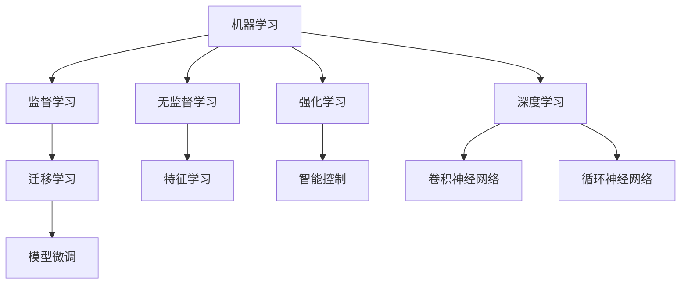

                 

# 机器学习(Machine Learning) - 原理与代码实例讲解

> 关键词：机器学习,深度学习,监督学习,无监督学习,强化学习,迁移学习,线性回归,逻辑回归,神经网络,卷积神经网络,循环神经网络

## 1. 背景介绍

### 1.1 问题由来
机器学习是人工智能(AI)的重要分支，通过构建模型，使计算机能够从数据中自动学习和决策，而无需显式编程。在现代信息时代，机器学习已经广泛应用于各个领域，如金融、医疗、零售、交通等，成为推动技术进步和经济发展的强大引擎。

然而，尽管机器学习技术取得了巨大的成功，其原理和实现方法仍相对复杂，初入者容易陷入概念迷雾，甚至被一些错误的认识所误导。为系统梳理机器学习的基本概念、算法原理和代码实践，本文将从入门到进阶，分层次深入讲解机器学习。

### 1.2 问题核心关键点
机器学习的核心在于将数据映射到高维空间，通过模型学习样本之间的相似性，从而进行分类、回归等任务。本文将从以下几个关键点深入讲解：
- 监督学习、无监督学习和强化学习的基本概念及应用场景。
- 常用的监督学习算法，包括线性回归、逻辑回归、决策树、支持向量机等。
- 深度学习模型的基本结构，包括神经网络、卷积神经网络、循环神经网络等。
- 深度学习在图像处理、自然语言处理等领域的经典应用。
- 机器学习算法和模型在实际应用中的部署和优化策略。
- 未来机器学习技术的发展趋势和面临的挑战。

### 1.3 问题研究意义
机器学习不仅是一种技术手段，更是一种解决问题的思维方式。深入理解机器学习原理，将帮助读者构建模型、解决实际问题，从而在各个领域实现技术突破和创新应用。

机器学习技术能够处理海量数据，发掘数据中的潜在规律，帮助企业优化决策、提升效率。在医疗健康领域，通过预测疾病风险、个性化治疗，机器学习能够显著提高患者生存率和生活质量。在金融领域，机器学习可以通过风控预测、欺诈检测，保障金融安全。在交通领域，机器学习可以通过交通流量预测、自动驾驶，提升交通管理水平。

总之，机器学习是未来技术发展的重要驱动力，掌握其原理和实现方法，对于提高工作效率、实现技术创新具有重要意义。

## 2. 核心概念与联系

### 2.1 核心概念概述

为更好地理解机器学习，本节将介绍几个关键概念：

- 机器学习(Machine Learning)：通过构建模型，使计算机能够从数据中自动学习和决策的技术。
- 深度学习(Deep Learning)：一种特殊的机器学习方法，通过构建多层神经网络，自动学习输入数据的内在表示，广泛应用于图像处理、自然语言处理等领域。
- 监督学习(Supervised Learning)：利用带有标签的训练数据，通过模型学习输入和输出之间的映射关系，实现分类、回归等任务。
- 无监督学习(Unsupervised Learning)：利用未标注数据，通过模型自动发现数据的内在结构，常用于特征学习、聚类分析等。
- 强化学习(Reinforcement Learning)：通过环境反馈，优化模型在特定任务上的决策能力，常用于游戏、机器人控制等。
- 迁移学习(Transfer Learning)：利用已在大规模数据上训练的模型，对小规模数据进行微调，提升模型在新任务上的性能。
- 损失函数(Loss Function)：衡量模型预测值和真实值之间差异的函数，通过最小化损失函数来优化模型参数。
- 正则化(Regularization)：通过限制模型复杂度，防止过拟合现象，如L1、L2正则化等。
- 梯度下降(Gradient Descent)：通过迭代更新模型参数，最小化损失函数的优化算法。

这些概念之间的逻辑关系可以通过以下Mermaid流程图来展示：



这个流程图展示了一些机器学习的核心概念及其之间的关系：

1. 机器学习包括监督学习、无监督学习和强化学习三种基本方法。
2. 深度学习是机器学习的重要分支，通过多层神经网络学习输入数据的复杂表示。
3. 监督学习常用于分类、回归等任务，而无监督学习常用于聚类、特征学习等任务。
4. 强化学习用于优化决策模型，应用于游戏、机器人等场景。
5. 迁移学习利用已有模型，提升新任务性能。
6. 深度学习模型包括卷积神经网络和循环神经网络，常用于图像处理、自然语言处理等。
7. 正则化和梯度下降是机器学习中常用的优化技术，用于避免过拟合和优化模型参数。

## 3. 核心算法原理 & 具体操作步骤
### 3.1 算法原理概述

机器学习的核心算法原理在于通过模型对输入数据进行映射，学习样本之间的相似性，从而进行分类、回归等任务。以监督学习为例，基本流程如下：

1. 准备训练数据集。选择带有标签的训练样本，每个样本包含输入特征$x$和对应的输出标签$y$。
2. 构建模型。选择合适的模型结构，如线性回归、逻辑回归、决策树等。
3. 损失函数定义。定义损失函数$f(x,y)$，衡量模型预测值与真实值之间的差异。
4. 优化算法。使用梯度下降等优化算法，通过迭代更新模型参数，最小化损失函数。
5. 模型评估。在验证集和测试集上评估模型性能，选择最优模型。

深度学习作为机器学习的一个分支，核心在于构建多层次的非线性映射结构，通过模型自动学习输入数据的特征表示。深度学习的实现方法主要依赖于神经网络模型，其核心包括前向传播、损失计算、反向传播和参数更新等步骤。

### 3.2 算法步骤详解

以线性回归为例，详细讲解机器学习的基本步骤：

**Step 1: 准备训练数据集**
- 收集并清洗训练数据集 $D = \{(x_i,y_i)\}_{i=1}^N$，其中 $x_i$ 为输入特征，$y_i$ 为输出标签。
- 将数据集随机均分为训练集 $D_{train}$ 和验证集 $D_{val}$。

**Step 2: 模型定义**
- 定义线性回归模型 $f(x; \theta) = \theta^Tx + \beta$，其中 $\theta$ 为模型参数，$\beta$ 为截距。
- 定义损失函数，如均方误差损失函数 $L(\theta) = \frac{1}{2N} \sum_{i=1}^N (y_i - f(x_i; \theta))^2$。

**Step 3: 模型训练**
- 初始化模型参数 $\theta$ 和 $\beta$。
- 使用梯度下降算法进行优化，每次迭代计算梯度 $\nabla_\theta L(\theta)$ 和 $\nabla_\beta L(\theta)$。
- 更新模型参数：$\theta = \theta - \eta \nabla_\theta L(\theta)$，$\beta = \beta - \eta \nabla_\beta L(\theta)$，其中 $\eta$ 为学习率。
- 重复上述步骤，直至损失函数收敛。

**Step 4: 模型评估**
- 在验证集上评估模型性能，如均方误差 $MSE = \frac{1}{N} \sum_{i=1}^N (y_i - f(x_i; \theta))^2$。
- 选择最优模型，并使用测试集进行最终验证。

### 3.3 算法优缺点

机器学习的优点包括：
1. 自适应性强。能够自动从数据中学习规律，适用于各类复杂场景。
2. 泛化能力强。构建的模型能够处理新数据，具有较好的泛化能力。
3. 可解释性。部分简单模型如线性回归、逻辑回归等，具有较好的可解释性。

缺点包括：
1. 数据依赖性强。需要大量高质量数据进行训练，数据获取成本较高。
2. 模型复杂度高。深度学习等复杂模型计算量大，需要高性能计算资源。
3. 模型解释困难。复杂模型如深度神经网络，难以解释其内部决策过程。

### 3.4 算法应用领域

机器学习在多个领域都有广泛的应用，包括但不限于：

- 图像处理：如图像分类、目标检测、图像生成等。通过构建卷积神经网络，自动学习图像特征。
- 自然语言处理：如文本分类、情感分析、机器翻译等。通过构建循环神经网络，自动学习文本序列的表示。
- 金融预测：如股票预测、风险评估、欺诈检测等。通过构建回归模型，预测市场走势和风险水平。
- 医疗诊断：如疾病预测、药物发现、基因分析等。通过构建分类模型，辅助医生进行诊断和治疗决策。
- 交通管理：如交通流量预测、智能驾驶、自动导航等。通过构建预测模型，优化交通系统运行效率。

以上应用场景展示了机器学习在不同领域的广泛应用，展示了其强大的应用潜力。

## 4. 数学模型和公式 & 详细讲解 & 举例说明
### 4.1 数学模型构建

以线性回归为例，我们将通过数学语言进一步讲解机器学习的基本模型构建过程。

**模型定义**：
设训练数据集为 $D = \{(x_i,y_i)\}_{i=1}^N$，其中 $x_i \in \mathbb{R}^d$ 为输入特征，$y_i \in \mathbb{R}$ 为输出标签。线性回归模型定义为 $f(x; \theta) = \theta^Tx + \beta$，其中 $\theta \in \mathbb{R}^d$ 为模型参数，$\beta \in \mathbb{R}$ 为截距。

**损失函数**：
定义均方误差损失函数 $L(\theta) = \frac{1}{2N} \sum_{i=1}^N (y_i - f(x_i; \theta))^2$。

**优化目标**：
最小化损失函数 $L(\theta)$，即 $\theta^* = \mathop{\arg\min}_{\theta} L(\theta)$。

### 4.2 公式推导过程

接下来，我们推导线性回归模型的梯度下降优化公式。

1. 损失函数对模型参数的梯度：
   $$
   \frac{\partial L(\theta)}{\partial \theta} = \frac{1}{N} \sum_{i=1}^N -2(y_i - f(x_i; \theta))x_i
   $$

2. 梯度下降算法更新公式：
   $$
   \theta \leftarrow \theta - \eta \frac{\partial L(\theta)}{\partial \theta}
   $$

其中，$\eta$ 为学习率。

### 4.3 案例分析与讲解

以房价预测为例，使用波士顿房价数据集进行线性回归模型的训练。首先，准备数据集 $D = \{(x_i,y_i)\}_{i=1}^506$，其中 $x_i$ 为输入特征（如卧室数量、房屋面积等），$y_i$ 为房价标签。

然后，定义线性回归模型 $f(x; \theta) = \theta^Tx + \beta$，初始化模型参数 $\theta = [0.1, 0.1, 0.1, 0.1, 0.1]^T$，截距 $\beta = 0$。

接着，定义损失函数 $L(\theta) = \frac{1}{2N} \sum_{i=1}^N (y_i - f(x_i; \theta))^2$，使用梯度下降算法进行优化，学习率 $\eta = 0.01$，迭代次数 $N = 1000$。

最后，在验证集上评估模型性能，使用均方误差 $MSE = \frac{1}{N} \sum_{i=1}^N (y_i - f(x_i; \theta))^2$。最终，选择最优模型，并使用测试集进行最终验证。

通过上述案例，读者可以更直观地理解线性回归模型的构建和优化过程。

## 5. 项目实践：代码实例和详细解释说明
### 5.1 开发环境搭建

在进行机器学习项目开发前，首先需要搭建开发环境。以下是使用Python进行机器学习开发的环境配置流程：

1. 安装Python：从官网下载并安装最新版本的Python。

2. 安装必要的库：
```bash
pip install numpy pandas scikit-learn matplotlib seaborn jupyter notebook
```

3. 准备数据集：下载并预处理数据集，如波士顿房价数据集。

4. 搭建Jupyter Notebook环境：
```bash
conda create -n ml-env python=3.7
conda activate ml-env
```

5. 开始Jupyter Notebook：
```bash
jupyter notebook
```

完成上述步骤后，即可在`ml-env`环境中进行机器学习项目的开发。

### 5.2 源代码详细实现

以下以波士顿房价数据集为例，给出线性回归模型的代码实现。

```python
from sklearn.datasets import load_boston
from sklearn.model_selection import train_test_split
from sklearn.linear_model import LinearRegression
from sklearn.metrics import mean_squared_error

# 加载数据集
boston = load_boston()
X = boston.data
y = boston.target

# 数据分割
X_train, X_val, y_train, y_val = train_test_split(X, y, test_size=0.2, random_state=42)

# 定义模型
model = LinearRegression()

# 训练模型
model.fit(X_train, y_train)

# 评估模型
mse_val = mean_squared_error(y_val, model.predict(X_val))
print(f"Validation MSE: {mse_val:.3f}")
```

这段代码使用Scikit-Learn库进行线性回归模型的实现，包含了数据加载、模型定义、训练和评估等步骤。

### 5.3 代码解读与分析

这段代码的详细解读如下：

**数据加载**：使用`load_boston`函数加载波士顿房价数据集。

**数据分割**：使用`train_test_split`函数将数据集划分为训练集和验证集，划分为训练集和验证集的比例为80%和20%。

**模型定义**：使用`LinearRegression`类定义线性回归模型。

**模型训练**：使用`fit`函数对模型进行训练，输入训练集特征$X_{train}$和标签$y_{train}$。

**模型评估**：使用`mean_squared_error`函数计算验证集的均方误差，输出评估结果。

通过这段代码，读者可以了解线性回归模型的基本实现步骤，并快速上手Scikit-Learn库进行机器学习项目开发。

## 6. 实际应用场景

### 6.1 智能推荐系统

智能推荐系统通过学习用户行为数据，预测用户对物品的兴趣偏好，推荐相应的商品、视频、文章等。机器学习可以高效处理海量数据，从中提取隐含的关联关系，实现个性化推荐，提升用户体验。

以电商推荐系统为例，系统收集用户浏览、点击、购买等行为数据，提取用户特征如年龄、性别、地域等，构建用户-物品交互矩阵。然后使用协同过滤、矩阵分解等机器学习方法，学习用户和物品的隐含特征表示，构建用户-物品评分矩阵。最终，使用模型预测用户对物品的评分，推荐评分靠前的商品。

### 6.2 医疗诊断

机器学习在医疗领域也有广泛应用。通过对大量病例数据的分析，机器学习可以辅助医生进行疾病诊断和治疗决策。

例如，通过收集患者的血液样本、基因数据等生物信息，构建多模态特征向量。然后，使用支持向量机、随机森林等算法，学习患者疾病的特征表示。最终，使用模型预测患者患病的概率，辅助医生进行诊断和治疗决策。

### 6.3 金融预测

机器学习在金融领域也有广泛应用。通过分析市场数据、用户行为数据等，机器学习可以预测股票走势、风险水平等，辅助投资决策。

例如，收集股票价格、交易量、宏观经济指标等数据，构建历史数据集。然后使用线性回归、时间序列模型等算法，学习股票价格和影响因素之间的关系。最终，使用模型预测股票价格的变化趋势，辅助投资决策。

### 6.4 未来应用展望

未来，机器学习技术将在更多领域得到应用，为各行各业带来变革性影响：

1. 自动驾驶：通过学习交通规则、车辆行为等数据，机器学习可以辅助自动驾驶汽车进行导航、避障等决策。

2. 智能家居：通过学习用户行为数据，机器学习可以智能控制家电设备，提升生活质量。

3. 工业互联网：通过学习设备运行数据，机器学习可以优化生产流程，提高生产效率。

4. 智慧城市：通过学习交通流量、公共服务需求等数据，机器学习可以优化城市管理，提升城市运行效率。

5. 健康监测：通过学习生理数据、环境数据等，机器学习可以监测用户健康状况，预防疾病。

总之，机器学习技术将在更多领域得到应用，推动各行各业向智能化、自动化方向发展。

## 7. 工具和资源推荐
### 7.1 学习资源推荐

为了帮助开发者系统掌握机器学习的理论基础和实践技巧，这里推荐一些优质的学习资源：

1. 《机器学习》课程（吴恩达）：由斯坦福大学开设的机器学习入门课程，系统讲解机器学习的基本概念和算法原理。

2. 《深度学习》课程（Ian Goodfellow）：由蒙特利尔大学开设的深度学习课程，深入讲解深度学习模型的构建和优化。

3. 《Python机器学习》书籍：通过Python语言实现各种机器学习算法，适合编程学习。

4. Kaggle：数据科学竞赛平台，提供大量实际数据集和模型评估标准，适合动手实践。

5. TensorFlow官方文档：TensorFlow深度学习框架的官方文档，提供丰富的模型和算法实现。

通过对这些资源的学习实践，相信你一定能够快速掌握机器学习的精髓，并用于解决实际的机器学习问题。

### 7.2 开发工具推荐

高效的机器学习开发离不开优秀的工具支持。以下是几款用于机器学习开发的常用工具：

1. TensorFlow：由Google主导开发的深度学习框架，生产部署方便，适合大规模工程应用。

2. PyTorch：基于Python的开源深度学习框架，灵活性强，适合研究性项目。

3. Scikit-Learn：Python机器学习库，提供简单易用的API，支持多种模型和算法。

4. Keras：高层API，简化深度学习模型的构建和优化过程。

5. H2O：企业级机器学习平台，支持分布式计算，适合大规模数据处理。

合理利用这些工具，可以显著提升机器学习开发和研究的效率，加速技术创新和应用落地。

### 7.3 相关论文推荐

机器学习技术的发展源于学界的持续研究。以下是几篇奠基性的相关论文，推荐阅读：

1. Linear Regression（线性回归）：由Gauss在1810年提出，是机器学习中最基础的算法之一。

2. Neural Networks and Deep Learning（深度学习）：由Ian Goodfellow等人编写的深度学习经典教材，系统讲解深度学习的理论基础和实现方法。

3. Support Vector Machines（支持向量机）：由Vapnik在1963年提出，广泛应用于分类、回归等任务。

4. Deep Learning for NLP（深度学习在NLP中的应用）：由Courville等人编写的深度学习NLP教材，讲解深度学习在NLP中的应用。

5. The Master Algorithm（大师算法）：由Peter Norvig等人编写的机器学习入门书籍，系统讲解机器学习的原理和实现方法。

这些论文代表了大机器学习发展脉络，通过学习这些前沿成果，可以帮助研究者把握学科前进方向，激发更多的创新灵感。

## 8. 总结：未来发展趋势与挑战
### 8.1 总结

本文对机器学习的基本概念、算法原理和代码实现进行了系统讲解。首先阐述了机器学习的背景和核心概念，明确了监督学习、无监督学习和强化学习的基本原理和应用场景。其次，通过详细讲解线性回归模型，展示了机器学习的基本流程和实现方法。最后，讨论了机器学习在实际应用中的各类实例，展望了未来的发展趋势和面临的挑战。

通过本文的系统梳理，可以看到，机器学习不仅是一种技术手段，更是一种解决问题的思维方式。掌握其原理和实现方法，对于构建模型、解决实际问题具有重要意义。

### 8.2 未来发展趋势

展望未来，机器学习技术将呈现以下几个发展趋势：

1. 深度学习模型将进一步优化。随着计算能力的提升和算法研究的深入，深度学习模型的结构将更加复杂，参数量将不断增加。同时，模型训练和推理速度将大幅提升，应用场景将更加多样化。

2. 强化学习将广泛应用于复杂决策场景。强化学习在智能游戏、机器人控制等领域已经取得显著成效，未来将进一步应用于更复杂的决策场景，如金融交易、自动驾驶等。

3. 无监督学习和生成对抗网络将发挥重要作用。无监督学习能够处理大规模无标签数据，生成对抗网络能够生成高质量的图像、文本等，未来将与监督学习结合，提升机器学习系统的性能和泛化能力。

4. 迁移学习将提升模型在不同领域之间的迁移能力。迁移学习能够利用已有模型的知识，提升新任务模型的性能，未来将广泛应用于跨领域应用。

5. 可解释性和可控性将得到重视。机器学习模型的黑盒特性将导致其在一些领域的应用受到限制，未来将加强模型解释性和可控性研究，提升用户对系统的信任和满意度。

6. 自动化机器学习将快速发展。自动化机器学习能够自动选择模型、调整超参数，降低机器学习的门槛，加速模型开发和应用。

以上趋势凸显了机器学习技术的前景广阔，未来的发展将更加智能化、自动化、人性化。

### 8.3 面临的挑战

尽管机器学习技术已经取得了巨大的成功，但在迈向更加智能化、普适化应用的过程中，仍面临诸多挑战：

1. 数据依赖性强。机器学习模型的训练需要大量高质量数据，数据获取和标注成本高昂，如何利用有限的标注数据进行高效学习是一个重要问题。

2. 模型复杂度高。深度学习模型结构复杂，计算量大，需要高性能计算资源，如何降低模型复杂度、提高训练效率是亟待解决的问题。

3. 模型解释困难。复杂模型难以解释其内部决策过程，缺乏可解释性，如何提升模型的可解释性，增强用户对系统的信任是一个重要研究方向。

4. 模型泛化能力不足。机器学习模型在数据分布变化较大的情况下，泛化能力有限，如何提升模型在新的数据分布上的性能是一个重要问题。

5. 隐私和安全问题。机器学习模型依赖大量数据，如何保护数据隐私和安全，防止数据泄露和滥用是一个重要挑战。

6. 模型偏见问题。机器学习模型可能学习到数据中的偏见，导致不公平、歧视性输出，如何消除模型偏见，提升模型公平性是一个重要研究方向。

以上挑战需要学术界和工业界共同努力，不断攻克，才能实现机器学习技术的广泛应用和可持续发展。

### 8.4 研究展望

面对机器学习面临的挑战，未来的研究需要在以下几个方面寻求新的突破：

1. 无监督学习和半监督学习将发挥更大作用。无监督学习和半监督学习能够利用未标注数据进行学习，提升模型的泛化能力和数据利用效率。

2. 模型压缩和优化技术将进一步提升模型性能。模型压缩和优化技术能够减小模型大小、提高训练速度，提升模型在实际应用中的性能。

3. 模型解释性和可控性将得到进一步提升。通过引入可解释性技术，如LIME、SHAP等，提升模型的可解释性和可控性，增强用户对系统的信任。

4. 模型公平性和偏见问题将得到重视。通过引入公平性约束和偏见检测技术，消除模型偏见，提升模型的公平性和可信度。

5. 自动化机器学习将不断发展和完善。自动化机器学习能够自动选择模型、调整超参数，降低机器学习的门槛，加速模型开发和应用。

6. 多模态学习将得到广泛应用。多模态学习能够融合图像、文本、语音等多种模态的信息，提升系统的表现力和鲁棒性。

这些研究方向将推动机器学习技术向更加智能化、普适化、公平化方向发展，为未来技术应用提供新的突破口。

## 9. 附录：常见问题与解答

**Q1：如何选择合适的机器学习模型？**

A: 选择机器学习模型需要考虑多个因素，包括数据类型、任务类型、模型复杂度等。常用的选择策略包括：
1. 数据驱动。根据数据类型和分布，选择适合的模型结构，如线性回归、逻辑回归、神经网络等。
2. 任务驱动。根据任务类型和需求，选择适合的模型结构，如分类模型、回归模型、序列模型等。
3. 领域驱动。根据应用领域的特点，选择适合的模型结构，如金融模型、医疗模型、推荐模型等。

**Q2：如何避免过拟合现象？**

A: 过拟合是机器学习中常见的问题，可以通过以下方法避免：
1. 数据增强。通过对训练数据进行扩充，如旋转、缩放、翻转等，增加数据多样性。
2. 正则化。通过引入L1、L2正则化等方法，限制模型复杂度，防止过拟合。
3. 早停法。在验证集上监测模型性能，当性能不再提升时，停止训练，防止过拟合。
4. 模型集成。通过集成多个模型的预测结果，提升模型的泛化能力。

**Q3：机器学习模型在实际应用中需要注意哪些问题？**

A: 在实际应用中，机器学习模型需要注意以下问题：
1. 模型解释性。复杂模型缺乏可解释性，需要引入可解释性技术，提升用户对系统的信任。
2. 模型鲁棒性。模型需要具备良好的鲁棒性，防止在噪声数据或异常情况下失效。
3. 模型泛化能力。模型需要具备良好的泛化能力，能够在新数据上保持良好表现。
4. 模型可维护性。模型需要具备良好的可维护性，方便后续的调优和升级。

**Q4：机器学习算法和模型在实际应用中的部署和优化策略有哪些？**

A: 在实际应用中，机器学习算法和模型需要考虑以下部署和优化策略：
1. 模型裁剪。通过剪枝、量化等方法，减小模型大小，提升推理速度。
2. 模型压缩。通过稀疏化、低秩分解等方法，减小模型参数量，提升训练速度。
3. 模型并行。通过分布式计算、GPU/TPU加速等方法，提升模型训练和推理效率。
4. 模型服务化。将模型封装为API或微服务，方便集成调用。
5. 模型监控。实时监测模型性能，设置异常告警，防止系统故障。

**Q5：机器学习算法和模型在实际应用中如何进行调优？**

A: 在实际应用中，机器学习算法和模型需要不断调优，以提升性能和效果：
1. 数据驱动。根据数据特点和分布，调整模型参数和超参数，提升模型性能。
2. 任务驱动。根据任务需求和目标，调整模型结构和算法，提升模型效果。
3. 领域驱动。根据应用领域的特点，引入先验知识和技术，提升模型表现。
4. 模型评估。在验证集和测试集上评估模型性能，选择最优模型。
5. 模型优化。通过正则化、集成、优化器等方法，提升模型性能和泛化能力。

这些调优策略需要根据具体场景进行灵活应用，不断迭代优化模型性能，以满足实际需求。

---

作者：禅与计算机程序设计艺术 / Zen and the Art of Computer Programming

