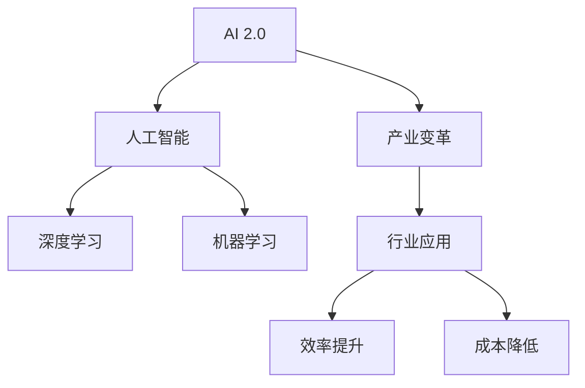
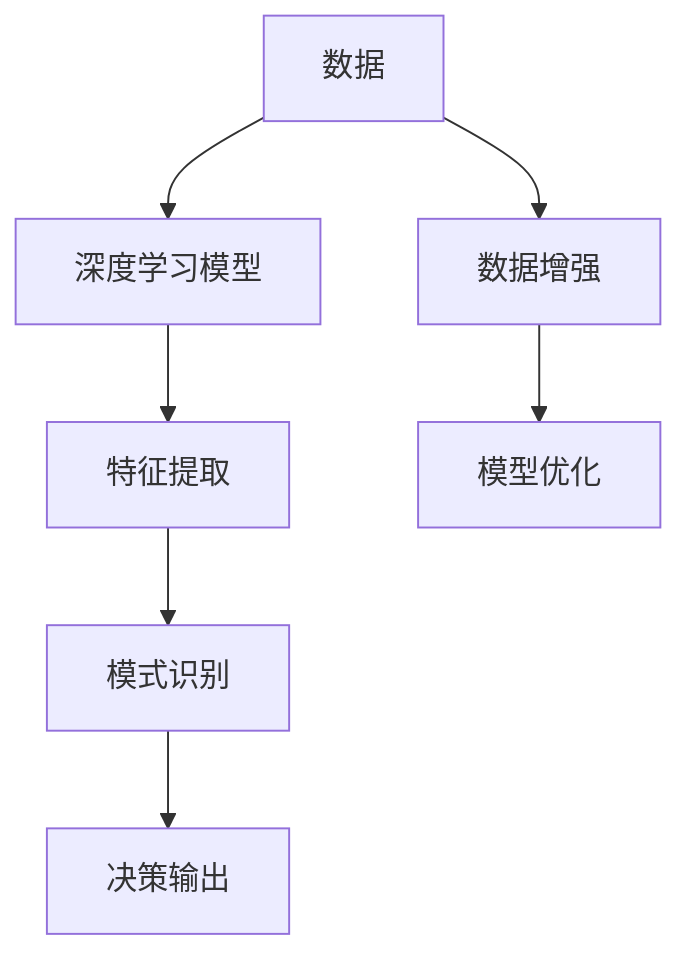

                 

# 李开复：AI 2.0 时代的产业

> 关键词：AI 2.0, 产业变革, 人工智能, 产业应用, 前沿技术, 深度学习

## 1. 背景介绍

随着技术的不断演进，人工智能（AI）正逐渐从实验室走向市场，推动着各行各业的变革。这一时期的AI，即AI 2.0时代，以深度学习为核心，实现了大规模的商业化应用。这一变革不仅重塑了传统的产业格局，也为新兴领域带来了无限的机遇。本文将深入探讨AI 2.0时代的产业变革，分析其在各行业的应用现状与未来展望，为读者揭示这一激动人心的新纪元。

## 2. 核心概念与联系

### 2.1 核心概念概述

为了更好地理解AI 2.0时代的产业变革，我们将首先介绍几个核心概念：

- **AI 2.0**：AI 2.0时代，是指以深度学习为核心的第二代人工智能技术，它通过大规模数据训练和学习算法，实现了对复杂任务的精准处理和智能决策。
- **产业变革**：AI 2.0技术的应用，正在重塑各个行业的运作模式，推动产业升级和转型，提高效率，降低成本。
- **人工智能**：AI是人工智能的缩写，是一种通过计算机模拟人类智能的技术，包括机器学习、自然语言处理、计算机视觉等多个领域。
- **深度学习**：深度学习是AI的一种子技术，通过多层神经网络结构对数据进行自动特征提取和模式识别，在图像识别、语音识别、自然语言处理等领域取得了显著成果。
- **机器学习**：机器学习是AI的重要分支，通过数据训练，使机器能够自主地从经验中学习，提升其决策能力。

这些概念之间的联系通过以下Mermaid流程图进行展示：



### 2.2 核心概念原理和架构的 Mermaid 流程图

为了直观展示AI 2.0的核心原理和架构，我们可以使用以下流程图：



这个流程图展示了从数据输入到决策输出的完整流程。首先，通过深度学习模型对数据进行特征提取和模式识别，最终输出决策结果。同时，数据增强和模型优化等技术，可以提高模型的泛化能力和性能。

## 3. 核心算法原理 & 具体操作步骤

### 3.1 算法原理概述

AI 2.0时代的核心算法主要是深度学习，其原理是基于神经网络模型，通过多层次的特征提取和融合，实现对复杂数据的精准处理和智能决策。深度学习模型由多个神经网络层组成，每一层通过反向传播算法，不断调整权重和偏置，以最小化损失函数，从而提高模型的准确性和泛化能力。

### 3.2 算法步骤详解

深度学习模型的训练过程可以分为以下几个步骤：

1. **数据准备**：收集和标注大量数据，形成训练集和验证集。
2. **模型选择**：选择适合的深度学习模型架构，如卷积神经网络（CNN）、循环神经网络（RNN）、变压器（Transformer）等。
3. **模型初始化**：随机初始化模型参数。
4. **前向传播**：将训练数据输入模型，计算输出。
5. **损失计算**：计算模型输出与真实标签之间的损失函数。
6. **反向传播**：通过反向传播算法，计算损失函数对模型参数的梯度。
7. **参数更新**：使用梯度下降等优化算法，更新模型参数。
8. **验证集评估**：在验证集上评估模型性能，防止过拟合。
9. **模型测试**：在测试集上评估模型泛化能力。

### 3.3 算法优缺点

深度学习算法具有以下优点：

- **强大泛化能力**：通过大规模数据训练，能够学习到复杂的数据模式和特征。
- **高效特征提取**：自动提取数据的高级特征，避免了手动特征工程的繁琐。
- **可解释性**：使用可视化工具，能够直观展示模型的特征图和权重，帮助理解模型决策过程。

但其缺点也显而易见：

- **数据需求高**：需要大量标注数据，数据质量和多样性直接影响模型效果。
- **计算资源密集**：训练和推理过程中，对计算资源的需求高。
- **可解释性差**：复杂的黑盒模型，难以解释内部决策过程。
- **易受攻击**：模型过于复杂，可能存在对抗样本攻击的风险。

### 3.4 算法应用领域

AI 2.0技术已经广泛应用于各个行业，涵盖医疗、金融、制造、零售等多个领域。以下是一些典型的应用案例：

- **医疗行业**：AI 2.0技术被用于医疗影像分析、疾病预测、个性化治疗方案制定等。例如，通过深度学习算法，医生可以更快速、准确地诊断疾病。
- **金融行业**：AI 2.0技术被用于风险评估、欺诈检测、量化交易等。通过深度学习模型，金融机构能够更精确地评估信用风险和市场趋势。
- **制造业**：AI 2.0技术被用于质量检测、设备维护、供应链管理等。通过智能传感器和深度学习算法，制造业企业可以实现实时监控和预测维护，提高生产效率和质量。
- **零售行业**：AI 2.0技术被用于客户推荐、库存管理、营销策略等。通过深度学习模型，零售企业可以更精准地预测消费者行为，优化库存管理，提升营销效果。

## 4. 数学模型和公式 & 详细讲解 & 举例说明

### 4.1 数学模型构建

深度学习模型主要由神经网络组成，每个神经元接受输入数据，经过激活函数处理后输出结果。以下是神经网络的数学模型构建：

$$
f(x;w) = \sum_{i=1}^n w_i \cdot f_i(x) + b
$$

其中，$x$为输入数据，$w$为权重，$f_i(x)$为第$i$个神经元的激活函数，$b$为偏置。

### 4.2 公式推导过程

以卷积神经网络（CNN）为例，其基本单元是卷积层，通过对输入数据进行卷积操作，提取局部特征。以下是卷积层的数学模型：

$$
y = f(x * h) + b
$$

其中，$x$为输入数据，$h$为卷积核，$f$为激活函数，$b$为偏置。

### 4.3 案例分析与讲解

以图像识别为例，CNN通过多层卷积和池化操作，将图像数据转换为特征向量，再通过全连接层和softmax分类器，输出分类结果。


在实践中，CNN通常采用反向传播算法和梯度下降优化，不断调整权重和偏置，最小化损失函数。例如，对于二分类任务，常用的损失函数为交叉熵损失：

$$
L(y,\hat{y}) = -(y \log \hat{y} + (1-y) \log (1-\hat{y}))
$$

其中，$y$为真实标签，$\hat{y}$为模型预测结果。

## 5. 项目实践：代码实例和详细解释说明

### 5.1 开发环境搭建

为了快速开发和测试深度学习模型，我们需要安装一些必要的开发环境。以下是一些常用的开发环境：

1. **Python**：深度学习开发的首选语言，支持广泛的第三方库和框架。
2. **PyTorch**：深度学习框架，支持动态计算图和灵活的模型定义。
3. **TensorFlow**：另一个流行的深度学习框架，支持静态计算图和高效的分布式训练。
4. **Jupyter Notebook**：交互式开发环境，支持Python代码的快速测试和调试。

### 5.2 源代码详细实现

以下是一个简单的图像分类任务示例，使用PyTorch实现：

```python
import torch
import torch.nn as nn
import torchvision.transforms as transforms
import torchvision.datasets as datasets

# 定义模型
class Net(nn.Module):
    def __init__(self):
        super(Net, self).__init__()
        self.conv1 = nn.Conv2d(3, 6, 5)
        self.pool = nn.MaxPool2d(2, 2)
        self.conv2 = nn.Conv2d(6, 16, 5)
        self.fc1 = nn.Linear(16 * 5 * 5, 120)
        self.fc2 = nn.Linear(120, 84)
        self.fc3 = nn.Linear(84, 10)

    def forward(self, x):
        x = self.pool(nn.functional.relu(self.conv1(x)))
        x = self.pool(nn.functional.relu(self.conv2(x)))
        x = x.view(-1, 16 * 5 * 5)
        x = nn.functional.relu(self.fc1(x))
        x = nn.functional.relu(self.fc2(x))
        x = self.fc3(x)
        return x

# 加载数据集
train_dataset = datasets.CIFAR10(root='./data', train=True, transform=transforms.ToTensor(), download=True)
test_dataset = datasets.CIFAR10(root='./data', train=False, transform=transforms.ToTensor(), download=True)

# 定义数据加载器
train_loader = torch.utils.data.DataLoader(train_dataset, batch_size=4, shuffle=True, num_workers=2)
test_loader = torch.utils.data.DataLoader(test_dataset, batch_size=4, shuffle=False, num_workers=2)

# 定义模型和优化器
net = Net()
criterion = nn.CrossEntropyLoss()
optimizer = torch.optim.SGD(net.parameters(), lr=0.001, momentum=0.9)

# 训练模型
for epoch in range(2):
    running_loss = 0.0
    for i, data in enumerate(train_loader, 0):
        inputs, labels = data
        optimizer.zero_grad()
        outputs = net(inputs)
        loss = criterion(outputs, labels)
        loss.backward()
        optimizer.step()
        running_loss += loss.item()
        if i % 2000 == 1999:
            print('[%d, %5d] loss: %.3f' % (epoch + 1, i + 1, running_loss / 2000))
            running_loss = 0.0

# 测试模型
correct = 0
total = 0
with torch.no_grad():
    for data in test_loader:
        images, labels = data
        outputs = net(images)
        _, predicted = torch.max(outputs.data, 1)
        total += labels.size(0)
        correct += (predicted == labels).sum().item()

print('Accuracy of the network on the 10000 test images: %d %%' % (100 * correct / total))
```

### 5.3 代码解读与分析

在上述代码中，我们首先定义了一个简单的卷积神经网络模型，包括两个卷积层和三个全连接层。然后使用PyTorch的数据加载器加载CIFAR-10数据集，定义了交叉熵损失函数和随机梯度下降优化器。在训练过程中，通过反向传播算法不断调整模型参数，最小化损失函数。最后，在测试集上评估模型性能，输出准确率。

## 6. 实际应用场景

### 6.1 医疗行业

AI 2.0技术在医疗行业的应用非常广泛，涵盖疾病预测、影像分析、个性化治疗等多个方面。通过深度学习算法，医生可以更快速、准确地诊断疾病，制定个性化的治疗方案，提升医疗服务质量。

例如，Google的DeepMind团队开发了AlphaGo，通过深度学习和蒙特卡洛树搜索算法，在围棋比赛中击败了人类顶尖选手，展示了AI在复杂决策中的强大能力。

### 6.2 金融行业

AI 2.0技术在金融行业被广泛应用于风险评估、欺诈检测、量化交易等。通过深度学习模型，金融机构能够更精确地评估信用风险和市场趋势，提升运营效率和盈利能力。

例如，JP摩根利用深度学习算法对客户信用评分进行预测，显著提高了信用评估的准确性和效率。

### 6.3 制造业

AI 2.0技术在制造业中的应用包括设备维护、质量检测、供应链管理等。通过智能传感器和深度学习算法，制造业企业可以实现实时监控和预测维护，提高生产效率和质量。

例如，西门子公司利用深度学习算法对设备进行预测性维护，减少了设备故障和停机时间。

### 6.4 零售行业

AI 2.0技术在零售行业被广泛应用于客户推荐、库存管理、营销策略等。通过深度学习模型，零售企业可以更精准地预测消费者行为，优化库存管理，提升营销效果。

例如，亚马逊利用深度学习算法对客户进行个性化推荐，显著提高了客户满意度和销售额。

## 7. 工具和资源推荐

### 7.1 学习资源推荐

为了更好地掌握AI 2.0技术，以下是一些优质的学习资源：

1. **《深度学习》（Ian Goodfellow, Yoshua Bengio, Aaron Courville）**：深度学习领域的经典教材，全面介绍了深度学习的基本概念和应用。
2. **《神经网络与深度学习》（Michael Nielsen）**：入门级书籍，通俗易懂地介绍了神经网络和深度学习的基本原理。
3. **Coursera深度学习课程**：由斯坦福大学的Andrew Ng教授主讲，涵盖深度学习的基本概念和应用，包括卷积神经网络、循环神经网络等。
4. **Kaggle数据科学竞赛平台**：提供大量数据集和竞赛任务，帮助学习者实践深度学习技术。
5. **GitHub深度学习项目**：GitHub上丰富的深度学习项目，涵盖各个领域的深度学习应用，提供了大量代码和模型资源。

### 7.2 开发工具推荐

以下是一些常用的开发工具：

1. **Python**：深度学习开发的首选语言，支持广泛的第三方库和框架。
2. **PyTorch**：深度学习框架，支持动态计算图和灵活的模型定义。
3. **TensorFlow**：另一个流行的深度学习框架，支持静态计算图和高效的分布式训练。
4. **Jupyter Notebook**：交互式开发环境，支持Python代码的快速测试和调试。
5. **Google Colab**：Google提供的免费在线Jupyter Notebook环境，支持GPU和TPU加速，方便开发和测试。

### 7.3 相关论文推荐

以下是一些具有代表性的深度学习相关论文：

1. **ImageNet大规模视觉识别挑战赛（ILSVRC）**：由深度学习先驱之一Alex Krizhevsky等人提出，标志着深度学习在计算机视觉领域的突破。
2. **卷积神经网络（CNN）**：Hinton等人提出的卷积神经网络，在图像识别领域取得了显著成果。
3. **循环神经网络（RNN）**：Hochreiter等人提出的循环神经网络，在自然语言处理领域广泛应用。
4. **Transformer**：Vaswani等人提出的Transformer结构，在机器翻译和自然语言处理领域取得了显著成果。
5. **GAN（生成对抗网络）**：Goodfellow等人提出的生成对抗网络，在图像生成和风格转换等领域取得了突破性进展。

## 8. 总结：未来发展趋势与挑战

### 8.1 研究成果总结

AI 2.0技术已经在各个行业取得了显著成果，推动了产业升级和转型。未来，AI 2.0将持续推动智能化、自动化和高效化的发展，为各行各业带来更多机遇和挑战。

### 8.2 未来发展趋势

未来，AI 2.0技术将呈现以下几个发展趋势：

1. **智能化程度提升**：通过深度学习算法，AI系统将实现更加智能化的决策和行为，提升人类社会的自动化水平。
2. **跨领域融合**：AI 2.0技术将与其他领域的技术（如量子计算、区块链等）进行深度融合，推动技术进步和应用创新。
3. **伦理和安全**：AI 2.0技术的发展将引发伦理和安全问题，需要制定相关法规和标准，确保技术应用的安全性和公平性。
4. **人机协作**：AI 2.0技术将实现更加高效的人机协作，提高工作效率和质量。
5. **个性化服务**：AI 2.0技术将实现更加个性化的服务，满足用户的个性化需求。

### 8.3 面临的挑战

尽管AI 2.0技术已经取得了显著进展，但仍面临一些挑战：

1. **数据隐私和安全**：AI 2.0技术需要大量的数据支持，如何在保障数据隐私和安全的前提下，获取高质量的数据资源。
2. **模型复杂性**：深度学习模型结构复杂，难以解释和调试，需要开发更加简洁、可解释的模型结构。
3. **计算资源需求**：深度学习算法需要大量的计算资源，如何在资源受限的情况下，高效地训练和部署模型。
4. **伦理和安全问题**：AI 2.0技术在实际应用中可能引发伦理和安全问题，需要制定相关法规和标准。
5. **跨领域应用**：AI 2.0技术在不同领域的应用需要定制化解决方案，难以实现通用化应用。

### 8.4 研究展望

未来，AI 2.0技术需要在以下几个方面进行进一步研究：

1. **无监督学习和半监督学习**：开发更加高效的深度学习算法，减少对标注数据的需求，提高模型泛化能力。
2. **小样本学习和自适应学习**：开发更加鲁棒的深度学习算法，提高模型在小样本数据上的表现。
3. **可解释性和可解释性模型**：开发更加可解释的深度学习模型，帮助理解模型的决策过程，提高系统的透明性和可信度。
4. **跨领域应用和通用化**：开发更加通用化的深度学习模型，适用于不同领域的任务，实现跨领域应用。
5. **伦理和安全问题**：制定相关法规和标准，确保AI 2.0技术的伦理和安全应用，保障社会公平和稳定。

## 9. 附录：常见问题与解答

**Q1：深度学习算法的优缺点是什么？**

A: 深度学习算法具有以下优点：

- **强大泛化能力**：通过大规模数据训练，能够学习到复杂的数据模式和特征。
- **高效特征提取**：自动提取数据的高级特征，避免了手动特征工程的繁琐。
- **可解释性**：使用可视化工具，能够直观展示模型的特征图和权重，帮助理解模型决策过程。

但其缺点也显而易见：

- **数据需求高**：需要大量标注数据，数据质量和多样性直接影响模型效果。
- **计算资源密集**：训练和推理过程中，对计算资源的需求高。
- **可解释性差**：复杂的黑盒模型，难以解释内部决策过程。
- **易受攻击**：模型过于复杂，可能存在对抗样本攻击的风险。

**Q2：AI 2.0技术在各个行业中的应用现状如何？**

A: AI 2.0技术已经在医疗、金融、制造业、零售等多个行业取得了显著成果。例如，在医疗行业，AI 2.0技术被用于医疗影像分析、疾病预测、个性化治疗方案制定等。在金融行业，AI 2.0技术被用于风险评估、欺诈检测、量化交易等。在制造业，AI 2.0技术被用于质量检测、设备维护、供应链管理等。在零售行业，AI 2.0技术被用于客户推荐、库存管理、营销策略等。

**Q3：如何开发一个高效的深度学习模型？**

A: 开发高效的深度学习模型需要考虑以下几个方面：

1. **选择合适的模型架构**：根据任务需求，选择适合的深度学习模型架构，如卷积神经网络（CNN）、循环神经网络（RNN）、变压器（Transformer）等。
2. **优化训练过程**：使用适当的优化器、学习率策略、正则化技术等，防止过拟合，提高模型泛化能力。
3. **数据增强**：通过数据增强技术，扩充训练集，提高模型的鲁棒性和泛化能力。
4. **模型压缩和加速**：使用模型压缩和加速技术，减少模型大小和计算资源需求。
5. **集成学习和多模型融合**：通过集成学习和多模型融合，提高模型的性能和鲁棒性。

**Q4：AI 2.0技术面临的主要挑战是什么？**

A: AI 2.0技术面临的主要挑战包括：

1. **数据隐私和安全**：AI 2.0技术需要大量的数据支持，如何在保障数据隐私和安全的前提下，获取高质量的数据资源。
2. **模型复杂性**：深度学习模型结构复杂，难以解释和调试，需要开发更加简洁、可解释的模型结构。
3. **计算资源需求**：深度学习算法需要大量的计算资源，如何在资源受限的情况下，高效地训练和部署模型。
4. **伦理和安全问题**：AI 2.0技术在实际应用中可能引发伦理和安全问题，需要制定相关法规和标准。
5. **跨领域应用和通用化**：AI 2.0技术在不同领域的应用需要定制化解决方案，难以实现通用化应用。

---

作者：禅与计算机程序设计艺术 / Zen and the Art of Computer Programming

