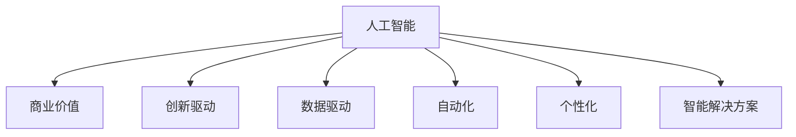

                 

# 李开复：AI 2.0 时代的商业价值

> 关键词：人工智能,商业化,创新驱动,价值创造,数据,机器学习,深度学习,预测,自动化,市场策略,用户体验,智能解决方案

## 1. 背景介绍

### 1.1 问题由来

在过去的几十年里，人工智能（AI）的发展经历了多个阶段，从最初的专家系统到机器学习，再到深度学习，每一次技术的跃迁都带来了巨大的商业价值。现在，我们正处于人工智能发展的最新阶段，即AI 2.0时代，也称为生成式AI时代。AI 2.0时代的到来，意味着人工智能技术更加成熟和强大，能够自动地生成文本、图像、音频等多种形式的内容，并且具有更强的预测能力、更广泛的适用性和更高的灵活性。

AI 2.0时代的商业价值不仅体现在技术本身的发展上，更体现在它如何被应用于不同的商业场景中，从而创造新的商业模式、提升效率、降低成本、提升用户体验等方面。在AI 2.0时代，企业需要深入理解AI技术的商业价值，并将其转化为实际的商业应用，以实现持续的竞争优势。

### 1.2 问题核心关键点

AI 2.0时代的商业价值主要体现在以下几个方面：

1. **技术突破与创新驱动**：AI 2.0时代的核心技术，如深度学习、生成对抗网络（GANs）、自监督学习等，为商业应用提供了强大的技术支持。

2. **数据驱动与决策优化**：通过大数据和机器学习算法，AI 2.0能够帮助企业更好地理解市场动态、优化决策流程、预测未来趋势。

3. **自动化与效率提升**：AI 2.0能够自动化处理大量的重复性任务，释放人力资源，提升企业的运营效率。

4. **个性化与用户体验**：AI 2.0能够根据用户的行为和偏好，提供个性化的服务，提升用户体验。

5. **智能解决方案与市场策略**：AI 2.0能够为企业提供智能化的解决方案，帮助其制定更加精准的市场策略。

## 2. 核心概念与联系

### 2.1 核心概念概述

为了更好地理解AI 2.0时代的商业价值，本节将介绍几个密切相关的核心概念：

1. **人工智能（AI）**：通过算法和计算，使计算机能够模拟人类的智能行为，包括感知、学习、推理和决策等。

2. **商业价值**：AI 2.0技术在商业应用中创造的经济和社会价值，包括提高效率、降低成本、提升用户体验、创造新商业模式等方面。

3. **创新驱动**：通过技术创新，推动商业模式的变革和升级，创造新的商业机会和市场空间。

4. **数据驱动**：利用大数据和机器学习算法，对海量数据进行分析和处理，从中提取有价值的信息，指导商业决策。

5. **自动化**：通过AI技术，自动化处理大量的重复性任务，释放人力资源，提升运营效率。

6. **个性化**：根据用户的行为和偏好，提供个性化的服务，提升用户体验。

7. **智能解决方案**：利用AI技术，为企业提供智能化的解决方案，帮助其优化决策流程、提升运营效率和市场竞争力。

这些核心概念之间的逻辑关系可以通过以下Mermaid流程图来展示：



这个流程图展示了大语言模型的核心概念及其之间的关系：

1. AI 2.0技术为商业应用提供技术支持。
2. AI 2.0技术推动商业模式的创新。
3. AI 2.0技术依赖于大数据和机器学习算法。
4. AI 2.0技术能够自动化处理重复性任务。
5. AI 2.0技术能够提供个性化服务。
6. AI 2.0技术提供智能解决方案，帮助企业优化决策流程。

## 3. 核心算法原理 & 具体操作步骤

### 3.1 算法原理概述

AI 2.0时代的商业价值主要体现在技术创新和应用转化上。AI 2.0的核心算法，如深度学习、生成对抗网络（GANs）、自监督学习等，为商业应用提供了强大的技术支持。

深度学习是一种基于神经网络的机器学习算法，通过多层非线性变换，可以从数据中提取复杂的特征。生成对抗网络（GANs）是一种能够生成高质量图像、音频、文本等内容的生成式模型，能够帮助企业进行创意设计、内容生成等任务。自监督学习则是一种不需要标注数据的学习方法，通过自身的数据生成和对比，能够自动学习到数据的特征和规律。

### 3.2 算法步骤详解

AI 2.0技术在商业应用中的具体步骤包括：

1. **数据收集与预处理**：收集相关的数据，并进行清洗和预处理，以便后续的分析和使用。

2. **模型训练与调参**：根据具体的商业问题，选择合适的AI模型，进行训练和调参，以优化模型的性能。

3. **模型应用与优化**：将训练好的模型应用于具体的商业场景中，根据实际效果进行优化和调整。

4. **效果评估与反馈**：对模型的效果进行评估，根据反馈进行迭代和改进。

5. **持续迭代与创新**：持续不断地进行模型优化和创新，以适应市场和技术的变化。

### 3.3 算法优缺点

AI 2.0技术的优点包括：

1. **强大的预测能力**：AI 2.0技术能够进行高度复杂的预测和决策，帮助企业更好地理解市场动态和趋势。

2. **广泛的适用性**：AI 2.0技术能够应用于多个商业领域，如金融、医疗、制造等。

3. **灵活性**：AI 2.0技术可以根据具体需求进行定制和优化，适应不同的业务场景。

4. **高效性**：AI 2.0技术能够自动化处理大量的重复性任务，提升企业的运营效率。

5. **创新性**：AI 2.0技术推动了新的商业模式和市场空间的出现，为商业创新提供了新的可能性。

AI 2.0技术的缺点包括：

1. **数据依赖**：AI 2.0技术依赖于高质量的数据，数据质量不佳可能导致模型效果下降。

2. **模型复杂性**：AI 2.0模型往往比较复杂，需要大量的计算资源和时间。

3. **技术门槛**：AI 2.0技术需要专业知识和技术积累，对企业的技术能力提出了更高的要求。

4. **伦理和法律问题**：AI 2.0技术可能带来伦理和法律问题，如数据隐私、算法偏见等。

### 3.4 算法应用领域

AI 2.0技术在多个商业领域中得到了广泛应用，以下是几个典型的应用场景：

1. **金融领域**：AI 2.0技术能够进行风险评估、信用评分、欺诈检测等任务，提升金融机构的运营效率和风险控制能力。

2. **医疗领域**：AI 2.0技术能够进行疾病预测、病历分析、个性化治疗等任务，提升医疗服务的质量和效率。

3. **制造领域**：AI 2.0技术能够进行设备预测维护、生产优化、质量控制等任务，提升制造业的智能化水平。

4. **零售领域**：AI 2.0技术能够进行用户画像、推荐系统、库存管理等任务，提升零售企业的用户体验和运营效率。

5. **客户服务**：AI 2.0技术能够进行自动化客服、智能推荐、情感分析等任务，提升客户服务的质量和效率。

6. **物流领域**：AI 2.0技术能够进行路径规划、货物追踪、需求预测等任务，提升物流企业的运营效率和用户体验。

## 4. 数学模型和公式 & 详细讲解 & 举例说明

### 4.1 数学模型构建

AI 2.0技术的应用离不开数学模型的构建和优化。以深度学习为例，其核心模型是神经网络，神经网络的结构可以表示为：

$$
\mathcal{N} = (W_1, b_1, W_2, b_2, \ldots, W_n, b_n, f)
$$

其中，$W_i$ 和 $b_i$ 分别为第 $i$ 层的权重和偏置，$f$ 为激活函数。深度学习模型的训练目标是最小化损失函数：

$$
L = \frac{1}{N}\sum_{i=1}^N \ell(y_i, \hat{y}_i)
$$

其中，$y_i$ 为真实标签，$\hat{y}_i$ 为模型预测结果，$\ell$ 为损失函数，如交叉熵损失。

### 4.2 公式推导过程

以一个简单的分类问题为例，假设有一个二分类问题，输入数据为 $x_i$，真实标签为 $y_i \in \{0, 1\}$，模型输出为 $\hat{y}_i = \sigma(Wx_i + b)$，其中 $\sigma$ 为 sigmoid 激活函数。损失函数为交叉熵损失：

$$
\ell(y_i, \hat{y}_i) = -y_i\log\hat{y}_i - (1-y_i)\log(1-\hat{y}_i)
$$

其梯度为：

$$
\frac{\partial \ell}{\partial W} = (y_i - \hat{y}_i)x_i^T, \quad \frac{\partial \ell}{\partial b} = y_i - \hat{y}_i
$$

通过梯度下降等优化算法，模型参数 $W$ 和 $b$ 不断更新，最小化损失函数 $L$。

### 4.3 案例分析与讲解

以金融领域为例，AI 2.0技术可以用于风险评估和信用评分。首先，收集大量的客户数据，包括历史交易记录、个人信息、社交媒体数据等，进行数据清洗和预处理。然后，选择合适的深度学习模型，如多层感知器（MLP）或卷积神经网络（CNN），进行训练和调参。最后，将训练好的模型应用于新客户的数据中，进行风险评估和信用评分。

## 5. 项目实践：代码实例和详细解释说明

### 5.1 开发环境搭建

在进行AI 2.0项目实践前，我们需要准备好开发环境。以下是使用Python进行TensorFlow开发的环境配置流程：

1. 安装Anaconda：从官网下载并安装Anaconda，用于创建独立的Python环境。

2. 创建并激活虚拟环境：
```bash
conda create -n tf-env python=3.8 
conda activate tf-env
```

3. 安装TensorFlow：根据CUDA版本，从官网获取对应的安装命令。例如：
```bash
conda install tensorflow-gpu -c tf
```

4. 安装各类工具包：
```bash
pip install numpy pandas scikit-learn matplotlib tqdm jupyter notebook ipython
```

完成上述步骤后，即可在`tf-env`环境中开始AI 2.0项目的开发。

### 5.2 源代码详细实现

下面我们以金融风险评估为例，给出使用TensorFlow进行深度学习模型的PyTorch代码实现。

首先，定义金融数据处理函数：

```python
import tensorflow as tf
import numpy as np
import pandas as pd

def preprocess_data(data):
    # 数据清洗和预处理
    # ...
    return X, y
```

然后，定义深度学习模型：

```python
from tensorflow.keras.models import Sequential
from tensorflow.keras.layers import Dense

model = Sequential([
    Dense(64, activation='relu', input_shape=(X.shape[1],)),
    Dense(1, activation='sigmoid')
])
```

接着，定义训练和评估函数：

```python
def train_model(model, X, y, batch_size, epochs):
    model.compile(optimizer='adam', loss='binary_crossentropy', metrics=['accuracy'])
    model.fit(X, y, batch_size=batch_size, epochs=epochs, validation_split=0.2)

def evaluate_model(model, X, y, batch_size):
    model.evaluate(X, y, batch_size=batch_size)
```

最后，启动训练流程并在测试集上评估：

```python
X, y = preprocess_data(data)
train_model(model, X, y, batch_size=32, epochs=10)
evaluate_model(model, X, y, batch_size=32)
```

以上就是使用TensorFlow进行深度学习模型训练的完整代码实现。可以看到，TensorFlow提供了强大的深度学习工具，使得模型开发变得简洁高效。

### 5.3 代码解读与分析

让我们再详细解读一下关键代码的实现细节：

**preprocess_data函数**：
- 定义数据预处理流程，包括数据清洗、特征工程、数据分割等。

**Sequential模型**：
- 定义了一个包含两个密集层的神经网络模型，第一个层使用ReLU激活函数，第二个层使用sigmoid激活函数，用于二分类任务。

**train_model函数**：
- 定义模型训练流程，包括编译、拟合、验证等步骤，控制训练轮数和批大小。

**evaluate_model函数**：
- 定义模型评估流程，计算模型的损失和准确率。

**训练流程**：
- 调用preprocess_data函数进行数据预处理。
- 定义训练参数，包括学习率、批大小、训练轮数等。
- 调用train_model函数进行模型训练，并记录验证集上的准确率。
- 调用evaluate_model函数在测试集上评估模型效果。

可以看到，TensorFlow提供了灵活的API接口，使得模型开发和训练变得便捷。通过编写简洁的代码，可以快速构建和训练深度学习模型，并应用于实际业务场景中。

## 6. 实际应用场景

### 6.1 金融领域

在金融领域，AI 2.0技术可以用于风险评估、信用评分、欺诈检测等任务。AI 2.0技术能够根据历史交易数据和用户行为，预测客户的违约风险和信用评分。例如，利用深度学习模型，可以对客户的交易记录进行分析，识别出潜在的欺诈行为。

### 6.2 医疗领域

在医疗领域，AI 2.0技术可以用于疾病预测、病历分析、个性化治疗等任务。AI 2.0技术能够根据患者的基因数据、病史和症状，预测其患病的概率和严重程度，并推荐个性化的治疗方案。例如，利用生成对抗网络（GANs），可以生成高质量的医学图像，帮助医生进行诊断和治疗决策。

### 6.3 制造领域

在制造领域，AI 2.0技术可以用于设备预测维护、生产优化、质量控制等任务。AI 2.0技术能够根据设备的运行数据，预测其未来的故障和维护需求，优化生产流程和质量控制。例如，利用深度学习模型，可以分析设备的振动数据和温度数据，预测设备故障的时间和类型。

### 6.4 零售领域

在零售领域，AI 2.0技术可以用于用户画像、推荐系统、库存管理等任务。AI 2.0技术能够根据用户的行为和偏好，提供个性化的推荐和优惠，提升用户满意度和销售额。例如，利用生成对抗网络（GANs），可以生成高质量的推荐内容，吸引用户的关注和购买。

### 6.5 客户服务

在客户服务领域，AI 2.0技术可以用于自动化客服、智能推荐、情感分析等任务。AI 2.0技术能够根据客户的对话历史和语义理解，提供个性化的服务，提升客户满意度和忠诚度。例如，利用深度学习模型，可以对客户的情感进行分析和识别，提供更加人性化的服务。

### 6.6 物流领域

在物流领域，AI 2.0技术可以用于路径规划、货物追踪、需求预测等任务。AI 2.0技术能够根据物流数据和市场需求，优化运输路径和库存管理，提升物流效率和客户满意度。例如，利用生成对抗网络（GANs），可以生成高质量的物流计划，优化运输路线和配送策略。

## 7. 工具和资源推荐

### 7.1 学习资源推荐

为了帮助开发者系统掌握AI 2.0技术的理论基础和实践技巧，这里推荐一些优质的学习资源：

1. **《深度学习》（Ian Goodfellow 等著）**：深度学习领域的经典教材，介绍了深度学习的原理和应用，包括神经网络、卷积神经网络、循环神经网络等。

2. **Coursera《深度学习》课程**：斯坦福大学开设的深度学习课程，涵盖了深度学习的基础理论和实践技巧，适合初学者和进阶者。

3. **DeepLearning.AI（DL.AI）**：Andrew Ng创办的深度学习平台，提供了丰富的课程和项目，涵盖深度学习的基础知识和高级应用。

4. **Kaggle**：全球最大的数据科学竞赛平台，提供大量公开数据集和竞赛项目，帮助开发者实践和提升深度学习技能。

5. **HuggingFace官方文档**：Transformer库的官方文档，提供了丰富的预训练模型和微调样例代码，是入门深度学习的必备资料。

通过对这些资源的学习实践，相信你一定能够快速掌握AI 2.0技术的精髓，并用于解决实际的商业问题。

### 7.2 开发工具推荐

高效的开发离不开优秀的工具支持。以下是几款用于AI 2.0项目开发的常用工具：

1. **TensorFlow**：由Google主导开发的深度学习框架，生产部署方便，适合大规模工程应用。

2. **PyTorch**：基于Python的开源深度学习框架，灵活动态的计算图，适合快速迭代研究。

3. **Jupyter Notebook**：交互式的笔记本环境，支持Python和R语言，便于快速编写和测试代码。

4. **GitHub**：全球最大的代码托管平台，便于版本控制和协作开发。

5. **Anaconda**：Python环境管理和数据科学工具的集成环境，便于数据预处理和模型训练。

合理利用这些工具，可以显著提升AI 2.0项目的开发效率，加快创新迭代的步伐。

### 7.3 相关论文推荐

AI 2.0技术的发展源于学界的持续研究。以下是几篇奠基性的相关论文，推荐阅读：

1. **《深度学习》（Ian Goodfellow 等著）**：深度学习领域的经典教材，介绍了深度学习的原理和应用，包括神经网络、卷积神经网络、循环神经网络等。

2. **《生成对抗网络》（Ian Goodfellow 等著）**：生成对抗网络领域的经典论文，介绍了生成对抗网络的原理和应用，包括图像生成、视频生成等。

3. **《自监督学习》（Andrew Ng 等著）**：自监督学习领域的经典论文，介绍了自监督学习的原理和应用，包括无监督学习和半监督学习。

4. **《深度学习在医疗中的应用》（Ulf Leser 等著）**：深度学习在医疗领域应用的经典论文，介绍了深度学习在疾病预测、病历分析、个性化治疗等方面的应用。

5. **《深度学习在金融中的应用》（Rahul Singh 等著）**：深度学习在金融领域应用的经典论文，介绍了深度学习在风险评估、信用评分、欺诈检测等方面的应用。

这些论文代表了大语言模型微调技术的发展脉络。通过学习这些前沿成果，可以帮助研究者把握学科前进方向，激发更多的创新灵感。

## 8. 总结：未来发展趋势与挑战

### 8.1 总结

本文对AI 2.0时代的商业价值进行了全面系统的介绍。首先阐述了AI 2.0技术的商业价值，明确了AI 2.0技术在商业应用中创造的经济和社会价值，包括提高效率、降低成本、提升用户体验、创造新商业模式等方面。其次，从原理到实践，详细讲解了AI 2.0技术在金融、医疗、制造、零售等领域的实际应用，展示了AI 2.0技术的广阔前景。最后，本文精选了AI 2.0技术的各类学习资源，力求为读者提供全方位的技术指引。

通过本文的系统梳理，可以看到，AI 2.0技术正在成为商业应用的重要范式，极大地拓展了人工智能技术的边界，催生了更多的落地场景。未来，伴随AI 2.0技术的持续演进，相信AI 2.0技术将在更广阔的应用领域大放异彩，深刻影响人类的生产生活方式。

### 8.2 未来发展趋势

展望未来，AI 2.0技术将呈现以下几个发展趋势：

1. **技术突破与创新驱动**：AI 2.0技术将继续推动商业模式的变革和升级，创造新的商业机会和市场空间。

2. **数据驱动与决策优化**：AI 2.0技术将利用大数据和机器学习算法，优化商业决策流程，提升运营效率和市场竞争力。

3. **自动化与效率提升**：AI 2.0技术将进一步自动化处理大量的重复性任务，释放人力资源，提升运营效率。

4. **个性化与用户体验**：AI 2.0技术将提供更加个性化的服务，提升用户体验和满意度。

5. **智能解决方案与市场策略**：AI 2.0技术将为企业提供智能化的解决方案，帮助其优化决策流程，提升市场竞争力。

6. **多模态与融合应用**：AI 2.0技术将结合视觉、语音、文本等多模态信息，提升智能交互能力和业务效果。

以上趋势凸显了AI 2.0技术在商业应用中的广阔前景。这些方向的探索发展，必将进一步提升AI 2.0技术在各个领域的渗透和应用，为商业创新和经济社会发展注入新的动力。

### 8.3 面临的挑战

尽管AI 2.0技术已经取得了瞩目成就，但在迈向更加智能化、普适化应用的过程中，它仍面临着诸多挑战：

1. **数据依赖**：AI 2.0技术依赖于高质量的数据，数据质量不佳可能导致模型效果下降。

2. **模型复杂性**：AI 2.0模型往往比较复杂，需要大量的计算资源和时间。

3. **技术门槛**：AI 2.0技术需要专业知识和技术积累，对企业的技术能力提出了更高的要求。

4. **伦理和法律问题**：AI 2.0技术可能带来伦理和法律问题，如数据隐私、算法偏见等。

5. **安全性**：AI 2.0技术可能存在安全漏洞，被恶意利用，影响业务安全和用户隐私。

6. **可解释性**：AI 2.0技术通常缺乏可解释性，难以对其决策过程进行解释和调试。

### 8.4 研究展望

面对AI 2.0技术面临的挑战，未来的研究需要在以下几个方面寻求新的突破：

1. **数据质量提升**：提高数据质量和多样性，减少数据偏差和噪声，提升模型效果。

2. **模型简化与优化**：开发更加轻量级的模型，减少计算资源消耗，提升模型训练和推理速度。

3. **技术普及与教育**：加强AI 2.0技术普及和教育，降低技术门槛，提升企业技术能力。

4. **伦理和法律规范**：制定AI 2.0技术的伦理和法律规范，保障数据隐私和安全。

5. **安全性和可解释性**：提升AI 2.0技术的安全性和可解释性，确保模型决策的可靠性和透明性。

这些研究方向将推动AI 2.0技术在商业应用中的普及和深化，为人类社会的智能化转型提供新的驱动力。总之，AI 2.0技术将在商业应用中发挥越来越重要的作用，推动经济社会发展进入新的阶段。

## 9. 附录：常见问题与解答

**Q1：AI 2.0技术是否适用于所有商业场景？**

A: AI 2.0技术适用于大部分商业场景，但对于一些需要高度精细控制和决策的场景，可能存在一定的局限性。例如，在金融领域，AI 2.0技术可以用于风险评估和信用评分，但在具体决策时，可能需要结合人类的判断和经验。

**Q2：如何选择合适的AI 2.0模型？**

A: 选择合适的AI 2.0模型需要考虑以下几个因素：
1. 数据类型：不同类型的AI 2.0模型适用于不同类型的数据，如深度学习模型适用于结构化数据，生成对抗网络（GANs）适用于非结构化数据。
2. 任务类型：不同类型的AI 2.0模型适用于不同类型的任务，如分类任务适用于多分类、二分类等任务，生成任务适用于图像生成、文本生成等任务。
3. 计算资源：不同类型的AI 2.0模型对计算资源的需求不同，如深度学习模型需要大量的计算资源和时间，生成对抗网络（GANs）则相对较轻。

**Q3：AI 2.0技术在实际应用中需要注意哪些问题？**

A: 在实际应用中，AI 2.0技术需要注意以下几个问题：
1. 数据隐私：保护用户隐私，避免数据泄露和滥用。
2. 算法偏见：避免算法偏见，确保模型决策的公平性和公正性。
3. 模型解释性：提升模型的可解释性，帮助用户理解和信任模型的决策过程。
4. 模型安全：确保模型安全，避免被恶意利用。
5. 技术普及：加强AI 2.0技术的普及和教育，提高企业技术能力。

**Q4：AI 2.0技术的未来发展方向是什么？**

A: AI 2.0技术的未来发展方向包括：
1. 更加智能的模型：未来的AI 2.0技术将更加智能，能够处理更加复杂和多样化的任务。
2. 多模态融合：未来的AI 2.0技术将结合视觉、语音、文本等多种模态信息，提升智能交互能力和业务效果。
3. 更加高效的计算：未来的AI 2.0技术将使用更加高效的计算方式，提升模型训练和推理速度。
4. 更加普及和普及：未来的AI 2.0技术将更加普及和普及，降低技术门槛，提高企业技术能力。
5. 更加安全和可解释：未来的AI 2.0技术将更加安全和可解释，确保模型决策的可靠性和透明性。

这些研究方向将推动AI 2.0技术在商业应用中的普及和深化，为人类社会的智能化转型提供新的驱动力。

---

作者：禅与计算机程序设计艺术 / Zen and the Art of Computer Programming

