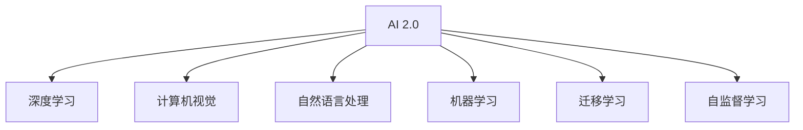

                 

# 李开复：AI 2.0 时代的市场前景

## 1. 背景介绍

### 1.1 问题由来

李开复，作为一位资深的人工智能专家和实践者，曾多次在公开场合深入探讨AI技术的未来发展趋势。特别是他对于AI 2.0时代的市场前景预测，更是引发了行业内外的广泛关注。AI 2.0（人工智能2.0）时代的到来，意味着人工智能技术的进一步成熟和应用深化，带来了一系列新的市场机会和挑战。

### 1.2 问题核心关键点

AI 2.0时代的市场前景涉及多个关键点：

1. **技术的成熟度**：AI 2.0时代下，人工智能技术的各项核心技术，如机器学习、深度学习、自然语言处理、计算机视觉等，均已达到相当高的成熟度。
2. **应用场景的多样化**：AI技术在多个垂直行业的应用正在逐渐深化，从医疗、金融、教育到制造业、物流等，均呈现出广泛的应用趋势。
3. **数据的重要性**：高质量的数据是AI 2.0时代技术进步的基础，数据驱动的AI应用正在成为行业趋势。
4. **算法和模型的创新**：AI 2.0时代，算法和模型仍在不断创新，比如自监督学习、迁移学习、元学习等技术正在推动AI技术的进步。
5. **计算资源的提升**：随着计算资源的日益丰富，如GPU、TPU等专用芯片的普及，AI应用的计算能力得到了显著提升。
6. **市场规模的扩大**：AI 2.0时代，AI市场规模的扩大将带动相关产业链的发展，形成新的经济增长点。

### 1.3 问题研究意义

李开复的AI 2.0市场前景预测，对业界具有重要意义：

1. **指导企业决策**：帮助企业理解和把握AI 2.0时代的市场变化，制定相应的战略规划。
2. **推动技术研发**：鼓励AI研究机构和公司加大对AI技术的投入，加速技术创新。
3. **促进产业发展**：引导资本、人才等资源向AI领域倾斜，推动AI产业的快速发展。
4. **增强社会认知**：提高社会对AI技术的认知度，促进AI技术的普及和应用。

## 2. 核心概念与联系

### 2.1 核心概念概述

为了更好地理解AI 2.0时代的市场前景，本节将介绍几个密切相关的核心概念：

1. **AI 2.0**：人工智能2.0时代，指的是人工智能技术在多个垂直行业应用的深度和广度不断拓展，技术成熟度、应用场景、市场规模均达到新的高度。
2. **深度学习**：基于人工神经网络，利用大量数据训练模型，以提升模型的预测能力。
3. **计算机视觉**：利用计算机技术识别、处理、分析图像、视频等视觉数据。
4. **自然语言处理**：利用计算机处理、理解和生成自然语言文本。
5. **机器学习**：通过数据训练模型，让模型具备一定的决策能力。
6. **迁移学习**：将在一个任务上学到的知识迁移到另一个任务上，以提高新任务的性能。
7. **自监督学习**：利用无标签数据进行学习，提升模型的泛化能力。

这些核心概念之间的逻辑关系可以通过以下Mermaid流程图来展示：



这个流程图展示了大语言模型的核心概念及其之间的关系：

1. AI 2.0时代下，深度学习、计算机视觉、自然语言处理等核心技术均处于重要位置。
2. 迁移学习和自监督学习作为提升模型泛化能力的重要手段，广泛应用于各类AI应用中。
3. 机器学习作为AI的基础，在各类AI技术中均有所体现。

这些概念共同构成了AI 2.0时代的技术框架，使得AI技术在多个领域中得到了广泛应用。

## 3. 核心算法原理 & 具体操作步骤

### 3.1 算法原理概述

AI 2.0时代的核心算法原理主要包括：

- **深度学习算法**：基于人工神经网络，利用大量数据训练模型，以提升模型的预测能力。
- **迁移学习算法**：将在一个任务上学到的知识迁移到另一个任务上，以提高新任务的性能。
- **自监督学习算法**：利用无标签数据进行学习，提升模型的泛化能力。

### 3.2 算法步骤详解

AI 2.0时代的算法步骤主要包括：

1. **数据收集与预处理**：收集高质量的数据，并进行预处理，如数据清洗、归一化等。
2. **模型训练**：选择合适的算法和模型架构，利用数据训练模型。
3. **模型评估**：在验证集上评估模型性能，调整模型超参数。
4. **模型部署与优化**：将训练好的模型部署到实际应用中，进行持续优化。

### 3.3 算法优缺点

AI 2.0时代的算法具有以下优点：

- **高效性**：AI 2.0算法通常具有较高的计算效率，能够快速处理大量数据。
- **泛化能力**：迁移学习和自监督学习等方法提升了模型的泛化能力，使得模型在多种场景下均表现良好。
- **适用性广**：AI 2.0算法适用于多种应用场景，包括医疗、金融、教育等。

同时，该算法也存在一定的局限性：

- **对数据的依赖性高**：高质量的数据是AI 2.0算法的核心，数据质量和数量的不足可能导致模型性能下降。
- **模型复杂度高**：深度学习等算法的模型通常比较复杂，需要较大的计算资源和存储资源。
- **模型可解释性不足**：AI 2.0算法通常是"黑盒"模型，难以解释其内部工作机制和决策逻辑。
- **对抗攻击风险**：AI 2.0算法可能受到对抗攻击，导致模型输出结果不准确。

### 3.4 算法应用领域

AI 2.0时代的算法主要应用于以下几个领域：

1. **医疗健康**：利用AI技术进行疾病诊断、治疗方案推荐等。
2. **金融行业**：利用AI技术进行风险评估、投资分析等。
3. **教育领域**：利用AI技术进行个性化学习、智能推荐等。
4. **制造业**：利用AI技术进行生产优化、质量检测等。
5. **物流领域**：利用AI技术进行路径规划、配送优化等。
6. **智能家居**：利用AI技术进行智能控制、安全监控等。

## 4. 数学模型和公式 & 详细讲解  
### 4.1 数学模型构建

在AI 2.0时代，常见的数学模型包括：

- **线性回归模型**：用于建立输入变量和输出变量之间的关系。
- **逻辑回归模型**：用于分类问题，预测样本属于某一类别的概率。
- **卷积神经网络(CNN)**：用于图像识别等任务，提取局部特征。
- **循环神经网络(RNN)**：用于时间序列数据处理，如文本生成、语音识别等。
- **生成对抗网络(GAN)**：用于生成高质量的样本数据。

### 4.2 公式推导过程

以卷积神经网络为例，其基本结构包括卷积层、池化层、全连接层等。卷积神经网络的公式推导过程如下：

- **卷积层公式**：
  $$
  y = f(x * w) + b
  $$
  其中 $y$ 为输出特征图，$x$ 为输入图像，$w$ 为卷积核，$f$ 为激活函数，$b$ 为偏置项。

- **池化层公式**：
  $$
  y = f(max(x))
  $$
  其中 $y$ 为输出特征图，$x$ 为输入特征图，$f$ 为激活函数，$max$ 为取最大值操作。

- **全连接层公式**：
  $$
  y = f(xW + b)
  $$
  其中 $y$ 为输出向量，$x$ 为输入向量，$W$ 为权重矩阵，$b$ 为偏置项，$f$ 为激活函数。

### 4.3 案例分析与讲解

以图像识别为例，卷积神经网络通过多层次的卷积和池化操作，逐步提取图像中的特征，最终通过全连接层进行分类。训练过程中，通过反向传播算法更新卷积核、权重等参数，使得模型在测试集上达到较高的准确率。

## 5. 项目实践：代码实例和详细解释说明

### 5.1 开发环境搭建

在进行AI 2.0项目的实践前，我们需要准备好开发环境。以下是使用Python进行TensorFlow开发的Python环境配置流程：

1. 安装Anaconda：从官网下载并安装Anaconda，用于创建独立的Python环境。

2. 创建并激活虚拟环境：
```bash
conda create -n tf-env python=3.8 
conda activate tf-env
```

3. 安装TensorFlow：根据CUDA版本，从官网获取对应的安装命令。例如：
```bash
conda install tensorflow -c conda-forge -c pytorch
```

4. 安装各类工具包：
```bash
pip install numpy pandas scikit-learn matplotlib tqdm jupyter notebook ipython
```

完成上述步骤后，即可在`tf-env`环境中开始AI 2.0项目的开发。

### 5.2 源代码详细实现

这里我们以图像分类为例，给出使用TensorFlow进行卷积神经网络(CNN)的代码实现。

首先，定义CNN模型的类：

```python
import tensorflow as tf
from tensorflow.keras import layers, models

class CNNModel(models.Model):
    def __init__(self):
        super(CNNModel, self).__init__()
        self.conv1 = layers.Conv2D(32, (3, 3), activation='relu', input_shape=(28, 28, 1))
        self.pool1 = layers.MaxPooling2D((2, 2))
        self.conv2 = layers.Conv2D(64, (3, 3), activation='relu')
        self.pool2 = layers.MaxPooling2D((2, 2))
        self.flatten = layers.Flatten()
        self.dense1 = layers.Dense(64, activation='relu')
        self.dropout = layers.Dropout(0.5)
        self.dense2 = layers.Dense(10, activation='softmax')

    def call(self, inputs):
        x = self.conv1(inputs)
        x = self.pool1(x)
        x = self.conv2(x)
        x = self.pool2(x)
        x = self.flatten(x)
        x = self.dense1(x)
        x = self.dropout(x)
        x = self.dense2(x)
        return x
```

然后，定义训练和评估函数：

```python
from tensorflow.keras.datasets import mnist
from tensorflow.keras.utils import to_categorical

(train_images, train_labels), (test_images, test_labels) = mnist.load_data()
train_images = train_images.reshape((60000, 28, 28, 1))
train_images = train_images / 255.0
test_images = test_images.reshape((10000, 28, 28, 1))
test_images = test_images / 255.0
train_labels = to_categorical(train_labels)
test_labels = to_categorical(test_labels)

def train_model(model, epochs):
    model.compile(optimizer='adam', loss='categorical_crossentropy', metrics=['accuracy'])
    model.fit(train_images, train_labels, epochs=epochs, batch_size=32, validation_data=(test_images, test_labels))

def evaluate_model(model, test_images, test_labels):
    test_loss, test_acc = model.evaluate(test_images, test_labels)
    print('Test Accuracy:', test_acc)
```

最后，启动训练流程并在测试集上评估：

```python
model = CNNModel()
train_model(model, epochs=10)
evaluate_model(model, test_images, test_labels)
```

以上就是使用TensorFlow进行CNN模型训练的完整代码实现。可以看到，TensorFlow提供了丰富的API接口，使得模型的定义和训练过程变得简洁高效。

### 5.3 代码解读与分析

让我们再详细解读一下关键代码的实现细节：

**CNNModel类**：
- `__init__`方法：初始化模型的各个层次结构。
- `call`方法：定义模型的前向传播过程。

**训练和评估函数**：
- 使用TensorFlow的DataLoader对数据集进行批次化加载，供模型训练和推理使用。
- 训练函数`train_model`：对数据以批为单位进行迭代，在每个批次上前向传播计算损失函数并反向传播更新模型参数，最后返回模型的损失和准确率。
- 评估函数`evaluate_model`：与训练类似，不同点在于不更新模型参数，并在每个batch结束后将预测结果和真实标签存储下来，最后使用TensorFlow的`evaluate`方法对整个测试集的预测结果进行打印输出。

**训练流程**：
- 定义总的epoch数和batch size，开始循环迭代
- 每个epoch内，先在训练集上训练，输出模型的损失和准确率
- 在测试集上评估，输出测试集上的准确率

可以看到，TensorFlow使得CNN模型的训练和评估过程变得简洁高效。开发者可以将更多精力放在模型架构设计和数据处理上，而不必过多关注底层实现细节。

当然，工业级的系统实现还需考虑更多因素，如模型的保存和部署、超参数的自动搜索、更灵活的任务适配层等。但核心的CNN模型训练流程基本与此类似。

## 6. 实际应用场景

### 6.1 医疗影像分析

AI 2.0技术在医疗影像分析中具有广泛的应用前景。利用深度学习算法，可以对医疗影像进行自动分析，识别病灶、病变区域等。

在技术实现上，可以收集医院内的医疗影像数据，并对其进行标注。在此基础上对预训练深度学习模型进行微调，使其能够自动识别影像中的病灶。微调后的模型能够高效地对新影像进行分析和诊断，辅助医生进行疾病预测和治疗方案推荐。

### 6.2 自动驾驶

自动驾驶是AI 2.0技术的重要应用领域之一。利用计算机视觉和深度学习算法，可以对道路环境进行实时感知，进行路径规划和决策。

在技术实现上，可以收集自动驾驶车辆的历史行驶数据，并对其进行标注。在此基础上对预训练的计算机视觉和深度学习模型进行微调，使其能够适应不同的道路环境。微调后的模型能够在各种复杂路况下实现自动驾驶，提升行驶安全性和效率。

### 6.3 智能客服

AI 2.0技术在智能客服中也有广泛的应用。利用自然语言处理和深度学习算法，可以实现自动客服，快速响应客户咨询。

在技术实现上，可以收集客服中心的历史对话数据，并对其进行标注。在此基础上对预训练的自然语言处理和深度学习模型进行微调，使其能够自动理解客户意图，匹配最合适的回答。微调后的模型能够24小时不间断服务，快速响应客户咨询，提高客户满意度。

### 6.4 未来应用展望

随着AI 2.0技术的不断成熟，未来其在多个领域的应用前景将更加广阔：

1. **智能制造**：利用AI 2.0技术进行生产流程优化、质量检测等，提升生产效率和产品质量。
2. **智慧城市**：利用AI 2.0技术进行城市管理、公共安全等，提升城市智能化水平。
3. **智能家居**：利用AI 2.0技术进行智能控制、安全监控等，提升家居智能化水平。
4. **金融风控**：利用AI 2.0技术进行风险评估、欺诈检测等，提升金融安全性和效率。
5. **教育行业**：利用AI 2.0技术进行个性化学习、智能推荐等，提升教育效果和效率。

未来，AI 2.0技术的应用场景将更加多样，市场规模也将不断扩大，推动AI技术在各个垂直行业中的深度应用。

## 7. 工具和资源推荐

### 7.1 学习资源推荐

为了帮助开发者系统掌握AI 2.0技术的理论基础和实践技巧，这里推荐一些优质的学习资源：

1. **《深度学习》课程**：斯坦福大学开设的深度学习课程，涵盖了深度学习的基础知识和前沿技术，适合入门和进阶学习。
2. **TensorFlow官方文档**：TensorFlow的官方文档，提供了详细的API接口和使用教程，是上手实践的必备资料。
3. **Kaggle平台**：提供丰富的数据集和竞赛，帮助开发者在实际项目中学习和应用AI技术。
4. **ArXiv网站**：提供前沿的AI研究论文，帮助开发者了解最新的研究动态和技术进展。

通过对这些资源的学习实践，相信你一定能够快速掌握AI 2.0技术的精髓，并用于解决实际的AI问题。

### 7.2 开发工具推荐

高效的开发离不开优秀的工具支持。以下是几款用于AI 2.0技术开发的常用工具：

1. **TensorFlow**：由Google主导开发的深度学习框架，生产部署方便，适合大规模工程应用。
2. **PyTorch**：基于Python的开源深度学习框架，灵活动态的计算图，适合快速迭代研究。
3. **Keras**：基于TensorFlow和Theano等后端的高级神经网络API，易于上手和使用。
4. **Jupyter Notebook**：强大的交互式编程环境，方便开发者进行数据处理和模型训练。
5. **Weights & Biases**：模型训练的实验跟踪工具，可以记录和可视化模型训练过程中的各项指标，方便对比和调优。

合理利用这些工具，可以显著提升AI 2.0技术的开发效率，加快创新迭代的步伐。

### 7.3 相关论文推荐

AI 2.0技术的发展源于学界的持续研究。以下是几篇奠基性的相关论文，推荐阅读：

1. **《Deep Learning》**：Ian Goodfellow等人所著，全面介绍了深度学习的基础知识和算法。
2. **《ImageNet Classification with Deep Convolutional Neural Networks》**：Alex Krizhevsky等人所著，提出卷积神经网络，推动了图像识别技术的进步。
3. **《Attention is All You Need》**：Ashish Vaswani等人所著，提出Transformer结构，推动了自然语言处理技术的进步。

这些论文代表了大语言模型微调技术的发展脉络。通过学习这些前沿成果，可以帮助研究者把握学科前进方向，激发更多的创新灵感。

## 8. 总结：未来发展趋势与挑战

### 8.1 总结

本文对AI 2.0时代的市场前景进行了全面系统的介绍。首先阐述了AI 2.0时代的背景和意义，明确了AI 2.0时代的核心技术和应用场景。其次，从原理到实践，详细讲解了AI 2.0技术的数学模型和算法流程，给出了AI 2.0技术的代码实例。同时，本文还广泛探讨了AI 2.0技术在医疗、自动驾驶、智能客服等多个行业领域的应用前景，展示了AI 2.0技术的巨大潜力。此外，本文精选了AI 2.0技术的各类学习资源，力求为读者提供全方位的技术指引。

通过本文的系统梳理，可以看到，AI 2.0技术正在成为各个垂直行业的重要工具，极大地提升了各行业的智能化水平。未来，伴随AI 2.0技术的进一步发展，AI技术将逐步走向普及和成熟，为各行各业带来深刻的变革。

### 8.2 未来发展趋势

展望未来，AI 2.0技术的发展趋势包括：

1. **算法的不断创新**：深度学习算法、自然语言处理算法、计算机视觉算法等将不断创新，推动AI技术的发展。
2. **应用场景的广泛拓展**：AI 2.0技术将广泛应用于医疗、金融、制造、教育等多个领域，带来新的应用场景和市场机会。
3. **计算资源的持续提升**：随着计算资源和硬件设备的不断提升，AI 2.0技术的计算能力将进一步增强。
4. **数据驱动的深入应用**：高质量的数据是AI 2.0技术的核心，未来的AI 2.0技术将更加依赖数据的驱动和驱动。
5. **跨领域技术的融合**：AI 2.0技术将与物联网、云计算、区块链等技术深度融合，形成新的技术生态系统。
6. **伦理和安全性的重视**：AI 2.0技术的应用将更加注重伦理和安全性的问题，推动AI技术的健康发展。

以上趋势凸显了AI 2.0技术的广阔前景。这些方向的探索发展，必将进一步提升AI 2.0技术在各个垂直行业中的应用范围，推动人工智能技术的普及和应用。

### 8.3 面临的挑战

尽管AI 2.0技术已经取得了显著进展，但在迈向更加智能化、普适化应用的过程中，仍面临诸多挑战：

1. **数据的获取与处理**：高质量的数据获取和处理是AI 2.0技术的核心，但数据的获取和处理成本较高，需要耗费大量时间和资源。
2. **算法的复杂性**：AI 2.0技术中的深度学习算法、自然语言处理算法等复杂度高，需要大量的计算资源和存储资源。
3. **模型的可解释性**：AI 2.0技术通常是"黑盒"模型，难以解释其内部工作机制和决策逻辑。
4. **技术的可靠性**：AI 2.0技术在应用过程中可能存在误判、误报等问题，需要进一步提高模型的可靠性和鲁棒性。
5. **伦理和安全性的问题**：AI 2.0技术的应用需要考虑伦理和安全性的问题，如数据隐私、算法偏见等。

### 8.4 研究展望

未来，AI 2.0技术的研究展望包括：

1. **算法的创新和优化**：不断探索新的算法和优化方法，提高AI 2.0技术的性能和效率。
2. **跨领域技术的融合**：推动AI 2.0技术与其他技术（如物联网、云计算、区块链等）的深度融合，形成新的技术生态系统。
3. **数据驱动的深入应用**：进一步提高数据获取和处理的能力，推动AI 2.0技术的深度应用。
4. **伦理和安全的重视**：重视AI 2.0技术的伦理和安全问题，推动AI技术的健康发展。

总之，AI 2.0技术的研究和应用前景广阔，需要学界和业界共同努力，不断推动AI技术的发展和应用。相信随着技术的不断进步和应用的不断深化，AI 2.0技术必将在各个垂直行业中发挥更大的作用，推动社会的智能化和数字化转型。

## 9. 附录：常见问题与解答

**Q1：AI 2.0技术是否适用于所有行业？**

A: AI 2.0技术在大多数行业中均有一定的应用前景，但不同行业的适用性有所不同。例如，医疗、金融、制造业等行业对AI 2.0技术的需求较为迫切，而一些传统行业如农业、旅游等对AI 2.0技术的需求相对较低。

**Q2：AI 2.0技术的优势和劣势是什么？**

A: AI 2.0技术的优势包括：
- 高效性：AI 2.0技术通常具有较高的计算效率，能够快速处理大量数据。
- 泛化能力：AI 2.0技术在多种场景下均表现良好，具有良好的泛化能力。
- 适用性广：AI 2.0技术适用于多种应用场景，如医疗、金融、教育等。

AI 2.0技术的劣势包括：
- 对数据的依赖性高：高质量的数据是AI 2.0技术的核心，数据质量和数量的不足可能导致模型性能下降。
- 模型复杂度高：深度学习等算法的模型通常比较复杂，需要较大的计算资源和存储资源。
- 模型可解释性不足：AI 2.0技术通常是"黑盒"模型，难以解释其内部工作机制和决策逻辑。

**Q3：AI 2.0技术在实际应用中需要注意哪些问题？**

A: 在实际应用中，AI 2.0技术需要注意以下问题：
- 数据质量和数量的保证：高质量的数据是AI 2.0技术的核心，需要保证数据的准确性和丰富性。
- 模型的训练和优化：需要选择合适的算法和模型架构，并进行持续的优化和改进。
- 伦理和安全性的问题：AI 2.0技术的应用需要考虑伦理和安全性的问题，如数据隐私、算法偏见等。
- 技术的可靠性：AI 2.0技术在应用过程中可能存在误判、误报等问题，需要进一步提高模型的可靠性和鲁棒性。

**Q4：AI 2.0技术的未来发展趋势是什么？**

A: AI 2.0技术的未来发展趋势包括：
- 算法的不断创新：深度学习算法、自然语言处理算法、计算机视觉算法等将不断创新，推动AI技术的发展。
- 应用场景的广泛拓展：AI 2.0技术将广泛应用于医疗、金融、制造、教育等多个领域，带来新的应用场景和市场机会。
- 计算资源的持续提升：随着计算资源和硬件设备的不断提升，AI 2.0技术的计算能力将进一步增强。
- 数据驱动的深入应用：高质量的数据是AI 2.0技术的核心，未来的AI 2.0技术将更加依赖数据的驱动和驱动。
- 跨领域技术的融合：AI 2.0技术将与物联网、云计算、区块链等技术深度融合，形成新的技术生态系统。
- 伦理和安全性的重视：AI 2.0技术的应用需要考虑伦理和安全性的问题，如数据隐私、算法偏见等。

**Q5：如何有效提高AI 2.0技术的性能？**

A: 提高AI 2.0技术的性能可以从以下几个方面入手：
- 数据的获取与处理：获取高质量的数据，并进行预处理，如数据清洗、归一化等。
- 模型的选择与优化：选择合适的算法和模型架构，并进行持续的优化和改进。
- 算力的提升：使用高性能的计算设备，如GPU、TPU等，提高计算效率。
- 模型的可解释性：引入可解释性技术，增强模型的可解释性，提高用户信任度。
- 技术的创新：不断探索新的算法和优化方法，提高模型的性能和效率。

总之，AI 2.0技术的发展前景广阔，需要学界和业界共同努力，不断推动AI技术的发展和应用。相信随着技术的不断进步和应用的不断深化，AI 2.0技术必将在各个垂直行业中发挥更大的作用，推动社会的智能化和数字化转型。

---

作者：禅与计算机程序设计艺术 / Zen and the Art of Computer Programming

