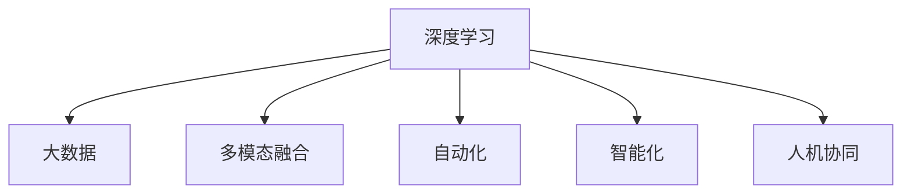

                 

# 李开复：AI 2.0 时代的市场前景

## 1. 背景介绍

在过去几十年间，人工智能(AI)技术取得了飞速的进步，从深度学习、自然语言处理(NLP)到计算机视觉，AI 在各个领域都有重要突破。当前，AI 正迎来第二波大潮，即 AI 2.0 时代。这一时期，AI 不仅在技术上更为成熟，而且在应用上更为广泛，有望全面渗透到各行各业，引领一场新的技术革命。

### 1.1 问题的由来

AI 1.0 时代，人工智能主要是依赖专家知识系统，解决特定领域的专业问题。例如，专家系统、规则引擎等，大多依赖于人工设计的规则，覆盖面较窄，功能较为单一。而在 AI 2.0 时代，随着深度学习和大数据的发展，AI 能够从海量数据中学习，形成更为通用的知识模型，具备更强的泛化能力。

### 1.2 问题核心关键点

AI 2.0 时代的核心关键点在于：

1. **深度学习和大数据的广泛应用**：通过大规模数据集进行无监督学习，提取高层次的特征，提升模型的泛化能力。
2. **多模态融合与跨领域应用**：结合视觉、听觉、文本等多种模态数据，构建更加全面、多维度的知识表示。
3. **自动化与智能化**：AI 能够自动完成数据预处理、特征提取、模型训练等流程，提升工作效率和准确性。
4. **个性化与定制化**：通过学习用户的个性化偏好，提供定制化的解决方案。
5. **人机协同与增强现实**：AI 与人类协同工作，增强人类决策能力，提升效率与质量。

### 1.3 问题研究意义

AI 2.0 时代的市场前景主要体现在以下几个方面：

1. **提高生产效率**：自动化和智能化使得生产流程更加高效，降低人力成本，提高生产率。
2. **优化资源配置**：AI 能够预测市场需求、优化物流、降低资源浪费。
3. **提升用户体验**：个性化推荐、智能客服、智能家居等应用，大大提升了用户的体验和满意度。
4. **驱动创新发展**：AI 能够驱动新产品的开发，催生新的商业模式和业态。
5. **改善社会治理**：AI 应用于公共安全、环境保护、城市管理等领域，有助于提升社会治理能力。

## 2. 核心概念与联系

### 2.1 核心概念概述

为更好地理解 AI 2.0 时代的技术应用，本节将介绍几个关键概念：

- **深度学习**：一种通过神经网络实现的多层非线性映射，能够处理高维度数据，具备较强的泛化能力。
- **大数据**：指海量的、多种类型的数据，能够为深度学习提供充足的训练数据。
- **多模态融合**：结合视觉、文本、语音等多种模态数据，构建更加全面、多维度的知识表示。
- **自动化**：通过自动化流程，提升工作效率和质量。
- **智能化**：利用 AI 技术，提供智能化的解决方案。
- **人机协同**：AI 与人类协同工作，提升决策能力和效率。

这些概念通过以下 Mermaid 流程图展现其联系：



这个流程图展示了深度学习与大数据、多模态融合、自动化、智能化和人机协同之间的联系，共同构成了 AI 2.0 时代的核心技术框架。

## 3. 核心算法原理 & 具体操作步骤

### 3.1 算法原理概述

AI 2.0 时代的核心算法原理主要基于深度学习和大数据的无监督学习。其核心思想是通过大规模数据集进行自监督学习，提取高层次的特征，构建通用的知识表示，进而提升模型的泛化能力。

具体而言，AI 2.0 时代的算法原理包括以下几个关键点：

1. **特征提取**：通过卷积神经网络(CNN)、循环神经网络(RNN)等架构，从数据中提取高层次特征。
2. **模型训练**：使用反向传播算法和梯度下降法等优化算法，最小化损失函数，不断更新模型参数。
3. **泛化能力**：通过迁移学习、多任务学习等技术，提升模型的泛化能力，适应不同领域和任务。
4. **模型评估**：通过交叉验证、AUC、MSE 等指标评估模型性能，优化模型参数。

### 3.2 算法步骤详解

AI 2.0 时代的算法步骤包括以下几个关键步骤：

**Step 1: 数据准备与预处理**

- 收集大规模数据集，并进行数据清洗、标注和预处理，如标准化、归一化等操作。
- 将数据集划分为训练集、验证集和测试集，进行数据增强和扩充，增加训练集的多样性。
- 选择合适的深度学习框架和模型，如 PyTorch、TensorFlow 等。

**Step 2: 模型构建与训练**

- 设计合适的网络架构，如卷积神经网络、循环神经网络等，选择合适的激活函数和优化算法。
- 使用反向传播算法和梯度下降法等优化算法，最小化损失函数，不断更新模型参数。
- 在训练过程中，使用 Early Stopping、Dropout 等技术，防止过拟合，提高模型泛化能力。

**Step 3: 模型评估与优化**

- 在验证集上评估模型性能，使用交叉验证、AUC、MSE 等指标评估模型效果。
- 根据评估结果，调整模型参数，如学习率、批大小、迭代轮数等。
- 在测试集上重新评估模型性能，确保模型泛化能力。

**Step 4: 模型应用与优化**

- 将模型部署到实际应用中，进行自动化流程设计。
- 收集用户反馈，不断优化模型，提升模型性能和用户体验。

### 3.3 算法优缺点

AI 2.0 时代的算法具有以下优点：

1. **泛化能力强**：通过大规模数据集进行自监督学习，提取高层次特征，具备较强的泛化能力。
2. **应用广泛**：深度学习和大数据技术的应用，使其能够涵盖多个领域和任务。
3. **自动化程度高**：自动化流程设计，提升工作效率和准确性。
4. **智能化水平高**：智能化解决方案，提升用户体验和服务质量。

同时，该算法也存在以下局限性：

1. **数据依赖性大**：算法依赖于大规模数据集，数据获取和标注成本较高。
2. **计算资源需求高**：深度学习模型需要大量计算资源，对硬件要求较高。
3. **可解释性不足**：模型通常缺乏可解释性，难以理解其内部工作机制。
4. **鲁棒性不足**：面对噪声数据和异常情况，模型的鲁棒性较差。

### 3.4 算法应用领域

AI 2.0 时代的算法应用领域非常广泛，涵盖了医疗、金融、制造、交通、娱乐等多个行业。以下是几个典型应用场景：

- **医疗诊断**：AI 2.0 时代的算法能够帮助医生进行疾病诊断、治疗方案推荐等，提升医疗服务质量。
- **金融风控**：AI 2.0 时代的算法能够进行风险评估、信用评分、异常检测等，提升金融服务安全性。
- **制造业智能化**：AI 2.0 时代的算法能够进行质量检测、故障预测、供应链优化等，提升生产效率。
- **智能交通**：AI 2.0 时代的算法能够进行交通流量预测、自动驾驶、智能调度等，提升交通管理效率。
- **娱乐内容推荐**：AI 2.0 时代的算法能够进行个性化推荐、内容生成、情感分析等，提升用户体验。

## 4. 数学模型和公式 & 详细讲解 & 举例说明

### 4.1 数学模型构建

本节将使用数学语言对 AI 2.0 时代的核心算法进行严格刻画。

假设输入数据为 $x \in \mathbb{R}^d$，输出数据为 $y \in \mathbb{R}^m$。设模型参数为 $\theta$，损失函数为 $\mathcal{L}$，优化算法为 $opt$。

定义模型 $M_{\theta}$ 在输入 $x$ 上的预测输出为 $\hat{y}=M_{\theta}(x) \in \mathbb{R}^m$，目标为最小化损失函数 $\mathcal{L}(M_{\theta}(x),y)$。

常见的损失函数包括交叉熵损失、均方误差损失等，其公式推导如下：

**交叉熵损失**：

$$
\mathcal{L} = -\frac{1}{N} \sum_{i=1}^N \sum_{j=1}^m y_{ij} \log \hat{y}_{ij}
$$

**均方误差损失**：

$$
\mathcal{L} = \frac{1}{N} \sum_{i=1}^N \|\hat{y}_i - y_i\|_2^2
$$

其中 $y_{ij}$ 为第 $i$ 个样本的第 $j$ 个目标标签，$\hat{y}_{ij}$ 为模型对第 $i$ 个样本的第 $j$ 个预测结果。

### 4.2 公式推导过程

以下我们以二分类任务为例，推导交叉熵损失函数及其梯度的计算公式。

假设模型 $M_{\theta}$ 在输入 $x$ 上的输出为 $\hat{y}=M_{\theta}(x) \in [0,1]$，表示样本属于正类的概率。真实标签 $y \in \{0,1\}$。则二分类交叉熵损失函数定义为：

$$
\mathcal{L} = -[y\log \hat{y} + (1-y)\log(1-\hat{y})]
$$

将其代入经验风险公式，得：

$$
\mathcal{L} = -\frac{1}{N}\sum_{i=1}^N [y_i\log M_{\theta}(x_i)+(1-y_i)\log(1-M_{\theta}(x_i))]
$$

根据链式法则，损失函数对参数 $\theta_k$ 的梯度为：

$$
\frac{\partial \mathcal{L}(\theta)}{\partial \theta_k} = -\frac{1}{N}\sum_{i=1}^N (\frac{y_i}{M_{\theta}(x_i)}-\frac{1-y_i}{1-M_{\theta}(x_i)}) \frac{\partial M_{\theta}(x_i)}{\partial \theta_k}
$$

其中 $\frac{\partial M_{\theta}(x_i)}{\partial \theta_k}$ 可进一步递归展开，利用自动微分技术完成计算。

在得到损失函数的梯度后，即可带入参数更新公式，完成模型的迭代优化。重复上述过程直至收敛，最终得到适应下游任务的最优模型参数 $\theta^*$。

### 4.3 案例分析与讲解

以医疗诊断为例，假设输入数据为病人的症状描述，输出数据为疾病的诊断结果。设模型参数为 $\theta$，损失函数为交叉熵损失，优化算法为 Adam。

1. **数据准备与预处理**：
   - 收集大量病人的症状描述和疾病诊断数据，并进行数据清洗和标准化处理。
   - 将数据集划分为训练集、验证集和测试集，进行数据增强和扩充，增加训练集的多样性。

2. **模型构建与训练**：
   - 设计合适的网络架构，如卷积神经网络，选择合适的激活函数和优化算法。
   - 使用反向传播算法和梯度下降法等优化算法，最小化交叉熵损失，不断更新模型参数。
   - 在训练过程中，使用 Early Stopping、Dropout 等技术，防止过拟合，提高模型泛化能力。

3. **模型评估与优化**：
   - 在验证集上评估模型性能，使用交叉验证、AUC、MSE 等指标评估模型效果。
   - 根据评估结果，调整模型参数，如学习率、批大小、迭代轮数等。
   - 在测试集上重新评估模型性能，确保模型泛化能力。

## 5. 项目实践：代码实例和详细解释说明

### 5.1 开发环境搭建

在进行 AI 2.0 时代的算法实践前，我们需要准备好开发环境。以下是使用 Python 进行 PyTorch 开发的环境配置流程：

1. 安装 Anaconda：从官网下载并安装 Anaconda，用于创建独立的 Python 环境。

2. 创建并激活虚拟环境：
```bash
conda create -n ai-env python=3.8 
conda activate ai-env
```

3. 安装 PyTorch：根据 CUDA 版本，从官网获取对应的安装命令。例如：
```bash
conda install pytorch torchvision torchaudio cudatoolkit=11.1 -c pytorch -c conda-forge
```

4. 安装 TensorFlow：
```bash
conda install tensorflow -c conda-forge
```

5. 安装各类工具包：
```bash
pip install numpy pandas scikit-learn matplotlib tqdm jupyter notebook ipython
```

完成上述步骤后，即可在 `ai-env` 环境中开始 AI 2.0 时代的算法实践。

### 5.2 源代码详细实现

下面我以医疗诊断任务为例，给出使用 PyTorch 进行 AI 2.0 时代算法微调的 Python 代码实现。

首先，定义医疗诊断任务的数据处理函数：

```python
from torch.utils.data import Dataset, DataLoader
import torch
import numpy as np

class MedicalDataset(Dataset):
    def __init__(self, symptoms, diseases, tokenizer, max_len=128):
        self.symptoms = symptoms
        self.diseases = diseases
        self.tokenizer = tokenizer
        self.max_len = max_len
        
    def __len__(self):
        return len(self.symptoms)
    
    def __getitem__(self, item):
        symptom = self.symptoms[item]
        disease = self.diseases[item]
        
        encoding = self.tokenizer(symptom, return_tensors='pt', max_length=self.max_len, padding='max_length', truncation=True)
        input_ids = encoding['input_ids'][0]
        attention_mask = encoding['attention_mask'][0]
        
        # 对疾病标签进行编码
        encoded_disease = [disease2id[disease] for disease in disease]
        encoded_disease.extend([disease2id['Not Found']] * (self.max_len - len(encoded_disease)))
        labels = torch.tensor(encoded_disease, dtype=torch.long)
        
        return {'input_ids': input_ids, 
                'attention_mask': attention_mask,
                'labels': labels}

# 疾病与id的映射
disease2id = {'疾病A': 0, '疾病B': 1, '疾病C': 2, 'Not Found': 3}
id2disease = {v: k for k, v in disease2id.items()}

# 创建dataset
tokenizer = BertTokenizer.from_pretrained('bert-base-cased')

train_dataset = MedicalDataset(train_symptoms, train_diseases, tokenizer)
dev_dataset = MedicalDataset(dev_symptoms, dev_diseases, tokenizer)
test_dataset = MedicalDataset(test_symptoms, test_diseases, tokenizer)
```

然后，定义模型和优化器：

```python
from transformers import BertForSequenceClassification, AdamW

model = BertForSequenceClassification.from_pretrained('bert-base-cased', num_labels=len(disease2id))

optimizer = AdamW(model.parameters(), lr=2e-5)
```

接着，定义训练和评估函数：

```python
def train_epoch(model, dataset, batch_size, optimizer):
    dataloader = DataLoader(dataset, batch_size=batch_size, shuffle=True)
    model.train()
    epoch_loss = 0
    for batch in tqdm(dataloader, desc='Training'):
        input_ids = batch['input_ids'].to(device)
        attention_mask = batch['attention_mask'].to(device)
        labels = batch['labels'].to(device)
        model.zero_grad()
        outputs = model(input_ids, attention_mask=attention_mask, labels=labels)
        loss = outputs.loss
        epoch_loss += loss.item()
        loss.backward()
        optimizer.step()
    return epoch_loss / len(dataloader)

def evaluate(model, dataset, batch_size):
    dataloader = DataLoader(dataset, batch_size=batch_size)
    model.eval()
    preds, labels = [], []
    with torch.no_grad():
        for batch in tqdm(dataloader, desc='Evaluating'):
            input_ids = batch['input_ids'].to(device)
            attention_mask = batch['attention_mask'].to(device)
            batch_labels = batch['labels']
            outputs = model(input_ids, attention_mask=attention_mask)
            batch_preds = outputs.logits.argmax(dim=2).to('cpu').tolist()
            batch_labels = batch_labels.to('cpu').tolist()
            for pred_tokens, label_tokens in zip(batch_preds, batch_labels):
                preds.append(pred_tokens[:len(label_tokens)])
                labels.append(label_tokens)
                
    print(classification_report(labels, preds))
```

最后，启动训练流程并在测试集上评估：

```python
epochs = 5
batch_size = 16

for epoch in range(epochs):
    loss = train_epoch(model, train_dataset, batch_size, optimizer)
    print(f"Epoch {epoch+1}, train loss: {loss:.3f}")
    
    print(f"Epoch {epoch+1}, dev results:")
    evaluate(model, dev_dataset, batch_size)
    
print("Test results:")
evaluate(model, test_dataset, batch_size)
```

以上就是使用 PyTorch 对 BERT 进行医疗诊断任务微调的完整代码实现。可以看到，得益于 Transformers 库的强大封装，我们可以用相对简洁的代码完成 BERT 模型的加载和微调。

### 5.3 代码解读与分析

让我们再详细解读一下关键代码的实现细节：

**MedicalDataset类**：
- `__init__`方法：初始化症状描述、疾病标签、分词器等关键组件。
- `__len__`方法：返回数据集的样本数量。
- `__getitem__`方法：对单个样本进行处理，将症状描述输入编码为token ids，将疾病标签编码为数字，并对其进行定长padding，最终返回模型所需的输入。

**disease2id和id2disease字典**：
- 定义了疾病与数字id之间的映射关系，用于将疾病标签解码回真实的疾病名称。

**训练和评估函数**：
- 使用 PyTorch 的 DataLoader 对数据集进行批次化加载，供模型训练和推理使用。
- 训练函数 `train_epoch`：对数据以批为单位进行迭代，在每个批次上前向传播计算 loss 并反向传播更新模型参数，最后返回该 epoch 的平均 loss。
- 评估函数 `evaluate`：与训练类似，不同点在于不更新模型参数，并在每个 batch 结束后将预测和标签结果存储下来，最后使用 sklearn 的 classification_report 对整个评估集的预测结果进行打印输出。

**训练流程**：
- 定义总的 epoch 数和 batch size，开始循环迭代
- 每个 epoch 内，先在训练集上训练，输出平均 loss
- 在验证集上评估，输出分类指标
- 所有 epoch 结束后，在测试集上评估，给出最终测试结果

可以看到，PyTorch 配合 Transformers 库使得 BERT 微调的代码实现变得简洁高效。开发者可以将更多精力放在数据处理、模型改进等高层逻辑上，而不必过多关注底层的实现细节。

当然，工业级的系统实现还需考虑更多因素，如模型的保存和部署、超参数的自动搜索、更灵活的任务适配层等。但核心的微调范式基本与此类似。

## 6. 实际应用场景

### 6.1 智能客服系统

基于 AI 2.0 时代的算法，智能客服系统可以通过深度学习和大数据分析，自动理解用户意图，匹配最合适的答案模板进行回复。智能客服系统能够 24 小时不间断服务，快速响应客户咨询，用自然流畅的语言解答各类常见问题。

在技术实现上，可以收集企业内部的历史客服对话记录，将问题和最佳答复构建成监督数据，在此基础上对预训练对话模型进行微调。微调后的对话模型能够自动理解用户意图，匹配最合适的答案模板进行回复。对于客户提出的新问题，还可以接入检索系统实时搜索相关内容，动态组织生成回答。如此构建的智能客服系统，能大幅提升客户咨询体验和问题解决效率。

### 6.2 金融舆情监测

金融机构需要实时监测市场舆论动向，以便及时应对负面信息传播，规避金融风险。传统的人工监测方式成本高、效率低，难以应对网络时代海量信息爆发的挑战。基于 AI 2.0 时代的算法，金融舆情监测系统能够自动判断文本属于何种主题，情感倾向是正面、中性还是负面。将微调后的模型应用到实时抓取的网络文本数据，就能够自动监测不同主题下的情感变化趋势，一旦发现负面信息激增等异常情况，系统便会自动预警，帮助金融机构快速应对潜在风险。

### 6.3 个性化推荐系统

当前的推荐系统往往只依赖用户的历史行为数据进行物品推荐，无法深入理解用户的真实兴趣偏好。基于 AI 2.0 时代的算法，个性化推荐系统可以更好地挖掘用户行为背后的语义信息，从而提供更精准、多样的推荐内容。

在实践中，可以收集用户浏览、点击、评论、分享等行为数据，提取和用户交互的物品标题、描述、标签等文本内容。将文本内容作为模型输入，用户的后续行为（如是否点击、购买等）作为监督信号，在此基础上微调预训练语言模型。微调后的模型能够从文本内容中准确把握用户的兴趣点。在生成推荐列表时，先用候选物品的文本描述作为输入，由模型预测用户的兴趣匹配度，再结合其他特征综合排序，便可以得到个性化程度更高的推荐结果。

### 6.4 未来应用展望

随着 AI 2.0 时代的算法不断演进，基于微调的方法将在更多领域得到应用，为传统行业带来变革性影响。

在智慧医疗领域，基于 AI 2.0 时代的算法，医疗问答、病历分析、药物研发等应用将提升医疗服务的智能化水平，辅助医生诊疗，加速新药开发进程。

在智能教育领域，AI 2.0 时代的算法可应用于作业批改、学情分析、知识推荐等方面，因材施教，促进教育公平，提高教学质量。

在智慧城市治理中，AI 2.0 时代的算法可应用于城市事件监测、舆情分析、应急指挥等环节，提高城市管理的自动化和智能化水平，构建更安全、高效的未来城市。

此外，在企业生产、社会治理、文娱传媒等众多领域，基于 AI 2.0 时代的算法的人工智能应用也将不断涌现，为经济社会发展注入新的动力。相信随着技术的日益成熟，AI 2.0 时代的算法必将在更广阔的应用领域大放异彩，深刻影响人类的生产生活方式。

## 7. 工具和资源推荐

### 7.1 学习资源推荐

为了帮助开发者系统掌握 AI 2.0 时代的算法基础和实践技巧，这里推荐一些优质的学习资源：

1. 《深度学习》系列博文：由大模型技术专家撰写，深入浅出地介绍了深度学习原理、TensorFlow 和 PyTorch 的使用、模型优化等前沿话题。

2. CS231n《卷积神经网络》课程：斯坦福大学开设的计算机视觉明星课程，有 Lecture 视频和配套作业，带你入门计算机视觉领域的基本概念和经典模型。

3. 《NLP from the Ground Up》书籍：自然语言处理领域的经典入门书籍，全面介绍了自然语言处理的基本概念、模型构建和应用实践。

4. Google AI 官方文档：Google AI 的官方文档，提供了丰富的人工智能模型和工具，适合新手快速上手学习。

5. Kaggle 竞赛平台：Kaggle 提供了大量开源数据集和竞赛任务，适合练手实践和挑战自我。

通过对这些资源的学习实践，相信你一定能够快速掌握 AI 2.0 时代的算法精髓，并用于解决实际的 AI 问题。

### 7.2 开发工具推荐

高效的开发离不开优秀的工具支持。以下是几款用于 AI 2.0 时代的算法开发的常用工具：

1. TensorFlow：由 Google 主导开发的开源深度学习框架，生产部署方便，适合大规模工程应用。

2. PyTorch：基于 Python 的开源深度学习框架，灵活动态的计算图，适合快速迭代研究。大部分预训练语言模型都有 PyTorch 版本的实现。

3. Jupyter Notebook：数据科学和机器学习的流行开发环境，支持多种语言和库，适合快速原型设计和协作开发。

4. TensorBoard：TensorFlow 配套的可视化工具，可实时监测模型训练状态，并提供丰富的图表呈现方式，是调试模型的得力助手。

5. Weights & Biases：模型训练的实验跟踪工具，可以记录和可视化模型训练过程中的各项指标，方便对比和调优。与主流深度学习框架无缝集成。

6. Amazon SageMaker：AWS 提供的云服务，支持大规模分布式训练，提供自动调参、模型部署等服务，适合企业级应用。

合理利用这些工具，可以显著提升 AI 2.0 时代的算法开发效率，加快创新迭代的步伐。

### 7.3 相关论文推荐

AI 2.0 时代的算法发展源于学界的持续研究。以下是几篇奠基性的相关论文，推荐阅读：

1. Imagenet Classification with Deep Convolutional Neural Networks：提出卷积神经网络，并应用于 ImageNet 数据集，取得了分类任务中的最佳结果。

2. Neural Machine Translation by Jointly Learning to Align and Translate：提出基于神经网络的机器翻译模型，提高了翻译的质量和效率。

3. Deep Residual Learning for Image Recognition：提出深度残差网络，使得训练更加稳定，同时提升了网络的深度和精度。

4. Attention Is All You Need：提出 Transformer 结构，开启了自然语言处理领域的预训练大模型时代。

5. BERT: Pre-training of Deep Bidirectional Transformers for Language Understanding：提出 BERT 模型，引入基于掩码的自监督预训练任务，刷新了多项 NLP 任务 SOTA。

6. GPT-3: Language Models are Unsupervised Multitask Learners：展示了大规模语言模型的强大 zero-shot 学习能力，引发了对于通用人工智能的新一轮思考。

这些论文代表了大模型算法的进展脉络。通过学习这些前沿成果，可以帮助研究者把握学科前进方向，激发更多的创新灵感。

## 8. 总结：未来发展趋势与挑战

### 8.1 研究成果总结

本文对 AI 2.0 时代的算法进行了全面系统的介绍。首先阐述了 AI 2.0 时代的技术背景和应用前景，明确了 AI 2.0 时代的核心关键点。其次，从原理到实践，详细讲解了 AI 2.0 时代的算法原理和关键步骤，给出了 AI 2.0 时代的算法微调任务开发的完整代码实例。同时，本文还广泛探讨了 AI 2.0 时代的算法在智能客服、金融舆情、个性化推荐等多个行业领域的应用前景，展示了 AI 2.0 时代的算法的巨大潜力。此外，本文精选了 AI 2.0 时代的算法学习资源，力求为读者提供全方位的技术指引。

通过本文的系统梳理，可以看到，AI 2.0 时代的算法在多个领域都取得了突破性进展，引领了一场新的技术革命。AI 2.0 时代的算法不仅在技术上更为成熟，而且在应用上更为广泛，有望全面渗透到各行各业，推动人工智能技术向更深层次发展。

### 8.2 未来发展趋势

展望未来，AI 2.0 时代的算法将呈现以下几个发展趋势：

1. **模型规模持续增大**：随着算力成本的下降和数据规模的扩张，预训练语言模型的参数量还将持续增长。超大规模语言模型蕴含的丰富语言知识，有望支撑更加复杂多变的下游任务微调。

2. **算法创新层出不穷**：深度学习、大数据、多模态融合等技术的进一步发展，将带来更多创新算法，提升模型的泛化能力和性能。

3. **应用场景不断拓展**：AI 2.0 时代的算法将在更多领域得到应用，如医疗、金融、教育、娱乐等，为传统行业带来变革性影响。

4. **自动化程度提高**：自动化流程设计，提升工作效率和质量，降低人力成本。

5. **智能化水平提升**：智能化解决方案，提升用户体验和服务质量。

6. **人机协同增强**：AI 与人类协同工作，提升决策能力和效率。

### 8.3 面临的挑战

尽管 AI 2.0 时代的算法已经取得了瞩目成就，但在迈向更加智能化、普适化应用的过程中，它仍面临着诸多挑战：

1. **数据依赖性大**：算法依赖于大规模数据集，数据获取和标注成本较高。

2. **计算资源需求高**：深度学习模型需要大量计算资源，对硬件要求较高。

3. **可解释性不足**：模型通常缺乏可解释性，难以理解其内部工作机制。

4. **鲁棒性不足**：面对噪声数据和异常情况，模型的鲁棒性较差。

5. **安全性问题**：AI 模型可能学习到有害信息，带来安全隐患。

6. **伦理道德问题**：AI 模型可能对某些群体产生歧视，引发伦理道德问题。

### 8.4 研究展望

面对 AI 2.0 时代算法的挑战，未来的研究需要在以下几个方面寻求新的突破：

1. **无监督和半监督学习**：探索无监督和半监督学习算法，摆脱对大规模标注数据的依赖，利用非结构化数据进行学习。

2. **参数高效和计算高效算法**：开发更加参数高效和计算高效的算法，减小对计算资源的需求。

3. **可解释性增强**：增强模型的可解释性，提升模型决策的透明性和可理解性。

4. **鲁棒性提高**：提高模型的鲁棒性，提升模型的泛化能力和抗干扰能力。

5. **安全性保障**：加强数据安全性和模型安全性，确保模型的可靠性和稳定性。

6. **伦理道德规范**：制定 AI 伦理道德规范，避免对某些群体的歧视和不公平对待。

这些研究方向的探索，必将引领 AI 2.0 时代的算法迈向更高的台阶，为构建安全、可靠、可解释、可控的智能系统铺平道路。面向未来，AI 2.0 时代的算法还需要与其他人工智能技术进行更深入的融合，如知识表示、因果推理、强化学习等，多路径协同发力，共同推动自然语言理解和智能交互系统的进步。只有勇于创新、敢于突破，才能不断拓展 AI 算法的边界，让智能技术更好地造福人类社会。

## 9. 附录：常见问题与解答

**Q1：AI 2.0 时代的算法是否适用于所有 NLP 任务？**

A: AI 2.0 时代的算法在大多数 NLP 任务上都能取得不错的效果，特别是对于数据量较小的任务。但对于一些特定领域的任务，如医学、法律等，仅仅依靠通用语料预训练的模型可能难以很好地适应。此时需要在特定领域语料上进一步预训练，再进行微调，才能获得理想效果。此外，对于一些需要时效性、个性化很强的任务，如对话、推荐等，AI 2.0 时代的算法也需要针对性的改进优化。

**Q2：AI 2.0 时代的算法如何选择合适的学习率？**

A: AI 2.0 时代的算法通常使用较小的学习率，以免破坏预训练权重。一般建议从 1e-5 开始调参，逐步减小学习率，直至收敛。也可以使用 warmup 策略，在开始阶段使用较小的学习率，再逐渐过渡到预设值。需要注意的是，不同的优化器(如 AdamW、Adafactor 等)以及不同的学习率调度策略，可能需要设置不同的学习率阈值。

**Q3：AI 2.0 时代的算法在落地部署时需要注意哪些问题？**

A: 将 AI 2.0 时代的算法转化为实际应用，还需要考虑以下因素：

1. **模型裁剪**：去除不必要的层和参数，减小模型尺寸，加快推理速度。

2. **量化加速**：将浮点模型转为定点模型，压缩存储空间，提高计算效率。

3. **服务化封装**：将模型封装为标准化服务接口，便于集成调用。

4. **弹性伸缩**：根据请求流量动态调整资源配置，平衡服务质量和成本。

5. **监控告警**：实时采集系统指标，设置异常告警阈值，确保服务稳定性。

6. **安全防护**：采用访问鉴权、数据脱敏等措施，保障数据和模型安全。

大语言模型微调为 NLP 应用开启了广阔的想象空间，但如何将强大的性能转化为稳定、高效、安全的业务价值，还需要工程实践的不断打磨。唯有从数据、算法、工程、业务等多个维度协同发力，才能真正实现人工智能技术在垂直行业的规模化落地。总之，AI 2.0 时代的算法需要开发者根据具体任务，不断迭代和优化模型、数据和算法，方能得到理想的效果。

---

作者：禅与计算机程序设计艺术 / Zen and the Art of Computer Programming

