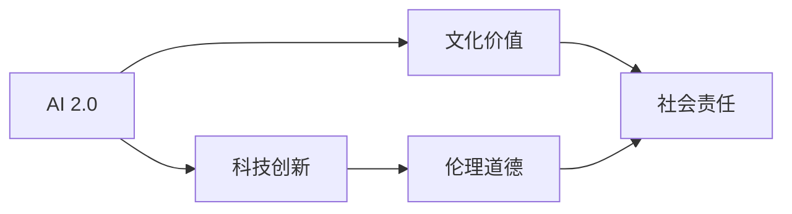

                 

# 李开复：AI 2.0 时代的文化价值

> 关键词：AI 2.0, 人工智能, 文化价值, 科技创新, 未来社会

## 1. 背景介绍

在过去的几年里，人工智能(AI)技术的发展已经深刻地改变了我们的工作和生活方式。特别是随着AI 2.0时代的到来，人工智能不仅在技术层面取得了巨大的突破，也在社会文化层面上引发了深远的讨论和反思。本文将从AI 2.0的技术背景出发，深入探讨这一时代背景下，人工智能的文化价值及其对未来社会的影响。

### 1.1 技术背景

AI 2.0指的是基于深度学习和大数据的第二代人工智能技术，它与早期基于规则的AI技术有着显著的区别。AI 2.0的突破主要来自于以下几个方面：

- **深度学习**：深度神经网络的发展使得AI能够自动从数据中学习特征，无需手工设计特征。
- **大数据**：庞大的数据集使得AI能够从中学习丰富的知识，提高模型的泛化能力。
- **计算能力**：高性能计算资源，如GPU、TPU等，极大地加速了深度学习的训练和推理过程。
- **算法优化**：如迁移学习、强化学习、自监督学习等新算法的提出，进一步提升了AI模型的性能。

AI 2.0技术的快速发展，使得人工智能应用从科学研究扩展到工业、医疗、教育等多个领域，带来了巨大的社会价值。

### 1.2 社会影响

AI 2.0不仅在技术上取得了巨大进步，也引发了广泛的伦理、社会和经济讨论。人工智能带来的变化已经触及到了人类生活的方方面面，从就业、教育、医疗到社会治理，每个领域都受到了AI的影响。如何在享受AI带来的便利的同时，避免其潜在的风险和挑战，成为了社会关注的焦点。

## 2. 核心概念与联系

### 2.1 核心概念概述

要理解AI 2.0的文化价值，首先需要明确以下几个核心概念：

- **AI 2.0**：基于深度学习和大数据的第二代人工智能技术。
- **科技创新**：推动技术进步和社会发展的关键驱动力。
- **文化价值**：技术在社会文化层面上带来的变化和影响。
- **伦理道德**：技术应用中需要遵守的道德标准和规范。
- **社会责任**：企业在技术开发和应用中应承担的责任和义务。

这些概念之间存在着密切的联系，共同构成了AI 2.0时代社会文化价值的基础。

### 2.2 核心概念原理和架构的 Mermaid 流程图



这个流程图展示了AI 2.0与科技创新、文化价值、伦理道德和社会责任之间的关系。科技创新是AI 2.0技术进步的驱动力，而文化价值则是AI 2.0技术带来的社会变化和影响。伦理道德和社会责任则是在AI 2.0技术应用中需要考虑的重要因素。

## 3. 核心算法原理 & 具体操作步骤

### 3.1 算法原理概述

AI 2.0的核心算法是深度学习和神经网络。深度学习通过多层次的神经网络结构，可以从大规模数据中学习出复杂的多层次特征表示。这些特征表示被广泛应用于图像识别、语音识别、自然语言处理等多个领域。

### 3.2 算法步骤详解

AI 2.0的训练和推理过程主要包括以下几个步骤：

1. **数据准备**：收集和清洗大量的数据集，标注数据集以用于监督学习。
2. **模型训练**：使用深度神经网络模型对数据集进行训练，学习特征表示。
3. **模型推理**：将新的数据输入到训练好的模型中，得到预测结果。
4. **模型评估**：通过评估指标（如准确率、召回率、F1分数等）对模型进行评估和优化。

### 3.3 算法优缺点

AI 2.0的优点在于其强大的学习能力，可以处理复杂的非线性关系，适用于多种任务。但其缺点也同样明显：

- **计算资源需求高**：深度学习模型需要大量的计算资源进行训练和推理。
- **数据需求量大**：需要大量的标注数据进行训练，数据获取成本较高。
- **解释性差**：深度学习模型往往是“黑箱”，难以解释其决策过程。
- **公平性问题**：由于训练数据的不均衡，AI模型可能会出现偏见。

### 3.4 算法应用领域

AI 2.0技术已经在多个领域得到广泛应用，包括但不限于：

- **医疗健康**：AI辅助诊断、药物研发、个性化治疗等。
- **金融科技**：智能投顾、欺诈检测、风险评估等。
- **自动驾驶**：自动驾驶车辆、智能交通管理等。
- **智能制造**：质量检测、设备维护、供应链优化等。
- **教育科技**：智能辅导、课程推荐、学习分析等。

## 4. 数学模型和公式 & 详细讲解 & 举例说明

### 4.1 数学模型构建

AI 2.0的数学模型主要基于深度神经网络。以卷积神经网络(CNN)为例，其基本结构包括卷积层、池化层、全连接层等。卷积层通过卷积操作提取局部特征，池化层通过降采样减少特征维度，全连接层进行分类或回归任务。

### 4.2 公式推导过程

以图像分类任务为例，卷积神经网络的基本公式可以表示为：

$$
y = \mathcal{F}(x; \theta)
$$

其中 $x$ 表示输入的图像，$y$ 表示分类结果，$\mathcal{F}$ 表示神经网络模型，$\theta$ 表示模型参数。神经网络模型通常包含多个卷积层、池化层和全连接层，公式可以进一步展开为：

$$
y = \sigma(\mathcal{G}(\mathcal{H}(\mathcal{F}_1(\mathcal{F}_0(x)))))
$$

其中 $\mathcal{F}_0$ 表示输入层，$\mathcal{F}_1$ 表示卷积层，$\mathcal{H}$ 表示池化层，$\mathcal{G}$ 表示全连接层，$\sigma$ 表示激活函数。

### 4.3 案例分析与讲解

以图像识别任务为例，可以使用AlexNet模型进行训练和推理。首先，通过卷积层提取图像特征，通过池化层降采样，最后通过全连接层进行分类。训练过程中，使用交叉熵损失函数进行优化，优化器通常使用Adam或SGD。推理时，将测试集输入模型，得到分类结果。

## 5. 项目实践：代码实例和详细解释说明

### 5.1 开发环境搭建

要进行AI 2.0项目开发，需要以下开发环境：

- **Python**：安装Python 3.6及以上版本。
- **PyTorch**：使用PyTorch进行深度学习模型的实现。
- **CUDA**：如果硬件支持，安装CUDA并配置环境变量。
- **TensorBoard**：用于可视化模型训练过程。
- **Jupyter Notebook**：用于交互式编程和模型训练。

### 5.2 源代码详细实现

以下是一个简单的卷积神经网络模型实现示例：

```python
import torch
import torch.nn as nn
import torch.optim as optim

class ConvNet(nn.Module):
    def __init__(self):
        super(ConvNet, self).__init__()
        self.conv1 = nn.Conv2d(3, 32, kernel_size=3, stride=1, padding=1)
        self.pool = nn.MaxPool2d(kernel_size=2, stride=2)
        self.conv2 = nn.Conv2d(32, 64, kernel_size=3, stride=1, padding=1)
        self.fc1 = nn.Linear(64*8*8, 512)
        self.fc2 = nn.Linear(512, 10)
    
    def forward(self, x):
        x = torch.relu(self.conv1(x))
        x = self.pool(x)
        x = torch.relu(self.conv2(x))
        x = self.pool(x)
        x = x.view(x.size(0), -1)
        x = torch.relu(self.fc1(x))
        x = self.fc2(x)
        return x

model = ConvNet()
criterion = nn.CrossEntropyLoss()
optimizer = optim.Adam(model.parameters(), lr=0.001)

# 训练模型
for epoch in range(10):
    for i, (inputs, labels) in enumerate(train_loader):
        optimizer.zero_grad()
        outputs = model(inputs)
        loss = criterion(outputs, labels)
        loss.backward()
        optimizer.step()
```

### 5.3 代码解读与分析

这段代码实现了一个简单的卷积神经网络，包含两个卷积层、两个池化层和两个全连接层。训练过程中，使用Adam优化器和交叉熵损失函数进行优化。训练完成后，模型可以进行推理预测。

## 6. 实际应用场景

### 6.1 医疗健康

AI 2.0在医疗健康领域的应用非常广泛，包括疾病诊断、影像分析、个性化治疗等。例如，AI可以通过分析医学影像，帮助医生发现早期癌症病变，提高诊断准确率。AI还可以分析基因数据，制定个性化的治疗方案，提升治疗效果。

### 6.2 金融科技

AI 2.0在金融科技领域的应用同样广泛，包括风险评估、欺诈检测、智能投顾等。例如，AI可以通过分析历史交易数据，预测股票市场走势，提供投资建议。AI还可以检测交易异常行为，防范欺诈风险，提升金融安全。

### 6.3 自动驾驶

AI 2.0在自动驾驶领域的应用正在逐渐成熟。例如，AI可以通过摄像头和传感器数据，识别交通信号、行人、车辆等，进行路径规划和决策。AI还可以与云端系统协同工作，实现实时路况更新和导航优化。

### 6.4 未来应用展望

未来，AI 2.0技术将在更多领域得到应用，为社会带来更大的变革。例如，在智慧城市、智能制造、教育科技等领域，AI 2.0将推动智能化进程，提升社会效率和生活质量。AI 2.0还将与其他技术结合，如物联网、区块链、量子计算等，形成新的技术生态。

## 7. 工具和资源推荐

### 7.1 学习资源推荐

为了深入了解AI 2.0技术，以下资源值得推荐：

- **《深度学习》课程**：斯坦福大学提供的深度学习课程，涵盖深度学习基础、神经网络、卷积神经网络等内容。
- **《TensorFlow官方文档》**：TensorFlow官方文档，提供了丰富的模型实现和代码示例。
- **Kaggle**：数据科学竞赛平台，提供了大量开源数据集和算法实现，适合学习和实践。
- **Github**：代码托管平台，提供了大量开源项目和代码库，适合学习和参考。

### 7.2 开发工具推荐

以下是一些常用的AI 2.0开发工具：

- **Jupyter Notebook**：交互式编程环境，适合代码实现和模型训练。
- **TensorBoard**：可视化工具，适合监控模型训练过程。
- **PyTorch**：深度学习框架，适合快速原型设计和模型训练。
- **CUDA**：高性能计算库，适合GPU加速计算。
- **Anaconda**：Python环境管理工具，适合创建和管理Python虚拟环境。

### 7.3 相关论文推荐

以下是几篇重要的AI 2.0相关论文，值得阅读：

- **《ImageNet Classification with Deep Convolutional Neural Networks》**：AlexNet论文，提出了卷积神经网络模型，标志着深度学习在图像识别领域的突破。
- **《Convolutional Neural Networks for Deep Learning: A Review》**：回顾了卷积神经网络的发展历史和应用场景。
- **《Natural Language Processing (almost) for Free with Transformer》**：Transformer论文，提出了基于自注意力机制的神经网络模型，适用于自然语言处理任务。
- **《Deep Reinforcement Learning for Healthcare》**：讨论了深度强化学习在医疗健康领域的应用。
- **《Adversarial Machine Learning》**：探讨了深度学习中的对抗攻击问题，提出了防御方法。

## 8. 总结：未来发展趋势与挑战

### 8.1 研究成果总结

AI 2.0技术的发展已经取得了显著的进展，但同时也面临着诸多挑战。未来，AI 2.0技术将继续向着更高效、更智能、更可靠的方向发展，进一步推动科技创新和社会进步。

### 8.2 未来发展趋势

未来，AI 2.0技术将呈现以下几个发展趋势：

- **多模态融合**：AI 2.0将与其他模态的数据（如视觉、语音、文本等）结合，形成多模态融合的智能系统。
- **联邦学习**：分布式数据和计算资源使得联邦学习成为可能，减少了数据隐私和计算成本。
- **边缘计算**：边缘计算将计算资源下放到终端设备，提高了AI应用的实时性和可靠性。
- **量子计算**：量子计算为AI 2.0提供了更高效的数据处理能力，将推动AI 2.0技术的新突破。
- **跨学科融合**：AI 2.0与其他学科（如心理学、社会学、伦理学等）结合，形成跨学科的智能系统。

### 8.3 面临的挑战

AI 2.0技术的发展也面临着诸多挑战：

- **数据隐私和安全**：如何在保证数据隐私的前提下，进行高效的AI模型训练和推理。
- **公平性和偏见**：AI模型可能会学习到训练数据中的偏见，导致不公平的决策。
- **伦理和道德**：AI应用中需要考虑伦理和道德问题，避免有害行为。
- **计算资源限制**：深度学习模型需要大量的计算资源，如何降低计算成本，是未来的一个重要研究方向。
- **跨领域应用**：AI 2.0需要在不同领域中应用，需要考虑各领域的特点和需求。

### 8.4 研究展望

未来，AI 2.0技术需要进一步探索和研究：

- **联邦学习**：如何在分布式数据和计算资源下进行高效的AI模型训练和推理。
- **跨模态融合**：将不同模态的数据和计算资源结合，形成多模态的智能系统。
- **伦理和道德**：如何在AI应用中考虑伦理和道德问题，确保公平和透明。
- **跨领域应用**：AI 2.0需要在不同领域中应用，需要考虑各领域的特点和需求。
- **量子计算**：量子计算为AI 2.0提供了更高效的数据处理能力，将推动AI 2.0技术的新突破。

## 9. 附录：常见问题与解答

### Q1: AI 2.0的定义是什么？

A: AI 2.0指的是基于深度学习和大数据的第二代人工智能技术。AI 2.0能够自动从数据中学习特征，处理复杂的非线性关系，适用于多种任务。

### Q2: AI 2.0的应用领域有哪些？

A: AI 2.0技术已经在医疗健康、金融科技、自动驾驶、智慧城市、教育科技等多个领域得到广泛应用。

### Q3: AI 2.0的优点和缺点是什么？

A: AI 2.0的优点在于其强大的学习能力，可以处理复杂的非线性关系，适用于多种任务。但其缺点也同样明显：需要大量的计算资源进行训练和推理，数据需求量大，模型解释性差，存在公平性问题。

### Q4: AI 2.0对未来社会的影响是什么？

A: AI 2.0技术将带来巨大的社会价值，推动科技创新和社会进步。但在享受AI带来的便利的同时，也需要关注数据隐私、公平性、伦理和道德等问题。

### Q5: AI 2.0的发展趋势是什么？

A: AI 2.0技术将向着更高效、更智能、更可靠的方向发展。未来，AI 2.0将与其他技术结合，如量子计算、边缘计算、联邦学习等，形成新的技术生态。

---

作者：禅与计算机程序设计艺术 / Zen and the Art of Computer Programming

