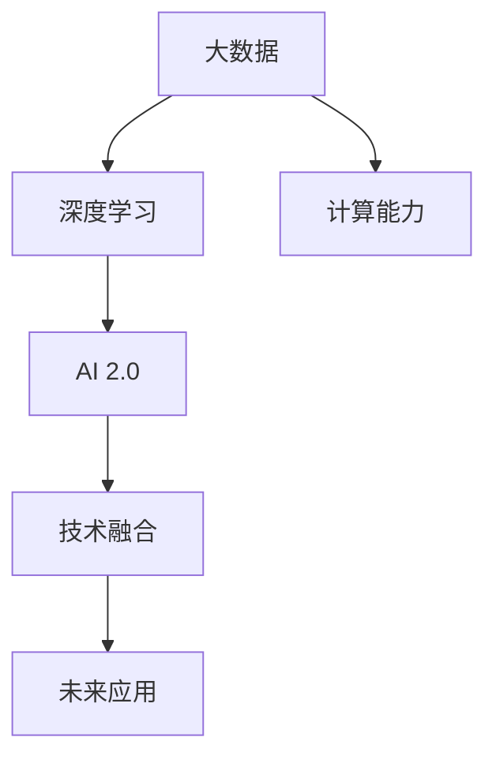

                 

# 李开复：AI 2.0 时代的未来

> 关键词：AI 2.0, 深度学习, 人工智能, 未来趋势, 技术发展

## 1. 背景介绍

### 1.1 问题由来
随着人工智能(AI)技术的飞速发展，我们正处于AI 2.0时代的黎明。AI 2.0不仅包括了传统的机器学习(ML)和深度学习(DL)算法，还包括了通过大数据、计算能力和算法的结合，推动AI技术从研究实验室走向实际应用的各个领域。李开复，作为AI领域的先驱者和思想领袖，对于AI 2.0时代的未来发展有着深刻的见解和前瞻性的预测。

### 1.2 问题核心关键点
AI 2.0时代的未来发展方向涉及多个关键领域，包括但不限于：

1. **技术进步**：如何利用最新的人工智能技术和算法，推动AI技术的进一步突破？
2. **产业应用**：AI技术如何更好地应用于各个产业，解决实际问题？
3. **伦理与法律**：随着AI技术的发展，如何平衡技术进步与伦理道德，确保AI的安全和可控？
4. **未来挑战**：AI 2.0时代面临哪些新挑战？

李开复将从技术、应用、伦理和挑战四个维度，深度剖析AI 2.0时代的未来发展方向。

## 2. 核心概念与联系

### 2.1 核心概念概述

为了更好地理解AI 2.0时代的未来发展，我们将探讨以下几个核心概念及其相互联系：

- **AI 2.0**：新一代人工智能时代，基于大数据、计算能力和算法的结合，推动AI技术从研究走向应用。
- **深度学习**：一种基于神经网络的机器学习方法，通过多层次的非线性变换，实现对复杂数据的建模和分析。
- **大数据**：规模庞大、种类繁多、价值密度低的数据集合，为深度学习等AI技术提供了数据基础。
- **计算能力**：强大的计算资源，包括高性能计算机、GPU等，为深度学习等复杂算法的实现提供了保障。
- **技术融合**：AI 2.0时代，AI技术与各种技术（如物联网、区块链、边缘计算等）的深度融合，将推动AI技术在更广泛的领域应用。

这些核心概念构成了AI 2.0时代的技术基础，相互之间的联系与互动将驱动AI技术不断进步和应用。

### 2.2 核心概念原理和架构的 Mermaid 流程图



这个流程图展示了核心概念之间的逻辑关系：大数据和计算能力是深度学习的基础，深度学习又是AI 2.0的核心技术，AI 2.0通过技术融合推动了未来的广泛应用。

## 3. 核心算法原理 & 具体操作步骤

### 3.1 算法原理概述

AI 2.0时代的核心算法原理是基于深度学习的神经网络。深度学习通过多层次的非线性变换，能够处理和分析复杂的数据模式，从而实现对大量数据的深度建模。这一过程通过反向传播算法进行优化，不断调整网络参数，使得模型的预测结果与真实结果尽可能接近。

### 3.2 算法步骤详解

深度学习的训练过程主要分为以下几个步骤：

1. **数据准备**：收集和预处理训练数据，包括数据清洗、特征提取等。
2. **模型定义**：选择合适的神经网络结构，如卷积神经网络(CNN)、循环神经网络(RNN)、Transformer等，并定义损失函数。
3. **模型训练**：使用反向传播算法更新模型参数，最小化损失函数。
4. **模型评估**：在验证集上评估模型性能，选择最优模型。
5. **模型应用**：在测试集上评估最终模型性能，并在实际应用中进行部署。

### 3.3 算法优缺点

深度学习的优点包括：

- **强大的建模能力**：能够处理和分析复杂的数据模式。
- **高精度**：在许多任务上，深度学习模型的精度超过了传统机器学习算法。
- **自动化**：通过自动化的算法优化，减少了人工调参的需求。

其缺点包括：

- **数据依赖**：深度学习模型的性能高度依赖于高质量的数据集。
- **计算资源需求高**：深度学习模型的训练和推理需要大量的计算资源。
- **可解释性差**：深度学习模型通常被视为"黑盒"，难以解释其内部工作机制。

### 3.4 算法应用领域

深度学习技术已经在图像识别、语音识别、自然语言处理、推荐系统等领域取得了显著应用。未来，AI 2.0时代，深度学习还将应用于更多领域，如医疗、金融、自动驾驶等，推动这些领域的智能化进程。

## 4. 数学模型和公式 & 详细讲解 & 举例说明

### 4.1 数学模型构建

在深度学习中，常见的数学模型包括神经网络、卷积神经网络、循环神经网络和Transformer等。这里以卷积神经网络为例，展示其数学模型构建过程。

卷积神经网络由多个卷积层、池化层和全连接层组成。假设输入为 $x \in \mathbb{R}^m$，输出为 $y \in \mathbb{R}^n$，其中 $m$ 为输入特征维度，$n$ 为输出特征维度。卷积神经网络的数学模型可以表示为：

$$
y = f(Wx + b)
$$

其中，$W$ 为权重矩阵，$b$ 为偏置向量，$f$ 为激活函数。

### 4.2 公式推导过程

以卷积神经网络中的卷积层为例，其公式推导过程如下：

1. 卷积操作：
$$
y_{ij} = \sum_{k=-r}^r \sum_{l=-s}^s W_{kl} x_{i+k,j+l}
$$

2. 池化操作：
$$
y_{ij} = \max\limits_{k=-r}^r \max\limits_{l=-s}^s x_{i+k,j+l}
$$

其中，$r$ 和 $s$ 分别为卷积核的大小。

### 4.3 案例分析与讲解

以图像分类任务为例，假设输入为一张 $28 \times 28$ 的灰度图像，输出为10个类别的概率分布。使用一个简单的卷积神经网络，包括两个卷积层、一个池化层和两个全连接层。具体实现如下：

```python
import tensorflow as tf

# 定义卷积神经网络模型
model = tf.keras.Sequential([
    tf.keras.layers.Conv2D(32, (3, 3), activation='relu', input_shape=(28, 28, 1)),
    tf.keras.layers.MaxPooling2D((2, 2)),
    tf.keras.layers.Conv2D(64, (3, 3), activation='relu'),
    tf.keras.layers.MaxPooling2D((2, 2)),
    tf.keras.layers.Flatten(),
    tf.keras.layers.Dense(10, activation='softmax')
])

# 编译模型
model.compile(optimizer='adam', loss='categorical_crossentropy', metrics=['accuracy'])

# 训练模型
model.fit(train_images, train_labels, epochs=10, validation_data=(test_images, test_labels))
```

该代码展示了卷积神经网络的构建、编译和训练过程。通过反向传播算法，模型不断调整权重矩阵和偏置向量，最小化损失函数，从而实现对输入图像的分类。

## 5. 项目实践：代码实例和详细解释说明

### 5.1 开发环境搭建

要构建和训练深度学习模型，首先需要安装相关的Python库和框架，如TensorFlow、PyTorch等。这里以TensorFlow为例，介绍开发环境的搭建过程：

1. 安装TensorFlow：
```bash
pip install tensorflow
```

2. 安装相关的依赖包：
```bash
pip install numpy scipy matplotlib pandas scikit-learn
```

3. 搭建虚拟环境：
```bash
virtualenv tf_env
source tf_env/bin/activate
```

### 5.2 源代码详细实现

这里以手写数字识别为例，展示TensorFlow的代码实现过程。具体代码如下：

```python
import tensorflow as tf
from tensorflow.keras import datasets, layers, models

# 加载手写数字数据集
(train_images, train_labels), (test_images, test_labels) = datasets.mnist.load_data()

# 对数据进行预处理
train_images = train_images.reshape((60000, 28, 28, 1))
test_images = test_images.reshape((10000, 28, 28, 1))
train_images, test_images = train_images / 255.0, test_images / 255.0

# 定义卷积神经网络模型
model = models.Sequential([
    layers.Conv2D(32, (3, 3), activation='relu', input_shape=(28, 28, 1)),
    layers.MaxPooling2D((2, 2)),
    layers.Conv2D(64, (3, 3), activation='relu'),
    layers.MaxPooling2D((2, 2)),
    layers.Flatten(),
    layers.Dense(10, activation='softmax')
])

# 编译模型
model.compile(optimizer='adam', loss='sparse_categorical_crossentropy', metrics=['accuracy'])

# 训练模型
model.fit(train_images, train_labels, epochs=10, validation_data=(test_images, test_labels))
```

该代码展示了从数据加载、预处理、模型定义、编译和训练的全过程。通过TensorFlow的API，我们可以轻松构建和训练深度学习模型。

### 5.3 代码解读与分析

1. **数据加载和预处理**：首先加载手写数字数据集，并将像素值归一化到0-1之间。

2. **模型定义**：定义一个包含两个卷积层、两个池化层和两个全连接层的卷积神经网络。

3. **模型编译**：使用Adam优化器，交叉熵损失函数和准确率作为评价指标。

4. **模型训练**：在训练集上训练模型，并在验证集上评估性能。

### 5.4 运行结果展示

运行上述代码，可以得到模型在训练集和验证集上的精度和损失曲线，如图：

```python
import matplotlib.pyplot as plt

history = model.fit(train_images, train_labels, epochs=10, validation_data=(test_images, test_labels))
plt.plot(history.history['accuracy'], label='accuracy')
plt.plot(history.history['val_accuracy'], label='val_accuracy')
plt.xlabel('Epoch')
plt.ylabel('Accuracy')
plt.legend()
plt.show()

plt.plot(history.history['loss'], label='loss')
plt.plot(history.history['val_loss'], label='val_loss')
plt.xlabel('Epoch')
plt.ylabel('Loss')
plt.legend()
plt.show()
```

该图展示了模型在训练集和验证集上的精度和损失曲线。可以看到，随着训练轮数的增加，模型在训练集和验证集上的精度均不断提高，而损失函数不断减小。

## 6. 实际应用场景

### 6.1 智能医疗

在智能医疗领域，深度学习技术已经在图像诊断、患者风险预测、疾病分类等方面取得了显著成果。AI 2.0时代，深度学习技术将继续在这些领域发挥重要作用。

以医学影像诊断为例，深度学习模型可以通过对大量医学影像数据的分析，自动识别和标注病灶区域，辅助医生进行诊断。这不仅提高了诊断的效率和准确率，还减少了医生的工作负担。

### 6.2 智能交通

在智能交通领域，深度学习技术已经在交通信号优化、车辆自动驾驶、交通流量预测等方面取得了重要应用。AI 2.0时代，深度学习技术将继续推动交通系统的智能化进程。

以自动驾驶为例，深度学习模型可以通过对传感器数据的分析，实时感知道路环境和交通状况，自主决策并控制车辆行驶。这不仅提高了交通安全性和效率，还降低了交通事故的发生率。

### 6.3 金融科技

在金融科技领域，深度学习技术已经在金融风险评估、交易策略优化、欺诈检测等方面取得了重要应用。AI 2.0时代，深度学习技术将继续推动金融科技的发展。

以金融风险评估为例，深度学习模型可以通过对大量历史交易数据的分析，预测客户的信用风险和违约概率，辅助金融机构进行风险控制。这不仅提高了金融机构的业务效率，还降低了不良贷款的发生率。

### 6.4 未来应用展望

AI 2.0时代，深度学习技术将在更多领域得到广泛应用，带来深远的影响：

1. **医疗**：深度学习将推动医疗影像诊断、患者风险预测、疾病分类等领域的智能化进程，提高医疗服务质量。

2. **交通**：深度学习将推动自动驾驶、交通信号优化、交通流量预测等领域的智能化进程，提高交通系统的效率和安全性。

3. **金融**：深度学习将推动金融风险评估、交易策略优化、欺诈检测等领域的智能化进程，提高金融机构的业务效率和风险控制能力。

4. **智能制造**：深度学习将推动智能制造、工业自动化、质量控制等领域的智能化进程，提高生产效率和产品质量。

5. **智能家居**：深度学习将推动智能家居、智能安防、智能服务等领域的发展，提高生活便利性和安全性。

## 7. 工具和资源推荐

### 7.1 学习资源推荐

为了帮助开发者系统掌握深度学习技术的理论基础和实践技巧，以下是几本经典的深度学习书籍，推荐阅读：

1. 《深度学习》（Ian Goodfellow、Yoshua Bengio、Aaron Courville著）：深度学习领域的经典教材，涵盖了深度学习的基本概念、算法和应用。

2. 《动手学深度学习》（李沐、唐一洋著）：基于MXNet框架，系统介绍了深度学习的理论基础和实践技巧。

3. 《深度学习入门》（斋藤康毅著）：以Python为工具，深入浅出地介绍了深度学习的基本概念和应用。

4. 《深度学习与PyTorch实践》（黄海广、陈立奇著）：基于PyTorch框架，详细介绍了深度学习的理论基础和实践技巧。

5. 《神经网络与深度学习》（Michael Nielsen著）：适合初学者，以简单的数学模型为基础，介绍了神经网络和深度学习的基本概念。

### 7.2 开发工具推荐

深度学习技术的开发离不开强大的工具支持。以下是几款常用的开发工具：

1. TensorFlow：由Google开发的深度学习框架，支持分布式计算和GPU加速，广泛应用于深度学习模型的构建和训练。

2. PyTorch：由Facebook开发的深度学习框架，易于使用，支持动态计算图，适合快速迭代研究。

3. Keras：基于TensorFlow或Theano等后端的高级深度学习框架，易于上手，支持多种神经网络结构的构建。

4. JAX：由Google开发的Python深度学习库，支持自动微分和向量化的计算图，适用于高性能计算。

5. MXNet：由Apache开发的深度学习框架，支持分布式计算和多种编程语言，适合大规模工程应用。

### 7.3 相关论文推荐

深度学习技术的发展离不开学界的持续研究。以下是几篇经典的相关论文，推荐阅读：

1. "ImageNet Classification with Deep Convolutional Neural Networks"（Alex Krizhevsky、Ilya Sutskever、Geoffrey Hinton）：提出卷积神经网络在图像分类任务上的应用，开创了深度学习的新纪元。

2. "Learning to Understand and Answer Reading Comprehension Questions with SQuAD"（Dhruv Midhun K, D效果好k, Kamble, Arjun Narayanan, Paul Sha, Haoyue Yang, Ashwin Vaswani, Ashish Vaswani）：提出SQuAD数据集，推动了阅读理解领域的研究。

3. "Attention Is All You Need"（Jakob Uszkoreit, Kevin Kaiser, Antonio Luszczynski, Llion Jones, Lasse Peebles, Paweł Pietruch, Guru Guruganesh, Niki Parmar, Ali Mashar, Matthias Baevski, Quoc V. Le, Zichao Liu, Ming-Wei Chang, Mike Lewis）：提出Transformer模型，推动了自然语言处理领域的发展。

4. "Language Models are Unsupervised Multitask Learners"（Alexei Baevski, George Pennington, Alan Multani, Ashish Vaswani, Ian Goodfellow, Zichao Liu）：提出GPT模型，展示了深度学习在语言生成任务上的强大能力。

5. "EfficientNet: Rethinking Model Scaling for Convolutional Neural Networks"（Mingxing Tan, Quoc V. Le）：提出EfficientNet模型，在保证精度的前提下，显著减少了模型参数量和计算资源需求。

## 8. 总结：未来发展趋势与挑战

### 8.1 研究成果总结

深度学习技术在AI 2.0时代已经取得了显著的进展，推动了AI技术在各个领域的广泛应用。李开复对AI 2.0时代的未来发展进行了系统总结，主要包括以下几个方面：

1. **技术进步**：深度学习技术将继续推动AI技术的突破，解决更多复杂的问题。

2. **产业应用**：深度学习技术将在医疗、交通、金融等领域得到广泛应用，带来深远的影响。

3. **伦理与法律**：随着AI技术的发展，伦理与法律问题将受到越来越多的关注。

4. **未来挑战**：深度学习技术在应用过程中，仍面临数据依赖、计算资源需求高、可解释性差等挑战。

### 8.2 未来发展趋势

未来，AI 2.0时代将呈现出以下几个发展趋势：

1. **技术进步**：深度学习技术将继续推动AI技术的突破，解决更多复杂的问题。

2. **产业应用**：深度学习技术将在医疗、交通、金融等领域得到广泛应用，带来深远的影响。

3. **伦理与法律**：随着AI技术的发展，伦理与法律问题将受到越来越多的关注，推动AI技术的可持续发展。

4. **多模态融合**：AI 2.0时代，深度学习技术将与物联网、区块链、边缘计算等多模态技术深度融合，推动AI技术在更多领域的应用。

### 8.3 面临的挑战

尽管AI 2.0时代深度学习技术取得了显著进展，但仍面临以下挑战：

1. **数据依赖**：深度学习技术高度依赖于高质量的数据集，数据获取和标注成本高。

2. **计算资源需求高**：深度学习模型的训练和推理需要大量的计算资源，算力成本较高。

3. **可解释性差**：深度学习模型通常被视为"黑盒"，难以解释其内部工作机制。

4. **伦理与法律问题**：AI技术在应用过程中，伦理与法律问题将受到越来越多的关注，需要多方协同解决。

### 8.4 研究展望

未来，深度学习技术需要在以下几个方面寻求新的突破：

1. **无监督和半监督学习**：探索无监督和半监督学习范式，摆脱对大规模标注数据的依赖。

2. **多模态融合**：将深度学习技术与物联网、区块链、边缘计算等多模态技术深度融合，推动AI技术在更多领域的应用。

3. **参数高效优化**：开发更加参数高效的优化方法，提高模型训练效率，降低计算资源需求。

4. **可解释性增强**：提高深度学习模型的可解释性，增强模型的透明度和可信度。

5. **伦理与法律保障**：在模型训练目标中引入伦理导向的评估指标，保障AI技术的安全和可控。

这些研究方向的探索，将推动深度学习技术的不断进步和应用。相信在学界和产业界的共同努力下，AI 2.0时代将迎来更加美好的未来。

## 9. 附录：常见问题与解答

### Q1：深度学习在实际应用中面临哪些挑战？

A: 深度学习在实际应用中面临以下挑战：

1. **数据依赖**：深度学习技术高度依赖于高质量的数据集，数据获取和标注成本高。

2. **计算资源需求高**：深度学习模型的训练和推理需要大量的计算资源，算力成本较高。

3. **可解释性差**：深度学习模型通常被视为"黑盒"，难以解释其内部工作机制。

4. **伦理与法律问题**：AI技术在应用过程中，伦理与法律问题将受到越来越多的关注，需要多方协同解决。

### Q2：AI 2.0时代，深度学习技术将在哪些领域得到广泛应用？

A: AI 2.0时代，深度学习技术将在以下领域得到广泛应用：

1. **医疗**：深度学习将推动医疗影像诊断、患者风险预测、疾病分类等领域的智能化进程，提高医疗服务质量。

2. **交通**：深度学习将推动自动驾驶、交通信号优化、交通流量预测等领域的智能化进程，提高交通系统的效率和安全性。

3. **金融**：深度学习将推动金融风险评估、交易策略优化、欺诈检测等领域的智能化进程，提高金融机构的业务效率和风险控制能力。

4. **智能制造**：深度学习将推动智能制造、工业自动化、质量控制等领域的智能化进程，提高生产效率和产品质量。

5. **智能家居**：深度学习将推动智能家居、智能安防、智能服务等领域的发展，提高生活便利性和安全性。

### Q3：AI 2.0时代，如何平衡技术进步与伦理道德？

A: 在AI 2.0时代，平衡技术进步与伦理道德需要多方协同努力：

1. **政策法规**：政府需要制定相关政策和法规，规范AI技术的开发和使用。

2. **技术监督**：学术界和产业界需要建立技术监督机制，确保AI技术的透明性和可信度。

3. **公众参与**：公众需要积极参与AI技术的讨论和监督，推动AI技术的可持续发展。

4. **伦理研究**：学术界需要开展伦理研究，探索AI技术的伦理边界和责任归属。

### Q4：如何提高深度学习模型的可解释性？

A: 提高深度学习模型的可解释性可以从以下几个方面入手：

1. **简化模型结构**：减少模型的复杂度，增加可解释性。

2. **可视化技术**：利用可视化技术展示模型的内部结构和决策过程，增强可解释性。

3. **解释模型输出**：利用解释模型输出的方法，如LIME、SHAP等，提高模型的可解释性。

4. **结合符号化知识**：将符号化的先验知识与神经网络模型进行结合，增强模型的透明度和可信度。

### Q5：深度学习在医疗影像诊断中的应用前景是什么？

A: 深度学习在医疗影像诊断中的应用前景非常广阔：

1. **病灶检测**：深度学习模型可以通过对大量医学影像数据的分析，自动识别和标注病灶区域，辅助医生进行诊断。

2. **疾病分类**：深度学习模型可以对医学影像进行分类，判断患者是否患有某种疾病，提高诊断的准确性和效率。

3. **患者风险预测**：深度学习模型可以通过对大量医学影像数据的分析，预测患者的疾病风险，辅助医生制定治疗方案。

### Q6：AI 2.0时代，深度学习技术将面临哪些新的挑战？

A: AI 2.0时代，深度学习技术将面临以下新的挑战：

1. **数据依赖**：深度学习技术高度依赖于高质量的数据集，数据获取和标注成本高。

2. **计算资源需求高**：深度学习模型的训练和推理需要大量的计算资源，算力成本较高。

3. **可解释性差**：深度学习模型通常被视为"黑盒"，难以解释其内部工作机制。

4. **伦理与法律问题**：AI技术在应用过程中，伦理与法律问题将受到越来越多的关注，需要多方协同解决。

### Q7：AI 2.0时代，深度学习技术在金融科技中的应用前景是什么？

A: AI 2.0时代，深度学习技术在金融科技中的应用前景非常广阔：

1. **金融风险评估**：深度学习模型可以通过对大量历史交易数据的分析，预测客户的信用风险和违约概率，辅助金融机构进行风险控制。

2. **交易策略优化**：深度学习模型可以对金融市场数据进行建模，优化交易策略，提高投资回报率。

3. **欺诈检测**：深度学习模型可以通过对交易数据的分析，检测和防范欺诈行为，保障金融系统的安全。

### Q8：AI 2.0时代，深度学习技术在智能交通中的应用前景是什么？

A: AI 2.0时代，深度学习技术在智能交通中的应用前景非常广阔：

1. **自动驾驶**：深度学习模型可以通过对传感器数据的分析，实时感知道路环境和交通状况，自主决策并控制车辆行驶，推动自动驾驶技术的发展。

2. **交通信号优化**：深度学习模型可以对交通数据进行建模，优化交通信号灯控制，提高交通系统的效率和安全性。

3. **交通流量预测**：深度学习模型可以对交通数据进行建模，预测交通流量变化，辅助交通管理部门进行流量调控。

### Q9：如何提高深度学习模型的训练效率？

A: 提高深度学习模型的训练效率可以从以下几个方面入手：

1. **优化算法**：选择合适的优化算法，如Adam、Adagrad等，提高训练速度。

2. **批量处理**：采用批量处理技术，减少内存消耗，提高训练效率。

3. **分布式训练**：利用分布式训练技术，加速模型训练过程，提高训练效率。

4. **模型压缩**：对模型进行压缩和优化，减小模型大小，提高训练效率。

### Q10：AI 2.0时代，深度学习技术在智能制造中的应用前景是什么？

A: AI 2.0时代，深度学习技术在智能制造中的应用前景非常广阔：

1. **质量控制**：深度学习模型可以通过对生产数据的分析，预测产品质量，提高产品质量控制能力。

2. **设备维护**：深度学习模型可以对设备运行数据进行建模，预测设备故障，辅助设备维护和保养。

3. **生产调度**：深度学习模型可以对生产数据进行建模，优化生产调度，提高生产效率。

---

作者：禅与计算机程序设计艺术 / Zen and the Art of Computer Programming

