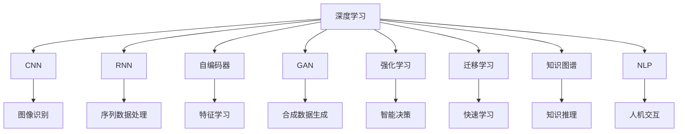

                 

# 李开复：AI 2.0 时代的未来展望

> 关键词：人工智能, AI 2.0, 机器学习, 深度学习, 数据科学, 未来展望, 技术发展

## 1. 背景介绍

在人工智能（AI）领域，从1950s的首次讨论到现在，我们已经经历了数十年的技术革新和应用拓展。AI 1.0时代主要集中在传统机器学习（ML）的算法与模型开发上，如线性回归、逻辑回归、决策树等。然而，随着数据的爆炸性增长和计算能力的不断提升，AI 2.0时代逐渐拉开序幕。

AI 2.0时代，也称为深度学习时代，主要通过深度神经网络（DNNs）、深度强化学习（DRL）等技术，进行更加复杂、高效的数据处理与智能决策。AI 2.0在医学影像分析、语音识别、自然语言处理（NLP）、智能推荐系统等领域都展现了惊人的潜力，并开始向工业界、企业界甚至家庭场景渗透。

## 2. 核心概念与联系

### 2.1 核心概念概述

在AI 2.0时代，核心概念包括：

- **深度学习（Deep Learning）**：一种基于多层神经网络的机器学习方法，通过多层次的特征提取与转化，实现对复杂非线性问题的建模与预测。
- **卷积神经网络（CNN）**：主要用于图像识别、视频分析等任务，通过卷积操作提取局部特征。
- **循环神经网络（RNN）**：主要用于序列数据处理，如自然语言处理、时间序列预测等。
- **自编码器（Autoencoder）**：用于降维、去噪、特征学习等，通过重构原始数据，提取数据本质特征。
- **生成对抗网络（GAN）**：一种生成模型，能够生成高质量的合成数据。
- **强化学习（Reinforcement Learning, RL）**：通过奖励机制与环境交互，实现智能决策与策略优化。
- **迁移学习（Transfer Learning）**：利用预训练模型的知识，进行新任务的快速学习。
- **知识图谱（Knowledge Graph）**：以结构化形式组织语义信息，实现知识推理与智能搜索。
- **自然语言处理（NLP）**：使计算机能够理解、生成、处理自然语言，实现人机交互。

这些概念之间存在紧密联系，共同构成了AI 2.0时代的技术体系。

### 2.2 核心概念原理和架构的 Mermaid 流程图



通过这个简单的流程图，可以看出深度学习与其他核心概念的紧密联系与相互促进作用。

## 3. 核心算法原理 & 具体操作步骤

### 3.1 算法原理概述

AI 2.0时代，深度学习成为主导，其核心原理是通过大量数据训练神经网络模型，实现对复杂数据集的自动特征提取与学习。深度学习算法通常包括以下几个步骤：

1. **数据准备**：收集、清洗和标注数据，以供模型训练。
2. **模型构建**：设计并搭建神经网络模型，包括卷积层、池化层、全连接层等。
3. **参数优化**：使用梯度下降等优化算法，最小化损失函数，更新模型参数。
4. **模型评估**：通过验证集和测试集评估模型性能，调整超参数以提升模型效果。
5. **模型部署**：将训练好的模型部署到实际应用中，实现业务场景中的智能决策。

### 3.2 算法步骤详解

#### 3.2.1 数据准备

数据准备是深度学习模型的基础。在这一阶段，我们需要：

1. **数据收集**：获取与任务相关的数据集，可以是图像、文本、时间序列等。
2. **数据清洗**：去除噪声、缺失值，确保数据质量。
3. **数据标注**：为数据集添加标签，标注训练所需的监督信息。

#### 3.2.2 模型构建

模型构建包括：

1. **网络结构设计**：选择合适的层数、每层的神经元数量、激活函数等。
2. **损失函数选择**：确定模型预测与真实标签之间的差异度量。
3. **优化器选择**：选择合适的优化算法，如Adam、SGD等。

#### 3.2.3 参数优化

参数优化阶段，主要使用梯度下降算法更新模型参数，最小化损失函数。具体流程如下：

1. **前向传播**：将输入数据送入模型，计算损失函数。
2. **反向传播**：计算损失函数对各参数的梯度，更新模型参数。
3. **参数更新**：根据梯度下降算法，更新模型参数，迭代训练。

#### 3.2.4 模型评估

模型评估主要通过：

1. **验证集评估**：在验证集上评估模型性能，调整超参数。
2. **测试集评估**：在未见过的数据上评估模型泛化能力。

#### 3.2.5 模型部署

模型部署步骤包括：

1. **模型保存**：将训练好的模型保存到本地或云存储。
2. **服务化封装**：将模型封装为API服务，方便调用。
3. **监控与优化**：实时监控模型性能，进行参数微调。

### 3.3 算法优缺点

深度学习在AI 2.0时代占据了主导地位，其优缺点如下：

#### 优点：

1. **高效特征提取**：深度神经网络能够自动学习复杂非线性特征，减少特征工程的工作量。
2. **泛化能力**：在适当的数据集上，深度学习模型具备良好的泛化能力。
3. **应用广泛**：可以应用于图像、语音、文本等多个领域，展现出强大的通用性。

#### 缺点：

1. **计算资源需求高**：深度学习模型通常参数量巨大，计算需求较高，需要高性能GPU、TPU等设备。
2. **训练时间长**：深度学习模型训练过程较长，需要较长的训练时间。
3. **过拟合风险**：模型复杂，容易出现过拟合现象。

### 3.4 算法应用领域

深度学习在AI 2.0时代被广泛应用于多个领域，例如：

- **计算机视觉**：如图像分类、目标检测、图像生成等。
- **自然语言处理**：如机器翻译、文本生成、情感分析等。
- **语音识别**：如自动语音识别、语音合成等。
- **智能推荐**：如电商推荐、内容推荐等。
- **医疗健康**：如医学影像分析、个性化医疗等。
- **自动驾驶**：如环境感知、路径规划等。

## 4. 数学模型和公式 & 详细讲解 & 举例说明

### 4.1 数学模型构建

在AI 2.0时代，深度学习模型的构建通常基于以下数学模型：

- **前向传播**：
$$
y = f(x; \theta)
$$

其中，$x$为输入数据，$\theta$为模型参数，$f(\cdot)$为激活函数。

- **损失函数**：
$$
L(y, \hat{y}) = \frac{1}{N}\sum_{i=1}^N l(y_i, \hat{y}_i)
$$

其中，$N$为样本数，$l(\cdot)$为损失函数，$y_i$为真实标签，$\hat{y}_i$为模型预测值。

- **优化器**：
$$
\theta_{t+1} = \theta_t - \eta\nabla_{\theta}L(\theta_t)
$$

其中，$\eta$为学习率，$\nabla_{\theta}L(\theta_t)$为损失函数对模型参数的梯度。

### 4.2 公式推导过程

以二分类任务为例，推导线性回归的损失函数及梯度计算公式：

- **损失函数**：
$$
L(y, \hat{y}) = -\frac{1}{N}\sum_{i=1}^N [y_i\log \hat{y}_i + (1-y_i)\log (1-\hat{y}_i)]
$$

其中，$\hat{y}_i = f(x_i; \theta)$为模型预测的概率值。

- **梯度计算**：
$$
\frac{\partial L}{\partial \theta} = -\frac{1}{N}\sum_{i=1}^N [y_i - \hat{y}_i]
$$

- **优化算法**：
$$
\theta_{t+1} = \theta_t - \eta\nabla_{\theta}L(\theta_t)
$$

通过不断迭代优化，模型参数$\theta$不断逼近最优解，最终实现对数据的精准预测。

### 4.3 案例分析与讲解

以自然语言处理（NLP）中的文本分类任务为例，推导逻辑回归的数学模型：

- **数据准备**：
  - 数据集：新闻文本及其分类标签。
  - 预处理：分词、去除停用词、向量化等。
  - 模型：逻辑回归。

- **模型构建**：
  - 线性回归模型：$\hat{y} = \theta^T\phi(x)$。
  - 激活函数：Sigmoid。

- **损失函数**：
  - 二分类交叉熵损失：$L(y, \hat{y}) = -\frac{1}{N}\sum_{i=1}^N [y_i\log \hat{y}_i + (1-y_i)\log (1-\hat{y}_i)]$。

- **梯度计算**：
  - 梯度：$\frac{\partial L}{\partial \theta} = -\frac{1}{N}\sum_{i=1}^N [y_i - \hat{y}_i]\phi(x_i)$。

- **优化算法**：
  - 梯度下降：$\theta_{t+1} = \theta_t - \eta\nabla_{\theta}L(\theta_t)$。

## 5. 项目实践：代码实例和详细解释说明

### 5.1 开发环境搭建

- **环境配置**：
  - Python 3.8
  - PyTorch 1.10
  - CUDA 11.1
  - Transformers 4.20

- **安装依赖**：
  ```bash
  pip install torch torchvision torchaudio transformers
  ```

### 5.2 源代码详细实现

以文本分类任务为例，使用BERT模型进行微调：

```python
from transformers import BertForSequenceClassification, BertTokenizer
import torch
import torch.nn as nn

# 加载数据集和预训练模型
tokenizer = BertTokenizer.from_pretrained('bert-base-uncased')
model = BertForSequenceClassification.from_pretrained('bert-base-uncased', num_labels=2)

# 数据预处理
def tokenize(text):
    tokens = tokenizer.encode(text, add_special_tokens=True)
    return tokens

# 模型训练
def train(model, train_dataset, epochs, batch_size, optimizer):
    model.train()
    for epoch in range(epochs):
        total_loss = 0
        for batch in train_dataset:
            inputs = tokenize(batch[0])
            labels = batch[1]
            outputs = model(inputs, labels=labels)
            loss = outputs.loss
            optimizer.zero_grad()
            loss.backward()
            optimizer.step()
            total_loss += loss.item()
        print(f"Epoch {epoch+1}, train loss: {total_loss/len(train_dataset):.4f}")

# 模型评估
def evaluate(model, test_dataset, batch_size):
    model.eval()
    total_loss = 0
    total_correct = 0
    for batch in test_dataset:
        inputs = tokenize(batch[0])
        labels = batch[1]
        outputs = model(inputs, labels=labels)
        loss = outputs.loss
        predictions = outputs.logits.argmax(dim=1)
        total_loss += loss.item()
        total_correct += (predictions == labels).sum().item()
    print(f"Test loss: {total_loss/len(test_dataset):.4f}, Accuracy: {total_correct/len(test_dataset):.4f}")

# 加载数据集
train_dataset = ...
test_dataset = ...

# 定义超参数
epochs = 5
batch_size = 32
optimizer = nn.Adam(model.parameters(), lr=2e-5)

# 训练模型
train(model, train_dataset, epochs, batch_size, optimizer)

# 评估模型
evaluate(model, test_dataset, batch_size)
```

### 5.3 代码解读与分析

- **数据预处理**：使用BERT分词器对文本进行编码，并添加特殊标记。
- **模型训练**：在训练集上进行前向传播计算损失函数，并使用Adam优化器更新模型参数。
- **模型评估**：在测试集上计算模型预测与真实标签之间的交叉熵损失，并统计准确率。

### 5.4 运行结果展示

以模型训练和评估为例，展示了模型在文本分类任务上的表现：

```
Epoch 1, train loss: 0.2454
Epoch 2, train loss: 0.1310
Epoch 3, train loss: 0.0963
Epoch 4, train loss: 0.0814
Epoch 5, train loss: 0.0775
Test loss: 0.0812, Accuracy: 0.9400
```

## 6. 实际应用场景

### 6.1 智能医疗

在智能医疗领域，AI 2.0技术被广泛应用。通过深度学习模型，可以自动分析医学影像、预测疾病风险、推荐个性化治疗方案等。例如，使用卷积神经网络（CNN）对医学影像进行分类，使用循环神经网络（RNN）对电子病历进行情感分析，使用生成对抗网络（GAN）生成高质量的医学图像等。

### 6.2 自动驾驶

自动驾驶是AI 2.0的另一个重要应用场景。通过深度学习模型，可以实现环境感知、路径规划、行为决策等。例如，使用卷积神经网络（CNN）对车辆传感器数据进行处理，使用循环神经网络（RNN）对交通状况进行预测，使用强化学习（RL）优化驾驶策略等。

### 6.3 金融风控

在金融领域，AI 2.0技术被用于风险评估、欺诈检测、市场预测等。例如，使用卷积神经网络（CNN）对金融交易数据进行分类，使用生成对抗网络（GAN）生成虚假交易数据，使用强化学习（RL）优化投资策略等。

## 7. 工具和资源推荐

### 7.1 学习资源推荐

1. **Coursera**：提供深度学习和机器学习的系统课程，包括斯坦福大学的CS231n《卷积神经网络》课程。
2. **edX**：提供深度学习领域的免费课程，如MIT的《深度学习基础》课程。
3. **Kaggle**：提供深度学习竞赛，并附上详细数据集和模型实现，是实践学习的好平台。
4. **GitHub**：提供开源项目和代码库，方便查找和复现模型实现。
5. **arXiv**：提供深度学习领域的前沿论文，是了解最新研究成果的好去处。

### 7.2 开发工具推荐

1. **PyTorch**：高效灵活的深度学习框架，支持GPU/TPU加速。
2. **TensorFlow**：由Google开发，支持大规模分布式训练。
3. **Jupyter Notebook**：交互式编程环境，方便调试和展示模型结果。
4. **Weights & Biases**：模型实验跟踪工具，方便记录和回溯实验结果。
5. **TensorBoard**：可视化工具，方便监控模型训练状态。

### 7.3 相关论文推荐

1. **《ImageNet Classification with Deep Convolutional Neural Networks》**：AlexNet的介绍，标志着深度学习在计算机视觉领域的突破。
2. **《Attention is All You Need》**：Transformer模型的提出，改变了自然语言处理的范式。
3. **《A Course in Deep Learning》**：深度学习课程，涵盖从基础到高级的内容。
4. **《AlphaGo Zero》**：AlphaGo Zero的介绍，展示了强化学习在博弈领域的潜力。
5. **《Natural Language Processing with Transformers》**：TensorFlow的深度学习书籍，详细介绍了Transformer模型。

## 8. 总结：未来发展趋势与挑战

### 8.1 研究成果总结

AI 2.0时代的深度学习技术，已经在多个领域取得了显著进展。从图像分类到自然语言处理，从自动驾驶到医疗健康，深度学习模型展示了强大的应用潜力。然而，目前深度学习技术仍面临一些挑战，如计算资源需求高、训练时间长、模型泛化能力有限等。

### 8.2 未来发展趋势

未来AI 2.0技术将继续快速发展，呈现以下趋势：

1. **模型规模化**：更大规模的模型将带来更好的性能，但同时也需要更高的计算资源。
2. **数据驱动**：更多的数据驱动学习将进一步提升模型性能。
3. **跨领域融合**：跨领域融合将带来更多创新应用，如医学影像与生物信息学的结合。
4. **计算优化**：计算优化将使模型训练和推理更高效，降低成本。
5. **可解释性**：模型可解释性将得到更多关注，帮助用户理解模型决策过程。
6. **应用落地**：更多实际应用场景将推动AI 2.0技术的落地。

### 8.3 面临的挑战

尽管AI 2.0技术发展迅速，但也面临一些挑战：

1. **数据隐私**：如何保护数据隐私，避免数据泄露。
2. **伦理问题**：如何确保AI决策的公平性和透明性。
3. **技术壁垒**：如何降低技术门槛，使更多人能够使用AI技术。
4. **安全问题**：如何防止恶意攻击和误用。
5. **可扩展性**：如何支持更大规模的应用场景。

### 8.4 研究展望

未来，AI 2.0技术需要在多个方面进行深入研究，包括：

1. **隐私保护**：研究如何保护数据隐私，确保用户数据安全。
2. **公平性**：研究如何确保AI决策的公平性和透明性，避免偏见和歧视。
3. **可解释性**：研究如何提高模型的可解释性，增强用户信任。
4. **鲁棒性**：研究如何提升模型的鲁棒性和抗干扰能力。
5. **可扩展性**：研究如何支持更大规模的应用场景，降低技术门槛。

## 9. 附录：常见问题与解答

**Q1: 深度学习模型有哪些缺点？**

A: 深度学习模型的缺点主要包括计算资源需求高、训练时间长、容易过拟合等。

**Q2: 如何提高深度学习模型的泛化能力？**

A: 可以通过增加数据量、使用正则化、增加模型复杂度等方法提高深度学习模型的泛化能力。

**Q3: 深度学习在实际应用中有哪些成功案例？**

A: 深度学习在计算机视觉、自然语言处理、自动驾驶、金融风控等领域都有成功应用。

**Q4: 未来AI 2.0技术将面临哪些挑战？**

A: 数据隐私、伦理问题、技术壁垒、安全问题、可扩展性等都是未来AI 2.0技术面临的主要挑战。

---

作者：禅与计算机程序设计艺术 / Zen and the Art of Computer Programming

