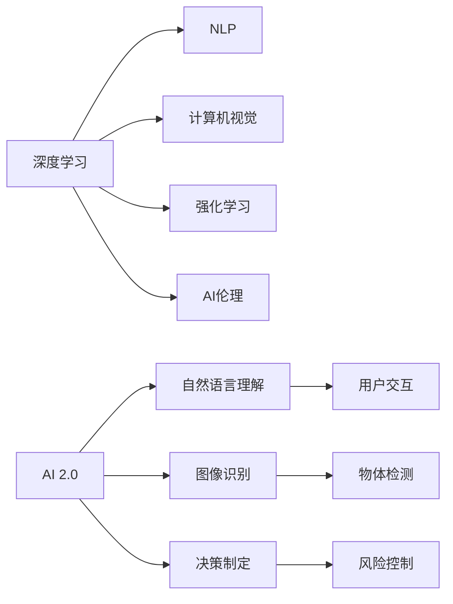

                 

# 李开复：AI 2.0 时代的未来展望

在科技快速发展的今天，人工智能(AI)正在进入一个全新的时代：AI 2.0。这个时代的特点是，AI不再仅仅是一种研究工具或技术手段，而是成为全面渗透到各行各业的普世能力。AI 2.0不仅在技术层面有了显著的突破，更在伦理、法规、经济、社会等各个维度提出了新的挑战和机遇。本文将深入探讨AI 2.0时代的未来展望，包括核心技术、关键应用场景、伦理挑战及应对策略，旨在为读者提供全面、深刻的AI 2.0理解和思考。

## 1. 背景介绍

### 1.1 问题由来

近年来，人工智能技术取得了长足进步，从深度学习、自然语言处理到计算机视觉等各个领域，AI已经展示出强大的解决问题的能力。然而，这些技术还处于初步探索阶段，尚未形成广泛应用。AI 2.0时代的到来，预示着AI将从实验室走向现实世界，成为各行各业的标配。

### 1.2 问题核心关键点

AI 2.0的核心在于全面、广泛、深入地应用AI技术，推动各行业的数字化转型升级。其关键点包括：
- **技术突破**：深度学习、强化学习、自然语言处理等技术的持续进步。
- **应用场景**：从传统的自动化到智能客服、医疗诊断、智能制造等更复杂的应用场景。
- **伦理法规**：确保AI技术的伦理使用，保护个人隐私，避免歧视性偏见。
- **经济社会影响**：提升生产力，创造新就业岗位，推动社会公平。

### 1.3 问题研究意义

理解AI 2.0时代的未来展望，对于把握人工智能技术的演进方向、提升产业竞争力、应对伦理挑战具有重要意义。具体而言，AI 2.0的深入应用将：
- 提升各行业的生产效率，降低运营成本。
- 创建新业态和新商业模式，推动经济增长。
- 改善社会服务，提升生活质量。
- 强化国家竞争力和国际影响力。

## 2. 核心概念与联系

### 2.1 核心概念概述

AI 2.0时代涉及多个关键概念，包括：
- **AI 2.0**：继AI 1.0（基于规则的系统）和AI 1.5（以大数据驱动的系统）之后，AI 2.0标志着一个全面、普适、可解释的AI时代。
- **深度学习**：通过多层神经网络，自动提取数据特征，实现复杂的模式识别和预测。
- **自然语言处理(NLP)**：使机器能够理解和生成人类语言。
- **计算机视觉(CV)**：让机器“看”世界，实现图像识别、视频分析等任务。
- **强化学习**：通过与环境的交互，学习最优策略。
- **AI伦理**：涉及AI决策透明性、隐私保护、公平性、安全性等伦理问题。

### 2.2 核心概念原理和架构的 Mermaid 流程图



这个流程图展示了AI 2.0的核心组成：深度学习通过多种方式（NLP、CV、强化学习）融入实际应用，而伦理是贯穿始终的重要考虑因素。

### 2.3 核心概念间的联系

AI 2.0中的各个核心概念相互交织，形成了一个动态、互联的生态系统。深度学习是AI 2.0的技术基础，NLP、CV、强化学习等进一步扩展了AI的应用范围，而AI伦理则确保了AI技术的健康、可持续的发展。各概念间的联系如下：

- **深度学习**提供通用技术手段，为NLP、CV、强化学习等提供底层支持。
- **NLP**使机器能够处理和理解人类语言，促进人机交互。
- **计算机视觉**让机器“看”世界，实现物体识别、场景分析等。
- **强化学习**通过与环境的交互，优化策略和决策。
- **AI伦理**确保AI技术的透明度、公正性和安全性。

## 3. 核心算法原理 & 具体操作步骤

### 3.1 算法原理概述

AI 2.0时代的算法原理基于深度学习，通过构建复杂的神经网络模型，自动从数据中学习特征和模式。具体而言，AI 2.0的算法原理包括：
- **神经网络**：多层节点结构，模拟人脑处理信息的方式。
- **反向传播**：通过链式法则计算梯度，更新网络参数。
- **正则化**：防止过拟合，提高模型的泛化能力。
- **优化算法**：如Adam、SGD等，调整模型参数，最小化损失函数。

### 3.2 算法步骤详解

AI 2.0算法的操作步骤如下：
1. **数据准备**：收集并标注训练数据，选择合适的数据集。
2. **模型选择**：确定使用的神经网络结构和超参数。
3. **训练**：使用反向传播算法更新模型参数，最小化损失函数。
4. **评估**：在测试数据集上评估模型性能。
5. **部署**：将训练好的模型应用到实际场景中，进行预测和决策。

### 3.3 算法优缺点

AI 2.0算法的主要优点包括：
- **高效性**：能够处理大规模数据，实现快速训练和推理。
- **准确性**：在大规模数据上训练的模型具有较高的准确率。
- **可扩展性**：可以应用于多种任务，从图像识别到自然语言处理。

同时，AI 2.0算法也存在一些缺点：
- **数据依赖**：需要大量的标注数据进行训练。
- **模型复杂性**：模型结构复杂，难以解释和调试。
- **资源消耗**：对计算资源和存储空间要求较高。

### 3.4 算法应用领域

AI 2.0算法已经在多个领域得到了广泛应用，包括：
- **医疗健康**：辅助诊断、药物研发、患者监护等。
- **智能制造**：预测维护、质量控制、流程优化等。
- **金融服务**：风险评估、欺诈检测、自动化交易等。
- **自动驾驶**：环境感知、路径规划、智能决策等。
- **教育培训**：个性化学习、智能辅导、学习分析等。
- **安全防护**：网络攻击检测、威胁识别、恶意行为预测等。

## 4. 数学模型和公式 & 详细讲解 & 举例说明

### 4.1 数学模型构建

AI 2.0的核心模型是深度神经网络，其数学模型可以表示为：
$$
f(x) = \sum_{i=1}^n w_i \sigma(z_i + b_i)
$$
其中，$f(x)$ 为输出，$w_i$ 为权重，$z_i$ 为输入，$b_i$ 为偏置，$\sigma$ 为激活函数。

### 4.2 公式推导过程

以一个简单的前馈神经网络为例，推导反向传播算法中的梯度更新公式。假设有一层具有$n$个神经元的神经网络，其激活函数为$\sigma$，输入为$x$，输出为$y$。

首先，计算输出层的激活值：
$$
z^{[L]} = W^{[L]}x + b^{[L]}
$$
$$
a^{[L]} = \sigma(z^{[L]})
$$

然后，计算误差：
$$
\delta^{[L]} = (a^{[L]}-y)\cdot a^{[L]}(1-a^{[L]})
$$

接着，计算隐藏层的误差：
$$
\delta^{[l]} = \delta^{[L]}\cdot W^{[L]^T} \cdot \sigma'(z^{[l+1]})
$$

最后，更新权重和偏置：
$$
\Delta W^{[l]} = a^{[l]T}\delta^{[l]}
$$
$$
\Delta b^{[l]} = \delta^{[l]}
$$

### 4.3 案例分析与讲解

以计算机视觉中的图像识别任务为例，假设有一张图像$x$，需要通过神经网络$f(x)$进行分类。通过训练得到的模型$f(x)$，可以对新图像进行预测和分类。

## 5. 项目实践：代码实例和详细解释说明

### 5.1 开发环境搭建

进行AI 2.0项目开发，需要搭建合适的开发环境。以下是一些建议：
1. **选择开发平台**：PyTorch、TensorFlow、Keras等深度学习框架，可根据项目需求选择合适的平台。
2. **配置计算资源**：GPU/TPU等高性能设备，以便进行大规模数据训练。
3. **版本管理**：使用Git等工具进行版本控制，方便团队协作和代码管理。
4. **数据管理**：使用数据库、云存储等手段管理数据，确保数据安全和高效访问。

### 5.2 源代码详细实现

以TensorFlow为例，实现一个简单的图像分类模型：
```python
import tensorflow as tf
from tensorflow.keras import layers, models

# 定义模型
model = models.Sequential([
    layers.Conv2D(32, (3,3), activation='relu', input_shape=(28,28,1)),
    layers.MaxPooling2D((2,2)),
    layers.Conv2D(64, (3,3), activation='relu'),
    layers.MaxPooling2D((2,2)),
    layers.Flatten(),
    layers.Dense(64, activation='relu'),
    layers.Dense(10, activation='softmax')
])

# 编译模型
model.compile(optimizer='adam', loss='sparse_categorical_crossentropy', metrics=['accuracy'])

# 训练模型
model.fit(train_images, train_labels, epochs=10, validation_data=(test_images, test_labels))

# 评估模型
test_loss, test_acc = model.evaluate(test_images, test_labels)
print('Test accuracy:', test_acc)
```

### 5.3 代码解读与分析

**模型定义**：使用Sequential模型，定义了卷积层、池化层、全连接层等基本组件。
**模型编译**：选择Adam优化器，交叉熵损失函数，评估指标为准确率。
**模型训练**：使用训练集进行10轮训练，并在验证集上进行评估。
**模型评估**：计算测试集上的损失和准确率。

## 6. 实际应用场景

### 6.1 医疗健康

AI 2.0在医疗健康领域的应用包括：
- **疾病预测**：利用患者的历史数据和遗传信息，预测疾病发生的风险。
- **影像诊断**：通过图像识别技术，自动分析医学影像，辅助诊断疾病。
- **个性化治疗**：根据患者基因信息和病情，制定个性化的治疗方案。

### 6.2 智能制造

AI 2.0在智能制造中的应用包括：
- **预测维护**：通过机器学习预测设备故障，提前进行维护，避免生产中断。
- **质量控制**：实时监控生产过程中的质量参数，检测缺陷，提高产品质量。
- **流程优化**：分析生产数据，优化生产流程，提高生产效率。

### 6.3 金融服务

AI 2.0在金融服务中的应用包括：
- **风险评估**：通过数据分析，评估贷款、投资的风险。
- **欺诈检测**：利用机器学习模型，检测金融交易中的欺诈行为。
- **自动化交易**：通过算法自动化交易，提高交易效率，降低成本。

### 6.4 自动驾驶

AI 2.0在自动驾驶中的应用包括：
- **环境感知**：利用计算机视觉技术，识别道路标志、行人、车辆等。
- **路径规划**：通过优化算法，规划最优行驶路径。
- **智能决策**：根据感知结果和交通规则，做出智能驾驶决策。

## 7. 工具和资源推荐

### 7.1 学习资源推荐

1. **《Deep Learning》（Ian Goodfellow等著）**：全面介绍深度学习的理论基础和实践技巧，适合初学者和进阶者阅读。
2. **《Hands-On Machine Learning with Scikit-Learn and TensorFlow》（Aurélien Géron著）**：通过实际项目，展示机器学习模型的构建和部署，适合动手实践。
3. **《Natural Language Processing with Python》（Steven Bird等著）**：介绍NLP技术的实现和应用，适合NLP方向的学习者。
4. **Kaggle**：全球最大的数据科学竞赛平台，提供丰富的数据集和比赛，适合实战练习。

### 7.2 开发工具推荐

1. **PyTorch**：基于Python的开源深度学习框架，灵活易用，适合研究和小规模项目。
2. **TensorFlow**：由Google开发的深度学习框架，支持分布式计算，适合大规模项目和工业应用。
3. **Keras**：高层次的神经网络API，易于上手，适合快速原型设计和实验。
4. **Jupyter Notebook**：交互式编程环境，支持多种编程语言和数据处理，适合数据科学和机器学习项目。

### 7.3 相关论文推荐

1. **《ImageNet Classification with Deep Convolutional Neural Networks》（Alex Krizhevsky等著）**：提出AlexNet模型，是深度学习的重要里程碑。
2. **《Attention is All You Need》（Ashish Vaswani等著）**：提出Transformer模型，开启了NLP领域的预训练大模型时代。
3. **《Generative Adversarial Nets》（Ian Goodfellow等著）**：提出GAN模型，开创了生成对抗网络的研究方向。
4. **《Deep Reinforcement Learning for Playing Go》（David Silver等著）**：展示AlphaGo模型，在围棋比赛中战胜人类。

## 8. 总结：未来发展趋势与挑战

### 8.1 研究成果总结

AI 2.0技术在深度学习、自然语言处理、计算机视觉等领域取得了显著进展，推动了各行业的数字化转型。其核心技术包括深度学习、NLP、CV、强化学习等，这些技术相互交织，形成了一个动态的生态系统。

### 8.2 未来发展趋势

AI 2.0的未来发展趋势包括：
- **技术进步**：深度学习、自然语言处理、计算机视觉等技术将不断突破，提升AI模型的性能。
- **应用拓展**：AI将应用于更多领域，如医疗健康、智能制造、金融服务、自动驾驶等。
- **伦理法规**：AI伦理法规将逐步完善，确保AI技术的健康发展。
- **跨界融合**：AI将与其他技术如物联网、区块链、5G等结合，创造更多新的应用场景。

### 8.3 面临的挑战

AI 2.0技术在应用过程中面临诸多挑战：
- **数据隐私**：如何保护用户隐私，防止数据泄露。
- **模型透明性**：AI模型的决策过程难以解释，需要提高模型的透明性。
- **公平性**：避免算法中的偏见和歧视，确保公平性。
- **安全性**：防止模型被恶意攻击或滥用，确保安全性。
- **资源消耗**：AI模型的资源消耗较大，需要优化资源使用。

### 8.4 研究展望

未来AI研究需要在以下几个方向上继续深入：
- **模型压缩**：通过模型压缩技术，减小模型规模，提高推理速度。
- **跨模态学习**：将不同模态的数据整合，提高模型的泛化能力。
- **联邦学习**：分布式训练技术，保护数据隐私，提升模型效果。
- **可解释AI**：提高AI模型的透明性，使其更容易理解和解释。
- **伦理法规**：制定AI伦理规范，确保AI技术的健康发展。

## 9. 附录：常见问题与解答

**Q1：AI 2.0的核心技术有哪些？**

A: AI 2.0的核心技术包括深度学习、自然语言处理、计算机视觉、强化学习等。

**Q2：AI 2.0的应用场景有哪些？**

A: AI 2.0广泛应用于医疗健康、智能制造、金融服务、自动驾驶等领域。

**Q3：AI 2.0面临的伦理挑战有哪些？**

A: AI 2.0面临的伦理挑战包括数据隐私、模型透明性、公平性、安全性等。

**Q4：AI 2.0未来发展的主要趋势是什么？**

A: AI 2.0的未来发展趋势包括技术进步、应用拓展、伦理法规、跨界融合等。

**Q5：AI 2.0在实际应用中需要注意哪些问题？**

A: AI 2.0在实际应用中需要注意数据隐私、模型透明性、公平性、安全性、资源消耗等问题。

---

作者：禅与计算机程序设计艺术 / Zen and the Art of Computer Programming

