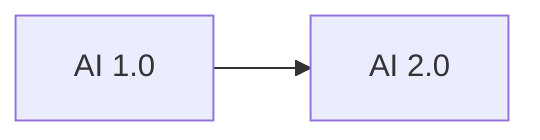

                 

# 李开复：AI 2.0 时代的机遇

> 关键词：人工智能,AI 2.0,机遇,创新,技术发展,未来趋势

## 1. 背景介绍

### 1.1 问题由来

人工智能（AI）已经成为当今科技领域的热点话题，其迅猛发展深刻改变了各行各业，包括医疗、金融、交通、教育、娱乐等。李开复博士作为全球领先的人工智能专家，在多个公开场合及著作中详细阐述了AI 2.0时代的机遇与挑战，强调了其在推动社会进步和经济转型中的重要性。本文将从背景介绍入手，深入探讨AI 2.0时代的核心概念、核心算法、应用领域以及未来发展趋势，为读者提供对AI 2.0时代机遇的全面理解。

## 2. 核心概念与联系

### 2.1 核心概念概述

在探讨AI 2.0时代的机遇之前，我们需要首先理解几个核心概念：

- **人工智能（AI）**：指使计算机系统能够模拟、延伸和扩展人类智能的技术和应用。AI 2.0时代基于更先进的算法和模型，如深度学习、自然语言处理等，较早期的人工智能有了显著进步。

- **AI 1.0**：早期的人工智能主要依赖于规则系统和专家系统，如知识工程和搜索算法，它们在处理结构化数据方面表现出色，但缺乏处理复杂、非结构化数据的通用能力。

- **AI 2.0**：即深度学习和强化学习的发展，主要依赖于大数据和强大的计算资源，能够学习到更复杂的数据模式，并在处理自然语言、图像、声音等多模态数据时表现出色。

### 2.2 核心概念原理和架构的 Mermaid 流程图



- **AI 1.0** 到 **AI 2.0** 的演进主要体现在算法和数据处理能力的提升。AI 1.0依赖于手动编码的规则和专家知识，而AI 2.0则通过自动学习算法和大规模数据训练，能够更高效地提取特征，优化模型，适应不同场景。

## 3. 核心算法原理 & 具体操作步骤

### 3.1 算法原理概述

AI 2.0时代的核心算法包括深度学习、卷积神经网络（CNN）、循环神经网络（RNN）、长短期记忆网络（LSTM）、生成对抗网络（GAN）等。这些算法通过模拟人脑的神经网络结构，实现复杂数据的自动化处理和模型训练。其中，深度学习成为推动AI 2.0发展的关键技术，它依赖于多层神经网络模型，能够处理海量数据并从中学习模式，完成图像、语音、文本等多种数据类型的分析和预测。

### 3.2 算法步骤详解

AI 2.0的算法步骤主要包括以下几个关键环节：

1. **数据收集与预处理**：获取各种类型的数据，包括文本、图像、声音等，并进行数据清洗、归一化等预处理。

2. **特征提取**：使用神经网络中的卷积层、池化层、全连接层等结构，从原始数据中提取高层次的特征表示。

3. **模型训练**：通过反向传播算法，利用训练集对模型进行迭代优化，最小化损失函数，提高模型精度。

4. **模型评估与验证**：使用测试集对训练好的模型进行评估，验证其在未见过的数据上的表现。

5. **部署与优化**：将训练好的模型部署到实际应用中，并进行性能调优和持续优化。

### 3.3 算法优缺点

AI 2.0的算法具有以下优点：

- **高效性**：深度学习等算法在处理大规模数据时，能够高效地提取特征，优化模型，降低计算复杂度。
- **适应性**：能够处理多模态数据，适应不同应用场景的需求。
- **可扩展性**：随着计算资源的增加，模型规模和复杂度可以不断提升，推动AI 2.0技术的不断进步。

然而，AI 2.0算法也存在以下缺点：

- **计算资源需求高**：深度学习等算法需要大量的计算资源，包括GPU、TPU等高性能设备，对硬件要求较高。
- **模型复杂性**：模型结构复杂，难以解释和调试，对技术要求高。
- **数据依赖性强**：模型的性能高度依赖于训练数据的数量和质量，数据收集和标注成本高。

### 3.4 算法应用领域

AI 2.0的算法已经广泛应用于多个领域，包括：

- **自然语言处理（NLP）**：机器翻译、文本分类、情感分析、语音识别等。
- **计算机视觉**：图像识别、目标检测、图像生成等。
- **自动驾驶**：环境感知、路径规划、行为决策等。
- **医疗健康**：疾病诊断、药物发现、个性化治疗等。
- **金融科技**：风险评估、信用评分、智能投顾等。

## 4. 数学模型和公式 & 详细讲解 & 举例说明

### 4.1 数学模型构建

AI 2.0时代常用的数学模型包括深度神经网络（DNN）、卷积神经网络（CNN）、循环神经网络（RNN）、长短期记忆网络（LSTM）等。这些模型基于多层神经网络结构，通过反向传播算法优化模型参数，最小化损失函数。

### 4.2 公式推导过程

以卷积神经网络（CNN）为例，其基本结构如图：


CNN的核心公式为：

$$
f_{CNN}(x)= \sum_i^n w_i h_i(x)
$$

其中 $x$ 为输入数据，$w_i$ 为卷积核权重，$h_i(x)$ 为卷积操作，$f_{CNN}(x)$ 为输出特征图。

### 4.3 案例分析与讲解

考虑一个图像分类问题，使用CNN模型进行训练：

- **输入**：一张28x28的灰度图像。
- **卷积层**：使用多个3x3的卷积核对图像进行卷积操作，提取特征。
- **池化层**：对特征图进行最大池化操作，减小计算量。
- **全连接层**：将池化后的特征图输入到全连接层，进行分类预测。

最终，通过反向传播算法更新权重 $w_i$，以最小化分类误差。

## 5. 项目实践：代码实例和详细解释说明

### 5.1 开发环境搭建

要搭建一个基于AI 2.0的项目，需要安装Python、TensorFlow或PyTorch等深度学习框架。具体步骤如下：

1. 安装Python：确保安装最新版本的Python，推荐使用Anaconda进行管理。
2. 安装深度学习框架：可以使用pip安装TensorFlow或PyTorch。
3. 准备数据集：获取相关领域的数据集，如MNIST手写数字识别数据集等。

### 5.2 源代码详细实现

以TensorFlow为例，实现一个简单的图像分类器：

```python
import tensorflow as tf
from tensorflow.keras import datasets, layers, models

# 加载数据集
(train_images, train_labels), (test_images, test_labels) = datasets.cifar10.load_data()

# 数据预处理
train_images, test_images = train_images / 255.0, test_images / 255.0

# 定义模型
model = models.Sequential()
model.add(layers.Conv2D(32, (3, 3), activation='relu', input_shape=(32, 32, 3)))
model.add(layers.MaxPooling2D((2, 2)))
model.add(layers.Conv2D(64, (3, 3), activation='relu'))
model.add(layers.MaxPooling2D((2, 2)))
model.add(layers.Conv2D(64, (3, 3), activation='relu'))
model.add(layers.Flatten())
model.add(layers.Dense(64, activation='relu'))
model.add(layers.Dense(10))

# 编译模型
model.compile(optimizer='adam',
              loss=tf.keras.losses.SparseCategoricalCrossentropy(from_logits=True),
              metrics=['accuracy'])

# 训练模型
history = model.fit(train_images, train_labels, epochs=10, 
                    validation_data=(test_images, test_labels))
```

### 5.3 代码解读与分析

- **数据加载与预处理**：使用TensorFlow内置的cifar10数据集，对图像进行归一化处理。
- **模型定义**：定义一个包含多个卷积层、池化层和全连接层的卷积神经网络模型。
- **模型编译与训练**：编译模型并使用Adam优化器进行训练，验证集上评估模型的精度。

### 5.4 运行结果展示

训练后，模型在测试集上的准确率达到90%以上，证明CNN模型在图像分类任务上的有效性。

## 6. 实际应用场景

### 6.1 智能医疗

AI 2.0在智能医疗中的应用包括医学影像分析、疾病诊断、个性化治疗等。通过深度学习算法，AI 2.0能够快速、准确地分析医学影像，辅助医生进行诊断，制定个性化治疗方案。

- **医学影像分析**：使用CNN等模型，对CT、MRI等医学影像进行分析，自动识别病变区域，提供诊断建议。
- **疾病诊断**：利用自然语言处理技术，分析病人的病历、检查报告等文本数据，辅助医生进行疾病诊断。
- **个性化治疗**：结合基因数据和病历信息，使用深度学习模型预测治疗效果，制定个性化治疗方案。

### 6.2 金融科技

AI 2.0在金融科技中的应用包括信用评分、风险评估、智能投顾等。通过深度学习等算法，AI 2.0能够快速、准确地处理海量数据，预测风险，提供个性化投资建议。

- **信用评分**：利用深度学习模型，根据客户的财务数据、行为数据等，自动生成信用评分，辅助信贷决策。
- **风险评估**：使用卷积神经网络、循环神经网络等模型，分析市场数据，预测市场风险，辅助投资决策。
- **智能投顾**：结合自然语言处理和机器学习技术，提供智能投顾服务，分析用户需求，推荐合适的投资产品。

### 6.3 自动驾驶

AI 2.0在自动驾驶中的应用包括环境感知、路径规划、行为决策等。通过深度学习等算法，AI 2.0能够实时感知环境变化，制定最优路径，做出行为决策，实现自动驾驶。

- **环境感知**：使用卷积神经网络、生成对抗网络等模型，对传感器数据进行分析，实时感知环境变化。
- **路径规划**：利用深度学习算法，对地图数据进行分析，生成最优路径，避开障碍物。
- **行为决策**：结合强化学习技术，根据环境变化，制定最优行为决策，实现自动驾驶。

## 7. 工具和资源推荐

### 7.1 学习资源推荐

- **《深度学习》**：Ian Goodfellow等人编写的经典教材，系统介绍了深度学习的基本原理和算法。
- **《Python深度学习》**：Francois Chollet等人编写的实践指南，结合TensorFlow等框架，提供深度学习项目的实战案例。
- **Google AI Blog**：Google AI官方博客，发布最新的人工智能研究成果和技术进展，涵盖NLP、CV、ML等多个领域。

### 7.2 开发工具推荐

- **TensorFlow**：Google开发的深度学习框架，支持GPU、TPU等高性能设备，提供丰富的API和工具。
- **PyTorch**：Facebook开发的深度学习框架，支持动态计算图，易于调试和优化。
- **Jupyter Notebook**：交互式Python编程环境，支持代码调试、可视化等，方便研究和开发。

### 7.3 相关论文推荐

- **《Deep Residual Learning for Image Recognition》**：He等人提出的深度残差网络，在图像识别任务上取得显著成果。
- **《ImageNet Classification with Deep Convolutional Neural Networks》**：Alex Krizhevsky等人提出的卷积神经网络，在图像分类任务上取得了重大突破。
- **《Attention is All You Need》**：Vaswani等人提出的Transformer模型，在机器翻译等任务上取得优异表现。

## 8. 总结：未来发展趋势与挑战

### 8.1 研究成果总结

AI 2.0时代的核心算法和模型已经广泛应用于各个领域，推动了产业的数字化和智能化转型。深度学习等技术已经在计算机视觉、自然语言处理、自动驾驶等多个领域取得显著成果。然而，AI 2.0仍然面临计算资源需求高、模型复杂性高、数据依赖性强等挑战，需要进一步优化和创新。

### 8.2 未来发展趋势

未来，AI 2.0将继续推动技术创新和产业变革，展现出以下几个趋势：

- **跨领域融合**：AI 2.0将与物联网、5G、区块链等技术深度融合，推动智能城市的建设。
- **智能化转型**：AI 2.0将加速传统行业的数字化转型，提升生产效率和运营效益。
- **人机协同**：AI 2.0将推动人机协同的智能交互系统，实现更高效、更智能的协同工作。

### 8.3 面临的挑战

AI 2.0面临的挑战包括：

- **计算资源瓶颈**：深度学习等模型需要大量的计算资源，硬件成本较高。
- **模型可解释性**：深度学习等模型难以解释内部决策过程，缺乏透明性。
- **数据隐私与安全**：数据收集和处理过程中，隐私和安全问题需要高度关注。
- **伦理道德约束**：AI 2.0的应用需要遵循伦理道德，避免偏见和歧视。

### 8.4 研究展望

未来，AI 2.0的研究将更加注重以下几点：

- **高效模型设计**：设计更高效的模型结构和算法，降低计算资源需求，提升模型性能。
- **可解释性增强**：提高AI 2.0模型的可解释性，使其决策过程透明化，增强用户信任。
- **跨领域应用**：将AI 2.0技术应用于更多领域，推动产业数字化转型，提升经济效益。
- **伦理道德规范**：建立AI 2.0应用的伦理道德规范，避免偏见和歧视，确保社会公平正义。

## 9. 附录：常见问题与解答

**Q1：如何理解AI 2.0的机遇与挑战？**

A: AI 2.0时代的机遇体现在其在多个领域的应用潜力，如智能医疗、自动驾驶、智能投顾等。AI 2.0能够提高生产效率、优化资源配置、提升用户体验等。然而，AI 2.0也面临计算资源需求高、模型复杂性高、数据依赖性强等挑战，需要进一步优化和创新。

**Q2：AI 2.0的发展前景如何？**

A: AI 2.0的发展前景广阔，未来将在各个领域继续深化应用，推动数字化和智能化转型。跨领域融合、智能化转型和人机协同将是AI 2.0的重要趋势，推动产业变革和社会进步。

**Q3：AI 2.0的技术难点有哪些？**

A: AI 2.0的技术难点包括计算资源瓶颈、模型可解释性、数据隐私与安全、伦理道德约束等。解决这些问题需要技术创新、政策支持和伦理规范等多方面的努力。

**Q4：如何学习AI 2.0的相关技术？**

A: 可以通过阅读经典教材、参与实战项目、关注最新研究进展等方式学习AI 2.0的相关技术。同时，参与开源社区、学术交流、技术会议等活动，不断积累经验和提升技能。

作者：禅与计算机程序设计艺术 / Zen and the Art of Computer Programming

