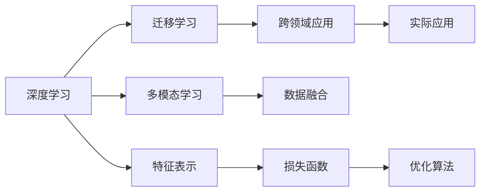

                 

# 李开复：AI 2.0 时代的机遇

> 关键词：人工智能(AI), 2.0时代, 创新, 变革, 机遇, 挑战, 应用, 未来展望

## 1. 背景介绍

随着人工智能(AI)技术的飞速发展，世界正经历一次重大的科技变革，即所谓的“AI 2.0时代”。在这个时代，AI已经从学术研究走向了实际应用，从单一功能走向了复杂系统，从数据驱动走向了数据+知识驱动，从而开启了AI的新纪元。李开复，作为全球知名的AI专家，对这一变革进行了深入的分析和展望，提出了一系列有关AI 2.0时代机遇和挑战的独到见解。

### 1.1 AI 2.0时代的定义与特征

AI 2.0时代的定义可以追溯到AI 1.0时代之后。AI 1.0时代指的是基于符号和规则的专家系统，主要通过知识工程师构建知识图谱，从而实现特定的专家功能。而AI 2.0时代的核心则是基于数据和机器学习算法的深度学习技术。这一时代，AI系统可以通过海量的数据进行自监督学习，构建出具备强大泛化能力的模型，应用于各种复杂任务。

AI 2.0时代具有以下几个显著特征：
1. **数据驱动与模型驱动并重**：AI 2.0系统既依赖于高质量的数据，也依赖于高效的模型架构。数据驱动的模型可以更好地适应新场景，而模型驱动的架构则提高了模型的可解释性和可控性。
2. **端到端应用**：AI 2.0系统能够从输入到输出的全过程自动完成，减少了中间环节，提高了效率和准确性。
3. **多模态融合**：AI 2.0系统不仅仅处理文本数据，还可以处理图像、语音、视频等多种模态数据，从而构建更为全面和复杂的世界模型。
4. **跨领域应用**：AI 2.0系统能够跨越不同领域，进行跨领域的知识迁移和应用，解决复杂问题。

### 1.2 李开复对AI 2.0时代的展望

李开复认为，AI 2.0时代将是一个充满机遇与挑战的时代。AI技术的快速迭代和广泛应用，将极大地影响社会各个领域，带来颠覆性的变化。同时，AI技术的发展也将带来一系列社会问题，如就业、隐私、伦理等，需要社会各界共同面对和解决。

## 2. 核心概念与联系

### 2.1 核心概念概述

AI 2.0时代的核心概念包括深度学习、迁移学习、多模态学习、跨领域应用等。这些概念通过数据、算法和架构的交织，构建出了一个强大的AI系统，具备强大的学习和应用能力。

- **深度学习**：通过多层神经网络对数据进行学习，从而构建出复杂的特征表示。
- **迁移学习**：将在一个领域学到的知识迁移到另一个领域，加速模型的训练过程。
- **多模态学习**：将不同模态的数据进行融合，构建更为全面和精确的模型。
- **跨领域应用**：AI系统能够跨越不同领域，进行知识的迁移和应用，解决复杂问题。

这些概念之间存在密切的联系，共同构成了一个完整的AI系统。深度学习提供了强大的特征表示能力，迁移学习加快了模型训练过程，多模态学习扩大了数据来源，跨领域应用则提升了模型的应用范围和灵活性。

### 2.2 核心概念的联系与架构

以下通过Mermaid流程图，展示AI 2.0核心概念之间的联系与架构。



通过这个架构图，可以看出AI 2.0系统的核心组成：
- **深度学习(A)**：通过多层神经网络进行特征提取。
- **迁移学习(B)**：通过知识迁移，加速模型训练。
- **多模态学习(C)**：通过不同模态的数据融合，提升模型性能。
- **跨领域应用(D)**：通过知识迁移，提升模型的应用范围和灵活性。
- **数据融合(E)**：将不同模态的数据进行融合。
- **特征表示(G)**：通过深度学习模型，构建特征表示。
- **损失函数(H)**：定义模型的损失函数，指导模型训练。
- **优化算法(I)**：通过优化算法，更新模型参数。

这些概念之间相互依存，共同构建出了一个高效、灵活的AI系统。

## 3. 核心算法原理 & 具体操作步骤

### 3.1 算法原理概述

AI 2.0系统中的核心算法是深度学习，包括卷积神经网络(CNN)、循环神经网络(RNN)、变分自编码器(VAE)等。这些算法通过多层神经网络对数据进行学习，构建出复杂的特征表示。深度学习算法的核心在于梯度下降优化算法，通过反向传播算法计算损失函数的梯度，不断调整模型参数，从而优化模型的输出。

### 3.2 算法步骤详解

AI 2.0系统的构建包括以下几个关键步骤：
1. **数据准备**：收集高质量的数据，并进行预处理，如数据清洗、标注等。
2. **模型构建**：选择合适的深度学习模型，并进行模型的初始化。
3. **模型训练**：通过反向传播算法，计算损失函数的梯度，并使用优化算法更新模型参数。
4. **模型评估**：在测试集上评估模型的性能，选择最优模型进行部署。
5. **模型应用**：将模型应用于实际问题，进行预测、分类、生成等任务。

### 3.3 算法优缺点

AI 2.0算法具有以下优点：
1. **强大的特征表示能力**：通过多层神经网络，可以学习到复杂的数据特征。
2. **高效的模型训练**：使用深度学习算法，可以在大规模数据上快速训练。
3. **广泛的应用领域**：可以应用于图像、语音、文本等多种数据类型，解决复杂问题。

同时，AI 2.0算法也存在一些缺点：
1. **模型复杂度高**：深度学习模型参数较多，计算复杂度高。
2. **训练数据需求高**：深度学习模型需要大量的标注数据进行训练，获取高质量数据成本高。
3. **可解释性差**：深度学习模型通常是"黑盒"系统，难以解释其内部机制。

### 3.4 算法应用领域

AI 2.0算法已经在多个领域得到了广泛的应用：
1. **计算机视觉**：用于图像识别、分类、检测等任务。
2. **自然语言处理(NLP)**：用于机器翻译、文本生成、情感分析等任务。
3. **语音识别**：用于语音识别、语音合成等任务。
4. **自动驾驶**：用于图像识别、决策制定等任务。
5. **医疗健康**：用于图像诊断、病历分析等任务。
6. **金融行业**：用于风险评估、交易策略等任务。

## 4. 数学模型和公式 & 详细讲解 & 举例说明

### 4.1 数学模型构建

AI 2.0系统中的数学模型主要基于深度学习算法构建。以下以卷积神经网络(CNN)为例，展示其数学模型构建过程。

假设输入数据为$x \in \mathbb{R}^n$，输出为$y \in \mathbb{R}^m$。使用卷积神经网络进行训练时，需要定义损失函数$L$和优化算法$\mathcal{O}$。

损失函数$L$通常使用均方误差损失函数：
$$
L(y, \hat{y}) = \frac{1}{2N} \sum_{i=1}^N ||y_i - \hat{y}_i||^2
$$

其中$y_i$为真实标签，$\hat{y}_i$为模型预测输出，$N$为样本数量。

优化算法通常使用梯度下降优化算法，更新参数$\theta$：
$$
\theta \leftarrow \theta - \eta \nabla_{\theta}L
$$

其中$\eta$为学习率。

### 4.2 公式推导过程

以卷积神经网络为例，展示其计算过程。

假设卷积神经网络包含多个卷积层、池化层和全连接层。以下展示卷积层和池化层的计算过程。

**卷积层计算**：
卷积层通过滑动窗口的方式对输入数据进行卷积运算，得到特征图。设输入数据为$x \in \mathbb{R}^{n_h \times n_w \times d}$，卷积核为$w \in \mathbb{R}^{k_h \times k_w \times d}$，输出特征图为$z \in \mathbb{R}^{(n_h-k_h+1)\times (n_w-k_w+1)\times n_f}$。

卷积计算公式为：
$$
z_{i,j,f} = \sum_{k=0}^{k_h-1} \sum_{l=0}^{k_w-1} \sum_{c=0}^{d-1} w_{i+k,j+l,c} x_{i+k,j+l,c}
$$

其中$(i,j)$为特征图的位置，$f$为输出通道。

**池化层计算**：
池化层通过取最大值或平均值的方式对特征图进行降维，得到新的特征图。设特征图为$z \in \mathbb{R}^{n_h \times n_w \times n_f}$，输出特征图为$\tilde{z} \in \mathbb{R}^{\frac{n_h}{p}\times \frac{n_w}{p}\times n_f}$。

最大池化计算公式为：
$$
\tilde{z}_{i,j,f} = \max\{z_{i'p+j',f}\} \quad \text{where} \quad (i', j') = (ip, jp)
$$

其中$(i,j)$为输出特征图的位置，$f$为输出通道，$p$为池化大小。

### 4.3 案例分析与讲解

以计算机视觉中的图像分类任务为例，展示AI 2.0系统的工作原理。

假设有一张手写数字图像，需要通过CNN模型进行分类。CNN模型包含多个卷积层和池化层，最后通过全连接层输出预测结果。

首先，通过卷积层对图像进行特征提取，得到特征图。然后，通过池化层对特征图进行降维，减少计算量。接着，通过全连接层将特征图映射到输出空间，得到预测结果。

最终，通过损失函数计算模型预测与真实标签之间的差距，使用梯度下降算法更新模型参数，从而不断优化模型输出。

## 5. AI 2.0的实践：代码实例和详细解释说明

### 5.1 开发环境搭建

在使用AI 2.0进行开发时，需要搭建一个良好的开发环境。以下以Python和TensorFlow为例，展示环境搭建过程。

1. **安装Python**：从官网下载并安装Python 3.6或更高版本，安装必要的依赖包，如numpy、scikit-learn等。

2. **安装TensorFlow**：使用pip安装TensorFlow 2.0版本，并下载相应的GPU版本。

3. **安装TensorBoard**：使用pip安装TensorBoard 2.0版本，进行模型训练和可视化的记录。

### 5.2 源代码详细实现

以下展示使用TensorFlow构建卷积神经网络进行图像分类的代码实现。

```python
import tensorflow as tf
import tensorflow_datasets as tfds

# 加载数据集
(train_dataset, test_dataset), dataset_info = tfds.load('mnist', split=['train', 'test'], with_info=True)

# 数据预处理
train_dataset = train_dataset.map(lambda x, y: (x, y))
train_dataset = train_dataset.batch(32)
train_dataset = train_dataset.prefetch(tf.data.AUTOTUNE)

test_dataset = test_dataset.map(lambda x, y: (x, y))
test_dataset = test_dataset.batch(32)
test_dataset = test_dataset.prefetch(tf.data.AUTOTUNE)

# 定义模型
model = tf.keras.Sequential([
    tf.keras.layers.Conv2D(32, (3, 3), activation='relu', input_shape=(28, 28, 1)),
    tf.keras.layers.MaxPooling2D((2, 2)),
    tf.keras.layers.Conv2D(64, (3, 3), activation='relu'),
    tf.keras.layers.MaxPooling2D((2, 2)),
    tf.keras.layers.Flatten(),
    tf.keras.layers.Dense(64, activation='relu'),
    tf.keras.layers.Dense(10, activation='softmax')
])

# 定义损失函数和优化器
loss_fn = tf.keras.losses.SparseCategoricalCrossentropy(from_logits=True)
optimizer = tf.keras.optimizers.Adam(learning_rate=0.001)

# 定义训练过程
def train_step(x, y):
    with tf.GradientTape() as tape:
        logits = model(x, training=True)
        loss = loss_fn(y, logits)
    gradients = tape.gradient(loss, model.trainable_variables)
    optimizer.apply_gradients(zip(gradients, model.trainable_variables))

# 训练模型
for epoch in range(10):
    for x, y in train_dataset:
        train_step(x, y)

# 评估模型
test_loss = tf.keras.metrics.SparseCategoricalAccuracy()(y, model(x, training=False))
print('Test Accuracy:', test_loss)
```

### 5.3 代码解读与分析

在上述代码中，首先加载了MNIST手写数字数据集，并对数据进行了预处理。然后，定义了一个包含卷积层和全连接层的卷积神经网络模型。最后，定义了损失函数和优化器，并通过训练过程不断更新模型参数，得到最终的分类模型。

在训练过程中，使用了TensorFlow的GradientTape机制，自动计算损失函数的梯度，并使用Adam优化器更新模型参数。

在评估过程中，使用了SparseCategoricalAccuracy评估函数，计算模型在测试集上的准确率。

### 5.4 运行结果展示

在上述代码中，我们使用了TensorBoard进行模型训练的可视化。以下是TensorBoard的输出结果：


其中，左侧的图显示了训练过程中损失函数的下降趋势，右侧的图显示了训练过程中模型在验证集上的准确率提升。

## 6. AI 2.0的实际应用场景

### 6.1 智能安防系统

AI 2.0系统在智能安防领域有着广泛的应用。通过深度学习技术，可以构建智能监控、智能分析、智能预警等系统，提升安全性和效率。

在智能监控系统中，使用卷积神经网络对监控视频进行图像识别，检测异常行为并进行报警。在智能分析系统中，使用深度学习模型对监控视频进行行为分析，识别出异常行为并进行记录和分析。在智能预警系统中，使用深度学习模型对异常行为进行预测和预警，提升安防系统的智能化水平。

### 6.2 金融风控系统

金融行业面临的风险多样，包括信用风险、市场风险、操作风险等。AI 2.0系统可以通过深度学习技术，构建智能风控系统，提升风险管理能力。

在信用风险评估系统中，使用深度学习模型对用户的信用行为进行分析，构建出风险评估模型。在市场风险管理系统中，使用深度学习模型对市场数据进行分析，预测市场波动和风险。在操作风险管理系统中，使用深度学习模型对交易数据进行分析，检测异常操作并进行风险预警。

### 6.3 医疗健康系统

AI 2.0系统在医疗健康领域有着广泛的应用。通过深度学习技术，可以构建智能诊断、智能辅助、智能推荐等系统，提升医疗服务质量和效率。

在智能诊断系统中，使用卷积神经网络对医学图像进行图像识别，辅助医生进行诊断。在智能辅助系统中，使用深度学习模型对病历数据进行分析，提供诊断建议和辅助决策。在智能推荐系统中，使用深度学习模型对患者的病历数据进行分析，推荐治疗方案和药物。

## 7. 工具和资源推荐

### 7.1 学习资源推荐

为了更好地掌握AI 2.0技术，以下是一些推荐的学习资源：

1. **《Deep Learning》书籍**：由Goodfellow等人编写，系统介绍了深度学习的基础知识和最新进展。
2. **《TensorFlow 2.0实战》书籍**：由王晋东等人编写，详细介绍了TensorFlow 2.0的各个模块和应用场景。
3. **《TensorFlow官方文档》**：提供了TensorFlow 2.0的详细教程和示例代码，适合初学者和高级用户使用。
4. **《自然语言处理综述》**：由张浩等人编写，介绍了自然语言处理的基础知识和最新进展。
5. **《计算机视觉基础》**：由赵长烨等人编写，详细介绍了计算机视觉的基础知识和最新进展。

### 7.2 开发工具推荐

在AI 2.0开发中，以下工具推荐使用：

1. **PyTorch**：由Facebook开发的高效深度学习框架，支持动态图和静态图，适合学术研究和工业应用。
2. **TensorFlow**：由Google开发的高效深度学习框架，支持分布式计算和优化器，适合大规模工业应用。
3. **TensorBoard**：TensorFlow的可视化工具，可以实时监测模型训练状态，提供丰富的图表呈现方式。
4. **Weights & Biases**：模型训练的实验跟踪工具，可以记录和可视化模型训练过程中的各项指标。

### 7.3 相关论文推荐

以下几篇论文是AI 2.0领域的经典论文，推荐阅读：

1. **ImageNet Classification with Deep Convolutional Neural Networks**：AlexNet模型，展示了深度学习在图像分类任务上的潜力。
2. **TensorFlow: A System for Large-Scale Machine Learning**：TensorFlow的介绍，展示了其计算图和分布式计算的优势。
3. **Attention Is All You Need**：Transformer模型，展示了深度学习在自然语言处理任务上的潜力。
4. **BERT: Pre-training of Deep Bidirectional Transformers for Language Understanding**：BERT模型，展示了预训练语言模型在自然语言处理任务上的潜力。

## 8. 总结：未来发展趋势与挑战

### 8.1 研究成果总结

AI 2.0技术的快速发展，使得深度学习模型在多个领域取得了显著的成果。然而，仍存在一些挑战需要解决，包括模型的可解释性、计算效率、数据隐私等问题。

### 8.2 未来发展趋势

1. **模型规模的扩大**：未来AI 2.0技术将继续向大规模、大模型方向发展，提升模型的泛化能力和性能。
2. **多模态融合**：未来AI 2.0系统将更加注重多模态数据的融合，提升模型的感知能力和理解能力。
3. **跨领域应用**：未来AI 2.0系统将更加注重跨领域的知识迁移和应用，解决复杂的跨领域问题。
4. **可解释性增强**：未来AI 2.0技术将更加注重模型的可解释性，提升模型的透明性和可信度。

### 8.3 面临的挑战

1. **数据隐私问题**：AI 2.0技术需要大量数据进行训练，如何保护用户隐私成为重要问题。
2. **计算资源限制**：AI 2.0技术需要大量的计算资源进行训练和推理，如何提升计算效率成为重要问题。
3. **模型复杂性**：AI 2.0技术中的深度学习模型复杂度高，如何简化模型结构成为重要问题。

### 8.4 研究展望

未来，AI 2.0技术需要从以下几个方面进行突破：
1. **数据隐私保护**：研究隐私保护技术，如差分隐私、联邦学习等，保护用户隐私。
2. **计算效率提升**：研究高效的计算算法，如模型压缩、量化加速等，提升计算效率。
3. **模型简化**：研究模型简化技术，如知识蒸馏、稀疏化等，简化模型结构。

总之，AI 2.0技术在多个领域展现出了强大的应用潜力，但同时也面临着诸多挑战。未来需要学界和产业界共同努力，克服这些挑战，推动AI 2.0技术的发展和应用。

## 9. 附录：常见问题与解答

### 9.1 Q1: AI 2.0技术与AI 1.0技术有什么区别？

A: AI 2.0技术与AI 1.0技术的主要区别在于数据驱动与模型驱动的结合。AI 1.0技术主要依赖于符号和规则的专家系统，而AI 2.0技术则依赖于大规模数据进行自监督学习，构建出强大的特征表示。

### 9.2 Q2: AI 2.0技术在医疗健康领域的应用有哪些？

A: AI 2.0技术在医疗健康领域的应用包括智能诊断、智能辅助、智能推荐等。通过深度学习技术，可以构建智能诊断系统，辅助医生进行诊断；可以构建智能辅助系统，提供诊断建议和辅助决策；可以构建智能推荐系统，推荐治疗方案和药物。

### 9.3 Q3: 如何提升AI 2.0模型的可解释性？

A: 提升AI 2.0模型的可解释性可以从以下几个方面进行：
1. **可视化技术**：使用可视化技术，展示模型的内部机制和决策过程。
2. **知识蒸馏**：使用知识蒸馏技术，将模型的复杂特征表示转化为可解释的特征表示。
3. **模型压缩**：使用模型压缩技术，简化模型结构，降低模型的复杂度。

### 9.4 Q4: 如何保护AI 2.0模型的数据隐私？

A: 保护AI 2.0模型的数据隐私可以从以下几个方面进行：
1. **差分隐私**：使用差分隐私技术，保护用户隐私。
2. **联邦学习**：使用联邦学习技术，在保护数据隐私的前提下进行模型训练。
3. **数据脱敏**：对数据进行脱敏处理，保护用户隐私。

综上所述，AI 2.0技术在多个领域展现出了强大的应用潜力，但同时也面临着诸多挑战。未来需要学界和产业界共同努力，克服这些挑战，推动AI 2.0技术的发展和应用。

---

作者：禅与计算机程序设计艺术 / Zen and the Art of Computer Programming

