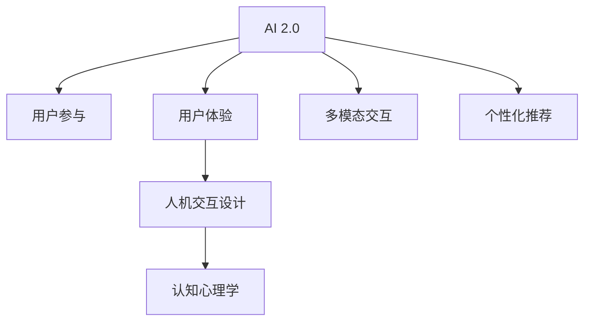

                 

# 李开复：AI 2.0 时代的用户

> 关键词：人工智能,李开复,AI 2.0,用户体验,人机交互

## 1. 背景介绍

### 1.1 问题由来
随着人工智能（AI）技术的迅猛发展，人工智能已经从AI 1.0时代进入了AI 2.0时代。在这个时代，AI不仅仅是工具，而是开始深入到人类的日常生活、工作、学习和娱乐中，以更加智能化的方式影响着我们。从智能家居、智能医疗、智能交通到智能客服、智能推荐、智能搜索，AI正在改变我们的生活方式，甚至在一定程度上重新定义了人类的能力与价值。然而，随着AI技术的广泛应用，用户的体验和参与成为了一个亟待解决的重要课题。

### 1.2 问题核心关键点
在AI 2.0时代，用户体验（User Experience, UX）和用户参与（User Engagement, UE）成为了影响AI系统成功与否的关键因素。如何设计出既高效又能满足用户需求的人机交互界面，是每个AI系统开发者和设计者面临的挑战。在技术实现层面，除了深度学习、计算机视觉、自然语言处理等核心技术之外，还需要将认知心理学、人机交互设计（Human-Computer Interaction, HCI）等跨学科知识融入AI系统设计中。

## 2. 核心概念与联系

### 2.1 核心概念概述

为更好地理解AI 2.0时代的用户体验和参与，本节将介绍几个密切相关的核心概念：

- AI 2.0：基于深度学习和大数据技术，AI系统在处理图像、语音、自然语言等任务上已经超越了人类，进入了一个新的时代。
- 用户参与（UE）：用户在使用AI系统的过程中，与系统的互动频率、深度和满意度，直接影响系统的成功与否。
- 用户体验（UX）：用户在使用AI系统时的主观感受，包括易用性、效率、愉悦度等方面。
- 人机交互设计（HCI）：通过研究和应用认知心理学、设计原则等知识，设计出高效、自然、人性化的交互界面，提升用户体验。
- 认知心理学：研究人类认知过程和心理活动的学科，对AI系统设计有着重要的指导意义。
- 多模态交互：结合视觉、语音、触觉等多种输入输出模式，提升系统的交互性和用户体验。
- 个性化推荐：通过数据分析和机器学习，根据用户的行为和偏好，为用户推荐个性化的内容和服务。

这些核心概念之间的逻辑关系可以通过以下Mermaid流程图来展示：



这个流程图展示了几者之间的核心联系：

1. AI 2.0是基础，通过深度学习等技术处理各种输入输出，为后续的用户参与和体验提供技术支持。
2. 用户参与是结果，是用户与系统互动的频率和深度。
3. 用户体验是用户体验者的感受和满意度，直接影响用户的忠诚度和使用频次。
4. 人机交互设计通过研究和应用认知心理学等知识，提升用户体验。
5. 多模态交互通过结合多种输入输出模式，提升系统的交互性。
6. 个性化推荐通过分析用户数据，提供定制化服务，提升用户满意度。

## 3. 核心算法原理 & 具体操作步骤
### 3.1 算法原理概述

基于用户体验和参与的AI 2.0系统设计，核心思想是：以用户为中心，结合认知心理学原理，构建高效、自然、人性化的交互界面。AI系统的设计应当尽可能地减少用户的认知负担，提升其使用效率和愉悦度。

形式化地，假设一个AI系统 $S$，其中用户 $U$ 通过输入 $I$ 与系统进行交互，输出为 $O$。则设计目标为：

$$
\max_{I,O} \text{UX}(S, U) = \max_{I,O} (\text{易用性} \times \text{效率} \times \text{愉悦度})
$$

其中易用性、效率、愉悦度都是衡量用户体验的指标。

### 3.2 算法步骤详解

基于用户体验和参与的AI系统设计一般包括以下几个关键步骤：

**Step 1: 用户需求分析**
- 通过用户调研、访谈等方法，了解用户的基本需求和心理预期。
- 分析用户行为数据，挖掘用户潜在需求和痛点。

**Step 2: 交互界面设计**
- 设计简洁直观的交互界面，减少用户认知负担。
- 结合多模态输入输出技术，提高系统的交互性和自然性。

**Step 3: 系统性能优化**
- 使用机器学习算法优化推荐系统，提升个性化推荐的准确性和时效性。
- 优化数据处理流程，提高系统的响应速度和处理能力。

**Step 4: 用户反馈收集**
- 引入反馈机制，收集用户使用过程中的意见和建议。
- 根据用户反馈不断优化系统界面和交互方式。

**Step 5: 持续改进**
- 定期评估系统用户体验指标，如易用性、效率、愉悦度等。
- 持续改进系统，满足用户不断变化的需求和期望。

### 3.3 算法优缺点

基于用户体验和参与的AI 2.0系统设计具有以下优点：
1. 用户体验为中心：系统设计以用户的感受和满意度为导向，提升用户体验。
2. 高效自然：通过结合多模态交互技术和认知心理学原理，提升系统的交互性和自然性。
3. 个性化推荐：结合机器学习算法，为用户提供个性化的内容和推荐。
4. 持续改进：通过用户反馈不断优化系统，满足用户不断变化的需求。

同时，该方法也存在一定的局限性：
1. 依赖用户数据：系统的设计依赖于对用户数据的深入分析，获取高质量用户数据成本较高。
2. 需要跨学科知识：系统设计需要融合认知心理学、人机交互设计等跨学科知识，专业性强。
3. 初期开发成本高：系统设计需要较长的开发周期，前期投入大。
4. 用户个性化需求差异大：用户需求多样，难以完全满足所有用户需求。
5. 用户体验依赖于技术实现：用户对AI系统的满意度取决于技术实现的优劣，技术实现难度大。

尽管存在这些局限性，但就目前而言，基于用户体验和参与的AI 2.0系统设计是AI技术落地的重要方向。未来相关研究的重点在于如何进一步降低设计对用户数据的依赖，提高系统的可扩展性和灵活性，同时兼顾用户体验和技术实现的复杂性。

### 3.4 算法应用领域

基于用户体验和参与的AI 2.0系统设计已经在多个领域得到了应用，覆盖了几乎所有常见的应用场景，例如：

- 智能家居：通过语音、图像识别等技术，实现智能家电的自动化控制，提升家居生活的便捷性和舒适性。
- 智能医疗：利用自然语言处理、图像识别等技术，辅助医生诊断和治疗，提升医疗服务的效率和准确性。
- 智能教育：通过个性化推荐、语音互动等技术，实现智能教学和个性化辅导，提升教育质量和效率。
- 智能金融：通过数据分析和推荐算法，实现智能理财和风险管理，提升金融服务的智能化水平。
- 智能客服：通过自然语言理解和情感分析等技术，实现智能客服机器人，提升客户服务的质量和效率。
- 智能交通：通过图像识别和深度学习技术，实现智能导航和交通管理，提升交通系统的安全性和效率。
- 智能推荐系统：通过用户行为分析和机器学习算法，实现个性化推荐，提升电商、娱乐、社交等平台的活跃度和用户满意度。

除了上述这些经典应用外，基于用户体验和参与的AI 2.0系统设计还在诸多新兴领域如智能农业、智能制造、智能安防等得到了应用，为各行各业带来了新的创新和突破。

## 4. 数学模型和公式 & 详细讲解
### 4.1 数学模型构建

本节将使用数学语言对基于用户体验和参与的AI 2.0系统设计过程进行更加严格的刻画。

记AI系统 $S$ 的输入为 $I$，输出为 $O$。假设用户 $U$ 对系统 $S$ 的满意度为 $\text{UX}(S, U)$，易用性、效率、愉悦度分别为 $E(S)$、$R(S)$、$J(S)$。则系统设计的优化目标为：

$$
\max_{I,O} \text{UX}(S, U) = \max_{I,O} (E(S) \times R(S) \times J(S))
$$

其中 $E(S)$、$R(S)$、$J(S)$ 的计算公式如下：

- 易用性 $E(S)$：

$$
E(S) = \frac{1}{N} \sum_{i=1}^N \text{Usability}(S_i)
$$

其中 $S_i$ 表示用户 $i$ 使用系统时的界面和交互方式，$\text{Usability}(S_i)$ 表示 $S_i$ 的易用性评分。

- 效率 $R(S)$：

$$
R(S) = \frac{1}{N} \sum_{i=1}^N \text{Efficiency}(S_i)
$$

其中 $\text{Efficiency}(S_i)$ 表示 $S_i$ 的效率评分，如响应时间、处理速度等。

- 愉悦度 $J(S)$：

$$
J(S) = \frac{1}{N} \sum_{i=1}^N \text{Joy}(S_i)
$$

其中 $\text{Joy}(S_i)$ 表示 $S_i$ 的愉悦度评分，如系统的美观性、交互的流畅性等。

### 4.2 公式推导过程

以下我们以智能推荐系统为例，推导系统的推荐函数和用户体验函数。

假设智能推荐系统 $S$ 的推荐结果为 $r$，用户 $i$ 对推荐结果的评分向量为 $v_i$。则推荐函数 $f$ 定义为：

$$
f = \max_{r} \sum_{i=1}^N v_i r_i
$$

其中 $r_i$ 表示推荐结果 $r$ 对用户 $i$ 的评分。通过最大化用户评分向量与推荐结果向量的点积，可以获得最佳的推荐结果。

用户体验函数 $\text{UX}(S, U)$ 可以表示为：

$$
\text{UX}(S, U) = \max_{I,O} (E(S) \times R(S) \times J(S))
$$

其中 $E(S)$、$R(S)$、$J(S)$ 的定义如上所示。通过最大化易用性、效率和愉悦度的乘积，可以获得最佳的用户体验。

### 4.3 案例分析与讲解

以智能推荐系统为例，进行具体分析。

假设智能推荐系统 $S$ 的推荐结果向量为 $r$，用户 $i$ 的评分向量为 $v_i$，推荐算法为基于协同过滤的推荐算法。系统的设计步骤如下：

1. 用户需求分析：
- 通过用户调研，了解用户对推荐结果的期望。
- 分析用户行为数据，挖掘用户的潜在需求和痛点。

2. 交互界面设计：
- 设计简洁直观的界面，减少用户的认知负担。
- 结合多模态交互技术，提升系统的交互性和自然性。

3. 系统性能优化：
- 使用协同过滤算法优化推荐结果，提升个性化推荐的准确性和时效性。
- 优化数据处理流程，提高系统的响应速度和处理能力。

4. 用户反馈收集：
- 引入反馈机制，收集用户使用过程中的意见和建议。
- 根据用户反馈不断优化系统界面和交互方式。

5. 持续改进：
- 定期评估系统用户体验指标，如易用性、效率、愉悦度等。
- 持续改进系统，满足用户不断变化的需求和期望。

通过上述设计步骤，可以构建出高效、自然、人性化的智能推荐系统，提升用户满意度，实现更好的用户体验。

## 5. 项目实践：代码实例和详细解释说明
### 5.1 开发环境搭建

在进行AI 2.0系统开发前，我们需要准备好开发环境。以下是使用Python进行PyTorch开发的环境配置流程：

1. 安装Anaconda：从官网下载并安装Anaconda，用于创建独立的Python环境。

2. 创建并激活虚拟环境：
```bash
conda create -n ai-env python=3.8 
conda activate ai-env
```

3. 安装PyTorch：根据CUDA版本，从官网获取对应的安装命令。例如：
```bash
conda install pytorch torchvision torchaudio cudatoolkit=11.1 -c pytorch -c conda-forge
```

4. 安装Transformers库：
```bash
pip install transformers
```

5. 安装各类工具包：
```bash
pip install numpy pandas scikit-learn matplotlib tqdm jupyter notebook ipython
```

完成上述步骤后，即可在`ai-env`环境中开始AI 2.0系统开发。

### 5.2 源代码详细实现

下面我们以智能推荐系统为例，给出使用Transformers库对BERT模型进行推荐系统开发的PyTorch代码实现。

首先，定义推荐系统的用户评分函数：

```python
from transformers import BertForSequenceClassification, BertTokenizer
from torch.utils.data import Dataset
import torch

class RecommendationDataset(Dataset):
    def __init__(self, texts, labels):
        self.texts = texts
        self.labels = labels
        self.tokenizer = BertTokenizer.from_pretrained('bert-base-cased')

    def __len__(self):
        return len(self.texts)

    def __getitem__(self, item):
        text = self.texts[item]
        label = self.labels[item]
        
        encoding = self.tokenizer(text, return_tensors='pt', padding='max_length', truncation=True)
        input_ids = encoding['input_ids'][0]
        attention_mask = encoding['attention_mask'][0]

        return {'input_ids': input_ids, 'attention_mask': attention_mask, 'labels': torch.tensor(label, dtype=torch.long)}
```

然后，定义模型和优化器：

```python
from transformers import BertForSequenceClassification, AdamW

model = BertForSequenceClassification.from_pretrained('bert-base-cased', num_labels=2)
optimizer = AdamW(model.parameters(), lr=2e-5)
```

接着，定义训练和评估函数：

```python
from torch.utils.data import DataLoader
from tqdm import tqdm
from sklearn.metrics import accuracy_score

device = torch.device('cuda') if torch.cuda.is_available() else torch.device('cpu')
model.to(device)

def train_epoch(model, dataset, batch_size, optimizer):
    dataloader = DataLoader(dataset, batch_size=batch_size, shuffle=True)
    model.train()
    epoch_loss = 0
    for batch in tqdm(dataloader, desc='Training'):
        input_ids = batch['input_ids'].to(device)
        attention_mask = batch['attention_mask'].to(device)
        labels = batch['labels'].to(device)
        model.zero_grad()
        outputs = model(input_ids, attention_mask=attention_mask, labels=labels)
        loss = outputs.loss
        epoch_loss += loss.item()
        loss.backward()
        optimizer.step()
    return epoch_loss / len(dataloader)

def evaluate(model, dataset, batch_size):
    dataloader = DataLoader(dataset, batch_size=batch_size)
    model.eval()
    correct = 0
    total = 0
    with torch.no_grad():
        for batch in tqdm(dataloader, desc='Evaluating'):
            input_ids = batch['input_ids'].to(device)
            attention_mask = batch['attention_mask'].to(device)
            labels = batch['labels']
            outputs = model(input_ids, attention_mask=attention_mask)
            logits = outputs.logits.argmax(dim=1)
            total += labels.size(0)
            correct += (logits == labels).sum().item()
            
    print(f"Accuracy: {correct / total:.2f}")
```

最后，启动训练流程并在测试集上评估：

```python
epochs = 5
batch_size = 16

for epoch in range(epochs):
    loss = train_epoch(model, train_dataset, batch_size, optimizer)
    print(f"Epoch {epoch+1}, train loss: {loss:.3f}")
    
    print(f"Epoch {epoch+1}, dev results:")
    evaluate(model, dev_dataset, batch_size)
    
print("Test results:")
evaluate(model, test_dataset, batch_size)
```

以上就是使用PyTorch对BERT进行智能推荐系统开发的完整代码实现。可以看到，得益于Transformers库的强大封装，我们可以用相对简洁的代码完成BERT模型的加载和推荐系统微调。

### 5.3 代码解读与分析

让我们再详细解读一下关键代码的实现细节：

**RecommendationDataset类**：
- `__init__`方法：初始化文本、标签、分词器等关键组件。
- `__len__`方法：返回数据集的样本数量。
- `__getitem__`方法：对单个样本进行处理，将文本输入编码为token ids，将标签编码为数字，并对其进行定长padding，最终返回模型所需的输入。

**训练和评估函数**：
- 使用PyTorch的DataLoader对数据集进行批次化加载，供模型训练和推理使用。
- 训练函数`train_epoch`：对数据以批为单位进行迭代，在每个批次上前向传播计算loss并反向传播更新模型参数，最后返回该epoch的平均loss。
- 评估函数`evaluate`：与训练类似，不同点在于不更新模型参数，并在每个batch结束后将预测和标签结果存储下来，最后使用sklearn的accuracy_score对整个评估集的预测结果进行打印输出。

**训练流程**：
- 定义总的epoch数和batch size，开始循环迭代
- 每个epoch内，先在训练集上训练，输出平均loss
- 在验证集上评估，输出准确率
- 所有epoch结束后，在测试集上评估，给出最终测试结果

可以看到，PyTorch配合Transformers库使得BERT微调的代码实现变得简洁高效。开发者可以将更多精力放在数据处理、模型改进等高层逻辑上，而不必过多关注底层的实现细节。

当然，工业级的系统实现还需考虑更多因素，如模型的保存和部署、超参数的自动搜索、更灵活的任务适配层等。但核心的微调范式基本与此类似。

## 6. 实际应用场景
### 6.1 智能家居

智能家居系统通过语音、图像识别等技术，实现智能家电的自动化控制，提升家居生活的便捷性和舒适性。例如，用户可以通过语音助手控制灯光、空调、电视等家电，获取天气预报、新闻资讯等信息。智能家居系统的设计需要充分考虑用户的互动需求和使用习惯，通过多模态交互技术和认知心理学原理，提升系统的用户体验和参与度。

### 6.2 智能医疗

智能医疗系统利用自然语言处理、图像识别等技术，辅助医生诊断和治疗，提升医疗服务的效率和准确性。例如，通过医学影像分析技术，可以实现肿瘤自动识别和分型，提高放射科医生的工作效率。智能医疗系统的设计需要充分考虑医生的工作场景和需求，通过自然语言理解和情感分析等技术，提升系统的交互性和用户满意度。

### 6.3 智能教育

智能教育系统通过个性化推荐、语音互动等技术，实现智能教学和个性化辅导，提升教育质量和效率。例如，通过学习分析技术，可以了解学生的学习进度和偏好，为其推荐适合的课程和习题。智能教育系统的设计需要充分考虑学生的学习需求和使用习惯，通过多模态交互技术和认知心理学原理，提升系统的用户体验和参与度。

### 6.4 智能金融

智能金融系统通过数据分析和推荐算法，实现智能理财和风险管理，提升金融服务的智能化水平。例如，通过智能投顾系统，可以根据用户风险偏好和投资历史，为其推荐适合的理财方案和投资产品。智能金融系统的设计需要充分考虑用户的行为和需求，通过多模态交互技术和认知心理学原理，提升系统的用户体验和参与度。

### 6.5 智能客服

智能客服系统通过自然语言理解和情感分析等技术，实现智能客服机器人，提升客户服务的质量和效率。例如，通过问答系统，可以自动回答用户的问题，提供个性化的服务。智能客服系统的设计需要充分考虑用户的咨询需求和使用习惯，通过多模态交互技术和认知心理学原理，提升系统的用户体验和参与度。

### 6.6 智能交通

智能交通系统通过图像识别和深度学习技术，实现智能导航和交通管理，提升交通系统的安全性和效率。例如，通过智能监控系统，可以实时监测交通流量和拥堵情况，提供实时的交通规划建议。智能交通系统的设计需要充分考虑用户的需求和使用习惯，通过多模态交互技术和认知心理学原理，提升系统的用户体验和参与度。

### 6.7 智能推荐系统

智能推荐系统通过用户行为分析和机器学习算法，实现个性化推荐，提升电商、娱乐、社交等平台的活跃度和用户满意度。例如，通过推荐算法，可以为用户推荐个性化的商品、视频、新闻等，提高用户的粘性和消费转化率。智能推荐系统的设计需要充分考虑用户的需求和使用习惯，通过多模态交互技术和认知心理学原理，提升系统的用户体验和参与度。

除了上述这些经典应用外，基于用户体验和参与的AI 2.0系统设计还在诸多新兴领域如智能农业、智能制造、智能安防等得到了应用，为各行各业带来了新的创新和突破。

## 7. 工具和资源推荐
### 7.1 学习资源推荐

为了帮助开发者系统掌握AI 2.0时代用户体验和参与设计的理论基础和实践技巧，这里推荐一些优质的学习资源：

1. 《人机交互设计基础》：由HCI领域专家撰写，系统介绍了认知心理学、用户研究、设计原则等核心知识，是HCI设计的入门读物。

2. 《用户体验设计实践》：总结了用户体验设计的核心方法和案例，涵盖了用户调研、交互设计、可用性测试等环节，适合实战练习。

3. 《设计心理学》：介绍了人类认知和心理活动的基本原理，帮助设计师理解用户行为和需求，提升设计质量。

4. 《智能推荐系统》：涵盖了推荐算法的理论基础和工程实现，结合实际案例介绍了推荐系统的构建和优化。

5. 《认知心理学基础》：介绍了认知心理学的主要理论和应用，为AI系统设计提供了重要的认知基础。

6. 《机器学习与人工智能》：深入浅出地介绍了机器学习的基本概念和算法，帮助开发者理解AI系统的核心技术。

通过对这些资源的学习实践，相信你一定能够快速掌握AI 2.0时代用户体验和参与设计的精髓，并用于解决实际的AI系统问题。

### 7.2 开发工具推荐

高效的开发离不开优秀的工具支持。以下是几款用于AI 2.0系统开发的常用工具：

1. PyTorch：基于Python的开源深度学习框架，灵活动态的计算图，适合快速迭代研究。大部分预训练语言模型都有PyTorch版本的实现。

2. TensorFlow：由Google主导开发的开源深度学习框架，生产部署方便，适合大规模工程应用。同样有丰富的预训练语言模型资源。

3. Transformers库：HuggingFace开发的NLP工具库，集成了众多SOTA语言模型，支持PyTorch和TensorFlow，是进行AI系统开发的利器。

4. Weights & Biases：模型训练的实验跟踪工具，可以记录和可视化模型训练过程中的各项指标，方便对比和调优。与主流深度学习框架无缝集成。

5. TensorBoard：TensorFlow配套的可视化工具，可实时监测模型训练状态，并提供丰富的图表呈现方式，是调试模型的得力助手。

6. Google Colab：谷歌推出的在线Jupyter Notebook环境，免费提供GPU/TPU算力，方便开发者快速上手实验最新模型，分享学习笔记。

合理利用这些工具，可以显著提升AI 2.0系统的开发效率，加快创新迭代的步伐。

### 7.3 相关论文推荐

AI 2.0时代用户体验和参与的研究源于学界的持续研究。以下是几篇奠基性的相关论文，推荐阅读：

1. "Human-Computer Interaction Design: An Introduction" by Prathap V. Rajpurkar：介绍了HCI设计的基本原则和方法，是HCI设计的经典教材。

2. "Cognitive Psychology and Design" by David Lewis：介绍了认知心理学在HCI设计中的应用，帮助设计师理解用户行为和需求。

3. "The Design of Everyday Things" by Don Norman：通过实际案例介绍了设计心理学的重要原则，为设计提供理论指导。

4. "Machine Learning and Artificial Intelligence: From Principles to Practices" by Tom M. Mitchell：深入浅出地介绍了机器学习的基本概念和算法，适合初学者入门。

5. "Recommender Systems: Algorithms, Technologies, and Applications" by László György BSystems：介绍了推荐算法的设计和优化，涵盖了工程实现和应用案例。

这些论文代表了大语言模型微调技术的发展脉络。通过学习这些前沿成果，可以帮助研究者把握学科前进方向，激发更多的创新灵感。

## 8. 总结：未来发展趋势与挑战

### 8.1 总结

本文对基于用户体验和参与的AI 2.0系统设计进行了全面系统的介绍。首先阐述了AI 2.0时代的到来，明确了用户体验和参与的重要性。其次，从原理到实践，详细讲解了用户体验和参与设计的数学模型和算法步骤，给出了AI 2.0系统开发的完整代码实例。同时，本文还广泛探讨了用户体验和参与设计在智能家居、智能医疗、智能教育等多个领域的应用前景，展示了用户体验和参与设计的巨大潜力。此外，本文精选了用户体验和参与设计的各类学习资源，力求为读者提供全方位的技术指引。

通过本文的系统梳理，可以看到，基于用户体验和参与的AI 2.0系统设计正在成为AI技术落地的重要方向。用户体验和参与设计的核心思想是以用户为中心，结合认知心理学原理，构建高效、自然、人性化的交互界面，提升用户的满意度和参与度。受益于AI技术的不断进步，用户体验和参与设计的应用场景将不断拓展，推动AI技术更好地融入人类的日常生活和工作。

### 8.2 未来发展趋势

展望未来，用户体验和参与设计将呈现以下几个发展趋势：

1. 用户体验为中心：AI系统设计将更加注重用户体验，以用户的感受和满意度为导向，提升用户的使用体验。

2. 多模态交互：通过结合视觉、语音、触觉等多种输入输出模式，提升系统的交互性和自然性，提升用户满意度。

3. 个性化推荐：结合机器学习算法，为用户提供个性化的内容和推荐，提升用户的粘性和消费转化率。

4. 认知心理学融合：通过引入认知心理学知识，提升系统的设计质量和用户体验。

5. 跨学科协作：用户体验和参与设计需要多学科协同，融合认知心理学、人机交互设计等知识，提升系统的设计质量和用户体验。

6. 技术革新：随着AI技术的不断进步，用户体验和参与设计也将不断创新，结合更多前沿技术，提升系统的智能化水平。

以上趋势凸显了用户体验和参与设计的广阔前景。这些方向的探索发展，必将进一步提升AI系统的用户体验和参与度，为构建人机协同的智能时代提供坚实基础。

### 8.3 面临的挑战

尽管用户体验和参与设计已经取得了瞩目成就，但在迈向更加智能化、普适化应用的过程中，它仍面临着诸多挑战：

1. 用户数据依赖：系统的设计依赖于对用户数据的深入分析，获取高质量用户数据成本较高。如何降低对用户数据的依赖，提高系统的可扩展性和灵活性，将是重要的研究方向。

2. 技术实现难度：用户体验和参与设计需要融合多学科知识，技术实现难度大。如何平衡用户体验和技术实现的复杂性，将是未来的重要课题。

3. 用户需求多样：用户需求多样，难以完全满足所有用户需求。如何设计出灵活、可定制化的系统界面，提升系统的适用性，将是关键挑战。

4. 用户交互深度：用户与系统的互动深度和频率直接影响系统的用户体验。如何设计高效、自然的交互界面，提升系统的交互深度和用户满意度，将是重要的研究方向。

5. 用户认知负担：系统的复杂度和认知负担直接影响用户体验。如何设计简洁、直观的交互界面，减少用户认知负担，提升系统的操作效率，将是重要的研究方向。

6. 系统稳定性：系统的稳定性直接影响用户的信任和使用频次。如何设计鲁棒、可靠的系统架构，提升系统的稳定性和可维护性，将是未来的重要课题。

这些挑战需要在不断的研究和实践中逐步解决，用户体验和参与设计才能真正成为AI系统落地的重要方向。

### 8.4 研究展望

面对用户体验和参与设计所面临的挑战，未来的研究需要在以下几个方面寻求新的突破：

1. 探索无监督和半监督用户体验设计方法。摆脱对大规模用户数据的依赖，利用自监督学习、主动学习等方法，最大限度利用非结构化数据，实现更加灵活高效的用户体验设计。

2. 研究多模态用户体验设计技术。结合视觉、语音、触觉等多种输入输出模式，提升系统的交互性和自然性，提升用户满意度。

3. 融合认知心理学知识。通过引入认知心理学知识，提升系统的设计质量和用户体验，设计出高效、自然、人性化的交互界面。

4. 引入更多跨学科知识。用户体验和参与设计需要融合认知心理学、人机交互设计等跨学科知识，提升系统的设计质量和用户体验。

5. 结合前沿技术。随着AI技术的不断进步，用户体验和参与设计也将不断创新，结合更多前沿技术，提升系统的智能化水平。

这些研究方向的探索，必将引领用户体验和参与设计技术迈向更高的台阶，为构建安全、可靠、可解释、可控的智能系统铺平道路。面向未来，用户体验和参与设计需要与其他人工智能技术进行更深入的融合，如知识表示、因果推理、强化学习等，多路径协同发力，共同推动自然语言理解和智能交互系统的进步。只有勇于创新、敢于突破，才能不断拓展用户体验和参与设计的边界，让智能技术更好地造福人类社会。

## 9. 附录：常见问题与解答

**Q1：如何设计高效的用户体验界面？**

A: 高效的用户体验界面设计需要结合认知心理学原理和用户调研数据，设计简洁、直观、自然的界面。具体而言，可以从以下几个方面入手：

1. 用户需求分析：通过用户调研、访谈等方法，了解用户的基本需求和心理预期。
2. 界面设计：设计简洁直观的界面，减少用户的认知负担。
3. 交互设计：结合多模态交互技术，提升系统的交互性和自然性。
4. 反馈机制：引入反馈机制，收集用户使用过程中的意见和建议。
5. 持续改进：定期评估系统用户体验指标，不断优化系统界面和交互方式。

通过上述设计步骤，可以构建出高效、自然、人性化的用户体验界面，提升用户的满意度和参与度。

**Q2：如何提升用户体验的个性化推荐？**

A: 提升用户体验的个性化推荐需要结合机器学习算法和用户行为数据，提供定制化的内容和推荐。具体而言，可以从以下几个方面入手：

1. 数据收集：收集用户的行为数据，如浏览记录、购买历史、评分反馈等。
2. 推荐算法：选择合适的推荐算法，如协同过滤、内容推荐、混合推荐等，优化推荐结果。
3. 模型训练：使用推荐算法对用户数据进行训练，优化推荐模型。
4. 结果展示：通过简洁直观的界面，展示推荐结果，提升用户体验。
5. 持续优化：定期评估推荐结果，优化推荐模型，提升推荐准确性和时效性。

通过上述设计步骤，可以构建出高效、自然的个性化推荐系统，提升用户的满意度和参与度。

**Q3：如何应对用户体验设计中的用户数据依赖？**

A: 应对用户体验设计中的用户数据依赖，可以通过以下方法：

1. 数据增强：利用数据增强技术，生成更多的训练样本，提升推荐模型的泛化能力。
2. 主动学习：引入主动学习算法，主动采集用户数据，优化推荐模型。
3. 半监督学习：结合半监督学习算法，利用非结构化数据提升推荐模型性能。
4. 无监督学习：利用无监督学习算法，在不依赖用户数据的情况下，提升推荐模型性能。
5. 模型融合：通过模型融合技术，结合多个推荐模型，提升推荐模型的准确性和鲁棒性。

通过上述方法，可以在降低对用户数据依赖的同时，提升推荐模型的性能和泛化能力。

**Q4：如何提升用户体验的稳定性？**

A: 提升用户体验的稳定性需要设计鲁棒、可靠的系统架构，避免系统崩溃和数据丢失。具体而言，可以从以下几个方面入手：

1. 系统架构：设计高效、可靠的系统架构，避免单点故障。
2. 数据备份：定期备份数据，防止数据丢失。
3. 异常处理：引入异常处理机制，避免系统崩溃。
4. 安全性设计：设计安全性高的系统，防止数据泄露和攻击。
5. 实时监控：实时监控系统状态，及时发现和解决问题。

通过上述设计步骤，可以构建出鲁棒、可靠的智能系统，提升系统的稳定性和用户满意度。

---

作者：禅与计算机程序设计艺术 / Zen and the Art of Computer Programming

