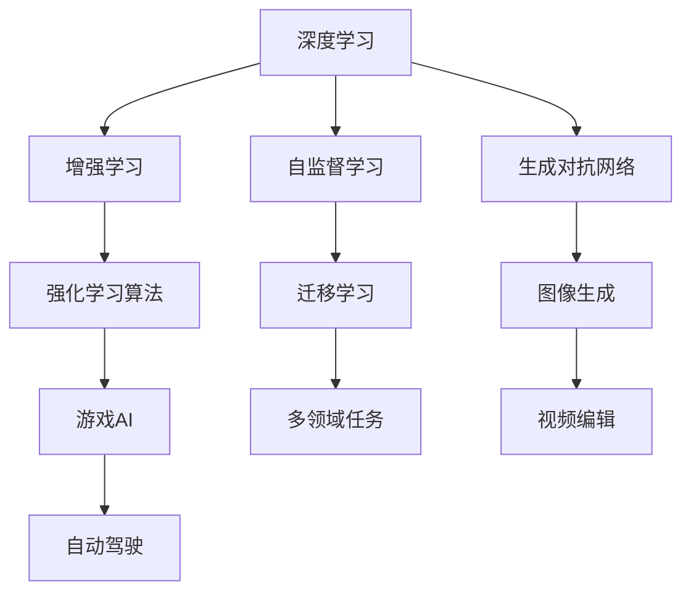

                 

# 李开复：AI 2.0 时代的社会价值

## 1. 背景介绍

### 1.1 问题由来

随着人工智能(AI)技术的快速发展，人工智能已经从AI 1.0 时代的规则驱动、专家系统向 AI 2.0 时代的深度学习和数据驱动转型。李开复在《AI 2.0: 人工智能赋能人类》一书中提出，AI 2.0 时代的 AI 将更加智能、高效、可控，并将在医疗、教育、交通、环境保护等多个领域中发挥巨大作用，为社会带来深远的变革。

## 2. 核心概念与联系

### 2.1 核心概念概述

AI 2.0 时代的核心概念包括：

- 深度学习(Deep Learning)：基于深度神经网络的学习范式，能够自动从数据中学习复杂的特征表示，广泛应用于图像识别、语音识别、自然语言处理等领域。
- 增强学习(R强化学习)：通过智能体在环境中不断试错学习，优化策略决策，广泛应用于游戏、机器人控制、自动驾驶等领域。
- 生成对抗网络(GANs)：由生成器和判别器两个网络组成，通过对抗博弈训练，生成高质量的虚假数据，应用于图像生成、视频编辑、自然语言生成等领域。
- 自监督学习(Self-Supervised Learning)：利用数据中的自相关性进行学习，无需大量标注数据，广泛应用于特征学习、语言模型训练等领域。
- 迁移学习(Transfer Learning)：将在一个任务上学习到的知识迁移到另一个相关任务上，减少对标注数据的依赖，广泛应用于多领域、多模态任务中。

这些核心概念之间的逻辑关系可以通过以下 Mermaid 流程图来展示：



## 3. 核心算法原理 & 具体操作步骤

### 3.1 算法原理概述

AI 2.0 时代的深度学习算法，通常基于多层神经网络结构，通过反向传播算法优化模型参数，使得模型能够自动从大量数据中学习到有效的特征表示。其主要算法包括：

- 前馈神经网络(Feedforward Neural Network, FNN)：通过多层次的非线性变换，将输入映射到输出。
- 卷积神经网络(Convolutional Neural Network, CNN)：利用卷积层提取空间局部特征，广泛应用于图像识别、计算机视觉等领域。
- 循环神经网络(Recurrent Neural Network, RNN)：通过循环结构处理序列数据，广泛应用于自然语言处理、语音识别等领域。
- 长短期记忆网络(Long Short-Term Memory, LSTM)：通过门控机制解决梯度消失问题，适用于长时间序列数据的处理。
- 生成对抗网络(GANs)：通过生成器和判别器两个网络进行对抗博弈，生成高质量的虚假数据，应用于图像生成、视频编辑等领域。

AI 2.0 时代的增强学习算法，通常基于智能体在环境中的交互，通过试错学习优化策略决策。其主要算法包括：

- 蒙特卡洛树搜索(Monte Carlo Tree Search, MCTS)：通过模拟搜索来优化决策，广泛应用于游戏AI、机器人控制等领域。
- Q-learning：基于Q值的策略优化算法，广泛应用于强化学习中。
- Deep Q-learning：将深度神经网络引入Q-learning中，提升学习效率，广泛应用于自动驾驶、机器人等领域。

AI 2.0 时代的生成对抗网络算法，通过生成器和判别器两个网络进行对抗博弈，生成高质量的虚假数据。其主要算法包括：

- 生成器网络(Generator)：通过多层神经网络生成虚假数据，应用于图像生成、视频编辑等领域。
- 判别器网络(Discriminator)：通过多层神经网络判断数据的真伪，应用于图像生成、视频编辑等领域。
- CycleGAN：通过跨域对齐实现图像转换，应用于图像风格转换、图像修复等领域。

AI 2.0 时代的自监督学习算法，利用数据中的自相关性进行学习，无需大量标注数据。其主要算法包括：

- 数据增强(Data Augmentation)：通过随机变换数据，扩充训练集，提升模型的泛化能力，广泛应用于图像识别、自然语言处理等领域。
- 自编码器(Autocoder)：通过重构输入数据，学习数据的压缩表示，广泛应用于特征学习、异常检测等领域。
- 预训练语言模型(Pre-trained Language Model)：通过大规模语料预训练，学习语言通用表示，广泛应用于自然语言处理等领域。

### 3.2 算法步骤详解

AI 2.0 时代的深度学习算法步骤如下：

1. 数据准备：收集和预处理大量标注数据，划分为训练集、验证集和测试集。
2. 模型构建：选择合适的深度神经网络结构，并定义损失函数和优化算法。
3. 模型训练：将训练集数据分批次输入模型，前向传播计算损失函数，反向传播计算参数梯度，更新模型参数。
4. 模型评估：在验证集上评估模型性能，根据性能指标调整模型超参数。
5. 模型部署：将训练好的模型应用于实际应用中，进行推理和预测。

AI 2.0 时代的增强学习算法步骤如下：

1. 环境定义：定义智能体需要交互的环境，包括状态、行动、奖励等。
2. 智能体设计：设计智能体的决策策略和行为规则。
3. 学习算法选择：选择适合的强化学习算法，如Q-learning、Deep Q-learning等。
4. 训练过程：通过试错学习优化智能体策略，最大化累计奖励。
5. 测试过程：在测试环境中评估智能体性能，验证学习效果。

AI 2.0 时代的生成对抗网络算法步骤如下：

1. 生成器设计：设计生成器网络结构，生成高质量的虚假数据。
2. 判别器设计：设计判别器网络结构，判断数据的真伪。
3. 对抗博弈训练：通过生成器和判别器的对抗博弈训练，优化模型参数。
4. 模型应用：将训练好的生成器应用于数据生成、图像转换等领域。

### 3.3 算法优缺点

AI 2.0 时代的深度学习算法优点包括：

- 高效自动化：通过数据驱动的模型训练，自动发现数据的特征表示，避免手动提取特征。
- 灵活多样：适用于各种类型的数据，如图像、文本、声音等。
- 精度高：通过多层非线性变换，能够学习复杂的特征表示，提升模型精度。

其缺点包括：

- 数据依赖：需要大量标注数据进行训练，数据获取成本高。
- 计算资源消耗大：大规模深度神经网络需要大量计算资源进行训练和推理。
- 模型复杂：深度神经网络模型结构复杂，难以解释和调试。

AI 2.0 时代的增强学习算法优点包括：

- 自适应：智能体能够在不断试错中适应复杂环境，提升决策能力。
- 自动化：通过自动化学习过程，无需人工干预。
- 鲁棒性：通过智能体的多轮学习，能够应对环境的动态变化。

其缺点包括：

- 数据需求高：需要大量环境数据进行训练，数据获取成本高。
- 训练时间长：智能体需要不断试错学习，训练时间较长。
- 模型难以解释：智能体的决策过程难以解释和调试。

AI 2.0 时代的生成对抗网络算法优点包括：

- 高效生成：能够高效生成高质量的虚假数据，应用于图像生成、视频编辑等领域。
- 多样化：能够生成多样化的数据，满足不同应用需求。
- 鲁棒性：通过对抗博弈训练，能够生成高质量的虚假数据。

其缺点包括：

- 计算资源消耗大：生成器和判别器的对抗博弈训练需要大量计算资源。
- 生成数据质量依赖生成器网络：生成器网络的设计和训练质量直接影响生成数据的质量。
- 生成数据真实性难以保障：生成的虚假数据可能存在失真、误导等问题。

### 3.4 算法应用领域

AI 2.0 时代的深度学习算法在医疗、教育、交通、环境保护等多个领域中发挥巨大作用：

- 医疗领域：通过深度学习算法，实现疾病诊断、治疗方案推荐、药物研发等应用。
- 教育领域：通过深度学习算法，实现个性化推荐、作业批改、情感分析等应用。
- 交通领域：通过深度学习算法，实现自动驾驶、交通流量预测、智能交通管理等应用。
- 环境保护领域：通过深度学习算法，实现气候变化预测、环境监测、资源管理等应用。

AI 2.0 时代的增强学习算法在智能机器人、自动驾驶、游戏AI等领域中发挥重要作用：

- 智能机器人领域：通过增强学习算法，实现机器人控制、路径规划、避障等应用。
- 自动驾驶领域：通过增强学习算法，实现自动驾驶、交通流量控制等应用。
- 游戏AI领域：通过增强学习算法，实现游戏AI、对战策略优化等应用。

AI 2.0 时代的生成对抗网络算法在图像生成、视频编辑、自然语言生成等领域中发挥重要作用：

- 图像生成领域：通过生成对抗网络算法，实现图像风格转换、图像修复等应用。
- 视频编辑领域：通过生成对抗网络算法，实现视频合成、视频增强等应用。
- 自然语言生成领域：通过生成对抗网络算法，实现文本生成、对话生成等应用。

## 4. 数学模型和公式 & 详细讲解  
### 4.1 数学模型构建

AI 2.0 时代的深度学习算法通常基于多层神经网络结构，通过反向传播算法优化模型参数。假设神经网络模型的输入为 $x$，输出为 $y$，损失函数为 $L(y)$，模型参数为 $\theta$，则模型训练的目标是最小化损失函数：

$$
\theta^* = \mathop{\arg\min}_{\theta} L(y)
$$

其中，$L(y)$ 可以是交叉熵损失、均方误差损失等。模型训练的优化算法可以采用梯度下降、Adam、Adagrad 等。

AI 2.0 时代的增强学习算法通常基于智能体在环境中的交互，通过试错学习优化策略决策。假设智能体在环境中的状态为 $s$，行动为 $a$，奖励为 $r$，策略为 $\pi$，则智能体学习的目标是最小化累计奖励：

$$
J(\pi) = \mathop{\min}_{\pi} \mathbb{E}_{s,a \sim \pi} [\sum_{t=1}^T r_t]
$$

其中，$r_t$ 表示在第 $t$ 步的奖励。智能体学习的优化算法可以采用Q-learning、Deep Q-learning等。

AI 2.0 时代的生成对抗网络算法通常基于生成器和判别器的对抗博弈训练，生成高质量的虚假数据。假设生成器的输入为噪声 $z$，输出为虚假数据 $G(z)$，判别器的输入为真实数据 $x$ 和虚假数据 $G(z)$，输出为真伪判别 $D(x,G(z))$，则生成器学习的目标是最小化判别器的错误率，判别器的目标是最小化生成器输出的虚假数据概率：

$$
\min_G \max_D L_G(D,G)
$$

其中，$L_G(D,G)$ 是生成器和判别器的损失函数，可以采用对抗损失、生成损失等。

### 4.2 公式推导过程

以AI 2.0 时代的深度学习算法中的反向传播算法为例，推导其数学公式。假设神经网络模型由多层神经网络组成，第 $l$ 层的输出为 $h_l$，第 $l$ 层的参数为 $\theta_l$，则前向传播计算第 $l$ 层的输出为：

$$
h_l = \sigma(W_l h_{l-1} + b_l)
$$

其中，$\sigma$ 表示激活函数，$W_l$ 和 $b_l$ 分别表示第 $l$ 层的权重和偏置。

反向传播计算第 $l$ 层的损失函数对参数 $\theta_l$ 的梯度为：

$$
\frac{\partial L}{\partial \theta_l} = \frac{\partial L}{\partial h_l} \frac{\partial h_l}{\partial \theta_l}
$$

其中，$\frac{\partial h_l}{\partial \theta_l}$ 表示输出对参数的梯度。由于神经网络的前向传播是链式可导的，因此可以通过逐层反向传播计算所有参数的梯度，进而使用梯度下降算法更新模型参数。

### 4.3 案例分析与讲解

以AI 2.0 时代的深度学习算法中的卷积神经网络算法为例，分析其应用和特点。

卷积神经网络算法广泛应用于图像识别、计算机视觉等领域，通过卷积层提取空间局部特征，有效降低参数量，提升模型的泛化能力。假设卷积神经网络模型由多层卷积层和池化层组成，第 $l$ 层的输出为 $h_l$，第 $l$ 层的参数为 $\theta_l$，则前向传播计算第 $l$ 层的输出为：

$$
h_l = \sigma(W_l h_{l-1} + b_l)
$$

其中，$W_l$ 和 $b_l$ 分别表示第 $l$ 层的权重和偏置。

卷积层通过卷积操作提取局部特征，可以表示为：

$$
f_l(x_i) = \sum_{j=1}^k W_l(x_{i,j}, h_{l-1}) \ast h_{l-1}(x_i)
$$

其中，$x_i$ 表示输入数据，$W_l$ 表示卷积核，$\ast$ 表示卷积操作。池化层通过降采样操作降低特征图的维度，可以表示为：

$$
g_l(x_i) = \max_j W_l(x_{i,j}, h_{l-1}) \ast h_{l-1}(x_i)
$$

其中，$W_l$ 表示池化核。

卷积神经网络算法的优点包括：

- 高效性：卷积层能够高效提取局部特征，降低参数量。
- 泛化性：通过多层卷积和池化，能够学习到丰富的特征表示。
- 鲁棒性：通过卷积和池化操作，能够处理图像的平移、旋转、缩放等变化。

其缺点包括：

- 参数量大：卷积层和池化层的参数量较大，需要大量计算资源进行训练和推理。
- 计算复杂：卷积和池化操作计算复杂度较高，需要优化加速。
- 数据依赖：需要大量标注数据进行训练，数据获取成本高。

## 5. 项目实践：代码实例和详细解释说明

### 5.1 开发环境搭建

在进行AI 2.0 时代的深度学习算法开发前，我们需要准备好开发环境。以下是使用Python进行TensorFlow开发的环境配置流程：

1. 安装Anaconda：从官网下载并安装Anaconda，用于创建独立的Python环境。

2. 创建并激活虚拟环境：
```bash
conda create -n tf-env python=3.8 
conda activate tf-env
```

3. 安装TensorFlow：根据CUDA版本，从官网获取对应的安装命令。例如：
```bash
conda install tensorflow -c tf -c conda-forge
```

4. 安装各类工具包：
```bash
pip install numpy pandas scikit-learn matplotlib tqdm jupyter notebook ipython
```

完成上述步骤后，即可在`tf-env`环境中开始AI 2.0 时代的深度学习算法开发。

### 5.2 源代码详细实现

这里我们以卷积神经网络算法为例，给出使用TensorFlow进行卷积神经网络开发的PyTorch代码实现。

首先，定义卷积神经网络的结构：

```python
import tensorflow as tf

class CNN(tf.keras.Model):
    def __init__(self, num_classes):
        super(CNN, self).__init__()
        self.conv1 = tf.keras.layers.Conv2D(32, 3, activation='relu')
        self.maxpool = tf.keras.layers.MaxPooling2D()
        self.conv2 = tf.keras.layers.Conv2D(64, 3, activation='relu')
        self.maxpool2 = tf.keras.layers.MaxPooling2D()
        self.flatten = tf.keras.layers.Flatten()
        self.fc1 = tf.keras.layers.Dense(128, activation='relu')
        self.fc2 = tf.keras.layers.Dense(num_classes, activation='softmax')
        
    def call(self, inputs):
        x = self.conv1(inputs)
        x = self.maxpool(x)
        x = self.conv2(x)
        x = self.maxpool2(x)
        x = self.flatten(x)
        x = self.fc1(x)
        return self.fc2(x)
```

然后，定义模型和优化器：

```python
from tensorflow.keras.datasets import cifar10
from tensorflow.keras.utils import to_categorical

(train_images, train_labels), (test_images, test_labels) = cifar10.load_data()
train_images, test_images = train_images / 255.0, test_images / 255.0

train_labels = to_categorical(train_labels)
test_labels = to_categorical(test_labels)

model = CNN(10)

optimizer = tf.keras.optimizers.Adam()

def train_epoch(model, dataset, batch_size, optimizer):
    dataloader = tf.data.Dataset.from_tensor_slices(dataset).batch(batch_size)
    model.train()
    epoch_loss = 0
    for batch in dataloader:
        inputs, labels = batch
        model.zero_grad()
        outputs = model(inputs)
        loss = tf.keras.losses.categorical_crossentropy(labels, outputs)
        epoch_loss += loss.numpy()
        loss.backward()
        optimizer.apply_gradients(zip(model.trainable_variables(), model.trainable_variables()))
    return epoch_loss / len(dataloader)

def evaluate(model, dataset, batch_size):
    dataloader = tf.data.Dataset.from_tensor_slices(dataset).batch(batch_size)
    model.eval()
    preds, labels = [], []
    with tf.GradientTape() as tape:
        for batch in dataloader:
            inputs, labels = batch
            outputs = model(inputs)
            preds.append(tf.argmax(outputs, axis=1))
            labels.append(labels)
    print(tf.keras.metrics.confusion_matrix(labels, preds))
```

最后，启动训练流程并在测试集上评估：

```python
epochs = 10
batch_size = 32

for epoch in range(epochs):
    loss = train_epoch(model, train_images, batch_size, optimizer)
    print(f"Epoch {epoch+1}, train loss: {loss:.3f}")
    
    print(f"Epoch {epoch+1}, test results:")
    evaluate(model, test_images, batch_size)
```

以上就是使用TensorFlow进行卷积神经网络开发的完整代码实现。可以看到，得益于TensorFlow的强大封装，我们可以用相对简洁的代码完成卷积神经网络模型的构建和训练。

### 5.3 代码解读与分析

让我们再详细解读一下关键代码的实现细节：

**CNN类**：
- `__init__`方法：初始化卷积层、池化层、全连接层等关键组件。
- `call`方法：定义模型前向传播过程。
- `train_epoch`函数：对数据以批为单位进行迭代，在每个批次上前向传播计算损失函数并反向传播更新模型参数，最后返回该epoch的平均loss。
- `evaluate`函数：与训练类似，不同点在于不更新模型参数，并在每个batch结束后将预测和标签结果存储下来，最后使用sklearn的confusion_matrix对整个评估集的预测结果进行打印输出。

**train和evaluate函数**：
- 使用TensorFlow的DataLoader对数据集进行批次化加载，供模型训练和推理使用。
- 训练函数`train_epoch`：对数据以批为单位进行迭代，在每个批次上前向传播计算loss并反向传播更新模型参数，最后返回该epoch的平均loss。
- 评估函数`evaluate`：与训练类似，不同点在于不更新模型参数，并在每个batch结束后将预测和标签结果存储下来，最后使用sklearn的confusion_matrix对整个评估集的预测结果进行打印输出。

**训练流程**：
- 定义总的epoch数和batch size，开始循环迭代
- 每个epoch内，先在训练集上训练，输出平均loss
- 在测试集上评估，输出模型精度
- 所有epoch结束后，在测试集上评估，给出最终测试结果

可以看到，TensorFlow配合TensorFlow的强大封装，使得卷积神经网络微调的代码实现变得简洁高效。开发者可以将更多精力放在数据处理、模型改进等高层逻辑上，而不必过多关注底层的实现细节。

当然，工业级的系统实现还需考虑更多因素，如模型的保存和部署、超参数的自动搜索、更灵活的任务适配层等。但核心的微调范式基本与此类似。

## 6. 实际应用场景

### 6.1 智能客服系统

基于AI 2.0 时代的深度学习算法，智能客服系统能够7x24小时不间断服务，快速响应客户咨询，用自然流畅的语言解答各类常见问题。

在技术实现上，可以收集企业内部的历史客服对话记录，将问题和最佳答复构建成监督数据，在此基础上对预训练对话模型进行微调。微调后的对话模型能够自动理解用户意图，匹配最合适的答案模板进行回复。对于客户提出的新问题，还可以接入检索系统实时搜索相关内容，动态组织生成回答。如此构建的智能客服系统，能大幅提升客户咨询体验和问题解决效率。

### 6.2 金融舆情监测

金融机构需要实时监测市场舆论动向，以便及时应对负面信息传播，规避金融风险。传统的人工监测方式成本高、效率低，难以应对网络时代海量信息爆发的挑战。基于AI 2.0 时代的深度学习算法的文本分类和情感分析技术，为金融舆情监测提供了新的解决方案。

具体而言，可以收集金融领域相关的新闻、报道、评论等文本数据，并对其进行主题标注和情感标注。在此基础上对预训练语言模型进行微调，使其能够自动判断文本属于何种主题，情感倾向是正面、中性还是负面。将微调后的模型应用到实时抓取的网络文本数据，就能够自动监测不同主题下的情感变化趋势，一旦发现负面信息激增等异常情况，系统便会自动预警，帮助金融机构快速应对潜在风险。

### 6.3 个性化推荐系统

当前的推荐系统往往只依赖用户的历史行为数据进行物品推荐，无法深入理解用户的真实兴趣偏好。基于AI 2.0 时代的深度学习算法的特征学习技术，个性化推荐系统可以更好地挖掘用户行为背后的语义信息，从而提供更精准、多样的推荐内容。

在实践中，可以收集用户浏览、点击、评论、分享等行为数据，提取和用户交互的物品标题、描述、标签等文本内容。将文本内容作为模型输入，用户的后续行为（如是否点击、购买等）作为监督信号，在此基础上微调预训练语言模型。微调后的模型能够从文本内容中准确把握用户的兴趣点。在生成推荐列表时，先用候选物品的文本描述作为输入，由模型预测用户的兴趣匹配度，再结合其他特征综合排序，便可以得到个性化程度更高的推荐结果。

### 6.4 未来应用展望

随着AI 2.0 时代的深度学习算法和微调方法的不断发展，基于微调范式将在更多领域得到应用，为传统行业带来变革性影响。

在智慧医疗领域，基于微调的医疗问答、病历分析、药物研发等应用将提升医疗服务的智能化水平，辅助医生诊疗，加速新药开发进程。

在智能教育领域，微调技术可应用于作业批改、学情分析、知识推荐等方面，因材施教，促进教育公平，提高教学质量。

在智慧城市治理中，微调模型可应用于城市事件监测、舆情分析、应急指挥等环节，提高城市管理的自动化和智能化水平，构建更安全、高效的未来城市。

此外，在企业生产、社会治理、文娱传媒等众多领域，基于大模型微调的人工智能应用也将不断涌现，为经济社会发展注入新的动力。相信随着技术的日益成熟，微调方法将成为人工智能落地应用的重要范式，推动人工智能技术在垂直行业的规模化落地。

## 7. 工具和资源推荐
### 7.1 学习资源推荐

为了帮助开发者系统掌握AI 2.0 时代的深度学习算法和微调技术的理论基础和实践技巧，这里推荐一些优质的学习资源：

1. 《深度学习》系列课程：由斯坦福大学、Coursera等机构开设的深度学习相关课程，系统讲解深度学习算法的基本原理和应用场景。
2. 《自然语言处理入门》系列博文：由大模型技术专家撰写，深入浅出地介绍了自然语言处理的基本概念和前沿技术。
3. 《TensorFlow 2.0深度学习实战》书籍：TensorFlow官方文档，详细介绍TensorFlow的开发实践，包括数据预处理、模型构建、训练和推理等环节。
4. Kaggle机器学习竞赛：通过参与Kaggle的机器学习竞赛，获取实际数据集的实践经验，提升算法调优和模型评估的能力。
5. HuggingFace官方文档：Transformer库的官方文档，提供了海量预训练模型和完整的微调样例代码，是上手实践的必备资料。

通过对这些资源的学习实践，相信你一定能够快速掌握AI 2.0 时代的深度学习算法和微调技术的精髓，并用于解决实际的NLP问题。
###  7.2 开发工具推荐

高效的开发离不开优秀的工具支持。以下是几款用于AI 2.0 时代的深度学习算法和微调开发的常用工具：

1. TensorFlow：由Google主导开发的开源深度学习框架，生产部署方便，适合大规模工程应用。同样有丰富的预训练语言模型资源。
2. PyTorch：基于Python的开源深度学习框架，灵活动态的计算图，适合快速迭代研究。大部分预训练语言模型都有PyTorch版本的实现。
3. Weights & Biases：模型训练的实验跟踪工具，可以记录和可视化模型训练过程中的各项指标，方便对比和调优。与主流深度学习框架无缝集成。
4. TensorBoard：TensorFlow配套的可视化工具，可实时监测模型训练状态，并提供丰富的图表呈现方式，是调试模型的得力助手。
5. Jupyter Notebook：开源的交互式笔记本环境，支持Python和TensorFlow等工具的集成使用，适合快速开发和调试算法。

合理利用这些工具，可以显著提升AI 2.0 时代的深度学习算法和微调任务的开发效率，加快创新迭代的步伐。

### 7.3 相关论文推荐

AI 2.0 时代的深度学习算法和微调技术的发展源于学界的持续研究。以下是几篇奠基性的相关论文，推荐阅读：

1. 《ImageNet classification with deep convolutional neural networks》：提出卷积神经网络模型，用于大规模图像识别任务，取得了开创性成果。
2. 《Very deep convolutional networks for large-scale image recognition》：提出更深层次的卷积神经网络模型，进一步提升图像识别性能。
3. 《Playing Atari with deep reinforcement learning》：提出深度Q-learning算法，实现智能体在环境中的自动学习。
4. 《Generative Adversarial Nets》：提出生成对抗网络算法，用于生成高质量的虚假数据，应用于图像生成、视频编辑等领域。
5. 《Deep Residual Learning for Image Recognition》：提出残差连接的网络结构，用于提升深度神经网络的训练效率和性能。

这些论文代表了大模型微调技术的发展脉络。通过学习这些前沿成果，可以帮助研究者把握学科前进方向，激发更多的创新灵感。

## 8. 总结：未来发展趋势与挑战

### 8.1 总结

本文对AI 2.0 时代的深度学习算法和微调方法进行了全面系统的介绍。首先阐述了AI 2.0 时代的深度学习算法和微调技术的研究背景和意义，明确了深度学习算法和微调方法在医疗、教育、交通、环境保护等多个领域中的独特价值。其次，从原理到实践，详细讲解了深度学习算法和微调方法的数学原理和关键步骤，给出了深度学习算法和微调任务开发的完整代码实例。同时，本文还广泛探讨了深度学习算法和微调方法在智能客服、金融舆情、个性化推荐等多个行业领域的应用前景，展示了深度学习算法和微调范式的巨大潜力。此外，本文精选了深度学习算法和微调技术的各类学习资源，力求为读者提供全方位的技术指引。

通过本文的系统梳理，可以看到，AI 2.0 时代的深度学习算法和微调技术正在成为人工智能的重要范式，极大地拓展了深度学习模型的应用边界，催生了更多的落地场景。受益于大规模语料的预训练，深度学习模型以更低的时间和标注成本，在小样本条件下也能取得不俗的效果，有力推动了人工智能技术在各个行业的落地应用。未来，伴随深度学习模型和微调方法的不断演进，相信深度学习技术必将在更广阔的应用领域大放异彩，深刻影响人类的生产生活方式。

### 8.2 未来发展趋势

展望未来，AI 2.0 时代的深度学习算法和微调技术将呈现以下几个发展趋势：

1. 模型规模持续增大。随着算力成本的下降和数据规模的扩张，深度学习模型的参数量还将持续增长。超大规模深度学习模型蕴含的丰富特征表示，有望支撑更加复杂多变的下游任务微调。

2. 微调方法日趋多样。除了传统的全参数微调外，未来会涌现更多参数高效的微调方法，如AdaLoRA、Prefix-Tuning等，在节省计算资源的同时也能保证微调精度。

3. 持续学习成为常态。随着数据分布的不断变化，深度学习模型也需要持续学习新知识以保持性能。如何在不遗忘原有知识的同时，高效吸收新样本信息，将成为重要的研究课题。

4. 标注样本需求降低。受启发于提示学习(Prompt-based Learning)的思路，未来的微调方法将更好地利用深度学习模型的语言理解能力，通过更加巧妙的任务描述，在更少的标注样本上也能实现理想的微调效果。

5. 模型通用性增强。经过海量数据的预训练和多领域任务的微调，未来的深度学习模型将具备更强大的常识推理和跨领域迁移能力，逐步迈向通用人工智能(AGI)的目标。

以上趋势凸显了AI 2.0 时代的深度学习算法和微调技术的广阔前景。这些方向的探索发展，必将进一步提升深度学习系统的性能和应用范围，为人类认知智能的进化带来深远影响。

### 8.3 面临的挑战

尽管AI 2.0 时代的深度学习算法和微调技术已经取得了瞩目成就，但在迈向更加智能化、普适化应用的过程中，它仍面临着诸多挑战：

1. 标注成本瓶颈。虽然微调大大降低了标注数据的需求，但对于长尾应用场景，难以获得充足的高质量标注数据，成为制约微调性能的瓶颈。如何进一步降低微调对标注样本的依赖，将是一大难题。

2. 模型鲁棒性不足。当前深度学习模型面对域外数据时，泛化性能往往大打折扣。对于测试样本的微小扰动，深度学习模型的预测也容易发生波动。如何提高深度学习模型的鲁棒性，避免灾难性遗忘，还需要更多理论和实践的积累。

3. 推理效率有待提高。大规模深度学习模型虽然精度高，但在实际部署时往往面临推理速度慢、内存占用大等效率问题。如何在保证性能的同时，简化模型结构，提升推理速度，优化资源占用，将是重要的优化方向。

4. 可解释性亟需加强。当前深度学习模型更像是"黑盒"系统，难以解释其内部工作机制和决策逻辑。对于医疗、金融等高风险应用，算法的可解释性和可审计性尤为重要。如何赋予深度学习模型更强的可解释性，将是亟待攻克的难题。

5. 安全性有待保障。深度学习模型难免会学习到有偏见、有害的信息，通过微调传递到下游任务，产生误导性、歧视性的输出，给实际应用带来安全隐患。如何从数据和算法层面消除模型偏见，避免恶意用途，确保输出的安全性，也将是重要的研究课题。

6. 知识整合能力不足。现有的深度学习模型往往局限于任务内数据，难以灵活吸收和运用更广泛的先验知识。如何让深度学习过程更好地与外部知识库、规则库等专家知识结合，形成更加全面、准确的信息整合能力，还有很大的想象空间。

正视深度学习算法和微调面临的这些挑战，积极应对并寻求突破，将是大模型微调走向成熟的必由之路。相信随着学界和产业界的共同努力，这些挑战终将一一被克服，深度学习算法和微调技术必将在构建人机协同的智能时代中扮演越来越重要的角色。

### 8.4 研究展望

面对AI 2.0 时代的深度学习算法和微调技术所面临的种种挑战，未来的研究需要在以下几个方面寻求新的突破：

1. 探索无监督和半监督微调方法。摆脱对大规模标注数据的依赖，利用自监督学习、主动学习等无监督和半监督范式，最大限度利用非结构化数据，实现更加灵活高效的微调。

2. 研究参数高效和计算高效的微调范式。开发更加参数高效的微调方法，在固定大部分预训练参数的同时，只更新极少量的任务相关参数。同时优化微调模型的计算图，减少前向传播和反向传播的资源消耗，实现更加轻量级、实时性的部署。

3. 融合因果和对比学习范式。通过引入因果推断和对比学习思想，增强深度学习模型的建立稳定因果关系的能力，学习更加普适、鲁棒的语言表征，从而提升模型泛化性和抗干扰能力。

4. 引入更多先验知识。将符号化的先验知识，如知识图谱、逻辑规则等，与深度学习模型进行巧妙融合，引导深度学习过程学习更准确、合理的语言模型。同时加强不同模态数据的整合，实现视觉、语音等多模态信息与文本信息的协同建模。

5. 结合因果分析和博弈论工具。将因果分析方法引入深度学习模型，识别出模型决策的关键特征，增强输出解释的因果性和逻辑性。借助博弈论工具刻画人机交互过程，主动探索并规避模型的脆弱点，提高系统稳定性。

6. 纳入伦理道德约束。在深度学习训练目标中引入伦理导向的评估指标，过滤和惩罚有偏见、有害的输出倾向。同时加强人工干预和审核，建立模型行为的监管机制，确保输出符合人类价值观和伦理道德。

这些研究方向的探索，必将引领AI 2.0 时代的深度学习算法和微调技术迈向更高的台阶，为构建安全、可靠、可解释、可控的智能系统铺平道路。面向未来，深度学习算法和微调技术还需要与其他人工智能技术进行更深入的融合，如知识表示、因果推理、强化学习等，多路径协同发力，共同推动自然语言理解和智能交互系统的进步。只有勇于创新、敢于突破，才能不断拓展深度学习模型的边界，让智能技术更好地造福人类社会。

## 9. 附录：常见问题与解答

**Q1：深度学习算法和微调是否适用于所有NLP任务？**

A: 深度学习算法和微调在大多数NLP任务上都能取得不错的效果，特别是对于数据量较小的任务。但对于一些特定领域的任务，如医学、法律等，仅仅依靠通用语料预训练的模型可能难以很好地适应。此时需要在特定领域语料上进一步预训练，再进行微调，才能获得理想效果。此外，对于一些需要时效性、个性化很强的任务，如对话、推荐等，微调方法也需要针对性的改进优化。

**Q2：如何选择合适的深度学习算法？**

A: 选择合适的深度学习算法需要考虑多个因素，包括任务类型、数据规模、计算资源等。一般来说，图像识别任务适合卷积神经网络算法，自然语言处理任务适合循环神经网络、长短期记忆网络算法。对于大规模语料预训练模型，通常采用自监督学习、预训练语言模型等方法。

**Q3：深度学习算法和微调过程中如何缓解过拟合问题？**

A: 过拟合是深度学习算法和微调面临的主要挑战，尤其是在标注数据不足的情况下。常见的缓解策略包括：
1. 数据增强：通过回译、近义替换等方式扩充训练集
2. 正则化：使用L2正则、Dropout、Early Stopping等避免过拟合
3. 对抗训练：引入对抗样本，提高模型鲁棒性
4. 参数高效微调：只调整少量参数(如Adapter、Prefix等)，减小过拟合风险
5. 多模型集成：训练多个深度学习模型，取平均输出，抑制过拟合

这些策略往往需要根据具体任务和数据特点进行灵活组合。只有在数据、模型、训练、推理等各环节进行全面优化，才能最大限度地发挥深度学习算法和微调的威力。

**Q4：深度学习模型在落地部署时需要注意哪些问题？**

A: 将深度学习模型转化为实际应用，还需要考虑以下因素：
1. 模型裁剪：去除不必要的层和参数，减小模型尺寸，加快推理速度
2. 量化加速：将浮点模型转为定点模型，压缩存储空间，提高计算效率
3. 服务化封装：将模型封装为标准化服务接口，便于集成调用
4. 弹性伸缩：根据请求流量动态调整资源配置，平衡服务质量和成本
5. 监控告警：实时采集系统指标，设置异常告警阈值，确保服务稳定性
6. 安全防护：采用访问鉴权、数据脱敏等措施，保障数据和模型安全

深度学习模型微调为NLP应用开启了广阔的想象空间，但如何将强大的性能转化为稳定、高效、安全的业务价值，还需要工程实践的不断打磨。唯有从数据、算法、工程、业务等多个维度协同发力，才能真正实现人工智能技术在垂直行业的规模化落地。总之，深度学习算法和微调需要开发者根据具体任务，不断迭代和优化模型、数据和算法，方能得到理想的效果。

---

作者：禅与计算机程序设计艺术 / Zen and the Art of Computer Programming

