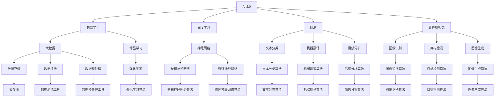
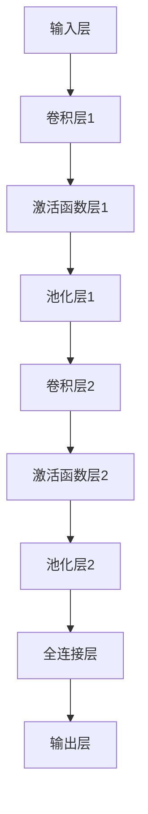

                 

# 李开复：AI 2.0 时代的科技价值

在飞速发展的技术浪潮中，人工智能(AI)正逐步从实验室走向社会各个角落，引发了前所未有的科技革命。作为AI的积极倡导者和实践者，李开复博士对于AI技术的发展前景以及其对社会、经济、文化等多方面的深远影响，有着独到的见解。本文将从AI 2.0时代的科技价值出发，深入探讨李开复博士对AI技术的看法，并展望未来AI在各个领域的应用潜力。

## 1. 背景介绍

### 1.1 问题的由来

随着计算技术、数据处理能力和算法创新的飞速进步，人工智能技术在过去几十年里取得了长足的进展。从最初的专家系统、机器学习，到今天的大数据、深度学习和增强学习，AI技术已经从简单的任务处理，发展成为能够自我学习和自我进化的复杂系统。这一进步不仅在学术界引起了广泛关注，也在工业界和公众生活中引发了深远影响。

李开复博士作为AI领域的先驱，对于AI技术的演进历程和未来趋势有着深入的研究和理解。他指出，AI技术的迅速发展不仅仅是技术本身的突破，更是社会需求驱动的结果。随着社会的数字化转型，AI技术在优化生产流程、提升决策质量、增强用户体验等方面发挥了越来越重要的作用。

### 1.2 问题核心关键点

AI 2.0时代的科技价值主要体现在以下几个方面：

- **提升生产力**：AI技术能够自动化执行重复性高、复杂性低的任务，解放人力资源，从而提升整体生产力。
- **增强决策质量**：通过深度学习和大数据分析，AI能够提供更为准确和及时的决策支持，帮助企业和组织做出更优的决策。
- **改善用户体验**：AI技术可以实时分析用户行为，提供个性化推荐和服务，提升用户体验。
- **促进科学发现**：AI技术能够处理海量数据，发现数据间的潜在联系，促进新知识的产生和科学研究的进步。
- **推动创新和创业**：AI技术为创业者提供了新的工具和方法，催生了大量创新型企业和项目。

## 2. 核心概念与联系

### 2.1 核心概念概述

李开复博士认为，AI 2.0时代的科技价值主要体现在以下几个核心概念中：

- **AI 2.0**：新一代的人工智能，强调深度学习、大数据、增强学习等技术的集成应用，能够在更复杂和多样化的环境中执行任务。
- **机器学习**：通过算法让计算机系统从数据中学习并改进性能，实现自主决策和预测。
- **深度学习**：一种特殊的机器学习算法，通过多层神经网络结构，实现更高级别的特征提取和模式识别。
- **自然语言处理(NLP)**：使计算机能够理解和处理人类语言的技术，包括文本分类、机器翻译、情感分析等应用。
- **计算机视觉**：使计算机能够理解和处理视觉信息的技术，包括图像识别、目标检测、图像生成等应用。

这些概念相互交织，形成了AI技术的核心框架。李开复博士指出，AI 2.0时代的科技价值不仅仅在于技术本身，更在于其对社会、经济、文化等各个领域的深远影响。

### 2.2 核心概念原理和架构的 Mermaid 流程图



这个流程图展示了AI 2.0技术架构的核心组件及其相互关系。从AI 2.0到机器学习、深度学习、自然语言处理、计算机视觉、大数据、增强学习等子技术，形成了完整的技术体系。

## 3. 核心算法原理 & 具体操作步骤

### 3.1 算法原理概述

AI 2.0时代的核心算法原理主要基于深度学习和强化学习。深度学习通过多层神经网络结构，从数据中自动提取特征，实现模式识别和分类。强化学习则通过模拟环境奖励机制，使AI系统能够自主学习和优化策略。

深度学习的核心是神经网络。以卷积神经网络(CNN)和循环神经网络(RNN)为例，CNN主要用于图像识别和处理，通过卷积层、池化层和全连接层等组件，提取图像特征；RNN则主要用于序列数据的处理，如自然语言处理中的语言模型，通过循环结构，捕捉序列间的依赖关系。

强化学习则通过与环境的交互，不断调整策略，优化性能。其核心算法包括Q-learning、策略梯度等，通过奖励机制和探索-利用平衡，实现自主决策。

### 3.2 算法步骤详解

AI 2.0算法的具体操作步骤如下：

1. **数据准备**：收集和清洗数据，准备用于模型训练和测试的数据集。
2. **模型构建**：选择适当的神经网络结构，如卷积神经网络、循环神经网络等，并设置网络参数。
3. **训练模型**：使用深度学习或强化学习算法，训练模型，调整参数，优化性能。
4. **模型评估**：在测试集上评估模型性能，如准确率、召回率、F1分数等，确保模型泛化能力。
5. **模型部署**：将训练好的模型部署到实际应用中，进行实时预测或决策。

### 3.3 算法优缺点

AI 2.0算法的优点包括：

- **高精度**：深度学习和强化学习算法能够处理复杂的非线性关系，实现高精度的预测和决策。
- **自适应性**：算法能够根据环境变化，自主调整策略，适应新情况。
- **可扩展性**：算法可以通过增加数据量和模型复杂度，不断提升性能。

但其缺点也显而易见：

- **高计算需求**：深度学习和大数据算法需要大量的计算资源，对硬件要求高。
- **数据依赖性强**：算法的性能依赖于数据质量，数据偏差可能导致模型失效。
- **可解释性不足**：深度学习模型通常被认为是"黑盒"，难以解释其决策过程。

### 3.4 算法应用领域

AI 2.0算法广泛应用于各个领域，包括但不限于：

- **医疗**：通过图像识别和自然语言处理技术，辅助医生进行诊断和治疗。
- **金融**：利用大数据和强化学习算法，实现精准风险管理和投资决策。
- **零售**：通过推荐系统和智能客服，提升用户体验和销售效率。
- **交通**：利用计算机视觉和深度学习技术，优化交通流量和减少事故。
- **教育**：通过自然语言处理和增强学习算法，提供个性化教育内容和智能辅导。

## 4. 数学模型和公式 & 详细讲解

### 4.1 数学模型构建

AI 2.0算法的基础是深度学习和大数据算法，其数学模型主要基于以下公式：

1. **深度学习模型**：
   $$
   y = f(W \cdot x + b)
   $$
   其中 $y$ 表示模型输出，$x$ 表示输入，$W$ 表示权重，$b$ 表示偏置，$f$ 表示激活函数。

2. **强化学习模型**：
   $$
   Q(s,a) = \sum_{t=0}^{\infty} \gamma^t r_t
   $$
   其中 $Q(s,a)$ 表示状态-动作值函数，$\gamma$ 表示折扣因子，$r_t$ 表示奖励信号。

### 4.2 公式推导过程

以卷积神经网络(CNN)为例，其基本结构如图：



卷积神经网络的推导过程如下：

- 卷积层：通过滑动卷积核，提取输入图像的局部特征。
- 激活函数层：通过激活函数，增强特征的非线性表达能力。
- 池化层：通过降采样操作，减少特征维度，保留重要信息。
- 全连接层：通过多层神经网络，实现高层次特征提取。
- 输出层：通过线性变换，输出分类结果。

### 4.3 案例分析与讲解

以图像分类为例，CNN可以自动从原始像素数据中提取特征，实现高精度的图像分类任务。例如，VGGNet通过多个卷积层和池化层的组合，实现了AlexNet无法达到的图像分类精度。在自然语言处理中，通过LSTM和GRU等循环神经网络，可以实现序列数据的处理和预测，如文本生成和机器翻译。

## 5. 项目实践：代码实例和详细解释说明

### 5.1 开发环境搭建

为了进行AI 2.0项目的开发和部署，需要搭建合适的开发环境。以下是基本的搭建流程：

1. **安装Python**：选择Python 3.x版本，从官网下载并安装。
2. **安装PyTorch**：选择合适版本的PyTorch，并按照官方文档进行安装。
3. **安装TensorFlow**：选择合适版本的TensorFlow，并按照官方文档进行安装。
4. **安装相关库**：安装TensorFlow、NumPy、Pandas、Matplotlib等常用库。
5. **配置开发环境**：配置Python环境变量，确保各库的路径正确。

### 5.2 源代码详细实现

以下是一个简单的图像分类项目示例，使用PyTorch进行开发：

```python
import torch
import torch.nn as nn
import torchvision.transforms as transforms
import torchvision.datasets as datasets

class Net(nn.Module):
    def __init__(self):
        super(Net, self).__init__()
        self.conv1 = nn.Conv2d(3, 32, 3, 1, 1)
        self.pool = nn.MaxPool2d(2, 2)
        self.conv2 = nn.Conv2d(32, 64, 3, 1, 1)
        self.fc1 = nn.Linear(64 * 28 * 28, 128)
        self.fc2 = nn.Linear(128, 10)

    def forward(self, x):
        x = self.pool(F.relu(self.conv1(x)))
        x = self.pool(F.relu(self.conv2(x)))
        x = x.view(-1, 64 * 28 * 28)
        x = F.relu(self.fc1(x))
        x = self.fc2(x)
        return x

transform = transforms.Compose([transforms.ToTensor(),
                               transforms.Normalize((0.5, 0.5, 0.5), (0.5, 0.5, 0.5))])

trainset = datasets.CIFAR10(root='./data', train=True, download=True, transform=transform)
trainloader = torch.utils.data.DataLoader(trainset, batch_size=4, shuffle=True, num_workers=2)

testset = datasets.CIFAR10(root='./data', train=False, download=True, transform=transform)
testloader = torch.utils.data.DataLoader(testset, batch_size=4, shuffle=False, num_workers=2)

net = Net()
criterion = nn.CrossEntropyLoss()
optimizer = torch.optim.SGD(net.parameters(), lr=0.001, momentum=0.9)

for epoch in range(2):
    running_loss = 0.0
    for i, data in enumerate(trainloader, 0):
        inputs, labels = data
        optimizer.zero_grad()
        outputs = net(inputs)
        loss = criterion(outputs, labels)
        loss.backward()
        optimizer.step()
```

### 5.3 代码解读与分析

该代码示例使用PyTorch实现了一个简单的卷积神经网络，用于图像分类任务。具体实现过程如下：

- **网络定义**：定义了一个包含两个卷积层和两个全连接层的神经网络，用于提取图像特征并输出分类结果。
- **数据准备**：使用CIFAR-10数据集，并进行预处理，将像素数据标准化。
- **模型训练**：在训练集上使用SGD优化器，训练神经网络，优化损失函数。

### 5.4 运行结果展示

训练过程中，可以通过以下代码打印出训练日志：

```python
for epoch in range(2):
    running_loss = 0.0
    for i, data in enumerate(trainloader, 0):
        inputs, labels = data
        optimizer.zero_grad()
        outputs = net(inputs)
        loss = criterion(outputs, labels)
        loss.backward()
        optimizer.step()
        running_loss += loss.item()
    print('Epoch %d loss: %.3f' % (epoch+1, running_loss/len(trainloader)))
```

## 6. 实际应用场景

### 6.1 医疗

在医疗领域，AI 2.0技术可以辅助医生进行疾病诊断和治疗。例如，通过计算机视觉技术，可以对X光片进行自动分析和诊断，识别异常情况。自然语言处理技术可以帮助医生理解患者病历和医疗报告，提取重要信息。深度学习算法可以用于预测疾病发展趋势，提供个性化的治疗方案。

### 6.2 金融

在金融领域，AI 2.0技术可以用于风险管理、投资决策和客户服务。通过大数据和机器学习算法，可以实时分析市场趋势，预测股票价格和波动。强化学习算法可以优化投资组合，实现自主交易。自然语言处理技术可以分析客户咨询，提供智能客服支持。

### 6.3 零售

在零售领域，AI 2.0技术可以用于客户推荐、库存管理和智能客服。通过推荐系统，可以根据用户历史行为和偏好，提供个性化的产品推荐。深度学习算法可以用于库存预测和优化，减少库存积压和缺货。自然语言处理技术可以用于客户服务，提供智能客服支持，提升用户体验。

### 6.4 交通

在交通领域，AI 2.0技术可以用于交通流量优化、自动驾驶和安全监控。通过计算机视觉技术，可以实时分析交通数据，优化信号灯控制。深度学习算法可以用于自动驾驶，提高驾驶安全性和效率。自然语言处理技术可以用于智能交通管理，提供实时交通信息。

## 7. 工具和资源推荐

### 7.1 学习资源推荐

为了帮助开发者深入了解AI 2.0技术，以下是一些优质的学习资源：

- **斯坦福大学《深度学习》课程**：由斯坦福大学Andrew Ng教授讲授，涵盖了深度学习的基础知识和应用。
- **Coursera《机器学习》课程**：由斯坦福大学Andrew Ng教授讲授，介绍了机器学习的基本概念和算法。
- **DeepLearning.ai**：由Andrew Ng创办的在线学习平台，提供深度学习和AI相关的课程和实战项目。
- **PyTorch官方文档**：提供了丰富的API文档和示例代码，帮助开发者快速上手。
- **TensorFlow官方文档**：提供了详细的API文档和教程，适合深度学习和机器学习的学习和应用。

### 7.2 开发工具推荐

为了提高AI 2.0项目的开发效率，以下是一些常用的开发工具：

- **PyTorch**：基于Python的深度学习框架，灵活易用，适合研究性开发。
- **TensorFlow**：由Google开发的深度学习框架，适用于大规模工程应用。
- **Jupyter Notebook**：免费的交互式开发环境，支持Python代码和数据可视化。
- **Google Colab**：谷歌提供的云端Jupyter Notebook环境，支持GPU计算和免费使用。
- **Anaconda**：Python环境的安装包管理工具，方便创建和管理Python虚拟环境。

### 7.3 相关论文推荐

为了深入了解AI 2.0技术，以下是一些重要的研究论文：

- **ImageNet Classification with Deep Convolutional Neural Networks**：AlexNet论文，开创了深度学习在图像分类领域的先河。
- **Long Short-Term Memory**：LSTM论文，提出了长短期记忆网络，解决了序列数据的处理问题。
- **Attention Is All You Need**：Transformer论文，提出了自注意力机制，提升了序列数据处理的性能。
- **Generative Adversarial Nets**：GAN论文，提出了生成对抗网络，实现了高质量的图像生成和数据增强。
- **Deep Reinforcement Learning for Playing Go**：AlphaGo论文，展示了深度学习在强化学习领域的突破性应用。

## 8. 总结：未来发展趋势与挑战

### 8.1 研究成果总结

AI 2.0技术在过去几年取得了巨大的进步，涵盖了深度学习、强化学习、自然语言处理等多个领域。其应用范围广泛，涵盖医疗、金融、零售、交通等多个行业。未来，AI 2.0技术将继续发展，进一步提升生产力、改善用户体验和推动科学进步。

### 8.2 未来发展趋势

AI 2.0技术将呈现以下几个发展趋势：

1. **模型规模不断增大**：随着计算资源的提升和数据量的增加，AI模型的规模将不断增大，能够处理更加复杂和多样的任务。
2. **算法多样化和融合**：深度学习、强化学习和自然语言处理等算法将进一步融合，形成更加综合和高效的技术体系。
3. **自监督学习和无监督学习**：无监督学习和大数据自监督学习将逐步取代传统有监督学习，提升模型的泛化能力和适应性。
4. **跨领域应用拓展**：AI技术将拓展到更多行业和领域，如医疗、教育、环保等，提升社会整体效率和福利。
5. **伦理和安全问题**：随着AI技术的广泛应用，伦理和安全问题将受到更多关注，需要制定相关规范和标准。

### 8.3 面临的挑战

尽管AI 2.0技术取得了显著进展，但仍面临诸多挑战：

1. **数据隐私和安全**：AI技术依赖大量数据，数据隐私和安全问题需要得到充分解决。
2. **模型可解释性**：深度学习模型通常被认为是"黑盒"，缺乏可解释性，需要开发更透明的模型和工具。
3. **公平性和偏见**：AI模型可能存在偏见，需要制定相关政策和标准，确保模型的公平性和公正性。
4. **计算资源需求**：大规模AI模型需要大量的计算资源，如何提高计算效率和降低成本，需要新的技术和方法。
5. **伦理和社会影响**：AI技术的应用可能带来伦理和社会影响，需要认真评估和管控。

### 8.4 研究展望

为了应对AI 2.0技术面临的挑战，未来的研究将集中在以下几个方向：

1. **模型可解释性**：开发可解释性更强的模型，增强用户对AI系统的信任和接受度。
2. **数据隐私和安全**：研究和开发保护数据隐私和安全的技术，确保用户数据不被滥用。
3. **公平性和偏见**：制定AI模型的公平性标准，消除模型偏见，提升AI系统的公正性。
4. **计算资源优化**：开发高效计算和存储技术，降低AI模型的计算成本。
5. **伦理和社会影响评估**：建立AI技术的伦理和社会影响评估机制，确保技术应用符合社会价值观和规范。

## 9. 附录：常见问题与解答

### Q1：AI 2.0是否适用于所有行业？

A：AI 2.0技术可以应用于几乎所有行业，但具体应用需要结合行业特点进行定制化设计和优化。

### Q2：AI 2.0是否会取代人类工作？

A：AI 2.0技术将提升生产力和效率，但不会完全取代人类工作。人类在创新、决策和复杂任务处理上仍具有不可替代的优势。

### Q3：AI 2.0是否需要大量标注数据？

A：AI 2.0技术可以通过无监督学习和自监督学习进行优化，部分任务不需要大量标注数据。

### Q4：AI 2.0是否会导致就业问题？

A：AI 2.0技术将带来新的就业机会，同时也会改变工作方式和劳动市场结构，需要政府和行业共同应对。

### Q5：AI 2.0是否会带来伦理问题？

A：AI 2.0技术需要制定相关伦理标准和规范，确保技术应用符合社会价值观和法律法规。

---

作者：禅与计算机程序设计艺术 / Zen and the Art of Computer Programming

