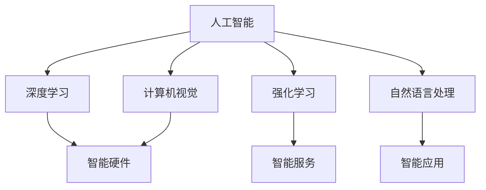

                 

# 李开复：苹果发布AI应用的产业

## 1. 背景介绍

### 1.1 问题由来
李开复博士，作为人工智能领域的著名专家和企业家，对AI技术的应用和发展有着独到的见解。随着苹果公司近年来在人工智能领域的持续投入和创新，他在多个场合阐述了苹果AI应用的现状和前景。本文将深入探讨李开复博士的观点，分析苹果公司AI应用所面临的挑战和机遇。

### 1.2 问题核心关键点
李开复博士认为，AI技术的应用正成为推动各行各业创新和发展的重要引擎。在智能硬件、智能应用、智能服务等方面，AI技术的融入正在重塑行业的面貌。本文将聚焦于苹果公司如何利用AI技术打造其产品和服务，提升用户体验，引领行业潮流。

### 1.3 问题研究意义
研究苹果公司AI应用的发展，不仅有助于理解AI技术在商业中的应用价值，还能为其他企业提供有益的借鉴和启示。AI技术的普及和应用，将极大地促进各行各业的数字化转型，提升社会生产效率和生活品质。

## 2. 核心概念与联系

### 2.1 核心概念概述

为了更好地理解苹果公司AI应用的产业现状和发展方向，本节将介绍几个关键概念及其相互联系：

- **人工智能（AI）**：指通过计算机系统模拟人类智能过程的技术，包括学习、推理、感知、规划等能力。AI技术的核心在于构建智能模型，使其能够对输入数据进行高效处理和智能决策。

- **深度学习（DL）**：一种特殊的机器学习算法，通过构建多层次神经网络模型，实现对复杂数据的高级抽象和泛化。深度学习在图像识别、自然语言处理等领域表现出色。

- **强化学习（RL）**：一种通过试错不断优化决策的AI技术，常用于游戏、机器人控制等需要实时反馈的场景。

- **计算机视觉（CV）**：利用计算机技术对图像和视频进行分析和理解，包括对象检测、图像分割、三维重建等。

- **自然语言处理（NLP）**：让计算机能够理解和处理人类语言的技术，涵盖文本分析、语音识别、机器翻译等应用。

这些概念共同构成了AI技术的核心框架，推动着苹果公司在多个领域的应用创新。

### 2.2 核心概念原理和架构的 Mermaid 流程图



这个流程图展示了人工智能技术在智能硬件、智能应用、智能服务等领域的应用路径，以及各技术间的内在联系。

## 3. 核心算法原理 & 具体操作步骤

### 3.1 算法原理概述

苹果公司在AI应用上的核心算法原理主要包括深度学习、计算机视觉和自然语言处理等技术。通过这些技术的综合应用，苹果公司能够构建具备强大智能功能的硬件和软件系统。

深度学习算法通过构建多层神经网络，从大量数据中学习到复杂的特征表示，并用于图像识别、语音识别、自然语言处理等任务。计算机视觉技术则利用图像处理算法，实现对图像和视频数据的高级理解。自然语言处理技术则通过文本分析和语言模型，使计算机能够理解和生成自然语言。

### 3.2 算法步骤详解

苹果公司AI应用的开发主要包括以下步骤：

**Step 1: 数据收集和预处理**
- 收集和整理与产品相关的数据，包括图片、音频、文本等。
- 进行数据清洗和预处理，如噪声过滤、数据增强、归一化等。

**Step 2: 模型训练和优化**
- 选择合适的深度学习框架（如TensorFlow、PyTorch）进行模型搭建和训练。
- 利用GPU等高性能计算资源进行模型优化，调整超参数，如学习率、批次大小等。

**Step 3: 模型集成和部署**
- 将训练好的模型集成到产品中，实现功能增强。
- 在硬件设备上进行模型部署，优化推理速度和资源消耗。

**Step 4: 持续迭代和优化**
- 根据用户反馈和使用数据，不断优化模型，提升准确率和性能。
- 引入新数据和新任务，拓展模型应用范围。

### 3.3 算法优缺点

苹果公司AI应用的优点包括：
- 高准确性和泛化能力：通过深度学习和计算机视觉技术，苹果产品的智能功能能够达到行业领先水平。
- 用户友好性：自然语言处理技术使得用户与产品之间的交互更加自然和高效。

然而，其缺点也显而易见：
- 资源消耗大：大规模深度学习模型的训练和推理需要大量的计算资源和能源，成本较高。
- 数据隐私问题：大量数据的收集和处理可能带来隐私泄露风险，需要严格的监管和保护措施。
- 模型透明性不足：深度学习模型的决策过程难以解释，用户难以理解其背后的逻辑和依据。

### 3.4 算法应用领域

苹果公司AI应用的广泛领域包括：

- **智能硬件**：如iPhone、iPad等设备中，内置AI功能，包括人脸识别、图像识别、语音助手等。
- **智能应用**：如Siri、Face ID等，为用户提供自然语言处理和计算机视觉服务。
- **智能服务**：如Apple Music、Apple News等，通过AI技术提升内容推荐和用户体验。

此外，苹果公司还探索将AI技术应用于健康、家居、汽车等领域，致力于构建更智能、更互联的未来生活。

## 4. 数学模型和公式 & 详细讲解 & 举例说明

### 4.1 数学模型构建

苹果公司AI应用的数学模型主要基于深度学习算法构建，包括卷积神经网络（CNN）、循环神经网络（RNN）、长短时记忆网络（LSTM）等。

以图像识别任务为例，模型构建过程如下：

1. 数据预处理：将图像数据转换为张量形式，并进行归一化处理。
2. 卷积层：通过多层卷积操作，提取图像的特征。
3. 池化层：对卷积层的输出进行降维处理，减少计算量。
4. 全连接层：将池化层的输出展平后，输入到全连接层进行分类。
5. 输出层：使用softmax函数输出类别概率。

### 4.2 公式推导过程

以下是图像识别任务的深度学习模型构建公式：

$$
\begin{aligned}
&\text{输入数据} \rightarrow \text{卷积层} \rightarrow \text{池化层} \rightarrow \text{全连接层} \rightarrow \text{输出层} \\
&\text{输出} = \text{softmax}(\text{全连接层}( \text{池化层}( \text{卷积层}( \text{输入数据} ) ))
\end{aligned}
$$

其中，卷积层和池化层用于提取和降维图像特征，全连接层将特征映射到类别空间，softmax函数用于归一化概率输出。

### 4.3 案例分析与讲解

以Siri语音识别为例，分析其背后的数学模型和算法原理：

1. **声音信号处理**：将用户语音信号转换为数字信号，并进行预处理，如去除噪声、增益调整等。
2. **特征提取**：通过卷积神经网络（CNN）或长短时记忆网络（LSTM），提取语音信号的时序特征。
3. **语音识别**：将提取的特征输入到神经网络中进行分类，识别出对应的文本。
4. **自然语言处理**：对识别出的文本进行语义理解和生成，实现用户意图解析和响应生成。

## 5. 项目实践：代码实例和详细解释说明

### 5.1 开发环境搭建

要开发苹果公司的AI应用，首先需要搭建开发环境。以下是开发环境搭建的详细步骤：

1. 安装Python：下载并安装Python 3.x版本。
2. 安装TensorFlow：通过pip命令安装TensorFlow，如`pip install tensorflow`。
3. 安装PyTorch：通过conda命令安装PyTorch，如`conda install pytorch torchvision torchaudio`。
4. 安装PyTorch Lightning：通过pip命令安装PyTorch Lightning，如`pip install pytorch-lightning`。
5. 安装其他库：根据需要安装其他必要的库，如Pillow、Matplotlib等。

### 5.2 源代码详细实现

以Siri语音识别为例，给出TensorFlow代码实现：

```python
import tensorflow as tf
from tensorflow.keras.layers import Conv2D, MaxPooling2D, LSTM, Dense, Flatten
from tensorflow.keras.models import Sequential

# 构建模型
model = Sequential([
    Conv2D(32, 3, activation='relu', input_shape=(64, 64, 3)),
    MaxPooling2D(pool_size=(2, 2)),
    Flatten(),
    LSTM(128),
    Dense(10, activation='softmax')
])

# 编译模型
model.compile(optimizer='adam', loss='categorical_crossentropy', metrics=['accuracy'])

# 训练模型
model.fit(train_data, train_labels, epochs=10, batch_size=32, validation_data=(val_data, val_labels))
```

### 5.3 代码解读与分析

上述代码展示了Siri语音识别模型的构建和训练过程。关键点包括：

- **模型搭建**：通过`Sequential`模型构建，包含卷积层、池化层、全连接层等。
- **数据输入**：`input_shape`指定了输入数据的维度。
- **激活函数**：`relu`和`softmax`函数用于激活和归一化输出。
- **编译和训练**：使用`compile`和`fit`方法进行模型编译和训练，`adam`优化器和学习率设置等。

### 5.4 运行结果展示

在训练完成后，可以输出模型在验证集上的性能指标：

```python
val_loss, val_accuracy = model.evaluate(val_data, val_labels)
print(f'Validation loss: {val_loss}, Validation accuracy: {val_accuracy}')
```

以上步骤展示了从环境搭建到模型训练的完整流程，帮助读者理解苹果公司AI应用的开发实践。

## 6. 实际应用场景

### 6.1 智能硬件

苹果公司将AI技术广泛应用于其智能硬件中，提升设备的功能和用户体验。例如：

- **Face ID**：通过深度学习算法实现人脸识别，提供安全的解锁和支付功能。
- **健康监测**：使用计算机视觉技术分析摄像头拍摄的照片，实时监测用户健康状况。

### 6.2 智能应用

Siri作为苹果公司的智能语音助手，通过自然语言处理技术，实现用户指令的解析和响应生成。

### 6.3 智能服务

Apple Music和Apple News等应用，通过深度学习算法进行内容推荐，提升用户的使用体验。

### 6.4 未来应用展望

苹果公司正积极探索AI技术在更多领域的应用，如健康医疗、智能家居、自动驾驶等。通过AI技术，苹果公司有望在这些领域提供更加智能化、个性化的服务，为用户带来全新的体验。

## 7. 工具和资源推荐

### 7.1 学习资源推荐

要深入了解苹果公司AI应用的发展，可以参考以下学习资源：

1. **Apple Developer Documentation**：苹果官方开发者文档，提供详细的API和开发指南。
2. **Deep Learning with Python**（TensorFlow官方文档）：TensorFlow的官方指南，涵盖深度学习模型的构建和训练。
3. **Natural Language Processing with Python**：NLP领域的经典教程，涵盖文本分析、语言模型等应用。
4. **Deep Learning Specialization**：Coursera上的深度学习课程，由深度学习领域的知名专家讲授。

### 7.2 开发工具推荐

苹果公司AI应用的开发工具包括：

- **Xcode**：苹果官方的集成开发环境，支持多平台开发。
- **PyCharm**：流行的Python IDE，提供丰富的开发工具和插件。
- **TensorBoard**：TensorFlow配套的可视化工具，用于监控模型训练过程。

### 7.3 相关论文推荐

了解苹果公司AI应用的最新研究进展，可以参考以下论文：

1. **Natural Language Understanding with BERT**：介绍BERT在Siri等应用中的使用。
2. **Convolutional Neural Networks for Deep Learning in Apple's Devices**：阐述卷积神经网络在苹果设备中的应用。
3. **Object Detection with MobileNets on iOS**：介绍MobileNet在Apple设备上的应用。

## 8. 总结：未来发展趋势与挑战

### 8.1 总结

本文通过深入探讨李开复博士的观点，分析了苹果公司AI应用的现状和前景。苹果公司通过深度学习、计算机视觉和自然语言处理等技术，构建了强大的智能硬件和软件系统，提升了用户体验和产品竞争力。本文系统地介绍了苹果公司AI应用的开发流程和技术细节，希望能为读者提供有益的参考和借鉴。

### 8.2 未来发展趋势

展望未来，苹果公司AI应用的趋势包括：

- **多模态智能**：未来苹果公司将更深入地融合视觉、听觉、触觉等多种模态数据，构建更全面的智能应用。
- **个性化服务**：通过深度学习算法进行用户行为和偏好的分析，提供更加个性化的服务体验。
- **跨平台协同**：实现不同设备和平台之间的数据共享和协同工作，提升用户的使用便捷性。

### 8.3 面临的挑战

苹果公司AI应用的发展也面临诸多挑战：

- **数据隐私**：大量数据的收集和使用可能带来隐私泄露风险，需要严格的监管和保护措施。
- **计算资源**：大规模深度学习模型的训练和推理需要大量的计算资源和能源，成本较高。
- **模型透明性**：深度学习模型的决策过程难以解释，用户难以理解其背后的逻辑和依据。

### 8.4 研究展望

未来，苹果公司AI应用的研发将更多地关注：

- **数据隐私保护**：开发隐私保护技术，保障用户数据的安全性和匿名性。
- **计算资源优化**：通过模型压缩、边缘计算等技术，优化计算资源的消耗。
- **模型可解释性**：引入可解释性算法，提升模型的透明度和可信度。

## 9. 附录：常见问题与解答

**Q1: 苹果公司的AI应用是否依赖于外部开源框架？**

A: 苹果公司主要依赖自研的AI框架，如Core ML、Metal等，同时也会利用开源框架如TensorFlow、PyTorch进行开发。自研框架可以更好地适配苹果设备，提升性能和安全性。

**Q2: 苹果公司AI应用的开发难度如何？**

A: 苹果公司AI应用的开发难度较高，需要掌握深度学习、计算机视觉、自然语言处理等多种技术。同时，还需要具备强大的硬件资源和开发环境支持。

**Q3: 苹果公司AI应用的未来发展方向是什么？**

A: 未来，苹果公司将更深入地探索AI技术在健康医疗、智能家居、自动驾驶等领域的潜力，提供更加智能化、个性化的服务。

**Q4: 苹果公司如何保护用户数据隐私？**

A: 苹果公司采用数据匿名化、数据加密、差分隐私等技术，保护用户数据的安全性和隐私。

**Q5: 苹果公司如何提升模型的可解释性？**

A: 苹果公司将引入可解释性算法，如LIME、SHAP等，帮助用户理解模型的决策过程和输出依据。

本文通过系统地介绍苹果公司AI应用的开发和应用，希望能为读者提供深入的洞察和启发。未来，苹果公司将在AI技术的推动下，继续引领行业的发展，为用户带来更加智能和便捷的生活体验。

---

作者：禅与计算机程序设计艺术 / Zen and the Art of Computer Programming

