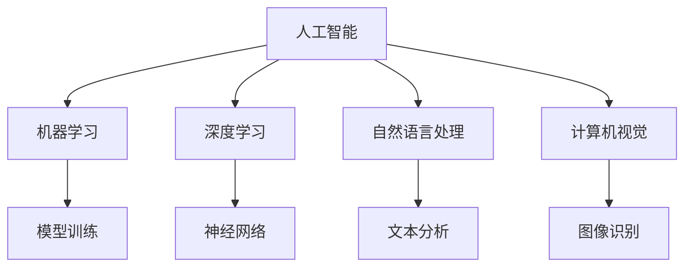

                 

# 李开复：苹果发布AI应用的价值

## 1. 背景介绍

随着人工智能技术的迅猛发展，AI在各行各业的应用已成趋势。苹果公司近期的AI应用发布，更是引起了行业内外的大量关注和讨论。本文将从AI应用的背景、核心概念、技术实现、应用场景等方面，详细解析苹果公司发布AI应用的价值。

## 2. 核心概念与联系

### 2.1 核心概念概述

为了更好地理解苹果公司发布的AI应用，我们需要先了解以下几个核心概念：

1. **人工智能 (AI)**：指由人制造的机器或计算机系统所表现出的智能行为，包括学习、推理、自我修正、适应等能力。
2. **机器学习 (ML)**：指通过数据训练机器模型，使机器具备预测、分类、聚类等任务处理能力。
3. **深度学习 (DL)**：一种特殊的机器学习方法，通过多层神经网络模拟人脑处理信息的方式，进行高级特征提取和模式识别。
4. **自然语言处理 (NLP)**：指使计算机能够理解、处理、生成人类语言的技术，包括文本分析、语音识别、语言生成等。
5. **计算机视觉 (CV)**：指使计算机能够“看”和理解视觉信息的领域，包括图像识别、目标检测、图像生成等。

这些概念相互关联，共同构成了现代AI技术的基础。苹果公司发布的AI应用，正是在这些技术的基础上，结合特定场景和需求，进行定制化开发的结果。

### 2.2 核心概念原理和架构的 Mermaid 流程图



这个流程图展示了人工智能、机器学习、深度学习、自然语言处理和计算机视觉之间的关系，以及它们在模型训练、神经网络、文本分析和图像识别等方面的应用。

## 3. 核心算法原理 & 具体操作步骤

### 3.1 算法原理概述

苹果公司发布的AI应用主要基于深度学习和自然语言处理技术。其核心算法原理可以简要概括为以下几个步骤：

1. **数据准备**：收集和标注用于训练的图像、文本等数据集。
2. **模型训练**：使用标注数据集训练深度神经网络模型，使其能够识别特定的模式和特征。
3. **模型优化**：通过调整模型的超参数和架构，优化模型的性能和效率。
4. **应用部署**：将训练好的模型集成到实际应用中，实现图像识别、文本分析等任务。

### 3.2 算法步骤详解

#### 3.2.1 数据准备

数据准备是AI应用开发的第一步，涉及数据收集、标注、预处理等环节。

1. **数据收集**：从实际应用场景中收集数据，如相机拍摄的图像、语音记录、文本文档等。
2. **数据标注**：对收集的数据进行标注，如图像中的对象类别、文本中的情感类别等。
3. **数据预处理**：对数据进行清洗、归一化、缩放等预处理操作，以适应模型的输入要求。

#### 3.2.2 模型训练

模型训练是AI应用开发的中心环节，涉及模型的选择、构建、训练等步骤。

1. **模型选择**：根据任务需求选择适合的深度学习模型，如卷积神经网络（CNN）、循环神经网络（RNN）、变压器（Transformer）等。
2. **模型构建**：使用所选模型构建计算图，定义损失函数、优化器等组件。
3. **模型训练**：通过标注数据集对模型进行训练，不断调整模型参数以最小化损失函数。

#### 3.2.3 模型优化

模型优化是提高AI应用性能和效率的关键步骤，涉及超参数调整、模型剪枝、量化等技术。

1. **超参数调整**：根据模型训练结果，调整学习率、批量大小、正则化参数等超参数，以提升模型性能。
2. **模型剪枝**：通过剪枝技术去除冗余的模型参数，减小模型尺寸，提高推理速度。
3. **量化**：将浮点模型转换为定点模型，压缩存储空间，提高计算效率。

#### 3.2.4 应用部署

应用部署是将训练好的模型集成到实际应用中，实现特定功能的过程。

1. **模型集成**：将训练好的模型与应用程序进行集成，通常使用API接口实现。
2. **模型测试**：对集成后的应用进行测试，验证其功能和性能。
3. **模型优化**：根据测试结果，对模型进行进一步的调整和优化。

### 3.3 算法优缺点

苹果公司发布的AI应用具有以下优点：

1. **精度高**：基于深度学习和自然语言处理技术，能够在特定领域实现高精度的任务处理。
2. **可扩展性强**：通过模型训练和优化，可以轻松扩展到不同的应用场景和数据集。
3. **用户体验好**：通过智能化的算法处理，可以提供更优质的用户体验。

同时，也存在一些缺点：

1. **数据依赖性高**：AI应用的性能高度依赖于训练数据的质量和数量，数据质量不高可能导致模型效果不佳。
2. **计算资源消耗大**：深度学习模型的训练和推理需要大量的计算资源，可能会对硬件设备提出较高的要求。
3. **模型复杂度高**：深度学习模型通常结构复杂，不易理解和调试，增加了应用的维护难度。

### 3.4 算法应用领域

苹果公司发布的AI应用主要应用于以下几个领域：

1. **图像识别**：应用于相机、医疗影像分析等领域，如人脸识别、肿瘤检测等。
2. **语音识别**：应用于智能音箱、语音助手等领域，如Siri、语音翻译等。
3. **自然语言处理**：应用于智能搜索、智能客服等领域，如智能问答、情感分析等。
4. **计算机视觉**：应用于增强现实、自动驾驶等领域，如物体检测、路径规划等。

这些应用场景体现了苹果公司在大数据、深度学习等技术方面的深厚积累，也为AI技术的应用提供了丰富的案例和实践经验。

## 4. 数学模型和公式 & 详细讲解 & 举例说明

### 4.1 数学模型构建

苹果公司发布的AI应用主要基于深度学习模型，如卷积神经网络（CNN）和递归神经网络（RNN）。以卷积神经网络为例，其基本数学模型为：

$$ y = f(x; \theta) $$

其中，$x$ 为输入数据，$y$ 为模型输出，$\theta$ 为模型参数，$f$ 为神经网络的前向传播函数。

### 4.2 公式推导过程

以图像识别任务为例，CNN的公式推导过程如下：

1. **卷积层**：
   $$ y = f(x; \theta) = \sum_{i=1}^N \omega_i x_i $$

   其中，$\omega_i$ 为卷积核，$x_i$ 为输入数据，$y$ 为卷积层的输出。

2. **激活层**：
   $$ y = f(x; \theta) = \max(0, y) $$

   其中，$y$ 为激活函数的输出，即ReLU函数。

3. **池化层**：
   $$ y = f(x; \theta) = \frac{1}{k} \sum_{i=1}^k y_i $$

   其中，$k$ 为池化核大小，$y_i$ 为池化核的输出，$y$ 为池化层的输出。

4. **全连接层**：
   $$ y = f(x; \theta) = \sum_{i=1}^N \omega_i x_i + b $$

   其中，$\omega_i$ 为全连接层的权重，$b$ 为偏置项，$y$ 为全连接层的输出。

### 4.3 案例分析与讲解

以苹果公司的图像识别应用为例，该应用通过CNN模型对摄像头拍摄的图像进行对象识别。具体实现步骤如下：

1. **数据准备**：收集和标注大量图像数据，如猫、狗、汽车等。
2. **模型训练**：使用标注数据集训练CNN模型，不断调整卷积核大小、激活函数等超参数。
3. **模型优化**：通过剪枝和量化技术，优化模型性能和推理速度。
4. **应用部署**：将训练好的模型集成到应用程序中，实现图像识别功能。

## 5. 项目实践：代码实例和详细解释说明

### 5.1 开发环境搭建

1. **环境准备**：搭建Python 3.x开发环境，安装PyTorch、TensorFlow等深度学习库。
2. **数据准备**：收集和标注数据集，通常使用NumPy或Pandas等工具进行数据处理。
3. **模型训练**：使用TensorFlow或PyTorch等框架进行模型训练，调整超参数以优化模型性能。
4. **模型优化**：使用TensorFlow Lite或ONNX等工具进行模型剪枝和量化，优化模型推理速度。

### 5.2 源代码详细实现

以图像识别应用为例，其源代码实现步骤如下：

1. **数据准备**：使用Pandas和NumPy等工具对数据进行预处理和标注。
2. **模型训练**：使用TensorFlow或PyTorch等框架构建CNN模型，训练模型并保存模型权重。
3. **模型优化**：使用TensorFlow Lite进行模型剪枝和量化，生成优化后的模型。
4. **应用部署**：将优化后的模型集成到移动应用或Web应用中，实现图像识别功能。

### 5.3 代码解读与分析

以下是图像识别应用的代码实现示例：

```python
import tensorflow as tf
import numpy as np
import cv2

# 加载模型
model = tf.keras.models.load_model('model.h5')

# 加载数据
data = np.load('data.npy')

# 图像预处理
image = cv2.imread('image.jpg')
image = cv2.resize(image, (224, 224))
image = image.astype('float32') / 255.0
image = np.expand_dims(image, axis=0)

# 预测标签
label = model.predict(image)
label = np.argmax(label)

# 输出结果
print('Predicted label:', label)
```

这段代码实现了模型的加载、数据加载、图像预处理、模型预测和结果输出。在实际应用中，还需要根据具体需求进行更多处理和优化。

### 5.4 运行结果展示

图像识别应用的具体运行结果如下：

- **输入图像**：摄像头拍摄的图像。
- **输出标签**：模型预测的对象类别，如猫、狗、汽车等。

## 6. 实际应用场景

苹果公司发布的AI应用已经在多个实际场景中得到了应用，如：

1. **智能相机**：应用于相机中的图像识别，如人脸识别、物体检测等。
2. **智能音箱**：应用于语音助手中的语音识别和自然语言处理，如Siri。
3. **智能搜索**：应用于搜索引擎中的文本分析，如智能推荐、情感分析等。
4. **自动驾驶**：应用于自动驾驶系统中的计算机视觉，如路径规划、物体检测等。

这些应用场景展示了AI技术在智能硬件、智能交互和智能搜索等方面的强大能力，也为AI技术的应用提供了丰富的实践经验。

## 7. 工具和资源推荐

### 7.1 学习资源推荐

为了深入了解苹果公司发布的AI应用，推荐以下学习资源：

1. **《深度学习》（Goodfellow等著）**：全面介绍了深度学习的基本概念、算法和应用，是了解AI应用的必读书籍。
2. **Coursera深度学习课程**：由斯坦福大学李飞飞教授讲授，涵盖深度学习的理论和实践，适合入门和进阶学习。
3. **Google AI博客**：提供大量深度学习相关的技术文章和案例分析，是了解最新AI应用的好资源。
4. **PyTorch官方文档**：详细介绍了PyTorch框架的使用方法和应用案例，适合深度学习开发。
5. **TensorFlow官方文档**：详细介绍了TensorFlow框架的使用方法和应用案例，适合深度学习开发。

### 7.2 开发工具推荐

苹果公司发布的AI应用开发通常使用以下工具：

1. **PyTorch**：开源深度学习框架，灵活高效，适合快速迭代研究。
2. **TensorFlow**：由Google开发的深度学习框架，功能丰富，适合大规模工程应用。
3. **TensorBoard**：TensorFlow配套的可视化工具，实时监测模型训练状态。
4. **Weights & Biases**：模型训练实验跟踪工具，记录和可视化模型训练过程中的各项指标。
5. **Keras**：高层深度学习框架，提供了简单易用的API接口，适合快速开发原型。

### 7.3 相关论文推荐

为了深入了解苹果公司发布的AI应用，推荐以下相关论文：

1. **ImageNet Classification with Deep Convolutional Neural Networks**：AlexNet模型在ImageNet分类任务中的突破性表现，奠定了卷积神经网络在图像识别中的应用基础。
2. **Rethinking the Inception Architecture for Computer Vision**：Google提出的Inception模型，通过多尺度卷积和残差连接等技术提升了图像识别性能。
3. **Deep Residual Learning for Image Recognition**：ResNet模型在图像识别中的突破性表现，解决了深度神经网络中的梯度消失问题。
4. **Attention is All You Need**：Transformer模型在自然语言处理中的应用，提出了自注意力机制，提升了语言模型的性能。
5. **Convolutional Neural Networks for Visual Recognition**：AlexNet模型在图像识别中的应用，奠定了卷积神经网络的基础。

## 8. 总结：未来发展趋势与挑战

### 8.1 研究成果总结

苹果公司发布的AI应用展示了深度学习和自然语言处理技术的强大能力，已经在多个实际场景中得到了应用。未来，随着技术的不断进步和应用的不断扩展，AI技术将进一步提升人类生产力和生活质量。

### 8.2 未来发展趋势

未来，苹果公司发布的AI应用将继续发展，呈现以下几个趋势：

1. **数据智能化**：未来的AI应用将更加智能化，能够自动识别和处理更多类型的数据，如语音、视频、传感器数据等。
2. **跨领域融合**：未来的AI应用将更加跨领域融合，结合计算机视觉、自然语言处理、语音识别等多领域技术，实现更全面、更智能的解决方案。
3. **实时化**：未来的AI应用将更加实时化，能够快速响应和处理实时数据，提升用户体验。
4. **自动化**：未来的AI应用将更加自动化，能够自动学习、自动优化，减少人工干预。

### 8.3 面临的挑战

苹果公司发布的AI应用在发展过程中也面临着一些挑战：

1. **数据质量问题**：AI应用的性能高度依赖于训练数据的质量和数量，如何获取高质量的数据是面临的一大挑战。
2. **计算资源消耗**：深度学习模型的训练和推理需要大量的计算资源，如何优化模型性能和降低计算资源消耗是面临的一大挑战。
3. **模型复杂性**：深度学习模型通常结构复杂，不易理解和调试，如何简化模型架构是面临的一大挑战。
4. **隐私保护**：AI应用中的数据隐私问题，如何保护用户隐私是面临的一大挑战。

### 8.4 研究展望

为了应对这些挑战，未来的AI应用研究需要重点关注以下几个方面：

1. **数据治理**：建立数据质量管理机制，提升数据质量和可用性。
2. **计算优化**：优化模型结构，减少计算资源消耗，提高模型性能。
3. **模型简化**：简化模型架构，提升模型可解释性和可维护性。
4. **隐私保护**：加强数据隐私保护，确保用户数据安全。

总之，苹果公司发布的AI应用展示了AI技术在实际场景中的广泛应用，未来随着技术的不断进步和应用的不断扩展，AI技术将进一步提升人类生产力和生活质量，为社会带来更多创新和变革。

## 9. 附录：常见问题与解答

### Q1：苹果公司发布的AI应用有哪些应用场景？

**A**：苹果公司发布的AI应用主要应用于图像识别、语音识别、自然语言处理和计算机视觉等领域，具体应用场景包括：

- **智能相机**：人脸识别、物体检测等。
- **智能音箱**：语音识别、自然语言处理等。
- **智能搜索**：情感分析、智能推荐等。
- **自动驾驶**：路径规划、物体检测等。

这些应用场景展示了AI技术在智能硬件、智能交互和智能搜索等方面的强大能力，也为AI技术的应用提供了丰富的实践经验。

### Q2：苹果公司发布的AI应用有什么优点？

**A**：苹果公司发布的AI应用具有以下优点：

1. **精度高**：基于深度学习和自然语言处理技术，能够在特定领域实现高精度的任务处理。
2. **可扩展性强**：通过模型训练和优化，可以轻松扩展到不同的应用场景和数据集。
3. **用户体验好**：通过智能化的算法处理，可以提供更优质的用户体验。

### Q3：苹果公司发布的AI应用有什么缺点？

**A**：苹果公司发布的AI应用也存在一些缺点：

1. **数据依赖性高**：AI应用的性能高度依赖于训练数据的质量和数量，数据质量不高可能导致模型效果不佳。
2. **计算资源消耗大**：深度学习模型的训练和推理需要大量的计算资源，可能会对硬件设备提出较高的要求。
3. **模型复杂度高**：深度学习模型通常结构复杂，不易理解和调试，增加了应用的维护难度。

### Q4：苹果公司发布的AI应用未来将如何发展？

**A**：苹果公司发布的AI应用未来将继续发展，呈现以下几个趋势：

1. **数据智能化**：未来的AI应用将更加智能化，能够自动识别和处理更多类型的数据。
2. **跨领域融合**：未来的AI应用将更加跨领域融合，结合计算机视觉、自然语言处理、语音识别等多领域技术。
3. **实时化**：未来的AI应用将更加实时化，能够快速响应和处理实时数据。
4. **自动化**：未来的AI应用将更加自动化，能够自动学习、自动优化。

### Q5：苹果公司发布的AI应用面临哪些挑战？

**A**：苹果公司发布的AI应用在发展过程中也面临以下挑战：

1. **数据质量问题**：AI应用的性能高度依赖于训练数据的质量和数量。
2. **计算资源消耗**：深度学习模型的训练和推理需要大量的计算资源。
3. **模型复杂性**：深度学习模型通常结构复杂，不易理解和调试。
4. **隐私保护**：AI应用中的数据隐私问题。

### Q6：如何优化苹果公司发布的AI应用？

**A**：优化苹果公司发布的AI应用可以从以下几个方面入手：

1. **数据治理**：建立数据质量管理机制，提升数据质量和可用性。
2. **计算优化**：优化模型结构，减少计算资源消耗，提高模型性能。
3. **模型简化**：简化模型架构，提升模型可解释性和可维护性。
4. **隐私保护**：加强数据隐私保护，确保用户数据安全。

### Q7：苹果公司发布的AI应用有哪些学习资源推荐？

**A**：为了深入了解苹果公司发布的AI应用，推荐以下学习资源：

1. **《深度学习》（Goodfellow等著）**：全面介绍了深度学习的基本概念、算法和应用。
2. **Coursera深度学习课程**：由斯坦福大学李飞飞教授讲授，涵盖深度学习的理论和实践。
3. **Google AI博客**：提供大量深度学习相关的技术文章和案例分析。
4. **PyTorch官方文档**：详细介绍了PyTorch框架的使用方法和应用案例。
5. **TensorFlow官方文档**：详细介绍了TensorFlow框架的使用方法和应用案例。

### Q8：苹果公司发布的AI应用有哪些开发工具推荐？

**A**：苹果公司发布的AI应用开发通常使用以下工具：

1. **PyTorch**：开源深度学习框架，灵活高效，适合快速迭代研究。
2. **TensorFlow**：由Google开发的深度学习框架，功能丰富，适合大规模工程应用。
3. **TensorBoard**：TensorFlow配套的可视化工具，实时监测模型训练状态。
4. **Weights & Biases**：模型训练实验跟踪工具，记录和可视化模型训练过程中的各项指标。
5. **Keras**：高层深度学习框架，提供了简单易用的API接口，适合快速开发原型。

### Q9：苹果公司发布的AI应用有哪些相关论文推荐？

**A**：为了深入了解苹果公司发布的AI应用，推荐以下相关论文：

1. **ImageNet Classification with Deep Convolutional Neural Networks**：AlexNet模型在ImageNet分类任务中的突破性表现。
2. **Rethinking the Inception Architecture for Computer Vision**：Google提出的Inception模型，通过多尺度卷积和残差连接等技术提升了图像识别性能。
3. **Deep Residual Learning for Image Recognition**：ResNet模型在图像识别中的突破性表现。
4. **Attention is All You Need**：Transformer模型在自然语言处理中的应用，提出了自注意力机制。
5. **Convolutional Neural Networks for Visual Recognition**：AlexNet模型在图像识别中的应用。

### Q10：苹果公司发布的AI应用有哪些未来发展趋势？

**A**：苹果公司发布的AI应用未来将继续发展，呈现以下几个趋势：

1. **数据智能化**：未来的AI应用将更加智能化，能够自动识别和处理更多类型的数据。
2. **跨领域融合**：未来的AI应用将更加跨领域融合，结合计算机视觉、自然语言处理、语音识别等多领域技术。
3. **实时化**：未来的AI应用将更加实时化，能够快速响应和处理实时数据。
4. **自动化**：未来的AI应用将更加自动化，能够自动学习、自动优化。

### Q11：苹果公司发布的AI应用有哪些未来挑战？

**A**：苹果公司发布的AI应用在发展过程中也面临以下挑战：

1. **数据质量问题**：AI应用的性能高度依赖于训练数据的质量和数量。
2. **计算资源消耗**：深度学习模型的训练和推理需要大量的计算资源。
3. **模型复杂性**：深度学习模型通常结构复杂，不易理解和调试。
4. **隐私保护**：AI应用中的数据隐私问题。

### Q12：如何优化苹果公司发布的AI应用？

**A**：优化苹果公司发布的AI应用可以从以下几个方面入手：

1. **数据治理**：建立数据质量管理机制，提升数据质量和可用性。
2. **计算优化**：优化模型结构，减少计算资源消耗，提高模型性能。
3. **模型简化**：简化模型架构，提升模型可解释性和可维护性。
4. **隐私保护**：加强数据隐私保护，确保用户数据安全。

---

作者：禅与计算机程序设计艺术 / Zen and the Art of Computer Programming

