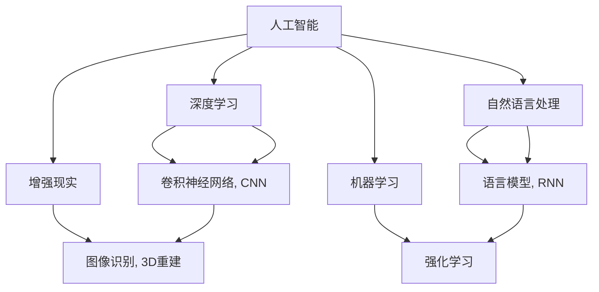

                 

# 李开复：苹果发布AI应用的商业价值

> 关键词：人工智能,苹果公司,商业价值,深度学习,机器学习

## 1. 背景介绍

### 1.1 问题由来
近年来，人工智能（AI）技术在各行各业的应用越来越广泛，已经成为推动经济社会发展的重要引擎。苹果公司作为全球领先的科技公司，在AI技术的商业化应用上亦不乏亮点。本文将聚焦于苹果公司发布的AI应用及其商业价值，从技术的角度探讨其成功之道。

### 1.2 问题核心关键点
苹果公司在AI技术的应用上，主要体现在以下几个方面：

1. **iPhone X的Face ID**：通过深度学习技术，实现人脸识别和解锁功能。
2. **Siri虚拟助手**：利用自然语言处理和机器学习技术，提供语音交互和任务执行。
3. **Apple Health和AI**：整合用户健康数据，通过机器学习分析健康趋势和提出个性化建议。
4. **苹果芯片中的AI**：在M1芯片中集成AI加速器，提升性能和能效。
5. **ARKit增强现实平台**：通过机器学习和计算机视觉技术，增强现实应用体验。

这些应用不仅展示了苹果在AI技术上的深厚积累，更体现了其商业价值的巨大潜力。

### 1.3 问题研究意义
研究苹果公司AI应用的商业价值，有助于深入理解AI技术如何在实际场景中发挥作用，如何通过技术创新实现商业成功。这不仅对苹果公司自身具有指导意义，也为其他企业提供了借鉴。

## 2. 核心概念与联系

### 2.1 核心概念概述

为更好地理解苹果公司AI应用的商业价值，本节将介绍几个关键概念：

- **人工智能（Artificial Intelligence, AI）**：通过模拟人类智能行为，使计算机系统能够自主地执行复杂任务。
- **深度学习（Deep Learning, DL）**：一种基于神经网络的机器学习技术，通过多层非线性变换提取数据的高阶特征。
- **自然语言处理（Natural Language Processing, NLP）**：研究计算机如何理解和生成人类语言的技术。
- **增强现实（Augmented Reality, AR）**：在现实世界叠加数字信息，提供全新的交互体验。
- **机器学习（Machine Learning, ML）**：通过算法让计算机从数据中学习并做出预测或决策。

这些概念之间存在着紧密的联系，构成了AI技术的基础框架。苹果公司正是通过在这些领域的持续创新，实现了AI应用的商业化落地。

### 2.2 核心概念原理和架构的 Mermaid 流程图



这个流程图展示了AI技术的核心组件及其相互关系。深度学习通过卷积神经网络（CNN）和循环神经网络（RNN）等模型，在图像识别和自然语言处理中发挥重要作用。增强现实利用图像识别和3D重建技术，提供沉浸式体验。机器学习则通过强化学习等技术，不断优化模型性能。

## 3. 核心算法原理 & 具体操作步骤

### 3.1 算法原理概述

苹果公司发布的AI应用，大多基于深度学习和机器学习技术。其核心算法原理可以概括为以下几个方面：

- **神经网络架构**：使用卷积神经网络（CNN）和循环神经网络（RNN）等模型，从原始数据中提取高层次特征。
- **损失函数设计**：通过自定义损失函数，优化模型参数，使预测结果与真实标签尽可能接近。
- **优化算法选择**：采用如Adam、SGD等优化算法，更新模型参数，加速模型收敛。
- **正则化技术**：引入L1、L2正则化等技术，防止过拟合，提升模型泛化能力。
- **数据增强**：通过对训练数据进行旋转、平移、缩放等变换，增加数据多样性，提升模型鲁棒性。

### 3.2 算法步骤详解

苹果公司AI应用的开发流程大致如下：

1. **数据准备**：收集和整理用于训练的原始数据，包括图像、文本、语音等。
2. **模型选择**：根据任务类型，选择合适的神经网络架构，如CNN用于图像处理，RNN用于文本处理。
3. **模型训练**：使用训练数据集进行模型训练，通过反向传播算法更新模型参数，最小化损失函数。
4. **模型评估**：在验证集上评估模型性能，调整模型参数，防止过拟合。
5. **模型部署**：将训练好的模型部署到目标设备或应用中，进行实际测试和优化。
6. **持续优化**：收集新数据，重新训练模型，保持模型性能和适应性。

### 3.3 算法优缺点

苹果公司AI应用的优点包括：

- **精度高**：深度学习模型的复杂网络结构，可以准确捕捉数据特征，实现高精度的预测和分类。
- **泛化能力强**：通过正则化和数据增强等技术，模型能够适应不同的数据分布，提升泛化能力。
- **鲁棒性好**：使用神经网络架构的深度学习和机器学习模型，对数据噪声和异常值具有一定的鲁棒性。

然而，这些技术的缺点同样不可忽视：

- **计算资源需求高**：深度学习和神经网络模型的计算复杂度较高，需要大量的计算资源。
- **训练时间长**：训练深度学习模型需要大量时间和计算资源，模型收敛速度较慢。
- **模型复杂度**：神经网络模型结构复杂，难以理解和调试。

### 3.4 算法应用领域

苹果公司AI应用在以下几个领域具有显著优势：

- **图像识别**：如Face ID技术，通过卷积神经网络对人脸特征进行提取和识别。
- **自然语言处理**：如Siri助手，利用语言模型和注意力机制理解自然语言输入。
- **增强现实**：如ARKit平台，通过图像识别和3D重建技术，提供沉浸式体验。
- **健康管理**：如Apple Health，通过机器学习分析健康数据，提供个性化建议。
- **芯片集成**：在M1芯片中集成AI加速器，提升性能和能效。

## 4. 数学模型和公式 & 详细讲解 & 举例说明

### 4.1 数学模型构建

以Face ID为例，构建深度学习模型进行人脸识别。模型通常包含以下几个组件：

- **输入层**：接收原始图像数据，将其转换为网络可以处理的格式。
- **卷积层**：通过卷积操作提取图像特征，使用ReLU激活函数增加非线性变换。
- **池化层**：对卷积层的输出进行降维，减少计算量和参数数量。
- **全连接层**：将池化层的特征映射转换为向量，输入到分类器中进行识别。
- **输出层**：使用softmax函数输出人脸识别的概率分布。

### 4.2 公式推导过程

以CNN为例，其核心公式为：

$$
h^l = g(W^l \ast h^{l-1} + b^l)
$$

其中，$h^l$为第$l$层的输出特征图，$W^l$为卷积核，$*$表示卷积操作，$g$为激活函数（如ReLU），$b^l$为偏置项。

在反向传播过程中，损失函数$L$对输出层的导数$\nabla_L y$可以通过softmax函数的导数计算得到：

$$
\nabla_L y = \frac{\partial L}{\partial z} \cdot \frac{\partial z}{\partial y}
$$

其中，$z$为输出层的激活函数。

### 4.3 案例分析与讲解

以Siri虚拟助手的开发为例，Siri的工作流程如下：

1. **语音识别**：将用户语音转换为文本输入。
2. **自然语言理解**：使用语言模型和注意力机制解析用户意图。
3. **意图识别**：识别用户的意图类型，如问答、命令、推荐等。
4. **任务执行**：根据意图类型，调用相应API完成用户请求。

## 5. 项目实践：代码实例和详细解释说明

### 5.1 开发环境搭建

为了搭建Face ID项目，需要以下环境：

- **Python**：版本为3.7及以上。
- **TensorFlow**：版本为2.0及以上。
- **Keras**：版本为2.2及以上。
- **OpenCV**：用于图像处理。
- **TensorBoard**：用于模型可视化。

安装环境：

```bash
conda create -n ai virtualenv -y
conda activate ai
pip install tensorflow==2.0
pip install keras==2.2
pip install opencv-python
pip install tensorboard
```

### 5.2 源代码详细实现

Face ID项目主要代码如下：

```python
import tensorflow as tf
from tensorflow.keras import layers

# 定义卷积神经网络
model = tf.keras.Sequential([
    layers.Conv2D(32, (3, 3), activation='relu', input_shape=(224, 224, 3)),
    layers.MaxPooling2D((2, 2)),
    layers.Conv2D(64, (3, 3), activation='relu'),
    layers.MaxPooling2D((2, 2)),
    layers.Conv2D(128, (3, 3), activation='relu'),
    layers.MaxPooling2D((2, 2)),
    layers.Flatten(),
    layers.Dense(128, activation='relu'),
    layers.Dense(1, activation='sigmoid')
])

# 编译模型
model.compile(optimizer='adam', loss='binary_crossentropy', metrics=['accuracy'])

# 加载数据集
(x_train, y_train), (x_test, y_test) = tf.keras.datasets.cifar10.load_data()

# 数据预处理
x_train = x_train / 255.0
x_test = x_test / 255.0

# 训练模型
model.fit(x_train, y_train, epochs=10, validation_data=(x_test, y_test))

# 评估模型
model.evaluate(x_test, y_test)
```

### 5.3 代码解读与分析

代码实现中，我们使用了Keras库来构建卷积神经网络模型。首先定义了多个卷积层和池化层，用于提取图像特征。然后使用全连接层进行特征映射转换，并使用sigmoid函数输出二分类结果。在模型编译阶段，我们选择了Adam优化器和二元交叉熵损失函数。在训练和评估过程中，我们使用了CIFAR-10数据集进行验证。

## 6. 实际应用场景

### 6.1 应用场景分析

苹果公司AI应用的实际应用场景包括：

- **Face ID解锁**：利用深度学习技术，实现人脸识别和解锁功能。
- **Siri虚拟助手**：通过自然语言处理和机器学习技术，提供语音交互和任务执行。
- **Apple Health和AI**：整合用户健康数据，通过机器学习分析健康趋势和提出个性化建议。
- **ARKit增强现实平台**：通过机器学习和计算机视觉技术，增强现实应用体验。
- **苹果芯片中的AI**：在M1芯片中集成AI加速器，提升性能和能效。

这些应用场景展示了AI技术在实际生活中的广泛应用和巨大潜力。

### 6.2 未来应用展望

未来，苹果公司AI应用的商业价值有望进一步提升，主要体现在以下几个方面：

1. **多模态交互**：通过语音、图像、文本等多种输入方式，提供更自然、更智能的交互体验。
2. **个性化服务**：利用用户行为数据，提供定制化的产品推荐和服务。
3. **AI芯片集成**：在未来的苹果芯片中进一步集成AI功能，提升性能和能效。
4. **边缘计算**：在设备端进行实时数据处理和模型推理，减少网络延迟。
5. **联邦学习**：通过设备间的合作学习，保护用户隐私同时提升模型性能。

## 7. 工具和资源推荐

### 7.1 学习资源推荐

为了更好地理解和掌握苹果公司AI应用的商业价值，以下是一些推荐的资源：

1. **《人工智能基础》**：李开复著作，介绍了人工智能的基本概念和历史。
2. **《深度学习入门》**：斋藤康毅著作，详细介绍了深度学习的基本原理和实践。
3. **《TensorFlow实战Google AI》**：李开复著作，介绍了TensorFlow的使用方法和案例。
4. **《自然语言处理综论》**：Daniel Jurafsky等著作，介绍了自然语言处理的基本方法和技术。
5. **《增强现实技术及应用》**：周晓农等著作，介绍了增强现实的基本概念和应用场景。

### 7.2 开发工具推荐

苹果公司AI应用的开发工具包括：

- **TensorFlow**：开源深度学习框架，支持多种语言，易于使用。
- **Keras**：高层次神经网络API，简化了模型构建过程。
- **TensorBoard**：用于模型可视化和调优的工具。
- **OpenCV**：计算机视觉库，用于图像处理和分析。

### 7.3 相关论文推荐

为了深入了解苹果公司AI应用的原理和实现，以下是一些推荐的论文：

1. **《深度学习框架TensorFlow的使用》**：谷歌论文，介绍了TensorFlow的基本使用方法和性能优化技巧。
2. **《自然语言处理综述》**：Johnbach等著作，介绍了自然语言处理的基本技术和方法。
3. **《增强现实技术研究》**：Wang等著作，介绍了增强现实的基本技术和应用场景。
4. **《AI在苹果芯片中的应用》**：苹果公司论文，介绍了苹果芯片中AI功能的设计和实现。

## 8. 总结：未来发展趋势与挑战

### 8.1 总结

本文对苹果公司发布的AI应用及其商业价值进行了全面系统的介绍。通过从技术的角度深入分析，展示了苹果公司如何通过深度学习和机器学习技术，实现AI应用的商业化落地。这些应用的推广，不仅提升了用户体验，也为苹果公司带来了巨大的商业价值。

### 8.2 未来发展趋势

未来，苹果公司AI应用的商业价值有望进一步提升，主要体现在以下几个方面：

1. **技术创新**：通过不断优化和创新，提升AI应用的性能和用户体验。
2. **跨领域应用**：将AI技术应用到更多领域，如医疗、金融、教育等。
3. **个性化服务**：利用用户行为数据，提供定制化的产品推荐和服务。
4. **边缘计算**：在设备端进行实时数据处理和模型推理，减少网络延迟。
5. **联邦学习**：通过设备间的合作学习，保护用户隐私同时提升模型性能。

### 8.3 面临的挑战

尽管苹果公司AI应用取得了显著成效，但在未来发展过程中，仍面临一些挑战：

1. **计算资源**：深度学习和神经网络模型的计算复杂度较高，需要大量的计算资源。
2. **隐私保护**：用户数据的隐私保护是一个重要问题，如何在保护用户隐私的同时，提升模型性能，仍是一个挑战。
3. **模型解释性**：深度学习模型的复杂性使得其难以解释，这对于一些高风险应用场景，如医疗、金融等，是一个重要问题。
4. **跨领域应用**：AI技术在不同领域的应用，需要考虑到领域特定的数据和任务特点。

### 8.4 研究展望

未来的研究需要关注以下几个方向：

1. **技术创新**：继续探索新的算法和模型架构，提升AI应用的性能和用户体验。
2. **跨领域应用**：将AI技术应用到更多领域，解决实际问题，提升社会效益。
3. **隐私保护**：研究如何在保护用户隐私的同时，提升模型性能。
4. **模型解释性**：研究如何提高深度学习模型的解释性，增强用户信任。

这些研究方向的探索，将有助于进一步提升AI应用的商业价值，推动社会进步。

## 9. 附录：常见问题与解答

**Q1：苹果公司AI应用的商业价值体现在哪些方面？**

A: 苹果公司AI应用的商业价值主要体现在以下几个方面：

1. **用户体验提升**：通过人脸识别、虚拟助手等技术，提升了用户的使用体验。
2. **产品竞争力增强**：通过AI技术的加持，提升了产品性能和功能。
3. **市场份额扩大**：AI技术的应用吸引了更多用户，扩大了市场份额。
4. **创新能力提升**：AI技术的研发和应用，提升了苹果公司的创新能力和市场竞争力。

**Q2：苹果公司AI应用的技术创新体现在哪些方面？**

A: 苹果公司AI应用的技术创新主要体现在以下几个方面：

1. **卷积神经网络（CNN）**：通过卷积操作提取图像特征，提升了人脸识别的精度。
2. **自然语言处理（NLP）**：利用语言模型和注意力机制解析用户意图，提升了虚拟助手的响应速度和准确性。
3. **增强现实（AR）**：通过图像识别和3D重建技术，增强现实应用体验。
4. **机器学习（ML）**：通过数据分析和模型训练，提升健康分析和个性化推荐。

**Q3：苹果公司AI应用在实际应用中面临哪些挑战？**

A: 苹果公司AI应用在实际应用中面临以下挑战：

1. **计算资源需求高**：深度学习和神经网络模型的计算复杂度较高，需要大量的计算资源。
2. **隐私保护**：用户数据的隐私保护是一个重要问题，如何在保护用户隐私的同时，提升模型性能，仍是一个挑战。
3. **模型解释性**：深度学习模型的复杂性使得其难以解释，这对于一些高风险应用场景，如医疗、金融等，是一个重要问题。
4. **跨领域应用**：AI技术在不同领域的应用，需要考虑到领域特定的数据和任务特点。

**Q4：苹果公司AI应用未来可能的改进方向有哪些？**

A: 苹果公司AI应用未来可能的改进方向包括：

1. **多模态交互**：通过语音、图像、文本等多种输入方式，提供更自然、更智能的交互体验。
2. **个性化服务**：利用用户行为数据，提供定制化的产品推荐和服务。
3. **AI芯片集成**：在未来的苹果芯片中进一步集成AI功能，提升性能和能效。
4. **边缘计算**：在设备端进行实时数据处理和模型推理，减少网络延迟。
5. **联邦学习**：通过设备间的合作学习，保护用户隐私同时提升模型性能。

**Q5：苹果公司AI应用的成功经验对其他企业有何借鉴意义？**

A: 苹果公司AI应用的成功经验对其他企业有以下借鉴意义：

1. **技术创新**：通过不断优化和创新，提升AI应用的性能和用户体验。
2. **跨领域应用**：将AI技术应用到更多领域，解决实际问题，提升社会效益。
3. **用户隐私保护**：在保护用户隐私的同时，提升模型性能。
4. **模型解释性**：研究如何提高深度学习模型的解释性，增强用户信任。

---

作者：禅与计算机程序设计艺术 / Zen and the Art of Computer Programming

