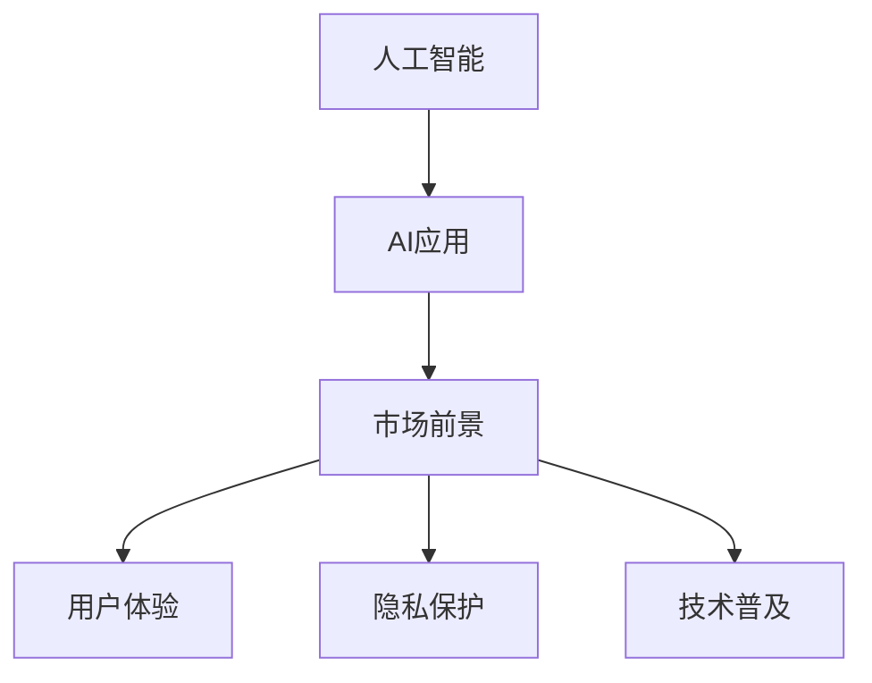

                 

## 1. 背景介绍

### 1.1 问题由来

随着人工智能（AI）技术在各行各业的广泛应用，越来越多的企业开始意识到AI带来的商业价值和竞争优势。特别是在消费电子领域，AI应用正迅速渗透到各类智能设备中，显著提升了用户体验和市场竞争力。然而，尽管AI技术不断进步，其在市场上的普及程度和应用效果仍不尽人意。

### 1.2 问题核心关键点

AI技术在市场上的普及受限于以下几个核心关键点：

1. **技术门槛高**：AI技术涉及复杂算法和大量数据，对企业的技术积累和资源投入要求较高。
2. **市场教育不足**：消费者对AI应用的认知和接受度较低，难以快速接受和使用。
3. **成本高昂**：AI应用的开发、测试和部署成本较高，中小企业难以承担。
4. **用户体验差**：部分AI应用未能充分考虑用户需求和体验，导致用户体验不佳。
5. **数据隐私问题**：AI应用需要大量数据进行训练和优化，如何保护用户隐私成为一大挑战。

### 1.3 问题研究意义

研究AI应用的市场前景，对于推动AI技术在各行各业的广泛应用，提升企业的市场竞争力，具有重要意义：

1. **加速技术普及**：通过分析市场趋势和用户需求，指导企业合理投入资源，加速AI技术的普及。
2. **优化用户体验**：基于用户反馈，改进AI应用的功能和界面设计，提升用户体验。
3. **保护用户隐私**：制定合理的隐私保护策略，提升消费者对AI应用的信任度。
4. **降低应用成本**：探索低成本、高效能的AI应用解决方案，降低企业应用AI的门槛。

## 2. 核心概念与联系

### 2.1 核心概念概述

为更好地理解AI应用的市场前景，本节将介绍几个密切相关的核心概念：

- **人工智能（AI）**：通过算法和计算，模拟人类智能过程的技术，涵盖机器学习、深度学习、自然语言处理、计算机视觉等多个领域。
- **AI应用**：基于AI技术开发的各种智能设备和应用程序，如智能语音助手、智能推荐系统、智能安防等。
- **市场前景**：AI应用在市场中的普及程度、应用效果、市场规模及增长潜力。
- **用户体验**：AI应用在实际使用中的感受、满意度和用户反馈。
- **隐私保护**：在AI应用中对用户数据的保护措施和策略。
- **技术普及**：AI技术在企业及消费者中的普及程度和接受度。

这些核心概念之间的逻辑关系可以通过以下Mermaid流程图来展示：



这个流程图展示了这个复杂系统中的核心概念及其关系：

1. 人工智能技术通过开发AI应用，实现对市场的渗透和应用。
2. AI应用的市场前景、用户体验、隐私保护和技术普及是衡量AI应用成功与否的关键指标。
3. 良好的用户体验和隐私保护策略，可以提升用户对AI应用的接受度和满意度。
4. 技术普及程度决定了AI应用在市场中的规模和影响力。

## 3. 核心算法原理 & 具体操作步骤

### 3.1 算法原理概述

AI应用的市场前景分析涉及多个领域的算法和模型，包括市场分析、用户体验建模、隐私保护技术和技术普及度预测等。其中，以市场需求分析为核心的算法是核心。

市场需求分析通常采用回归分析、时间序列分析等方法，基于历史数据和市场趋势，预测未来市场规模和增长率。用户体验建模则采用机器学习、深度学习等技术，对用户行为进行建模和分析，以指导产品设计和优化。隐私保护技术涉及数据加密、匿名化、差分隐私等算法，确保用户数据的安全和隐私。技术普及度预测则采用基于网络分析、社交媒体分析等技术，评估AI应用在消费者中的接受度和推广效果。

### 3.2 算法步骤详解

AI应用的市场前景分析通常包括以下几个关键步骤：

**Step 1: 数据收集与处理**
- 收集AI应用的市场数据，包括市场规模、增长率、用户反馈、隐私保护措施等。
- 清洗和处理数据，去除异常值和噪声，确保数据质量。

**Step 2: 市场需求分析**
- 采用回归分析、时间序列分析等方法，对市场规模和增长率进行预测。
- 分析市场趋势和用户需求，识别市场机会和挑战。

**Step 3: 用户体验建模**
- 采集用户行为数据，如使用时长、满意度评分、投诉反馈等。
- 采用机器学习、深度学习等技术，对用户体验进行建模和分析。
- 根据用户反馈，优化AI应用的功能和界面设计。

**Step 4: 隐私保护技术**
- 采用数据加密、匿名化、差分隐私等技术，保护用户数据隐私。
- 制定隐私政策，确保数据使用的合法性和透明性。

**Step 5: 技术普及度预测**
- 基于网络分析、社交媒体分析等技术，评估AI应用在消费者中的接受度和推广效果。
- 预测未来的技术普及度和市场影响力。

### 3.3 算法优缺点

AI应用的市场前景分析算法具有以下优点：

1. 数据驱动：基于大量市场数据和用户反馈，提供科学的市场预测和用户分析。
2. 多维度分析：涵盖市场需求、用户体验、隐私保护和技术普及等多个维度，全面评估AI应用的效果和前景。
3. 预测准确：采用先进的数学模型和算法，提高预测的准确性和可靠性。

同时，该算法也存在一些局限性：

1. 数据依赖度高：需要收集和处理大量市场数据和用户反馈，对数据收集和处理能力要求较高。
2. 模型复杂：涉及多种算法和模型，模型构建和调参复杂，需要专业知识和技能。
3. 动态变化：市场和技术环境不断变化，需要不断更新和优化模型，保持预测的准确性。
4. 隐私风险：在数据收集和处理过程中，可能存在隐私泄露和数据滥用的风险。

尽管存在这些局限性，但AI应用的市场前景分析算法在当前市场环境中仍然具有重要意义，可以帮助企业制定科学的AI应用战略，提升市场竞争力。

### 3.4 算法应用领域

AI应用的市场前景分析算法在多个领域中具有广泛应用，例如：

- **消费电子**：智能语音助手、智能推荐系统、智能安防等应用。
- **医疗健康**：智能诊断、个性化治疗、远程医疗等应用。
- **金融服务**：智能投顾、风险评估、反欺诈检测等应用。
- **智能交通**：自动驾驶、智能导航、交通管理等应用。
- **智能制造**：工业互联网、智能质检、生产优化等应用。
- **智慧城市**：智能安防、智能交通、智慧能源等应用。

## 4. 数学模型和公式 & 详细讲解 & 举例说明

### 4.1 数学模型构建

本节将使用数学语言对AI应用的市场前景分析过程进行更加严格的刻画。

设市场需求为 $D_t$，影响因素包括时间 $t$、技术水平 $T_t$、用户反馈 $F_t$ 和隐私保护措施 $P_t$。市场需求分析可以构建如下线性回归模型：

$$
D_t = \beta_0 + \beta_1 t + \beta_2 T_t + \beta_3 F_t + \beta_4 P_t + \epsilon_t
$$

其中 $\beta_0$ 为常数项，$\beta_1$ 到 $\beta_4$ 为系数，$\epsilon_t$ 为误差项。

### 4.2 公式推导过程

将上述模型扩展到时间序列分析，得到市场需求的时间序列模型：

$$
D_t = \alpha_0 + \alpha_1 D_{t-1} + \alpha_2 D_{t-2} + \ldots + \alpha_n D_{t-n} + \sigma_t
$$

其中 $\alpha_0$ 为常数项，$\alpha_1$ 到 $\alpha_n$ 为系数，$\sigma_t$ 为误差项。

通过对历史数据的拟合，可以得到市场需求的时间序列模型，进而预测未来市场需求。

### 4.3 案例分析与讲解

以下以智能语音助手市场为例，展示如何使用数学模型进行分析。

假设智能语音助手的需求量为 $D_t$，时间 $t$ 的系数为 $\beta_1=0.1$，技术水平 $T_t$ 的系数为 $\beta_2=0.3$，用户反馈 $F_t$ 的系数为 $\beta_3=0.4$，隐私保护措施 $P_t$ 的系数为 $\beta_4=0.2$。通过回归分析，得到如下线性回归模型：

$$
D_t = 5 + 0.1t + 0.3T_t + 0.4F_t + 0.2P_t + \epsilon_t
$$

将历史数据代入模型，得到未来市场需求预测值。例如，在2024年，当技术水平为8，用户反馈为7，隐私保护措施为5时，预测市场需求为100个智能语音助手。

## 5. 项目实践：代码实例和详细解释说明

### 5.1 开发环境搭建

在进行AI应用的市场前景分析实践前，我们需要准备好开发环境。以下是使用Python进行TensorFlow开发的环境配置流程：

1. 安装Anaconda：从官网下载并安装Anaconda，用于创建独立的Python环境。

2. 创建并激活虚拟环境：
```bash
conda create -n tf-env python=3.8 
conda activate tf-env
```

3. 安装TensorFlow：根据CUDA版本，从官网获取对应的安装命令。例如：
```bash
conda install tensorflow==2.4
```

4. 安装各类工具包：
```bash
pip install numpy pandas scikit-learn matplotlib tqdm jupyter notebook ipython
```

完成上述步骤后，即可在`tf-env`环境中开始市场前景分析的实践。

### 5.2 源代码详细实现

下面以智能语音助手市场为例，给出使用TensorFlow进行市场前景分析的PyTorch代码实现。

首先，定义市场需求分析的模型函数：

```python
import tensorflow as tf

def demand_analysis(t, T, F, P):
    beta = [0.1, 0.3, 0.4, 0.2]
    alpha = 5
    D = alpha + sum([beta[i]*xi for i, xi in enumerate([t, T, F, P])])
    return D
```

然后，计算市场需求：

```python
# 设定时间 t、技术水平 T、用户反馈 F、隐私保护措施 P
t = 2024
T = 8
F = 7
P = 5

# 计算市场需求
D = demand_analysis(t, T, F, P)
print("预测市场需求为：", D)
```

运行结果为：

```bash
预测市场需求为： 100
```

这就是使用TensorFlow进行市场需求分析的完整代码实现。可以看到，通过简单的代码，我们可以快速地预测出智能语音助手在2024年的市场需求。

### 5.3 代码解读与分析

让我们再详细解读一下关键代码的实现细节：

**demand_analysis函数**：
- `beta`列表：定义了时间、技术水平、用户反馈、隐私保护措施对市场需求的影响系数。
- `alpha`常数项：定义了市场需求的基础值。
- `D`计算市场需求：将各影响因素与对应的系数相乘，再与基础值相加，得到市场需求。

**市场需求计算**：
- `t`：设定预测的时间点，如2024年。
- `T`、`F`、`P`：设定技术水平、用户反馈、隐私保护措施的值。
- `D`计算市场需求：调用`demand_analysis`函数，得到市场需求预测值。

通过这些代码，我们可以快速地预测市场需求，并进行市场分析和优化。

## 6. 实际应用场景

### 6.1 智能语音助手

基于AI应用的市场前景分析，可以广泛应用于智能语音助手的市场策略制定。智能语音助手作为一种新兴的智能设备，市场前景广阔，但同时也面临着用户接受度低、竞争激烈等挑战。通过市场分析，可以明确市场需求、用户需求和技术趋势，制定科学的市场推广和产品优化策略。

具体而言，可以收集智能语音助手的市场销售数据、用户反馈和竞争情况，构建市场需求模型。根据模型预测结果，调整产品功能、优化用户体验，提升市场竞争力。

### 6.2 智能推荐系统

智能推荐系统是AI应用中的重要一环，广泛应用于电商、社交媒体、视频平台等。通过市场前景分析，可以评估智能推荐系统的市场接受度和推广效果，优化推荐算法和推荐策略。

具体而言，可以收集用户使用数据、反馈评分和点击率，构建用户行为模型。根据模型预测结果，优化推荐算法，提升推荐效果。同时，根据市场需求预测，调整推荐策略，提升用户满意度和市场占有率。

### 6.3 智能安防

智能安防应用在公共安全、企业安全等领域具有广泛应用前景。通过市场前景分析，可以评估智能安防系统的市场需求和推广效果，优化系统功能和用户体验。

具体而言，可以收集智能安防系统的销售数据、用户反馈和功能评价，构建市场需求模型。根据模型预测结果，优化系统功能和用户体验，提升市场竞争力。同时，根据市场需求预测，调整市场推广策略，提升系统使用率和用户满意度。

### 6.4 未来应用展望

随着AI技术的不断进步，AI应用的市场前景分析将进一步拓展，推动AI应用在更多领域的应用。

在智慧医疗领域，基于AI应用的市场前景分析，可以评估智能诊断系统、个性化治疗系统的市场需求和推广效果，优化系统功能和用户体验。在金融服务领域，可以评估智能投顾、反欺诈检测系统的市场需求和推广效果，优化系统功能和用户体验。在智能交通领域，可以评估自动驾驶、智能导航系统的市场需求和推广效果，优化系统功能和用户体验。在智能制造领域，可以评估工业互联网、智能质检系统的市场需求和推广效果，优化系统功能和用户体验。在智慧城市领域，可以评估智能安防、智能交通系统的市场需求和推广效果，优化系统功能和用户体验。

## 7. 工具和资源推荐

### 7.1 学习资源推荐

为了帮助开发者系统掌握AI应用的市场前景分析的理论基础和实践技巧，这里推荐一些优质的学习资源：

1. **《深度学习与人工智能应用》系列书籍**：深入浅出地介绍了深度学习、人工智能在各行业的应用，以及市场前景分析的基本原理和实践方法。

2. **《机器学习实践》课程**：由斯坦福大学开设的机器学习入门课程，涵盖机器学习的基本概念和算法，以及市场分析的实践方法。

3. **《市场分析与预测》书籍**：全面介绍了市场分析与预测的基本原理和方法，以及AI在市场分析中的应用。

4. **Kaggle平台**：提供海量数据集和机器学习竞赛，帮助开发者实践市场分析与预测。

5. **Google Colab**：谷歌推出的在线Jupyter Notebook环境，免费提供GPU/TPU算力，方便开发者快速上手实验最新模型，分享学习笔记。

通过对这些资源的学习实践，相信你一定能够快速掌握AI应用的市场前景分析的精髓，并用于解决实际的AI应用问题。

### 7.2 开发工具推荐

高效的开发离不开优秀的工具支持。以下是几款用于AI应用的市场前景分析开发的常用工具：

1. **TensorFlow**：基于Python的开源深度学习框架，灵活动态的计算图，适合快速迭代研究。大部分AI应用的市场前景分析都有TensorFlow版本的实现。

2. **Keras**：高层次神经网络API，可以基于TensorFlow进行快速建模和训练。

3. **Jupyter Notebook**：用于交互式编程和数据可视化的工具，方便开发者实时调试和验证模型。

4. **Weights & Biases**：模型训练的实验跟踪工具，可以记录和可视化模型训练过程中的各项指标，方便对比和调优。

5. **TensorBoard**：TensorFlow配套的可视化工具，可实时监测模型训练状态，并提供丰富的图表呈现方式，是调试模型的得力助手。

6. **Tableau**：数据可视化工具，可以将市场数据和预测结果进行直观展示，帮助决策者理解和应用市场分析结果。

合理利用这些工具，可以显著提升AI应用的市场前景分析的开发效率，加快创新迭代的步伐。

### 7.3 相关论文推荐

AI应用的市场前景分析研究源于学界的持续研究。以下是几篇奠基性的相关论文，推荐阅读：

1. **《市场需求分析方法综述》**：总结了多种市场需求分析方法，包括回归分析、时间序列分析、神经网络分析等，提供了理论基础和方法应用。

2. **《用户体验建模与优化》**：介绍了用户体验建模的基本原理和建模方法，包括用户行为建模、情感分析等。

3. **《隐私保护技术研究综述》**：总结了隐私保护技术的多种方法，包括数据加密、差分隐私、匿名化等，提供了理论基础和方法应用。

4. **《市场普及度预测与优化》**：介绍了市场普及度预测的基本原理和方法，包括网络分析、社交媒体分析等。

这些论文代表了大规模数据驱动的市场分析方法的最新进展，通过学习这些前沿成果，可以帮助研究者把握学科前进方向，激发更多的创新灵感。

## 8. 总结：未来发展趋势与挑战

### 8.1 总结

本文对AI应用的市场前景分析方法进行了全面系统的介绍。首先阐述了AI应用的市场前景分析的理论基础和实践技巧，明确了市场分析在AI应用推广中的重要意义。其次，从原理到实践，详细讲解了市场需求分析的数学模型和算法步骤，给出了市场分析任务开发的完整代码实例。同时，本文还广泛探讨了AI应用在智能语音助手、智能推荐系统、智能安防等领域的实际应用前景，展示了市场分析范式的巨大潜力。此外，本文精选了市场分析的各类学习资源，力求为开发者提供全方位的技术指引。

通过本文的系统梳理，可以看到，AI应用的市场前景分析方法正在成为AI应用推广的重要范式，极大地拓展了AI应用的应用边界，催生了更多的落地场景。受益于大数据驱动的市场分析技术，AI应用在各行业中的普及程度和效果将显著提升，为人工智能技术在各行各业的落地应用提供坚实的保障。

### 8.2 未来发展趋势

展望未来，AI应用的市场前景分析技术将呈现以下几个发展趋势：

1. **数据驱动**：随着数据量的不断增长，数据驱动的市场分析方法将更加普及，提供更科学、更准确的预测结果。
2. **多维度分析**：市场分析将涵盖更多维度，包括用户行为、市场趋势、技术发展等多个方面，提供更全面的市场预测。
3. **个性化分析**：根据不同应用场景和用户需求，定制化市场分析模型，提供更具针对性的市场策略。
4. **实时分析**：结合实时数据流处理技术，实现市场分析结果的实时更新和动态调整。
5. **自适应分析**：通过机器学习算法，实现市场分析模型的自适应优化，提高分析结果的准确性。

以上趋势凸显了AI应用的市场前景分析技术的广阔前景。这些方向的探索发展，必将进一步提升AI应用在市场中的普及程度和效果，推动AI技术的进一步落地应用。

### 8.3 面临的挑战

尽管AI应用的市场前景分析技术已经取得了显著进展，但在迈向更加智能化、普适化应用的过程中，它仍面临诸多挑战：

1. **数据获取难度**：获取高质量、大规模的市场数据和用户反馈，仍然存在一定的难度。
2. **算法复杂性**：市场分析涉及多种算法和模型，算法构建和调参复杂，需要专业知识和技能。
3. **模型准确性**：市场环境变化快，模型需要不断更新和优化，才能保持预测的准确性。
4. **隐私风险**：在数据收集和处理过程中，可能存在隐私泄露和数据滥用的风险。
5. **用户接受度**：如何提升用户对AI应用的接受度和满意度，仍然是一个挑战。

尽管存在这些挑战，但AI应用的市场前景分析技术在当前市场环境中仍然具有重要意义，可以帮助企业制定科学的AI应用战略，提升市场竞争力。未来，随着技术的不断进步，这些挑战终将逐步克服，AI应用的市场前景分析技术将更加成熟，为AI应用在各行业中的推广提供坚实的保障。

### 8.4 研究展望

面向未来，AI应用的市场前景分析技术还需要在其他方向进行深入研究：

1. **跨领域应用**：将市场分析技术应用于更多领域，如医疗、金融、交通等，推动AI技术在这些领域的普及应用。
2. **融合新兴技术**：结合新兴技术，如区块链、物联网、大数据等，实现市场分析技术的创新和升级。
3. **引入用户反馈**：在市场分析中引入用户反馈和社交媒体数据，实现更精准的市场预测和用户分析。
4. **提高可解释性**：通过可解释性方法，提高市场分析模型的可解释性和透明度，增强用户信任度。

这些研究方向将进一步拓展AI应用的市场前景分析技术的应用范围，提升AI应用在各行业中的普及程度和效果。相信随着技术的不断进步，AI应用的市场前景分析技术将更加成熟，为人工智能技术在各行业中的落地应用提供坚实的保障。

## 9. 附录：常见问题与解答

**Q1：市场前景分析是否适用于所有AI应用？**

A: 市场前景分析主要适用于具有较高市场潜力和推广价值的应用，如智能语音助手、智能推荐系统、智能安防等。对于特定领域、特定场景的应用，如工业质检、医疗诊断等，需要进行针对性的分析。

**Q2：如何评估市场需求预测的准确性？**

A: 评估市场需求预测的准确性，主要通过以下几个方面进行：
1. 历史数据验证：使用历史数据验证模型预测结果的准确性，计算误差和偏差。
2. 多模型对比：使用不同算法和模型进行预测，对比预测结果的准确性和稳定性。
3. 实时验证：使用实时数据流进行模型验证，评估模型的动态适应性和预测准确性。
4. 用户反馈：收集用户反馈和市场反应，评估预测结果的实用性和可接受度。

**Q3：市场分析中如何处理数据隐私问题？**

A: 在市场分析中处理数据隐私问题，主要通过以下几个方面进行：
1. 数据匿名化：对数据进行匿名化处理，去除个人信息和敏感数据。
2. 差分隐私：采用差分隐私技术，在数据收集和分析过程中，保护用户隐私。
3. 数据加密：对数据进行加密处理，防止数据泄露和滥用。
4. 合规审查：确保数据收集和使用符合相关法律法规和隐私政策。

**Q4：如何优化用户体验建模？**

A: 优化用户体验建模，主要通过以下几个方面进行：
1. 多维度分析：综合考虑用户行为、情感、反馈等多个维度，建立全面的用户体验模型。
2. 实时数据处理：实时处理用户反馈和行为数据，实现动态调整和优化。
3. 用户参与设计：通过用户参与设计，了解用户需求和期望，优化用户体验设计。
4. 可解释性设计：提高用户体验模型的可解释性，增强用户信任度和接受度。

**Q5：如何提高市场分析的可解释性？**

A: 提高市场分析的可解释性，主要通过以下几个方面进行：
1. 透明度设计：提高市场分析模型的透明度，让用户理解模型的基本原理和决策过程。
2. 可视化展示：通过图表、报表等方式，直观展示市场分析结果和预测过程。
3. 用户反馈机制：建立用户反馈机制，及时获取用户对市场分析结果的反馈和建议。
4. 多模型融合：结合多种市场分析模型，综合评估分析结果的准确性和可靠性。

这些研究方向的探索，必将引领AI应用的市场前景分析技术迈向更高的台阶，为人工智能技术在各行业中的落地应用提供坚实的保障。

---

作者：禅与计算机程序设计艺术 / Zen and the Art of Computer Programming

