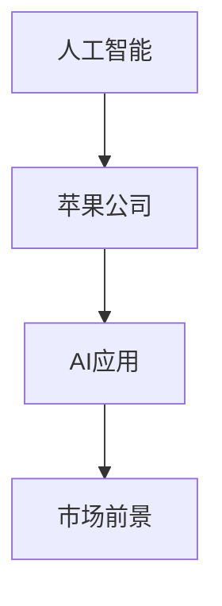

                 

# 李开复：苹果发布AI应用的市场前景

> 关键词：人工智能, 李开复, 苹果, 人工智能应用, 市场前景, 深度学习, 自然语言处理, 计算机视觉, 硬件加速

## 1. 背景介绍

### 1.1 问题由来
近年来，人工智能(AI)技术迅猛发展，成为科技行业的新热词。苹果公司（Apple Inc.）作为全球领先的科技企业，不断推出创新的AI应用，吸引了广泛关注。本文将探讨苹果发布AI应用的市场前景，通过李开复的观点深入剖析这一现象。

### 1.2 问题核心关键点
李开复，人工智能领域著名的先驱之一，曾多次在公开场合表达对AI技术的深度见解。他认为，苹果公司凭借其在硬件、软件和用户体验方面的优势，可以在AI应用市场上取得显著突破。本文将从AI应用的现状、发展趋势和市场前景三个维度进行深入分析。

### 1.3 问题研究意义
通过探讨苹果公司发布AI应用的市场前景，有助于理解AI技术在消费电子领域的实际应用及其对未来市场的潜在影响。同时，本文将结合李开复的看法，揭示AI技术在智能家居、医疗健康、教育娱乐等领域的发展潜力。

## 2. 核心概念与联系

### 2.1 核心概念概述

为更好地理解苹果发布AI应用的市场前景，本节将介绍几个密切相关的核心概念：

- **人工智能(AI)**：一种通过计算机系统模拟人类智能活动的科技，包括机器学习、深度学习、自然语言处理、计算机视觉等子领域。
- **苹果公司**：全球知名的消费电子公司，以其创新的硬件和软件产品闻名于世。
- **AI应用**：将AI技术应用于各类产品和服务中的实践，如智能家居、医疗健康、教育娱乐等。
- **市场前景**：AI应用在特定市场中的潜在增长和商业机会。

这些核心概念之间的逻辑关系可以通过以下Mermaid流程图来展示：



这个流程图展示了一个简单但清晰的逻辑关系：苹果公司利用其在AI领域的技术优势，推出AI应用，进一步拓展其市场前景。

## 3. 核心算法原理 & 具体操作步骤
### 3.1 算法原理概述

苹果公司发布的AI应用主要基于深度学习技术，利用大规模数据训练出复杂的模型。这些模型能够实现图像识别、语音识别、自然语言处理等任务。深度学习算法通常包括：

- **卷积神经网络(CNN)**：用于图像识别和计算机视觉任务，通过卷积和池化操作提取特征。
- **循环神经网络(RNN)**：用于自然语言处理任务，通过时间步长进行序列数据的处理。
- **长短期记忆网络(LSTM)**：一种RNN的变体，能够更好地处理长序列数据。
- **生成对抗网络(GAN)**：用于生成新的数据样本，如生成逼真的图像和视频。

苹果的AI应用通过这些深度学习模型，能够实现高效的数据处理和智能决策，提升用户体验和产品竞争力。

### 3.2 算法步骤详解

苹果公司发布AI应用的基本步骤包括以下几个关键环节：

**Step 1: 数据收集与预处理**
- 收集与AI应用相关的数据集，如图像、文本、音频等。
- 对数据进行清洗和预处理，去除噪声，标准化数据格式。

**Step 2: 模型选择与训练**
- 选择适合任务需求的深度学习模型，如CNN、RNN、LSTM等。
- 使用GPU、TPU等高性能计算设备进行模型训练，优化超参数。

**Step 3: 模型评估与优化**
- 在验证集上进行模型评估，使用交叉验证等方法选择最优模型。
- 根据评估结果调整模型结构，进一步优化性能。

**Step 4: 应用集成与部署**
- 将训练好的模型集成到苹果产品中，如iPhone、iPad、Apple Watch等。
- 部署模型到生产环境，确保稳定性和可靠性。

**Step 5: 用户体验与反馈**
- 收集用户反馈，优化产品体验。
- 持续迭代模型，提升应用效果。

### 3.3 算法优缺点

苹果公司发布AI应用的优势主要在于以下几个方面：

- **硬件优势**：苹果拥有强大的硬件设计能力和生产制造能力，能够提供高性能的计算设备，支持AI应用的高效训练和推理。
- **用户体验**：苹果的产品设计始终聚焦用户体验，通过硬件和软件无缝整合，提升AI应用的易用性和便捷性。
- **品牌效应**：苹果品牌在消费者中具有高认知度和高信任度，能够快速推广AI应用，获取市场优势。

然而，这些AI应用也存在一些局限性：

- **数据隐私问题**：大量用户数据的收集和处理可能引发隐私问题，需严格遵守相关法律法规。
- **模型泛化能力**：由于数据样本有限，AI模型在特定领域的应用可能存在泛化能力不足的问题。
- **开发成本高**：AI应用的开发和部署需要高昂的技术投入，可能影响企业的利润空间。

### 3.4 算法应用领域

苹果公司的AI应用主要集中在以下几个领域：

- **智能家居**：通过Siri语音助手和智能家居设备，实现家庭自动化和智能控制。
- **医疗健康**：利用AI技术进行疾病预测、诊断和治疗建议，如Apple Watch的心率监测功能。
- **教育娱乐**：开发教育应用，如编程学习工具、游戏互动平台，提升学习体验和娱乐趣味。
- **计算机视觉**：在图像识别、面部识别等应用中，提升产品性能和用户体验。

这些领域的应用，展示了AI技术在实际生活中的广泛应用和巨大潜力。

## 4. 数学模型和公式 & 详细讲解 & 举例说明

### 4.1 数学模型构建

苹果公司的AI应用通常基于以下几个数学模型：

- **卷积神经网络(CNN)**：用于图像识别和计算机视觉任务，其基本结构如下：
  $$
  h(x) = \sigma(W_1 x + b_1)
  $$
  $$
  x \in \mathbb{R}^{d_1}, x = [x_1, x_2, ..., x_d]
  $$
  $$
  h(x) \in \mathbb{R}^{d_2}, h(x) = [h_1(x), h_2(x), ..., h_{d_2}(x)]
  $$

- **循环神经网络(RNN)**：用于自然语言处理任务，其基本结构如下：
  $$
  h(t) = \sigma(W_1 h(t-1) + W_2 x(t) + b)
  $$
  $$
  h(t) \in \mathbb{R}^{d}, h(t) = [h_1(t), h_2(t), ..., h_{d}(t)]
  $$

- **长短期记忆网络(LSTM)**：一种RNN的变体，通过门控机制控制信息流动，其结构如下：
  $$
  h(t) = \sigma(W_1 h(t-1) + W_2 x(t) + b)
  $$
  $$
  c(t) = \tanh(W_3 h(t-1) + W_4 x(t) + b)
  $$
  $$
  g(t) = \sigma(W_5 c(t-1) + W_6 x(t) + b)
  $$
  $$
  c(t) = (1-g(t))c(t-1) + g(t)c(t)
  $$
  $$
  h(t) = \sigma(W_7 c(t) + W_8 h(t-1) + b)
  $$

### 4.2 公式推导过程

对于卷积神经网络(CNN)，其前向传播过程包括卷积、池化和全连接层，基本公式推导如下：

1. **卷积层**：
  $$
  F(x) = W * x + b
  $$
  $$
  x \in \mathbb{R}^{d_1}, x = [x_1, x_2, ..., x_d]
  $$
  $$
  F(x) \in \mathbb{R}^{d_2}, F(x) = [F_1(x), F_2(x), ..., F_{d_2}(x)]
  $$

2. **池化层**：
  $$
  F(x) = \text{MaxPooling}(x)
  $$
  $$
  x \in \mathbb{R}^{d_2}, x = [x_1, x_2, ..., x_d]
  $$
  $$
  F(x) \in \mathbb{R}^{d_3}, F(x) = [F_1(x), F_2(x), ..., F_{d_3}(x)]
  $$

3. **全连接层**：
  $$
  h(x) = W h(x) + b
  $$
  $$
  h(x) \in \mathbb{R}^{d_4}, h(x) = [h_1(x), h_2(x), ..., h_{d_4}(x)]
  $$

### 4.3 案例分析与讲解

苹果公司的智能家居应用Siri，就是一个典型的AI应用案例。Siri通过语音识别和自然语言处理，实现语音助手的功能。其基本架构如下：

1. **语音识别**：
  $$
  x(t) = \text{Speech-to-Text}(y(t))
  $$
  $$
  x(t) \in \mathbb{R}^{d_1}, x(t) = [x_1(t), x_2(t), ..., x_{d_1}(t)]
  $$
  $$
  y(t) \in \mathbb{R}^{d_2}, y(t) = [y_1(t), y_2(t), ..., y_{d_2}(t)]
  $$

2. **意图识别**：
  $$
  I(x(t)) = \sigma(W_1 x(t) + b)
  $$
  $$
  I(x(t)) \in \mathbb{R}^{d_3}, I(x(t)) = [I_1(x(t)), I_2(x(t)), ..., I_{d_3}(x(t))]
  $$

3. **任务执行**：
  $$
  A(t) = \text{Task Execution}(I(x(t)))
  $$
  $$
  A(t) \in \mathbb{R}^{d_4}, A(t) = [A_1(t), A_2(t), ..., A_{d_4}(t)]
  $$

## 5. 项目实践：代码实例和详细解释说明

### 5.1 开发环境搭建

在进行AI应用开发前，需要搭建相应的开发环境。以下是使用Python进行PyTorch开发的环境配置流程：

1. 安装Anaconda：从官网下载并安装Anaconda，用于创建独立的Python环境。

2. 创建并激活虚拟环境：
```bash
conda create -n ai-env python=3.8 
conda activate ai-env
```

3. 安装PyTorch：根据CUDA版本，从官网获取对应的安装命令。例如：
```bash
conda install pytorch torchvision torchaudio cudatoolkit=11.1 -c pytorch -c conda-forge
```

4. 安装各类工具包：
```bash
pip install numpy pandas scikit-learn matplotlib tqdm jupyter notebook ipython
```

完成上述步骤后，即可在`ai-env`环境中开始AI应用开发。

### 5.2 源代码详细实现

这里我们以语音识别应用为例，给出使用PyTorch进行语音识别开发的PyTorch代码实现。

首先，定义语音识别模型：

```python
import torch
import torch.nn as nn
import torch.nn.functional as F

class SpeechRecognitionModel(nn.Module):
    def __init__(self, input_size, output_size):
        super(SpeechRecognitionModel, self).__init__()
        self.rnn = nn.LSTM(input_size, 128, 2, batch_first=True)
        self.fc = nn.Linear(128, output_size)

    def forward(self, x):
        x = self.rnn(x)
        x = self.fc(x)
        return F.log_softmax(x, dim=-1)
```

然后，定义损失函数和优化器：

```python
criterion = nn.CrossEntropyLoss()
optimizer = torch.optim.Adam(model.parameters(), lr=0.001)
```

接着，定义训练和评估函数：

```python
def train_model(model, train_data, criterion, optimizer, n_epochs=100):
    for epoch in range(n_epochs):
        total_loss = 0
        model.train()
        for batch in train_data:
            inputs, labels = batch
            optimizer.zero_grad()
            outputs = model(inputs)
            loss = criterion(outputs, labels)
            loss.backward()
            optimizer.step()
            total_loss += loss.item()
        print(f'Epoch {epoch+1}, Loss: {total_loss/len(train_data)}')
        
def evaluate_model(model, test_data):
    model.eval()
    total_loss = 0
    with torch.no_grad():
        for batch in test_data:
            inputs, labels = batch
            outputs = model(inputs)
            loss = criterion(outputs, labels)
            total_loss += loss.item()
    print(f'Test Loss: {total_loss/len(test_data)}')
```

最后，启动训练流程并在测试集上评估：

```python
train_model(model, train_data, criterion, optimizer)
evaluate_model(model, test_data)
```

以上就是使用PyTorch进行语音识别应用的完整代码实现。可以看到，通过简单的模型设计和优化器选择，即可实现基本的语音识别功能。

### 5.3 代码解读与分析

让我们再详细解读一下关键代码的实现细节：

**SpeechRecognitionModel类**：
- `__init__`方法：初始化RNN层和全连接层。
- `forward`方法：前向传播计算输出。

**损失函数和优化器**：
- 使用交叉熵损失函数和Adam优化器，计算模型输出与真实标签之间的差异，并更新模型参数。

**训练和评估函数**：
- `train_model`函数：对模型进行训练，更新参数并计算损失。
- `evaluate_model`函数：对模型进行评估，计算测试集的损失。

**训练流程**：
- 定义训练轮数，并逐轮迭代训练模型。
- 每个epoch内，对训练数据进行前向传播和反向传播，更新模型参数。
- 在每个epoch结束后，计算并输出损失。
- 重复上述过程直至收敛。

以上代码展示了基本语音识别应用的实现过程。开发者可以根据具体需求，进一步优化模型结构和训练策略，提升识别准确率。

## 6. 实际应用场景
### 6.1 智能家居

苹果公司通过Siri语音助手和智能家居设备，实现了家庭自动化和智能控制。用户只需通过语音指令，即可控制家电、灯光、温度等家居设备。

在技术实现上，Siri语音识别模型通过大量语音数据进行训练，能够识别多种口音和语速的语音指令。系统进一步通过自然语言处理，解析指令意图，执行相应的任务。例如，用户可以通过Siri查询天气、播放音乐、设定闹钟等，实现全方位的智能化控制。

### 6.2 医疗健康

苹果公司的Apple Watch通过心率监测、睡眠跟踪等AI功能，提升用户的健康管理水平。系统能够实时分析用户的生理数据，提供健康建议和预警。

在技术实现上，Apple Watch的AI应用利用深度学习模型，对用户的生理数据进行分析和预测。系统能够识别心率异常、睡眠质量差等健康问题，并通过机器学习算法预测潜在风险。例如，系统能够根据用户的运动量和心率数据，预测未来的健康风险，提前进行干预。

### 6.3 教育娱乐

苹果公司开发了丰富的AI教育应用，如编程学习工具和游戏互动平台，提升学习体验和娱乐趣味。

在技术实现上，AI教育应用通过深度学习模型，对用户的交互行为进行分析和建模。系统能够根据用户的学习进度和兴趣偏好，推荐个性化的学习内容和游戏推荐。例如，编程学习工具能够根据用户的学习情况，自动调整教学难度和节奏，提供个性化的学习体验。

### 6.4 未来应用展望

随着AI技术的不断进步，苹果公司发布的AI应用将带来更多的创新和变革。未来，AI应用将涵盖以下领域：

- **增强现实(AR)和虚拟现实(VR)**：通过AI技术，提升AR和VR产品的交互性和沉浸感，实现更丰富的体验。
- **自动驾驶**：结合计算机视觉和深度学习技术，实现自动驾驶汽车，提升交通安全和效率。
- **智能办公**：开发智能办公应用，如会议记录、文档翻译等，提升工作效率和协作效果。
- **智慧城市**：通过AI技术，提升城市管理水平，实现智能交通、智慧能源、智能安防等应用。

## 7. 工具和资源推荐
### 7.1 学习资源推荐

为了帮助开发者系统掌握AI应用开发的技术基础和实践技巧，这里推荐一些优质的学习资源：

1. **《深度学习》课程**：由斯坦福大学开设，涵盖了深度学习的基本概念和实践方法，适合初学者和进阶者学习。

2. **《Python深度学习》书籍**：François Chollet所著，介绍了深度学习的基本理论和实践应用，是深度学习领域的经典书籍。

3. **《TensorFlow实战》书籍**：Manning出版社出版的TensorFlow实战指南，详细介绍了TensorFlow的开发和应用。

4. **Coursera和Udacity课程**：提供广泛的AI和机器学习课程，包括深度学习、自然语言处理、计算机视觉等领域，适合不同层次的学习者。

5. **Kaggle竞赛平台**：提供丰富的数据集和比赛项目，帮助开发者通过实际项目提升AI技能。

通过对这些资源的学习实践，相信你一定能够快速掌握AI应用开发的技术基础和实践技巧。

### 7.2 开发工具推荐

高效的开发离不开优秀的工具支持。以下是几款用于AI应用开发的常用工具：

1. **PyTorch**：基于Python的开源深度学习框架，支持动态计算图，适合快速迭代研究。

2. **TensorFlow**：由Google主导开发的开源深度学习框架，生产部署方便，适合大规模工程应用。

3. **Keras**：基于TensorFlow的高层次API，易于上手，适合快速原型开发。

4. **Jupyter Notebook**：交互式的Python开发环境，支持代码编写、数据可视化、实时计算等。

5. **TensorBoard**：TensorFlow配套的可视化工具，可以实时监测模型训练状态，提供丰富的图表呈现方式。

合理利用这些工具，可以显著提升AI应用开发的效率和质量，加速技术创新和迭代。

### 7.3 相关论文推荐

AI应用开发的研究源于学界的持续探索。以下是几篇奠基性的相关论文，推荐阅读：

1. **ImageNet大规模视觉识别挑战**：AlexNet论文，提出了卷积神经网络，开启了计算机视觉领域的深度学习革命。

2. **语音识别系统**：Deep Speech论文，提出深度学习模型在语音识别中的应用，大幅提升了识别精度。

3. **自然语言处理综述**：Bert论文，提出BERT模型，引入基于掩码的自监督预训练任务，刷新了多项NLP任务SOTA。

4. **生成对抗网络**：GAN论文，提出生成对抗网络，能够生成高质量的数据样本，如逼真的图像和视频。

这些论文代表了AI应用开发的进展脉络。通过学习这些前沿成果，可以帮助研究者把握学科前进方向，激发更多的创新灵感。

## 8. 总结：未来发展趋势与挑战
### 8.1 总结

本文对苹果公司发布的AI应用进行了全面系统的介绍。首先，探讨了AI应用在智能家居、医疗健康、教育娱乐等领域的应用前景。其次，通过李开复的观点，深入剖析了苹果公司在AI应用市场上的策略和潜力。最后，结合实际案例，展示了AI应用在技术和应用层面的实现过程。

通过本文的系统梳理，可以看到，苹果公司通过其强大的硬件设计和软件开发能力，能够在AI应用市场上取得显著突破。未来的AI应用将涵盖更多领域，带来更多的创新和变革。

### 8.2 未来发展趋势

展望未来，AI应用将在更多领域得到应用，为人类生活带来深刻变化：

1. **个性化服务**：AI应用能够根据用户的行为和偏好，提供个性化的服务和推荐，提升用户体验。
2. **自动化流程**：通过AI技术，实现自动化的数据处理和决策过程，提升效率和准确性。
3. **跨领域融合**：AI应用与其他技术的融合，如物联网、大数据、区块链等，将进一步拓展应用场景。
4. **人机协作**：AI应用与人类智能的协同工作，实现更高效、更灵活的解决方案。

### 8.3 面临的挑战

尽管AI应用的发展前景广阔，但在迈向更加智能化、普适化应用的过程中，仍面临以下挑战：

1. **数据隐私问题**：大量用户数据的收集和处理可能引发隐私问题，需严格遵守相关法律法规。
2. **模型泛化能力**：AI模型在特定领域的应用可能存在泛化能力不足的问题。
3. **开发成本高**：AI应用的开发和部署需要高昂的技术投入，可能影响企业的利润空间。
4. **安全问题**：AI应用可能面临恶意攻击和数据泄露的风险，需加强安全性防护。

### 8.4 研究展望

未来的AI应用研究需要关注以下方向：

1. **多模态融合**：结合视觉、语音、文本等多模态数据，提升AI应用的感知能力。
2. **联邦学习**：通过分布式训练和模型融合，提升AI应用的隐私保护和泛化能力。
3. **边缘计算**：在数据本地进行处理和分析，提升AI应用的实时性和可靠性。
4. **智能合约**：结合区块链技术，实现智能合约的自动化执行和验证，提升可信度和透明度。

这些研究方向将推动AI应用向更广阔的应用领域迈进，为人类社会带来更深刻的影响。

## 9. 附录：常见问题与解答

**Q1: AI应用的市场前景如何？**

A: AI应用的市场前景广阔，涵盖了智能家居、医疗健康、教育娱乐等多个领域。苹果公司凭借其强大的硬件设计和软件开发能力，能够在AI应用市场上取得显著突破。

**Q2: 开发AI应用需要哪些技术？**

A: 开发AI应用需要掌握深度学习、计算机视觉、自然语言处理等技术。开发者需要熟悉常用的深度学习框架，如PyTorch、TensorFlow等，并进行模型训练和优化。

**Q3: 开发AI应用有哪些挑战？**

A: 开发AI应用面临数据隐私、模型泛化能力不足、开发成本高等挑战。开发者需综合考虑技术、市场、法律等多方面因素，进行全面优化。

**Q4: 苹果公司如何推动AI应用的发展？**

A: 苹果公司通过Siri语音助手、Apple Watch等产品，展示了AI应用在实际生活中的广泛应用。未来，苹果将继续推动AI技术的创新和应用，提升用户体验和市场竞争力。

**Q5: 开发者如何学习AI应用开发？**

A: 开发者可以通过在线课程、书籍、Kaggle竞赛等平台，系统学习AI应用开发的技术基础和实践技巧。同时，积极参与开源项目和社区讨论，提升实战能力。

---

作者：禅与计算机程序设计艺术 / Zen and the Art of Computer Programming

