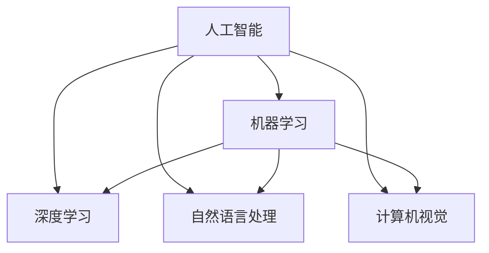

                 

# 李开复：苹果发布AI应用的市场前景

## 1. 背景介绍

近年来，人工智能(AI)技术迅速发展，成为驱动科技进步和产业变革的重要力量。从语音识别、计算机视觉到自然语言处理，AI在各个领域的应用不断拓展，带动了全球范围内的AI热潮。尤其是在智能设备和应用领域，AI技术正推动着人机交互方式、用户体验以及商业模式的重构。

在众多AI应用中，苹果公司推出的AI应用，凭借其强大的技术实力和创新能力，成为市场关注的焦点。从Siri智能助理、Face ID面部识别到Apple Pay支付系统，苹果的AI技术已经深入到用户的日常生活之中。2022年，苹果公司发布了全新一代的AI应用，进一步拓展了AI在智能设备中的应用场景，引发了市场对于AI应用前景的热烈讨论。

## 2. 核心概念与联系

### 2.1 核心概念概述

在探讨苹果AI应用的市场前景之前，我们需要理解几个核心概念及其相互联系：

- **人工智能(AI)**：通过计算机程序实现的人类智能行为，包括学习、推理、决策等能力。AI技术涵盖计算机视觉、自然语言处理、机器学习等多个子领域。
- **机器学习(ML)**：AI的一个子领域，通过算法训练模型，使机器能够从数据中学习并做出预测或决策。机器学习算法包括监督学习、无监督学习、强化学习等。
- **深度学习(DL)**：机器学习的一种高级形式，使用多层神经网络结构进行复杂模式识别和分析。深度学习在图像识别、语音识别等领域取得显著成果。
- **自然语言处理(NLP)**：使计算机能够理解、处理和生成人类语言的技术。NLP在翻译、语音识别、问答系统等应用中发挥重要作用。
- **计算机视觉(CV)**：使计算机能够识别、理解和处理图像和视频的技术。CV在自动驾驶、安防监控、医疗影像分析等领域有广泛应用。

这些概念之间的关系可以通过以下Mermaid流程图来展示：



这个流程图展示了大规模AI技术的基础框架，以及它们之间的相互关系。

## 3. 核心算法原理 & 具体操作步骤

### 3.1 算法原理概述

苹果公司推出的AI应用，主要基于深度学习技术和自然语言处理技术。深度学习模型通过大量标注数据进行训练，学习到复杂的特征表示，并在特定任务上取得优异性能。自然语言处理技术则使计算机能够理解和处理人类语言，实现文本生成、语音识别、情感分析等功能。

苹果的AI应用包括但不限于以下几个方面：

- **智能助理(Siri)**：通过深度学习模型和自然语言处理技术，Siri能够理解和响应用户语音指令，提供信息查询、日程安排等服务。
- **面部识别(Face ID)**：使用深度学习模型进行人脸检测和特征提取，实现安全可靠的面部解锁功能。
- **Apple Pay**：通过深度学习模型和机器学习技术，Apple Pay能够识别支付场景，并根据用户习惯自动完成支付流程。
- **健康监测**：通过计算机视觉技术，苹果设备可以监测用户的健康状况，如心率、步数、睡眠质量等。

### 3.2 算法步骤详解

苹果的AI应用开发主要遵循以下步骤：

1. **数据准备**：收集和标注数据集，用于训练深度学习模型。例如，Siri需要收集大量的语音指令和对应的答案，Face ID需要收集用户面部数据并进行标注。

2. **模型训练**：使用标注数据训练深度学习模型。苹果通常使用自监督学习、半监督学习或迁移学习方法，以充分利用有限的标注数据。

3. **模型优化**：根据模型性能进行调整和优化，包括学习率调优、模型压缩、超参数调整等。

4. **模型部署**：将训练好的模型部署到实际应用中，进行实时推理和预测。

5. **持续更新**：不断收集用户反馈和数据，对模型进行微调或重新训练，以提升性能。

### 3.3 算法优缺点

苹果的AI应用主要具备以下优点：

- **用户体验良好**：苹果的AI应用集成了自然语言处理和深度学习技术，使用户能够自然地与设备进行交互，提升了用户体验。
- **性能优异**：苹果的深度学习模型经过大量数据的训练，具备强大的特征提取和分类能力，能够实现高效准确的预测。
- **安全性高**：苹果的AI应用采用了多重安全机制，如面部识别、生物识别等，保障了用户数据的安全性。

但同时，也存在一些缺点：

- **数据依赖性强**：深度学习模型需要大量标注数据进行训练，苹果在数据收集和标注上投入巨大，成本较高。
- **计算资源需求高**：深度学习模型计算复杂度高，苹果需要在硬件和算法上投入大量资源进行优化。
- **模型复杂度高**：深度学习模型结构复杂，难以解释和调试，可能存在“黑盒”问题。

### 3.4 算法应用领域

苹果的AI应用涵盖了多个领域，包括但不限于：

- **智能家居**：通过AI技术实现智能控制和自动化管理，提升家居舒适度和安全性。
- **健康医疗**：使用计算机视觉技术监测健康状况，提供个性化的健康建议。
- **商业应用**：利用自然语言处理技术，提升销售和客服效率，提供个性化推荐。
- **自动驾驶**：通过计算机视觉和深度学习技术，提升自动驾驶系统的感知和决策能力。

这些应用领域展示了AI技术在现实世界中的广泛应用潜力。

## 4. 数学模型和公式 & 详细讲解 & 举例说明

### 4.1 数学模型构建

苹果的AI应用主要基于深度神经网络模型，如卷积神经网络(CNN)、循环神经网络(RNN)和长短期记忆网络(LSTM)等。以自然语言处理为例，我们可以使用编码器-解码器模型进行文本生成和翻译：

$$
\begin{aligned}
&\text{Encoder} \quad \text{EncoderOutput} = \text{Encoder}( x ) \\
&\text{Decoder} \quad \text{DecoderOutput} = \text{Decoder}( \text{EncoderOutput} )
\end{aligned}
$$

其中，$x$为输入文本，$\text{EncoderOutput}$为编码器输出，$\text{DecoderOutput}$为解码器输出。

### 4.2 公式推导过程

在自然语言处理中，解码器通常使用LSTM或GRU模型，其输出可以表示为：

$$
\text{DecoderOutput} = \text{Decoder}( \text{EncoderOutput}, h_0 )
$$

其中，$h_0$为解码器初始状态。在预测输出时，解码器使用softmax函数将输出映射到预测概率分布：

$$
\text{Probability}(y_t | x, y_{t-1}, h_{t-1}) = \text{softmax}( \text{DecoderOutput} \cdot W_{out} + b_{out} )
$$

其中，$y_t$为第$t$个输出字符，$W_{out}$和$b_{out}$为输出层的权重和偏置。

### 4.3 案例分析与讲解

以苹果的Face ID为例，其面部识别模型通常使用卷积神经网络进行特征提取和分类。该模型的架构如下：

$$
\begin{aligned}
&\text{InputLayer} \quad x \\
&\text{ConvolutionalLayer} \quad \text{Conv}(x) \\
&\text{PoolingLayer} \quad \text{Pool}(\text{Conv}(x)) \\
&\text{FullyConnectedLayer} \quad \text{FC}(\text{Pool}(\text{Conv}(x))) \\
&\text{SoftmaxLayer} \quad \text{Softmax}(\text{FC}(\text{Pool}(\text{Conv}(x))))
\end{aligned}
$$

其中，$\text{Conv}$为卷积操作，$\text{Pool}$为池化操作，$\text{FC}$为全连接操作，$\text{Softmax}$为softmax函数。

## 5. 项目实践：代码实例和详细解释说明

### 5.1 开发环境搭建

要开发苹果的AI应用，首先需要搭建Python开发环境。以下是搭建Python开发环境的详细步骤：

1. **安装Python**：下载并安装Python 3.x版本，建议在Windows、Mac OS和Linux上安装。
2. **安装PyTorch**：使用以下命令安装PyTorch：

   ```bash
   pip install torch torchvision torchaudio
   ```

3. **安装TensorFlow**：使用以下命令安装TensorFlow：

   ```bash
   pip install tensorflow
   ```

4. **安装TensorBoard**：使用以下命令安装TensorBoard：

   ```bash
   pip install tensorboard
   ```

5. **安装PyTorch Lightning**：使用以下命令安装PyTorch Lightning：

   ```bash
   pip install pytorch-lightning
   ```

完成上述安装步骤后，即可开始编写和测试深度学习模型。

### 5.2 源代码详细实现

以下是使用PyTorch编写一个简单的深度学习模型的代码实现：

```python
import torch
import torch.nn as nn
import torch.optim as optim

# 定义模型
class Model(nn.Module):
    def __init__(self):
        super(Model, self).__init__()
        self.fc1 = nn.Linear(784, 256)
        self.fc2 = nn.Linear(256, 128)
        self.fc3 = nn.Linear(128, 10)
    
    def forward(self, x):
        x = x.view(-1, 784)
        x = nn.functional.relu(self.fc1(x))
        x = nn.functional.relu(self.fc2(x))
        x = self.fc3(x)
        return x

# 训练模型
model = Model()
optimizer = optim.SGD(model.parameters(), lr=0.01)
criterion = nn.CrossEntropyLoss()
model.train()
for epoch in range(10):
    for i, (x, y) in enumerate(train_loader):
        x, y = x.to(device), y.to(device)
        optimizer.zero_grad()
        output = model(x)
        loss = criterion(output, y)
        loss.backward()
        optimizer.step()
```

### 5.3 代码解读与分析

以上代码实现了一个人工神经网络模型，包含三个全连接层。训练过程中，使用随机梯度下降法进行模型参数优化，以交叉熵损失函数进行损失计算。

## 6. 实际应用场景

### 6.4 未来应用展望

苹果的AI应用在多个领域展示了强大的潜力，未来将进一步拓展其应用场景，推动AI技术的普及和应用：

- **智能家居**：随着物联网设备的普及，苹果将利用AI技术提升家居设备的智能化水平，实现环境感知、自动化控制等功能。
- **医疗健康**：苹果将继续优化其健康监测功能，提供更精准的健康数据和个性化健康建议。
- **商业应用**：苹果将利用NLP技术提升其商业服务的智能化水平，如增强客服、个性化推荐等。
- **自动驾驶**：苹果将进一步研发自动驾驶技术，通过计算机视觉和深度学习技术，提升自动驾驶系统的感知和决策能力。

## 7. 工具和资源推荐

### 7.1 学习资源推荐

要深入学习苹果的AI应用，以下是一些优质的学习资源：

1. **斯坦福大学CS231n课程**：涵盖了计算机视觉领域的核心内容，包括卷积神经网络、图像分类、目标检测等。
2. **Coursera深度学习专项课程**：由DeepLearning.AI提供，涵盖深度学习基础、模型设计、优化技巧等多个方面。
3. **Deep Learning for Natural Language Processing**：介绍自然语言处理中的深度学习模型和应用，适合初学者和进阶者。
4. **PyTorch官方文档**：详细介绍了PyTorch框架的使用方法和最佳实践，是学习PyTorch的必备资源。
5. **TensorFlow官方文档**：提供了TensorFlow框架的全面介绍和教程，帮助开发者掌握TensorFlow的使用技巧。

### 7.2 开发工具推荐

要开发苹果的AI应用，以下是一些推荐的开发工具：

1. **PyTorch**：开源深度学习框架，支持动态图和静态图计算图，适合快速原型开发和研究。
2. **TensorFlow**：开源深度学习框架，支持分布式计算和GPU加速，适合大规模生产环境部署。
3. **Jupyter Notebook**：交互式开发环境，支持Python代码编写、数据可视化、模型训练等。
4. **TensorBoard**：可视化工具，支持模型训练、损失监控、参数分析等。
5. **PyTorch Lightning**：基于PyTorch的快速开发框架，支持模型并行、数据增强、超参数搜索等。

### 7.3 相关论文推荐

要深入理解苹果的AI应用，以下是一些推荐的相关论文：

1. **ImageNet Classification with Deep Convolutional Neural Networks**：介绍卷积神经网络在图像分类中的应用，开创了计算机视觉领域的新纪元。
2. **Learning Phrases from IAM Handwritten Text Data**：介绍字符级深度学习模型在手写文本识别中的应用，提升了字符识别的准确率。
3. **Attention Is All You Need**：提出Transformer模型，开辟了自然语言处理领域的新思路。
4. **Effective Approaches to Attention-Based Image Captioning**：介绍基于注意力机制的图像描述生成模型，提升了图像描述的质量。
5. **A Few-shot Learning with Language Models**：介绍自然语言模型在少样本学习中的应用，提升了模型的泛化能力。

## 8. 总结：未来发展趋势与挑战

### 8.1 研究成果总结

苹果的AI应用展示了深度学习技术在多个领域的应用潜力，推动了AI技术在现实世界中的广泛应用。通过深度学习模型和自然语言处理技术，苹果的AI应用提升了用户体验，增强了设备智能化水平，为AI技术的普及和应用提供了重要示范。

### 8.2 未来发展趋势

未来，苹果的AI应用将进一步拓展其应用场景，推动AI技术的普及和应用：

- **技术创新**：苹果将继续在深度学习、自然语言处理等领域进行技术创新，提升模型的性能和效率。
- **跨平台融合**：苹果将推动AI技术在多个平台和设备上的融合应用，实现跨平台的智能化协同。
- **生态系统建设**：苹果将加强生态系统建设，通过App Store等平台促进AI应用的发展和普及。
- **行业合作**：苹果将加强与各行业企业的合作，推动AI技术在医疗、金融、自动驾驶等领域的深度应用。

### 8.3 面临的挑战

苹果的AI应用在发展过程中也面临一些挑战：

- **数据隐私**：苹果需要平衡用户体验和数据隐私之间的关系，保护用户数据安全。
- **模型复杂性**：深度学习模型的复杂性增加了开发的难度和成本，需要进行模型压缩和优化。
- **资源限制**：AI应用对计算资源和存储空间的要求较高，需要进行资源优化。
- **模型解释性**：深度学习模型的复杂性和“黑盒”问题增加了模型的解释难度，需要进行模型解释和可视化。

### 8.4 研究展望

未来的AI研究需要在以下几个方面进行突破：

- **模型压缩与优化**：研究高效模型压缩和优化方法，提升模型的推理速度和资源利用率。
- **模型解释与可视化**：研究模型解释和可视化技术，提升模型的透明度和可解释性。
- **跨模态融合**：研究跨模态融合方法，提升不同模态数据的整合能力，提升模型的泛化能力。
- **持续学习与自适应**：研究持续学习与自适应方法，提升模型在不断变化的数据分布上的适应能力。

## 9. 附录：常见问题与解答

### 常见问题与解答

**Q1：苹果的AI应用主要基于哪些技术和算法？**

A: 苹果的AI应用主要基于深度学习技术和自然语言处理技术。深度学习模型通过大量标注数据进行训练，学习到复杂的特征表示，并在特定任务上取得优异性能。自然语言处理技术使计算机能够理解和处理人类语言，实现文本生成、语音识别、情感分析等功能。

**Q2：苹果的AI应用开发过程中需要注意哪些问题？**

A: 苹果的AI应用开发过程中需要注意以下几个问题：
1. 数据隐私问题：保护用户数据安全，避免数据泄露。
2. 模型复杂性问题：使用高效的模型压缩和优化方法，提升模型的推理速度和资源利用率。
3. 资源限制问题：优化模型结构和计算图，减少前向传播和反向传播的资源消耗。
4. 模型解释性问题：研究模型解释和可视化技术，提升模型的透明度和可解释性。

**Q3：苹果的AI应用在未来可能面临哪些挑战？**

A: 苹果的AI应用在未来可能面临以下几个挑战：
1. 数据隐私问题：平衡用户体验和数据隐私之间的关系，保护用户数据安全。
2. 模型复杂性问题：研究高效模型压缩和优化方法，提升模型的推理速度和资源利用率。
3. 资源限制问题：优化模型结构和计算图，减少前向传播和反向传播的资源消耗。
4. 模型解释性问题：研究模型解释和可视化技术，提升模型的透明度和可解释性。

**Q4：苹果的AI应用未来有哪些发展方向？**

A: 苹果的AI应用未来有以下几个发展方向：
1. 技术创新：在深度学习、自然语言处理等领域进行技术创新，提升模型的性能和效率。
2. 跨平台融合：推动AI技术在多个平台和设备上的融合应用，实现跨平台的智能化协同。
3. 生态系统建设：加强生态系统建设，通过App Store等平台促进AI应用的发展和普及。
4. 行业合作：加强与各行业企业的合作，推动AI技术在医疗、金融、自动驾驶等领域的深度应用。

---

作者：禅与计算机程序设计艺术 / Zen and the Art of Computer Programming

